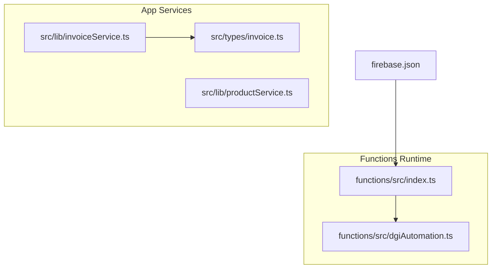
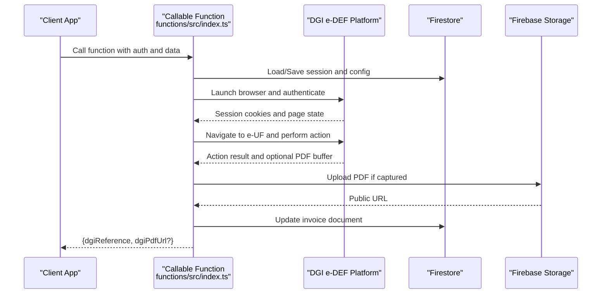
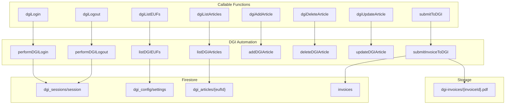
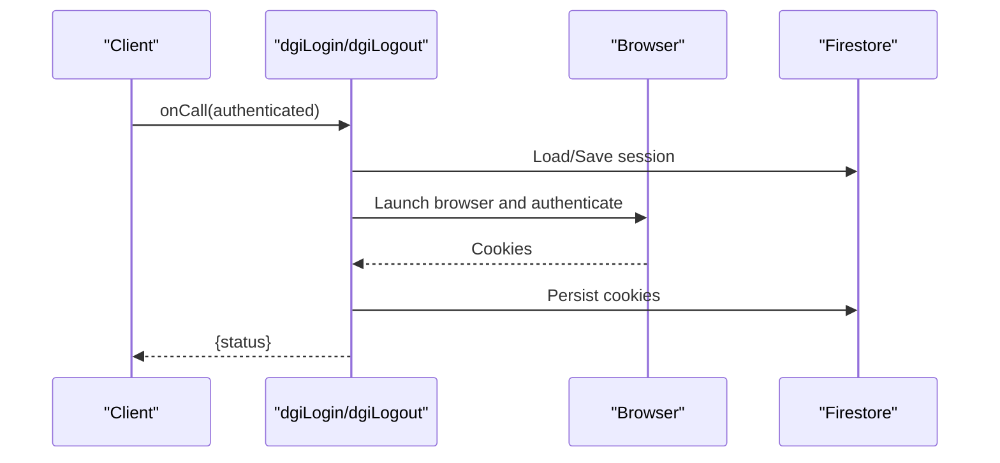
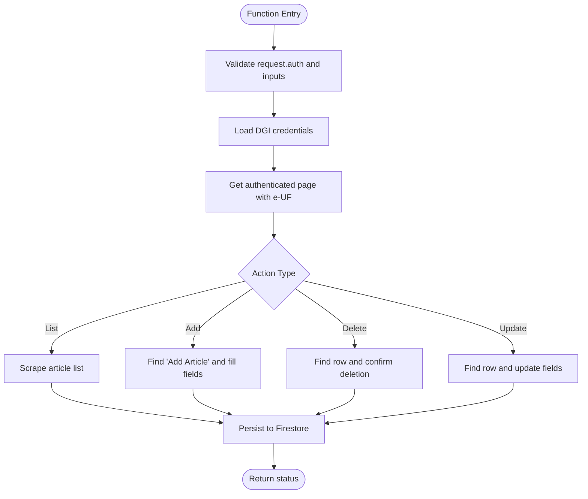
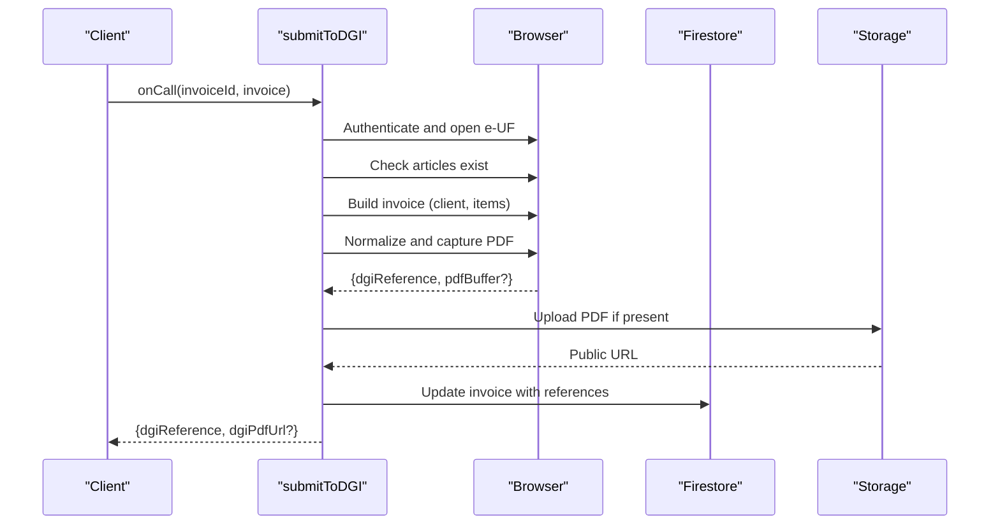
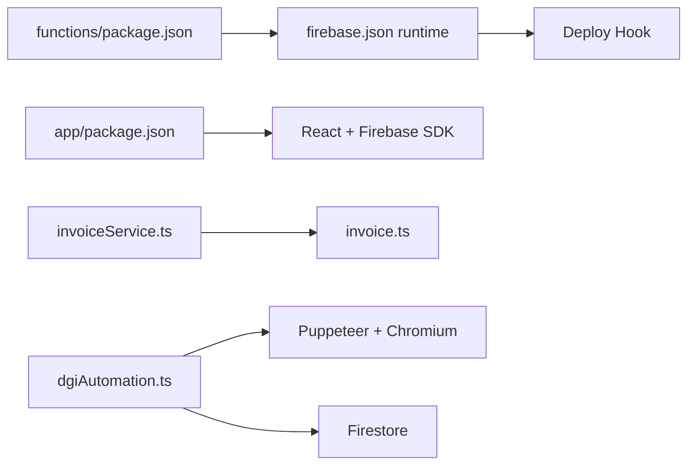

# API Reference

<cite>
**Referenced Files in This Document**
- [index.ts](file://functions/src/index.ts)
- [dgiAutomation.ts](file://functions/src/dgiAutomation.ts)
- [invoiceService.ts](file://src/lib/invoiceService.ts)
- [productService.ts](file://src/lib/productService.ts)
- [invoice.ts](file://src/types/invoice.ts)
- [firebase.json](file://firebase.json)
- [package.json](file://functions/package.json)
- [package.json](file://package.json)
</cite>

## Table of Contents
1. [Introduction](#introduction)
2. [Project Structure](#project-structure)
3. [Core Components](#core-components)
4. [Architecture Overview](#architecture-overview)
5. [Detailed Component Analysis](#detailed-component-analysis)
6. [Dependency Analysis](#dependency-analysis)
7. [Performance Considerations](#performance-considerations)
8. [Troubleshooting Guide](#troubleshooting-guide)
9. [Conclusion](#conclusion)
10. [Appendices](#appendices)

## Introduction
This document provides comprehensive API documentation for ETSMEDF’s serverless functions and service interfaces. It covers:
- HTTP Callable Functions exposed via Firebase Cloud Functions
- DGI automation functions for e-DEF platform integration
- Invoice service APIs for CRUD operations
- Product service endpoints for catalog management
- Utility functions for data transformation
- Practical usage examples, error handling, rate limiting, security, monitoring, versioning, backward compatibility, and deprecation policies

## Project Structure
The project is organized into:
- functions/: Firebase Cloud Functions written in TypeScript
- src/: React application with service libraries for invoices, products, and utilities
- firebase.json: Firebase project configuration including functions runtime and predeploy hook

**Diagram sources**
- [index.ts:1-243](file://functions/src/index.ts#L1-L243)
- [dgiAutomation.ts:1-1325](file://functions/src/dgiAutomation.ts#L1-L1325)
- [invoiceService.ts:1-58](file://src/lib/invoiceService.ts#L1-L58)
- [productService.ts:1-17](file://src/lib/productService.ts#L1-L17)
- [invoice.ts:1-39](file://src/types/invoice.ts#L1-L39)
- [firebase.json:1-11](file://firebase.json#L1-L11)

**Section sources**
- [firebase.json:1-11](file://firebase.json#L1-L11)
- [package.json:1-34](file://functions/package.json#L1-L34)
- [package.json:1-56](file://package.json#L1-L56)

## Core Components
- HTTP Callable Functions (Cloud Functions v2):
  - Authentication: All functions require a valid Firebase Auth session (request.auth must be present)
  - Request/Response: Use Firebase Functions SDK onCall pattern; errors are thrown via HttpsError
  - Secrets: DGI credentials are managed via Firebase secret params
  - Logging: Structured logs via Firebase Functions logger
- DGI Automation:
  - Browser automation using Puppeteer with Chromium on GCF
  - Session persistence via Firestore
  - E-UF selection and article management
  - Invoice submission pipeline with PDF capture
- Firestore-backed Services:
  - Invoice CRUD operations
  - Product catalog retrieval
  - Shared invoice types and calculations

**Section sources**
- [index.ts:1-243](file://functions/src/index.ts#L1-L243)
- [dgiAutomation.ts:1-1325](file://functions/src/dgiAutomation.ts#L1-L1325)
- [invoiceService.ts:1-58](file://src/lib/invoiceService.ts#L1-L58)
- [productService.ts:1-17](file://src/lib/productService.ts#L1-L17)
- [invoice.ts:1-39](file://src/types/invoice.ts#L1-L39)

## Architecture Overview
High-level flow of the system:
- Frontend triggers HTTP Callable Functions
- Functions validate auth, fetch DGI credentials from secrets, and orchestrate browser automation
- Browser automation interacts with DGI e-DEF platform to manage e-UFs, articles, and submit invoices
- Results are persisted to Firestore and optionally stored to Firebase Storage

**Diagram sources**
- [index.ts:42-242](file://functions/src/index.ts#L42-L242)
- [dgiAutomation.ts:347-1286](file://functions/src/dgiAutomation.ts#L347-L1286)

## Detailed Component Analysis

### HTTP Callable Functions
All functions are exported from the functions module and configured with:
- Memory: 2 GiB
- Region: us-central1
- Timeout: 120 seconds for invoice-related functions, 180 seconds for article functions
- Secrets: DGI_USERNAME, DGI_PASSWORD

Authentication and error handling:
- Unauthenticated requests receive “unauthenticated” error
- Missing DGI credentials produce “failed-precondition”
- Internal failures return “internal” with contextual messages

Endpoints summary:
- dgiLogin: Authenticate with DGI and persist session
- dgiLogout: Clear session and log out
- dgiListEUFs: List e-UFs for the authenticated user
- dgiListArticles: List articles for the selected e-UF
- dgiAddArticle: Add an article to the selected e-UF
- dgiDeleteArticle: Delete an article from the selected e-UF
- dgiUpdateArticle: Update article name or price
- submitToDGI: Submit invoice to DGI and optionally upload PDF

Request/Response schemas:
- dgiLogin: No input; returns { status: "logged_in" }
- dgiLogout: No input; returns { status: "logged_out" } or { status: "error", message }
- dgiListEUFs: No input; returns { eufs: DGIEUFEntry[] }
- dgiListArticles: No input; returns { articles: DGIArticle[] }
- dgiAddArticle: { name: string, price: number }; returns { status: "added" }
- dgiDeleteArticle: { name: string }; returns { status: "deleted" }
- dgiUpdateArticle: { name: string, newName?: string, newPrice?: number }; returns { status: "updated" }
- submitToDGI: { invoiceId: string, invoice: DgiInvoiceInput }; returns { dgiReference: string, dgiPdfUrl?: string }

Error handling patterns:
- Validation errors: "invalid-argument"
- Authentication errors: "unauthenticated"
- Precondition errors: "failed-precondition"
- Internal errors: "internal" with message payload

Security considerations:
- All functions require a valid Firebase Auth session
- DGI credentials are stored as Firebase secrets and accessed at runtime
- Sessions are stored in Firestore and reused to avoid repeated logins

Rate limiting:
- Not explicitly implemented in code; consider applying at the caller level or using Firebase quotas

Monitoring:
- Structured logs include uid, counts, URLs, and warnings
- PDF capture is logged with byte sizes; failures are non-blocking

**Section sources**
- [index.ts:22-38](file://functions/src/index.ts#L22-L38)
- [index.ts:42-71](file://functions/src/index.ts#L42-L71)
- [index.ts:75-89](file://functions/src/index.ts#L75-L89)
- [index.ts:93-176](file://functions/src/index.ts#L93-L176)
- [index.ts:180-242](file://functions/src/index.ts#L180-L242)

### DGI Automation Functions
Purpose:
- Manage DGI sessions and e-UF selection
- Scrape and manipulate article catalogs
- Submit invoices and capture PDFs

Key types:
- DgiInvoiceInput: clientName?, clientEmail?, items: DgiInvoiceItem[]
- DgiInvoiceItem: description, quantity, unitPrice
- DgiInvoiceResult: dgiReference, pdfBuffer?
- DGIArticle: name, price, group
- DGIEUFEntry: id, name

Core flows:
- performDGILogin: Launch browser, open login, fill credentials, save cookies to Firestore
- performDGILogout: Restore session, click logout, clear session
- listDGIEUFs: Authenticate, open e-UF list, scrape NIDs and names, merge into Firestore
- listDGIArticles: Navigate to articles, scrape list, save to Firestore per e-UF
- addDGIArticle/deleteDGIArticle/updateDGIArticle: Navigate to articles, locate row, perform action
- submitInvoiceToDGI: Build invoice, normalize, capture PDF, persist references

Validation and robustness:
- checkArticlesExist: Ensures all invoice items exist in DGI before submission
- Session reuse: Cookies restored from Firestore; re-login if expired
- Navigation resilience: Multiple strategies to find navigation targets and fallback URLs

**Section sources**
- [dgiAutomation.ts:15-42](file://functions/src/dgiAutomation.ts#L15-L42)
- [dgiAutomation.ts:347-391](file://functions/src/dgiAutomation.ts#L347-L391)
- [dgiAutomation.ts:536-594](file://functions/src/dgiAutomation.ts#L536-L594)
- [dgiAutomation.ts:990-1054](file://functions/src/dgiAutomation.ts#L990-L1054)
- [dgiAutomation.ts:1261-1286](file://functions/src/dgiAutomation.ts#L1261-L1286)

### Invoice Service APIs
Operations:
- createInvoice: Persist invoice with createdAt timestamp
- getInvoices: Retrieve all invoices ordered by createdAt desc
- getInvoice: Retrieve single invoice by id
- updateInvoiceStatus: Update invoice status
- deleteInvoice: Remove invoice

Data model:
- Invoice fields include identifiers, client info, dates, items, status, and DGI metadata
- Helper functions calculate subtotal, TVA (16%), and total

**Section sources**
- [invoiceService.ts:1-58](file://src/lib/invoiceService.ts#L1-L58)
- [invoice.ts:9-24](file://src/types/invoice.ts#L9-L24)
- [invoice.ts:28-38](file://src/types/invoice.ts#L28-L38)

### Product Service Endpoints
Operations:
- getProducts: Fetch product catalog from Firestore

Data model:
- Product fields include id, name, price, unit, barcode, groupId

**Section sources**
- [productService.ts:1-17](file://src/lib/productService.ts#L1-L17)

### Utility Functions
- cn: Tailwind class merging utility

**Section sources**
- [utils.ts:1-7](file://src/lib/utils.ts#L1-L7)

## Architecture Overview

**Diagram sources**
- [index.ts:42-242](file://functions/src/index.ts#L42-L242)
- [dgiAutomation.ts:347-1286](file://functions/src/dgiAutomation.ts#L347-L1286)
- [invoiceService.ts:1-58](file://src/lib/invoiceService.ts#L1-L58)

## Detailed Component Analysis

### DGI Login/Logout Flow

**Diagram sources**
- [index.ts:42-71](file://functions/src/index.ts#L42-L71)
- [dgiAutomation.ts:347-391](file://functions/src/dgiAutomation.ts#L347-L391)

**Section sources**
- [index.ts:42-71](file://functions/src/index.ts#L42-L71)
- [dgiAutomation.ts:347-391](file://functions/src/dgiAutomation.ts#L347-L391)

### Article Management Flow

**Diagram sources**
- [index.ts:93-176](file://functions/src/index.ts#L93-L176)
- [dgiAutomation.ts:990-1054](file://functions/src/dgiAutomation.ts#L990-L1054)

**Section sources**
- [index.ts:93-176](file://functions/src/index.ts#L93-L176)
- [dgiAutomation.ts:990-1054](file://functions/src/dgiAutomation.ts#L990-L1054)

### Invoice Submission Flow

**Diagram sources**
- [index.ts:180-242](file://functions/src/index.ts#L180-L242)
- [dgiAutomation.ts:1261-1286](file://functions/src/dgiAutomation.ts#L1261-L1286)

**Section sources**
- [index.ts:180-242](file://functions/src/index.ts#L180-L242)
- [dgiAutomation.ts:1261-1286](file://functions/src/dgiAutomation.ts#L1261-L1286)

## Dependency Analysis
- Functions runtime and deployment:
  - firebase.json sets runtime to nodejs20 and builds functions before deploy
  - functions/package.json pins Node 20 and defines build/lint scripts
- Frontend dependencies:
  - React, TanStack Router, Firebase SDK, and Tailwind CSS
- Internal dependencies:
  - invoiceService.ts depends on Firestore and shared invoice types
  - dgiAutomation.ts depends on Puppeteer, Chromium, and Firestore

**Diagram sources**
- [firebase.json:1-11](file://firebase.json#L1-L11)
- [package.json:1-34](file://functions/package.json#L1-L34)
- [package.json:1-56](file://package.json#L1-L56)
- [invoiceService.ts:1-58](file://src/lib/invoiceService.ts#L1-L58)
- [invoice.ts:1-39](file://src/types/invoice.ts#L1-L39)
- [dgiAutomation.ts:1-1325](file://functions/src/dgiAutomation.ts#L1-L1325)

**Section sources**
- [firebase.json:1-11](file://firebase.json#L1-L11)
- [package.json:1-34](file://functions/package.json#L1-L34)
- [package.json:1-56](file://package.json#L1-L56)

## Performance Considerations
- Browser startup and navigation:
  - Headless Chromium launch adds overhead; reuse sessions to minimize cold starts
  - Network idle waits prevent premature DOM reads
- Timeouts:
  - Invoice functions: 120 seconds
  - Article functions: 180 seconds
- PDF capture:
  - Optional and non-blocking; failures are logged and do not block invoice updates
- Firestore writes:
  - Batch updates and merges are used to avoid redundant writes

[No sources needed since this section provides general guidance]

## Troubleshooting Guide
Common error scenarios and resolutions:
- Missing or invalid auth:
  - Symptom: “unauthenticated”
  - Resolution: Ensure client is signed in before calling functions
- Missing DGI credentials:
  - Symptom: “failed-precondition”
  - Resolution: Configure DGI_USERNAME and DGI_PASSWORD secrets
- Internal failures:
  - Symptom: “internal” with message
  - Resolution: Check logs for DGI-specific messages; verify network connectivity and DGI availability
- Articles missing during invoice submission:
  - Symptom: Error indicating missing articles
  - Resolution: Add articles to DGI catalog for the selected e-UF before submitting
- PDF not captured:
  - Symptom: No dgiPdfUrl returned
  - Resolution: PDF capture is non-blocking; verify browser automation and DGI response

**Section sources**
- [index.ts:31-38](file://functions/src/index.ts#L31-L38)
- [index.ts:42-71](file://functions/src/index.ts#L42-L71)
- [index.ts:180-242](file://functions/src/index.ts#L180-L242)
- [dgiAutomation.ts:817-844](file://functions/src/dgiAutomation.ts#L817-L844)

## Conclusion
ETSMEDF exposes a cohesive set of HTTP Callable Functions backed by robust DGI automation and Firestore-driven services. The APIs enforce authentication, leverage secrets for sensitive data, and provide structured logging for observability. By following the documented patterns and troubleshooting steps, integrators can reliably manage e-DEF workflows, maintain article catalogs, and process invoices.

[No sources needed since this section summarizes without analyzing specific files]

## Appendices

### API Definitions

- dgiLogin
  - Method: Callable
  - Auth: Required
  - Input: None
  - Output: { status: "logged_in" }
  - Errors: "unauthenticated", "internal"

- dgiLogout
  - Method: Callable
  - Auth: Required
  - Input: None
  - Output: { status: "logged_out" } or { status: "error", message }
  - Errors: "unauthenticated", "internal"

- dgiListEUFs
  - Method: Callable
  - Auth: Required
  - Input: None
  - Output: { eufs: [ { id: string, name: string } ] }
  - Errors: "unauthenticated", "internal"

- dgiListArticles
  - Method: Callable
  - Auth: Required
  - Input: None
  - Output: { articles: [ { name: string, price: number, group: string } ] }
  - Errors: "unauthenticated", "internal"

- dgiAddArticle
  - Method: Callable
  - Auth: Required
  - Input: { name: string, price: number }
  - Output: { status: "added" }
  - Errors: "unauthenticated", "invalid-argument", "internal"

- dgiDeleteArticle
  - Method: Callable
  - Auth: Required
  - Input: { name: string }
  - Output: { status: "deleted" }
  - Errors: "unauthenticated", "invalid-argument", "internal"

- dgiUpdateArticle
  - Method: Callable
  - Auth: Required
  - Input: { name: string, newName?: string, newPrice?: number }
  - Output: { status: "updated" }
  - Errors: "unauthenticated", "invalid-argument", "internal"

- submitToDGI
  - Method: Callable
  - Auth: Required
  - Input: { invoiceId: string, invoice: DgiInvoiceInput }
  - Output: { dgiReference: string, dgiPdfUrl?: string }
  - Errors: "unauthenticated", "invalid-argument", "internal"

**Section sources**
- [index.ts:42-242](file://functions/src/index.ts#L42-L242)

### Data Models

- DgiInvoiceInput
  - Fields: clientName?, clientEmail?, items: DgiInvoiceItem[]
- DgiInvoiceItem
  - Fields: description, quantity, unitPrice
- DgiInvoiceResult
  - Fields: dgiReference, pdfBuffer?
- DGIArticle
  - Fields: name, price, group
- DGIEUFEntry
  - Fields: id, name
- Invoice
  - Fields: id?, invoiceNumber, clientName, clientEmail?, clientAddress?, issueDate, dueDate, items: InvoiceItem[], notes?, status: "draft"|"sent"|"paid", createdAt?, dgiReference?, dgiPdfUrl?, dgiSubmittedAt?

**Section sources**
- [dgiAutomation.ts:15-42](file://functions/src/dgiAutomation.ts#L15-L42)
- [invoice.ts:1-39](file://src/types/invoice.ts#L1-L39)

### Security and Monitoring
- Security
  - Auth requirement enforced on all functions
  - Credentials stored as Firebase secrets
  - Sessions stored in Firestore and reused
- Monitoring
  - Structured logs include operation outcomes, counts, and warnings
  - PDF capture logs indicate success or failure

**Section sources**
- [index.ts:42-71](file://functions/src/index.ts#L42-L71)
- [index.ts:180-242](file://functions/src/index.ts#L180-L242)
- [dgiAutomation.ts:347-391](file://functions/src/dgiAutomation.ts#L347-L391)

### Rate Limiting, Versioning, Compatibility, and Deprecation
- Rate limiting
  - Not implemented in code; consider client-side throttling or platform quotas
- Versioning
  - No explicit API versioning; consider path/version prefixes in future iterations
- Backward compatibility
  - Maintain stable request/response shapes; avoid removing required fields
- Deprecation
  - Introduce deprecation headers or staged removal with advance notice

[No sources needed since this section provides general guidance]