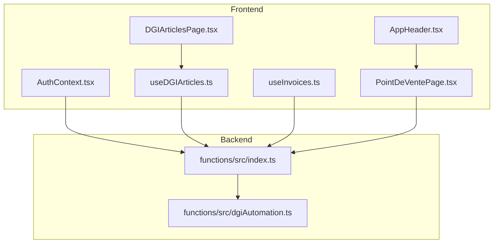
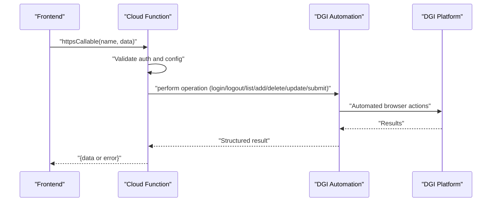
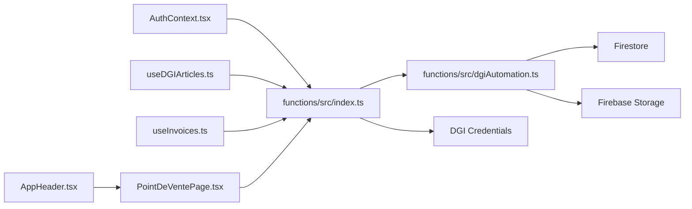

# DGI Functions

<cite>
**Referenced Files in This Document**
- [index.ts](file://functions/src/index.ts)
- [dgiAutomation.ts](file://functions/src/dgiAutomation.ts)
- [index.js](file://functions/lib/index.js)
- [dgiAutomation.js](file://functions/lib/dgiAutomation.js)
- [AuthContext.tsx](file://src/contexts/AuthContext.tsx)
- [useDGIArticles.ts](file://src/hooks/useDGIArticles.ts)
- [useInvoices.ts](file://src/hooks/useInvoices.ts)
- [DGIArticlesPage.tsx](file://src/pages/DGIArticlesPage.tsx)
- [PointDeVentePage.tsx](file://src/pages/PointDeVentePage.tsx)
- [AppHeader.tsx](file://src/components/AppHeader.tsx)
</cite>

## Table of Contents
1. [Introduction](#introduction)
2. [Project Structure](#project-structure)
3. [Core Components](#core-components)
4. [Architecture Overview](#architecture-overview)
5. [Detailed Component Analysis](#detailed-component-analysis)
6. [Dependency Analysis](#dependency-analysis)
7. [Performance Considerations](#performance-considerations)
8. [Troubleshooting Guide](#troubleshooting-guide)
9. [Conclusion](#conclusion)

## Introduction
This document provides comprehensive API documentation for DGI-related serverless functions used to integrate with the DGI (Direction Générale des Impôts) e-DEF platform. It covers authentication functions (dgiLogin, dgiLogout), article management functions (dgiListArticles, dgiAddArticle, dgiDeleteArticle, dgiUpdateArticle), point-of-sale retrieval (dgiListEUFs), and invoice submission (submitToDGI). For each function, you will find HTTP method, URL pattern, request/response schemas, authentication requirements, parameter validation rules, error codes, return value formats, practical invocation examples, security considerations, rate limiting policies, monitoring approaches, and troubleshooting guidance.

## Project Structure
The DGI integration spans two layers:
- Frontend (React): Invokes callable Cloud Functions via Firebase and manages UI flows for authentication, article management, and invoice submission.
- Backend (Cloud Functions): Implements callable functions and orchestrates browser automation against the DGI platform.

**Diagram sources**
- [AuthContext.tsx:38-48](file://src/contexts/AuthContext.tsx#L38-L48)
- [useDGIArticles.ts:46-106](file://src/hooks/useDGIArticles.ts#L46-L106)
- [useInvoices.ts:60-89](file://src/hooks/useInvoices.ts#L60-L89)
- [DGIArticlesPage.tsx:20-27](file://src/pages/DGIArticlesPage.tsx#L20-L27)
- [PointDeVentePage.tsx:19-69](file://src/pages/PointDeVentePage.tsx#L19-L69)
- [AppHeader.tsx:104-137](file://src/components/AppHeader.tsx#L104-L137)
- [index.ts:42-242](file://functions/src/index.ts#L42-L242)
- [dgiAutomation.ts:1072-1385](file://functions/src/dgiAutomation.ts#L1072-L1385)

**Section sources**
- [index.ts:42-242](file://functions/src/index.ts#L42-L242)
- [dgiAutomation.ts:1072-1385](file://functions/src/dgiAutomation.ts#L1072-L1385)
- [AuthContext.tsx:38-48](file://src/contexts/AuthContext.tsx#L38-L48)
- [useDGIArticles.ts:46-106](file://src/hooks/useDGIArticles.ts#L46-L106)
- [useInvoices.ts:60-89](file://src/hooks/useInvoices.ts#L60-L89)
- [DGIArticlesPage.tsx:20-27](file://src/pages/DGIArticlesPage.tsx#L20-L27)
- [PointDeVentePage.tsx:19-69](file://src/pages/PointDeVentePage.tsx#L19-L69)
- [AppHeader.tsx:104-137](file://src/components/AppHeader.tsx#L104-L137)

## Core Components
- Callable Functions (Firebase Cloud Functions):
  - Authentication: dgiLogin, dgiLogout
  - Article Management: dgiListArticles, dgiAddArticle, dgiDeleteArticle, dgiUpdateArticle
  - Point-of-Sale: dgiListEUFs
  - Invoice Submission: submitToDGI
- Browser Automation:
  - Session management, login, logout, article listing, article CRUD, EUF selection, invoice building, normalization, and PDF capture/upload.

**Section sources**
- [index.ts:42-242](file://functions/src/index.ts#L42-L242)
- [dgiAutomation.ts:1072-1385](file://functions/src/dgiAutomation.ts#L1072-L1385)

## Architecture Overview
The system uses Firebase Cloud Functions callable triggers invoked by the frontend. Each function validates authentication, loads DGI credentials, and delegates to automation routines that drive a headless browser to interact with the DGI platform. Results are returned to the client and persisted to Firestore and optionally to Firebase Storage.

**Diagram sources**
- [index.ts:42-242](file://functions/src/index.ts#L42-L242)
- [dgiAutomation.ts:1072-1385](file://functions/src/dgiAutomation.ts#L1072-L1385)

## Detailed Component Analysis

### Authentication Functions

#### dgiLogin
- HTTP Method: Not applicable (callable function)
- URL Pattern: Not applicable (callable function)
- Invocation: httpsCallable("dgiLogin", {})
- Authentication: Requires Firebase Authenticated user
- Request Schema: {}
- Response Schema: { status: "logged_in" } or throws error
- Validation Rules:
  - Requires request.auth (unauthenticated error if missing)
  - Requires DGI credentials configured (failed-precondition if missing)
- Error Codes:
  - unauthenticated: Login required
  - internal: DGI login failed: <reason>
  - failed-precondition: DGI credentials not configured
- Behavior:
  - Launches browser, authenticates, saves session cookies to Firestore
- Monitoring:
  - Logs success/failure with uid
- Security:
  - Uses authenticated context; credentials loaded from secure configuration

**Section sources**
- [index.ts:42-56](file://functions/src/index.ts#L42-L56)
- [index.js:61-76](file://functions/lib/index.js#L61-L76)

#### dgiLogout
- HTTP Method: Not applicable (callable function)
- URL Pattern: Not applicable (callable function)
- Invocation: httpsCallable("dgiLogout", {})
- Authentication: Requires Firebase Authenticated user
- Request Schema: {}
- Response Schema: { status: "logged_out" } or { status: "error", message: string }
- Validation Rules:
  - Requires request.auth (unauthenticated error if missing)
- Error Codes:
  - unauthenticated: Login required
  - internal: DGI logout failed: <reason> (wrapped)
- Behavior:
  - Cleans up browser session and logs out
- Monitoring:
  - Logs success/failure with uid
- Security:
  - Uses authenticated context

**Section sources**
- [index.ts:58-71](file://functions/src/index.ts#L58-L71)
- [index.js:77-91](file://functions/lib/index.js#L77-L91)

### Article Management Functions

#### dgiListArticles
- HTTP Method: Not applicable (callable function)
- URL Pattern: Not applicable (callable function)
- Invocation: httpsCallable("dgiListArticles", {})
- Authentication: Requires Firebase Authenticated user
- Request Schema: {}
- Response Schema: { articles: [{ name: string, price: number, group?: string }] }
- Validation Rules:
  - Requires request.auth (unauthenticated error if missing)
- Error Codes:
  - unauthenticated: Login required
  - internal: DGI articles listing failed: <reason>
- Behavior:
  - Loads articles from DGI platform for the selected EUF
- Monitoring:
  - Logs success/failure and article count
- Security:
  - Uses authenticated context

**Section sources**
- [index.ts:92-107](file://functions/src/index.ts#L92-L107)
- [index.js:92-110](file://functions/lib/index.js#L92-L110)

#### dgiAddArticle
- HTTP Method: Not applicable (callable function)
- URL Pattern: Not applicable (callable function)
- Invocation: httpsCallable("dgiAddArticle", { name: string, price: number })
- Authentication: Requires Firebase Authenticated user
- Request Schema: { name: string, price: number }
- Response Schema: { status: "added" }
- Validation Rules:
  - Requires request.auth (unauthenticated error if missing)
  - Requires name and price (invalid-argument if missing)
- Error Codes:
  - unauthenticated: Login required
  - invalid-argument: name and price required
  - internal: DGI add article failed: <reason>
- Behavior:
  - Adds a new article to DGI platform
- Monitoring:
  - Logs success/failure with article name
- Security:
  - Uses authenticated context

**Section sources**
- [index.ts:108-129](file://functions/src/index.ts#L108-L129)
- [index.js:111-130](file://functions/lib/index.js#L111-L130)

#### dgiDeleteArticle
- HTTP Method: Not applicable (callable function)
- URL Pattern: Not applicable (callable function)
- Invocation: httpsCallable("dgiDeleteArticle", { name: string })
- Authentication: Requires Firebase Authenticated user
- Request Schema: { name: string }
- Response Schema: { status: "deleted" }
- Validation Rules:
  - Requires request.auth (unauthenticated error if missing)
  - Requires name (invalid-argument if missing)
- Error Codes:
  - unauthenticated: Login required
  - invalid-argument: name required
  - internal: DGI delete article failed: <reason>
- Behavior:
  - Deletes an article from DGI platform
- Monitoring:
  - Logs success/failure with article name
- Security:
  - Uses authenticated context

**Section sources**
- [index.ts:130-151](file://functions/src/index.ts#L130-L151)
- [index.js:131-164](file://functions/lib/index.js#L131-L164)

#### dgiUpdateArticle
- HTTP Method: Not applicable (callable function)
- URL Pattern: Not applicable (callable function)
- Invocation: httpsCallable("dgiUpdateArticle", { name: string, newName?: string, newPrice?: number })
- Authentication: Requires Firebase Authenticated user
- Request Schema: { name: string, newName?: string, newPrice?: number }
- Response Schema: { status: "updated" }
- Validation Rules:
  - Requires request.auth (unauthenticated error if missing)
  - Requires name (invalid-argument if missing)
  - Requires newName or newPrice (invalid-argument if both missing)
- Error Codes:
  - unauthenticated: Login required
  - invalid-argument: name required; newName or newPrice required
  - internal: DGI update article failed: <reason>
- Behavior:
  - Updates an existing article on DGI platform
- Monitoring:
  - Logs success/failure with article name and changes
- Security:
  - Uses authenticated context

**Section sources**
- [index.ts:152-186](file://functions/src/index.ts#L152-L186)
- [index.js:165-186](file://functions/lib/index.js#L165-L186)

### Point-of-Sale Functions

#### dgiListEUFs
- HTTP Method: Not applicable (callable function)
- URL Pattern: Not applicable (callable function)
- Invocation: httpsCallable("dgiListEUFs", {})
- Authentication: Requires Firebase Authenticated user
- Request Schema: {}
- Response Schema: { eufs: [{ id: string, name: string }] }
- Validation Rules:
  - Requires request.auth (unauthenticated error if missing)
- Error Codes:
  - unauthenticated: Login required
  - internal: DGI e-DEF list failed: <reason>
- Behavior:
  - Scrapes and returns available EUFs for the authenticated DGI account
- Monitoring:
  - Logs success/failure and EUF count
- Security:
  - Uses authenticated context

**Section sources**
- [index.ts:75-89](file://functions/src/index.ts#L75-L89)
- [index.js:92-110](file://functions/lib/index.js#L92-L110)

### Invoice Submission Function

#### submitToDGI
- HTTP Method: Not applicable (callable function)
- URL Pattern: Not applicable (callable function)
- Invocation: httpsCallable("submitToDGI", { invoiceId: string, invoice: Invoice })
- Authentication: Requires Firebase Authenticated user
- Request Schema:
  - invoiceId: string (required)
  - invoice: {
      clientName?: string
      clientEmail?: string
      clientAddress?: string
      items: [{ description: string, quantity: number, unitPrice: number }]
    }
- Response Schema: { dgiReference: string, dgiPdfUrl?: string }
- Validation Rules:
  - Requires request.auth (unauthenticated error if missing)
  - Requires invoiceId and invoice.items (invalid-argument if missing)
- Error Codes:
  - unauthenticated: Login required
  - invalid-argument: invoiceId and items required
  - internal: <specific DGI error message> (propagated)
- Behavior:
  - Selects active EUF, verifies article existence, builds invoice, normalizes, captures PDF if available, uploads to Firebase Storage, updates Firestore invoice document
- Monitoring:
  - Logs start, PDF capture attempts, Firestore updates, completion
- Security:
  - Uses authenticated context; sensitive data handled securely

**Section sources**
- [index.ts:187-242](file://functions/src/index.ts#L187-L242)
- [index.js:187-242](file://functions/lib/index.js#L187-L242)

### Frontend Integration Examples

#### Authentication Flow
- Login:
  - Call httpsCallable("dgiLogin", {}) after Firebase sign-in
  - Non-blocking call to avoid delaying UI
- Logout:
  - Call httpsCallable("dgiLogout", {}) before Firebase sign-out

**Section sources**
- [AuthContext.tsx:38-48](file://src/contexts/AuthContext.tsx#L38-L48)

#### Article Management
- List Articles:
  - Use httpsCallable("dgiListArticles", {}) via hook
- Add Article:
  - Use httpsCallable("dgiAddArticle", { name, price })
- Delete Article:
  - Use httpsCallable("dgiDeleteArticle", { name })
- Update Article:
  - Use httpsCallable("dgiUpdateArticle", { name, newName?, newPrice? })

**Section sources**
- [useDGIArticles.ts:46-106](file://src/hooks/useDGIArticles.ts#L46-L106)
- [DGIArticlesPage.tsx:20-27](file://src/pages/DGIArticlesPage.tsx#L20-L27)

#### Invoice Submission
- Submit Invoice:
  - Use httpsCallable("submitToDGI", { invoiceId, invoice })
  - Frontend receives { dgiReference, dgiPdfUrl? }

**Section sources**
- [useInvoices.ts:60-89](file://src/hooks/useInvoices.ts#L60-L89)

## Dependency Analysis

**Diagram sources**
- [index.ts:42-242](file://functions/src/index.ts#L42-L242)
- [dgiAutomation.ts:1072-1385](file://functions/src/dgiAutomation.ts#L1072-L1385)
- [AuthContext.tsx:38-48](file://src/contexts/AuthContext.tsx#L38-L48)
- [useDGIArticles.ts:46-106](file://src/hooks/useDGIArticles.ts#L46-L106)
- [useInvoices.ts:60-89](file://src/hooks/useInvoices.ts#L60-L89)
- [PointDeVentePage.tsx:19-69](file://src/pages/PointDeVentePage.tsx#L19-L69)
- [AppHeader.tsx:104-137](file://src/components/AppHeader.tsx#L104-L137)

**Section sources**
- [index.ts:42-242](file://functions/src/index.ts#L42-L242)
- [dgiAutomation.ts:1072-1385](file://functions/src/dgiAutomation.ts#L1072-L1385)
- [AuthContext.tsx:38-48](file://src/contexts/AuthContext.tsx#L38-L48)
- [useDGIArticles.ts:46-106](file://src/hooks/useDGIArticles.ts#L46-L106)
- [useInvoices.ts:60-89](file://src/hooks/useInvoices.ts#L60-L89)
- [PointDeVentePage.tsx:19-69](file://src/pages/PointDeVentePage.tsx#L19-L69)
- [AppHeader.tsx:104-137](file://src/components/AppHeader.tsx#L104-L137)

## Performance Considerations
- Browser Launch Overhead:
  - Each function launches a browser; reuse sessions where possible (automation handles session restoration)
- Network Latency:
  - DGI platform responsiveness affects function duration; timeouts are configured in automation
- Concurrency:
  - Limit simultaneous submissions; queue invoice submissions to avoid platform overload
- Caching:
  - Use cached EUF lists and article caches to minimize repeated scraping
- Retry Strategy:
  - Implement exponential backoff for transient failures; avoid retry storms

[No sources needed since this section provides general guidance]

## Troubleshooting Guide

Common Error Scenarios and Fixes:
- Unauthenticated:
  - Cause: Missing Firebase Auth context
  - Fix: Ensure user is signed in before invoking functions
- Invalid Argument:
  - Causes: Missing required fields (e.g., name, invoiceId, items)
  - Fix: Validate inputs before calling functions
- Internal Errors:
  - Causes: DGI login failure, article operations failure, invoice submission failure
  - Fix: Inspect logs; verify credentials; confirm EUF selection; check article availability
- Credentials Not Configured:
  - Cause: Missing DGI credentials
  - Fix: Configure credentials and retry
- PDF Capture Failure:
  - Cause: No PDF buffer captured or storage upload failure
  - Fix: Check storage permissions and network; PDF upload is non-blocking

Monitoring Approaches:
- Enable Cloud Functions logs for each function
- Track request IDs and user IDs in logs
- Observe Firestore writes for invoice updates
- Monitor Firebase Storage for PDF uploads

Security Considerations:
- Keep DGI credentials secure; avoid logging sensitive data
- Use authenticated contexts for all functions
- Limit scope of browser automation to necessary actions
- Rotate credentials periodically

**Section sources**
- [index.ts:42-242](file://functions/src/index.ts#L42-L242)
- [index.js:61-242](file://functions/lib/index.js#L61-L242)
- [dgiAutomation.ts:1072-1385](file://functions/src/dgiAutomation.ts#L1072-L1385)

## Conclusion
The DGI integration leverages Firebase Cloud Functions and browser automation to manage DGI operations. Functions are designed with strict authentication, robust validation, and clear error handling. By following the documented schemas, invocation patterns, and troubleshooting steps, teams can reliably integrate with the DGI platform while maintaining security and observability.