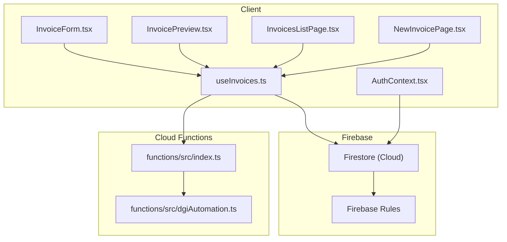
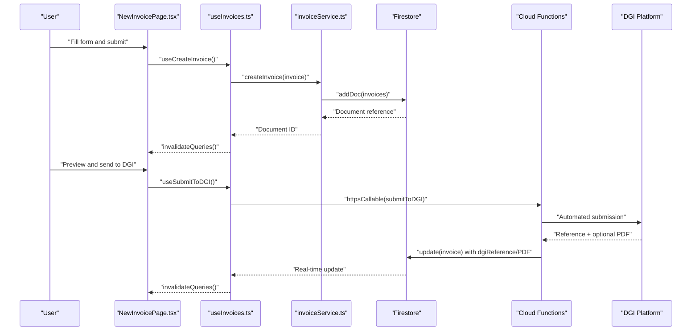
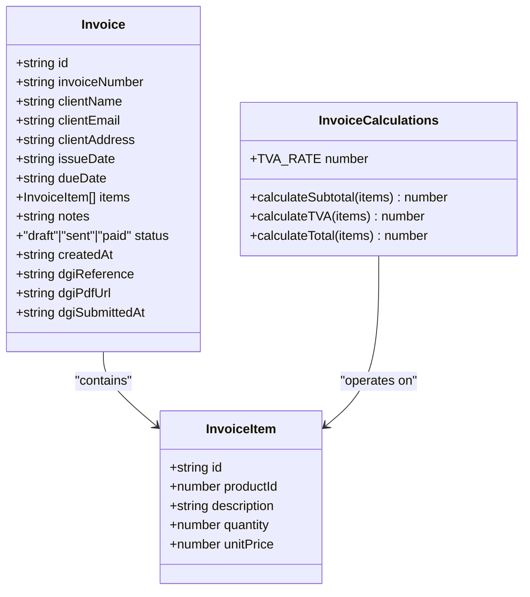
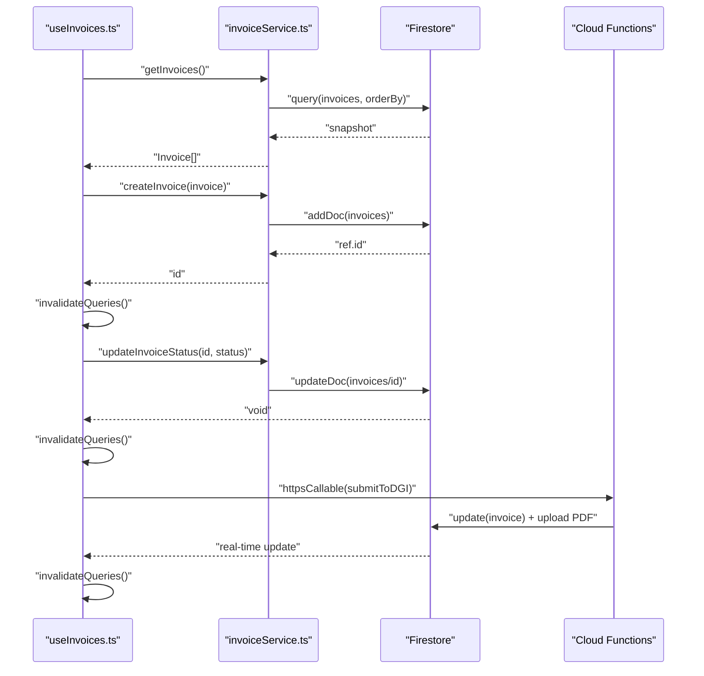
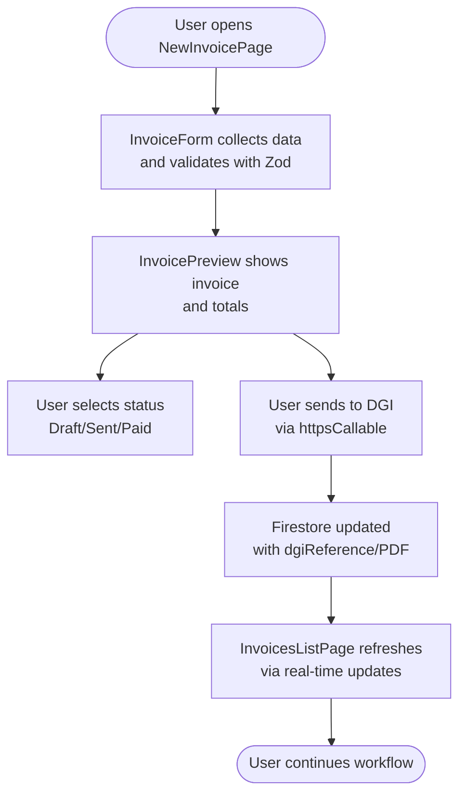
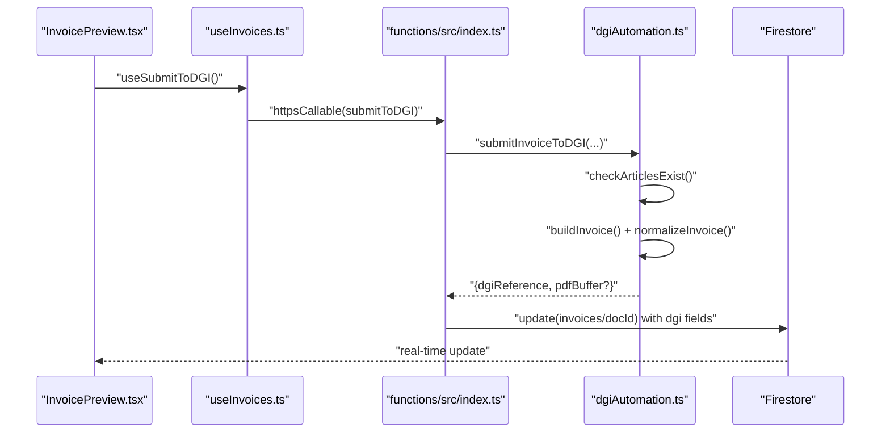
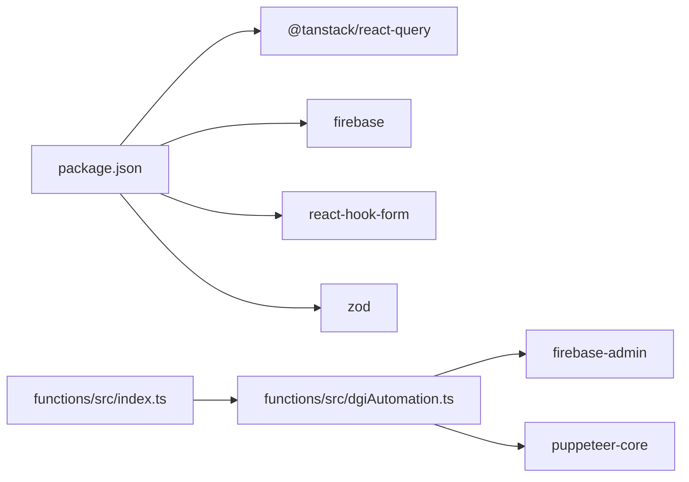

# Invoice Services

<cite>
**Referenced Files in This Document**
- [invoiceService.ts](file://src/lib/invoiceService.ts)
- [invoice.ts](file://src/types/invoice.ts)
- [useInvoices.ts](file://src/hooks/useInvoices.ts)
- [NewInvoicePage.tsx](file://src/pages/NewInvoicePage.tsx)
- [InvoicesListPage.tsx](file://src/pages/InvoicesListPage.tsx)
- [InvoiceForm.tsx](file://src/components/InvoiceForm.tsx)
- [InvoicePreview.tsx](file://src/components/InvoicePreview.tsx)
- [firebase.ts](file://src/lib/firebase.ts)
- [AuthContext.tsx](file://src/contexts/AuthContext.tsx)
- [index.ts](file://functions/src/index.ts)
- [dgiAutomation.ts](file://functions/src/dgiAutomation.ts)
- [useDGIStatus.ts](file://src/hooks/useDGIStatus.ts)
- [firestore.rules](file://firestore.rules)
- [package.json](file://package.json)
</cite>

## Table of Contents
1. [Introduction](#introduction)
2. [Project Structure](#project-structure)
3. [Core Components](#core-components)
4. [Architecture Overview](#architecture-overview)
5. [Detailed Component Analysis](#detailed-component-analysis)
6. [Dependency Analysis](#dependency-analysis)
7. [Performance Considerations](#performance-considerations)
8. [Troubleshooting Guide](#troubleshooting-guide)
9. [Conclusion](#conclusion)

## Introduction
This document provides comprehensive API documentation for the invoice service endpoints and client-side invoice management functions. It covers CRUD operations for invoices, request/response schemas, validation rules, business logic constraints, authentication and authorization patterns, real-time synchronization, optimistic UI patterns, offline capabilities, and performance optimization techniques. The system integrates a Firebase backend with Cloud Functions for automated submissions to the DGI (Direction Générale des Impôts) platform.

## Project Structure
The project follows a React client with Firebase integration and a Firebase Functions backend. Key areas:
- Client-side invoice management: React components, hooks, and services
- Backend invoice operations: Firestore CRUD and Cloud Functions for DGI automation
- Authentication and authorization: Firebase Auth and Firestore security rules
- Real-time updates: Firestore queries and React Query cache invalidation

**Diagram sources**
- [InvoiceForm.tsx:1-343](file://src/components/InvoiceForm.tsx#L1-L343)
- [InvoicePreview.tsx:1-347](file://src/components/InvoicePreview.tsx#L1-L347)
- [InvoicesListPage.tsx:1-174](file://src/pages/InvoicesListPage.tsx#L1-L174)
- [NewInvoicePage.tsx:1-45](file://src/pages/NewInvoicePage.tsx#L1-L45)
- [useInvoices.ts:1-90](file://src/hooks/useInvoices.ts#L1-L90)
- [AuthContext.tsx:1-62](file://src/contexts/AuthContext.tsx#L1-L62)
- [firebase.ts:1-23](file://src/lib/firebase.ts#L1-L23)
- [firestore.rules:1-9](file://firestore.rules#L1-L9)
- [index.ts:1-243](file://functions/src/index.ts#L1-L243)
- [dgiAutomation.ts:1-1386](file://functions/src/dgiAutomation.ts#L1-L1386)

**Section sources**
- [package.json:1-56](file://package.json#L1-L56)
- [firebase.ts:1-23](file://src/lib/firebase.ts#L1-L23)
- [firestore.rules:1-9](file://firestore.rules#L1-L9)

## Core Components
- Invoice data model and calculations
- Client-side invoice service and hooks
- UI pages and components for invoice creation and preview
- Backend Cloud Functions for DGI submission and article management
- Authentication and authorization via Firebase

**Section sources**
- [invoice.ts:1-39](file://src/types/invoice.ts#L1-L39)
- [invoiceService.ts:1-58](file://src/lib/invoiceService.ts#L1-L58)
- [useInvoices.ts:1-90](file://src/hooks/useInvoices.ts#L1-L90)
- [InvoiceForm.tsx:1-343](file://src/components/InvoiceForm.tsx#L1-L343)
- [InvoicePreview.tsx:1-347](file://src/components/InvoicePreview.tsx#L1-L347)
- [index.ts:1-243](file://functions/src/index.ts#L1-L243)
- [dgiAutomation.ts:1-1386](file://functions/src/dgiAutomation.ts#L1-L1386)

## Architecture Overview
The system uses React Query for client-side caching and optimistic updates, Firestore for persistence, and Cloud Functions for server-side operations and DGI automation. Authentication is enforced at the Firestore level.

**Diagram sources**
- [NewInvoicePage.tsx:1-45](file://src/pages/NewInvoicePage.tsx#L1-L45)
- [useInvoices.ts:60-89](file://src/hooks/useInvoices.ts#L60-L89)
- [invoiceService.ts:19-25](file://src/lib/invoiceService.ts#L19-L25)
- [index.ts:180-242](file://functions/src/index.ts#L180-L242)
- [dgiAutomation.ts:1360-1385](file://functions/src/dgiAutomation.ts#L1360-L1385)

## Detailed Component Analysis

### Invoice Data Model and Calculations
The invoice model defines the structure and includes helper functions for financial computations.

**Diagram sources**
- [invoice.ts:1-39](file://src/types/invoice.ts#L1-L39)

**Section sources**
- [invoice.ts:1-39](file://src/types/invoice.ts#L1-L39)

### Client-Side Invoice Service and Hooks
React Query hooks manage fetching, caching, and mutations for invoices. They integrate with Firestore and Cloud Functions.

**Diagram sources**
- [useInvoices.ts:17-89](file://src/hooks/useInvoices.ts#L17-L89)
- [invoiceService.ts:27-57](file://src/lib/invoiceService.ts#L27-L57)
- [index.ts:180-242](file://functions/src/index.ts#L180-L242)

**Section sources**
- [useInvoices.ts:1-90](file://src/hooks/useInvoices.ts#L1-L90)
- [invoiceService.ts:1-58](file://src/lib/invoiceService.ts#L1-L58)

### UI Pages and Components
- NewInvoicePage orchestrates invoice generation and previews
- InvoicesListPage displays invoices with status badges and actions
- InvoiceForm validates and constructs invoices
- InvoicePreview renders printable views, manages status changes, and triggers DGI submission

**Diagram sources**
- [NewInvoicePage.tsx:9-22](file://src/pages/NewInvoicePage.tsx#L9-L22)
- [InvoiceForm.tsx:98-106](file://src/components/InvoiceForm.tsx#L98-L106)
- [InvoicePreview.tsx:38-77](file://src/components/InvoicePreview.tsx#L38-L77)
- [InvoicesListPage.tsx:27-41](file://src/pages/InvoicesListPage.tsx#L27-L41)

**Section sources**
- [NewInvoicePage.tsx:1-45](file://src/pages/NewInvoicePage.tsx#L1-L45)
- [InvoicesListPage.tsx:1-174](file://src/pages/InvoicesListPage.tsx#L1-L174)
- [InvoiceForm.tsx:1-343](file://src/components/InvoiceForm.tsx#L1-L343)
- [InvoicePreview.tsx:1-347](file://src/components/InvoicePreview.tsx#L1-L347)

### Backend Cloud Functions for DGI Automation
Cloud Functions provide:
- Authentication checks and credential management
- DGI login/logout lifecycle
- Article listing and management
- Invoice submission to DGI with PDF capture and Firestore updates

**Diagram sources**
- [index.ts:180-242](file://functions/src/index.ts#L180-L242)
- [dgiAutomation.ts:899-926](file://functions/src/dgiAutomation.ts#L899-L926)
- [dgiAutomation.ts:1157-1385](file://functions/src/dgiAutomation.ts#L1157-L1385)

**Section sources**
- [index.ts:1-243](file://functions/src/index.ts#L1-L243)
- [dgiAutomation.ts:1-1386](file://functions/src/dgiAutomation.ts#L1-L1386)

## Dependency Analysis
- Client depends on Firebase SDKs, React Query, and Zod for validation
- Cloud Functions depend on Firebase Admin and Puppeteer for browser automation
- Firestore rules enforce authentication for all operations
- Real-time updates propagate via Firestore snapshots and React Query cache invalidation

**Diagram sources**
- [package.json:12-31](file://package.json#L12-L31)
- [index.ts:1-17](file://functions/src/index.ts#L1-L17)
- [dgiAutomation.ts:1-4](file://functions/src/dgiAutomation.ts#L1-L4)

**Section sources**
- [package.json:1-56](file://package.json#L1-L56)
- [firestore.rules:1-9](file://firestore.rules#L1-L9)

## Performance Considerations
- Client-side caching: React Query caches invoice lists and details, reducing network calls
- Optimistic UI: Mutations invalidate queries immediately, avoiding extra fetches
- Batch updates: Firestore writes are atomic per document; consider batching multiple small updates if needed
- Real-time sync: Firestore onSnapshot keeps UI in sync with server state
- Function timeouts: Cloud Functions are configured with appropriate timeout values for DGI operations
- PDF handling: Optional PDF capture reduces client-side overhead but is non-blocking if unavailable

[No sources needed since this section provides general guidance]

## Troubleshooting Guide
Common issues and resolutions:
- Authentication failures: Ensure Firebase Auth is initialized and user is signed in before accessing protected resources
- Firestore permission denied: Verify Firestore rules allow authenticated reads/writes
- DGI submission errors: Check DGI credentials, article availability, and e-UF selection
- Real-time updates not appearing: Confirm React Query cache invalidation and Firestore listeners are active
- PDF capture failures: Manual download required if automated capture fails

**Section sources**
- [AuthContext.tsx:26-54](file://src/contexts/AuthContext.tsx#L26-L54)
- [firestore.rules:4-6](file://firestore.rules#L4-L6)
- [index.ts:31-38](file://functions/src/index.ts#L31-L38)
- [dgiAutomation.ts:899-926](file://functions/src/dgiAutomation.ts#L899-L926)

## Conclusion
The invoice management system combines a reactive client with robust backend automation. It supports full CRUD operations, real-time synchronization, and seamless DGI integration. Security is enforced through Firebase Auth and Firestore rules, while performance is optimized via caching and optimistic UI patterns.