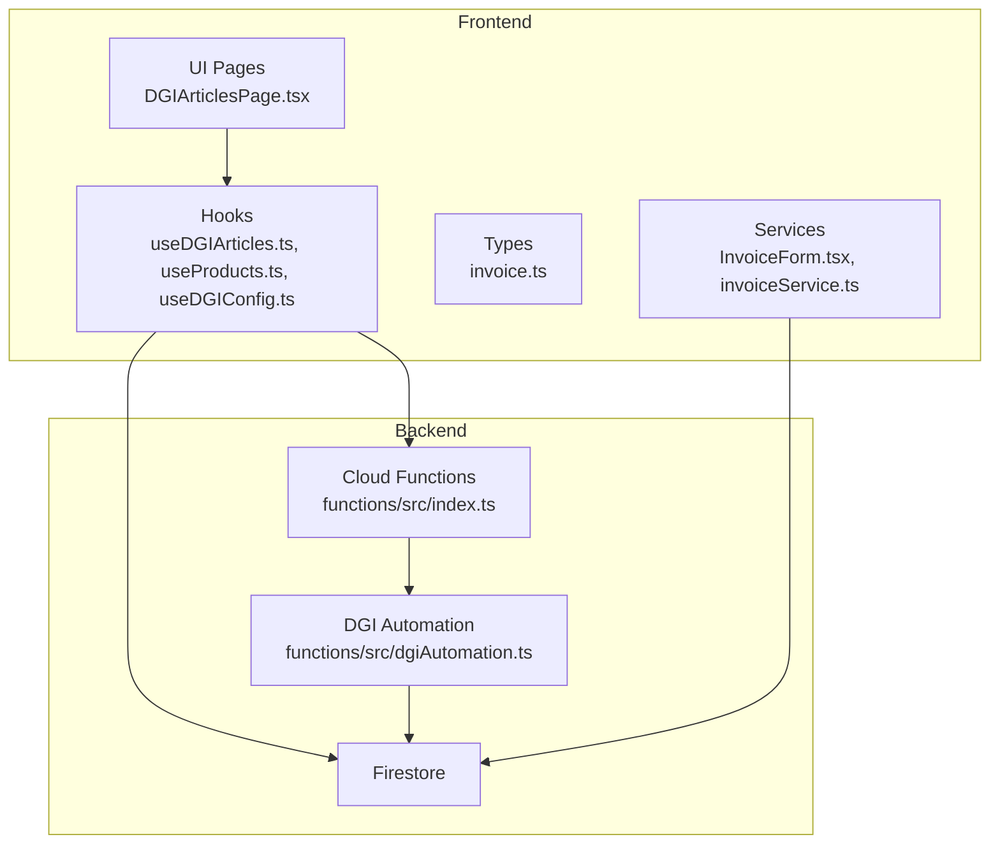
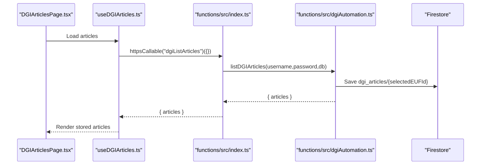
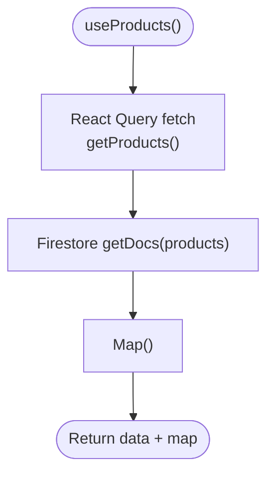
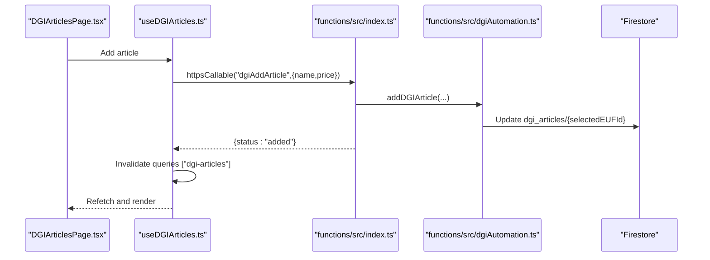
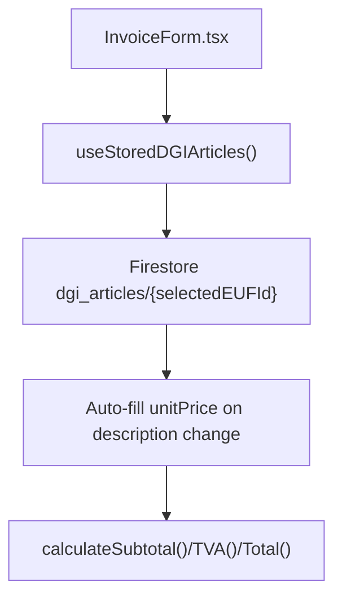
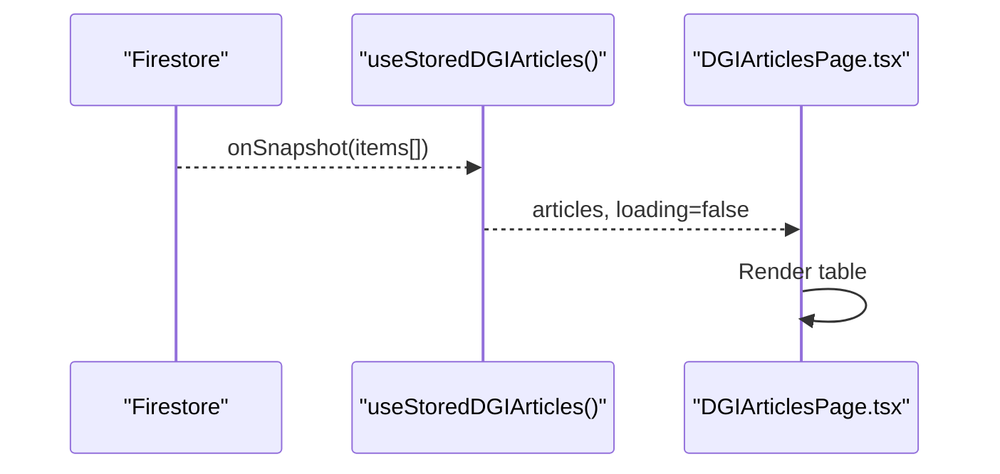
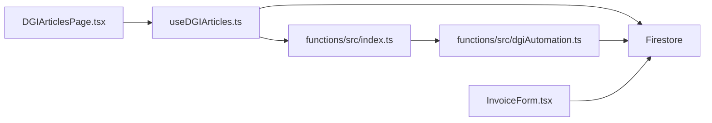

# Product Services

<cite>
**Referenced Files in This Document**
- [productService.ts](file://src/lib/productService.ts)
- [useProducts.ts](file://src/hooks/useProducts.ts)
- [useDGIArticles.ts](file://src/hooks/useDGIArticles.ts)
- [DGIArticlesPage.tsx](file://src/pages/DGIArticlesPage.tsx)
- [useDGIConfig.ts](file://src/hooks/useDGIConfig.ts)
- [index.ts](file://functions/src/index.ts)
- [dgiAutomation.ts](file://functions/src/dgiAutomation.ts)
- [InvoiceForm.tsx](file://src/components/InvoiceForm.tsx)
- [invoiceService.ts](file://src/lib/invoiceService.ts)
- [invoice.ts](file://src/types/invoice.ts)
- [AppHeader.tsx](file://src/components/AppHeader.tsx)
</cite>

## Table of Contents
1. [Introduction](#introduction)
2. [Project Structure](#project-structure)
3. [Core Components](#core-components)
4. [Architecture Overview](#architecture-overview)
5. [Detailed Component Analysis](#detailed-component-analysis)
6. [Dependency Analysis](#dependency-analysis)
7. [Performance Considerations](#performance-considerations)
8. [Troubleshooting Guide](#troubleshooting-guide)
9. [Conclusion](#conclusion)

## Introduction
This document provides comprehensive API and client-side documentation for product/service management within the ETSMEDF application. It covers:
- Product listing and client-side caching
- DGI article catalog integration (listing, creation, updating, deletion)
- Pricing management and tax handling
- Real-time synchronization patterns using Firestore snapshots
- Batch operations and import/export capabilities
- Integration with DGI article catalogs, validation rules, and categorization
- Examples of product management workflows, bulk operations, and error handling
- Performance considerations for large product catalogs, caching strategies, and real-time updates

## Project Structure
The system comprises:
- Frontend (React + TanStack Query) for UI and state management
- Firebase Firestore for persistent storage and real-time synchronization
- Cloud Functions (Firebase Callable HTTPS) for DGI automation
- TypeScript types for invoices and product/article data

**Diagram sources**
- [DGIArticlesPage.tsx:1-445](file://src/pages/DGIArticlesPage.tsx#L1-L445)
- [useDGIArticles.ts:1-107](file://src/hooks/useDGIArticles.ts#L1-L107)
- [useProducts.ts:1-19](file://src/hooks/useProducts.ts#L1-L19)
- [useDGIConfig.ts:1-84](file://src/hooks/useDGIConfig.ts#L1-L84)
- [index.ts:1-243](file://functions/src/index.ts#L1-L243)
- [dgiAutomation.ts:1-1386](file://functions/src/dgiAutomation.ts#L1-L1386)
- [InvoiceForm.tsx:1-343](file://src/components/InvoiceForm.tsx#L1-L343)
- [invoiceService.ts:1-58](file://src/lib/invoiceService.ts#L1-L58)
- [invoice.ts:1-39](file://src/types/invoice.ts#L1-L39)

**Section sources**
- [DGIArticlesPage.tsx:1-445](file://src/pages/DGIArticlesPage.tsx#L1-L445)
- [useDGIArticles.ts:1-107](file://src/hooks/useDGIArticles.ts#L1-L107)
- [useProducts.ts:1-19](file://src/hooks/useProducts.ts#L1-L19)
- [useDGIConfig.ts:1-84](file://src/hooks/useDGIConfig.ts#L1-L84)
- [index.ts:1-243](file://functions/src/index.ts#L1-L243)
- [dgiAutomation.ts:1-1386](file://functions/src/dgiAutomation.ts#L1-L1386)
- [InvoiceForm.tsx:1-343](file://src/components/InvoiceForm.tsx#L1-L343)
- [invoiceService.ts:1-58](file://src/lib/invoiceService.ts#L1-L58)
- [invoice.ts:1-39](file://src/types/invoice.ts#L1-L39)

## Core Components
- Product listing and caching
  - Client-side product model and retrieval via React Query
  - Local cache map for quick lookups by product ID
- DGI article catalog
  - Live Firestore snapshot for stored articles
  - Cloud Function hooks for listing, adding, updating, and deleting articles
- Pricing and tax
  - Invoice item pricing and tax calculation
  - DGI article pricing and grouping
- Real-time synchronization
  - Firestore onSnapshot for live updates
  - React Query invalidation on mutations

**Section sources**
- [productService.ts:1-17](file://src/lib/productService.ts#L1-L17)
- [useProducts.ts:1-19](file://src/hooks/useProducts.ts#L1-L19)
- [useDGIArticles.ts:1-107](file://src/hooks/useDGIArticles.ts#L1-L107)
- [DGIArticlesPage.tsx:1-445](file://src/pages/DGIArticlesPage.tsx#L1-L445)
- [invoice.ts:1-39](file://src/types/invoice.ts#L1-L39)

## Architecture Overview
The system integrates local product data with DGI-managed article catalogs. The frontend caches product lists and displays DGI articles stored in Firestore. Cloud Functions automate DGI operations while persisting results to Firestore for fast retrieval and offline resilience.

**Diagram sources**
- [DGIArticlesPage.tsx:1-445](file://src/pages/DGIArticlesPage.tsx#L1-L445)
- [useDGIArticles.ts:50-63](file://src/hooks/useDGIArticles.ts#L50-L63)
- [index.ts:93-107](file://functions/src/index.ts#L93-L107)
- [dgiAutomation.ts:1072-1117](file://functions/src/dgiAutomation.ts#L1072-L1117)

## Detailed Component Analysis

### Product Listing and Caching
- Data model
  - Product interface with numeric ID, name, price, unit, barcode, and group ID
- Retrieval
  - Fetch all products from Firestore "products" collection
  - Wrap in React Query for caching and background refetching
- Client-side map
  - Convert array to Map keyed by product ID for O(1) lookups

**Diagram sources**
- [useProducts.ts:5-18](file://src/hooks/useProducts.ts#L5-L18)
- [productService.ts:13-16](file://src/lib/productService.ts#L13-L16)

**Section sources**
- [productService.ts:1-17](file://src/lib/productService.ts#L1-L17)
- [useProducts.ts:1-19](file://src/hooks/useProducts.ts#L1-L19)

### DGI Article Catalog Integration
- Stored articles (real-time)
  - Firestore document "dgi_articles/{selectedEUFId}" updated by Cloud Functions
  - React hook subscribes with onSnapshot for live updates
- Cloud Function CRUD
  - List: httpsCallable "dgiListArticles" -> scrape DGI -> save to Firestore
  - Add: httpsCallable "dgiAddArticle" -> add on DGI -> invalidate cache
  - Update: httpsCallable "dgiUpdateArticle" -> update on DGI -> invalidate cache
  - Delete: httpsCallable "dgiDeleteArticle" -> delete on DGI -> invalidate cache
- Validation
  - Add requires name and non-negative price
  - Update requires either new name or new price
  - Delete requires name

**Diagram sources**
- [DGIArticlesPage.tsx:59-79](file://src/pages/DGIArticlesPage.tsx#L59-L79)
- [useDGIArticles.ts:65-76](file://src/hooks/useDGIArticles.ts#L65-L76)
- [index.ts:109-129](file://functions/src/index.ts#L109-L129)
- [dgiAutomation.ts:1119-1129](file://functions/src/dgiAutomation.ts#L1119-L1129)

**Section sources**
- [useDGIArticles.ts:1-107](file://src/hooks/useDGIArticles.ts#L1-L107)
- [index.ts:93-176](file://functions/src/index.ts#L93-L176)
- [dgiAutomation.ts:1072-1153](file://functions/src/dgiAutomation.ts#L1072-L1153)
- [DGIArticlesPage.tsx:1-445](file://src/pages/DGIArticlesPage.tsx#L1-L445)

### Pricing Management and Tax Handling
- DGI article pricing
  - Each article has name, price, and group
  - Group "B" uses 16% VAT rate
- Invoice item pricing
  - Items include description, quantity, unitPrice
  - Subtotal, TVA (16%), and total computed client-side
- Auto-fill from DGI catalog
  - Invoice form auto-completes unitPrice when description matches a DGI article

**Diagram sources**
- [InvoiceForm.tsx:90-96](file://src/components/InvoiceForm.tsx#L90-L96)
- [invoice.ts:28-38](file://src/types/invoice.ts#L28-L38)
- [useDGIArticles.ts:16-40](file://src/hooks/useDGIArticles.ts#L16-L40)

**Section sources**
- [invoice.ts:1-39](file://src/types/invoice.ts#L1-L39)
- [InvoiceForm.tsx:1-343](file://src/components/InvoiceForm.tsx#L1-L343)
- [useDGIArticles.ts:1-107](file://src/hooks/useDGIArticles.ts#L1-L107)

### Real-Time Synchronization Patterns
- Stored articles
  - onSnapshot on "dgi_articles/{selectedEUFId}" keeps UI in sync
- Product list
  - React Query with staleTime caches results; manual refetch supported
- EUF selection
  - onSnapshot on "dgi_config/settings" drives available EUFs and selection

**Diagram sources**
- [useDGIArticles.ts:16-40](file://src/hooks/useDGIArticles.ts#L16-L40)
- [DGIArticlesPage.tsx:20-46](file://src/pages/DGIArticlesPage.tsx#L20-L46)

**Section sources**
- [useDGIArticles.ts:1-107](file://src/hooks/useDGIArticles.ts#L1-L107)
- [DGIArticlesPage.tsx:1-445](file://src/pages/DGIArticlesPage.tsx#L1-L445)
- [useDGIConfig.ts:1-84](file://src/hooks/useDGIConfig.ts#L1-L84)

### Batch Operations and Import/Export
- Batch listing
  - Cloud Function "dgiListArticles" scrapes all articles for the selected EUF and saves them atomically to Firestore
- Import/export patterns
  - Import: Call "dgiListArticles" to populate "dgi_articles/{selectedEUFId}"
  - Export: Read from "dgi_articles/{selectedEUFId}" for downstream systems
- Limitations
  - No explicit bulk add/update/delete endpoints exposed; operations are per-item via CRUD functions

**Section sources**
- [index.ts:93-107](file://functions/src/index.ts#L93-L107)
- [dgiAutomation.ts:1072-1117](file://functions/src/dgiAutomation.ts#L1072-L1117)
- [DGIArticlesPage.tsx:50-57](file://src/pages/DGIArticlesPage.tsx#L50-L57)

### Product Categorization and Validation Rules
- Categorization
  - DGI articles include a group field; UI displays "B" group with 16% VAT
- Validation rules
  - Add article: name required, price required and non-negative
  - Update article: name required, at least one of newName/newPrice required
  - Delete article: name required
  - EUF selection: required before listing articles

**Section sources**
- [index.ts:113-162](file://functions/src/index.ts#L113-L162)
- [useDGIConfig.ts:1-84](file://src/hooks/useDGIConfig.ts#L1-L84)
- [DGIArticlesPage.tsx:62-98](file://src/pages/DGIArticlesPage.tsx#L62-L98)

### Example Workflows
- Create product (DGI article)
  - User fills name and price on DGIArticlesPage
  - Frontend calls useDGIAddArticle.mutateAsync
  - Cloud Function adds article on DGI and updates Firestore
  - UI refetches and shows success
- Update product (DGI article)
  - User edits name or price inline
  - Frontend calls useDGIUpdateArticle.mutateAsync
  - Cloud Function updates DGI and invalidates cache
- Delete product (DGI article)
  - User confirms delete
  - Frontend calls useDGIDeleteArticle.mutateAsync
  - Cloud Function deletes on DGI and invalidates cache
- Invoice creation with product lookup
  - User selects a DGI article name in InvoiceForm
  - Unit price auto-fills from stored articles
  - Subtotal/TVA/Total computed and invoice generated

**Section sources**
- [DGIArticlesPage.tsx:59-137](file://src/pages/DGIArticlesPage.tsx#L59-L137)
- [useDGIArticles.ts:88-106](file://src/hooks/useDGIArticles.ts#L88-L106)
- [InvoiceForm.tsx:90-106](file://src/components/InvoiceForm.tsx#L90-L106)
- [invoice.ts:28-38](file://src/types/invoice.ts#L28-L38)

## Dependency Analysis
- Frontend-to-backend
  - useDGIArticles.ts depends on Firebase Functions httpsCallable
  - DGIArticlesPage.tsx orchestrates UI state and hook invocations
- Backend-to-DGI
  - index.ts exposes callable functions wrapping dgiAutomation.ts
  - dgiAutomation.ts performs browser automation against DGI
- Persistence
  - Firestore stores EUF settings, article catalogs, and invoices
  - React Query and onSnapshot provide reactive UI updates

**Diagram sources**
- [DGIArticlesPage.tsx:1-445](file://src/pages/DGIArticlesPage.tsx#L1-L445)
- [useDGIArticles.ts:1-107](file://src/hooks/useDGIArticles.ts#L1-L107)
- [index.ts:1-243](file://functions/src/index.ts#L1-L243)
- [dgiAutomation.ts:1-1386](file://functions/src/dgiAutomation.ts#L1-L1386)
- [InvoiceForm.tsx:1-343](file://src/components/InvoiceForm.tsx#L1-L343)

**Section sources**
- [DGIArticlesPage.tsx:1-445](file://src/pages/DGIArticlesPage.tsx#L1-L445)
- [useDGIArticles.ts:1-107](file://src/hooks/useDGIArticles.ts#L1-L107)
- [index.ts:1-243](file://functions/src/index.ts#L1-L243)
- [dgiAutomation.ts:1-1386](file://functions/src/dgiAutomation.ts#L1-L1386)
- [InvoiceForm.tsx:1-343](file://src/components/InvoiceForm.tsx#L1-L343)

## Performance Considerations
- Caching
  - useProducts() uses React Query with a 5-minute stale threshold to minimize Firestore reads
  - useDGIArticles() caches results with infinite staleTime until invalidated
- Real-time updates
  - onSnapshot subscriptions keep UI fresh without polling
- Network efficiency
  - Cloud Functions consolidate browser automation; Firestore serves as a cache layer
- Large catalogs
  - Consider pagination or filtering in future enhancements
  - Monitor browser automation timeouts and retries in Cloud Functions

[No sources needed since this section provides general guidance]

## Troubleshooting Guide
- Authentication failures
  - DGI login/logout functions require authenticated users; ensure Firebase Auth is initialized
- Missing EUF selection
  - Without selectedEUFId, article listing is disabled; configure EUF via AppHeader
- DGI connectivity
  - Cloud Functions wrap errors and surface messages; check function logs for details
- Validation errors
  - Add/update/delete require specific fields; ensure inputs meet constraints
- Browser automation issues
  - Puppeteer-based functions may fail due to site changes; review logs and adjust selectors

**Section sources**
- [index.ts:42-71](file://functions/src/index.ts#L42-L71)
- [useDGIConfig.ts:1-84](file://src/hooks/useDGIConfig.ts#L1-L84)
- [DGIArticlesPage.tsx:240-282](file://src/pages/DGIArticlesPage.tsx#L240-L282)
- [index.ts:113-176](file://functions/src/index.ts#L113-L176)

## Conclusion
The ETSMEDF application provides a robust foundation for product/service management through:
- Real-time synchronization of DGI article catalogs
- Client-side caching and efficient UI updates
- Clear validation rules and error handling
- Practical workflows for listing, creating, updating, and deleting products
Future enhancements could include native bulk operations, export APIs, and advanced filtering for large catalogs.