# Utility Functions

<cite>
**Referenced Files in This Document**
- [utils.ts](file://src/lib/utils.ts)
- [firebase.ts](file://src/lib/firebase.ts)
- [invoiceService.ts](file://src/lib/invoiceService.ts)
- [productService.ts](file://src/lib/productService.ts)
- [AuthContext.tsx](file://src/contexts/AuthContext.tsx)
- [useDGIArticles.ts](file://src/hooks/useDGIArticles.ts)
- [useDGIConfig.ts](file://src/hooks/useDGIConfig.ts)
- [useDGIStatus.ts](file://src/hooks/useDGIStatus.ts)
- [useInvoices.ts](file://src/hooks/useInvoices.ts)
- [useProducts.ts](file://src/hooks/useProducts.ts)
- [invoice.ts](file://src/types/invoice.ts)
- [index.ts](file://functions/src/index.ts)
- [dgiAutomation.ts](file://functions/src/dgiAutomation.ts)
- [button.tsx](file://src/components/ui/button.tsx)
- [input.tsx](file://src/components/ui/input.tsx)
</cite>

## Table of Contents
1. [Introduction](#introduction)
2. [Project Structure](#project-structure)
3. [Core Components](#core-components)
4. [Architecture Overview](#architecture-overview)
5. [Detailed Component Analysis](#detailed-component-analysis)
6. [Dependency Analysis](#dependency-analysis)
7. [Performance Considerations](#performance-considerations)
8. [Troubleshooting Guide](#troubleshooting-guide)
9. [Conclusion](#conclusion)
10. [Appendices](#appendices)

## Introduction
This document describes the utility functions and helper services used across the application. It focuses on:
- Data transformation and formatting helpers
- Validation utilities
- Business logic functions
- Firebase integration utilities
- Authentication helpers
- Configuration management
- Error handling patterns, logging, and debugging helpers
- Performance optimization, memoization, and caching strategies
- Guidelines for extending utilities consistently

## Project Structure
Utilities are organized by domain:
- Shared UI helpers: Tailwind merging and component utilities
- Firebase initialization and services
- Hooks for DGI integration and local configuration
- Business logic for invoices and products
- Cloud functions orchestrating DGI automation

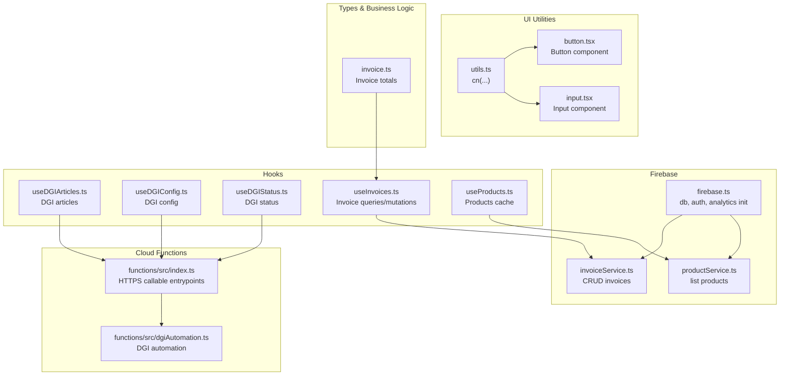

**Diagram sources**
- [utils.ts:1-7](file://src/lib/utils.ts#L1-L7)
- [button.tsx:1-65](file://src/components/ui/button.tsx#L1-L65)
- [input.tsx:1-22](file://src/components/ui/input.tsx#L1-L22)
- [firebase.ts:1-23](file://src/lib/firebase.ts#L1-L23)
- [invoiceService.ts:1-58](file://src/lib/invoiceService.ts#L1-L58)
- [productService.ts:1-17](file://src/lib/productService.ts#L1-L17)
- [useDGIArticles.ts:1-107](file://src/hooks/useDGIArticles.ts#L1-L107)
- [useDGIConfig.ts:1-84](file://src/hooks/useDGIConfig.ts#L1-L84)
- [useDGIStatus.ts:1-34](file://src/hooks/useDGIStatus.ts#L1-L34)
- [useInvoices.ts:1-90](file://src/hooks/useInvoices.ts#L1-L90)
- [useProducts.ts:1-19](file://src/hooks/useProducts.ts#L1-L19)
- [invoice.ts:1-39](file://src/types/invoice.ts#L1-L39)
- [index.ts:1-243](file://functions/src/index.ts#L1-L243)
- [dgiAutomation.ts:1-800](file://functions/src/dgiAutomation.ts#L1-L800)

**Section sources**
- [utils.ts:1-7](file://src/lib/utils.ts#L1-L7)
- [firebase.ts:1-23](file://src/lib/firebase.ts#L1-L23)
- [invoiceService.ts:1-58](file://src/lib/invoiceService.ts#L1-L58)
- [productService.ts:1-17](file://src/lib/productService.ts#L1-L17)
- [useDGIArticles.ts:1-107](file://src/hooks/useDGIArticles.ts#L1-L107)
- [useDGIConfig.ts:1-84](file://src/hooks/useDGIConfig.ts#L1-L84)
- [useDGIStatus.ts:1-34](file://src/hooks/useDGIStatus.ts#L1-L34)
- [useInvoices.ts:1-90](file://src/hooks/useInvoices.ts#L1-L90)
- [useProducts.ts:1-19](file://src/hooks/useProducts.ts#L1-L19)
- [invoice.ts:1-39](file://src/types/invoice.ts#L1-L39)
- [index.ts:1-243](file://functions/src/index.ts#L1-L243)
- [dgiAutomation.ts:1-800](file://functions/src/dgiAutomation.ts#L1-L800)

## Core Components
- Tailwind class merging utility
  - Function: cn(...inputs: ClassValue[]): string
  - Purpose: Merge and deduplicate Tailwind classes using clsx and tailwind-merge
  - Usage: Apply consistent styling across UI components
  - Example usage path: [button.tsx:5](file://src/components/ui/button.tsx#L5), [input.tsx:3](file://src/components/ui/input.tsx#L3)

- Firebase initialization and exports
  - Module initializes Firebase app and exposes db, auth, and analytics guard
  - Environment variables loaded from import.meta.env
  - Analytics initialized only if supported

- Invoice service
  - CRUD operations against Firestore collection "invoices"
  - Converts Firestore Timestamps to ISO date strings for consistent serialization
  - Returns typed Invoice objects

- Product service
  - Fetches product catalog from Firestore "products" collection
  - Returns typed Product array

- Authentication context
  - Provides sign-in/sign-out with Firebase Auth
  - Integrates with cloud functions for DGI login/logout (fire-and-forget)
  - Exposes useAuth hook with runtime validation

- DGI integration hooks
  - Live snapshots for stored DGI articles
  - React Query hooks for listing/manipulating DGI articles via HTTPS callable functions
  - Mutation hooks for adding/updating/deleting articles
  - Config management for selected EUF and refresh utilities
  - Status monitoring for DGI session connectivity

- Invoice hooks
  - Queries for lists and single invoices
  - Mutations for create/update/delete
  - Submission to DGI via HTTPS callable with PDF upload and Firestore updates

- Product hooks
  - Query products with cache (staleTime)
  - Memoized map builder for fast lookups

- Business logic
  - Invoice totals computation helpers
  - TVA rate constant for calculations

**Section sources**
- [utils.ts:1-7](file://src/lib/utils.ts#L1-L7)
- [firebase.ts:1-23](file://src/lib/firebase.ts#L1-L23)
- [invoiceService.ts:1-58](file://src/lib/invoiceService.ts#L1-L58)
- [productService.ts:1-17](file://src/lib/productService.ts#L1-L17)
- [AuthContext.tsx:1-62](file://src/contexts/AuthContext.tsx#L1-L62)
- [useDGIArticles.ts:1-107](file://src/hooks/useDGIArticles.ts#L1-L107)
- [useDGIConfig.ts:1-84](file://src/hooks/useDGIConfig.ts#L1-L84)
- [useDGIStatus.ts:1-34](file://src/hooks/useDGIStatus.ts#L1-L34)
- [useInvoices.ts:1-90](file://src/hooks/useInvoices.ts#L1-L90)
- [useProducts.ts:1-19](file://src/hooks/useProducts.ts#L1-L19)
- [invoice.ts:1-39](file://src/types/invoice.ts#L1-L39)

## Architecture Overview
High-level flow of utilities and services:
- UI components rely on cn(...) for class composition
- Services depend on Firebase initialization
- Hooks orchestrate data fetching, mutations, and side effects
- Cloud functions provide backend automation for DGI operations

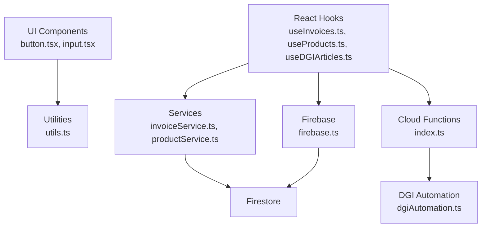

**Diagram sources**
- [utils.ts:1-7](file://src/lib/utils.ts#L1-L7)
- [button.tsx:1-65](file://src/components/ui/button.tsx#L1-L65)
- [input.tsx:1-22](file://src/components/ui/input.tsx#L1-L22)
- [useInvoices.ts:1-90](file://src/hooks/useInvoices.ts#L1-L90)
- [useProducts.ts:1-19](file://src/hooks/useProducts.ts#L1-L19)
- [useDGIArticles.ts:1-107](file://src/hooks/useDGIArticles.ts#L1-L107)
- [invoiceService.ts:1-58](file://src/lib/invoiceService.ts#L1-L58)
- [productService.ts:1-17](file://src/lib/productService.ts#L1-L17)
- [firebase.ts:1-23](file://src/lib/firebase.ts#L1-L23)
- [index.ts:1-243](file://functions/src/index.ts#L1-L243)
- [dgiAutomation.ts:1-800](file://functions/src/dgiAutomation.ts#L1-L800)

## Detailed Component Analysis

### Tailwind Class Merging Utility
- Function: cn(...inputs: ClassValue[]): string
- Parameters: variadic list of class inputs compatible with clsx/tailwind-merge
- Returns: merged and deduplicated class string
- Usage: Centralized class composition across UI components

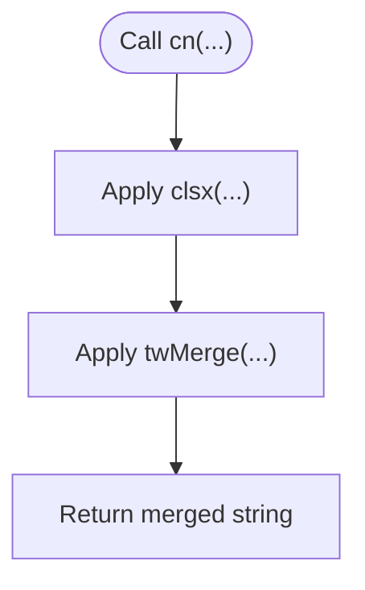

**Diagram sources**
- [utils.ts:4-6](file://src/lib/utils.ts#L4-L6)

**Section sources**
- [utils.ts:1-7](file://src/lib/utils.ts#L1-L7)
- [button.tsx:5](file://src/components/ui/button.tsx#L5)
- [input.tsx:3](file://src/components/ui/input.tsx#L3)

### Firebase Initialization and Exports
- Initializes Firebase app with environment variables
- Exposes db, auth, and analytics guarded by support checks
- Loads configuration from import.meta.env keys

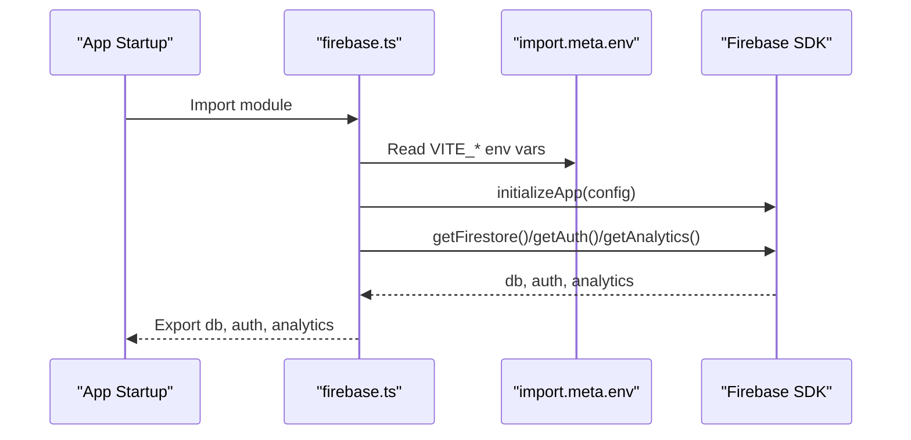

**Diagram sources**
- [firebase.ts:6-22](file://src/lib/firebase.ts#L6-L22)

**Section sources**
- [firebase.ts:1-23](file://src/lib/firebase.ts#L1-L23)

### Invoice Service
- createInvoice: Adds new invoice with server timestamp
- getInvoices: Lists invoices ordered by creation time
- getInvoice: Retrieves single invoice by id
- updateInvoiceStatus: Updates invoice status
- deleteInvoice: Removes invoice by id
- Handles Firestore Timestamp conversion to ISO string

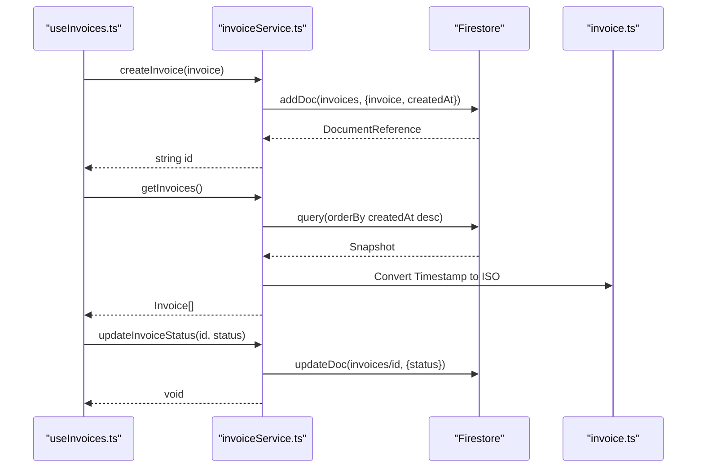

**Diagram sources**
- [useInvoices.ts:17-58](file://src/hooks/useInvoices.ts#L17-L58)
- [invoiceService.ts:19-57](file://src/lib/invoiceService.ts#L19-L57)
- [invoice.ts:28-38](file://src/types/invoice.ts#L28-L38)

**Section sources**
- [invoiceService.ts:1-58](file://src/lib/invoiceService.ts#L1-L58)
- [useInvoices.ts:1-90](file://src/hooks/useInvoices.ts#L1-L90)
- [invoice.ts:1-39](file://src/types/invoice.ts#L1-L39)

### Product Service
- getProducts: Fetches product catalog from Firestore
- Returns typed Product array

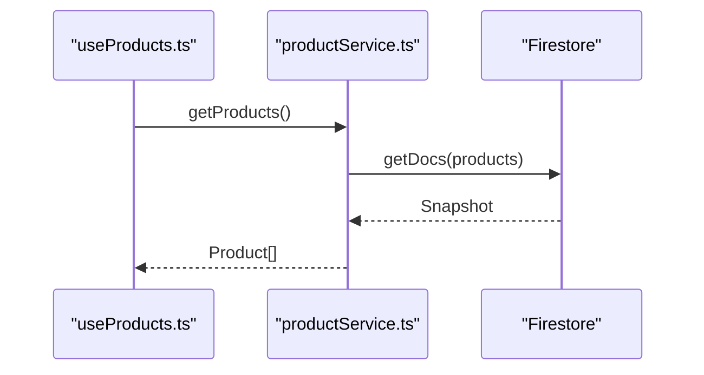

**Diagram sources**
- [useProducts.ts:5-11](file://src/hooks/useProducts.ts#L5-L11)
- [productService.ts:13-16](file://src/lib/productService.ts#L13-L16)

**Section sources**
- [productService.ts:1-17](file://src/lib/productService.ts#L1-L17)
- [useProducts.ts:1-19](file://src/hooks/useProducts.ts#L1-L19)

### Authentication Helpers
- AuthProvider: Manages Firebase Auth state, exposes signIn/signOut
- DGI integration: Calls cloud functions for login/logout (fire-and-forget)
- useAuth: Validates context usage and returns auth state

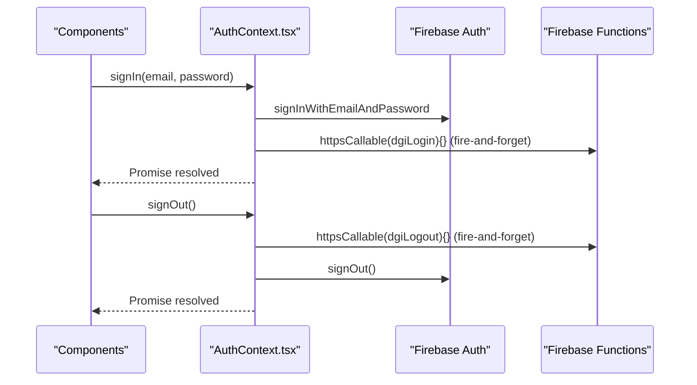

**Diagram sources**
- [AuthContext.tsx:38-48](file://src/contexts/AuthContext.tsx#L38-L48)
- [AuthContext.tsx:20-24](file://src/contexts/AuthContext.tsx#L20-L24)

**Section sources**
- [AuthContext.tsx:1-62](file://src/contexts/AuthContext.tsx#L1-L62)

### DGI Integration Hooks
- useStoredDGIArticles: Real-time snapshot of stored articles
- useDGIArticles: Query articles via HTTPS callable
- useDGIAddArticle/useDGIDeleteArticle/useDGIUpdateArticle: Mutations with cache invalidation
- useDGIConfig: Reads/writes EUF selection and available list
- useRefreshEUFs: Fetches EUFs via HTTPS callable
- useDGIStatus: Monitors DGI session status

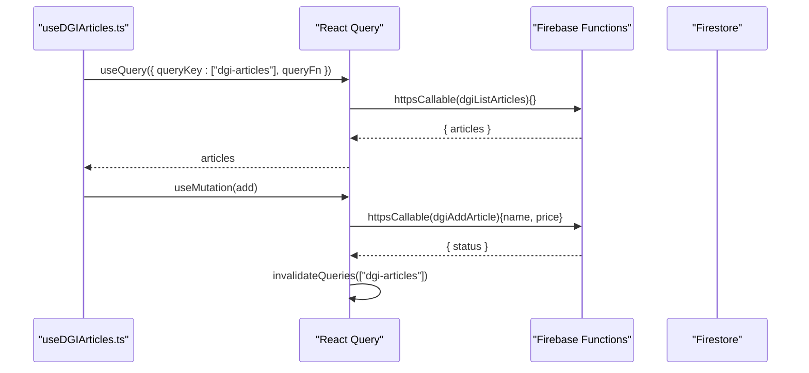

**Diagram sources**
- [useDGIArticles.ts:50-86](file://src/hooks/useDGIArticles.ts#L50-L86)
- [index.ts:93-107](file://functions/src/index.ts#L93-L107)

**Section sources**
- [useDGIArticles.ts:1-107](file://src/hooks/useDGIArticles.ts#L1-L107)
- [useDGIConfig.ts:1-84](file://src/hooks/useDGIConfig.ts#L1-L84)
- [useDGIStatus.ts:1-34](file://src/hooks/useDGIStatus.ts#L1-L34)
- [index.ts:1-243](file://functions/src/index.ts#L1-L243)

### Business Logic: Invoice Totals
- calculateSubtotal(items): Sum of quantity × unitPrice
- calculateTVA(items): Subtotal × TVA_RATE
- calculateTotal(items): Subtotal + TVA
- TVA_RATE constant defined for Group B (16%)

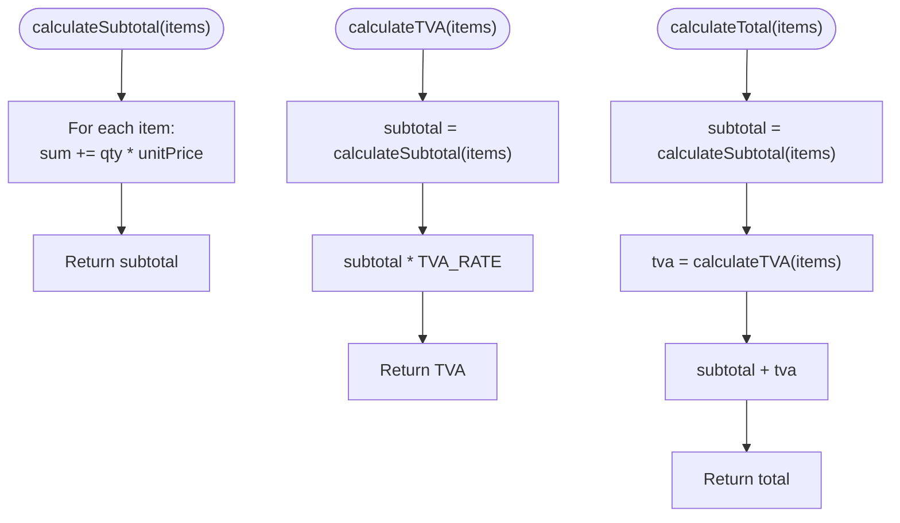

**Diagram sources**
- [invoice.ts:28-38](file://src/types/invoice.ts#L28-L38)

**Section sources**
- [invoice.ts:1-39](file://src/types/invoice.ts#L1-L39)

### Cloud Functions: DGI Automation Entrypoints
- dgiLogin/dgiLogout: Authenticate/clear DGI session, log events, handle errors
- dgiListEUFs: List and merge EUFs into Firestore
- dgiListArticles/dgiAddArticle/dgiDeleteArticle/dgiUpdateArticle: Article management
- submitToDGI: Submit invoice to DGI, capture PDF, upload to storage, update Firestore, set status to sent

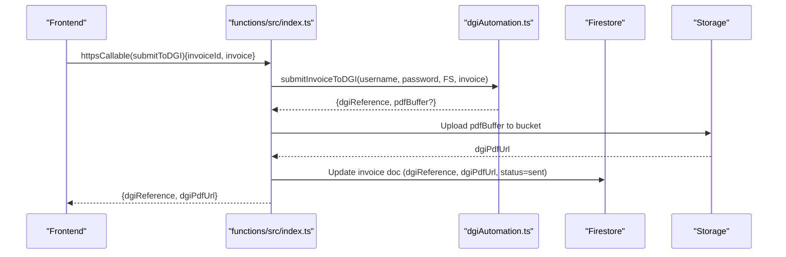

**Diagram sources**
- [index.ts:180-242](file://functions/src/index.ts#L180-L242)
- [dgiAutomation.ts:1-800](file://functions/src/dgiAutomation.ts#L1-L800)

**Section sources**
- [index.ts:1-243](file://functions/src/index.ts#L1-L243)
- [dgiAutomation.ts:1-800](file://functions/src/dgiAutomation.ts#L1-L800)

## Dependency Analysis
- UI components depend on cn(...) for class composition
- Services depend on Firebase initialization
- Hooks depend on services and cloud functions
- Cloud functions depend on DGI automation library and Firestore/Storage

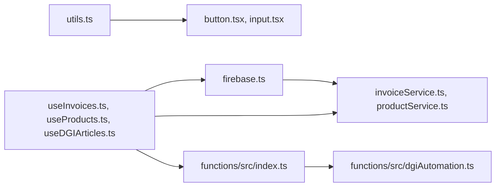

**Diagram sources**
- [utils.ts:1-7](file://src/lib/utils.ts#L1-L7)
- [button.tsx:1-65](file://src/components/ui/button.tsx#L1-L65)
- [input.tsx:1-22](file://src/components/ui/input.tsx#L1-L22)
- [firebase.ts:1-23](file://src/lib/firebase.ts#L1-L23)
- [invoiceService.ts:1-58](file://src/lib/invoiceService.ts#L1-L58)
- [productService.ts:1-17](file://src/lib/productService.ts#L1-L17)
- [useInvoices.ts:1-90](file://src/hooks/useInvoices.ts#L1-L90)
- [useProducts.ts:1-19](file://src/hooks/useProducts.ts#L1-L19)
- [useDGIArticles.ts:1-107](file://src/hooks/useDGIArticles.ts#L1-L107)
- [index.ts:1-243](file://functions/src/index.ts#L1-L243)
- [dgiAutomation.ts:1-800](file://functions/src/dgiAutomation.ts#L1-L800)

**Section sources**
- [utils.ts:1-7](file://src/lib/utils.ts#L1-L7)
- [firebase.ts:1-23](file://src/lib/firebase.ts#L1-L23)
- [invoiceService.ts:1-58](file://src/lib/invoiceService.ts#L1-L58)
- [productService.ts:1-17](file://src/lib/productService.ts#L1-L17)
- [useInvoices.ts:1-90](file://src/hooks/useInvoices.ts#L1-L90)
- [useProducts.ts:1-19](file://src/hooks/useProducts.ts#L1-L19)
- [useDGIArticles.ts:1-107](file://src/hooks/useDGIArticles.ts#L1-L107)
- [index.ts:1-243](file://functions/src/index.ts#L1-L243)
- [dgiAutomation.ts:1-800](file://functions/src/dgiAutomation.ts#L1-L800)

## Performance Considerations
- Memoization and caching
  - useProducts: staleTime set to 5 minutes to avoid frequent network calls
  - useDGIArticles: staleTime Infinity and retry disabled to prevent unnecessary refreshes
  - useInvoices: query invalidation on create/update/delete to keep views fresh
- Network efficiency
  - Firestore Timestamps converted once per fetch to ISO strings to avoid repeated conversions
- Rendering
  - cn(...) merges classes efficiently; prefer passing minimal class inputs to reduce churn
- Cloud functions
  - Separate configs for timeouts and memory to balance responsiveness and reliability
- Logging
  - Functions use structured logging with levels (info, warn, error) and contextual data

**Section sources**
- [useProducts.ts:9](file://src/hooks/useProducts.ts#L9)
- [useDGIArticles.ts:60-62](file://src/hooks/useDGIArticles.ts#L60-L62)
- [useInvoices.ts:36](file://src/hooks/useInvoices.ts#L36)
- [index.ts:22-29](file://functions/src/index.ts#L22-L29)

## Troubleshooting Guide
- Firebase configuration
  - Ensure VITE_* environment variables are present and correct
  - Analytics guard prevents initialization on unsupported clients
- Authentication
  - useAuth throws if used outside AuthProvider; wrap app accordingly
  - DGI login/logout are fire-and-forget; failures are logged but do not block auth flow
- DGI operations
  - Cloud functions validate presence of auth and required arguments
  - Errors are logged with context; internal errors are surfaced to the client
  - PDF upload is non-blocking; failures are logged and do not fail submission
- Firestore data shape
  - Timestamps are normalized to ISO strings; ensure consumers expect strings
- React Query
  - Query keys must match to enable proper cache invalidation
  - enabled flags prevent premature fetching until dependencies are ready

**Section sources**
- [firebase.ts:6-22](file://src/lib/firebase.ts#L6-L22)
- [AuthContext.tsx:57-61](file://src/contexts/AuthContext.tsx#L57-L61)
- [index.ts:42-71](file://functions/src/index.ts#L42-L71)
- [index.ts:180-242](file://functions/src/index.ts#L180-L242)
- [invoiceService.ts:33-47](file://src/lib/invoiceService.ts#L33-L47)
- [useInvoices.ts:28](file://src/hooks/useInvoices.ts#L28)

## Conclusion
The utility layer provides a cohesive foundation for UI styling, Firebase integration, data fetching, and business logic. By centralizing class composition, service abstractions, and typed calculations, the application maintains consistency and scalability. Cloud functions encapsulate complex DGI automation while exposing safe, typed entrypoints for the frontend.

## Appendices

### Function Signatures and Parameters

- cn(...inputs: ClassValue[]): string
  - Parameters: variadic list of class inputs
  - Returns: merged class string

- createInvoice(invoice: Omit<Invoice, "id">): Promise<string>
  - Parameters: invoice payload without id
  - Returns: newly created document id

- getInvoices(): Promise<Invoice[]>
  - Returns: invoices ordered by createdAt desc

- getInvoice(id: string): Promise<Invoice | null>
  - Parameters: invoice id
  - Returns: invoice or null

- updateInvoiceStatus(id: string, status: Invoice["status"]): Promise<void>
  - Parameters: invoice id and status
  - Returns: void

- deleteInvoice(id: string): Promise<void>
  - Parameters: invoice id
  - Returns: void

- getProducts(): Promise<Product[]>
  - Returns: product catalog

- useProducts(): UseQueryResult<Product[]>
  - Returns: React Query result with cached products

- useProductMap(): Map<number, Product>
  - Returns: memoized map of products keyed by id

- useDGIArticles(): UseInfiniteQueryResult<{ articles: DGIArticle[] }>
  - Returns: query result for DGI articles

- useDGIAddArticle(): UseMutationResult<void, unknown, { name: string; price: number }>
  - Parameters: { name, price }
  - Returns: mutation result

- useDGIDeleteArticle(): UseMutationResult<void, unknown, string>
  - Parameters: article name
  - Returns: mutation result

- useDGIUpdateArticle(): UseMutationResult<void, unknown, { name: string; newName?: string; newPrice?: number }>
  - Parameters: { name, newName?, newPrice? }
  - Returns: mutation result

- useDGIConfig(): DGIConfig
  - Returns: EUF selection and available list

- useSetPointDeVente(): UseMutationResult<void, unknown, { id: string; name: string }>
  - Parameters: { id, name }
  - Returns: mutation result

- useAddEUFManually(): UseMutationResult<void, unknown, DGIEUFEntry>
  - Parameters: EUF entry
  - Returns: mutation result

- useRefreshEUFs(): UseMutationResult<DGIEUFEntry[], unknown, Record<never, never>>
  - Parameters: none
  - Returns: mutation result

- useDGIStatus(): DGISessionInfo
  - Returns: DGI connection status and last saved time

- useInvoices(): UseQueryResult<Invoice[]>
  - Returns: invoices list

- useInvoice(id: string): UseQueryResult<Invoice>
  - Parameters: invoice id
  - Returns: single invoice

- useCreateInvoice(): UseMutationResult<void, unknown, Omit<Invoice, "id">>
  - Parameters: invoice payload
  - Returns: mutation result

- useUpdateInvoiceStatus(): UseMutationResult<void, unknown, { id: string; status: Invoice["status"] }>
  - Parameters: { id, status }
  - Returns: mutation result

- useDeleteInvoice(): UseMutationResult<void, unknown, string>
  - Parameters: invoice id
  - Returns: mutation result

- useSubmitToDGI(): UseMutationResult<{ dgiReference: string; dgiPdfUrl?: string }, unknown, { invoiceId: string; invoice: Invoice }>
  - Parameters: { invoiceId, invoice }
  - Returns: mutation result

- calculateSubtotal(items: InvoiceItem[]): number
  - Parameters: invoice items
  - Returns: subtotal

- calculateTVA(items: InvoiceItem[]): number
  - Parameters: invoice items
  - Returns: TVA amount

- calculateTotal(items: InvoiceItem[]): number
  - Parameters: invoice items
  - Returns: total amount

**Section sources**
- [utils.ts:4-6](file://src/lib/utils.ts#L4-L6)
- [invoiceService.ts:19-57](file://src/lib/invoiceService.ts#L19-L57)
- [productService.ts:13-16](file://src/lib/productService.ts#L13-L16)
- [useProducts.ts:5-18](file://src/hooks/useProducts.ts#L5-L18)
- [useDGIArticles.ts:50-106](file://src/hooks/useDGIArticles.ts#L50-L106)
- [useDGIConfig.ts:21-83](file://src/hooks/useDGIConfig.ts#L21-L83)
- [useDGIStatus.ts:12-33](file://src/hooks/useDGIStatus.ts#L12-L33)
- [useInvoices.ts:17-89](file://src/hooks/useInvoices.ts#L17-L89)
- [invoice.ts:28-38](file://src/types/invoice.ts#L28-L38)

### Error Handling Patterns
- Frontend
  - React Query handles errors via onError callbacks
  - useAuth validates context usage and throws descriptive errors
- Backend
  - Cloud functions validate auth and arguments, throw HttpsError with appropriate status
  - Structured logging with contextual data aids debugging
  - PDF upload failures are non-blocking and logged

**Section sources**
- [AuthContext.tsx:57-61](file://src/contexts/AuthContext.tsx#L57-L61)
- [index.ts:42-71](file://functions/src/index.ts#L42-L71)
- [index.ts:180-242](file://functions/src/index.ts#L180-L242)

### Logging and Debugging Helpers
- Frontend
  - useAuth logs DGI operations warnings without failing
  - React Query enables efficient caching and invalidation
- Backend
  - Functions use firebase-functions/logger with info/warn/error levels
  - Contextual data includes uid, counts, URLs, and messages

**Section sources**
- [AuthContext.tsx:20-24](file://src/contexts/AuthContext.tsx#L20-L24)
- [index.ts:42-71](file://functions/src/index.ts#L42-L71)
- [index.ts:180-242](file://functions/src/index.ts#L180-L242)

### Performance Optimization and Caching Strategies
- useProducts: staleTime = 5 minutes
- useDGIArticles: staleTime = Infinity, retry = false
- useInvoices: invalidateQueries on create/update/delete
- Firestore Timestamp normalization to ISO strings
- Tailwind class merging via cn for efficient rendering

**Section sources**
- [useProducts.ts:9](file://src/hooks/useProducts.ts#L9)
- [useDGIArticles.ts:60-62](file://src/hooks/useDGIArticles.ts#L60-L62)
- [useInvoices.ts:36](file://src/hooks/useInvoices.ts#L36)
- [invoiceService.ts:33-47](file://src/lib/invoiceService.ts#L33-L47)
- [utils.ts:4-6](file://src/lib/utils.ts#L4-L6)

### Extending Utility Functions
- Keep UI utilities small and composable (e.g., cn)
- Encapsulate Firebase logic in dedicated modules
- Define clear interfaces for services and hooks
- Use React Query keys consistently for cache coherence
- Add structured logging and error boundaries in cloud functions
- Validate inputs early and fail fast with HttpsError

[No sources needed since this section provides general guidance]