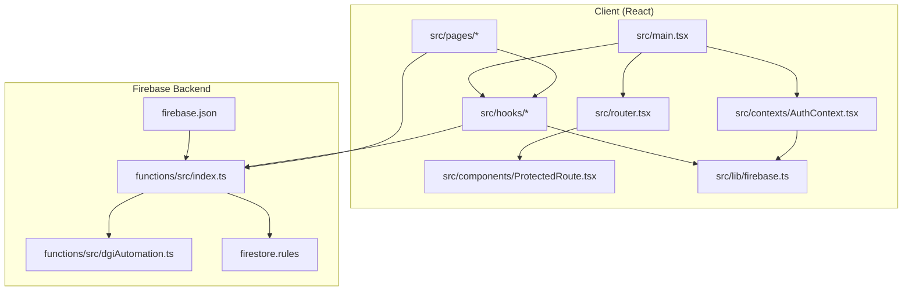
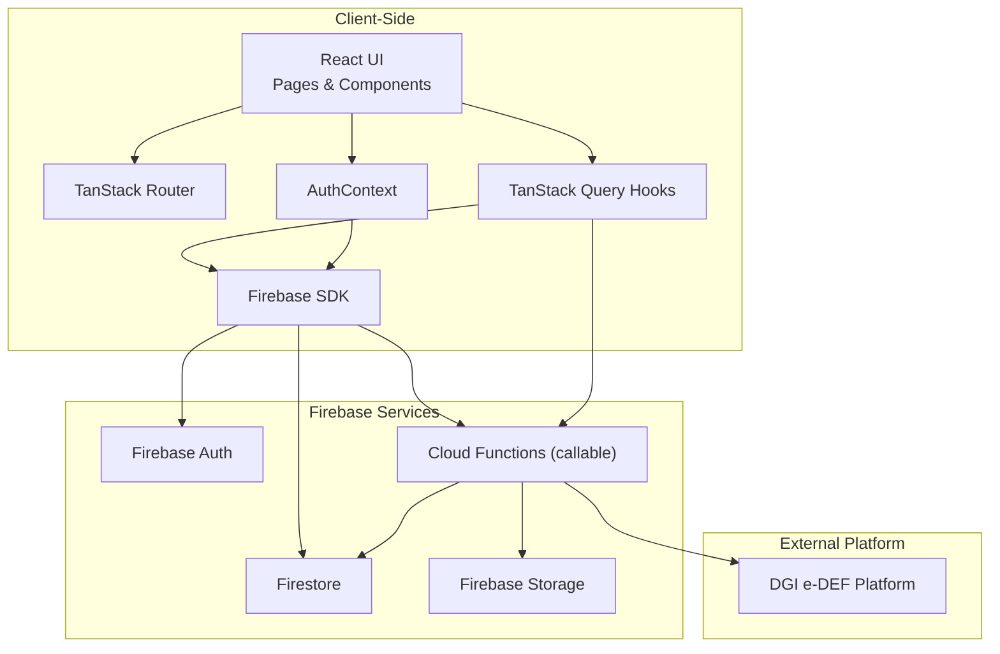
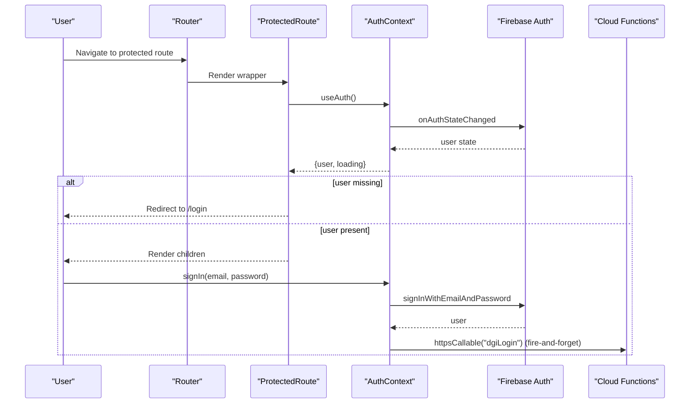
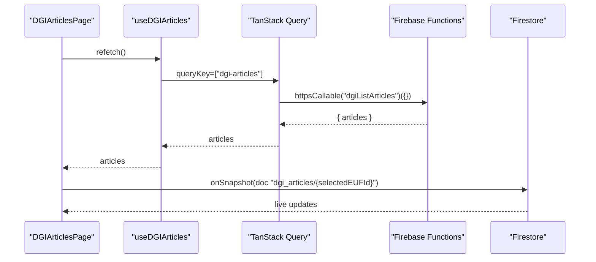
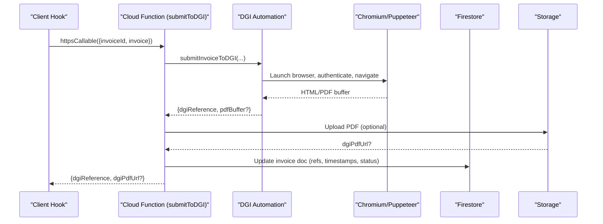
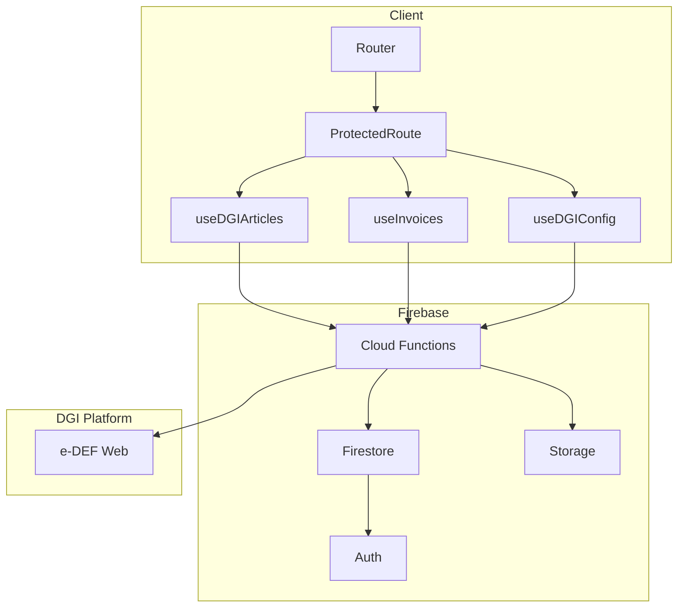
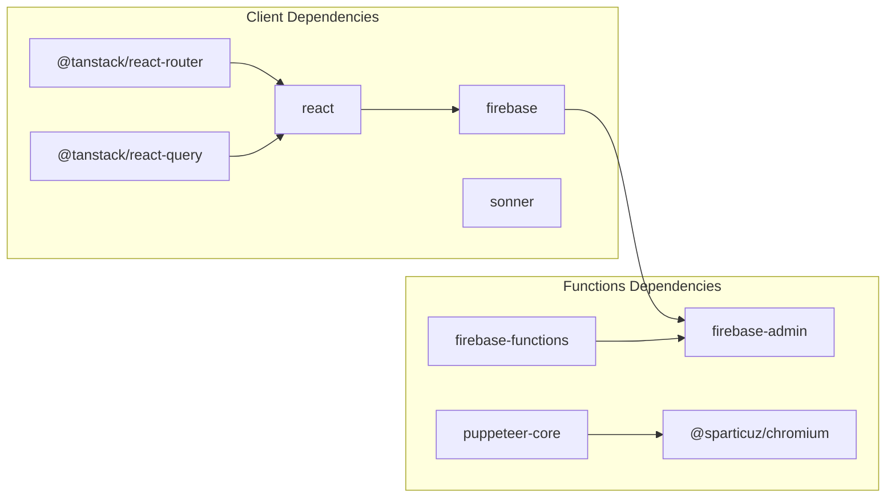

# Architecture Overview

<cite>
**Referenced Files in This Document**
- [src/main.tsx](file://src/main.tsx)
- [src/router.tsx](file://src/router.tsx)
- [src/contexts/AuthContext.tsx](file://src/contexts/AuthContext.tsx)
- [src/components/ProtectedRoute.tsx](file://src/components/ProtectedRoute.tsx)
- [src/lib/firebase.ts](file://src/lib/firebase.ts)
- [src/hooks/useDGIArticles.ts](file://src/hooks/useDGIArticles.ts)
- [src/hooks/useDGIConfig.ts](file://src/hooks/useDGIConfig.ts)
- [src/hooks/useInvoices.ts](file://src/hooks/useInvoices.ts)
- [src/pages/DGIArticlesPage.tsx](file://src/pages/DGIArticlesPage.tsx)
- [functions/src/index.ts](file://functions/src/index.ts)
- [functions/src/dgiAutomation.ts](file://functions/src/dgiAutomation.ts)
- [firebase.json](file://firebase.json)
- [firestore.rules](file://firestore.rules)
- [package.json](file://package.json)
- [functions/package.json](file://functions/package.json)
</cite>

## Table of Contents
1. [Introduction](#introduction)
2. [Project Structure](#project-structure)
3. [Core Components](#core-components)
4. [Architecture Overview](#architecture-overview)
5. [Detailed Component Analysis](#detailed-component-analysis)
6. [Dependency Analysis](#dependency-analysis)
7. [Performance Considerations](#performance-considerations)
8. [Troubleshooting Guide](#troubleshooting-guide)
9. [Conclusion](#conclusion)

## Introduction
This document describes the ETSMEDF system architecture, focusing on the integration between a React frontend and Firebase backend, including serverless Cloud Functions that automate interactions with the DGI platform. It explains how the Context and Hook patterns are used for state and data management, how routing is handled with TanStack Router, and how TanStack Query manages data fetching and caching. Cross-cutting concerns such as authentication, real-time synchronization, and error handling are documented alongside infrastructure requirements for Firebase Hosting, Cloud Functions, and Firestore.

## Project Structure
The project follows a clear separation between the client (React + TypeScript) and the serverless backend (Cloud Functions written in TypeScript). The client initializes global providers for routing, authentication, and data fetching, while the backend exposes callable functions that orchestrate browser automation via Puppeteer to interact with the DGI website.

**Diagram sources**
- [src/main.tsx:1-22](file://src/main.tsx#L1-L22)
- [src/router.tsx:1-92](file://src/router.tsx#L1-L92)
- [src/contexts/AuthContext.tsx:1-62](file://src/contexts/AuthContext.tsx#L1-L62)
- [src/components/ProtectedRoute.tsx:1-24](file://src/components/ProtectedRoute.tsx#L1-L24)
- [src/lib/firebase.ts:1-23](file://src/lib/firebase.ts#L1-L23)
- [src/hooks/useDGIArticles.ts:1-107](file://src/hooks/useDGIArticles.ts#L1-L107)
- [src/hooks/useDGIConfig.ts:1-84](file://src/hooks/useDGIConfig.ts#L1-L84)
- [src/hooks/useInvoices.ts:1-90](file://src/hooks/useInvoices.ts#L1-L90)
- [src/pages/DGIArticlesPage.tsx:1-445](file://src/pages/DGIArticlesPage.tsx#L1-L445)
- [functions/src/index.ts:1-243](file://functions/src/index.ts#L1-L243)
- [functions/src/dgiAutomation.ts:1-800](file://functions/src/dgiAutomation.ts#L1-L800)
- [firebase.json:1-11](file://firebase.json#L1-L11)
- [firestore.rules:1-9](file://firestore.rules#L1-L9)

**Section sources**
- [src/main.tsx:1-22](file://src/main.tsx#L1-L22)
- [src/router.tsx:1-92](file://src/router.tsx#L1-L92)
- [src/contexts/AuthContext.tsx:1-62](file://src/contexts/AuthContext.tsx#L1-L62)
- [src/components/ProtectedRoute.tsx:1-24](file://src/components/ProtectedRoute.tsx#L1-L24)
- [src/lib/firebase.ts:1-23](file://src/lib/firebase.ts#L1-L23)
- [functions/src/index.ts:1-243](file://functions/src/index.ts#L1-L243)
- [functions/src/dgiAutomation.ts:1-800](file://functions/src/dgiAutomation.ts#L1-L800)
- [firebase.json:1-11](file://firebase.json#L1-L11)
- [firestore.rules:1-9](file://firestore.rules#L1-L9)

## Core Components
- React application bootstrap initializes TanStack Router, TanStack Query, and the Auth provider.
- Authentication context integrates with Firebase Auth and triggers background DGI login/logout via callable functions.
- ProtectedRoute enforces authentication for routes requiring a signed-in user.
- Hooks encapsulate TanStack Query usage for data fetching and mutations, interacting with Firebase Functions and Firestore.
- Cloud Functions implement DGI automation using Puppeteer and Chromium, exposing callable endpoints for login/logout, article management, and invoice submission.

**Section sources**
- [src/main.tsx:1-22](file://src/main.tsx#L1-L22)
- [src/contexts/AuthContext.tsx:1-62](file://src/contexts/AuthContext.tsx#L1-L62)
- [src/components/ProtectedRoute.tsx:1-24](file://src/components/ProtectedRoute.tsx#L1-L24)
- [src/hooks/useDGIArticles.ts:1-107](file://src/hooks/useDGIArticles.ts#L1-L107)
- [src/hooks/useDGIConfig.ts:1-84](file://src/hooks/useDGIConfig.ts#L1-L84)
- [src/hooks/useInvoices.ts:1-90](file://src/hooks/useInvoices.ts#L1-L90)
- [functions/src/index.ts:1-243](file://functions/src/index.ts#L1-L243)

## Architecture Overview
The system architecture combines a modern React SPA with Firebase backend services and serverless Cloud Functions. The client renders protected routes, manages authentication state, and orchestrates data fetching and mutations. Callable functions perform browser automation against the DGI platform, persisting state to Firestore and optionally uploading PDFs to Firebase Storage.

**Diagram sources**
- [src/main.tsx:1-22](file://src/main.tsx#L1-L22)
- [src/router.tsx:1-92](file://src/router.tsx#L1-L92)
- [src/contexts/AuthContext.tsx:1-62](file://src/contexts/AuthContext.tsx#L1-L62)
- [src/hooks/useDGIArticles.ts:1-107](file://src/hooks/useDGIArticles.ts#L1-L107)
- [src/hooks/useInvoices.ts:1-90](file://src/hooks/useInvoices.ts#L1-L90)
- [src/lib/firebase.ts:1-23](file://src/lib/firebase.ts#L1-L23)
- [functions/src/index.ts:1-243](file://functions/src/index.ts#L1-L243)
- [functions/src/dgiAutomation.ts:1-800](file://functions/src/dgiAutomation.ts#L1-L800)

## Detailed Component Analysis

### Authentication and Routing Integration
- The application bootstraps TanStack Router and wraps the app with AuthProvider and QueryClientProvider.
- ProtectedRoute checks authentication state and either renders child components or redirects to the login route.
- AuthContext listens to Firebase Auth state changes, provides sign-in/sign-out functions, and triggers DGI login/logout via callable functions.

**Diagram sources**
- [src/main.tsx:1-22](file://src/main.tsx#L1-L22)
- [src/router.tsx:1-92](file://src/router.tsx#L1-L92)
- [src/components/ProtectedRoute.tsx:1-24](file://src/components/ProtectedRoute.tsx#L1-L24)
- [src/contexts/AuthContext.tsx:1-62](file://src/contexts/AuthContext.tsx#L1-L62)
- [src/lib/firebase.ts:1-23](file://src/lib/firebase.ts#L1-L23)

**Section sources**
- [src/main.tsx:1-22](file://src/main.tsx#L1-L22)
- [src/router.tsx:1-92](file://src/router.tsx#L1-L92)
- [src/components/ProtectedRoute.tsx:1-24](file://src/components/ProtectedRoute.tsx#L1-L24)
- [src/contexts/AuthContext.tsx:1-62](file://src/contexts/AuthContext.tsx#L1-L62)

### Hooks, TanStack Query, and Firebase Integration
- Hooks encapsulate TanStack Query queries and mutations, interacting with Firebase Functions via httpsCallable and with Firestore via onSnapshot and document reads/writes.
- useDGIArticles performs a one-off fetch from DGI and caches results; useStoredDGIArticles subscribes to live updates from Firestore for the selected e-UF.
- useInvoices coordinates invoice CRUD and submission to DGI via a callable function, updating local cache upon success.

**Diagram sources**
- [src/pages/DGIArticlesPage.tsx:1-445](file://src/pages/DGIArticlesPage.tsx#L1-L445)
- [src/hooks/useDGIArticles.ts:1-107](file://src/hooks/useDGIArticles.ts#L1-L107)
- [src/hooks/useDGIConfig.ts:1-84](file://src/hooks/useDGIConfig.ts#L1-L84)
- [src/lib/firebase.ts:1-23](file://src/lib/firebase.ts#L1-L23)

**Section sources**
- [src/pages/DGIArticlesPage.tsx:1-445](file://src/pages/DGIArticlesPage.tsx#L1-L445)
- [src/hooks/useDGIArticles.ts:1-107](file://src/hooks/useDGIArticles.ts#L1-L107)
- [src/hooks/useDGIConfig.ts:1-84](file://src/hooks/useDGIConfig.ts#L1-L84)

### Cloud Functions for DGI Automation
- Callable functions expose DGI login/logout, e-UF discovery, article CRUD, and invoice submission.
- The DGI automation module launches a headless Chromium browser, authenticates, navigates to the e-DEF SPA, scrapes lists, and manipulates articles.
- Results are persisted to Firestore and optional PDFs are uploaded to Firebase Storage.

**Diagram sources**
- [src/hooks/useInvoices.ts:1-90](file://src/hooks/useInvoices.ts#L1-L90)
- [functions/src/index.ts:180-242](file://functions/src/index.ts#L180-L242)
- [functions/src/dgiAutomation.ts:1-800](file://functions/src/dgiAutomation.ts#L1-L800)

**Section sources**
- [functions/src/index.ts:1-243](file://functions/src/index.ts#L1-L243)
- [functions/src/dgiAutomation.ts:1-800](file://functions/src/dgiAutomation.ts#L1-L800)

### System Context and Data Flows
The system boundary separates client-side React components and TanStack Query from serverless Cloud Functions and Firebase services. Authentication is enforced at the function level, and Firestore rules require authentication for all reads/writes.

**Diagram sources**
- [src/router.tsx:1-92](file://src/router.tsx#L1-L92)
- [src/components/ProtectedRoute.tsx:1-24](file://src/components/ProtectedRoute.tsx#L1-L24)
- [src/hooks/useDGIArticles.ts:1-107](file://src/hooks/useDGIArticles.ts#L1-L107)
- [src/hooks/useInvoices.ts:1-90](file://src/hooks/useInvoices.ts#L1-L90)
- [src/hooks/useDGIConfig.ts:1-84](file://src/hooks/useDGIConfig.ts#L1-L84)
- [functions/src/index.ts:1-243](file://functions/src/index.ts#L1-L243)
- [firebase.json:1-11](file://firebase.json#L1-L11)
- [firestore.rules:1-9](file://firestore.rules#L1-L9)

## Dependency Analysis
- Client dependencies include React, TanStack Router, TanStack Query, Sonner for notifications, and Firebase SDK.
- Cloud Functions depend on firebase-admin, firebase-functions, Puppeteer, and @sparticuz/chromium.
- The client relies on the Firebase config environment variables to initialize the SDK.

**Diagram sources**
- [package.json:12-32](file://package.json#L12-L32)
- [functions/package.json:17-22](file://functions/package.json#L17-L22)

**Section sources**
- [package.json:12-32](file://package.json#L12-L32)
- [functions/package.json:17-22](file://functions/package.json#L17-L22)

## Performance Considerations
- TanStack Query provides caching and invalidation strategies; queries are configured with appropriate stale times and retries to balance freshness and performance.
- Cloud Functions are provisioned with increased memory and region selection for stability; timeouts are tuned per operation (e.g., invoice submission vs. article management).
- Browser automation uses a headless Chromium runtime optimized for Puppeteer; network idle waits and explicit sleeps mitigate race conditions in SPA rendering.
- Firestore onSnapshot subscriptions keep the UI responsive while minimizing redundant writes.

[No sources needed since this section provides general guidance]

## Troubleshooting Guide
- Authentication failures: Verify Firebase Auth initialization and environment variables. Check that callable functions enforce authentication and return meaningful error messages.
- DGI automation errors: Review function logs for login failures, missing credentials, or navigation timeouts. Confirm that the e-DEF SPA structure changes are handled by robust selectors and fallback strategies.
- Data sync issues: Ensure Firestore rules permit authenticated reads/writes and that onSnapshot subscriptions are established before mutations.
- PDF uploads: Validate Storage permissions and bucket configuration; non-blocking uploads are logged for observability.

**Section sources**
- [src/contexts/AuthContext.tsx:1-62](file://src/contexts/AuthContext.tsx#L1-L62)
- [functions/src/index.ts:42-71](file://functions/src/index.ts#L42-L71)
- [functions/src/index.ts:180-242](file://functions/src/index.ts#L180-L242)
- [firestore.rules:1-9](file://firestore.rules#L1-L9)

## Conclusion
ETSMEDF employs a clean separation between a React frontend and Firebase-backed serverless functions. The Context and Hook patterns centralize authentication and data management, while TanStack Router and TanStack Query provide robust navigation and caching. Cloud Functions automate DGI interactions using Puppeteer, ensuring reliable integration with the external platform. Infrastructure requirements align with Firebase’s managed services, emphasizing secure authentication, scalable functions, and real-time Firestore synchronization.