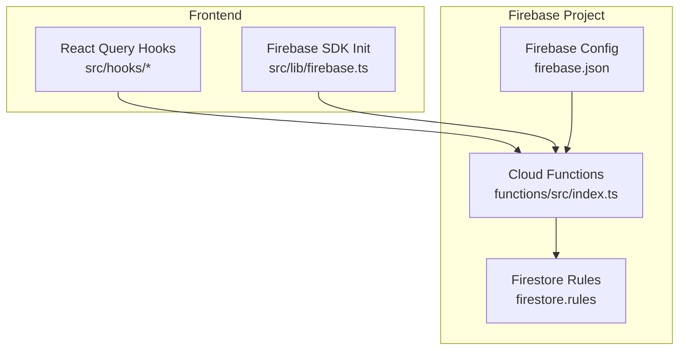
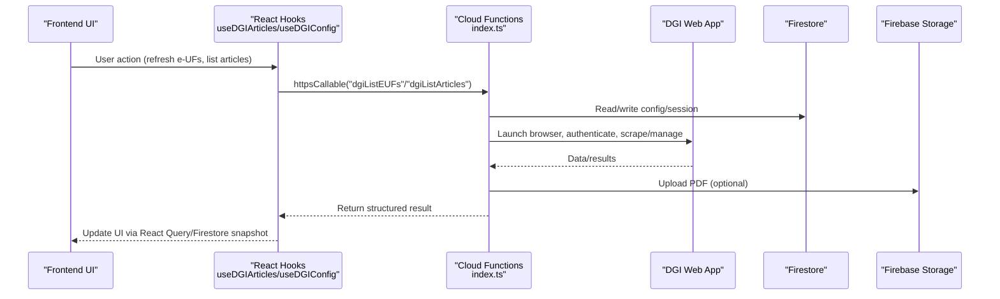
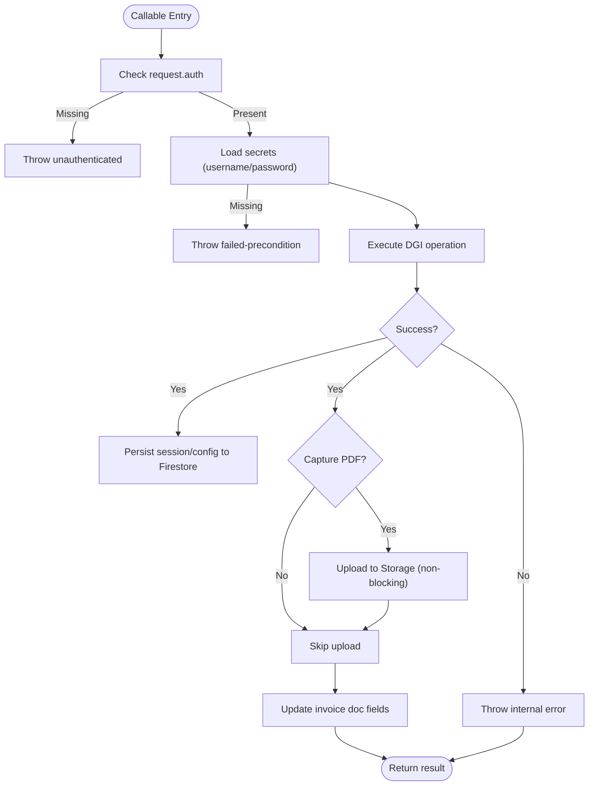
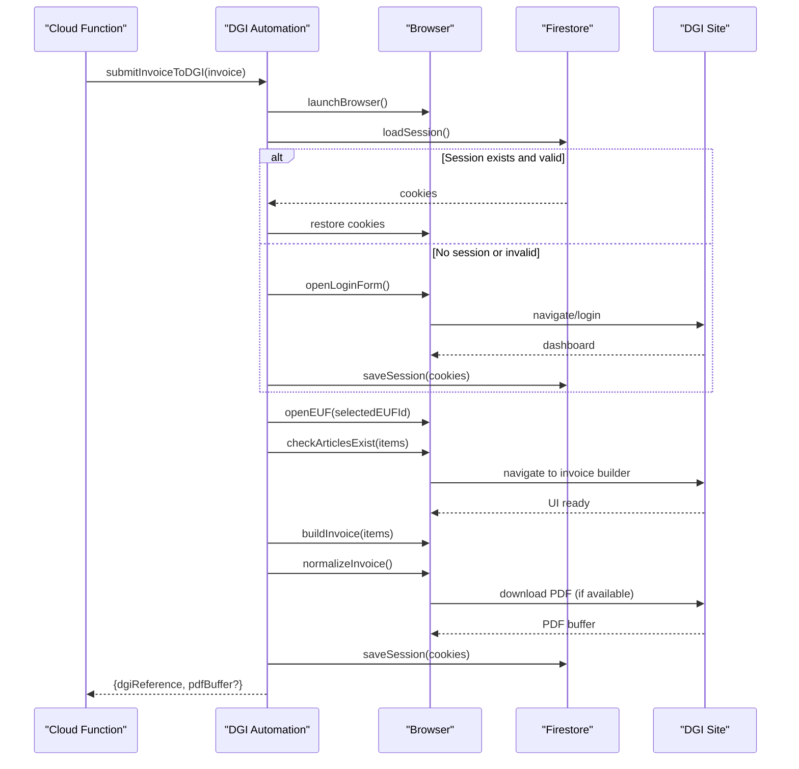
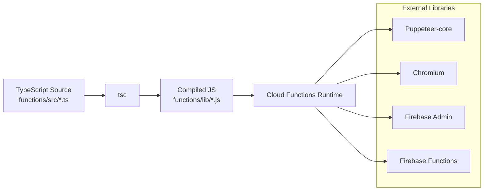

# Backend Architecture

<cite>
**Referenced Files in This Document**
- [index.ts](file://functions/src/index.ts)
- [dgiAutomation.ts](file://functions/src/dgiAutomation.ts)
- [firebase.json](file://firebase.json)
- [firestore.rules](file://firestore.rules)
- [firebase.ts](file://src/lib/firebase.ts)
- [useDGIArticles.ts](file://src/hooks/useDGIArticles.ts)
- [useDGIConfig.ts](file://src/hooks/useDGIConfig.ts)
- [useDGIStatus.ts](file://src/hooks/useDGIStatus.ts)
- [package.json](file://functions/package.json)
- [package.json](file://package.json)
</cite>

## Table of Contents
1. [Introduction](#introduction)
2. [Project Structure](#project-structure)
3. [Core Components](#core-components)
4. [Architecture Overview](#architecture-overview)
5. [Detailed Component Analysis](#detailed-component-analysis)
6. [Dependency Analysis](#dependency-analysis)
7. [Performance Considerations](#performance-considerations)
8. [Troubleshooting Guide](#troubleshooting-guide)
9. [Conclusion](#conclusion)

## Introduction
This document describes the backend architecture of the ETSMEDF Firebase-based system. It focuses on the serverless functions architecture using Cloud Functions, HTTP callable functions for DGI integration, Firestore database design, and the relationship between frontend hooks and backend functions. It also explains the security model, environment variable management, deployment configuration, automation workflow for DGI integration, error handling strategies, retry mechanisms, infrastructure requirements, scaling considerations, and monitoring approaches.

## Project Structure
The backend is organized into:
- Firebase Functions (TypeScript) under functions/src, exporting HTTP callable Cloud Functions
- Frontend React application under src, consuming Firebase services and calling Cloud Functions via React Query
- Firebase configuration and Firestore security rules



**Diagram sources**
- [index.ts:1-243](file://functions/src/index.ts#L1-L243)
- [firebase.json:1-11](file://firebase.json#L1-L11)
- [firestore.rules:1-9](file://firestore.rules#L1-L9)
- [firebase.ts:1-23](file://src/lib/firebase.ts#L1-L23)
- [useDGIArticles.ts:1-107](file://src/hooks/useDGIArticles.ts#L1-L107)

**Section sources**
- [firebase.json:1-11](file://firebase.json#L1-L11)
- [firebase.ts:1-23](file://src/lib/firebase.ts#L1-L23)

## Core Components
- Cloud Functions entrypoints expose HTTP callable functions for:
  - DGI login/logout
  - Listing e-UFs
  - Managing articles (list/add/delete/update)
  - Submitting invoices to DGI
- DGI automation module orchestrates browser automation with Puppeteer and Chromium to interact with the DGI web application, persist sessions and configuration in Firestore, and capture PDF receipts.
- Frontend hooks integrate with Firebase Authentication, Firestore, and Cloud Functions to provide reactive UI updates and user-driven actions.

Key implementation references:
- Callable exports and configuration: [index.ts:42-242](file://functions/src/index.ts#L42-L242)
- DGI automation orchestration: [dgiAutomation.ts:347-1385](file://functions/src/dgiAutomation.ts#L347-L1385)
- Frontend integration hooks: [useDGIArticles.ts:50-106](file://src/hooks/useDGIArticles.ts#L50-L106), [useDGIConfig.ts:21-83](file://src/hooks/useDGIConfig.ts#L21-L83), [useDGIStatus.ts:12-33](file://src/hooks/useDGIStatus.ts#L12-L33)

**Section sources**
- [index.ts:42-242](file://functions/src/index.ts#L42-L242)
- [dgiAutomation.ts:347-1385](file://functions/src/dgiAutomation.ts#L347-L1385)
- [useDGIArticles.ts:50-106](file://src/hooks/useDGIArticles.ts#L50-L106)
- [useDGIConfig.ts:21-83](file://src/hooks/useDGIConfig.ts#L21-L83)
- [useDGIStatus.ts:12-33](file://src/hooks/useDGIStatus.ts#L12-L33)

## Architecture Overview
The system follows a serverless pattern:
- Frontend triggers Cloud Functions via HTTPS callable functions
- Functions authenticate callers using Firebase Auth and enforce per-function authorization
- Functions manage DGI sessions and configuration in Firestore and optionally upload PDFs to Firebase Storage
- Frontend subscribes to Firestore snapshots for live updates



**Diagram sources**
- [index.ts:42-242](file://functions/src/index.ts#L42-L242)
- [dgiAutomation.ts:347-1385](file://functions/src/dgiAutomation.ts#L347-L1385)
- [useDGIArticles.ts:50-106](file://src/hooks/useDGIArticles.ts#L50-L106)
- [useDGIConfig.ts:72-83](file://src/hooks/useDGIConfig.ts#L72-L83)

## Detailed Component Analysis

### Cloud Functions Layer
- Callable functions:
  - Authentication gating: each function checks request.auth and throws unauthenticated errors otherwise
  - Secrets management: DGI credentials are defined as secrets and accessed at runtime
  - Function-specific configurations: base and per-function memory and timeout settings
  - Error handling: standardized HttpsError wrapping with structured logging
  - PDF handling: optional upload to Firebase Storage and update of invoice document fields



**Diagram sources**
- [index.ts:42-242](file://functions/src/index.ts#L42-L242)

**Section sources**
- [index.ts:19-38](file://functions/src/index.ts#L19-L38)
- [index.ts:42-71](file://functions/src/index.ts#L42-L71)
- [index.ts:75-89](file://functions/src/index.ts#L75-L89)
- [index.ts:93-176](file://functions/src/index.ts#L93-L176)
- [index.ts:180-242](file://functions/src/index.ts#L180-L242)

### DGI Automation Engine
- Browser orchestration:
  - Launch Chromium via Puppeteer-core with custom args and viewport
  - Robust login flow with multiple strategies and fallbacks
  - Session persistence and reuse via Firestore document
  - e-UF selection and navigation to article management
- Data extraction:
  - Multi-strategy article list scraping supporting HTML tables, Angular Material grids, and custom row structures
  - Invoice building and normalization with PDF capture
- Safety checks:
  - Pre-submission validation that all invoice items exist in DGI
  - Graceful handling of missing elements with descriptive errors



**Diagram sources**
- [dgiAutomation.ts:347-1385](file://functions/src/dgiAutomation.ts#L347-L1385)

**Section sources**
- [dgiAutomation.ts:79-94](file://functions/src/dgiAutomation.ts#L79-L94)
- [dgiAutomation.ts:347-391](file://functions/src/dgiAutomation.ts#L347-L391)
- [dgiAutomation.ts:395-428](file://functions/src/dgiAutomation.ts#L395-L428)
- [dgiAutomation.ts:536-594](file://functions/src/dgiAutomation.ts#L536-L594)
- [dgiAutomation.ts:1072-1153](file://functions/src/dgiAutomation.ts#L1072-L1153)
- [dgiAutomation.ts:1360-1385](file://functions/src/dgiAutomation.ts#L1360-L1385)

### Frontend Hooks and Firestore Integration
- React Query integration:
  - useDGIArticles: queries article list via dgiListArticles
  - useDGIAddArticle/useDGIDeleteArticle/useDGIUpdateArticle: mutations that call corresponding Cloud Functions
  - useRefreshEUFs: refreshes e-UF list via dgiListEUFs
- Live synchronization:
  - useStoredDGIArticles: listens to Firestore document for selected e-UF’s article list
  - useDGIStatus: monitors session presence and timestamp in Firestore
- Authentication and initialization:
  - Firebase initialized with environment variables
  - Hooks rely on Firebase Auth being signed in for callable invocation

```mermaid
classDiagram
class FirebaseInit {
+initializeApp(config)
+getFirestore()
+getAuth()
}
class Hooks {
+useDGIArticles()
+useDGIAddArticle()
+useDGIDeleteArticle()
+useDGIUpdateArticle()
+useRefreshEUFs()
+useStoredDGIArticles()
+useDGIStatus()
}
class FirestoreDocs {
+"dgi_config/settings"
+"dgi_sessions/session"
+"dgi_articles/{eufId}"
}
FirebaseInit --> Hooks : "provides db/auth"
Hooks --> FirestoreDocs : "read/write"
```

**Diagram sources**
- [firebase.ts:1-23](file://src/lib/firebase.ts#L1-L23)
- [useDGIArticles.ts:16-40](file://src/hooks/useDGIArticles.ts#L16-L40)
- [useDGIConfig.ts:19-51](file://src/hooks/useDGIConfig.ts#L19-L51)
- [useDGIStatus.ts:12-33](file://src/hooks/useDGIStatus.ts#L12-L33)

**Section sources**
- [useDGIArticles.ts:50-106](file://src/hooks/useDGIArticles.ts#L50-L106)
- [useDGIConfig.ts:72-83](file://src/hooks/useDGIConfig.ts#L72-L83)
- [useDGIStatus.ts:12-33](file://src/hooks/useDGIStatus.ts#L12-L33)
- [firebase.ts:1-23](file://src/lib/firebase.ts#L1-L23)

## Dependency Analysis
- Runtime and toolchain:
  - Functions runtime: Node.js 20
  - Build pipeline: TypeScript compilation
  - Emulator and deploy scripts
- External libraries:
  - Puppeteer-core and Chromium for browser automation
  - Firebase Admin SDK for Firestore/Storage operations
  - Firebase Functions SDK for callable functions
- Frontend dependencies:
  - React Query for caching and optimistic updates
  - Firebase JS SDK for auth/firestore/functions



**Diagram sources**
- [package.json:1-34](file://functions/package.json#L1-L34)
- [package.json:1-56](file://package.json#L1-L56)

**Section sources**
- [package.json:1-34](file://functions/package.json#L1-L34)
- [package.json:1-56](file://package.json#L1-L56)

## Performance Considerations
- Function timeouts and memory:
  - Base configuration sets memory and regions; invoice and article operations have extended timeouts to accommodate browser automation
- Browser resource usage:
  - Headless Chromium launched per operation; consider batching or rate limiting to avoid cold starts and resource spikes
- Firestore writes:
  - Session and configuration updates occur after each operation; batch writes if multiple updates are needed
- PDF capture:
  - Optional and asynchronous; failures are logged but non-fatal to submission flow
- Frontend caching:
  - React Query staleTime and enabled flags minimize redundant calls; invalidate on successful mutations

[No sources needed since this section provides general guidance]

## Troubleshooting Guide
- Authentication failures:
  - Ensure Firebase Auth is initialized and user is signed in before invoking callable functions
  - Functions explicitly check request.auth and return unauthenticated errors
- Missing DGI credentials:
  - Functions require secrets to be configured; absence triggers a failed-precondition error
- DGI login issues:
  - Login flow includes multiple strategies; verify network access to DGI and that credentials are correct
- Missing articles during invoice submission:
  - Submission pre-checks article existence; add missing items before submitting
- PDF capture failures:
  - Capture is best-effort; function logs warnings and continues without blocking
- Firestore permission errors:
  - Current rules allow read/write only when user is authenticated; verify auth state

**Section sources**
- [index.ts:42-71](file://functions/src/index.ts#L42-L71)
- [index.ts:19-38](file://functions/src/index.ts#L19-L38)
- [dgiAutomation.ts:919-926](file://functions/src/dgiAutomation.ts#L919-L926)
- [dgiAutomation.ts:1332-1356](file://functions/src/dgiAutomation.ts#L1332-L1356)
- [firestore.rules:4-6](file://firestore.rules#L4-L6)

## Conclusion
ETSMEDF employs a robust serverless backend leveraging Cloud Functions, Firestore, and Firebase Authentication. The DGI integration is encapsulated in a dedicated automation module that manages browser sessions, scrapes and manipulates DGI data, and persists state in Firestore. Frontend hooks provide a responsive, authenticated UX that reacts to Firestore changes and invokes Cloud Functions for server-side operations. Security is enforced through Firebase Auth and Firestore rules, while deployment and development workflows are streamlined via Firebase CLI and TypeScript tooling.