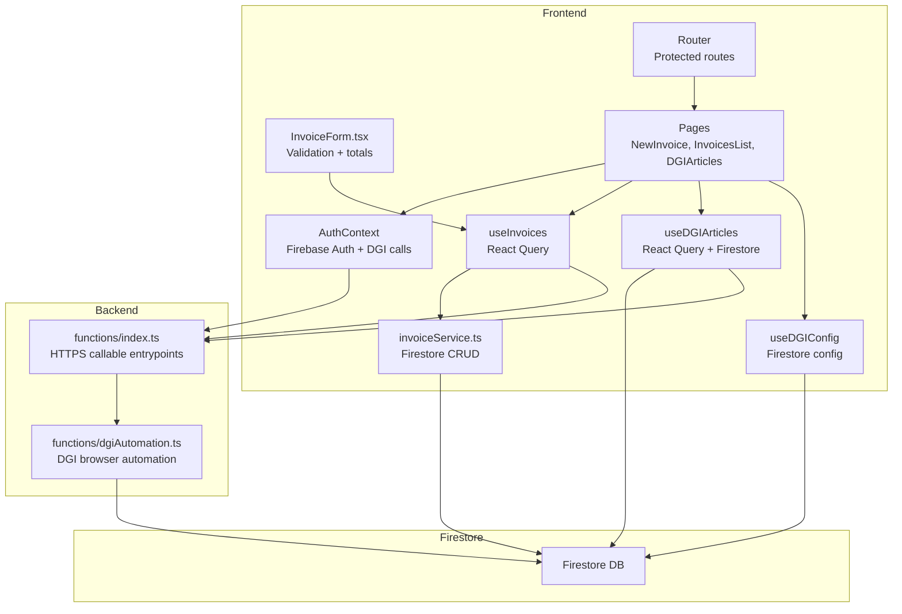
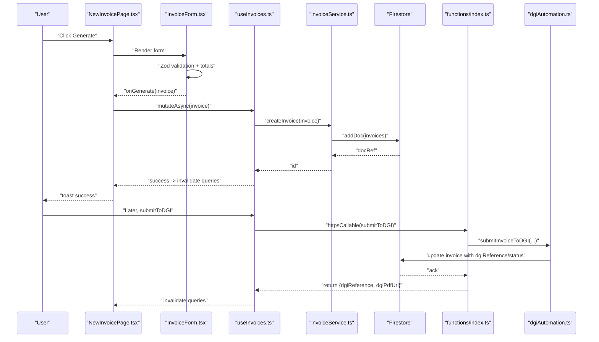
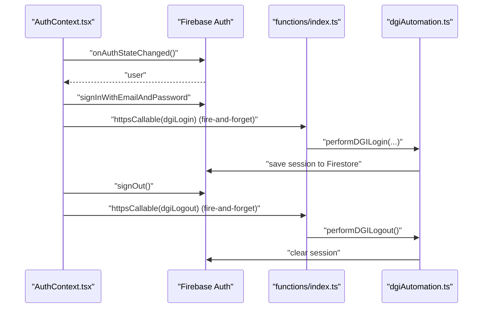
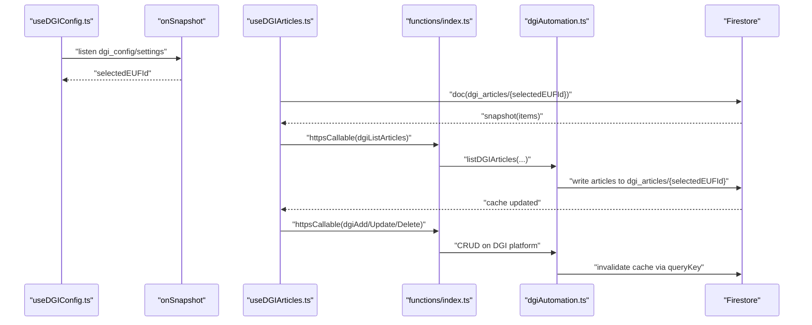
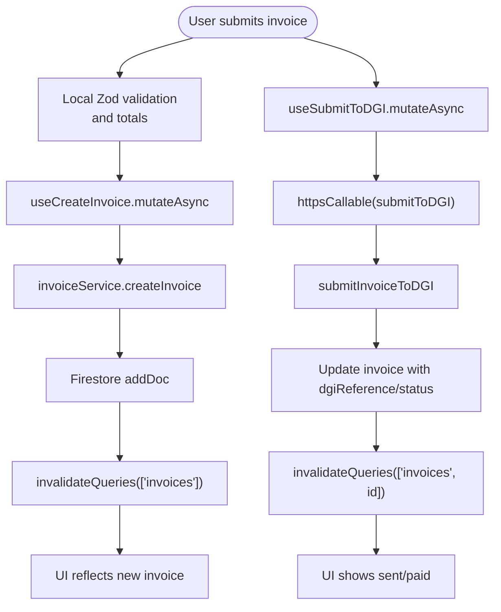
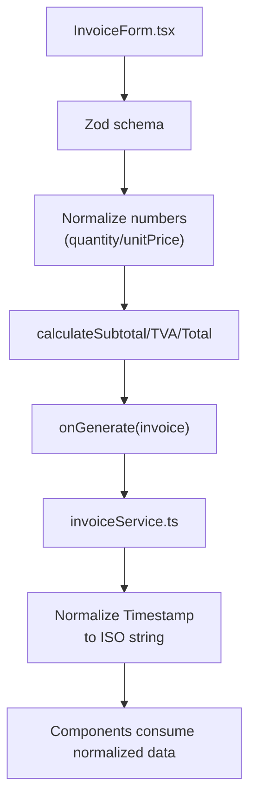
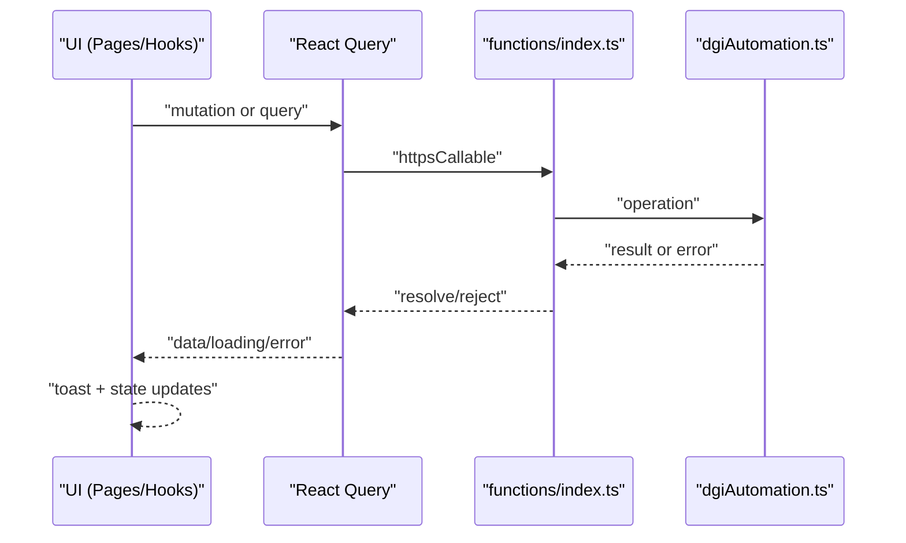
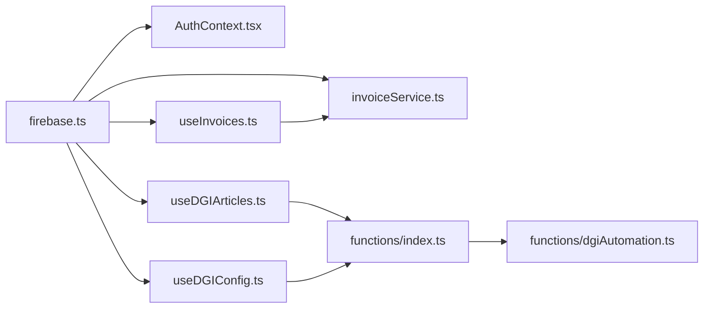

# Data Flow Patterns

<cite>
**Referenced Files in This Document**
- [firebase.ts](file://src/lib/firebase.ts)
- [AuthContext.tsx](file://src/contexts/AuthContext.tsx)
- [router.tsx](file://src/router.tsx)
- [useInvoices.ts](file://src/hooks/useInvoices.ts)
- [invoiceService.ts](file://src/lib/invoiceService.ts)
- [InvoiceForm.tsx](file://src/components/InvoiceForm.tsx)
- [NewInvoicePage.tsx](file://src/pages/NewInvoicePage.tsx)
- [InvoicesListPage.tsx](file://src/pages/InvoicesListPage.tsx)
- [useDGIArticles.ts](file://src/hooks/useDGIArticles.ts)
- [useDGIConfig.ts](file://src/hooks/useDGIConfig.ts)
- [DGIArticlesPage.tsx](file://src/pages/DGIArticlesPage.tsx)
- [dgiAutomation.ts](file://functions/src/dgiAutomation.ts)
- [index.ts](file://functions/src/index.ts)
- [invoice.ts](file://src/types/invoice.ts)
</cite>

## Table of Contents
1. [Introduction](#introduction)
2. [Project Structure](#project-structure)
3. [Core Components](#core-components)
4. [Architecture Overview](#architecture-overview)
5. [Detailed Component Analysis](#detailed-component-analysis)
6. [Dependency Analysis](#dependency-analysis)
7. [Performance Considerations](#performance-considerations)
8. [Troubleshooting Guide](#troubleshooting-guide)
9. [Conclusion](#conclusion)

## Introduction
This document explains how data flows through the ETSMEDF application, focusing on real-time synchronization between Firestore and React components, optimistic UI updates, cache invalidation, and the integration of DGI automation. It traces the journey from user input through form components to Firebase services, and how Cloud Functions orchestrate DGI operations. Authentication state flow, error propagation, loading states, and the interplay between local state, React Query cache, and Firestore persistence are documented with precise references to source files.

## Project Structure
The application is organized around:
- Frontend (React + TypeScript): UI pages, forms, hooks, services, and routing
- Backend (Cloud Functions): DGI automation and HTTPS callable endpoints
- Shared types and utilities: invoice types and helpers

**Diagram sources**
- [router.tsx:1-92](file://src/router.tsx#L1-L92)
- [AuthContext.tsx:1-62](file://src/contexts/AuthContext.tsx#L1-L62)
- [useInvoices.ts:1-90](file://src/hooks/useInvoices.ts#L1-L90)
- [useDGIArticles.ts:1-107](file://src/hooks/useDGIArticles.ts#L1-L107)
- [useDGIConfig.ts:1-84](file://src/hooks/useDGIConfig.ts#L1-L84)
- [invoiceService.ts:1-58](file://src/lib/invoiceService.ts#L1-L58)
- [InvoiceForm.tsx:1-343](file://src/components/InvoiceForm.tsx#L1-L343)
- [index.ts:1-243](file://functions/src/index.ts#L1-L243)
- [dgiAutomation.ts:1-800](file://functions/src/dgiAutomation.ts#L1-L800)

**Section sources**
- [router.tsx:1-92](file://src/router.tsx#L1-L92)
- [firebase.ts:1-23](file://src/lib/firebase.ts#L1-L23)

## Core Components
- Authentication state and DGI login/logout orchestration
- Invoice lifecycle: creation, listing, status updates, deletion, and submission to DGI
- DGI article management: fetching, adding, updating, deleting, and live sync
- Real-time configuration selection for DGI e-UF (point of sale)
- Validation, transformation, and normalization across the pipeline

**Section sources**
- [AuthContext.tsx:1-62](file://src/contexts/AuthContext.tsx#L1-L62)
- [useInvoices.ts:1-90](file://src/hooks/useInvoices.ts#L1-L90)
- [useDGIArticles.ts:1-107](file://src/hooks/useDGIArticles.ts#L1-L107)
- [useDGIConfig.ts:1-84](file://src/hooks/useDGIConfig.ts#L1-L84)
- [invoiceService.ts:1-58](file://src/lib/invoiceService.ts#L1-L58)
- [InvoiceForm.tsx:1-343](file://src/components/InvoiceForm.tsx#L1-L343)

## Architecture Overview
The system combines:
- React Query for caching, background refetching, and optimistic updates
- Firestore for persistent storage and real-time listeners
- Firebase Auth for identity and secure callable functions
- Cloud Functions for DGI automation (browser automation, session management, e-UF selection)

**Diagram sources**
- [NewInvoicePage.tsx:1-45](file://src/pages/NewInvoicePage.tsx#L1-L45)
- [InvoiceForm.tsx:1-343](file://src/components/InvoiceForm.tsx#L1-L343)
- [useInvoices.ts:60-89](file://src/hooks/useInvoices.ts#L60-L89)
- [invoiceService.ts:19-25](file://src/lib/invoiceService.ts#L19-L25)
- [index.ts:180-242](file://functions/src/index.ts#L180-L242)
- [dgiAutomation.ts:1-800](file://functions/src/dgiAutomation.ts#L1-L800)

## Detailed Component Analysis

### Authentication State Flow
- Initializes Firebase Auth and Analytics
- Listens to auth state changes and exposes sign-in/sign-out
- Calls DGI login/logout via HTTPS callable functions (fire-and-forget) after auth events

**Diagram sources**
- [AuthContext.tsx:20-48](file://src/contexts/AuthContext.tsx#L20-L48)
- [index.ts:42-71](file://functions/src/index.ts#L42-L71)
- [dgiAutomation.ts:347-391](file://functions/src/dgiAutomation.ts#L347-L391)

**Section sources**
- [AuthContext.tsx:1-62](file://src/contexts/AuthContext.tsx#L1-L62)
- [firebase.ts:1-23](file://src/lib/firebase.ts#L1-L23)

### Real-Time Synchronization: DGI Articles and Configuration
- Live listener on Firestore document for DGI articles per selected e-UF
- React Query cache for DGI article list fetched via Cloud Function
- Mutation-based CRUD operations against DGI platform through Cloud Functions

**Diagram sources**
- [useDGIConfig.ts:29-48](file://src/hooks/useDGIConfig.ts#L29-L48)
- [useDGIArticles.ts:16-40](file://src/hooks/useDGIArticles.ts#L16-L40)
- [index.ts:93-176](file://functions/src/index.ts#L93-L176)
- [dgiAutomation.ts:1-800](file://functions/src/dgiAutomation.ts#L1-L800)

**Section sources**
- [useDGIConfig.ts:1-84](file://src/hooks/useDGIConfig.ts#L1-L84)
- [useDGIArticles.ts:1-107](file://src/hooks/useDGIArticles.ts#L1-L107)
- [DGIArticlesPage.tsx:1-445](file://src/pages/DGIArticlesPage.tsx#L1-L445)

### Invoice Creation and Submission to DGI
- Form validation and totals computed locally
- Optimistic creation: UI shows success immediately while backend persists
- Submission to DGI via HTTPS callable; updates Firestore with DGI reference and status

**Diagram sources**
- [InvoiceForm.tsx:98-106](file://src/components/InvoiceForm.tsx#L98-L106)
- [useInvoices.ts:32-38](file://src/hooks/useInvoices.ts#L32-L38)
- [invoiceService.ts:19-25](file://src/lib/invoiceService.ts#L19-L25)
- [index.ts:180-242](file://functions/src/index.ts#L180-L242)
- [dgiAutomation.ts:1-800](file://functions/src/dgiAutomation.ts#L1-L800)

**Section sources**
- [InvoiceForm.tsx:1-343](file://src/components/InvoiceForm.tsx#L1-L343)
- [NewInvoicePage.tsx:1-45](file://src/pages/NewInvoicePage.tsx#L1-L45)
- [useInvoices.ts:1-90](file://src/hooks/useInvoices.ts#L1-L90)
- [invoiceService.ts:1-58](file://src/lib/invoiceService.ts#L1-L58)

### Data Validation, Transformation, and Normalization
- Form-level validation with Zod resolves to typed data
- Numeric normalization for quantities and unit prices
- Totals computed from normalized items
- Firestore timestamps normalized to ISO strings for UI consumption

**Diagram sources**
- [InvoiceForm.tsx:81-88](file://src/components/InvoiceForm.tsx#L81-L88)
- [invoice.ts:28-38](file://src/types/invoice.ts#L28-L38)
- [invoiceService.ts:30-48](file://src/lib/invoiceService.ts#L30-L48)

**Section sources**
- [InvoiceForm.tsx:15-31](file://src/components/InvoiceForm.tsx#L15-L31)
- [invoice.ts:1-39](file://src/types/invoice.ts#L1-L39)
- [invoiceService.ts:27-48](file://src/lib/invoiceService.ts#L27-L48)

### Error Propagation and Loading States
- Loading states driven by React Query and local state
- Toast notifications surface success/error messages
- Cloud Function errors propagate with meaningful messages
- Firestore read/write errors bubble to UI

**Diagram sources**
- [InvoicesListPage.tsx:74-88](file://src/pages/InvoicesListPage.tsx#L74-L88)
- [DGIArticlesPage.tsx:50-57](file://src/pages/DGIArticlesPage.tsx#L50-L57)
- [index.ts:180-242](file://functions/src/index.ts#L180-L242)

**Section sources**
- [InvoicesListPage.tsx:1-174](file://src/pages/InvoicesListPage.tsx#L1-L174)
- [DGIArticlesPage.tsx:1-445](file://src/pages/DGIArticlesPage.tsx#L1-L445)
- [useInvoices.ts:1-90](file://src/hooks/useInvoices.ts#L1-L90)

## Dependency Analysis
- Frontend depends on Firebase SDKs for Auth, Firestore, and Functions
- Hooks encapsulate React Query and Firestore interactions
- Cloud Functions depend on Firebase Admin and external browser automation libraries
- DGI automation orchestrates browser sessions and writes to Firestore

**Diagram sources**
- [firebase.ts:1-23](file://src/lib/firebase.ts#L1-L23)
- [AuthContext.tsx:1-62](file://src/contexts/AuthContext.tsx#L1-L62)
- [invoiceService.ts:1-58](file://src/lib/invoiceService.ts#L1-L58)
- [useInvoices.ts:1-90](file://src/hooks/useInvoices.ts#L1-L90)
- [useDGIArticles.ts:1-107](file://src/hooks/useDGIArticles.ts#L1-L107)
- [useDGIConfig.ts:1-84](file://src/hooks/useDGIConfig.ts#L1-L84)
- [index.ts:1-243](file://functions/src/index.ts#L1-L243)
- [dgiAutomation.ts:1-800](file://functions/src/dgiAutomation.ts#L1-L800)

**Section sources**
- [router.tsx:1-92](file://src/router.tsx#L1-L92)
- [firebase.ts:1-23](file://src/lib/firebase.ts#L1-L23)

## Performance Considerations
- React Query staleTime and manual invalidation minimize redundant network calls
- Firestore onSnapshot provides near real-time updates with minimal latency
- Cloud Function timeouts configured per operation (invoices vs articles)
- Local numeric normalization avoids repeated conversions and reduces UI recalculation overhead

[No sources needed since this section provides general guidance]

## Troubleshooting Guide
Common issues and where to look:
- Firebase initialization or environment variables missing
  - Check Firebase config initialization and environment variables
  - Reference: [firebase.ts:6-14](file://src/lib/firebase.ts#L6-L14)
- Authentication failures or DGI login errors
  - Inspect HTTPS callable error propagation and DGI session handling
  - Reference: [AuthContext.tsx:20-48](file://src/contexts/AuthContext.tsx#L20-L48), [index.ts:42-71](file://functions/src/index.ts#L42-L71)
- Invoice creation or DGI submission errors
  - Validate form inputs, check toast messages, and Cloud Function error payloads
  - Reference: [InvoiceForm.tsx:98-106](file://src/components/InvoiceForm.tsx#L98-L106), [useInvoices.ts:60-89](file://src/hooks/useInvoices.ts#L60-L89), [index.ts:180-242](file://functions/src/index.ts#L180-L242)
- DGI article list not loading
  - Confirm selected e-UF, Cloud Function permissions, and browser automation logs
  - Reference: [useDGIConfig.ts:29-48](file://src/hooks/useDGIConfig.ts#L29-L48), [useDGIArticles.ts:50-62](file://src/hooks/useDGIArticles.ts#L50-L62), [index.ts:93-176](file://functions/src/index.ts#L93-L176)

**Section sources**
- [firebase.ts:1-23](file://src/lib/firebase.ts#L1-L23)
- [AuthContext.tsx:1-62](file://src/contexts/AuthContext.tsx#L1-L62)
- [InvoiceForm.tsx:1-343](file://src/components/InvoiceForm.tsx#L1-L343)
- [useInvoices.ts:1-90](file://src/hooks/useInvoices.ts#L1-L90)
- [useDGIConfig.ts:1-84](file://src/hooks/useDGIConfig.ts#L1-L84)
- [useDGIArticles.ts:1-107](file://src/hooks/useDGIArticles.ts#L1-L107)
- [index.ts:1-243](file://functions/src/index.ts#L1-L243)

## Conclusion
ETSMEDF implements a robust data flow that blends React Query caching, Firestore real-time listeners, and Cloud Functions for DGI automation. The system supports optimistic UI updates, structured validation and normalization, and explicit cache invalidation to keep the UI synchronized with Firestore. Authentication state is tightly coupled with DGI session management through HTTPS callables, ensuring seamless end-to-end invoice generation and submission.