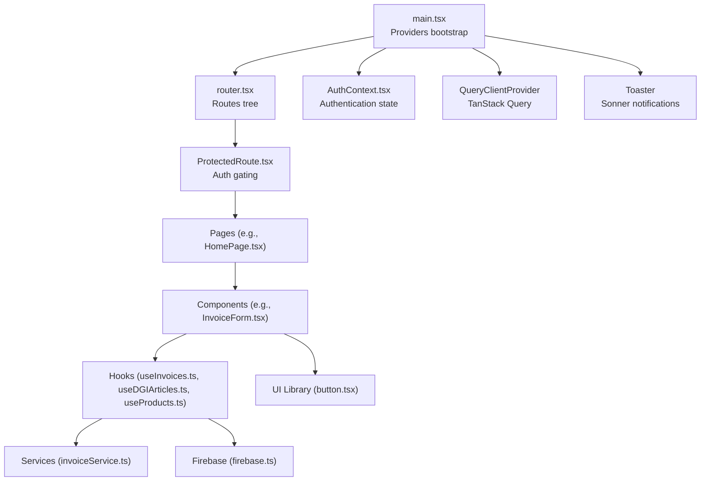
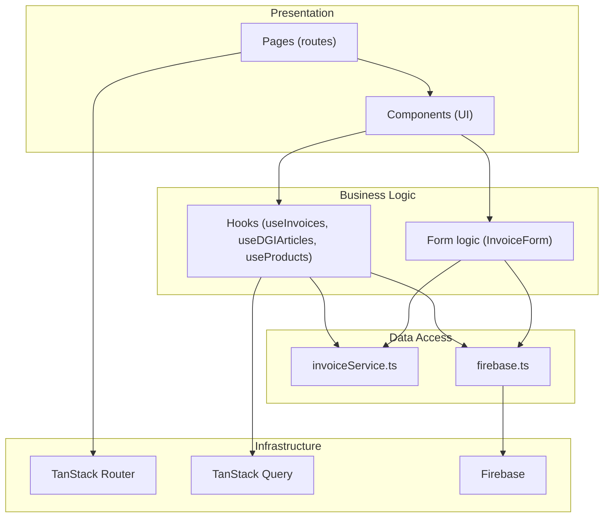
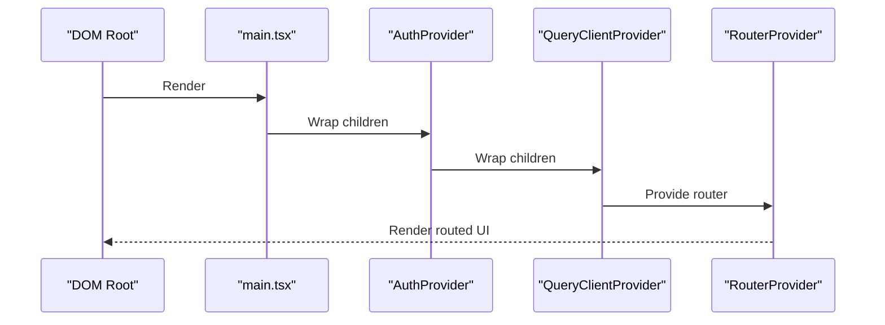
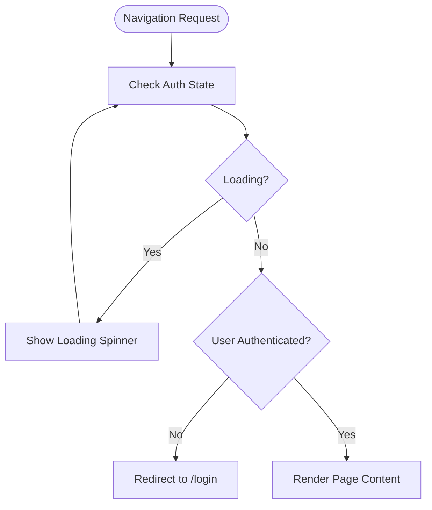
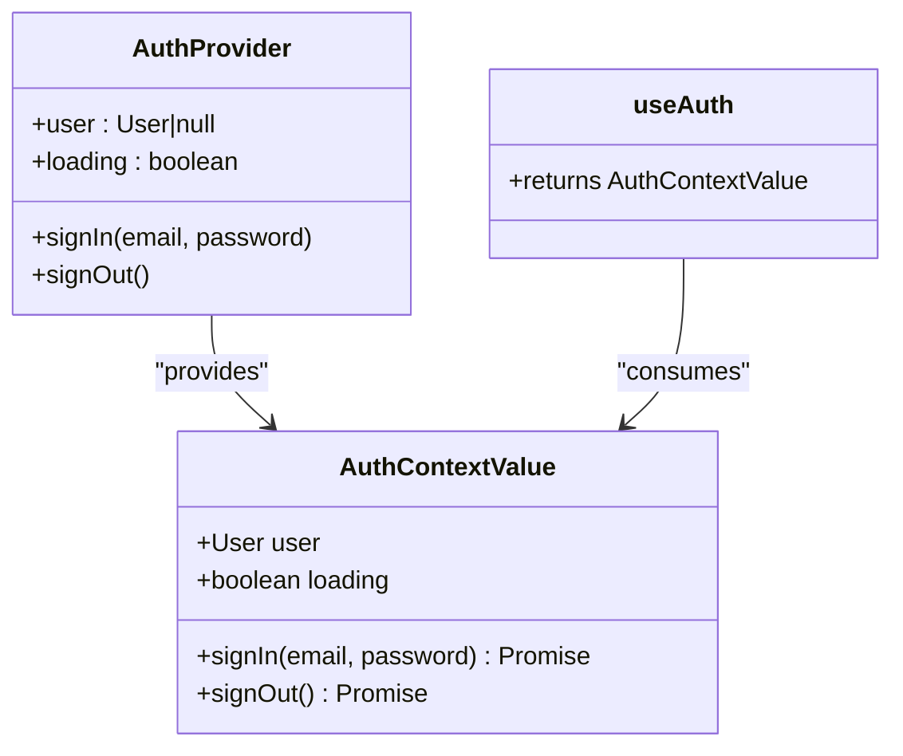
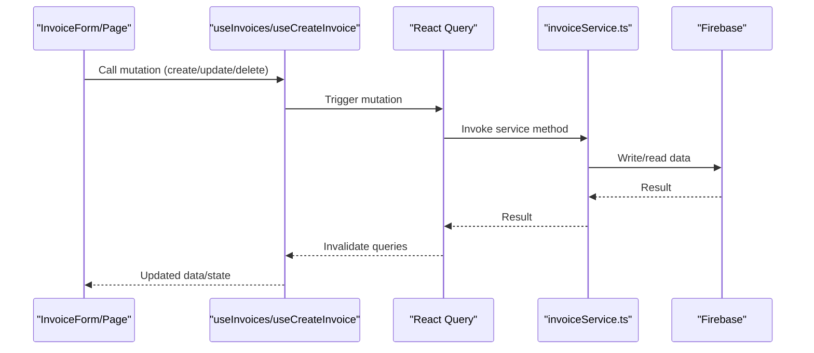
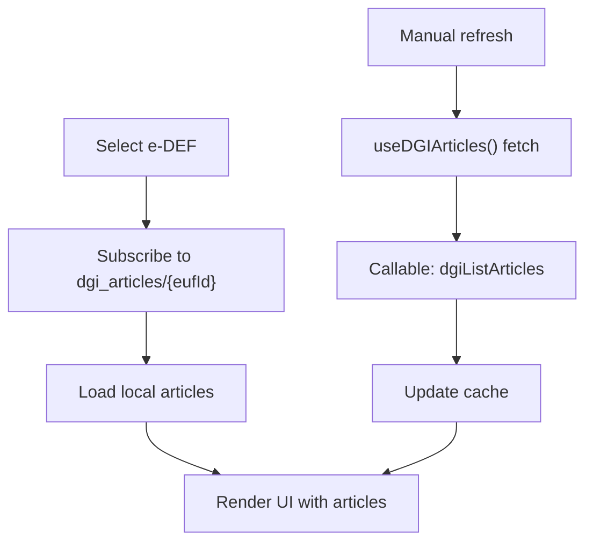
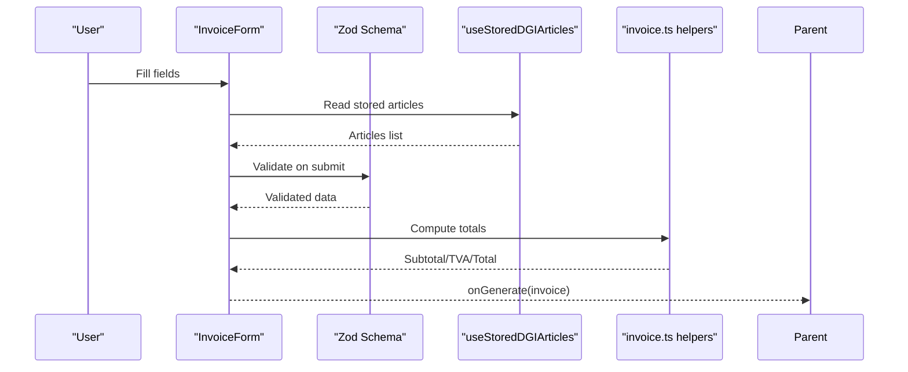
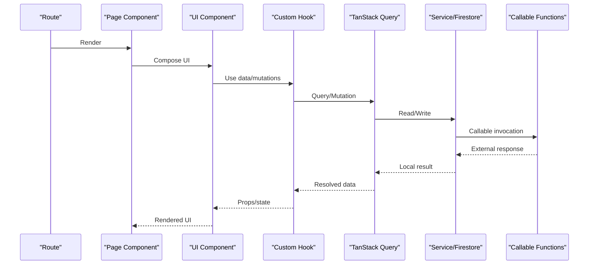
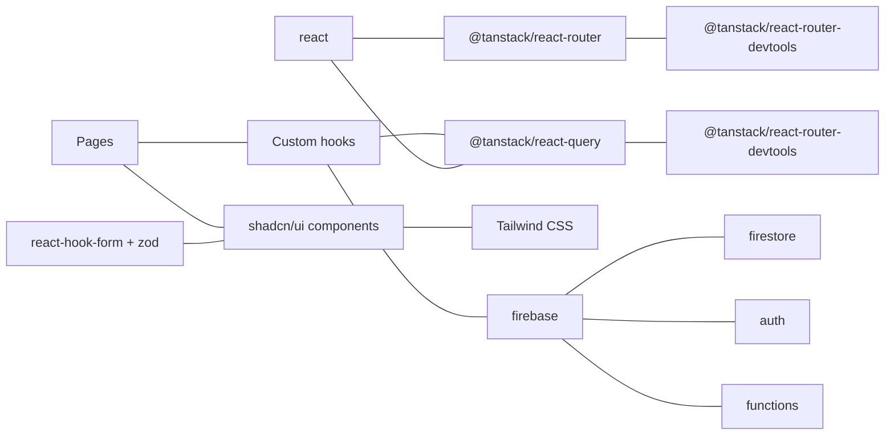

# Frontend Architecture

<cite>
**Referenced Files in This Document**
- [main.tsx](file://src/main.tsx)
- [router.tsx](file://src/router.tsx)
- [AuthContext.tsx](file://src/contexts/AuthContext.tsx)
- [ProtectedRoute.tsx](file://src/components/ProtectedRoute.tsx)
- [button.tsx](file://src/components/ui/button.tsx)
- [InvoiceForm.tsx](file://src/components/InvoiceForm.tsx)
- [useInvoices.ts](file://src/hooks/useInvoices.ts)
- [useDGIArticles.ts](file://src/hooks/useDGIArticles.ts)
- [useProducts.ts](file://src/hooks/useProducts.ts)
- [invoiceService.ts](file://src/lib/invoiceService.ts)
- [invoice.ts](file://src/types/invoice.ts)
- [firebase.ts](file://src/lib/firebase.ts)
- [utils.ts](file://src/lib/utils.ts)
- [package.json](file://package.json)
</cite>

## Table of Contents
1. [Introduction](#introduction)
2. [Project Structure](#project-structure)
3. [Core Components](#core-components)
4. [Architecture Overview](#architecture-overview)
5. [Detailed Component Analysis](#detailed-component-analysis)
6. [Dependency Analysis](#dependency-analysis)
7. [Performance Considerations](#performance-considerations)
8. [Troubleshooting Guide](#troubleshooting-guide)
9. [Conclusion](#conclusion)

## Introduction
This document describes the frontend architecture of the ETSMEDF React application. It covers the entry point, routing with TanStack Router, authentication and protected routes via React Context, hook-based business logic separation, UI integration with shadcn/ui and Tailwind CSS, data fetching with TanStack Query, and TypeScript-driven development patterns. The goal is to explain how pages, components, and hooks collaborate to deliver a responsive, type-safe, and maintainable frontend.

## Project Structure
The frontend is organized around a clear separation of concerns:
- Entry point initializes providers for routing, authentication, data queries, and notifications.
- Routing defines nested routes under a root outlet, with protected routes wrapping page components.
- Pages represent route-level views.
- Components encapsulate reusable UI and form logic.
- Hooks abstract data fetching, mutations, and derived calculations.
- Services and libraries provide Firebase integration and shared utilities.

**Diagram sources**
- [main.tsx:1-22](file://src/main.tsx#L1-L22)
- [router.tsx:1-92](file://src/router.tsx#L1-L92)
- [ProtectedRoute.tsx:1-24](file://src/components/ProtectedRoute.tsx#L1-L24)
- [HomePage.tsx:1-91](file://src/pages/HomePage.tsx#L1-L91)
- [InvoiceForm.tsx:1-343](file://src/components/InvoiceForm.tsx#L1-L343)
- [useInvoices.ts:1-90](file://src/hooks/useInvoices.ts#L1-L90)
- [useDGIArticles.ts:1-107](file://src/hooks/useDGIArticles.ts#L1-L107)
- [useProducts.ts:1-19](file://src/hooks/useProducts.ts#L1-L19)
- [invoiceService.ts:1-58](file://src/lib/invoiceService.ts#L1-L58)
- [firebase.ts:1-23](file://src/lib/firebase.ts#L1-L23)
- [button.tsx:1-65](file://src/components/ui/button.tsx#L1-L65)

**Section sources**
- [main.tsx:1-22](file://src/main.tsx#L1-L22)
- [router.tsx:1-92](file://src/router.tsx#L1-L92)

## Core Components
- Providers and Root Bootstrap
  - Initializes TanStack Router, React Query, Sonner notifications, and wraps the app in AuthProvider.
  - Ensures global query client availability and toast integration.
- Authentication Context
  - Manages Firebase authentication state, sign-in/out, and DGI integration via callable functions.
  - Exposes a typed hook for consuming auth state and actions.
- Protected Routes
  - Guards route access by checking auth state and redirecting unauthenticated users to login.
- UI Library and Styling
  - Uses shadcn/ui primitives with Tailwind CSS for consistent, themeable components.
  - Utility function merges class names safely.

**Section sources**
- [main.tsx:1-22](file://src/main.tsx#L1-L22)
- [AuthContext.tsx:1-62](file://src/contexts/AuthContext.tsx#L1-L62)
- [ProtectedRoute.tsx:1-24](file://src/components/ProtectedRoute.tsx#L1-L24)
- [button.tsx:1-65](file://src/components/ui/button.tsx#L1-L65)
- [utils.ts:1-7](file://src/lib/utils.ts#L1-L7)

## Architecture Overview
The application follows a layered architecture:
- Presentation Layer: Pages and components render UI and orchestrate user interactions.
- Business Logic Layer: Hooks encapsulate data fetching, mutations, and derived computations.
- Data Access Layer: Services abstract Firebase operations; callable functions bridge to external systems.
- Infrastructure Layer: Firebase SDK, TanStack Query, and TanStack Router provide runtime capabilities.

**Diagram sources**
- [router.tsx:1-92](file://src/router.tsx#L1-L92)
- [useInvoices.ts:1-90](file://src/hooks/useInvoices.ts#L1-L90)
- [useDGIArticles.ts:1-107](file://src/hooks/useDGIArticles.ts#L1-L107)
- [useProducts.ts:1-19](file://src/hooks/useProducts.ts#L1-L19)
- [InvoiceForm.tsx:1-343](file://src/components/InvoiceForm.tsx#L1-L343)
- [invoiceService.ts:1-58](file://src/lib/invoiceService.ts#L1-L58)
- [firebase.ts:1-23](file://src/lib/firebase.ts#L1-L23)

## Detailed Component Analysis

### Entry Point and Providers
- Initializes QueryClient and registers it globally.
- Wraps the app in AuthProvider to expose authentication state to the tree.
- Mounts RouterProvider with the prebuilt router.
- Adds Sonner for toast notifications.

**Diagram sources**
- [main.tsx:10-21](file://src/main.tsx#L10-L21)

**Section sources**
- [main.tsx:1-22](file://src/main.tsx#L1-L22)

### Routing and Protected Routes
- Defines nested routes under a root outlet.
- Uses a dedicated ProtectedRoute wrapper to enforce authentication.
- Integrates devtools in development mode.

**Diagram sources**
- [router.tsx:20-74](file://src/router.tsx#L20-L74)
- [ProtectedRoute.tsx:6-23](file://src/components/ProtectedRoute.tsx#L6-L23)

**Section sources**
- [router.tsx:1-92](file://src/router.tsx#L1-L92)
- [ProtectedRoute.tsx:1-24](file://src/components/ProtectedRoute.tsx#L1-L24)

### Authentication Context
- Provides user state, loading flag, and sign-in/sign-out functions.
- Subscribes to Firebase auth state changes.
- Calls DGI callable functions for login/logout without blocking the UI.

**Diagram sources**
- [AuthContext.tsx:11-61](file://src/contexts/AuthContext.tsx#L11-L61)

**Section sources**
- [AuthContext.tsx:1-62](file://src/contexts/AuthContext.tsx#L1-L62)

### Hook-Based Business Logic: Invoices
- Centralizes data fetching and mutations for invoices.
- Uses query keys for cache invalidation and targeted updates.
- Integrates with Firebase Firestore and callable functions for DGI submission.

**Diagram sources**
- [useInvoices.ts:17-89](file://src/hooks/useInvoices.ts#L17-L89)
- [invoiceService.ts:19-57](file://src/lib/invoiceService.ts#L19-L57)

**Section sources**
- [useInvoices.ts:1-90](file://src/hooks/useInvoices.ts#L1-L90)
- [invoiceService.ts:1-58](file://src/lib/invoiceService.ts#L1-L58)

### Hook-Based Business Logic: DGI Articles
- Live subscription to stored DGI articles per selected e-DEF.
- TanStack Query-backed CRUD against DGI via callable functions.
- Controlled caching and manual invalidation.

**Diagram sources**
- [useDGIArticles.ts:16-40](file://src/hooks/useDGIArticles.ts#L16-L40)
- [useDGIArticles.ts:50-63](file://src/hooks/useDGIArticles.ts#L50-L63)

**Section sources**
- [useDGIArticles.ts:1-107](file://src/hooks/useDGIArticles.ts#L1-L107)

### Hook-Based Business Logic: Products
- Fetches product catalog with a short staleness window.
- Builds a product map for fast lookups in forms.

**Section sources**
- [useProducts.ts:1-19](file://src/hooks/useProducts.ts#L1-L19)

### Form Composition and Validation
- InvoiceForm composes react-hook-form with Zod validation.
- Integrates DGI article autocomplete and live totals computation.
- Emits generated invoice objects to parent components for persistence.

**Diagram sources**
- [InvoiceForm.tsx:51-106](file://src/components/InvoiceForm.tsx#L51-L106)
- [useDGIArticles.ts:16-40](file://src/hooks/useDGIArticles.ts#L16-L40)
- [invoice.ts:28-38](file://src/types/invoice.ts#L28-L38)

**Section sources**
- [InvoiceForm.tsx:1-343](file://src/components/InvoiceForm.tsx#L1-L343)
- [invoice.ts:1-39](file://src/types/invoice.ts#L1-L39)

### UI Library and Styling
- shadcn/ui components (Button, Card, Input, etc.) provide accessible, themeable primitives.
- Variants and sizes are standardized via class variance authority and merged with Tailwind utilities.
- Utilities consolidate class merging for predictable styles.

**Section sources**
- [button.tsx:1-65](file://src/components/ui/button.tsx#L1-L65)
- [utils.ts:1-7](file://src/lib/utils.ts#L1-L7)

### Data Flow Through Application Layers
- Pages declare route boundaries and render protected content.
- Components encapsulate presentation and immediate logic.
- Hooks abstract data operations and side effects.
- Services and Firebase provide persistence and integrations.
- TanStack Query manages caching, invalidation, and optimistic updates.

**Diagram sources**
- [router.tsx:26-74](file://src/router.tsx#L26-L74)
- [useInvoices.ts:17-89](file://src/hooks/useInvoices.ts#L17-L89)
- [invoiceService.ts:19-57](file://src/lib/invoiceService.ts#L19-L57)
- [firebase.ts:16-22](file://src/lib/firebase.ts#L16-L22)

## Dependency Analysis
- External libraries include React, TanStack Router, TanStack Query, shadcn/ui, Tailwind CSS, Firebase, react-hook-form, and Zod.
- Internal dependencies are structured around clear boundaries: pages depend on components and hooks; hooks depend on services and Firebase; UI components depend on shared utilities.

**Diagram sources**
- [package.json:12-31](file://package.json#L12-L31)

**Section sources**
- [package.json:1-56](file://package.json#L1-L56)

## Performance Considerations
- TanStack Query caching and selective invalidation reduce redundant network requests and keep the UI responsive.
- Stale-time configuration for product data balances freshness and performance.
- Live subscriptions for DGI articles avoid polling while keeping data synchronized.
- Memoized totals and controlled re-renders in forms minimize expensive recalculations.
- Tailwind utility classes and minimal CSS ensure lightweight styling.

## Troubleshooting Guide
- Authentication state not updating
  - Verify Firebase auth state listener and ensure AuthProvider wraps the app root.
- Protected route redirects to login unexpectedly
  - Confirm loading state handling and that user is properly initialized before rendering protected content.
- TanStack Query cache inconsistencies
  - Check query keys and invalidation strategies after mutations.
- DGI callable failures
  - Inspect callable function logs and confirm environment variables and permissions.
- Styling conflicts
  - Ensure shadcn/ui tokens and Tailwind configuration are correctly set up.

**Section sources**
- [AuthContext.tsx:30-36](file://src/contexts/AuthContext.tsx#L30-L36)
- [ProtectedRoute.tsx:9-20](file://src/components/ProtectedRoute.tsx#L9-L20)
- [useInvoices.ts:36-48](file://src/hooks/useInvoices.ts#L36-L48)
- [firebase.ts:6-14](file://src/lib/firebase.ts#L6-L14)
- [utils.ts:4-6](file://src/lib/utils.ts#L4-L6)

## Conclusion
ETSMEDF’s frontend architecture leverages modern React patterns with TanStack Router, TanStack Query, and shadcn/ui to deliver a scalable, type-safe, and maintainable application. Authentication is centralized via React Context, routes are protected with a dedicated guard, and business logic is encapsulated in custom hooks. The design promotes component reusability, predictable data flows, and efficient performance through caching and live subscriptions.