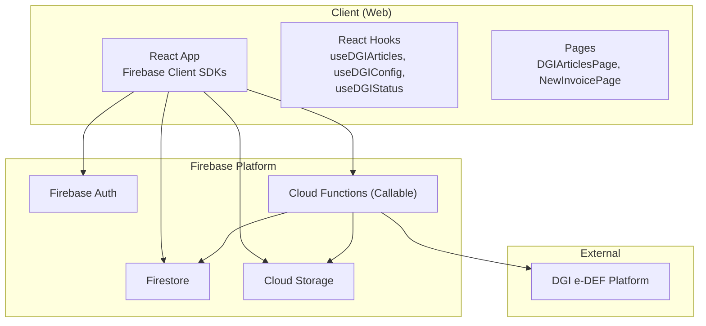
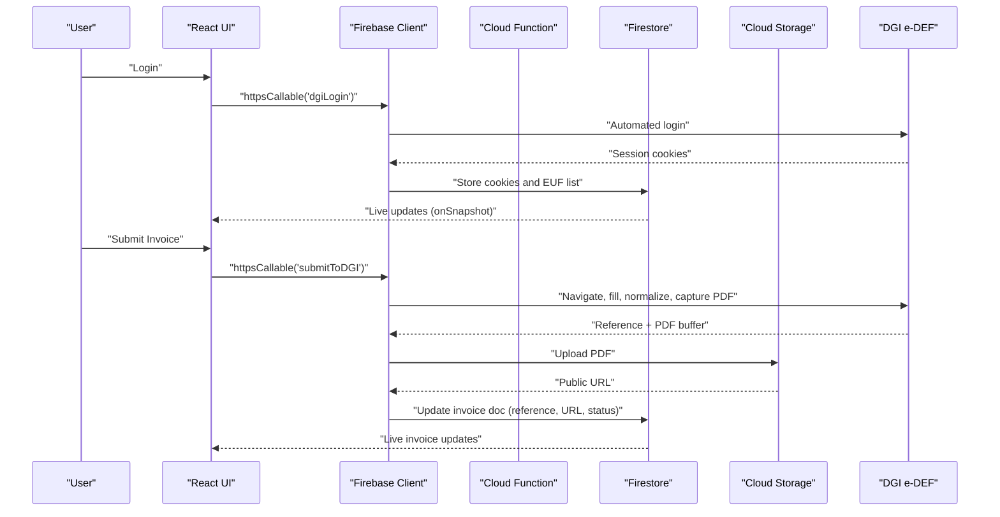
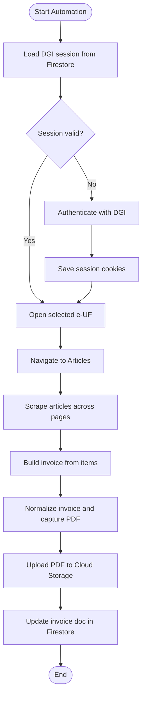
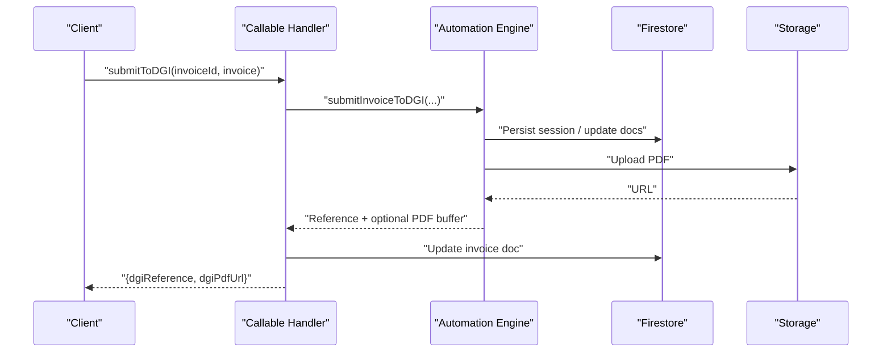
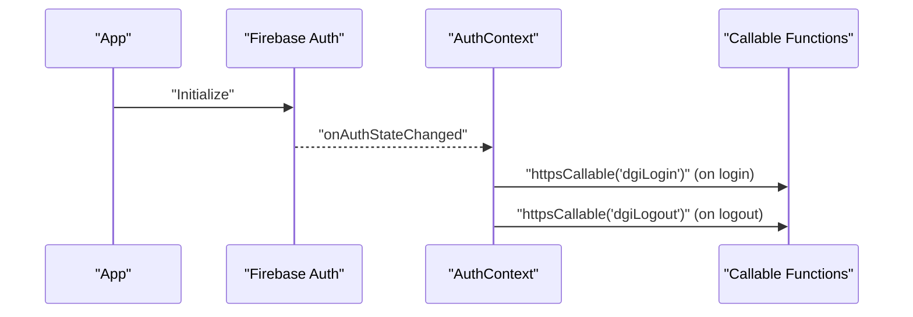
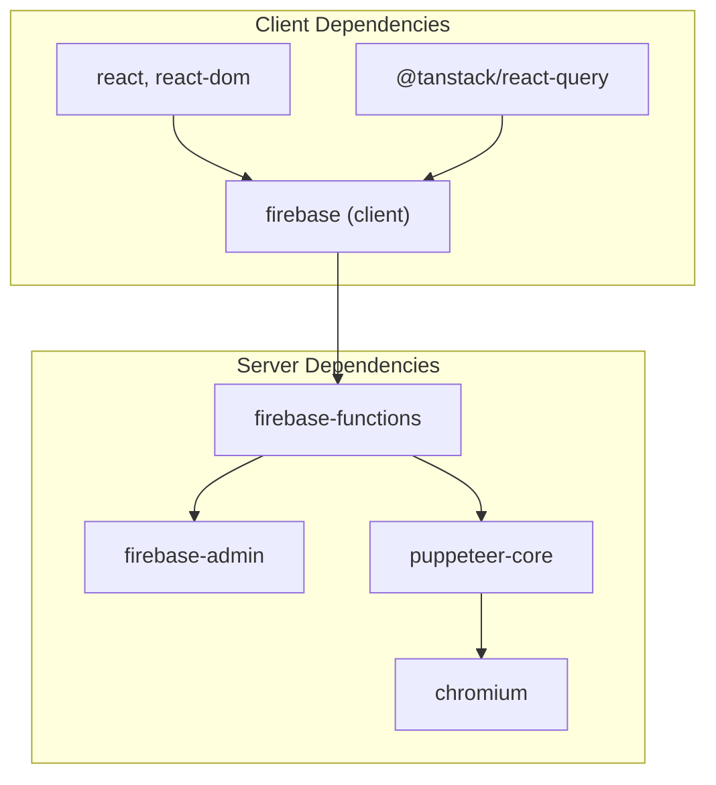

# Integration Patterns

<cite>
**Referenced Files in This Document**
- [functions/src/dgiAutomation.ts](file://functions/src/dgiAutomation.ts)
- [functions/src/index.ts](file://functions/src/index.ts)
- [src/lib/firebase.ts](file://src/lib/firebase.ts)
- [src/contexts/AuthContext.tsx](file://src/contexts/AuthContext.tsx)
- [src/hooks/useDGIArticles.ts](file://src/hooks/useDGIArticles.ts)
- [src/hooks/useDGIConfig.ts](file://src/hooks/useDGIConfig.ts)
- [src/hooks/useDGIStatus.ts](file://src/hooks/useDGIStatus.ts)
- [src/lib/invoiceService.ts](file://src/lib/invoiceService.ts)
- [src/lib/productService.ts](file://src/lib/productService.ts)
- [src/types/invoice.ts](file://src/types/invoice.ts)
- [src/pages/DGIArticlesPage.tsx](file://src/pages/DGIArticlesPage.tsx)
- [src/pages/NewInvoicePage.tsx](file://src/pages/NewInvoicePage.tsx)
- [package.json](file://package.json)
- [functions/package.json](file://functions/package.json)
- [firebase.json](file://firebase.json)
- [firestore.rules](file://firestore.rules)
</cite>

## Table of Contents
1. [Introduction](#introduction)
2. [Project Structure](#project-structure)
3. [Core Components](#core-components)
4. [Architecture Overview](#architecture-overview)
5. [Detailed Component Analysis](#detailed-component-analysis)
6. [Dependency Analysis](#dependency-analysis)
7. [Performance Considerations](#performance-considerations)
8. [Troubleshooting Guide](#troubleshooting-guide)
9. [Conclusion](#conclusion)
10. [Appendices](#appendices)

## Introduction
This document explains the integration patterns used by the ETSMEDF system to coordinate internal and external systems. It focuses on:
- DGI e-DEF platform integration via Puppeteer-driven automation
- HTTP Callable Functions exposing secure serverless APIs
- Firebase services (Auth, Firestore, Storage) and their client-side orchestration
- Authentication coordination between Firebase Auth and DGI sessions
- Data synchronization patterns across client and server
- Error handling across integration boundaries
- Automation workflow patterns, session management, and state coordination
- Security, rate limiting, and reliability considerations

## Project Structure
The project is split into:
- Frontend (React + Firebase client SDKs)
- Cloud Functions (TypeScript, Puppeteer, Chromium runtime)
- Firebase configuration and security rules



**Diagram sources**
- [src/lib/firebase.ts:1-23](file://src/lib/firebase.ts#L1-L23)
- [src/contexts/AuthContext.tsx:1-62](file://src/contexts/AuthContext.tsx#L1-L62)
- [src/hooks/useDGIArticles.ts:1-107](file://src/hooks/useDGIArticles.ts#L1-L107)
- [src/hooks/useDGIConfig.ts:1-84](file://src/hooks/useDGIConfig.ts#L1-L84)
- [src/hooks/useDGIStatus.ts:1-34](file://src/hooks/useDGIStatus.ts#L1-L34)
- [functions/src/index.ts:1-243](file://functions/src/index.ts#L1-L243)
- [functions/src/dgiAutomation.ts:1-1430](file://functions/src/dgiAutomation.ts#L1-L1430)
- [firebase.json:1-11](file://firebase.json#L1-L11)

**Section sources**
- [firebase.json:1-11](file://firebase.json#L1-L11)
- [firestore.rules:1-9](file://firestore.rules#L1-L9)
- [package.json:1-56](file://package.json#L1-L56)
- [functions/package.json:1-34](file://functions/package.json#L1-L34)

## Core Components
- DGI Automation Engine: Launches a controlled browser, authenticates, scrapes and manipulates DGI web UI, and captures PDFs.
- HTTP Callable Functions: Expose secure endpoints for login/logout, article management, and invoice submission.
- Firebase Client SDKs: Initialize and manage Auth, Firestore, and Storage clients in the browser.
- React Hooks and Pages: Orchestrate UI state, synchronize with Firestore snapshots, and call Cloud Functions.

Key integration touchpoints:
- Authentication: Firebase Auth session triggers Cloud Function login/logout to maintain DGI session state.
- Data Synchronization: Firestore stores DGI session cookies, EUF selection, article lists, and invoice metadata.
- External Coordination: Puppeteer automates DGI interactions; PDFs are uploaded to Cloud Storage.

**Section sources**
- [functions/src/dgiAutomation.ts:1-1430](file://functions/src/dgiAutomation.ts#L1-L1430)
- [functions/src/index.ts:1-243](file://functions/src/index.ts#L1-L243)
- [src/lib/firebase.ts:1-23](file://src/lib/firebase.ts#L1-L23)
- [src/contexts/AuthContext.tsx:1-62](file://src/contexts/AuthContext.tsx#L1-L62)
- [src/hooks/useDGIArticles.ts:1-107](file://src/hooks/useDGIArticles.ts#L1-L107)
- [src/hooks/useDGIConfig.ts:1-84](file://src/hooks/useDGIConfig.ts#L1-L84)
- [src/hooks/useDGIStatus.ts:1-34](file://src/hooks/useDGIStatus.ts#L1-L34)

## Architecture Overview
High-level integration flow:
- Client initializes Firebase and subscribes to Firestore documents.
- User actions trigger React hooks that call Cloud Functions via HTTPS Callable.
- Cloud Functions authenticate against DGI using a saved session or fresh login, perform UI automation, and persist results to Firestore and Storage.



**Diagram sources**
- [src/contexts/AuthContext.tsx:20-48](file://src/contexts/AuthContext.tsx#L20-L48)
- [functions/src/index.ts:42-71](file://functions/src/index.ts#L42-L71)
- [functions/src/index.ts:180-242](file://functions/src/index.ts#L180-L242)
- [functions/src/dgiAutomation.ts:347-428](file://functions/src/dgiAutomation.ts#L347-L428)
- [functions/src/dgiAutomation.ts:1404-1430](file://functions/src/dgiAutomation.ts#L1404-L1430)
- [src/hooks/useDGIConfig.ts:19-51](file://src/hooks/useDGIConfig.ts#L19-L51)
- [src/hooks/useDGIStatus.ts:12-33](file://src/hooks/useDGIStatus.ts#L12-L33)

## Detailed Component Analysis

### DGI Automation Engine
Responsibilities:
- Launch browser with Chromium runtime and Puppeteer
- Manage DGI login, session persistence, and logout
- Navigate to e-UF and article management
- Scrape article catalogs across paginated views
- Build invoices, normalize, capture PDF, and return reference
- Robust DOM interaction with fallback strategies

Key patterns:
- Session lifecycle: cookies persisted to Firestore under a dedicated path; reused when valid; re-authenticated otherwise.
- E-UF selection: reads from Firestore config; opens the selected e-UF before automation.
- Robust UI interaction: waits for network idle, renders, and uses multiple strategies to locate clickable elements.
- PDF capture: listens for PDF responses and uploads to Cloud Storage.



**Diagram sources**
- [functions/src/dgiAutomation.ts:45-62](file://functions/src/dgiAutomation.ts#L45-L62)
- [functions/src/dgiAutomation.ts:395-428](file://functions/src/dgiAutomation.ts#L395-L428)
- [functions/src/dgiAutomation.ts:536-594](file://functions/src/dgiAutomation.ts#L536-L594)
- [functions/src/dgiAutomation.ts:1072-1161](file://functions/src/dgiAutomation.ts#L1072-L1161)
- [functions/src/dgiAutomation.ts:1201-1331](file://functions/src/dgiAutomation.ts#L1201-L1331)
- [functions/src/dgiAutomation.ts:1334-1400](file://functions/src/dgiAutomation.ts#L1334-L1400)
- [functions/src/dgiAutomation.ts:1404-1430](file://functions/src/dgiAutomation.ts#L1404-L1430)

**Section sources**
- [functions/src/dgiAutomation.ts:45-62](file://functions/src/dgiAutomation.ts#L45-L62)
- [functions/src/dgiAutomation.ts:395-428](file://functions/src/dgiAutomation.ts#L395-L428)
- [functions/src/dgiAutomation.ts:536-594](file://functions/src/dgiAutomation.ts#L536-L594)
- [functions/src/dgiAutomation.ts:1072-1161](file://functions/src/dgiAutomation.ts#L1072-L1161)
- [functions/src/dgiAutomation.ts:1201-1331](file://functions/src/dgiAutomation.ts#L1201-L1331)
- [functions/src/dgiAutomation.ts:1334-1400](file://functions/src/dgiAutomation.ts#L1334-L1400)
- [functions/src/dgiAutomation.ts:1404-1430](file://functions/src/dgiAutomation.ts#L1404-L1430)

### HTTP Callable Functions
Responsibilities:
- Enforce authentication and forward requests to automation engine
- Centralize credential retrieval via secret management
- Return structured results and propagate errors with appropriate HTTP status codes
- Upload PDFs to Cloud Storage and update Firestore accordingly

Patterns:
- onCall handlers wrap automation functions with consistent error handling and logging
- Secrets for DGI credentials are required and validated before use
- Timeout configurations differ by operation (invoices vs. article management)



**Diagram sources**
- [functions/src/index.ts:180-242](file://functions/src/index.ts#L180-L242)
- [functions/src/dgiAutomation.ts:1404-1430](file://functions/src/dgiAutomation.ts#L1404-L1430)

**Section sources**
- [functions/src/index.ts:1-243](file://functions/src/index.ts#L1-L243)
- [functions/src/dgiAutomation.ts:1404-1430](file://functions/src/dgiAutomation.ts#L1404-L1430)

### Firebase Client SDKs and Authentication Coordination
Responsibilities:
- Initialize Firebase app and services
- Provide Auth context to the app
- Trigger DGI login/logout upon Firebase Auth state changes

Patterns:
- Auth provider subscribes to onAuthStateChanged and invokes Cloud Functions for DGI session management
- Non-blocking calls ensure UI responsiveness during DGI operations



**Diagram sources**
- [src/lib/firebase.ts:1-23](file://src/lib/firebase.ts#L1-L23)
- [src/contexts/AuthContext.tsx:26-55](file://src/contexts/AuthContext.tsx#L26-L55)

**Section sources**
- [src/lib/firebase.ts:1-23](file://src/lib/firebase.ts#L1-L23)
- [src/contexts/AuthContext.tsx:1-62](file://src/contexts/AuthContext.tsx#L1-L62)

### Data Synchronization Patterns
Responsibilities:
- Live synchronization of DGI-related state via Firestore snapshots
- Local caching of article lists per e-UF
- Invoice lifecycle updates and metadata persistence

Patterns:
- useDGIConfig: subscribe to dgi_config/settings for EUF selection and available e-UFs
- useStoredDGIArticles: subscribe to dgi_articles/{selectedEUFId} for cached article lists
- useDGIStatus: subscribe to dgi_sessions/session for DGI connection status
- useDGIArticles: call dgiListArticles to refresh cached lists
- useInvoices: create/update invoices in Firestore; Cloud Function updates status and adds DGI metadata

```mermaid
graph LR
FE["React Hooks"] --> CFG["dgi_config/settings"]
FE --> ART["dgi_articles/{eufId}"]
FE --> SES["dgi_sessions/session"]
FE --> INV["invoices/{id}"]
CFG <- --> |"onSnapshot"| FE
ART <- --> |"onSnapshot"| FE
SES <- --> |"onSnapshot"| FE
INV <- --> |"onSnapshot"| FE
```

**Diagram sources**
- [src/hooks/useDGIConfig.ts:19-51](file://src/hooks/useDGIConfig.ts#L19-L51)
- [src/hooks/useDGIArticles.ts:16-40](file://src/hooks/useDGIArticles.ts#L16-L40)
- [src/hooks/useDGIStatus.ts:12-33](file://src/hooks/useDGIStatus.ts#L12-L33)
- [src/lib/invoiceService.ts:17-57](file://src/lib/invoiceService.ts#L17-L57)

**Section sources**
- [src/hooks/useDGIConfig.ts:1-84](file://src/hooks/useDGIConfig.ts#L1-L84)
- [src/hooks/useDGIArticles.ts:1-107](file://src/hooks/useDGIArticles.ts#L1-L107)
- [src/hooks/useDGIStatus.ts:1-34](file://src/hooks/useDGIStatus.ts#L1-L34)
- [src/lib/invoiceService.ts:1-58](file://src/lib/invoiceService.ts#L1-L58)

### External API Coordination and Reliability
- Puppeteer/Chromium runtime runs headlessly with Chromium args optimized for stability.
- Network idle waits and explicit sleeps mitigate timing issues on SPA navigation.
- Multiple DOM strategies increase robustness against UI changes.
- PDF capture uses response interception with timeouts to avoid hanging.

Reliability patterns:
- Retry on empty initial scrape; wait and retry after SPA bootstraps.
- Graceful degradation: fallback selectors and text-based parsing.
- Non-blocking PDF upload; Firestore update proceeds even if upload fails.

**Section sources**
- [functions/src/dgiAutomation.ts:79-94](file://functions/src/dgiAutomation.ts#L79-L94)
- [functions/src/dgiAutomation.ts:556-563](file://functions/src/dgiAutomation.ts#L556-L563)
- [functions/src/dgiAutomation.ts:1376-1400](file://functions/src/dgiAutomation.ts#L1376-L1400)

### Security Considerations
- Firestore rules require authentication for all reads/writes.
- Cloud Functions enforce auth checks and validate inputs.
- Credentials are managed via Firebase secrets and accessed only within function scope.
- Sessions are stored in Firestore; ensure access control aligns with user scope.

Recommendations:
- Scope Firestore collections per user or tenant.
- Rotate secrets periodically and monitor function logs.
- Consider adding rate limiting at the function level for sensitive operations.

**Section sources**
- [firestore.rules:1-9](file://firestore.rules#L1-L9)
- [functions/src/index.ts:31-38](file://functions/src/index.ts#L31-L38)
- [functions/src/index.ts:42-71](file://functions/src/index.ts#L42-L71)

## Dependency Analysis
Runtime and build-time dependencies:
- Client depends on Firebase client SDKs, React Query, and UI libraries.
- Functions depend on Puppeteer, Chromium, and Firebase Admin/Functions SDKs.
- Build pipeline compiles TypeScript and deploys functions with Node.js 20 runtime.



**Diagram sources**
- [package.json:12-32](file://package.json#L12-L32)
- [functions/package.json:17-22](file://functions/package.json#L17-L22)

**Section sources**
- [package.json:1-56](file://package.json#L1-L56)
- [functions/package.json:1-34](file://functions/package.json#L1-L34)
- [firebase.json:1-11](file://firebase.json#L1-L11)

## Performance Considerations
- Headless browser startup and navigation introduce latency; batch operations where possible.
- Use React Query caching and stale times to minimize redundant function calls.
- Firestore onSnapshot listeners provide efficient real-time updates; avoid unnecessary writes.
- PDF upload is non-blocking; consider pre-generating thumbnails if needed.
- Timeouts and retries are built into automation; adjust for network conditions.

[No sources needed since this section provides general guidance]

## Troubleshooting Guide
Common issues and resolutions:
- DGI login failures: verify credentials and platform availability; check function logs for detailed messages.
- Missing articles: ensure the selected e-UF matches the article list; refresh via dgiListArticles.
- PDF capture failures: confirm platform allows PDF download and response interception; check upload errors.
- Authentication drift: clear DGI session in Firestore; re-run dgiLogin; verify AuthContext triggers.

Operational tips:
- Monitor function logs for Puppeteer warnings and DOM interaction failures.
- Validate Firestore rules permit authenticated access.
- Use React Query Devtools to inspect query keys and cache states.

**Section sources**
- [functions/src/index.ts:42-71](file://functions/src/index.ts#L42-L71)
- [functions/src/index.ts:180-242](file://functions/src/index.ts#L180-L242)
- [src/hooks/useDGIArticles.ts:50-63](file://src/hooks/useDGIArticles.ts#L50-L63)
- [src/contexts/AuthContext.tsx:20-24](file://src/contexts/AuthContext.tsx#L20-L24)

## Conclusion
ETSMEDF integrates Firebase, Cloud Functions, and Puppeteer automation to synchronize local invoice workflows with the DGI e-DEF platform. The system maintains session state, orchestrates UI automation, and persists results to Firestore and Cloud Storage. Robust error handling, multiple DOM strategies, and non-blocking operations ensure reliability. Security is enforced through authenticated Firestore access and secret-managed credentials.

[No sources needed since this section summarizes without analyzing specific files]

## Appendices

### API Surface Summary
- dgiLogin: Establish DGI session
- dgiLogout: Clear DGI session
- dgiListEUFs: Fetch and merge e-UF list
- dgiListArticles, dgiAddArticle, dgiDeleteArticle, dgiUpdateArticle: Article management
- submitToDGI: Create invoice, normalize, capture PDF, upload, and update invoice doc

**Section sources**
- [functions/src/index.ts:42-242](file://functions/src/index.ts#L42-L242)

### Data Models Overview
- Invoice: includes DGI reference, PDF URL, and timestamps
- DGIEUFEntry: e-UF identifier and name
- DGIArticle: article name, price, and tax group

**Section sources**
- [src/types/invoice.ts:1-39](file://src/types/invoice.ts#L1-L39)
- [functions/src/dgiAutomation.ts:32-42](file://functions/src/dgiAutomation.ts#L32-L42)
- [src/hooks/useDGIConfig.ts:7-17](file://src/hooks/useDGIConfig.ts#L7-L17)