# Article Catalog System

<cite>
**Referenced Files in This Document**
- [useDGIArticles.ts](file://src/hooks/useDGIArticles.ts)
- [useProducts.ts](file://src/hooks/useProducts.ts)
- [dgiAutomation.ts](file://functions/src/dgiAutomation.ts)
- [productService.ts](file://src/lib/productService.ts)
- [DGIArticlesPage.tsx](file://src/pages/DGIArticlesPage.tsx)
- [firebase.ts](file://src/lib/firebase.ts)
- [invoiceService.ts](file://src/lib/invoiceService.ts)
- [import-products.mjs](file://scripts/import-products.mjs)
- [inspect-xlsx.mjs](file://scripts/inspect-xlsx.mjs)
</cite>

## Table of Contents
1. [Introduction](#introduction)
2. [Project Structure](#project-structure)
3. [Core Components](#core-components)
4. [Architecture Overview](#architecture-overview)
5. [Detailed Component Analysis](#detailed-component-analysis)
6. [Dependency Analysis](#dependency-analysis)
7. [Performance Considerations](#performance-considerations)
8. [Troubleshooting Guide](#troubleshooting-guide)
9. [Conclusion](#conclusion)

## Introduction
This document describes ETSMEDF's Article Catalog System for product/item management, focusing on synchronization with the DGI platform, automatic product import, price updates, category organization, and integration with Firestore. It explains the useDGIArticles and useProducts React hooks, caching strategies, real-time updates, external product source integration, validation rules, conflict resolution, and the relationship between catalogs and invoice generation.

## Project Structure
The Article Catalog System spans frontend hooks and pages, backend Cloud Functions, and supporting libraries for product management and Firebase integration.

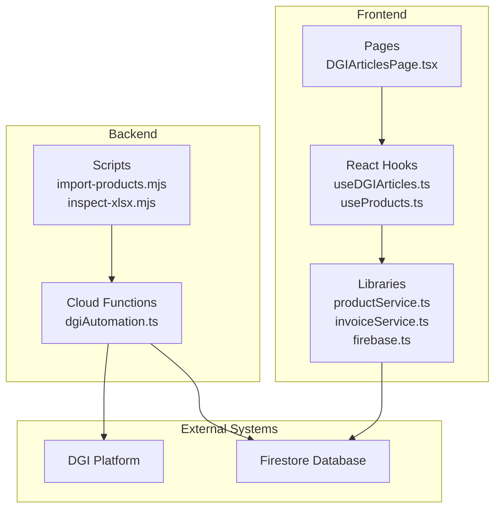

**Diagram sources**
- [useDGIArticles.ts](file://src/hooks/useDGIArticles.ts)
- [useProducts.ts](file://src/hooks/useProducts.ts)
- [DGIArticlesPage.tsx](file://src/pages/DGIArticlesPage.tsx)
- [productService.ts](file://src/lib/productService.ts)
- [invoiceService.ts](file://src/lib/invoiceService.ts)
- [firebase.ts](file://src/lib/firebase.ts)
- [dgiAutomation.ts](file://functions/src/dgiAutomation.ts)
- [import-products.mjs](file://scripts/import-products.mjs)
- [inspect-xlsx.mjs](file://scripts/inspect-xlsx.mjs)

**Section sources**
- [useDGIArticles.ts](file://src/hooks/useDGIArticles.ts)
- [useProducts.ts](file://src/hooks/useProducts.ts)
- [dgiAutomation.ts](file://functions/src/dgiAutomation.ts)
- [productService.ts](file://src/lib/productService.ts)
- [DGIArticlesPage.tsx](file://src/pages/DGIArticlesPage.tsx)
- [firebase.ts](file://src/lib/firebase.ts)
- [invoiceService.ts](file://src/lib/invoiceService.ts)
- [import-products.mjs](file://scripts/import-products.mjs)
- [inspect-xlsx.mjs](file://scripts/inspect-xlsx.mjs)

## Core Components
- useDGIArticles hook: Manages DGI articles lifecycle, including fetching, importing, and synchronizing with Firestore. Provides loading states, error handling, and real-time listeners.
- useProducts hook: Centralizes product catalog management with caching, search/filtering, and real-time updates from Firestore.
- dgiAutomation Cloud Function: Orchestrates DGI platform integration, product import workflows, and synchronization tasks.
- productService: Utility library for product-related operations and transformations.
- DGIArticlesPage: UI surface for viewing and managing DGI articles and import actions.
- Firebase integration: Real-time Firestore listeners and caching via React hooks.

Key responsibilities:
- Automatic product import from external sources
- Price updates and category organization
- Conflict resolution during synchronization
- Validation rules for product data integrity
- Real-time updates and caching strategies

**Section sources**
- [useDGIArticles.ts](file://src/hooks/useDGIArticles.ts)
- [useProducts.ts](file://src/hooks/useProducts.ts)
- [dgiAutomation.ts](file://functions/src/dgiAutomation.ts)
- [productService.ts](file://src/lib/productService.ts)
- [DGIArticlesPage.tsx](file://src/pages/DGIArticlesPage.tsx)
- [firebase.ts](file://src/lib/firebase.ts)

## Architecture Overview
The system integrates external product sources with Firestore and the DGI platform. Frontend hooks subscribe to Firestore for real-time updates, while Cloud Functions handle automation and synchronization tasks.

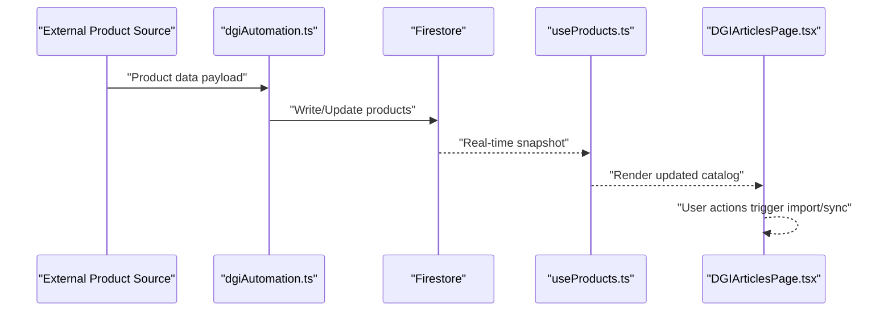

**Diagram sources**
- [dgiAutomation.ts](file://functions/src/dgiAutomation.ts)
- [useProducts.ts](file://src/hooks/useProducts.ts)
- [DGIArticlesPage.tsx](file://src/pages/DGIArticlesPage.tsx)
- [firebase.ts](file://src/lib/firebase.ts)

## Detailed Component Analysis

### useDGIArticles Hook
Manages DGI articles with:
- Fetching articles from Firestore
- Importing new articles from external sources
- Synchronizing with DGI platform
- Error handling and loading states
- Real-time listener integration

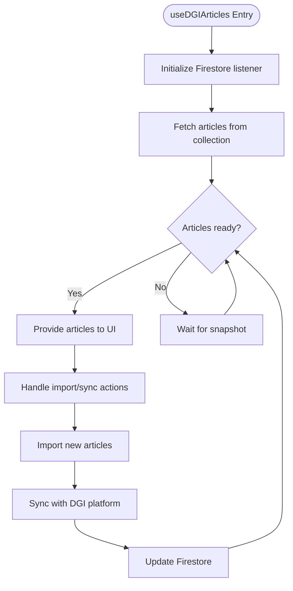

**Diagram sources**
- [useDGIArticles.ts](file://src/hooks/useDGIArticles.ts)
- [firebase.ts](file://src/lib/firebase.ts)

**Section sources**
- [useDGIArticles.ts](file://src/hooks/useDGIArticles.ts)
- [firebase.ts](file://src/lib/firebase.ts)

### useProducts Hook
Centralizes product catalog management:
- Caching strategy for performance
- Search and filtering capabilities
- Real-time updates via Firestore listeners
- Conflict resolution for concurrent updates
- Validation rules applied before writes

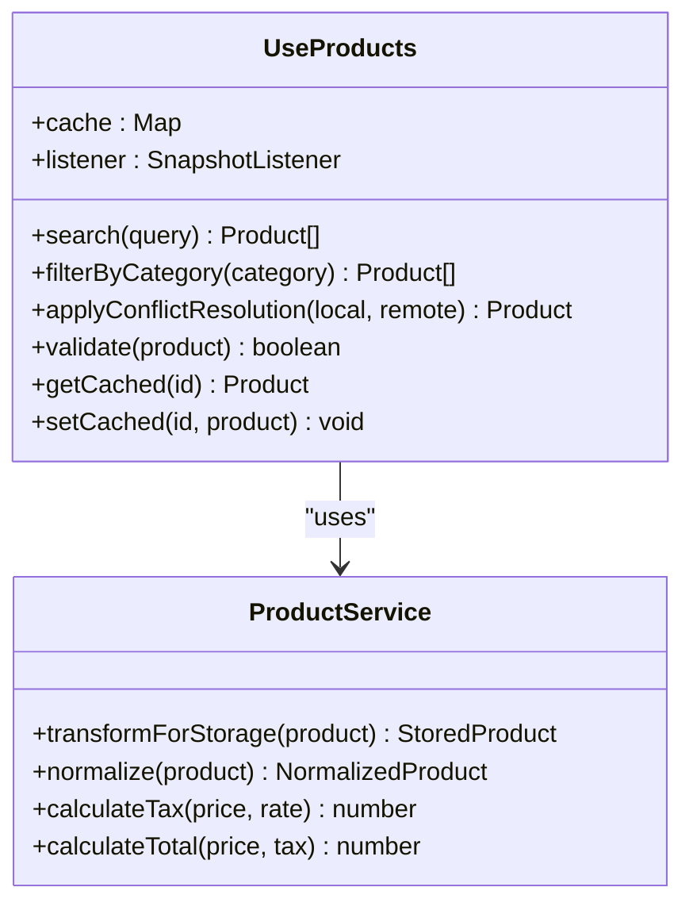

**Diagram sources**
- [useProducts.ts](file://src/hooks/useProducts.ts)
- [productService.ts](file://src/lib/productService.ts)

**Section sources**
- [useProducts.ts](file://src/hooks/useProducts.ts)
- [productService.ts](file://src/lib/productService.ts)

### dgiAutomation Cloud Function
Handles DGI platform integration:
- Receives product data from external sources
- Validates and transforms product records
- Writes to Firestore collections
- Triggers price updates and category organization
- Resolves conflicts during synchronization

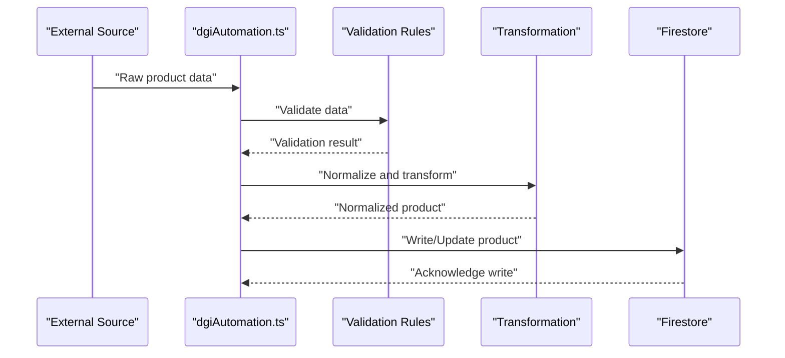

**Diagram sources**
- [dgiAutomation.ts](file://functions/src/dgiAutomation.ts)
- [productService.ts](file://src/lib/productService.ts)
- [firebase.ts](file://src/lib/firebase.ts)

**Section sources**
- [dgiAutomation.ts](file://functions/src/dgiAutomation.ts)
- [productService.ts](file://src/lib/productService.ts)
- [firebase.ts](file://src/lib/firebase.ts)

### DGIArticlesPage
Provides UI for managing DGI articles:
- Displays article lists with import controls
- Triggers import workflows
- Shows sync status and errors
- Integrates with useDGIArticles hook

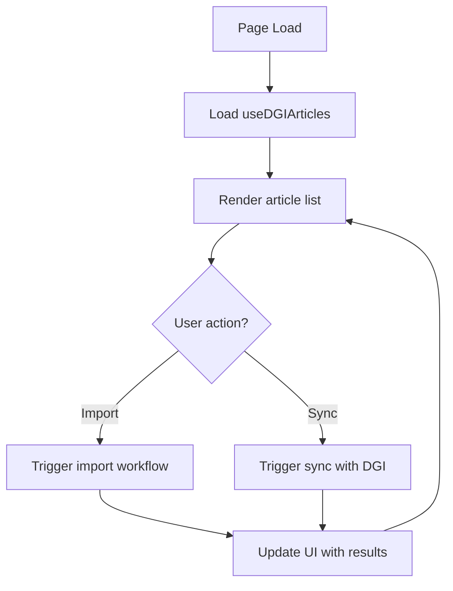

**Diagram sources**
- [DGIArticlesPage.tsx](file://src/pages/DGIArticlesPage.tsx)
- [useDGIArticles.ts](file://src/hooks/useDGIArticles.ts)

**Section sources**
- [DGIArticlesPage.tsx](file://src/pages/DGIArticlesPage.tsx)
- [useDGIArticles.ts](file://src/hooks/useDGIArticles.ts)

### Product Import Workflows
External product sources are ingested via scripts and processed by Cloud Functions:
- import-products.mjs: Loads and validates product data from spreadsheets
- inspect-xlsx.mjs: Inspects spreadsheet structure and content
- dgiAutomation.ts: Processes validated data and writes to Firestore

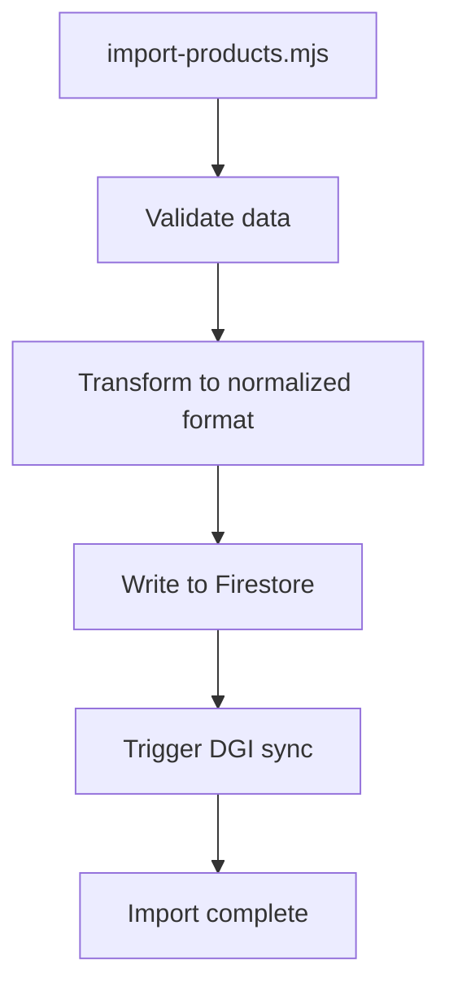

**Diagram sources**
- [import-products.mjs](file://scripts/import-products.mjs)
- [inspect-xlsx.mjs](file://scripts/inspect-xlsx.mjs)
- [dgiAutomation.ts](file://functions/src/dgiAutomation.ts)
- [firebase.ts](file://src/lib/firebase.ts)

**Section sources**
- [import-products.mjs](file://scripts/import-products.mjs)
- [inspect-xlsx.mjs](file://scripts/inspect-xlsx.mjs)
- [dgiAutomation.ts](file://functions/src/dgiAutomation.ts)
- [firebase.ts](file://src/lib/firebase.ts)

### Product Search Functionality
Search and filtering are handled by useProducts:
- Text-based search across product attributes
- Category-based filtering
- Real-time updates via Firestore listeners
- Caching to improve performance

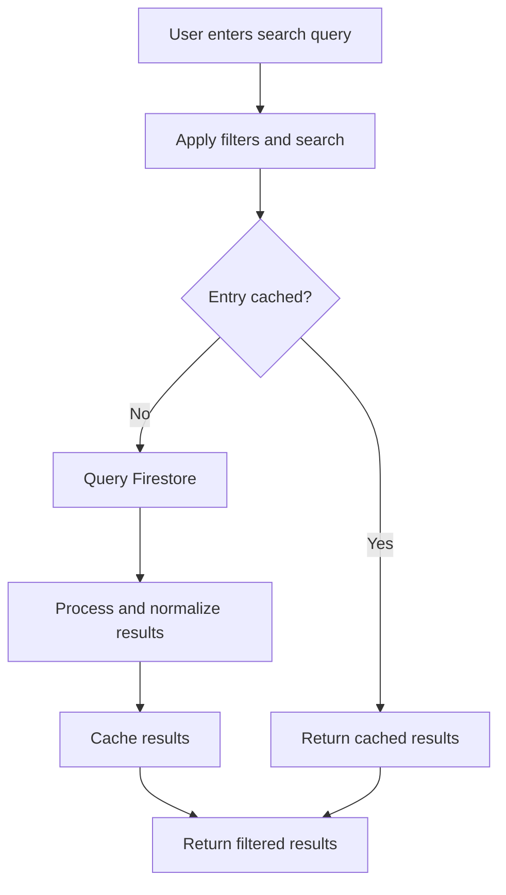

**Diagram sources**
- [useProducts.ts](file://src/hooks/useProducts.ts)
- [firebase.ts](file://src/lib/firebase.ts)

**Section sources**
- [useProducts.ts](file://src/hooks/useProducts.ts)
- [firebase.ts](file://src/lib/firebase.ts)

### Catalog Synchronization and Conflict Resolution
Synchronization maintains consistency between external sources, Firestore, and the DGI platform:
- Real-time listeners detect changes
- Validation ensures data integrity
- Conflict resolution compares local vs remote versions
- Timestamp-based resolution or manual override when needed

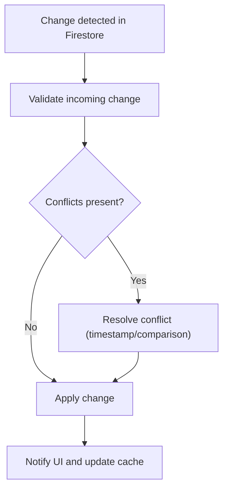

**Diagram sources**
- [useProducts.ts](file://src/hooks/useProducts.ts)
- [firebase.ts](file://src/lib/firebase.ts)

**Section sources**
- [useProducts.ts](file://src/hooks/useProducts.ts)
- [firebase.ts](file://src/lib/firebase.ts)

### Relationship Between Catalogs and Invoices
Product catalogs feed invoice generation:
- Pricing calculations with tax applicability
- Real-time price updates from synchronized catalogs
- Consistent product data across sales and invoicing

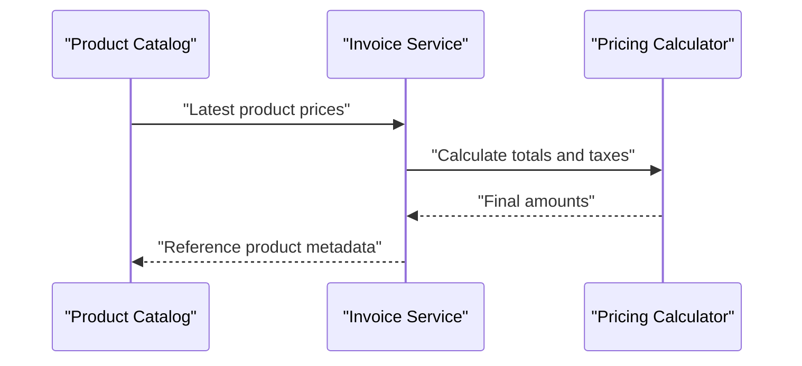

**Diagram sources**
- [productService.ts](file://src/lib/productService.ts)
- [invoiceService.ts](file://src/lib/invoiceService.ts)

**Section sources**
- [productService.ts](file://src/lib/productService.ts)
- [invoiceService.ts](file://src/lib/invoiceService.ts)

## Dependency Analysis
The system exhibits clear separation of concerns:
- Frontend hooks depend on Firebase for real-time updates
- Cloud Functions depend on Firestore for persistence
- Product service utilities support both frontend and backend
- Scripts provide ingestion pipeline for external sources

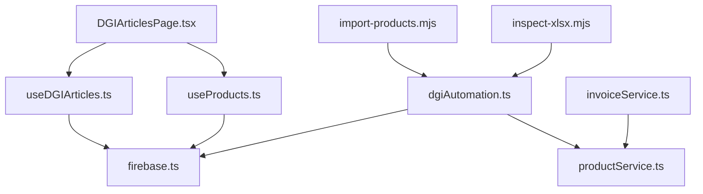

**Diagram sources**
- [useDGIArticles.ts](file://src/hooks/useDGIArticles.ts)
- [useProducts.ts](file://src/hooks/useProducts.ts)
- [DGIArticlesPage.tsx](file://src/pages/DGIArticlesPage.tsx)
- [dgiAutomation.ts](file://functions/src/dgiAutomation.ts)
- [productService.ts](file://src/lib/productService.ts)
- [firebase.ts](file://src/lib/firebase.ts)
- [import-products.mjs](file://scripts/import-products.mjs)
- [inspect-xlsx.mjs](file://scripts/inspect-xlsx.mjs)
- [invoiceService.ts](file://src/lib/invoiceService.ts)

**Section sources**
- [useDGIArticles.ts](file://src/hooks/useDGIArticles.ts)
- [useProducts.ts](file://src/hooks/useProducts.ts)
- [DGIArticlesPage.tsx](file://src/pages/DGIArticlesPage.tsx)
- [dgiAutomation.ts](file://functions/src/dgiAutomation.ts)
- [productService.ts](file://src/lib/productService.ts)
- [firebase.ts](file://src/lib/firebase.ts)
- [import-products.mjs](file://scripts/import-products.mjs)
- [inspect-xlsx.mjs](file://scripts/inspect-xlsx.mjs)
- [invoiceService.ts](file://src/lib/invoiceService.ts)

## Performance Considerations
- Use caching in useProducts to minimize Firestore reads
- Batch writes in dgiAutomation for large imports
- Debounce search queries in useProducts to reduce load
- Optimize Firestore indexes for common queries (category, name, price)
- Leverage real-time listeners to avoid polling

## Troubleshooting Guide
Common issues and resolutions:
- Synchronization delays: Verify Firestore listeners are attached and network connectivity is stable
- Import failures: Check script logs for validation errors and retry failed batches
- Price discrepancies: Confirm conflict resolution logic and timestamp ordering
- UI not updating: Ensure real-time listeners are initialized and subscriptions are active
- Data inconsistencies: Review validation rules and normalization steps in dgiAutomation

**Section sources**
- [useProducts.ts](file://src/hooks/useProducts.ts)
- [useDGIArticles.ts](file://src/hooks/useDGIArticles.ts)
- [dgiAutomation.ts](file://functions/src/dgiAutomation.ts)
- [firebase.ts](file://src/lib/firebase.ts)

## Conclusion
ETSMEDF's Article Catalog System provides a robust foundation for managing product catalogs, integrating with the DGI platform, and maintaining data consistency across external sources and Firestore. The useDGIArticles and useProducts hooks, combined with Cloud Functions and real-time updates, enable efficient product import, synchronization, and invoice generation workflows.