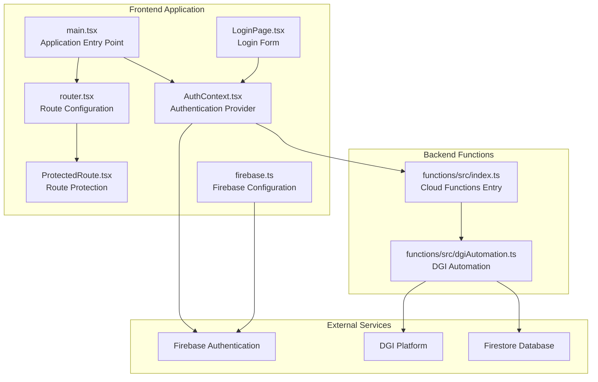
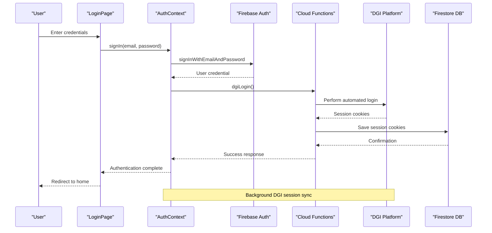
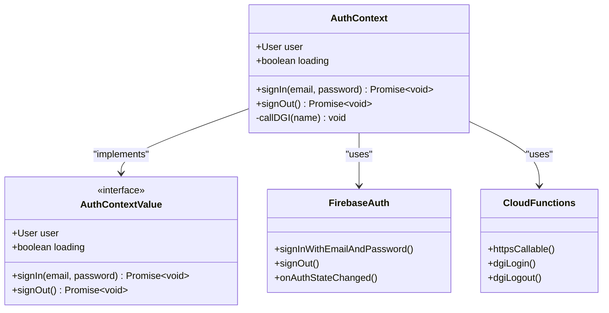
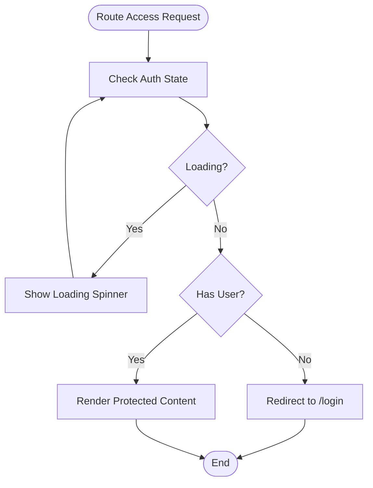
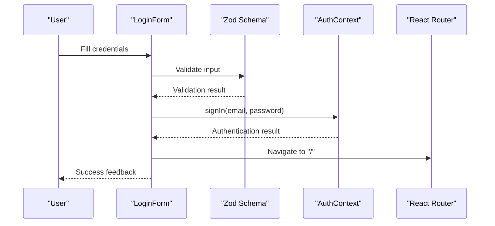
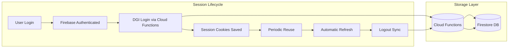
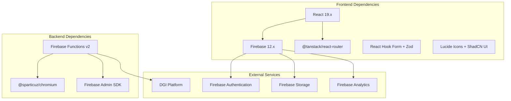

# Authentication System

<cite>
**Referenced Files in This Document**
- [AuthContext.tsx](file://src/contexts/AuthContext.tsx)
- [firebase.ts](file://src/lib/firebase.ts)
- [ProtectedRoute.tsx](file://src/components/ProtectedRoute.tsx)
- [LoginPage.tsx](file://src/pages/LoginPage.tsx)
- [router.tsx](file://src/router.tsx)
- [main.tsx](file://src/main.tsx)
- [dgiAutomation.ts](file://functions/src/dgiAutomation.ts)
- [index.ts](file://functions/src/index.ts)
- [package.json](file://package.json)
- [firebase.json](file://firebase.json)
</cite>

## Table of Contents
1. [Introduction](#introduction)
2. [Project Structure](#project-structure)
3. [Core Components](#core-components)
4. [Architecture Overview](#architecture-overview)
5. [Detailed Component Analysis](#detailed-component-analysis)
6. [Dependency Analysis](#dependency-analysis)
7. [Performance Considerations](#performance-considerations)
8. [Troubleshooting Guide](#troubleshooting-guide)
9. [Conclusion](#conclusion)

## Introduction
This document provides comprehensive authentication system documentation for ETSMEDF, focusing on Firebase Authentication integration, user session management, and DGI platform session coordination. The system implements centralized authentication state management through a React Context, route protection via a ProtectedRoute component, and seamless integration with Firebase Cloud Functions for DGI automation. The authentication flow covers email/password login, automatic DGI session synchronization, secure session persistence, and robust error handling.

## Project Structure
The authentication system spans both the frontend React application and backend Firebase Cloud Functions:

**Diagram sources**
- [main.tsx:12-21](file://src/main.tsx#L12-L21)
- [router.tsx:1-92](file://src/router.tsx#L1-L92)
- [AuthContext.tsx:26-55](file://src/contexts/AuthContext.tsx#L26-L55)
- [firebase.ts:1-23](file://src/lib/firebase.ts#L1-L23)
- [index.ts:1-243](file://functions/src/index.ts#L1-L243)

**Section sources**
- [main.tsx:1-22](file://src/main.tsx#L1-L22)
- [router.tsx:1-92](file://src/router.tsx#L1-L92)
- [firebase.json:1-11](file://firebase.json#L1-L11)

## Core Components
The authentication system consists of four primary components working together to provide secure, seamless user experience:

### Authentication Context (`AuthContext`)
The central state management component that handles Firebase Authentication integration and DGI session coordination. It provides:
- User authentication state tracking
- Email/password login functionality
- Automatic DGI session synchronization
- Centralized error handling
- Loading state management

### Protected Route Component (`ProtectedRoute`)
A route wrapper that enforces authentication requirements across protected routes. It:
- Blocks unauthenticated access to protected pages
- Handles loading states during authentication initialization
- Provides graceful redirect to login page
- Maintains consistent user experience

### Login Page (`LoginPage`)
The user interface for authentication entry, featuring:
- Form validation with Zod schema
- Secure password handling
- Real-time error feedback
- Responsive design with accessibility features

### Firebase Configuration (`firebase.ts`)
Centralized Firebase initialization and configuration management, including:
- Environment variable integration
- Multi-service initialization (Auth, Firestore, Analytics)
- Type-safe exports for application-wide use

**Section sources**
- [AuthContext.tsx:11-62](file://src/contexts/AuthContext.tsx#L11-L62)
- [ProtectedRoute.tsx:1-24](file://src/components/ProtectedRoute.tsx#L1-L24)
- [LoginPage.tsx:13-140](file://src/pages/LoginPage.tsx#L13-L140)
- [firebase.ts:6-23](file://src/lib/firebase.ts#L6-L23)

## Architecture Overview
The authentication system follows a modern React architecture with Firebase Authentication as the primary identity provider and Firebase Cloud Functions for DGI platform integration:

**Diagram sources**
- [LoginPage.tsx:32-40](file://src/pages/LoginPage.tsx#L32-L40)
- [AuthContext.tsx:38-42](file://src/contexts/AuthContext.tsx#L38-L42)
- [index.ts:42-56](file://functions/src/index.ts#L42-L56)
- [dgiAutomation.ts:306-320](file://functions/src/dgiAutomation.ts#L306-L320)

The system maintains dual authentication state:
1. **Firebase Authentication**: Manages user credentials and session persistence
2. **DGI Platform Sessions**: Maintains separate session cookies for automated tax filing operations

**Section sources**
- [AuthContext.tsx:20-24](file://src/contexts/AuthContext.tsx#L20-L24)
- [index.ts:31-38](file://functions/src/index.ts#L31-L38)
- [dgiAutomation.ts:45-62](file://functions/src/dgiAutomation.ts#L45-L62)

## Detailed Component Analysis

### Authentication Context Implementation
The AuthContext provides a comprehensive authentication solution with built-in DGI integration:

**Diagram sources**
- [AuthContext.tsx:11-16](file://src/contexts/AuthContext.tsx#L11-L16)
- [AuthContext.tsx:26-55](file://src/contexts/AuthContext.tsx#L26-L55)
- [firebase.ts:2-8](file://src/lib/firebase.ts#L2-L8)

Key implementation patterns include:
- **Fire-and-forget DGI operations**: Background session synchronization prevents blocking user experience
- **Centralized error handling**: Consistent error messages across authentication flows
- **Loading state management**: Graceful handling of authentication initialization
- **Type safety**: Full TypeScript integration with Firebase types

**Section sources**
- [AuthContext.tsx:26-55](file://src/contexts/AuthContext.tsx#L26-L55)
- [AuthContext.tsx:20-24](file://src/contexts/AuthContext.tsx#L20-L24)

### Protected Route Component
The ProtectedRoute component ensures secure access to application features:

**Diagram sources**
- [ProtectedRoute.tsx:6-23](file://src/components/ProtectedRoute.tsx#L6-L23)

The component provides:
- **Graceful loading states**: Prevents flash-of-uncertain-content
- **Automatic redirection**: Seamless user experience for unauthenticated access
- **Content protection**: Ensures sensitive data remains private

**Section sources**
- [ProtectedRoute.tsx:6-23](file://src/components/ProtectedRoute.tsx#L6-L23)

### Login Page Implementation
The LoginPage combines form validation, error handling, and authentication flow:

**Diagram sources**
- [LoginPage.tsx:26-40](file://src/pages/LoginPage.tsx#L26-L40)
- [LoginPage.tsx:13-16](file://src/pages/LoginPage.tsx#L13-L16)

Security features include:
- **Input validation**: Client-side validation with Zod schema
- **Error handling**: Comprehensive error mapping for user-friendly feedback
- **Password visibility**: Toggle functionality for improved UX
- **Form submission prevention**: Disabled states during processing

**Section sources**
- [LoginPage.tsx:20-40](file://src/pages/LoginPage.tsx#L20-L40)
- [LoginPage.tsx:121-140](file://src/pages/LoginPage.tsx#L121-L140)

### DGI Session Coordination
The system maintains synchronized sessions between Firebase Authentication and the DGI platform:

**Diagram sources**
- [AuthContext.tsx:40-47](file://src/contexts/AuthContext.tsx#L40-L47)
- [dgiAutomation.ts:45-62](file://functions/src/dgiAutomation.ts#L45-L62)
- [index.ts:42-71](file://functions/src/index.ts#L42-L71)

The DGI integration features:
- **Session persistence**: Cookies stored in Firestore for reuse
- **Background synchronization**: Non-blocking session maintenance
- **Error resilience**: Graceful degradation when DGI operations fail
- **Timeout handling**: Automatic session refresh mechanisms

**Section sources**
- [dgiAutomation.ts:45-62](file://functions/src/dgiAutomation.ts#L45-L62)
- [dgiAutomation.ts:306-347](file://functions/src/dgiAutomation.ts#L306-L347)

## Dependency Analysis
The authentication system relies on several key dependencies and external services:

**Diagram sources**
- [package.json:12-31](file://package.json#L12-L31)
- [firebase.json:1-11](file://firebase.json#L1-11)

**Section sources**
- [package.json:12-31](file://package.json#L12-L31)
- [firebase.json:1-11](file://firebase.json#L1-L11)

## Performance Considerations
The authentication system implements several performance optimizations:

### Session Management Optimizations
- **Lazy loading**: Authentication state initialized only once
- **Background operations**: DGI session synchronization doesn't block UI
- **Caching strategy**: Firestore session storage reduces repeated DGI logins
- **Timeout handling**: Configurable timeouts prevent hanging operations

### Error Handling and Resilience
- **Non-blocking operations**: DGI login failures don't prevent Firebase authentication
- **Graceful degradation**: System continues functioning with partial functionality
- **Retry mechanisms**: Automatic session refresh attempts
- **Timeout protection**: Prevents infinite waits for external services

### Security Considerations
- **Environment variables**: Firebase configuration loaded from secure environment
- **HTTPS enforcement**: All communication occurs over encrypted connections
- **Token management**: Automatic Firebase token refresh handled by SDK
- **Session isolation**: Separate DGI sessions prevent cross-contamination

## Troubleshooting Guide

### Common Authentication Issues

#### Login Failures
**Symptoms**: Users unable to log in despite correct credentials
**Causes**: 
- Network connectivity issues
- Firebase service unavailability
- Incorrect email format
- Password validation failures

**Solutions**:
- Verify network connection and firewall settings
- Check Firebase service status dashboard
- Validate email format using Zod schema
- Review password requirements (minimum 6 characters)

#### DGI Session Problems
**Symptoms**: DGI operations failing despite successful Firebase login
**Causes**:
- Expired DGI session cookies
- DGI platform maintenance
- Incorrect DGI credentials
- Network restrictions

**Solutions**:
- Clear browser cache and cookies
- Verify DGI credentials in Firebase Functions secrets
- Check DGI platform availability
- Review network proxy configurations

#### Protected Route Issues
**Symptoms**: Users redirected to login page unexpectedly
**Causes**:
- Authentication state not yet initialized
- Session expiration
- Navigation bypass attempts
- Client-side state corruption

**Solutions**:
- Implement proper loading states in UI
- Check authentication state before navigation
- Verify session persistence mechanisms
- Debug client-side state management

### Debugging Techniques

#### Frontend Debugging
1. **Console Logging**: Enable detailed logging in AuthContext
2. **Network Inspection**: Monitor Firebase Authentication requests
3. **State Monitoring**: Track user state changes in React DevTools
4. **Error Boundaries**: Implement comprehensive error handling

#### Backend Debugging
1. **Function Logs**: Monitor Cloud Functions execution logs
2. **Firestore Inspection**: Verify session cookie storage
3. **DGI Testing**: Test DGI login independently
4. **Timeout Analysis**: Monitor operation duration metrics

**Section sources**
- [AuthContext.tsx:20-24](file://src/contexts/AuthContext.tsx#L20-L24)
- [index.ts:31-38](file://functions/src/index.ts#L31-L38)

## Conclusion
The ETSMEDF authentication system provides a robust, scalable solution for managing user authentication and DGI platform integration. Through centralized state management, route protection, and seamless DGI session coordination, the system delivers a secure and user-friendly experience. The implementation demonstrates best practices in modern React development, including proper error handling, performance optimization, and security considerations. The dual-session architecture ensures reliability while maintaining separation of concerns between user authentication and automated tax filing operations.

Key strengths of the implementation include:
- **Modular design**: Clear separation of concerns across components
- **Resilient architecture**: Graceful handling of external service failures
- **Security focus**: Proper credential management and session handling
- **Developer experience**: Comprehensive error handling and debugging support
- **Scalability**: Cloud Functions integration enables future expansion

The system provides a solid foundation for enterprise-level applications requiring both user authentication and automated third-party platform integration.