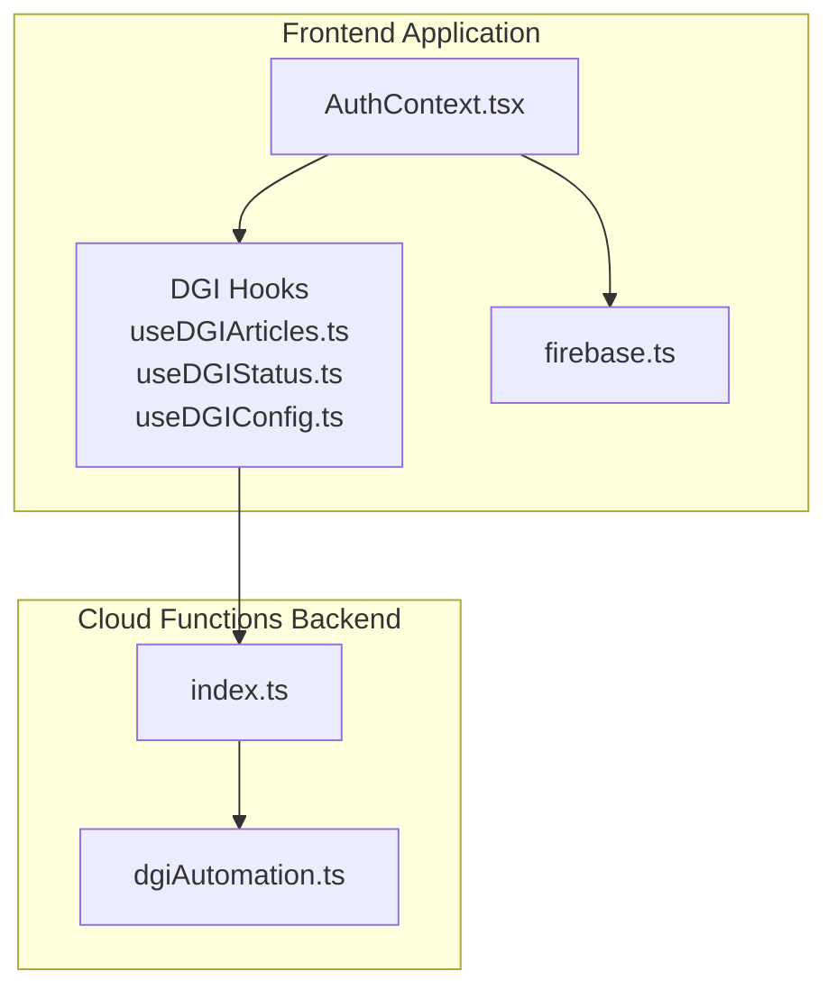
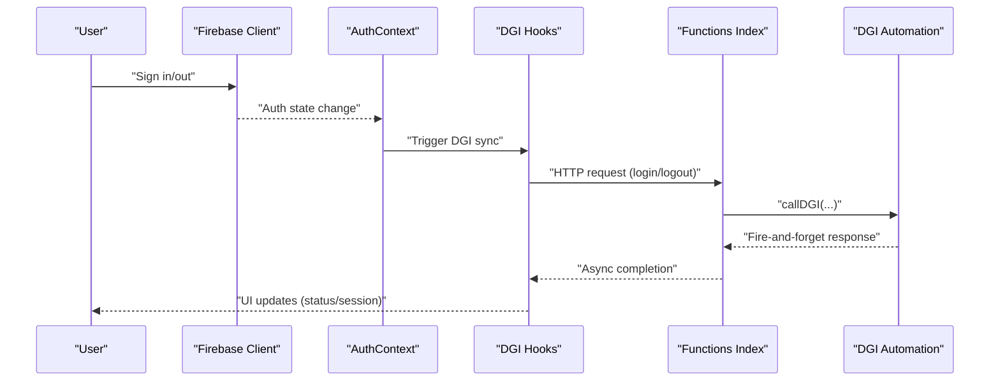
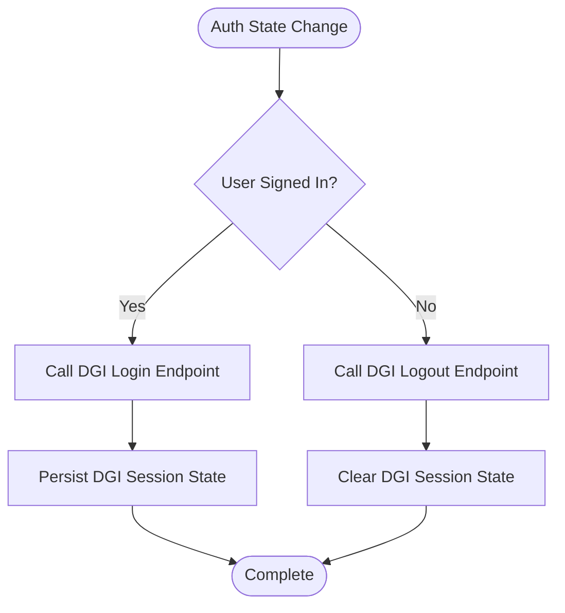
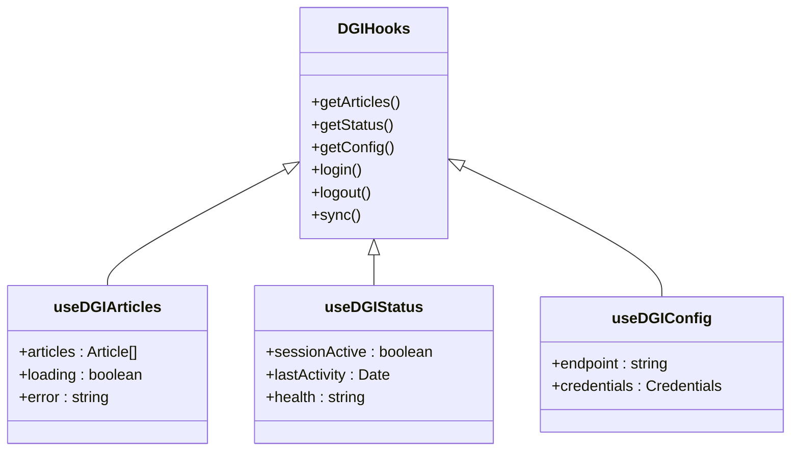
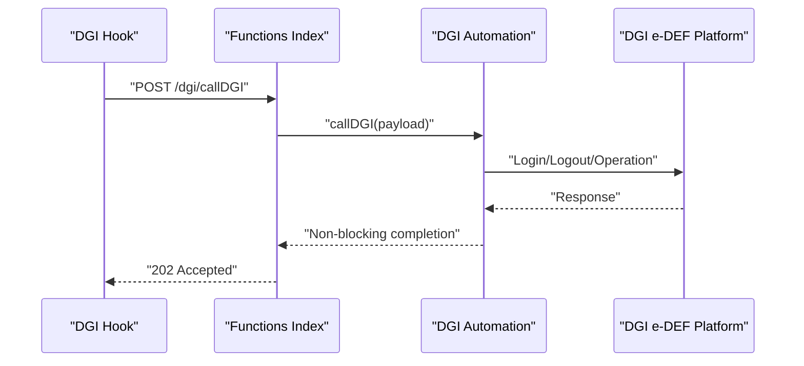
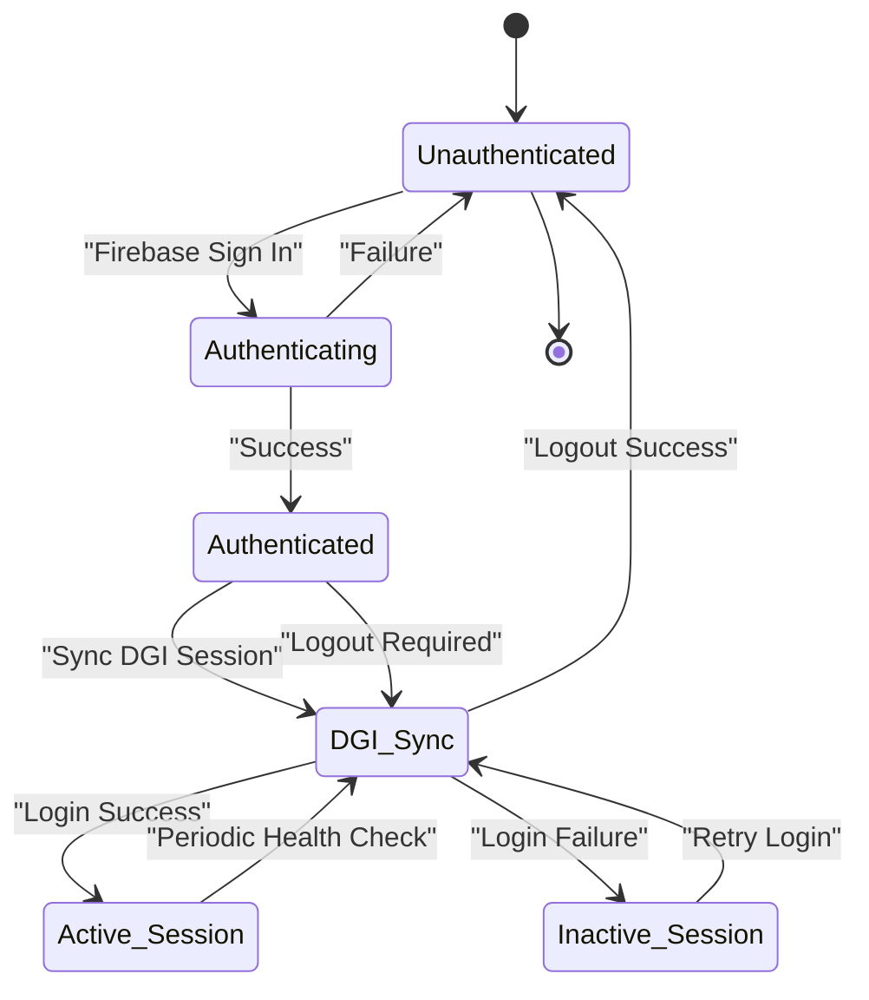
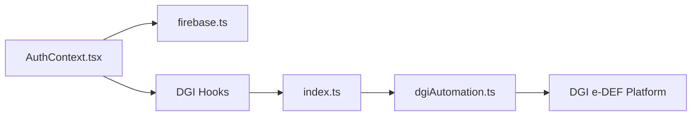

# DGI Session Coordination

<cite>
**Referenced Files in This Document**
- [dgiAutomation.ts](file://functions/src/dgiAutomation.ts)
- [index.ts](file://functions/src/index.ts)
- [AuthContext.tsx](file://src/contexts/AuthContext.tsx)
- [useDGIArticles.ts](file://src/hooks/useDGIArticles.ts)
- [useDGIStatus.ts](file://src/hooks/useDGIStatus.ts)
- [useDGIConfig.ts](file://src/hooks/useDGIConfig.ts)
- [firebase.ts](file://src/lib/firebase.ts)
- [firebase.json](file://firebase.json)
</cite>

## Table of Contents
1. [Introduction](#introduction)
2. [Project Structure](#project-structure)
3. [Core Components](#core-components)
4. [Architecture Overview](#architecture-overview)
5. [Detailed Component Analysis](#detailed-component-analysis)
6. [Dependency Analysis](#dependency-analysis)
7. [Performance Considerations](#performance-considerations)
8. [Troubleshooting Guide](#troubleshooting-guide)
9. [Security Considerations](#security-considerations)
10. [Conclusion](#conclusion)

## Introduction
This document explains how Firebase authentication integrates with DGI e-DEF platform sessions within the application. It focuses on automatic DGI login/logout synchronization, the callDGI function implementation for fire-and-forget session management, error handling strategies, and non-blocking operations. It also documents the relationship between user authentication and DGI platform access, credential management for automated tax filing, session persistence across application restarts, practical DGI session lifecycle examples, troubleshooting common integration issues, monitoring DGI session health, and security considerations for managing DGI credentials and session tokens.

## Project Structure
The DGI session coordination spans two primary areas:
- Frontend React application with Firebase authentication and DGI integration hooks
- Cloud Functions backend implementing DGI automation and session orchestration

**Diagram sources**
- [AuthContext.tsx](file://src/contexts/AuthContext.tsx)
- [useDGIArticles.ts](file://src/hooks/useDGIArticles.ts)
- [useDGIStatus.ts](file://src/hooks/useDGIStatus.ts)
- [useDGIConfig.ts](file://src/hooks/useDGIConfig.ts)
- [firebase.ts](file://src/lib/firebase.ts)
- [index.ts](file://functions/src/index.ts)
- [dgiAutomation.ts](file://functions/src/dgiAutomation.ts)

**Section sources**
- [AuthContext.tsx](file://src/contexts/AuthContext.tsx)
- [useDGIArticles.ts](file://src/hooks/useDGIArticles.ts)
- [useDGIStatus.ts](file://src/hooks/useDGIStatus.ts)
- [useDGIConfig.ts](file://src/hooks/useDGIConfig.ts)
- [firebase.ts](file://src/lib/firebase.ts)
- [index.ts](file://functions/src/index.ts)
- [dgiAutomation.ts](file://functions/src/dgiAutomation.ts)

## Core Components
- Authentication Context: Centralizes Firebase user state and exposes login/logout actions to the app.
- DGI Hooks: Provide reactive access to DGI articles, status, configuration, and session lifecycle.
- Cloud Functions Entry Point: Exposes HTTP-triggered endpoints for DGI operations.
- DGI Automation Module: Implements callDGI for fire-and-forget session management and orchestrates DGI login/logout flows.

Key responsibilities:
- Automatic synchronization: On Firebase auth state change, trigger DGI login/logout accordingly.
- Fire-and-forget operations: callDGI performs non-blocking DGI tasks to avoid blocking UI updates.
- Error handling: Robust strategies for network failures, invalid credentials, and session timeouts.
- Session persistence: Maintain DGI session state across app restarts via secure storage mechanisms.

**Section sources**
- [AuthContext.tsx](file://src/contexts/AuthContext.tsx)
- [useDGIArticles.ts](file://src/hooks/useDGIArticles.ts)
- [useDGIStatus.ts](file://src/hooks/useDGIStatus.ts)
- [useDGIConfig.ts](file://src/hooks/useDGIConfig.ts)
- [index.ts](file://functions/src/index.ts)
- [dgiAutomation.ts](file://functions/src/dgiAutomation.ts)

## Architecture Overview
The system coordinates Firebase authentication with DGI e-DEF platform sessions through a cloud function gateway. The frontend reacts to authentication events and invokes backend endpoints to manage DGI sessions.

**Diagram sources**
- [AuthContext.tsx](file://src/contexts/AuthContext.tsx)
- [useDGIArticles.ts](file://src/hooks/useDGIArticles.ts)
- [index.ts](file://functions/src/index.ts)
- [dgiAutomation.ts](file://functions/src/dgiAutomation.ts)

## Detailed Component Analysis

### Authentication Context and DGI Synchronization
The authentication context listens for Firebase auth state changes and triggers DGI synchronization. On sign-in, it attempts DGI login; on sign-out, it initiates DGI logout. This ensures that DGI session state mirrors the user's Firebase authentication state.

**Diagram sources**
- [AuthContext.tsx](file://src/contexts/AuthContext.tsx)

**Section sources**
- [AuthContext.tsx](file://src/contexts/AuthContext.tsx)

### DGI Hooks: Reactive Session Management
DGI hooks expose:
- Articles: Fetch DGI articles for automated filing
- Status: Monitor DGI session health and last activity
- Configuration: Manage DGI endpoint URLs and credentials
- Lifecycle: Trigger login/logout and handle errors

**Diagram sources**
- [useDGIArticles.ts](file://src/hooks/useDGIArticles.ts)
- [useDGIStatus.ts](file://src/hooks/useDGIStatus.ts)
- [useDGIConfig.ts](file://src/hooks/useDGIConfig.ts)

**Section sources**
- [useDGIArticles.ts](file://src/hooks/useDGIArticles.ts)
- [useDGIStatus.ts](file://src/hooks/useDGIStatus.ts)
- [useDGIConfig.ts](file://src/hooks/useDGIConfig.ts)

### Cloud Functions Entry Point and callDGI Implementation
The functions entry point exposes HTTP endpoints that delegate to the DGI automation module. The callDGI function implements fire-and-forget behavior by:
- Initiating DGI operations asynchronously
- Returning immediately without awaiting completion
- Logging errors internally for monitoring
- Avoiding UI blocking to maintain responsiveness

**Diagram sources**
- [index.ts](file://functions/src/index.ts)
- [dgiAutomation.ts](file://functions/src/dgiAutomation.ts)

**Section sources**
- [index.ts](file://functions/src/index.ts)
- [dgiAutomation.ts](file://functions/src/dgiAutomation.ts)

### Relationship Between Firebase Authentication and DGI Platform Access
- User authentication determines DGI session lifecycle
- Successful Firebase sign-in triggers DGI login
- Firebase sign-out triggers DGI logout
- DGI session state is persisted securely for continuity across restarts

**Diagram sources**
- [AuthContext.tsx](file://src/contexts/AuthContext.tsx)
- [index.ts](file://functions/src/index.ts)
- [dgiAutomation.ts](file://functions/src/dgiAutomation.ts)

**Section sources**
- [AuthContext.tsx](file://src/contexts/AuthContext.tsx)
- [index.ts](file://functions/src/index.ts)
- [dgiAutomation.ts](file://functions/src/dgiAutomation.ts)

### Practical Examples of DGI Session Lifecycle
- Login flow: Firebase auth state change → DGI login endpoint → persist session state → update UI
- Logout flow: Firebase auth state change → DGI logout endpoint → clear session state → update UI
- Health check: Periodic polling of DGI status endpoint → refresh session if needed
- Restart recovery: Load persisted DGI session state → resume operations

**Section sources**
- [AuthContext.tsx](file://src/contexts/AuthContext.tsx)
- [useDGIStatus.ts](file://src/hooks/useDGIStatus.ts)
- [index.ts](file://functions/src/index.ts)
- [dgiAutomation.ts](file://functions/src/dgiAutomation.ts)

## Dependency Analysis
The frontend depends on Firebase for authentication and on DGI hooks for session management. The backend depends on the DGI automation module for orchestration and on external DGI APIs for operations.

**Diagram sources**
- [AuthContext.tsx](file://src/contexts/AuthContext.tsx)
- [firebase.ts](file://src/lib/firebase.ts)
- [useDGIArticles.ts](file://src/hooks/useDGIArticles.ts)
- [useDGIStatus.ts](file://src/hooks/useDGIStatus.ts)
- [useDGIConfig.ts](file://src/hooks/useDGIConfig.ts)
- [index.ts](file://functions/src/index.ts)
- [dgiAutomation.ts](file://functions/src/dgiAutomation.ts)

**Section sources**
- [AuthContext.tsx](file://src/contexts/AuthContext.tsx)
- [firebase.ts](file://src/lib/firebase.ts)
- [useDGIArticles.ts](file://src/hooks/useDGIArticles.ts)
- [useDGIStatus.ts](file://src/hooks/useDGIStatus.ts)
- [useDGIConfig.ts](file://src/hooks/useDGIConfig.ts)
- [index.ts](file://functions/src/index.ts)
- [dgiAutomation.ts](file://functions/src/dgiAutomation.ts)

## Performance Considerations
- Non-blocking operations: callDGI returns immediately after initiating work to prevent UI stalls.
- Asynchronous retries: Implement exponential backoff for transient failures during DGI operations.
- Caching: Cache DGI articles and configuration to reduce repeated network calls.
- Monitoring: Track latency and failure rates of DGI endpoints to detect performance regressions.

## Troubleshooting Guide
Common issues and resolutions:
- Authentication mismatch: Verify Firebase auth state aligns with DGI session state; reconcile by triggering explicit sync.
- Network failures: Implement retry logic with jitter and fallback to cached data where appropriate.
- Session expiration: Detect inactive sessions via status checks and re-authenticate automatically.
- Credential errors: Validate stored credentials and prompt user to re-enter if invalid.
- Health monitoring: Use status endpoints to track session health and alert on prolonged downtime.

**Section sources**
- [useDGIStatus.ts](file://src/hooks/useDGIStatus.ts)
- [dgiAutomation.ts](file://functions/src/dgiAutomation.ts)

## Security Considerations
- Secure credential storage: Store DGI credentials encrypted and limit access to authorized components.
- Token handling: Avoid logging sensitive tokens; use short-lived tokens where possible.
- Transport security: Enforce HTTPS for all DGI communications and Firebase endpoints.
- Principle of least privilege: Limit DGI permissions to required scopes for automated filing.
- Audit trails: Log session events and anomalies for compliance and incident response.

## Conclusion
The DGI session coordination system integrates Firebase authentication with DGI e-DEF platform sessions through a robust, fire-and-forget architecture. By synchronizing authentication state with DGI operations, persisting session state securely, and implementing resilient error handling, the system ensures reliable automated tax filing while maintaining security and performance.