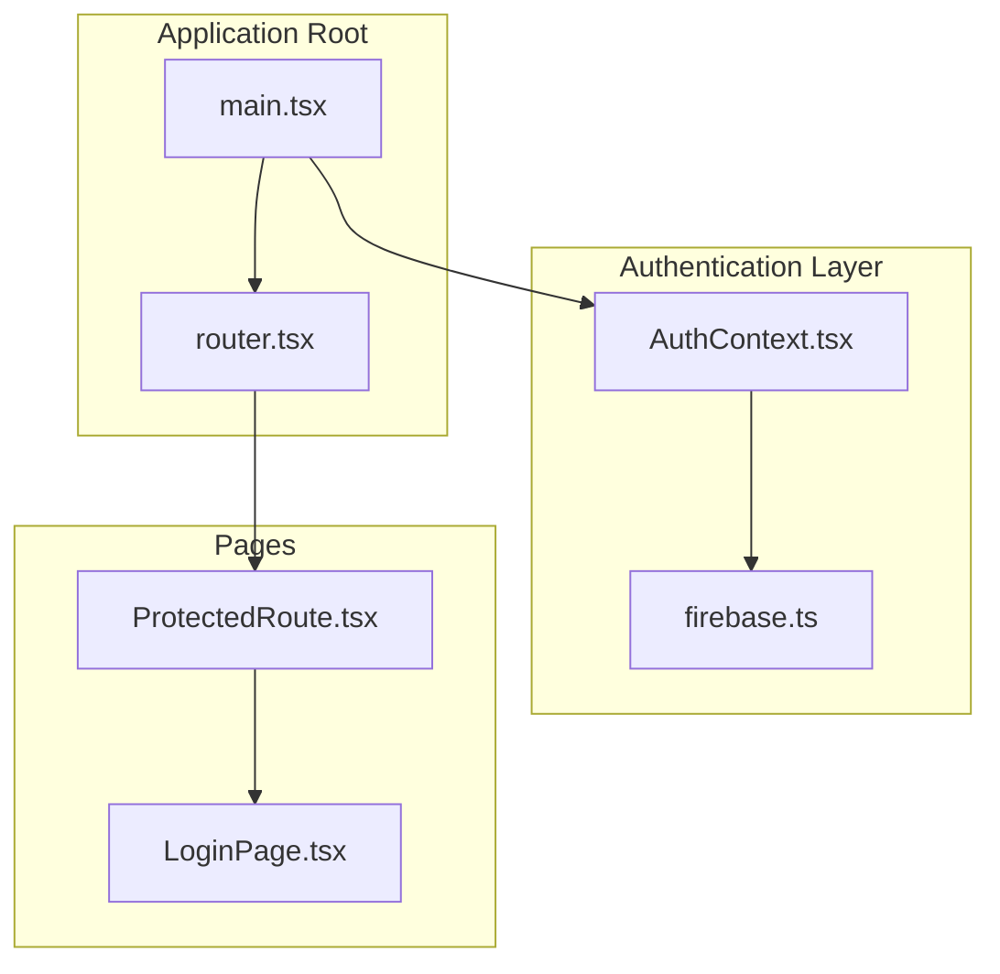
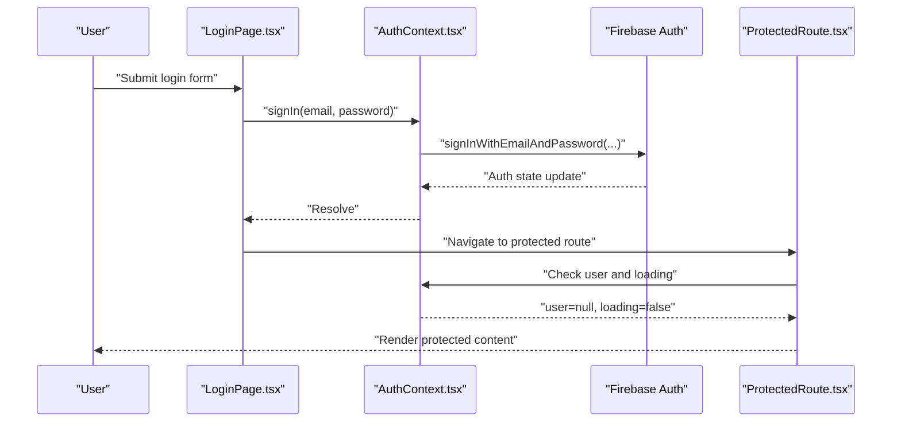
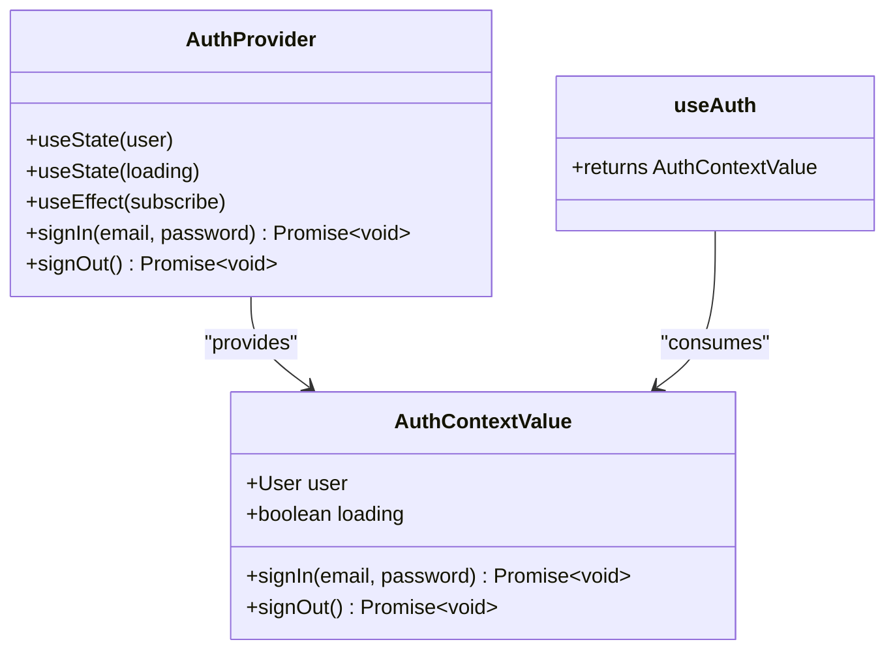
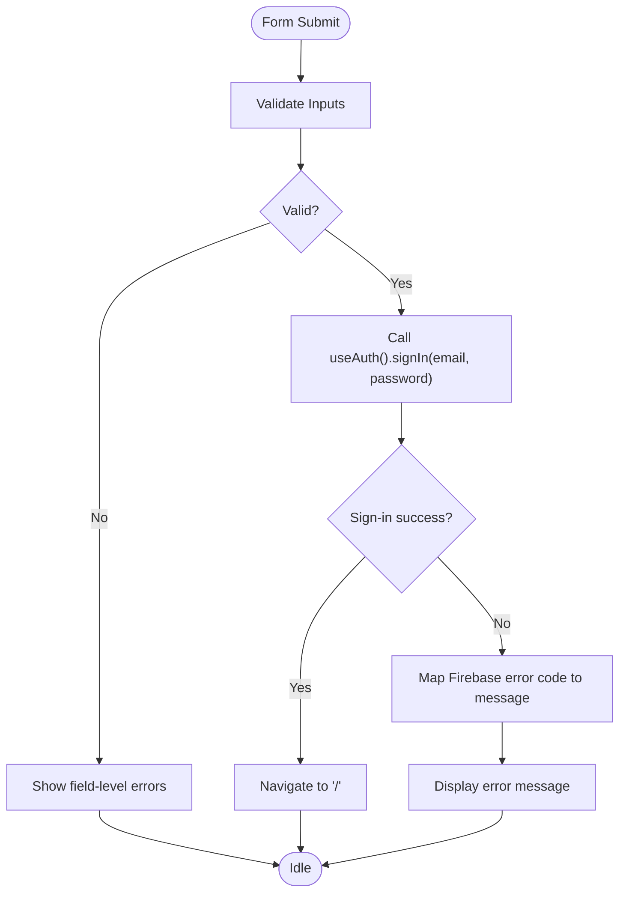
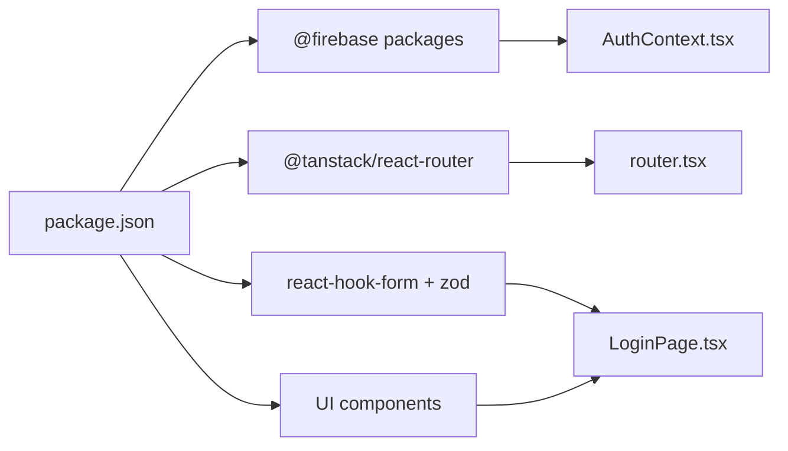

# Firebase Authentication Setup

<cite>
**Referenced Files in This Document**
- [firebase.ts](file://src/lib/firebase.ts)
- [AuthContext.tsx](file://src/contexts/AuthContext.tsx)
- [LoginPage.tsx](file://src/pages/LoginPage.tsx)
- [ProtectedRoute.tsx](file://src/components/ProtectedRoute.tsx)
- [main.tsx](file://src/main.tsx)
- [router.tsx](file://src/router.tsx)
- [package.json](file://package.json)
- [firebase.json](file://firebase.json)
- [firestore.rules](file://firestore.rules)
</cite>

## Table of Contents
1. [Introduction](#introduction)
2. [Project Structure](#project-structure)
3. [Core Components](#core-components)
4. [Architecture Overview](#architecture-overview)
5. [Detailed Component Analysis](#detailed-component-analysis)
6. [Dependency Analysis](#dependency-analysis)
7. [Performance Considerations](#performance-considerations)
8. [Troubleshooting Guide](#troubleshooting-guide)
9. [Conclusion](#conclusion)

## Introduction
This document explains how Firebase Authentication is configured and integrated into ETSMEDF. It covers Firebase initialization, authentication methods, auth state management, the AuthProvider component and context, user state handling, practical usage of authentication hooks, login form implementation, and user session persistence. It also documents the relationship between Firebase Authentication and local application state, including loading states and error handling, and outlines Firebase SDK integration patterns and security considerations for client-side authentication.

## Project Structure
The Firebase Authentication implementation spans several key files:
- Firebase configuration and initialization live in a dedicated library file.
- An AuthProvider component manages authentication state and exposes a hook for consuming components.
- A login page demonstrates authenticating via email and password and handling errors.
- ProtectedRoute ensures only authenticated users can access protected areas.
- The main application mounts the AuthProvider at the root to make authentication state globally available.
- Routing integrates ProtectedRoute around protected pages.

**Diagram sources**
- [main.tsx:12-21](file://src/main.tsx#L12-L21)
- [router.tsx:30-32](file://src/router.tsx#L30-L32)
- [AuthContext.tsx:26-55](file://src/contexts/AuthContext.tsx#L26-L55)
- [firebase.ts:16-22](file://src/lib/firebase.ts#L16-L22)
- [LoginPage.tsx:20-40](file://src/pages/LoginPage.tsx#L20-L40)
- [ProtectedRoute.tsx:6-23](file://src/components/ProtectedRoute.tsx#L6-L23)

**Section sources**
- [main.tsx:12-21](file://src/main.tsx#L12-L21)
- [router.tsx:11-85](file://src/router.tsx#L11-L85)

## Core Components
- Firebase Initialization and Services: Initializes the Firebase app and exports Firestore, Auth, and Analytics instances. Environment variables are loaded from the client environment.
- AuthProvider: Manages Firebase Auth state, exposes sign-in/sign-out functions, and provides loading state. Integrates with callable Cloud Functions for auxiliary operations.
- Login Page: Implements a form with validation and error handling, invoking the authentication hook to sign in.
- ProtectedRoute: Guards protected routes by checking authentication state and rendering a loader while state is initializing.
- Application Bootstrap: Mounts AuthProvider at the root so all routing and components can consume authentication state.

**Section sources**
- [firebase.ts:1-23](file://src/lib/firebase.ts#L1-L23)
- [AuthContext.tsx:11-61](file://src/contexts/AuthContext.tsx#L11-L61)
- [LoginPage.tsx:13-40](file://src/pages/LoginPage.tsx#L13-L40)
- [ProtectedRoute.tsx:6-23](file://src/components/ProtectedRoute.tsx#L6-L23)
- [main.tsx:12-21](file://src/main.tsx#L12-L21)

## Architecture Overview
The authentication architecture follows a provider pattern:
- Firebase Auth is initialized once and shared across the app.
- AuthProvider subscribes to auth state changes and exposes a simple hook for consumers.
- ProtectedRoute leverages the hook to enforce authentication.
- LoginPage uses the hook to trigger sign-in and navigates on success.

**Diagram sources**
- [LoginPage.tsx:32-40](file://src/pages/LoginPage.tsx#L32-L40)
- [AuthContext.tsx:38-42](file://src/contexts/AuthContext.tsx#L38-L42)
- [ProtectedRoute.tsx:7-22](file://src/components/ProtectedRoute.tsx#L7-L22)

## Detailed Component Analysis

### Firebase Initialization and Configuration
- Initialization: The Firebase app is initialized using environment variables for credentials. Firestore, Auth, and Analytics are exported for use across the app.
- Environment Variables: Credentials are loaded from the client environment, ensuring sensitive keys are not embedded in the source code.
- Analytics: Analytics is conditionally enabled if supported.

Key responsibilities:
- Centralized initialization of Firebase app.
- Export of Firestore and Auth instances for downstream modules.
- Optional analytics initialization.

**Section sources**
- [firebase.ts:6-14](file://src/lib/firebase.ts#L6-L14)
- [firebase.ts:16-22](file://src/lib/firebase.ts#L16-L22)

### AuthProvider Implementation and Context
- Context Definition: A typed context holds user, loading, signIn, and signOut.
- Auth State Subscription: Subscribes to auth state changes on mount and updates internal state accordingly.
- Sign-In Flow: Uses email/password sign-in and triggers a background callable to synchronize with external systems.
- Sign-Out Flow: Calls a background callable to synchronize logout before clearing the Firebase session.
- Hook: Provides a useAuth hook enforcing that consumers are within the provider.

**Diagram sources**
- [AuthContext.tsx:11-16](file://src/contexts/AuthContext.tsx#L11-L16)
- [AuthContext.tsx:26-55](file://src/contexts/AuthContext.tsx#L26-L55)
- [AuthContext.tsx:57-61](file://src/contexts/AuthContext.tsx#L57-L61)

**Section sources**
- [AuthContext.tsx:11-16](file://src/contexts/AuthContext.tsx#L11-L16)
- [AuthContext.tsx:26-55](file://src/contexts/AuthContext.tsx#L26-L55)
- [AuthContext.tsx:57-61](file://src/contexts/AuthContext.tsx#L57-L61)

### Authentication Hooks Usage
- useAuth(): Returns the current user, loading state, and authentication functions. Consumers must use this hook within the AuthProvider.
- Typical usage patterns:
  - On login success, navigate to a protected route.
  - On protected route render, show a loader while loading is true, otherwise redirect if user is null.

**Section sources**
- [AuthContext.tsx:57-61](file://src/contexts/AuthContext.tsx#L57-L61)
- [ProtectedRoute.tsx:7-22](file://src/components/ProtectedRoute.tsx#L7-L22)

### Login Form Implementation
- Validation: Zod schema validates email and password before submission.
- Submission: Calls the authentication hook’s signIn method and navigates on success.
- Error Handling: Maps Firebase error codes to user-friendly messages and displays them in the form.
- Loading States: Disables submit button and shows a spinner during submission.

**Diagram sources**
- [LoginPage.tsx:26-40](file://src/pages/LoginPage.tsx#L26-L40)
- [LoginPage.tsx:13-16](file://src/pages/LoginPage.tsx#L13-L16)
- [LoginPage.tsx:121-139](file://src/pages/LoginPage.tsx#L121-L139)

**Section sources**
- [LoginPage.tsx:13-16](file://src/pages/LoginPage.tsx#L13-L16)
- [LoginPage.tsx:32-40](file://src/pages/LoginPage.tsx#L32-L40)
- [LoginPage.tsx:121-139](file://src/pages/LoginPage.tsx#L121-L139)

### Protected Route Management
- Loading State: While auth state is initializing, renders a loader UI.
- Authentication Check: Redirects to the login route if the user is not authenticated.
- Content Rendering: Renders children when the user is authenticated.

**Section sources**
- [ProtectedRoute.tsx:6-23](file://src/components/ProtectedRoute.tsx#L6-L23)

### Relationship Between Firebase Auth and Local Application State
- Auth State Persistence: AuthProvider subscribes to Firebase Auth state changes and reflects them in local state.
- Loading States: The loading flag indicates whether the initial auth state has been resolved.
- Error Propagation: Errors from sign-in are surfaced to the UI via the login page and mapped to user-friendly messages.
- Session Synchronization: Background callable invocations coordinate external sessions alongside Firebase Auth.

**Section sources**
- [AuthContext.tsx:26-36](file://src/contexts/AuthContext.tsx#L26-L36)
- [AuthContext.tsx:38-48](file://src/contexts/AuthContext.tsx#L38-L48)
- [LoginPage.tsx:32-40](file://src/pages/LoginPage.tsx#L32-L40)

### Security Considerations and Firestore Rules
- Firestore Rules: Enforce that all reads and writes require an authenticated user, aligning database access with Firebase Auth.
- Client-Side Patterns: The client relies on Firebase Auth for identity and delegates sensitive operations to secure backend resources.

**Section sources**
- [firestore.rules:4-6](file://firestore.rules#L4-L6)

## Dependency Analysis
- Firebase SDK: The app depends on the Firebase client SDK for web to enable Auth, Firestore, and Analytics.
- Routing and Navigation: TanStack Router is used for navigation and route protection.
- Form Handling: react-hook-form with zod resolver provides robust form validation.
- UI Components: Shared UI components support the login form layout and behavior.

**Diagram sources**
- [package.json:21-31](file://package.json#L21-L31)
- [router.tsx:1-10](file://src/router.tsx#L1-L10)
- [LoginPage.tsx:3-11](file://src/pages/LoginPage.tsx#L3-L11)

**Section sources**
- [package.json:12-31](file://package.json#L12-L31)

## Performance Considerations
- Auth State Subscription: Subscribing to auth state changes occurs once on mount and is efficient for typical SPA lifecycles.
- Background Operations: Callable invocations for external synchronization are fire-and-forget and do not block the primary sign-in flow.
- Conditional Analytics: Analytics initialization checks support before enabling to avoid unnecessary overhead.
- UI Responsiveness: Loading indicators and disabled buttons improve perceived performance and prevent duplicate submissions.

## Troubleshooting Guide
Common issues and resolutions:
- Missing Environment Variables: Ensure Firebase config environment variables are present in the client environment.
- Auth State Not Resolving: Verify that the AuthProvider is mounted at the application root so child components can consume the context.
- Login Errors: Map Firebase error codes to user-friendly messages and display them in the form.
- Protected Route Redirect Loops: Confirm that ProtectedRoute is wrapping protected pages and that the user state resolves correctly.

**Section sources**
- [firebase.ts:6-14](file://src/lib/firebase.ts#L6-L14)
- [main.tsx:12-21](file://src/main.tsx#L12-L21)
- [LoginPage.tsx:32-40](file://src/pages/LoginPage.tsx#L32-L40)
- [ProtectedRoute.tsx:7-22](file://src/components/ProtectedRoute.tsx#L7-L22)

## Conclusion
ETSMEDF integrates Firebase Authentication through a clean provider pattern. Firebase is initialized centrally, AuthProvider manages auth state and exposes a simple hook, and ProtectedRoute enforces access control. The login page demonstrates robust validation and error handling, while Firestore rules ensure database access requires authentication. This setup balances simplicity, security, and maintainability for client-side authentication.