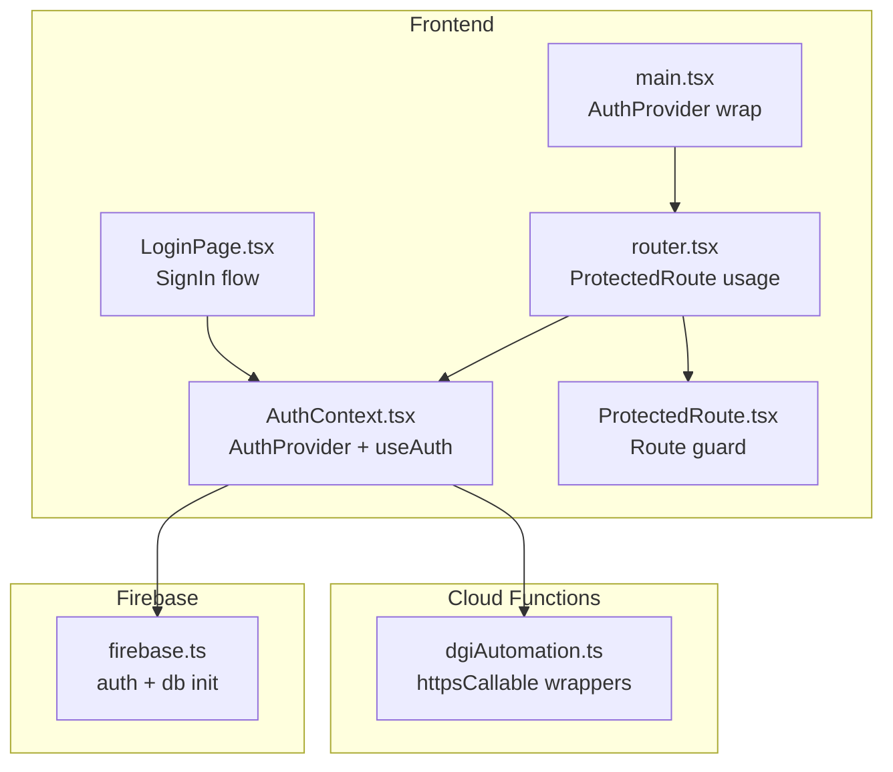
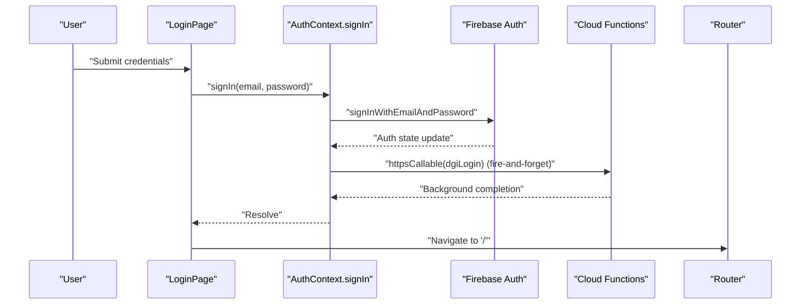
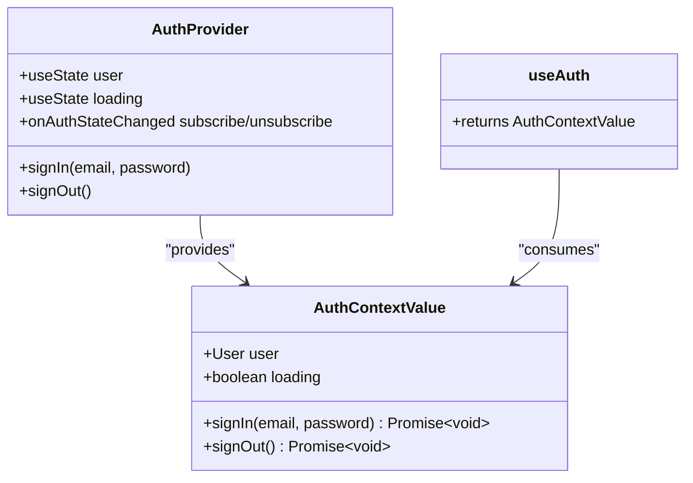
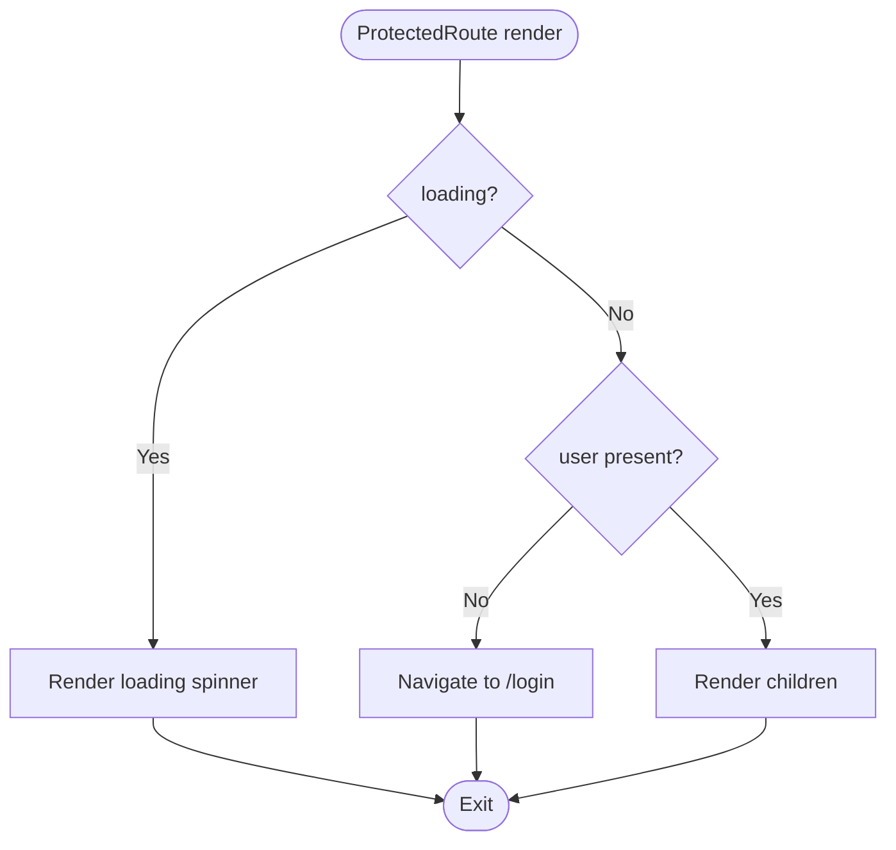
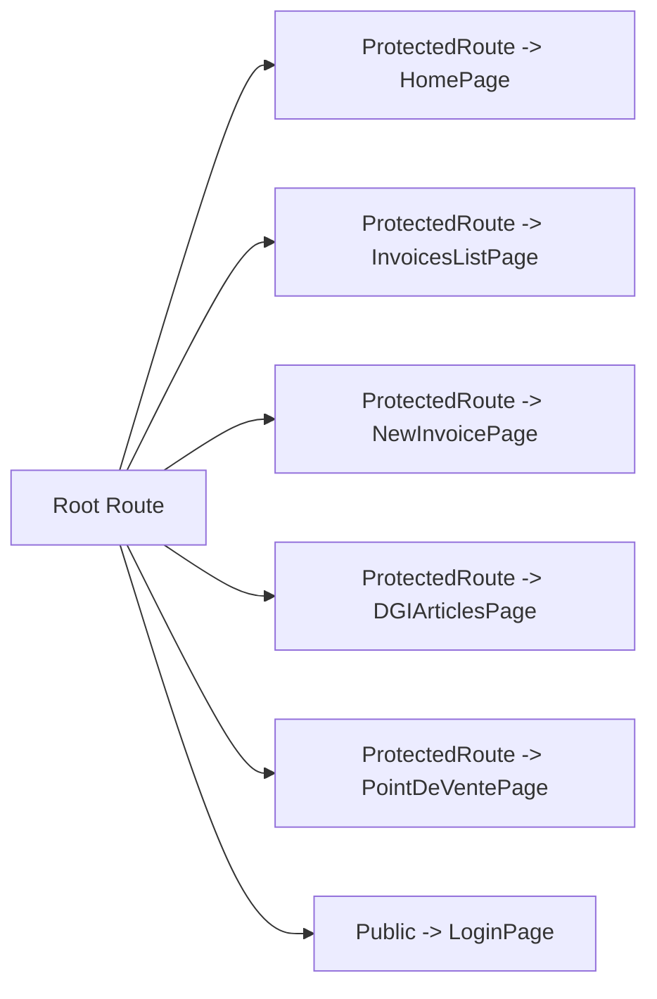
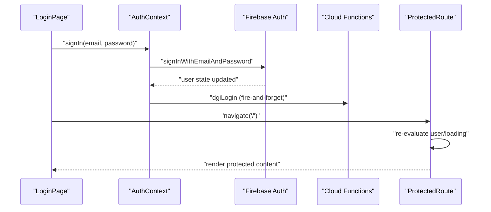
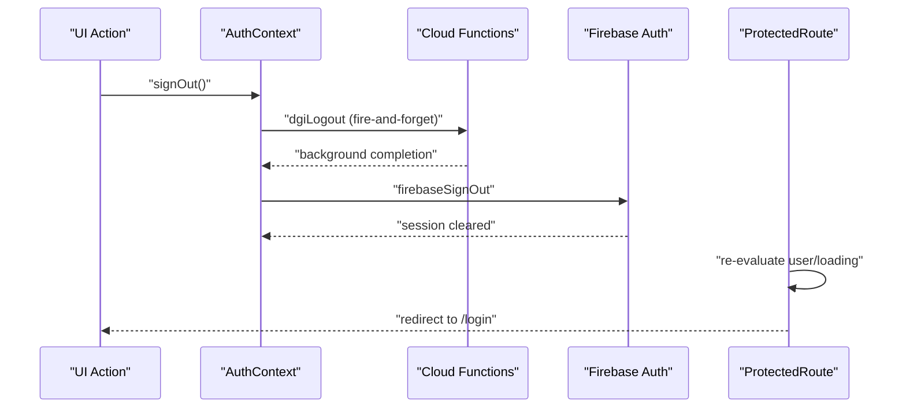
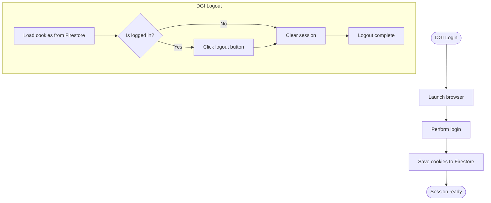
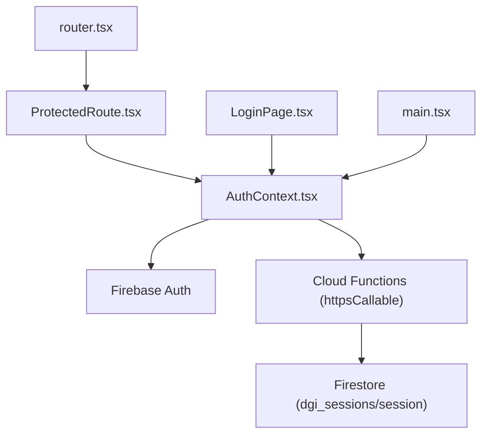

# Session Management

<cite>
**Referenced Files in This Document**
- [AuthContext.tsx](file://src/contexts/AuthContext.tsx)
- [ProtectedRoute.tsx](file://src/components/ProtectedRoute.tsx)
- [router.tsx](file://src/router.tsx)
- [LoginPage.tsx](file://src/pages/LoginPage.tsx)
- [firebase.ts](file://src/lib/firebase.ts)
- [main.tsx](file://src/main.tsx)
- [useDGIStatus.ts](file://src/hooks/useDGIStatus.ts)
- [dgiAutomation.ts](file://functions/src/dgiAutomation.ts)
</cite>

## Table of Contents
1. [Introduction](#introduction)
2. [Project Structure](#project-structure)
3. [Core Components](#core-components)
4. [Architecture Overview](#architecture-overview)
5. [Detailed Component Analysis](#detailed-component-analysis)
6. [Dependency Analysis](#dependency-analysis)
7. [Performance Considerations](#performance-considerations)
8. [Security Considerations](#security-considerations)
9. [Troubleshooting Guide](#troubleshooting-guide)
10. [Conclusion](#conclusion)

## Introduction
This document provides comprehensive session management documentation for the ETSMEDF authentication system. It focuses on the centralized authentication state managed by the AuthContext provider, route protection via ProtectedRoute, and the integration with Firebase Authentication and Cloud Functions for DGI session automation. The guide explains session lifecycle management, automatic logout handling, and state synchronization across components, along with practical usage patterns and security considerations.

## Project Structure
The authentication system spans several key areas:
- Centralized authentication state via a React Context provider
- Route protection using a dedicated ProtectedRoute wrapper
- Router configuration that applies protection to protected routes
- Login page that triggers Firebase authentication and DGI session initialization
- Firebase configuration and initialization
- DGI session automation implemented in Cloud Functions with Firestore-backed persistence

**Diagram sources**
- [main.tsx:12-21](file://src/main.tsx#L12-L21)
- [router.tsx:30-74](file://src/router.tsx#L30-L74)
- [AuthContext.tsx:26-54](file://src/contexts/AuthContext.tsx#L26-L54)
- [ProtectedRoute.tsx:6-23](file://src/components/ProtectedRoute.tsx#L6-L23)
- [LoginPage.tsx:20-40](file://src/pages/LoginPage.tsx#L20-L40)
- [firebase.ts:16-18](file://src/lib/firebase.ts#L16-L18)
- [dgiAutomation.ts:347-391](file://functions/src/dgiAutomation.ts#L347-L391)

**Section sources**
- [main.tsx:12-21](file://src/main.tsx#L12-L21)
- [router.tsx:30-74](file://src/router.tsx#L30-L74)
- [AuthContext.tsx:26-54](file://src/contexts/AuthContext.tsx#L26-L54)
- [ProtectedRoute.tsx:6-23](file://src/components/ProtectedRoute.tsx#L6-L23)
- [LoginPage.tsx:20-40](file://src/pages/LoginPage.tsx#L20-L40)
- [firebase.ts:16-18](file://src/lib/firebase.ts#L16-L18)
- [dgiAutomation.ts:347-391](file://functions/src/dgiAutomation.ts#L347-L391)

## Core Components
- AuthProvider: Provides centralized authentication state (user, loading) and exposes signIn/signOut functions. It subscribes to Firebase Authentication state changes and synchronizes DGI session via Cloud Functions.
- useAuth: Hook to consume the AuthContext, throwing if used outside the provider.
- ProtectedRoute: Route-level guard that blocks unauthenticated users and displays a loading indicator while resolving authentication state.
- LoginPage: Implements the login form, validation, submission flow, and navigation after successful authentication.
- Router: Defines protected routes by wrapping page components with ProtectedRoute.

Key responsibilities:
- State persistence: Firebase Authentication persists the user session; AuthProvider reflects current state.
- Loading indicators: Loading state prevents rendering of protected content until Firebase reports initial state.
- Authentication callbacks: Background DGI login/logout invoked via httpsCallable after Firebase auth completes.

**Section sources**
- [AuthContext.tsx:11-16](file://src/contexts/AuthContext.tsx#L11-L16)
- [AuthContext.tsx:26-54](file://src/contexts/AuthContext.tsx#L26-L54)
- [AuthContext.tsx:57-61](file://src/contexts/AuthContext.tsx#L57-L61)
- [ProtectedRoute.tsx:6-23](file://src/components/ProtectedRoute.tsx#L6-L23)
- [LoginPage.tsx:20-40](file://src/pages/LoginPage.tsx#L20-L40)
- [router.tsx:30-74](file://src/router.tsx#L30-L74)

## Architecture Overview
The session management architecture integrates frontend React components with Firebase Authentication and Cloud Functions for DGI session automation. The AuthProvider listens to Firebase auth state changes and triggers DGI session actions through callable functions. ProtectedRoute ensures only authenticated users can access protected routes, and the router config applies this protection consistently.

**Diagram sources**
- [LoginPage.tsx:32-40](file://src/pages/LoginPage.tsx#L32-L40)
- [AuthContext.tsx:38-42](file://src/contexts/AuthContext.tsx#L38-L42)
- [dgiAutomation.ts:347-364](file://functions/src/dgiAutomation.ts#L347-L364)

## Detailed Component Analysis

### AuthContext Implementation
AuthContext centralizes authentication state and actions:
- State fields: user (Firebase User or null), loading (boolean)
- Actions: signIn, signOut
- Initialization: Subscribes to Firebase onAuthStateChanged to set user and loading state
- Side effects: Calls DGI login/logout via httpsCallable after Firebase auth completes

Implementation highlights:
- Provider value includes user, loading, signIn, signOut
- useAuth hook validates provider presence and returns context
- DGI calls are fire-and-forget to avoid blocking UI transitions

**Diagram sources**
- [AuthContext.tsx:11-16](file://src/contexts/AuthContext.tsx#L11-L16)
- [AuthContext.tsx:26-54](file://src/contexts/AuthContext.tsx#L26-L54)
- [AuthContext.tsx:57-61](file://src/contexts/AuthContext.tsx#L57-L61)

**Section sources**
- [AuthContext.tsx:26-54](file://src/contexts/AuthContext.tsx#L26-L54)
- [AuthContext.tsx:57-61](file://src/contexts/AuthContext.tsx#L57-L61)

### ProtectedRoute Component
ProtectedRoute enforces authentication at the routing level:
- Reads user and loading from useAuth
- While loading, renders a centered loader
- If user is null, redirects to /login
- Otherwise, renders children

**Diagram sources**
- [ProtectedRoute.tsx:6-23](file://src/components/ProtectedRoute.tsx#L6-L23)

**Section sources**
- [ProtectedRoute.tsx:6-23](file://src/components/ProtectedRoute.tsx#L6-L23)

### Router Protection Pattern
Protected routes are configured by wrapping page components with ProtectedRoute. This pattern ensures consistent authentication checks across the application.

**Diagram sources**
- [router.tsx:26-74](file://src/router.tsx#L26-L74)

**Section sources**
- [router.tsx:26-74](file://src/router.tsx#L26-L74)

### Login Flow and State Synchronization
The login flow demonstrates state synchronization across components:
- LoginPage collects credentials and invokes AuthContext.signIn
- AuthContext.signIn delegates to Firebase and triggers DGI login via httpsCallable
- On success, LoginPage navigates to the home route
- ProtectedRoute re-evaluates authentication state and renders protected content

**Diagram sources**
- [LoginPage.tsx:32-40](file://src/pages/LoginPage.tsx#L32-L40)
- [AuthContext.tsx:38-42](file://src/contexts/AuthContext.tsx#L38-L42)
- [ProtectedRoute.tsx:6-23](file://src/components/ProtectedRoute.tsx#L6-L23)

**Section sources**
- [LoginPage.tsx:20-40](file://src/pages/LoginPage.tsx#L20-L40)
- [AuthContext.tsx:38-42](file://src/contexts/AuthContext.tsx#L38-L42)
- [ProtectedRoute.tsx:6-23](file://src/components/ProtectedRoute.tsx#L6-L23)

### Logout Lifecycle and Automatic Cleanup
Logout involves coordinated cleanup:
- AuthContext.signOut triggers DGI logout via httpsCallable (fire-and-forget)
- AuthContext.signOut then clears the Firebase session
- ProtectedRoute detects absence of user and redirects to /login

**Diagram sources**
- [AuthContext.tsx:44-48](file://src/contexts/AuthContext.tsx#L44-L48)
- [dgiAutomation.ts:366-391](file://functions/src/dgiAutomation.ts#L366-L391)
- [ProtectedRoute.tsx:18-20](file://src/components/ProtectedRoute.tsx#L18-L20)

**Section sources**
- [AuthContext.tsx:44-48](file://src/contexts/AuthContext.tsx#L44-L48)
- [dgiAutomation.ts:366-391](file://functions/src/dgiAutomation.ts#L366-L391)
- [ProtectedRoute.tsx:18-20](file://src/components/ProtectedRoute.tsx#L18-L20)

### DGI Session Automation and Persistence
DGI session automation is implemented server-side with Firestore-backed persistence:
- Login saves browser cookies to Firestore after successful authentication
- Logout loads stored cookies, performs logout action, and clears stored session
- useDGIStatus reads the DGI session document to reflect connection status

**Diagram sources**
- [dgiAutomation.ts:45-62](file://functions/src/dgiAutomation.ts#L45-L62)
- [dgiAutomation.ts:347-364](file://functions/src/dgiAutomation.ts#L347-L364)
- [dgiAutomation.ts:366-391](file://functions/src/dgiAutomation.ts#L366-L391)

**Section sources**
- [dgiAutomation.ts:45-62](file://functions/src/dgiAutomation.ts#L45-L62)
- [dgiAutomation.ts:347-364](file://functions/src/dgiAutomation.ts#L347-L364)
- [dgiAutomation.ts:366-391](file://functions/src/dgiAutomation.ts#L366-L391)

## Dependency Analysis
The authentication system exhibits clear separation of concerns:
- Frontend depends on Firebase for authentication and on Cloud Functions for DGI session actions
- Cloud Functions depend on Firestore for session persistence
- Router composes ProtectedRoute around page components to enforce access control

**Diagram sources**
- [AuthContext.tsx:26-54](file://src/contexts/AuthContext.tsx#L26-L54)
- [ProtectedRoute.tsx:6-23](file://src/components/ProtectedRoute.tsx#L6-L23)
- [router.tsx:30-74](file://src/router.tsx#L30-L74)
- [LoginPage.tsx:20-40](file://src/pages/LoginPage.tsx#L20-L40)
- [main.tsx:12-21](file://src/main.tsx#L12-L21)
- [firebase.ts:16-18](file://src/lib/firebase.ts#L16-L18)
- [dgiAutomation.ts:347-391](file://functions/src/dgiAutomation.ts#L347-L391)

**Section sources**
- [AuthContext.tsx:26-54](file://src/contexts/AuthContext.tsx#L26-L54)
- [ProtectedRoute.tsx:6-23](file://src/components/ProtectedRoute.tsx#L6-L23)
- [router.tsx:30-74](file://src/router.tsx#L30-L74)
- [LoginPage.tsx:20-40](file://src/pages/LoginPage.tsx#L20-L40)
- [main.tsx:12-21](file://src/main.tsx#L12-L21)
- [firebase.ts:16-18](file://src/lib/firebase.ts#L16-L18)
- [dgiAutomation.ts:347-391](file://functions/src/dgiAutomation.ts#L347-L391)

## Performance Considerations
- Non-blocking DGI actions: DGI login/logout are fire-and-forget to prevent UI delays during authentication transitions.
- Minimal re-renders: AuthProvider updates only user and loading state; ProtectedRoute short-circuits on loading to avoid unnecessary work.
- Lazy route loading: Router lazy-loading reduces initial bundle size; ensure protected routes remain fast to maintain responsive UX.

## Security Considerations
- Session persistence: Firebase Authentication manages secure session tokens; ensure HTTPS and proper Firebase configuration.
- Cross-tab synchronization: No explicit cross-tab synchronization mechanism is implemented in the frontend; consider adding localStorage/sessionStorage listeners if multi-tab awareness is required.
- DGI session isolation: DGI sessions are stored in Firestore per user context; protect Firestore rules to prevent unauthorized access.
- Error handling: DGI callable functions are non-blocking; failures are logged but do not block authentication flow.

## Troubleshooting Guide
Common issues and resolutions:
- ProtectedRoute shows loading spinner indefinitely: Verify Firebase initialization and onAuthStateChanged subscription.
- Redirect loops to /login: Confirm that Firebase credentials are valid and network connectivity allows auth state updates.
- DGI login fails silently: Check Cloud Function logs for dgiLogin errors; ensure Firestore permissions and DGI service availability.
- Logout does not redirect: Ensure signOut is called and ProtectedRoute re-evaluates user state.

**Section sources**
- [ProtectedRoute.tsx:9-16](file://src/components/ProtectedRoute.tsx#L9-L16)
- [AuthContext.tsx:30-36](file://src/contexts/AuthContext.tsx#L30-L36)
- [dgiAutomation.ts:20-24](file://functions/src/dgiAutomation.ts#L20-L24)

## Conclusion
The ETSMEDF authentication system provides a robust, centralized session management solution using React Context, Firebase Authentication, and Cloud Functions for DGI session automation. ProtectedRoute ensures consistent route-level protection, while AuthContext synchronizes state across components. The design emphasizes non-blocking operations and clear separation of concerns, enabling scalable and maintainable authentication flows.