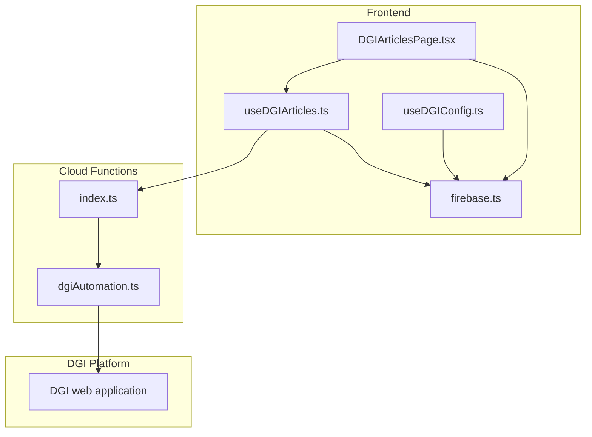
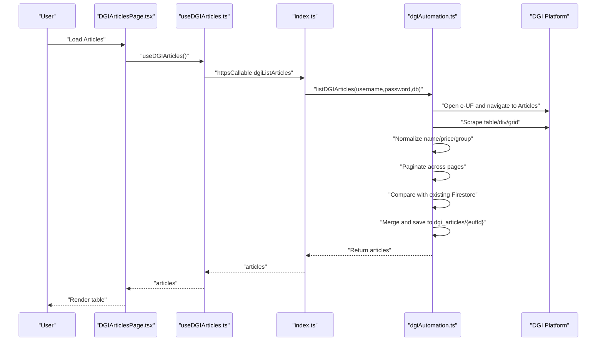
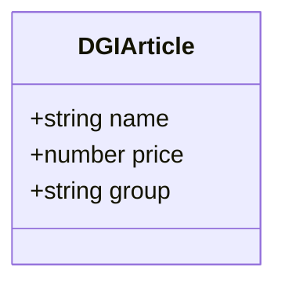
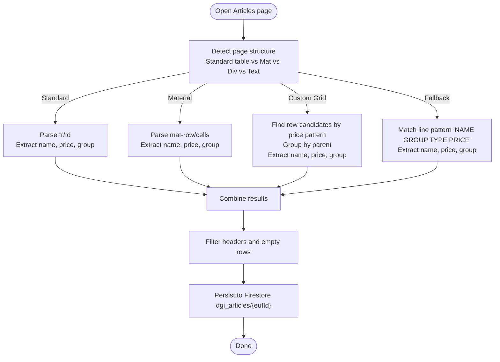
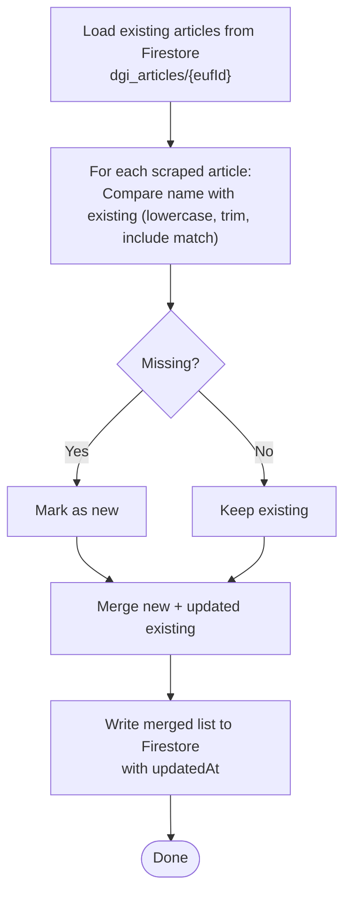
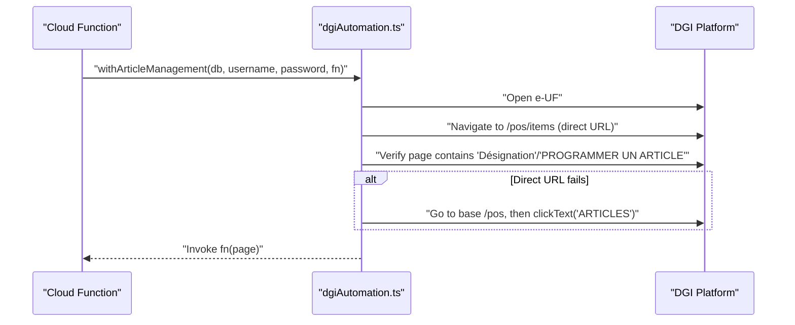
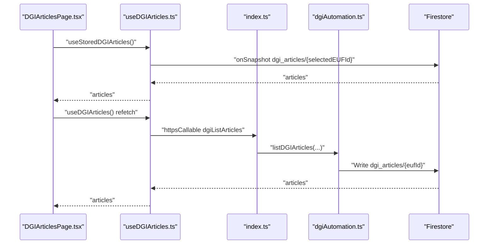
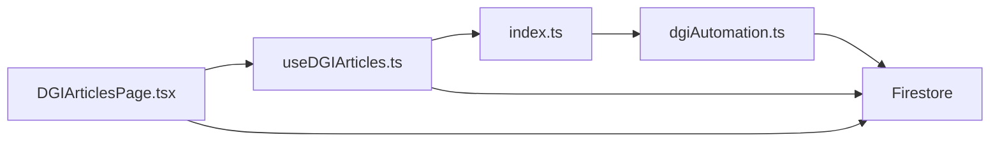

# Article Synchronization

<cite>
**Referenced Files in This Document**
- [functions/src/dgiAutomation.ts](file://functions/src/dgiAutomation.ts)
- [functions/src/index.ts](file://functions/src/index.ts)
- [src/hooks/useDGIArticles.ts](file://src/hooks/useDGIArticles.ts)
- [src/pages/DGIArticlesPage.tsx](file://src/pages/DGIArticlesPage.tsx)
- [src/hooks/useDGIConfig.ts](file://src/hooks/useDGIConfig.ts)
- [src/lib/firebase.ts](file://src/lib/firebase.ts)
- [src/types/invoice.ts](file://src/types/invoice.ts)
</cite>

## Table of Contents
1. [Introduction](#introduction)
2. [Project Structure](#project-structure)
3. [Core Components](#core-components)
4. [Architecture Overview](#architecture-overview)
5. [Detailed Component Analysis](#detailed-component-analysis)
6. [Dependency Analysis](#dependency-analysis)
7. [Performance Considerations](#performance-considerations)
8. [Troubleshooting Guide](#troubleshooting-guide)
9. [Conclusion](#conclusion)
10. [Appendices](#appendices)

## Introduction
This document explains how ETSMEDF synchronizes article data between its frontend and the DGI platform. It covers the article scraping workflow from the DGI Articles page, table parsing and normalization, comparison and merging with existing Firestore data, navigation and menu detection, and the article data model. Practical examples and strategies are included, along with guidance for handling common issues such as table format variations, encoding problems, and data consistency validation.

## Project Structure
The solution comprises:
- Frontend React application (article management UI and hooks)
- Firebase configuration and Firestore collections
- Cloud Functions that drive browser automation against DGI

**Diagram sources**
- [src/pages/DGIArticlesPage.tsx:1-445](file://src/pages/DGIArticlesPage.tsx#L1-L445)
- [src/hooks/useDGIArticles.ts:1-107](file://src/hooks/useDGIArticles.ts#L1-L107)
- [src/hooks/useDGIConfig.ts:1-84](file://src/hooks/useDGIConfig.ts#L1-L84)
- [src/lib/firebase.ts:1-23](file://src/lib/firebase.ts#L1-L23)
- [functions/src/index.ts:1-243](file://functions/src/index.ts#L1-L243)
- [functions/src/dgiAutomation.ts:1-1430](file://functions/src/dgiAutomation.ts#L1-L1430)

**Section sources**
- [src/pages/DGIArticlesPage.tsx:1-445](file://src/pages/DGIArticlesPage.tsx#L1-L445)
- [src/hooks/useDGIArticles.ts:1-107](file://src/hooks/useDGIArticles.ts#L1-L107)
- [src/hooks/useDGIConfig.ts:1-84](file://src/hooks/useDGIConfig.ts#L1-L84)
- [src/lib/firebase.ts:1-23](file://src/lib/firebase.ts#L1-L23)
- [functions/src/index.ts:1-243](file://functions/src/index.ts#L1-L243)
- [functions/src/dgiAutomation.ts:1-1430](file://functions/src/dgiAutomation.ts#L1-L1430)

## Core Components
- Article data model: name, price, and tax group
- Scraping and normalization pipeline for DGI Articles page
- Comparison and merge logic with Firestore
- Navigation and menu detection for DGI
- Frontend hooks and page for article management

**Section sources**
- [functions/src/dgiAutomation.ts:32-36](file://functions/src/dgiAutomation.ts#L32-L36)
- [functions/src/dgiAutomation.ts:756-873](file://functions/src/dgiAutomation.ts#L756-L873)
- [functions/src/dgiAutomation.ts:1072-1161](file://functions/src/dgiAutomation.ts#L1072-L1161)
- [functions/src/dgiAutomation.ts:694-752](file://functions/src/dgiAutomation.ts#L694-L752)
- [src/hooks/useDGIArticles.ts:8-12](file://src/hooks/useDGIArticles.ts#L8-L12)

## Architecture Overview
The system orchestrates browser automation to scrape DGI’s Articles page, normalize data, and persist it to Firestore. The frontend reads from Firestore and exposes CRUD operations via Cloud Functions.

**Diagram sources**
- [src/pages/DGIArticlesPage.tsx:50-57](file://src/pages/DGIArticlesPage.tsx#L50-L57)
- [src/hooks/useDGIArticles.ts:50-63](file://src/hooks/useDGIArticles.ts#L50-L63)
- [functions/src/index.ts:93-107](file://functions/src/index.ts#L93-L107)
- [functions/src/dgiAutomation.ts:1072-1161](file://functions/src/dgiAutomation.ts#L1072-L1161)
- [functions/src/dgiAutomation.ts:756-873](file://functions/src/dgiAutomation.ts#L756-L873)

## Detailed Component Analysis

### Article Data Model
- Fields: name (string), price (number), group (string, default "B")
- Used consistently across scraping, normalization, and persistence

**Diagram sources**
- [functions/src/dgiAutomation.ts:32-36](file://functions/src/dgiAutomation.ts#L32-L36)
- [src/hooks/useDGIArticles.ts:8-12](file://src/hooks/useDGIArticles.ts#L8-L12)

**Section sources**
- [functions/src/dgiAutomation.ts:32-36](file://functions/src/dgiAutomation.ts#L32-L36)
- [src/hooks/useDGIArticles.ts:8-12](file://src/hooks/useDGIArticles.ts#L8-L12)

### Article Scraping Workflow
- Detects Articles page via direct URL or fallback click
- Parses multiple table formats:
  - Standard HTML table
  - Angular Material and CDK tables
  - Custom grid/flex rows
  - Line-by-line parsing for tabular text
- Normalizes prices and groups, filters headers and invalid rows

**Diagram sources**
- [functions/src/dgiAutomation.ts:756-873](file://functions/src/dgiAutomation.ts#L756-L873)
- [functions/src/dgiAutomation.ts:1072-1161](file://functions/src/dgiAutomation.ts#L1072-L1161)

**Section sources**
- [functions/src/dgiAutomation.ts:756-873](file://functions/src/dgiAutomation.ts#L756-L873)
- [functions/src/dgiAutomation.ts:1072-1161](file://functions/src/dgiAutomation.ts#L1072-L1161)

### Article Comparison and Merging Logic
- Reads existing articles from Firestore for the selected e-UF
- Compares scraped names (case-insensitive, substring match) with existing names
- Detects duplicates and reconciles names by selecting the best available name
- Merges new entries and updates names for existing entries

**Diagram sources**
- [functions/src/dgiAutomation.ts:1072-1161](file://functions/src/dgiAutomation.ts#L1072-L1161)

**Section sources**
- [functions/src/dgiAutomation.ts:1072-1161](file://functions/src/dgiAutomation.ts#L1072-L1161)

### Article Management Navigation Flow
- Opens e-UF and navigates to Articles page using direct URL or fallback click
- Uses robust text-based menu detection to locate navigation items
- Handles SPA rendering delays and waits for network idle

**Diagram sources**
- [functions/src/dgiAutomation.ts:694-752](file://functions/src/dgiAutomation.ts#L694-L752)

**Section sources**
- [functions/src/dgiAutomation.ts:694-752](file://functions/src/dgiAutomation.ts#L694-L752)

### Frontend Integration and Data Validation
- Live subscription to Firestore for the selected e-UF’s articles
- CRUD operations via Cloud Functions (add, update, delete)
- Input validation and user feedback

**Diagram sources**
- [src/pages/DGIArticlesPage.tsx:20-46](file://src/pages/DGIArticlesPage.tsx#L20-L46)
- [src/hooks/useDGIArticles.ts:16-40](file://src/hooks/useDGIArticles.ts#L16-L40)
- [functions/src/index.ts:93-107](file://functions/src/index.ts#L93-L107)
- [functions/src/dgiAutomation.ts:1149-1160](file://functions/src/dgiAutomation.ts#L1149-L1160)

**Section sources**
- [src/pages/DGIArticlesPage.tsx:20-46](file://src/pages/DGIArticlesPage.tsx#L20-L46)
- [src/hooks/useDGIArticles.ts:16-40](file://src/hooks/useDGIArticles.ts#L16-L40)
- [functions/src/index.ts:93-107](file://functions/src/index.ts#L93-L107)
- [functions/src/dgiAutomation.ts:1149-1160](file://functions/src/dgiAutomation.ts#L1149-L1160)

## Dependency Analysis
- Cloud Functions depend on Puppeteer and Chromium for browser automation
- Cloud Functions depend on Firestore for session and configuration storage
- Frontend depends on Firebase SDK and React Query for state and mutations
- DGI navigation relies on text-based selectors and waits for SPA rendering

**Diagram sources**
- [src/pages/DGIArticlesPage.tsx:1-445](file://src/pages/DGIArticlesPage.tsx#L1-L445)
- [src/hooks/useDGIArticles.ts:1-107](file://src/hooks/useDGIArticles.ts#L1-L107)
- [functions/src/index.ts:1-243](file://functions/src/index.ts#L1-L243)
- [functions/src/dgiAutomation.ts:1-1430](file://functions/src/dgiAutomation.ts#L1-L1430)

**Section sources**
- [functions/src/dgiAutomation.ts:1-1430](file://functions/src/dgiAutomation.ts#L1-L1430)
- [functions/src/index.ts:1-243](file://functions/src/index.ts#L1-L243)
- [src/lib/firebase.ts:1-23](file://src/lib/firebase.ts#L1-L23)

## Performance Considerations
- Browser automation is CPU and memory intensive; timeouts and retries are configured in Cloud Functions
- Pagination across multiple pages increases runtime; limit pages and use network idle waits
- Price normalization uses regex and replace operations; keep patterns efficient
- Firestore writes are batched per e-UF to minimize churn

[No sources needed since this section provides general guidance]

## Troubleshooting Guide
Common issues and resolutions:
- Table format variations
  - The scraper supports standard tables, Material tables, custom grids, and text parsing. If a new layout appears, extend the parsing strategies in the scraping function.
- Encoding and decimal separators
  - Prices are normalized by removing non-numeric characters except commas and dots, then replacing comma with dot. Ensure input adheres to expected formats.
- Menu and navigation failures
  - The system uses text-based detection and fallbacks. If labels change, update the text matching logic.
- Missing articles during invoice submission
  - The system validates that all invoice items exist in DGI. If missing, add them via the article management UI before submitting invoices.
- Session and login
  - Sessions are saved to Firestore and reused. If login fails, clear the session and re-authenticate.

**Section sources**
- [functions/src/dgiAutomation.ts:756-873](file://functions/src/dgiAutomation.ts#L756-L873)
- [functions/src/dgiAutomation.ts:899-926](file://functions/src/dgiAutomation.ts#L899-L926)
- [functions/src/dgiAutomation.ts:1404-1430](file://functions/src/dgiAutomation.ts#L1404-L1430)

## Conclusion
The article synchronization pipeline integrates robust scraping, flexible parsing, and safe merging with Firestore. The frontend provides a responsive UI for managing articles and validating data against DGI. By following the outlined strategies and troubleshooting steps, teams can maintain accurate and consistent article catalogs synchronized with the DGI platform.

[No sources needed since this section summarizes without analyzing specific files]

## Appendices

### Practical Examples and Strategies
- Example: Fetching articles from DGI
  - Trigger the Cloud Function via the frontend hook; the function opens the e-UF, navigates to Articles, scrapes and normalizes data, and persists to Firestore.
- Example: Adding an article
  - Use the add mutation to trigger browser automation that locates the “Programmer un article” form, fills fields, selects group “B”, and saves.
- Example: Updating or deleting an article
  - Use update/delete mutations to modify or remove entries; the function navigates to the Articles page, finds the row, and performs the action with confirmation.
- Example: Invoice submission requiring article presence
  - Before submitting an invoice, ensure all items exist in DGI; the system checks existing article names and aborts if any are missing.

**Section sources**
- [src/pages/DGIArticlesPage.tsx:50-137](file://src/pages/DGIArticlesPage.tsx#L50-L137)
- [functions/src/dgiAutomation.ts:928-1068](file://functions/src/dgiAutomation.ts#L928-L1068)
- [functions/src/dgiAutomation.ts:899-926](file://functions/src/dgiAutomation.ts#L899-L926)
- [src/types/invoice.ts:26](file://src/types/invoice.ts#L26)