# Authentication Workflows

<cite>
**Referenced Files in This Document**
- [dgiAutomation.ts](file://functions/src/dgiAutomation.ts)
- [index.ts](file://functions/src/index.ts)
- [AuthContext.tsx](file://src/contexts/AuthContext.tsx)
- [LoginPage.tsx](file://src/pages/LoginPage.tsx)
- [firebase.ts](file://src/lib/firebase.ts)
- [useDGIConfig.ts](file://src/hooks/useDGIConfig.ts)
- [ProtectedRoute.tsx](file://src/components/ProtectedRoute.tsx)
- [package.json](file://functions/package.json)
- [firestore.rules](file://firestore.rules)
</cite>

## Table of Contents
1. [Introduction](#introduction)
2. [Project Structure](#project-structure)
3. [Core Components](#core-components)
4. [Architecture Overview](#architecture-overview)
5. [Detailed Component Analysis](#detailed-component-analysis)
6. [Dependency Analysis](#dependency-analysis)
7. [Performance Considerations](#performance-considerations)
8. [Troubleshooting Guide](#troubleshooting-guide)
9. [Conclusion](#conclusion)

## Introduction
This document explains the DGI authentication workflows and session management implemented in the project. It covers:
- Multi-strategy login approach including form detection, field mapping, and credential submission
- Session persistence using Firestore to store browser cookies and maintain authentication state across function invocations
- Login form detection strategies including text-based element finding, attribute matching, and fallback mechanisms
- Authentication state verification and automatic re-login logic when sessions expire
- Practical examples of login automation, error handling for invalid credentials, and session restoration procedures
- Security considerations for credential storage, session cleanup, and logout procedures
- Common authentication failures and troubleshooting approaches

## Project Structure
The authentication system spans both the frontend and backend:
- Frontend (React) manages Firebase Authentication and triggers backend DGI login/logout via callable functions
- Backend (Cloud Functions) runs headless Chromium, automates DGI login, persists cookies to Firestore, and restores sessions automatically

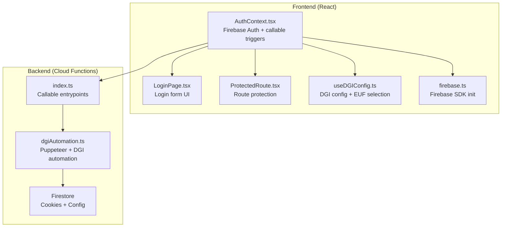

**Diagram sources**
- [AuthContext.tsx:1-62](file://src/contexts/AuthContext.tsx#L1-L62)
- [LoginPage.tsx:1-140](file://src/pages/LoginPage.tsx#L1-L140)
- [ProtectedRoute.tsx:1-24](file://src/components/ProtectedRoute.tsx#L1-L24)
- [useDGIConfig.ts:1-84](file://src/hooks/useDGIConfig.ts#L1-L84)
- [firebase.ts:1-23](file://src/lib/firebase.ts#L1-L23)
- [index.ts:1-243](file://functions/src/index.ts#L1-L243)
- [dgiAutomation.ts:1-1386](file://functions/src/dgiAutomation.ts#L1-L1386)

**Section sources**
- [AuthContext.tsx:1-62](file://src/contexts/AuthContext.tsx#L1-L62)
- [index.ts:1-243](file://functions/src/index.ts#L1-L243)
- [dgiAutomation.ts:1-1386](file://functions/src/dgiAutomation.ts#L1-L1386)

## Core Components
- Frontend authentication provider and route protection
- Callable Cloud Functions for DGI login/logout and article/invoice operations
- Puppeteer-driven DGI automation with robust form detection and session persistence
- Firestore-backed configuration and session storage

Key responsibilities:
- AuthContext.tsx: Manages Firebase Auth state, triggers DGI login/logout via callable functions
- index.ts: Exposes callable functions (login, logout, list EUs, article CRUD, invoice submission)
- dgiAutomation.ts: Implements browser automation, form detection, session restore, and logout
- useDGIConfig.ts: Reads/writes DGI configuration (selected EUF, available EUFs) from Firestore
- ProtectedRoute.tsx: Guards protected routes using Firebase Auth state

**Section sources**
- [AuthContext.tsx:1-62](file://src/contexts/AuthContext.tsx#L1-L62)
- [index.ts:1-243](file://functions/src/index.ts#L1-L243)
- [dgiAutomation.ts:1-1386](file://functions/src/dgiAutomation.ts#L1-L1386)
- [useDGIConfig.ts:1-84](file://src/hooks/useDGIConfig.ts#L1-L84)
- [ProtectedRoute.tsx:1-24](file://src/components/ProtectedRoute.tsx#L1-L24)

## Architecture Overview
High-level authentication flow:
- User logs in via Firebase Auth on the frontend
- Frontend triggers a callable function to log in to DGI in the background
- Backend launches a headless browser, performs login, saves cookies to Firestore
- Subsequent operations reuse stored cookies; if expired, re-authenticate automatically
- Logout clears the stored session and performs DGI logout

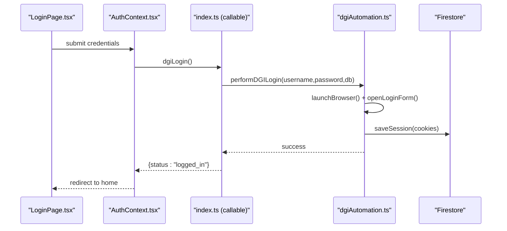

**Diagram sources**
- [LoginPage.tsx:1-140](file://src/pages/LoginPage.tsx#L1-L140)
- [AuthContext.tsx:1-62](file://src/contexts/AuthContext.tsx#L1-L62)
- [index.ts:42-56](file://functions/src/index.ts#L42-L56)
- [dgiAutomation.ts:347-364](file://functions/src/dgiAutomation.ts#L347-L364)

## Detailed Component Analysis

### Frontend Authentication Provider
- Uses Firebase Authentication for user identity
- Triggers DGI login/logout via HTTPS callable functions
- Provides sign-in/sign-out methods and exposes user/loading state

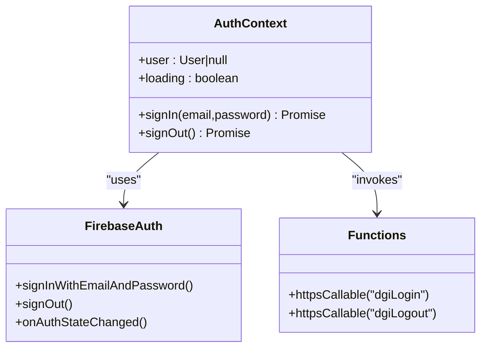

**Diagram sources**
- [AuthContext.tsx:1-62](file://src/contexts/AuthContext.tsx#L1-L62)
- [firebase.ts:1-23](file://src/lib/firebase.ts#L1-L23)

**Section sources**
- [AuthContext.tsx:1-62](file://src/contexts/AuthContext.tsx#L1-L62)
- [LoginPage.tsx:1-140](file://src/pages/LoginPage.tsx#L1-L140)
- [ProtectedRoute.tsx:1-24](file://src/components/ProtectedRoute.tsx#L1-L24)

### Backend Callable Functions
- Expose DGI operations as callable functions
- Enforce authentication and secret credentials
- Handle errors and return structured responses

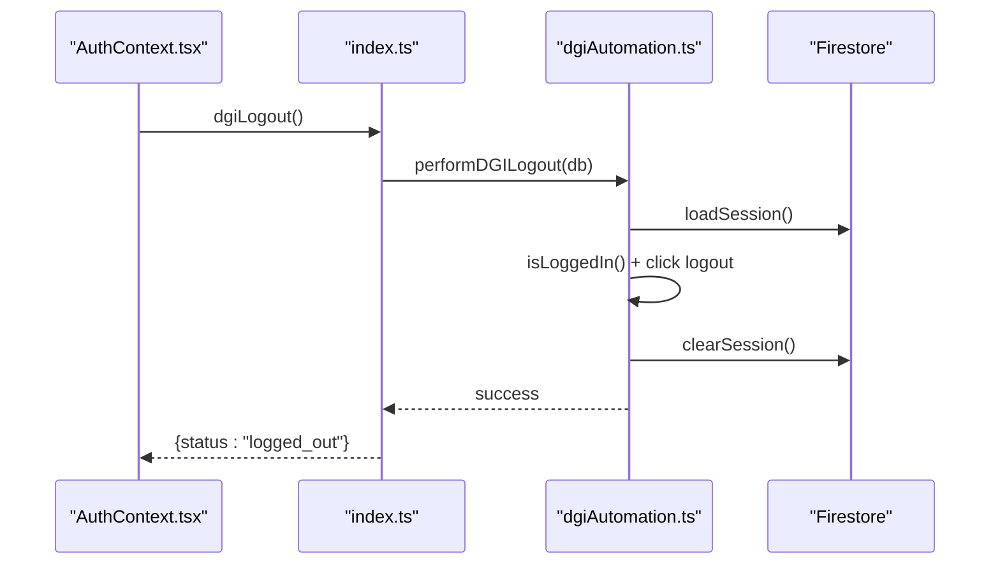

**Diagram sources**
- [index.ts:58-71](file://functions/src/index.ts#L58-L71)
- [dgiAutomation.ts:366-391](file://functions/src/dgiAutomation.ts#L366-L391)

**Section sources**
- [index.ts:1-243](file://functions/src/index.ts#L1-L243)

### DGI Automation Engine
- Launches Chromium with realistic arguments
- Robust login form detection with multiple strategies
- Field mapping for username/password with fallbacks
- Session persistence via Firestore cookies
- Automatic re-login when session expires
- Logout with session cleanup

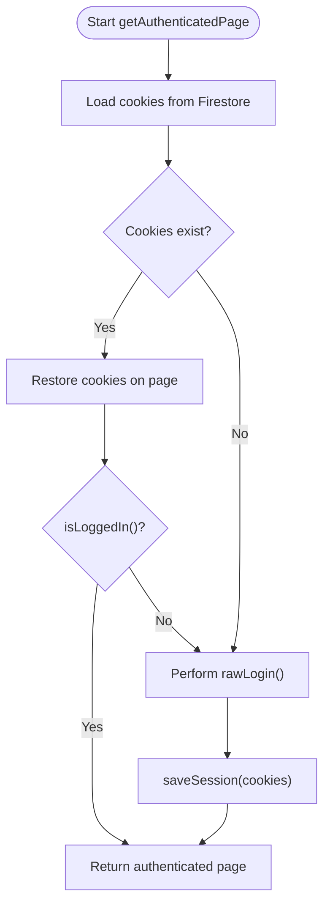

**Diagram sources**
- [dgiAutomation.ts:395-428](file://functions/src/dgiAutomation.ts#L395-L428)
- [dgiAutomation.ts:45-62](file://functions/src/dgiAutomation.ts#L45-L62)
- [dgiAutomation.ts:316-343](file://functions/src/dgiAutomation.ts#L316-L343)

**Section sources**
- [dgiAutomation.ts:1-1386](file://functions/src/dgiAutomation.ts#L1-L1386)

### Login Form Detection Strategies
- Detects login form presence directly
- Attempts to click “Se connecter” via JavaScript evaluation
- Falls back to direct navigation to /login
- Logs all visible inputs to aid debugging field names
- Throws descriptive errors if form cannot be found

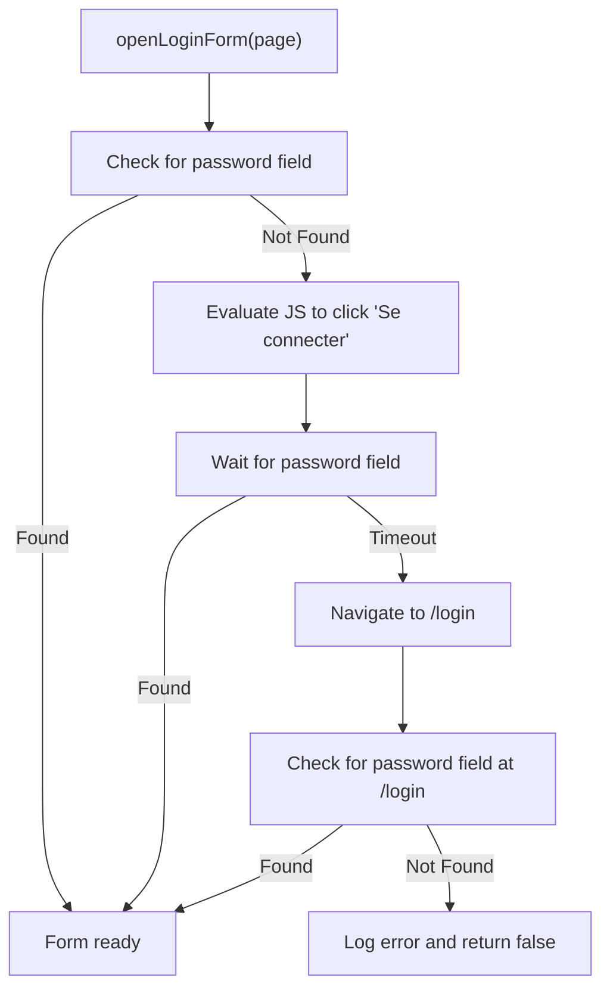

**Diagram sources**
- [dgiAutomation.ts:180-227](file://functions/src/dgiAutomation.ts#L180-L227)

**Section sources**
- [dgiAutomation.ts:180-227](file://functions/src/dgiAutomation.ts#L180-L227)

### Credential Submission and Field Mapping
- Navigates to DGI, opens login form, logs inputs for debugging
- Attempts username field mapping by name/id/placeholder
- Fills password field
- Submits via explicit submit button, fallback text-based buttons, or Enter key
- Verifies post-login state using text checks

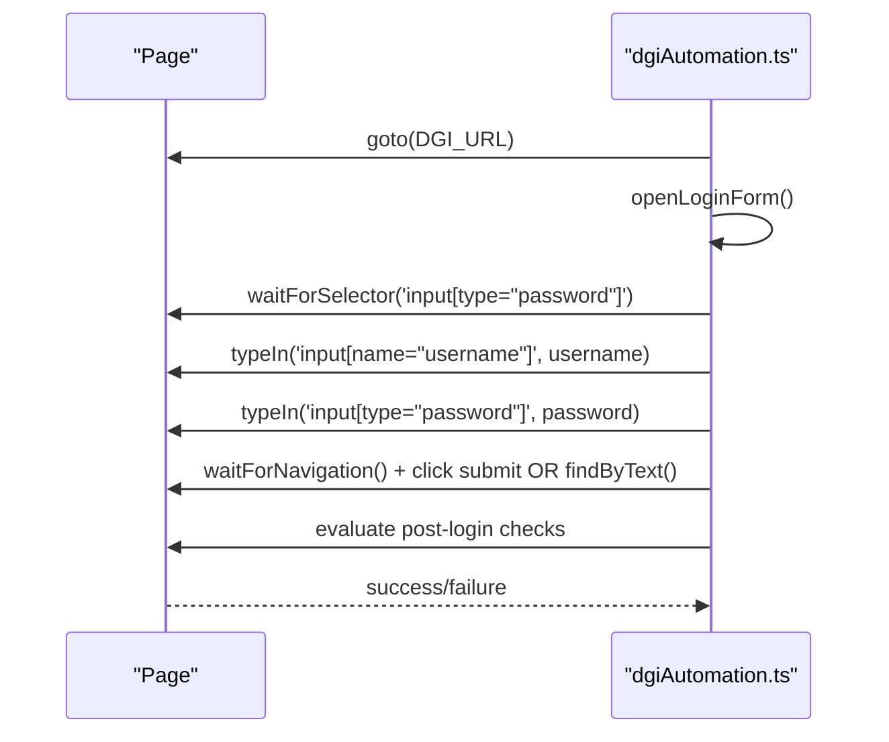

**Diagram sources**
- [dgiAutomation.ts:229-314](file://functions/src/dgiAutomation.ts#L229-L314)

**Section sources**
- [dgiAutomation.ts:229-314](file://functions/src/dgiAutomation.ts#L229-L314)

### Session Persistence and Restoration
- Cookies are sanitized and saved to Firestore under a dedicated path
- On subsequent operations, cookies are restored and checked for validity
- If invalid, re-login is performed transparently
- Session deletion occurs on logout

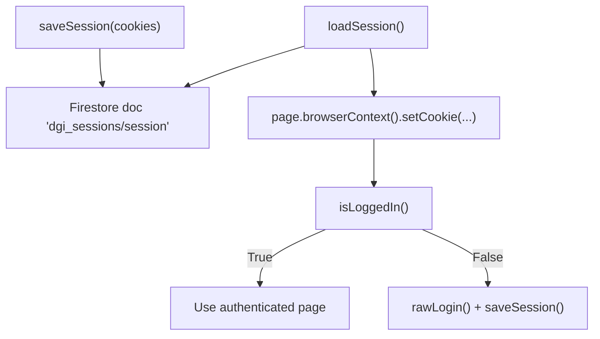

**Diagram sources**
- [dgiAutomation.ts:45-62](file://functions/src/dgiAutomation.ts#L45-L62)
- [dgiAutomation.ts:395-428](file://functions/src/dgiAutomation.ts#L395-L428)

**Section sources**
- [dgiAutomation.ts:45-62](file://functions/src/dgiAutomation.ts#L45-L62)
- [dgiAutomation.ts:395-428](file://functions/src/dgiAutomation.ts#L395-L428)

### Logout and Cleanup
- Restores cookies, verifies logged-in state, clicks logout button
- Clears the stored session from Firestore
- Ensures cleanup even if logout fails

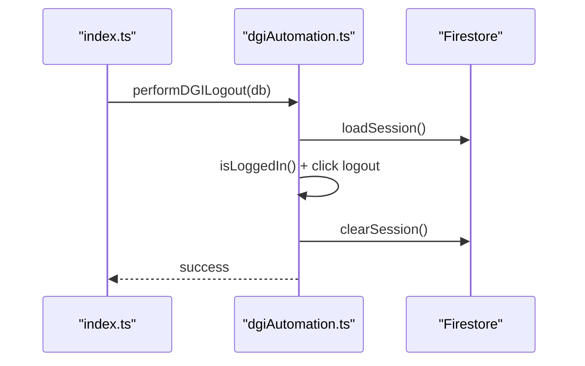

**Diagram sources**
- [index.ts:58-71](file://functions/src/index.ts#L58-L71)
- [dgiAutomation.ts:366-391](file://functions/src/dgiAutomation.ts#L366-L391)

**Section sources**
- [index.ts:58-71](file://functions/src/index.ts#L58-L71)
- [dgiAutomation.ts:366-391](file://functions/src/dgiAutomation.ts#L366-L391)

### Authentication State Verification and Automatic Re-login
- Uses a combination of text-based checks and absence of password field to detect logged-in state
- Waits for network idle and renders to ensure SPA stability
- Automatically re-logs in when session expires

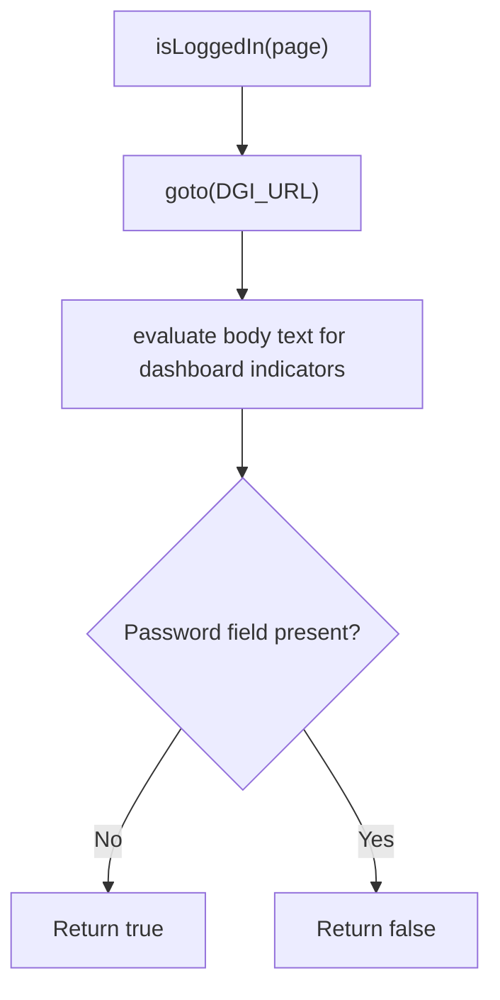

**Diagram sources**
- [dgiAutomation.ts:316-343](file://functions/src/dgiAutomation.ts#L316-L343)

**Section sources**
- [dgiAutomation.ts:316-343](file://functions/src/dgiAutomation.ts#L316-L343)

### Practical Examples and Error Handling
- Login automation: see [performDGILogin:347-364](file://functions/src/dgiAutomation.ts#L347-L364)
- Logout procedure: see [performDGILogout:366-391](file://functions/src/dgiAutomation.ts#L366-L391)
- Error handling for invalid credentials: thrown from [rawLogin:309-312](file://functions/src/dgiAutomation.ts#L309-L312)
- Session restoration: see [getAuthenticatedPage:395-428](file://functions/src/dgiAutomation.ts#L395-L428)

**Section sources**
- [dgiAutomation.ts:347-391](file://functions/src/dgiAutomation.ts#L347-L391)
- [dgiAutomation.ts:309-312](file://functions/src/dgiAutomation.ts#L309-L312)
- [dgiAutomation.ts:395-428](file://functions/src/dgiAutomation.ts#L395-L428)

## Dependency Analysis
- Frontend depends on Firebase SDK and callable functions
- Backend depends on Puppeteer, Chromium, and Firestore
- Firestore rules enforce authenticated access for all documents

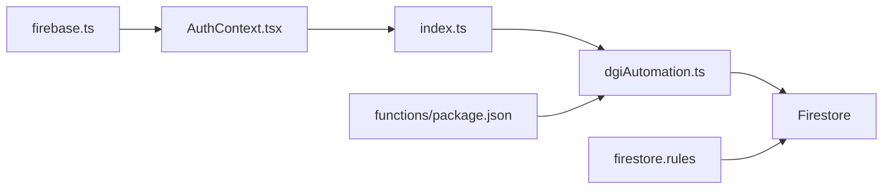

**Diagram sources**
- [firebase.ts:1-23](file://src/lib/firebase.ts#L1-L23)
- [AuthContext.tsx:1-62](file://src/contexts/AuthContext.tsx#L1-L62)
- [index.ts:1-243](file://functions/src/index.ts#L1-L243)
- [dgiAutomation.ts:1-1386](file://functions/src/dgiAutomation.ts#L1-L1386)
- [firestore.rules:1-9](file://firestore.rules#L1-L9)
- [package.json:1-34](file://functions/package.json#L1-L34)

**Section sources**
- [firebase.ts:1-23](file://src/lib/firebase.ts#L1-L23)
- [index.ts:1-243](file://functions/src/index.ts#L1-L243)
- [dgiAutomation.ts:1-1386](file://functions/src/dgiAutomation.ts#L1-L1386)
- [firestore.rules:1-9](file://firestore.rules#L1-L9)
- [package.json:1-34](file://functions/package.json#L1-L34)

## Performance Considerations
- Headless Chromium launch and navigation introduce latency; timeouts are configured appropriately
- Network idle waits ensure SPA stability before interacting with elements
- Session reuse avoids repeated logins, reducing latency and server load
- Text-based element detection is resilient but may require retries for lazy-loaded content

[No sources needed since this section provides general guidance]

## Troubleshooting Guide
Common issues and resolutions:
- Login form not found
  - Verify site accessibility and try direct navigation to /login
  - Review logged inputs to identify correct field selectors
  - See [openLoginForm:180-227](file://functions/src/dgiAutomation.ts#L180-L227)
- Invalid credentials
  - Error messages indicate incorrect NIF/password
  - See [rawLogin:309-312](file://functions/src/dgiAutomation.ts#L309-L312)
- Session expired
  - Automatic re-login occurs when [isLoggedIn:316-343](file://functions/src/dgiAutomation.ts#L316-L343) returns false
  - Confirm cookies are saved and restored
  - See [getAuthenticatedPage:395-428](file://functions/src/dgiAutomation.ts#L395-L428)
- Logout not clearing session
  - Ensure [clearSession:60-62](file://functions/src/dgiAutomation.ts#L60-L62) is invoked
  - See [performDGILogout:366-391](file://functions/src/dgiAutomation.ts#L366-L391)
- EUF selection missing
  - Firestore config must contain selectedEUFId
  - See [getSelectedEUFId:66-75](file://functions/src/dgiAutomation.ts#L66-L75) and [useDGIConfig:66-75](file://src/hooks/useDGIConfig.ts#L66-L75)

**Section sources**
- [dgiAutomation.ts:180-227](file://functions/src/dgiAutomation.ts#L180-L227)
- [dgiAutomation.ts:309-312](file://functions/src/dgiAutomation.ts#L309-L312)
- [dgiAutomation.ts:316-343](file://functions/src/dgiAutomation.ts#L316-L343)
- [dgiAutomation.ts:395-428](file://functions/src/dgiAutomation.ts#L395-L428)
- [dgiAutomation.ts:60-62](file://functions/src/dgiAutomation.ts#L60-L62)
- [dgiAutomation.ts:366-391](file://functions/src/dgiAutomation.ts#L366-L391)
- [dgiAutomation.ts:66-75](file://functions/src/dgiAutomation.ts#L66-L75)
- [useDGIConfig.ts:66-75](file://src/hooks/useDGIConfig.ts#L66-L75)

## Conclusion
The system combines Firebase Authentication with backend Puppeteer automation to provide seamless DGI login, robust session persistence, and automatic re-login when sessions expire. Firestore stores cookies and configuration, enabling cross-invocation continuity. The multi-strategy login detection and fallback mechanisms improve reliability against UI changes. Proper error handling and logout procedures ensure secure and predictable behavior.