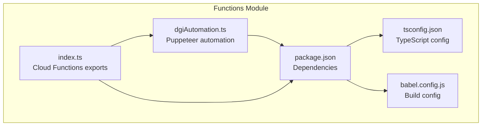
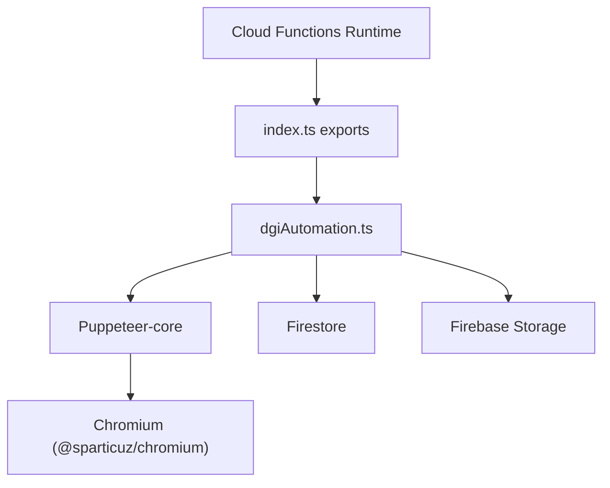
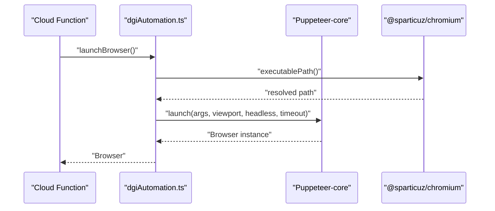
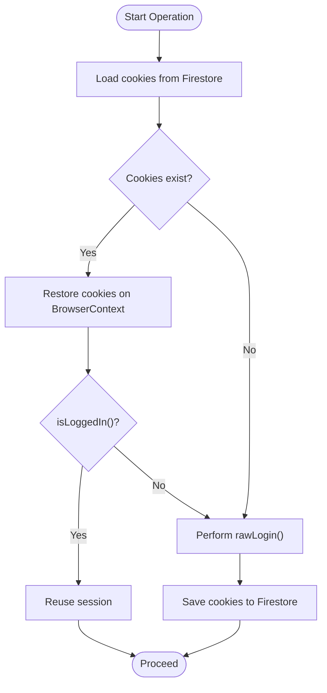
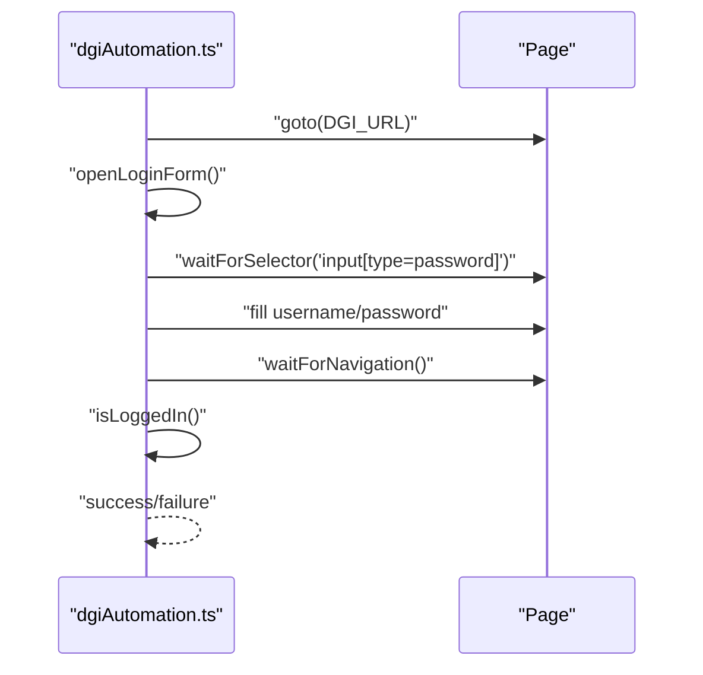
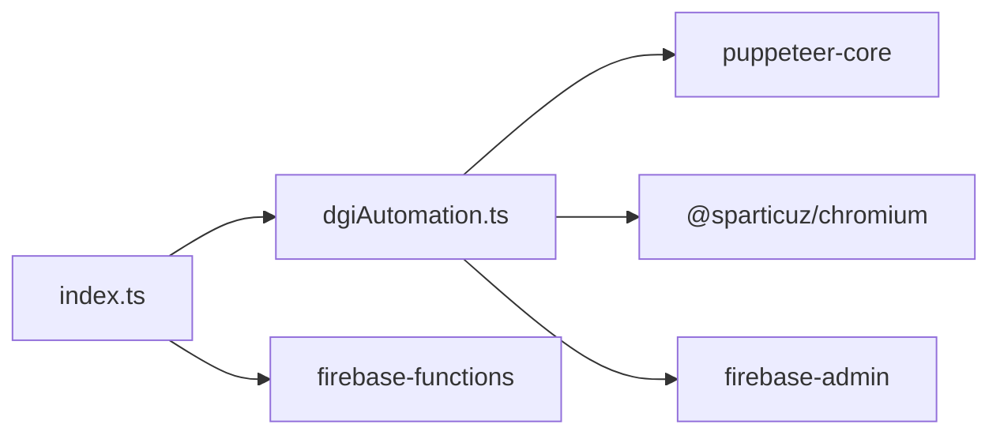

# Browser Automation Setup

<cite>
**Referenced Files in This Document**
- [dgiAutomation.ts](file://functions/src/dgiAutomation.ts)
- [index.ts](file://functions/src/index.ts)
- [package.json](file://functions/package.json)
- [tsconfig.json](file://functions/tsconfig.json)
- [babel.config.js](file://functions/babel.config.js)
- [CLAUDE.md](file://CLAUDE.md)
</cite>

## Table of Contents
1. [Introduction](#introduction)
2. [Project Structure](#project-structure)
3. [Core Components](#core-components)
4. [Architecture Overview](#architecture-overview)
5. [Detailed Component Analysis](#detailed-component-analysis)
6. [Dependency Analysis](#dependency-analysis)
7. [Performance Considerations](#performance-considerations)
8. [Troubleshooting Guide](#troubleshooting-guide)
9. [Conclusion](#conclusion)

## Introduction
This document explains the browser automation setup powering ETSMEDF’s integration with the Congolese tax authority (DGI) platform. It focuses on Puppeteer and Chromium configuration for serverless environments, session persistence across function invocations, security considerations for handling sensitive tax data, fingerprinting mitigation, and practical guidance for timeouts and resource management.

## Project Structure
The browser automation logic resides in the Cloud Functions module under functions/src/dgiAutomation.ts. The Cloud Functions entry points are defined in functions/src/index.ts. Dependencies and build configuration are declared in functions/package.json, with TypeScript and Babel configuration in functions/tsconfig.json and functions/babel.config.js respectively.

**Diagram sources**
- [index.ts:1-243](file://functions/src/index.ts#L1-L243)
- [dgiAutomation.ts:1-1287](file://functions/src/dgiAutomation.ts#L1-L1287)
- [package.json:1-34](file://functions/package.json#L1-L34)
- [tsconfig.json:1-16](file://functions/tsconfig.json#L1-L16)
- [babel.config.js:1-7](file://functions/babel.config.js#L1-L7)

**Section sources**
- [index.ts:1-243](file://functions/src/index.ts#L1-L243)
- [dgiAutomation.ts:1-1287](file://functions/src/dgiAutomation.ts#L1-L1287)
- [package.json:1-34](file://functions/package.json#L1-L34)
- [tsconfig.json:1-16](file://functions/tsconfig.json#L1-L16)
- [babel.config.js:1-7](file://functions/babel.config.js#L1-L7)

## Core Components
- Browser launcher and Chromium integration using @sparticuz/chromium and puppeteer-core.
- Session management for persisting browser cookies across invocations via Firestore.
- Robust login and navigation flows with fallback strategies and network idle waits.
- Article and invoice management flows with PDF capture and storage.
- Security posture including certificate error handling and credential storage in Secret Manager.

**Section sources**
- [dgiAutomation.ts:79-94](file://functions/src/dgiAutomation.ts#L79-L94)
- [dgiAutomation.ts:45-62](file://functions/src/dgiAutomation.ts#L45-L62)
- [dgiAutomation.ts:347-391](file://functions/src/dgiAutomation.ts#L347-L391)
- [dgiAutomation.ts:1233-1257](file://functions/src/dgiAutomation.ts#L1233-L1257)
- [CLAUDE.md:91-96](file://CLAUDE.md#L91-L96)

## Architecture Overview
The Cloud Functions runtime orchestrates browser automation through Puppeteer-core launched with Chromium from @sparticuz/chromium. Authentication state is persisted in Firestore, enabling reuse across invocations. The system integrates with Firebase Authentication and Secret Manager for secure credential handling.

**Diagram sources**
- [index.ts:1-243](file://functions/src/index.ts#L1-L243)
- [dgiAutomation.ts:1-1287](file://functions/src/dgiAutomation.ts#L1-L1287)
- [package.json:17-22](file://functions/package.json#L17-L22)

## Detailed Component Analysis

### Browser Launch and Chromium Integration
- Executable path resolution uses @sparticuz/chromium.executablePath().
- Launch arguments include Chromium defaults plus serverless-friendly flags such as disabling shared memory usage and ignoring certificate/SSL errors.
- Headless mode is enabled for serverless execution.
- Default viewport mirrors @sparticuz/chromium.defaultViewport.
- Global timeout is set for the browser process.

**Diagram sources**
- [dgiAutomation.ts:79-94](file://functions/src/dgiAutomation.ts#L79-L94)
- [package.json:18-21](file://functions/package.json#L18-L21)

**Section sources**
- [dgiAutomation.ts:79-94](file://functions/src/dgiAutomation.ts#L79-L94)
- [package.json:18-21](file://functions/package.json#L18-L21)

### Session Management and Persistence
- Cookies are saved to Firestore after login and operations.
- On subsequent invocations, cookies are loaded and validated via an “is logged in” check.
- If session is invalid, a fresh login is performed and cookies are saved again.
- Session clearing is supported for logout flows.

**Diagram sources**
- [dgiAutomation.ts:45-62](file://functions/src/dgiAutomation.ts#L45-L62)
- [dgiAutomation.ts:316-343](file://functions/src/dgiAutomation.ts#L316-L343)
- [dgiAutomation.ts:347-391](file://functions/src/dgiAutomation.ts#L347-L391)

**Section sources**
- [dgiAutomation.ts:45-62](file://functions/src/dgiAutomation.ts#L45-L62)
- [dgiAutomation.ts:316-343](file://functions/src/dgiAutomation.ts#L316-L343)
- [dgiAutomation.ts:347-391](file://functions/src/dgiAutomation.ts#L347-L391)

### Login and Navigation Strategies
- Multiple strategies to reveal the login form: detect presence, click “Se connecter” via JavaScript evaluation, or navigate directly to /login.
- Robust input detection for username/password fields with fallback selectors.
- Post-login verification checks for presence of dashboard-related text.
- Network idle waits and explicit sleeps to accommodate SPA bootstrapping.

**Diagram sources**
- [dgiAutomation.ts:180-227](file://functions/src/dgiAutomation.ts#L180-L227)
- [dgiAutomation.ts:229-314](file://functions/src/dgiAutomation.ts#L229-L314)
- [dgiAutomation.ts:316-343](file://functions/src/dgiAutomation.ts#L316-L343)

**Section sources**
- [dgiAutomation.ts:180-227](file://functions/src/dgiAutomation.ts#L180-L227)
- [dgiAutomation.ts:229-314](file://functions/src/dgiAutomation.ts#L229-L314)
- [dgiAutomation.ts:316-343](file://functions/src/dgiAutomation.ts#L316-L343)

### Fingerprinting Mitigation and Viewport Settings
- User agent is explicitly set to mimic a modern desktop browser.
- Viewport is configured to a standard desktop resolution.
- Additional Chromium arguments include disabling shared memory usage and ignoring certificate/SSL errors to improve reliability in serverless environments.

**Section sources**
- [dgiAutomation.ts:407-409](file://functions/src/dgiAutomation.ts#L407-L409)
- [dgiAutomation.ts:356](file://functions/src/dgiAutomation.ts#L356)
- [dgiAutomation.ts:83-88](file://functions/src/dgiAutomation.ts#L83-L88)

### Timeout and Resource Management
- Global page and navigation timeouts are configured per operation.
- Network idle waits are used to ensure SPA content is ready.
- Explicit sleeps are used to allow CSS transitions/animations to complete.
- Browser instances are closed in finally blocks to prevent resource leaks.

**Section sources**
- [dgiAutomation.ts:357](file://functions/src/dgiAutomation.ts#L357)
- [dgiAutomation.ts:403-404](file://functions/src/dgiAutomation.ts#L403-L404)
- [dgiAutomation.ts:550](file://functions/src/dgiAutomation.ts#L550)
- [dgiAutomation.ts:362](file://functions/src/dgiAutomation.ts#L362)

### PDF Capture and Storage
- Response interception is used to capture PDF buffers when downloading invoices.
- Captured buffers are uploaded to Firebase Storage and made public.
- Firestore invoice documents are updated with DGI reference and PDF URL.

**Section sources**
- [dgiAutomation.ts:1233-1257](file://functions/src/dgiAutomation.ts#L1233-L1257)
- [index.ts:211-242](file://functions/src/index.ts#L211-L242)

### Cloud Functions Exports and Invocation
- Cloud Functions are exported for login, logout, article management, and invoice submission.
- Memory and timeout settings are tuned for browser-heavy operations.
- Credentials are loaded from Secret Manager and validated before use.

**Section sources**
- [index.ts:42-71](file://functions/src/index.ts#L42-L71)
- [index.ts:93-107](file://functions/src/index.ts#L93-L107)
- [index.ts:109-176](file://functions/src/index.ts#L109-L176)
- [index.ts:180-242](file://functions/src/index.ts#L180-L242)
- [CLAUDE.md:91-96](file://CLAUDE.md#L91-L96)

## Dependency Analysis
The Cloud Functions module depends on:
- puppeteer-core for browser automation.
- @sparticuz/chromium for a compatible Chromium binary in serverless environments.
- firebase-admin for Firestore and Storage operations.
- firebase-functions for Cloud Functions runtime and Secret Manager integration.

**Diagram sources**
- [package.json:17-22](file://functions/package.json#L17-L22)
- [index.ts:1-15](file://functions/src/index.ts#L1-L15)

**Section sources**
- [package.json:17-22](file://functions/package.json#L17-L22)
- [index.ts:1-15](file://functions/src/index.ts#L1-L15)

## Performance Considerations
- Use session persistence to avoid repeated logins and reduce cold-start overhead.
- Configure timeouts conservatively to balance reliability and cost.
- Minimize unnecessary waits and use targeted network idle checks.
- Close browser instances promptly to free resources.

[No sources needed since this section provides general guidance]

## Troubleshooting Guide
- Certificate errors: The setup intentionally ignores certificate and SSL errors to improve reliability in serverless environments. Review certificate error handling and consider validating SSL behavior in staging.
- Login failures: Verify selectors for username/password fields and ensure fallback strategies are triggered. Confirm that the “is logged in” check detects dashboard content.
- Navigation issues: Use network idle waits and explicit sleeps around SPA bootstrapping. If direct navigation fails, rely on clickText to navigate reliably.
- PDF capture: Ensure response interception occurs before clicking download and that content-type headers indicate PDF.

**Section sources**
- [dgiAutomation.ts:86-87](file://functions/src/dgiAutomation.ts#L86-L87)
- [dgiAutomation.ts:229-314](file://functions/src/dgiAutomation.ts#L229-L314)
- [dgiAutomation.ts:550](file://functions/src/dgiAutomation.ts#L550)
- [dgiAutomation.ts:1233-1257](file://functions/src/dgiAutomation.ts#L1233-L1257)

## Conclusion
ETSMEDF’s DGI integration leverages Puppeteer-core with @sparticuz/chromium to automate browser interactions in a serverless environment. Session persistence via Firestore enables efficient reuse of authentication state, while deliberate timeout and wait strategies ensure robustness against SPA rendering. Security is addressed through Secret Manager-backed credentials and controlled certificate error handling. The documented patterns provide a solid foundation for maintaining and extending the automation flows.