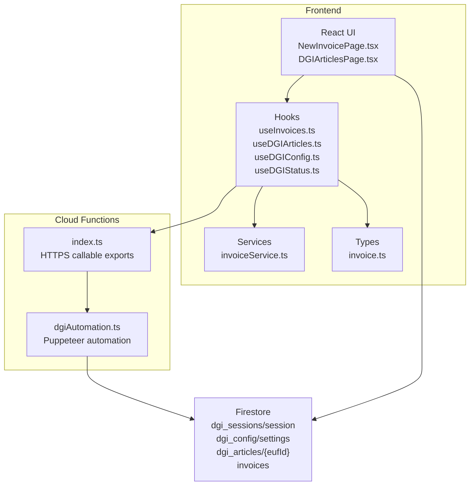
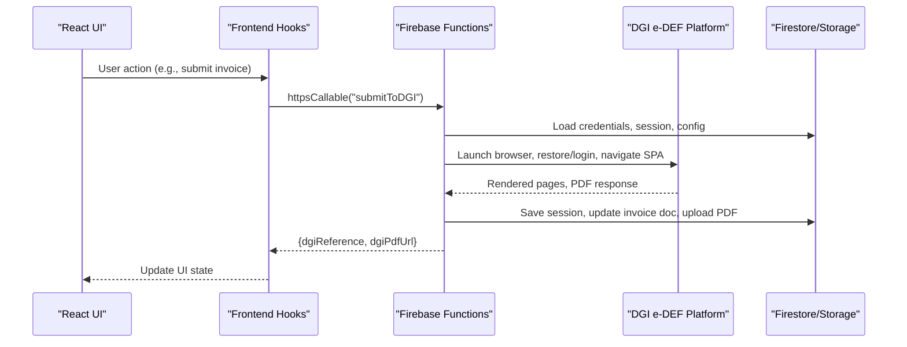
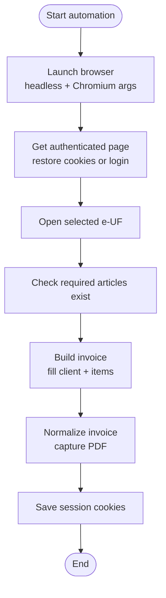
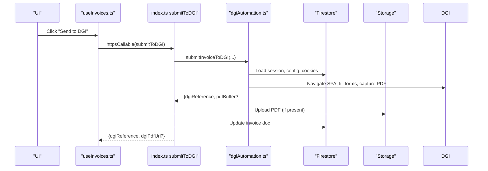
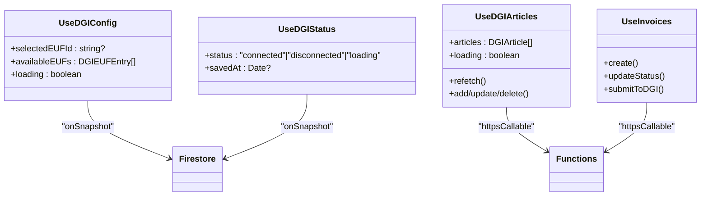
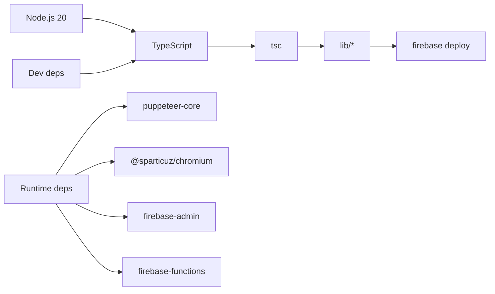
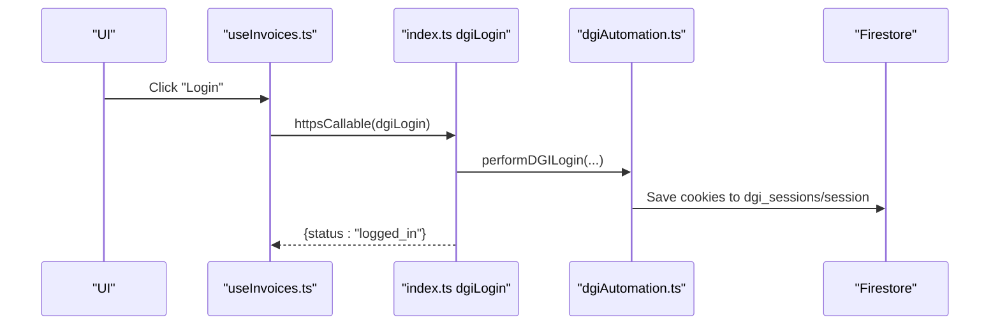
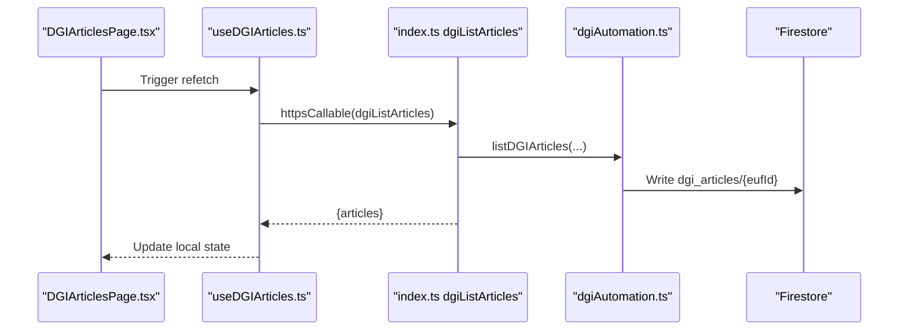
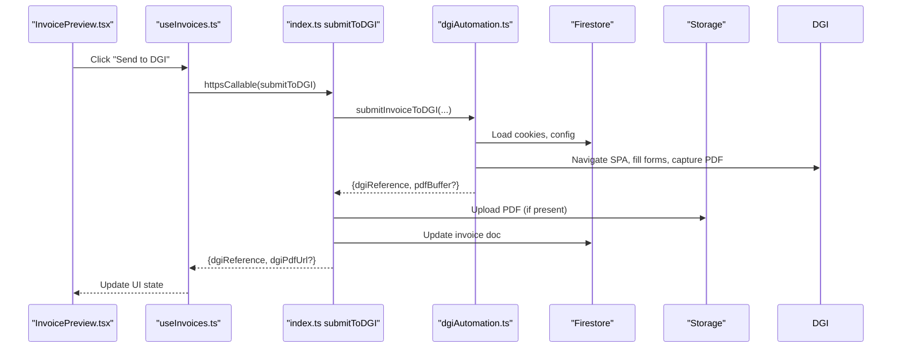

# DGI Integration

<cite>
**Referenced Files in This Document**
- [functions/src/dgiAutomation.ts](file://functions/src/dgiAutomation.ts)
- [functions/src/index.ts](file://functions/src/index.ts)
- [functions/package.json](file://functions/package.json)
- [src/hooks/useDGIConfig.ts](file://src/hooks/useDGIConfig.ts)
- [src/hooks/useDGIStatus.ts](file://src/hooks/useDGIStatus.ts)
- [src/hooks/useDGIArticles.ts](file://src/hooks/useDGIArticles.ts)
- [src/hooks/useInvoices.ts](file://src/hooks/useInvoices.ts)
- [src/lib/invoiceService.ts](file://src/lib/invoiceService.ts)
- [src/pages/DGIArticlesPage.tsx](file://src/pages/DGIArticlesPage.tsx)
- [src/pages/NewInvoicePage.tsx](file://src/pages/NewInvoicePage.tsx)
- [src/components/InvoiceForm.tsx](file://src/components/InvoiceForm.tsx)
- [src/components/InvoicePreview.tsx](file://src/components/InvoicePreview.tsx)
- [src/types/invoice.ts](file://src/types/invoice.ts)
</cite>

## Table of Contents
1. [Introduction](#introduction)
2. [Project Structure](#project-structure)
3. [Core Components](#core-components)
4. [Architecture Overview](#architecture-overview)
5. [Detailed Component Analysis](#detailed-component-analysis)
6. [Dependency Analysis](#dependency-analysis)
7. [Performance Considerations](#performance-considerations)
8. [Troubleshooting Guide](#troubleshooting-guide)
9. [Security and Compliance](#security-and-compliance)
10. [Monitoring and Observability](#monitoring-and-observability)
11. [Practical Operation Flows](#practical-operation-flows)
12. [Conclusion](#conclusion)

## Introduction
This document explains the DGI (Congolese tax authority) integration for ETSMEDF’s e-DEF platform automation. It covers the Puppeteer-based browser automation implementation for interacting with the DGI digital platform, the serverless function architecture for DGI operations, session management, login automation, and form filling workflows. It also documents integration patterns between client-side requests and serverless functions, error handling strategies, retry mechanisms, practical DGI operation flows, session persistence, data synchronization, security considerations, compliance requirements, monitoring approaches, and troubleshooting techniques.

## Project Structure
The project is split into:
- Frontend (React + TypeScript) for invoice generation, DGI article management, and UI orchestration
- Firebase Cloud Functions (TypeScript) implementing DGI automation and exposing HTTPS callable functions

**Diagram sources**
- [functions/src/index.ts:1-243](file://functions/src/index.ts#L1-L243)
- [functions/src/dgiAutomation.ts:1-1325](file://functions/src/dgiAutomation.ts#L1-L1325)
- [src/hooks/useInvoices.ts:1-90](file://src/hooks/useInvoices.ts#L1-L90)
- [src/hooks/useDGIArticles.ts:1-107](file://src/hooks/useDGIArticles.ts#L1-L107)
- [src/hooks/useDGIConfig.ts:1-84](file://src/hooks/useDGIConfig.ts#L1-L84)
- [src/hooks/useDGIStatus.ts:1-34](file://src/hooks/useDGIStatus.ts#L1-L34)
- [src/lib/invoiceService.ts:1-58](file://src/lib/invoiceService.ts#L1-L58)
- [src/types/invoice.ts:1-39](file://src/types/invoice.ts#L1-L39)

**Section sources**
- [functions/src/index.ts:1-243](file://functions/src/index.ts#L1-L243)
- [functions/src/dgiAutomation.ts:1-1325](file://functions/src/dgiAutomation.ts#L1-L1325)
- [src/hooks/useInvoices.ts:1-90](file://src/hooks/useInvoices.ts#L1-L90)
- [src/hooks/useDGIArticles.ts:1-107](file://src/hooks/useDGIArticles.ts#L1-L107)
- [src/hooks/useDGIConfig.ts:1-84](file://src/hooks/useDGIConfig.ts#L1-L84)
- [src/hooks/useDGIStatus.ts:1-34](file://src/hooks/useDGIStatus.ts#L1-L34)
- [src/lib/invoiceService.ts:1-58](file://src/lib/invoiceService.ts#L1-L58)
- [src/types/invoice.ts:1-39](file://src/types/invoice.ts#L1-L39)

## Core Components
- Puppeteer-based DGI automation engine encapsulated in dgiAutomation.ts
- HTTPS callable functions exported from index.ts for login/logout, e-UF discovery, article CRUD, and invoice submission
- Frontend hooks orchestrating calls to Cloud Functions and synchronizing state with Firestore
- Firestore collections for session persistence, configuration, article lists, and invoices

Key responsibilities:
- Launch Chromium in headless mode and emulate a real browser
- Restore or establish DGI sessions via saved cookies
- Navigate SPA layouts, locate elements by text, and fill forms
- Capture PDF receipts and upload to Firebase Storage
- Synchronize DGI-managed article catalogs to Firestore for offline use

**Section sources**
- [functions/src/dgiAutomation.ts:1-1325](file://functions/src/dgiAutomation.ts#L1-L1325)
- [functions/src/index.ts:1-243](file://functions/src/index.ts#L1-L243)

## Architecture Overview
The system follows a client-server model:
- Client-side UI triggers HTTPS callable functions via Firebase Functions SDK
- Callable functions execute Puppeteer automation against DGI e-DEF platform
- Sessions and configuration are persisted in Firestore
- Optional PDF artifacts are uploaded to Firebase Storage

**Diagram sources**
- [functions/src/index.ts:178-242](file://functions/src/index.ts#L178-L242)
- [functions/src/dgiAutomation.ts:1299-1324](file://functions/src/dgiAutomation.ts#L1299-L1324)
- [src/hooks/useInvoices.ts:60-89](file://src/hooks/useInvoices.ts#L60-L89)

**Section sources**
- [functions/src/index.ts:1-243](file://functions/src/index.ts#L1-L243)
- [functions/src/dgiAutomation.ts:1-1325](file://functions/src/dgiAutomation.ts#L1-L1325)
- [src/hooks/useInvoices.ts:1-90](file://src/hooks/useInvoices.ts#L1-L90)

## Detailed Component Analysis

### Puppeteer Automation Engine (dgiAutomation.ts)
Responsibilities:
- Browser lifecycle and emulation
- Session save/load/clear
- Login flow detection and robust credential entry
- SPA navigation and element interaction
- Article catalog scraping and synchronization
- Invoice creation, normalization, and PDF capture
- Safe fallbacks for element clicks and text matching

Key patterns:
- Robust login detection across multiple strategies (direct navigation, JS click, fallback selectors)
- Intelligent element selection using text matching and DOM traversal
- Network idle waits and explicit sleeps to accommodate SPA rendering
- PDF capture via response interception and buffer handling
- Session reuse with expiration checks and automatic re-login

**Diagram sources**
- [functions/src/dgiAutomation.ts:395-428](file://functions/src/dgiAutomation.ts#L395-L428)
- [functions/src/dgiAutomation.ts:598-671](file://functions/src/dgiAutomation.ts#L598-L671)
- [functions/src/dgiAutomation.ts:1096-1119](file://functions/src/dgiAutomation.ts#L1096-L1119)
- [functions/src/dgiAutomation.ts:1229-1269](file://functions/src/dgiAutomation.ts#L1229-L1269)

**Section sources**
- [functions/src/dgiAutomation.ts:79-94](file://functions/src/dgiAutomation.ts#L79-L94)
- [functions/src/dgiAutomation.ts:45-62](file://functions/src/dgiAutomation.ts#L45-L62)
- [functions/src/dgiAutomation.ts:229-314](file://functions/src/dgiAutomation.ts#L229-L314)
- [functions/src/dgiAutomation.ts:1096-1269](file://functions/src/dgiAutomation.ts#L1096-L1269)

### HTTPS Callable Functions (index.ts)
Exports:
- Authentication: dgiLogin, dgiLogout
- Catalog: dgiListEUFs
- Articles: dgiListArticles, dgiAddArticle, dgiDeleteArticle, dgiUpdateArticle
- Submission: submitToDGI

Behavior:
- Enforce authentication and secret management
- Configure function memory and timeouts
- Wrap automation calls, handle errors, and return structured results
- Upload PDFs to Firebase Storage and update Firestore invoice records

**Diagram sources**
- [functions/src/index.ts:178-242](file://functions/src/index.ts#L178-L242)
- [functions/src/dgiAutomation.ts:1299-1324](file://functions/src/dgiAutomation.ts#L1299-L1324)

**Section sources**
- [functions/src/index.ts:1-243](file://functions/src/index.ts#L1-L243)

### Frontend Integration (Hooks, Pages, Forms)
- useDGIConfig: subscribe to Firestore for selected e-UF and available e-UF list
- useDGIStatus: monitor session presence and freshness
- useDGIArticles: fetch and mutate DGI article catalog via Cloud Functions
- useInvoices: manage invoice lifecycle and submit to DGI
- DGIArticlesPage: UI for article CRUD and refresh
- InvoiceForm and InvoicePreview: invoice authoring and DGI submission flow

**Diagram sources**
- [src/hooks/useDGIConfig.ts:1-84](file://src/hooks/useDGIConfig.ts#L1-L84)
- [src/hooks/useDGIStatus.ts:1-34](file://src/hooks/useDGIStatus.ts#L1-L34)
- [src/hooks/useDGIArticles.ts:1-107](file://src/hooks/useDGIArticles.ts#L1-L107)
- [src/hooks/useInvoices.ts:1-90](file://src/hooks/useInvoices.ts#L1-L90)

**Section sources**
- [src/hooks/useDGIConfig.ts:1-84](file://src/hooks/useDGIConfig.ts#L1-L84)
- [src/hooks/useDGIStatus.ts:1-34](file://src/hooks/useDGIStatus.ts#L1-L34)
- [src/hooks/useDGIArticles.ts:1-107](file://src/hooks/useDGIArticles.ts#L1-L107)
- [src/hooks/useInvoices.ts:1-90](file://src/hooks/useInvoices.ts#L1-L90)
- [src/pages/DGIArticlesPage.tsx:1-445](file://src/pages/DGIArticlesPage.tsx#L1-L445)
- [src/pages/NewInvoicePage.tsx:1-45](file://src/pages/NewInvoicePage.tsx#L1-L45)
- [src/components/InvoiceForm.tsx:1-343](file://src/components/InvoiceForm.tsx#L1-L343)
- [src/components/InvoicePreview.tsx:1-347](file://src/components/InvoicePreview.tsx#L1-L347)
- [src/types/invoice.ts:1-39](file://src/types/invoice.ts#L1-L39)

## Dependency Analysis
- Runtime dependencies: Puppeteer-core, Chromium, Firebase Admin, Firebase Functions
- Build/test/dev dependencies: TypeScript, ESLint, Babel presets
- Function runtime: Node.js 20

**Diagram sources**
- [functions/package.json:17-32](file://functions/package.json#L17-L32)

**Section sources**
- [functions/package.json:1-34](file://functions/package.json#L1-L34)

## Performance Considerations
- Headless Chromium launch with optimized args and viewport
- Explicit waits for network idle and SPA rendering
- Retry strategies for lazy-loaded content
- Efficient element selection using text matching and DOM traversal
- PDF capture via response interception with early termination
- Function memory and timeout tuning per workload (login vs. article sync vs. invoice submission)

[No sources needed since this section provides general guidance]

## Troubleshooting Guide
Common issues and remedies:
- Login failures: Verify credentials and platform accessibility; review logs for missing login form or invalid credentials
- Missing articles: Ensure all invoice items exist in DGI catalog; function throws if any are missing
- Element not found: Use text-based selectors and fallback strategies; verify SPA has fully rendered
- PDF capture failures: Confirm download trigger and response interception; manual retrieval supported
- Session expiration: Automatic re-login when cookies are invalid; clear session if stale
- Timeout errors: Increase function timeout for long-running operations (article sync, invoice submission)

**Section sources**
- [functions/src/dgiAutomation.ts:229-314](file://functions/src/dgiAutomation.ts#L229-L314)
- [functions/src/dgiAutomation.ts:855-882](file://functions/src/dgiAutomation.ts#L855-L882)
- [functions/src/dgiAutomation.ts:1271-1295](file://functions/src/dgiAutomation.ts#L1271-L1295)
- [functions/src/index.ts:42-71](file://functions/src/index.ts#L42-L71)
- [functions/src/index.ts:178-242](file://functions/src/index.ts#L178-L242)

## Security and Compliance
- Secrets management: Credentials are loaded from Firebase secrets and passed to functions
- Least privilege: Functions operate within constrained environments; avoid storing sensitive data in code
- Data minimization: Only necessary fields are captured and persisted
- Audit trails: Extensive logging for all automation steps
- Compliance: Ensure adherence to local regulations for automated tax filing; maintain logs and receipts

**Section sources**
- [functions/src/index.ts:19-38](file://functions/src/index.ts#L19-L38)
- [functions/src/dgiAutomation.ts:45-62](file://functions/src/dgiAutomation.ts#L45-L62)

## Monitoring and Observability
- Function logs: Rich logging for each step (navigation, clicks, PDF capture)
- Firestore snapshots: Real-time updates for session status and article catalogs
- UI feedback: Toast notifications and loading states for user feedback
- Metrics: Track success rates and latency for key operations (login, article sync, submission)

**Section sources**
- [functions/src/dgiAutomation.ts:11-11](file://functions/src/dgiAutomation.ts#L11-L11)
- [src/hooks/useDGIStatus.ts:1-34](file://src/hooks/useDGIStatus.ts#L1-L34)
- [src/pages/DGIArticlesPage.tsx:50-57](file://src/pages/DGIArticlesPage.tsx#L50-L57)
- [src/components/InvoicePreview.tsx:59-77](file://src/components/InvoicePreview.tsx#L59-L77)

## Practical Operation Flows

### Login and Session Persistence
- User initiates login via UI
- Frontend calls dgiLogin; function launches browser, authenticates, saves cookies to Firestore
- Subsequent operations reuse saved cookies; if expired, re-authenticate automatically

**Diagram sources**
- [functions/src/index.ts:42-56](file://functions/src/index.ts#L42-L56)
- [functions/src/dgiAutomation.ts:347-364](file://functions/src/dgiAutomation.ts#L347-L364)

**Section sources**
- [functions/src/index.ts:42-56](file://functions/src/index.ts#L42-L56)
- [functions/src/dgiAutomation.ts:347-364](file://functions/src/dgiAutomation.ts#L347-L364)

### Article Catalog Sync and Local Storage
- User loads articles; function scrapes DGI, merges with existing list, and writes to Firestore under dgi_articles/{selectedEUFId}

**Diagram sources**
- [src/pages/DGIArticlesPage.tsx:50-57](file://src/pages/DGIArticlesPage.tsx#L50-L57)
- [src/hooks/useDGIArticles.ts:50-62](file://src/hooks/useDGIArticles.ts#L50-L62)
- [functions/src/index.ts:93-107](file://functions/src/index.ts#L93-L107)
- [functions/src/dgiAutomation.ts:1028-1056](file://functions/src/dgiAutomation.ts#L1028-L1056)

**Section sources**
- [src/pages/DGIArticlesPage.tsx:1-445](file://src/pages/DGIArticlesPage.tsx#L1-L445)
- [src/hooks/useDGIArticles.ts:1-107](file://src/hooks/useDGIArticles.ts#L1-L107)
- [functions/src/index.ts:93-107](file://functions/src/index.ts#L93-L107)
- [functions/src/dgiAutomation.ts:1028-1056](file://functions/src/dgiAutomation.ts#L1028-L1056)

### Invoice Submission Workflow
- User generates invoice; on submit, function validates articles, builds invoice, normalizes, captures PDF, uploads to storage, and updates Firestore

**Diagram sources**
- [src/components/InvoicePreview.tsx:59-77](file://src/components/InvoicePreview.tsx#L59-L77)
- [src/hooks/useInvoices.ts:60-89](file://src/hooks/useInvoices.ts#L60-L89)
- [functions/src/index.ts:178-242](file://functions/src/index.ts#L178-L242)
- [functions/src/dgiAutomation.ts:1299-1324](file://functions/src/dgiAutomation.ts#L1299-L1324)

**Section sources**
- [src/components/InvoicePreview.tsx:1-347](file://src/components/InvoicePreview.tsx#L1-L347)
- [src/hooks/useInvoices.ts:1-90](file://src/hooks/useInvoices.ts#L1-L90)
- [functions/src/index.ts:178-242](file://functions/src/index.ts#L178-L242)
- [functions/src/dgiAutomation.ts:1299-1324](file://functions/src/dgiAutomation.ts#L1299-L1324)

## Conclusion
The DGI integration leverages a robust Puppeteer-based automation layer wrapped behind secure, monitored Firebase Cloud Functions. It provides resilient session management, accurate article synchronization, and reliable invoice submission with optional PDF capture and storage. The frontend integrates seamlessly with Firestore and Functions to deliver a smooth user experience while maintaining strict separation of concerns and operational observability.