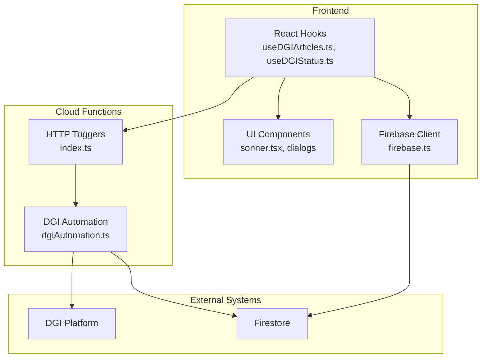
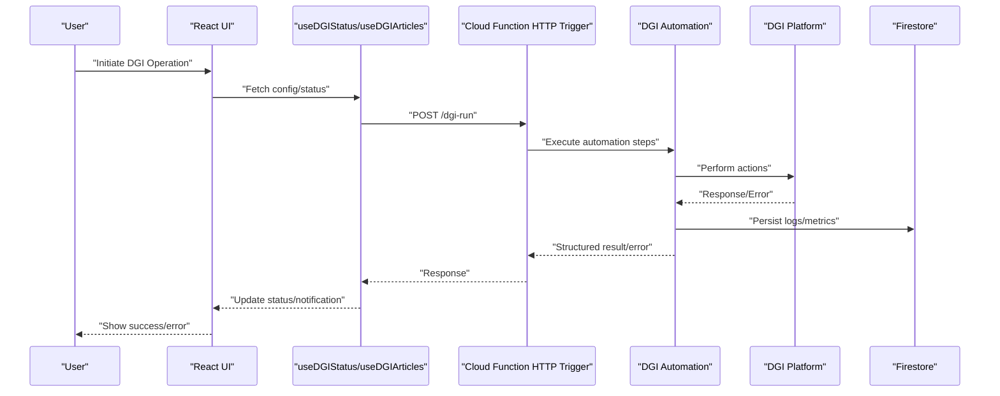
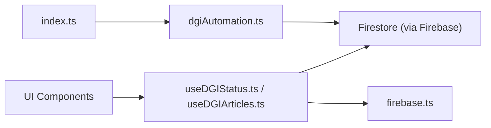

# Error Handling and Monitoring

<cite>
**Referenced Files in This Document**
- [functions/src/dgiAutomation.ts](file://functions/src/dgiAutomation.ts)
- [functions/src/index.ts](file://functions/src/index.ts)
- [src/hooks/useDGIArticles.ts](file://src/hooks/useDGIArticles.ts)
- [src/hooks/useDGIStatus.ts](file://src/hooks/useDGIStatus.ts)
- [src/lib/firebase.ts](file://src/lib/firebase.ts)
- [src/lib/utils.ts](file://src/lib/utils.ts)
- [firebase.json](file://firebase.json)
- [functions/package.json](file://functions/package.json)
</cite>

## Table of Contents
1. [Introduction](#introduction)
2. [Project Structure](#project-structure)
3. [Core Components](#core-components)
4. [Architecture Overview](#architecture-overview)
5. [Detailed Component Analysis](#detailed-component-analysis)
6. [Dependency Analysis](#dependency-analysis)
7. [Performance Considerations](#performance-considerations)
8. [Troubleshooting Guide](#troubleshooting-guide)
9. [Conclusion](#conclusion)

## Introduction
This document provides comprehensive guidance for error handling and monitoring strategies in the DGI integration. It covers error categorization (network, authentication, automation timeouts), structured logging using Firebase Functions logger, retry mechanisms (exponential backoff and circuit breaker), monitoring and alerting for success rates and failure analysis, practical recovery and graceful degradation patterns, and production troubleshooting techniques. The focus is on the backend Cloud Functions and frontend integration points that interact with the DGI platform.

## Project Structure
The DGI integration spans two primary areas:
- Backend Cloud Functions (TypeScript): orchestrate DGI automation and expose HTTP triggers.
- Frontend React application: manages configuration, status, and user notifications.

Key files involved in error handling and monitoring:
- Backend: functions/src/dgiAutomation.ts (automation logic), functions/src/index.ts (HTTP trigger exports), functions/package.json (dependencies), firebase.json (Firebase configuration).
- Frontend: src/hooks/useDGIArticles.ts and src/hooks/useDGIStatus.ts (status reporting), src/lib/firebase.ts (Firebase client), src/lib/utils.ts (shared utilities), and UI components that surface errors to users.

**Diagram sources**
- [functions/src/index.ts](file://functions/src/index.ts)
- [functions/src/dgiAutomation.ts](file://functions/src/dgiAutomation.ts)
- [src/hooks/useDGIArticles.ts](file://src/hooks/useDGIArticles.ts)
- [src/hooks/useDGIStatus.ts](file://src/hooks/useDGIStatus.ts)
- [src/lib/firebase.ts](file://src/lib/firebase.ts)

**Section sources**
- [functions/src/index.ts](file://functions/src/index.ts)
- [functions/src/dgiAutomation.ts](file://functions/src/dgiAutomation.ts)
- [src/hooks/useDGIArticles.ts](file://src/hooks/useDGIArticles.ts)
- [src/hooks/useDGIStatus.ts](file://src/hooks/useDGIStatus.ts)
- [src/lib/firebase.ts](file://src/lib/firebase.ts)

## Core Components
- DGI Automation module: encapsulates browser automation steps, error detection, and state transitions.
- HTTP Trigger module: exposes endpoints for initiating automation flows and returning structured results.
- Frontend Status Hooks: manage DGI-related statuses, fetch configurations, and surface user notifications.
- Firebase Client: initializes and interacts with Firestore for persistence and monitoring metadata.

Key responsibilities:
- Categorize and log errors with severity and context.
- Implement retries with exponential backoff for transient failures.
- Track success/failure metrics and alert thresholds.
- Provide graceful degradation and user-friendly notifications.

**Section sources**
- [functions/src/dgiAutomation.ts](file://functions/src/dgiAutomation.ts)
- [functions/src/index.ts](file://functions/src/index.ts)
- [src/hooks/useDGIStatus.ts](file://src/hooks/useDGIStatus.ts)
- [src/lib/firebase.ts](file://src/lib/firebase.ts)

## Architecture Overview
The system integrates frontend UI and Cloud Functions to automate DGI tasks. The backend logs structured events and persists state, while the frontend displays progress and errors to users.

**Diagram sources**
- [functions/src/index.ts](file://functions/src/index.ts)
- [functions/src/dgiAutomation.ts](file://functions/src/dgiAutomation.ts)
- [src/hooks/useDGIStatus.ts](file://src/hooks/useDGIStatus.ts)
- [src/hooks/useDGIArticles.ts](file://src/hooks/useDGIArticles.ts)
- [src/lib/firebase.ts](file://src/lib/firebase.ts)

## Detailed Component Analysis

### DGI Automation Module
Responsibilities:
- Execute browser automation steps with robust error detection.
- Categorize errors (network, authentication, timeout).
- Emit structured logs with context and severity.
- Persist outcomes and metrics to Firestore.

Error categories:
- Network errors: connectivity issues, DNS failures, timeouts during requests.
- Authentication failures: invalid credentials, session expiry, MFA prompts.
- Automation timeouts: page load delays, element not found, unexpected navigation.

Retry strategy:
- Exponential backoff with jitter for transient failures.
- Circuit breaker to prevent cascading failures after threshold breaches.

Graceful degradation:
- Fallback to cached data or partial results when possible.
- User notification with actionable guidance.

Monitoring:
- Log success/failure counts per operation type.
- Track latency distributions and error rate trends.

**Section sources**
- [functions/src/dgiAutomation.ts](file://functions/src/dgiAutomation.ts)

### HTTP Trigger Module
Responsibilities:
- Expose endpoints for DGI operations.
- Validate incoming requests and sanitize inputs.
- Wrap automation execution with structured error handling.
- Return standardized responses and propagate logs.

Endpoints:
- POST /dgi-run: initiate automation with configuration and optional retry parameters.

Error propagation:
- Map internal errors to appropriate HTTP status codes.
- Attach correlation IDs for tracing across logs.

**Section sources**
- [functions/src/index.ts](file://functions/src/index.ts)

### Frontend Status Hooks
Responsibilities:
- Fetch DGI configuration and current status.
- Subscribe to real-time updates from Firestore.
- Surface user notifications via toast/dialog components.
- Coordinate with Firebase client for authentication and persistence.

Integration points:
- useDGIStatus: monitor operation progress and outcomes.
- useDGIArticles: handle article/data synchronization with error handling.

**Section sources**
- [src/hooks/useDGIStatus.ts](file://src/hooks/useDGIStatus.ts)
- [src/hooks/useDGIArticles.ts](file://src/hooks/useDGIArticles.ts)
- [src/lib/firebase.ts](file://src/lib/firebase.ts)

### Logging Strategy with Firebase Functions Logger
Logging approach:
- Structured JSON logs with fields: timestamp, level, operation, errorType, message, correlationId, durationMs.
- Include contextual metadata (DGI session ID, user ID, step name).
- Emit logs for successful completions, partial successes, and failures.

Debugging aids:
- Correlation IDs enable end-to-end tracing across frontend and backend.
- Severity levels help filter noisy vs critical events.

**Section sources**
- [functions/src/dgiAutomation.ts](file://functions/src/dgiAutomation.ts)
- [functions/src/index.ts](file://functions/src/index.ts)

### Retry Mechanisms and Circuit Breaker
Exponential backoff:
- Compute delay = baseDelay * 2^attempt + randomJitter.
- Apply cap to prevent excessive delays.

Circuit breaker:
- Track consecutive failure count and rolling error rate.
- Trip breaker after exceeding thresholds; allow limited probe requests to test recovery.

Recovery:
- On success, reset counters and close breaker.
- On breaker open, return immediate failure with retry-after guidance.

**Section sources**
- [functions/src/dgiAutomation.ts](file://functions/src/dgiAutomation.ts)

### Monitoring and Alerting Setup
Metrics to track:
- Success rate per endpoint and operation type.
- Error rate by category (network, auth, timeout).
- Latency p50/p95/p99 for automation steps.
- Retry frequency and breaker trips.

Alerting thresholds:
- Sudden spikes in error rate.
- Decline in success rate beyond baseline.
- Elevated latency percentiles.
- Repeated breaker trips.

Dashboards:
- Real-time dashboards in Firebase console or external monitoring systems.
- Historical trend analysis for regression detection.

**Section sources**
- [functions/src/dgiAutomation.ts](file://functions/src/dgiAutomation.ts)
- [functions/src/index.ts](file://functions/src/index.ts)

### Practical Examples and Recovery Patterns
Common scenarios and resolutions:
- DGI platform changes: detect breaking changes via response parsing; fallback to compatible mode or notify users; update automation selectors and wait strategies.
- Browser automation failures: capture screenshots on failure; log element coordinates; retry with adjusted waits; degrade gracefully by skipping non-critical steps.
- Data validation issues: validate inputs early; return clear error messages; cache last-known-good state; allow manual overrides.

Graceful degradation:
- Continue partial operations when full pipeline fails.
- Provide offline-capable UI states with retry controls.
- Notify users with actionable steps and estimated recovery time.

User notification strategies:
- Toast notifications for transient issues.
- Modal dialogs for persistent errors requiring action.
- Email/SMS alerts for critical failures affecting multiple users.

**Section sources**
- [src/hooks/useDGIStatus.ts](file://src/hooks/useDGIStatus.ts)
- [src/hooks/useDGIArticles.ts](file://src/hooks/useDGIArticles.ts)
- [src/lib/utils.ts](file://src/lib/utils.ts)

### Debugging Techniques and Production Troubleshooting
Techniques:
- Enable structured logging with correlation IDs.
- Capture screenshots and DOM snapshots on automation failures.
- Use browser devtools to inspect network requests and console logs.
- Inspect Firestore documents for automation state and logs.

Troubleshooting checklist:
- Verify DGI credentials and session validity.
- Confirm network connectivity and proxy/firewall rules.
- Review recent changes to DGI UI or automation logic.
- Check retry counters and circuit breaker state.
- Validate frontend configuration and environment variables.

**Section sources**
- [functions/src/dgiAutomation.ts](file://functions/src/dgiAutomation.ts)
- [src/lib/firebase.ts](file://src/lib/firebase.ts)

## Dependency Analysis
The DGI integration relies on:
- Cloud Functions runtime and Firebase SDK for logging and persistence.
- Frontend Firebase client for real-time updates and authentication.
- External DGI platform for automation targets.

**Diagram sources**
- [functions/src/index.ts](file://functions/src/index.ts)
- [functions/src/dgiAutomation.ts](file://functions/src/dgiAutomation.ts)
- [src/hooks/useDGIStatus.ts](file://src/hooks/useDGIStatus.ts)
- [src/hooks/useDGIArticles.ts](file://src/hooks/useDGIArticles.ts)
- [src/lib/firebase.ts](file://src/lib/firebase.ts)

**Section sources**
- [functions/src/index.ts](file://functions/src/index.ts)
- [functions/src/dgiAutomation.ts](file://functions/src/dgiAutomation.ts)
- [src/hooks/useDGIStatus.ts](file://src/hooks/useDGIStatus.ts)
- [src/hooks/useDGIArticles.ts](file://src/hooks/useDGIArticles.ts)
- [src/lib/firebase.ts](file://src/lib/firebase.ts)

## Performance Considerations
- Minimize automation runtime by batching operations and caching stable data.
- Use exponential backoff judiciously to avoid thundering herd effects.
- Monitor latency and adjust timeouts based on historical data.
- Keep retry attempts bounded to prevent resource exhaustion.

## Troubleshooting Guide
- Symptom: Frequent authentication failures
  - Action: Rotate tokens, re-authenticate, check MFA settings.
- Symptom: Automation timeouts
  - Action: Increase waits, capture screenshots, update selectors.
- Symptom: Success rate drop
  - Action: Review recent DGI changes, inspect logs for new error types, adjust retry/backoff.
- Symptom: No logs in production
  - Action: Verify logging configuration, check Cloud Functions logs viewer, confirm structured log format.

**Section sources**
- [functions/src/dgiAutomation.ts](file://functions/src/dgiAutomation.ts)
- [functions/src/index.ts](file://functions/src/index.ts)

## Conclusion
Robust error handling and monitoring in the DGI integration require structured logging, categorized error handling, intelligent retries with circuit breakers, and comprehensive monitoring/alerting. By implementing these strategies and following the recovery and troubleshooting practices outlined here, teams can maintain reliability and user trust even as the DGI platform evolves.