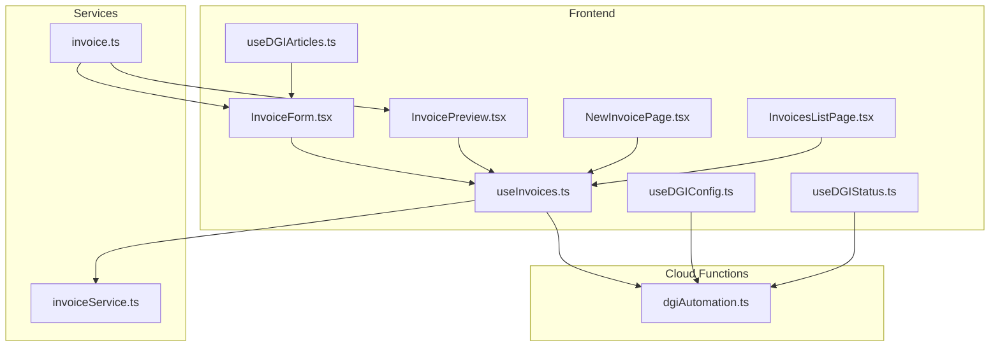
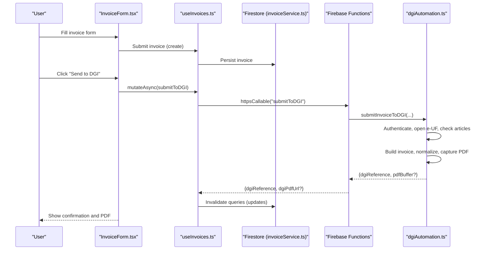
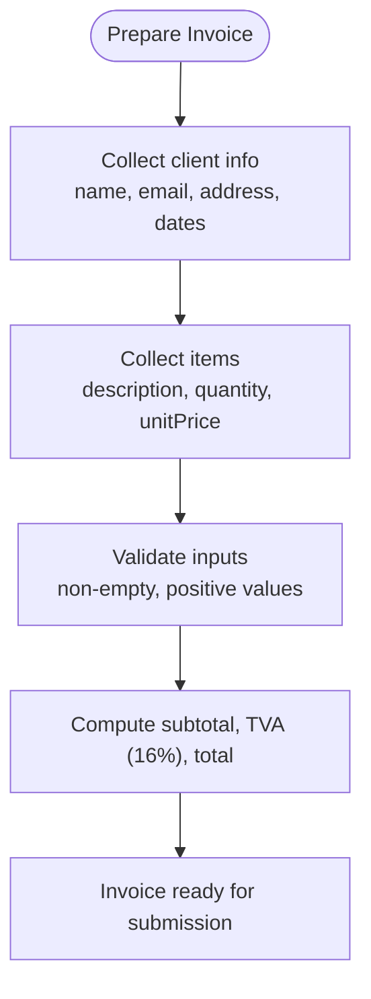
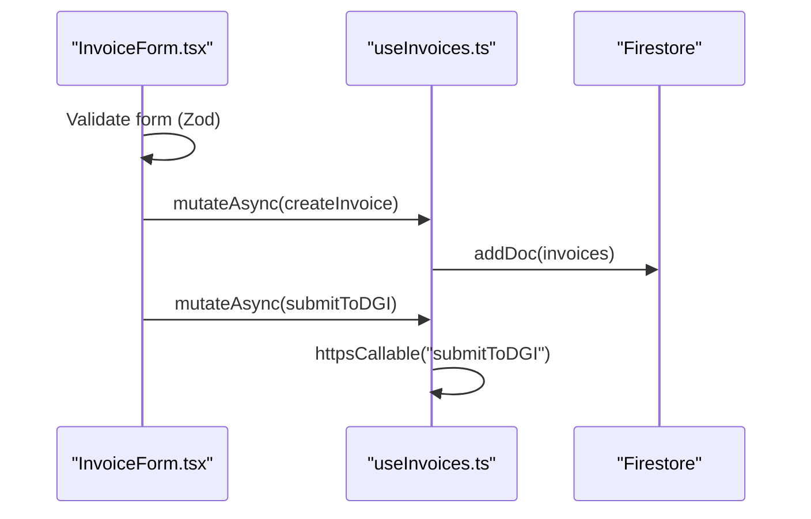
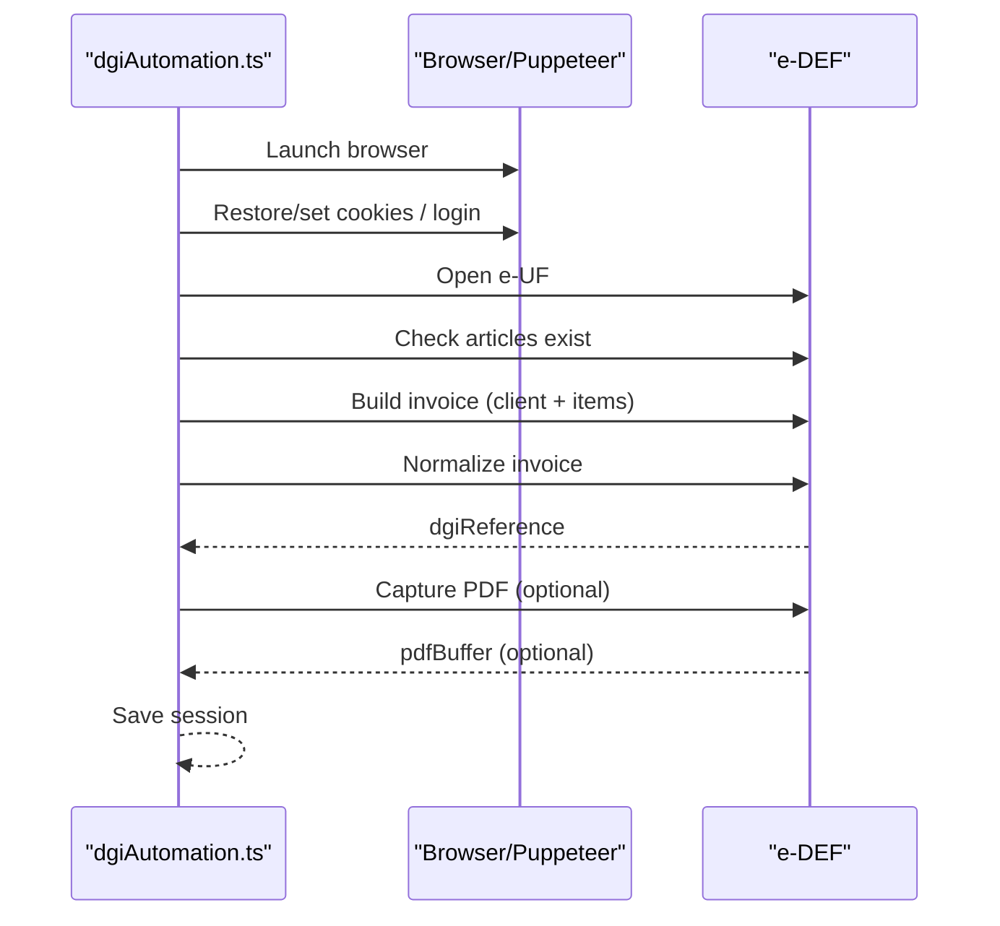
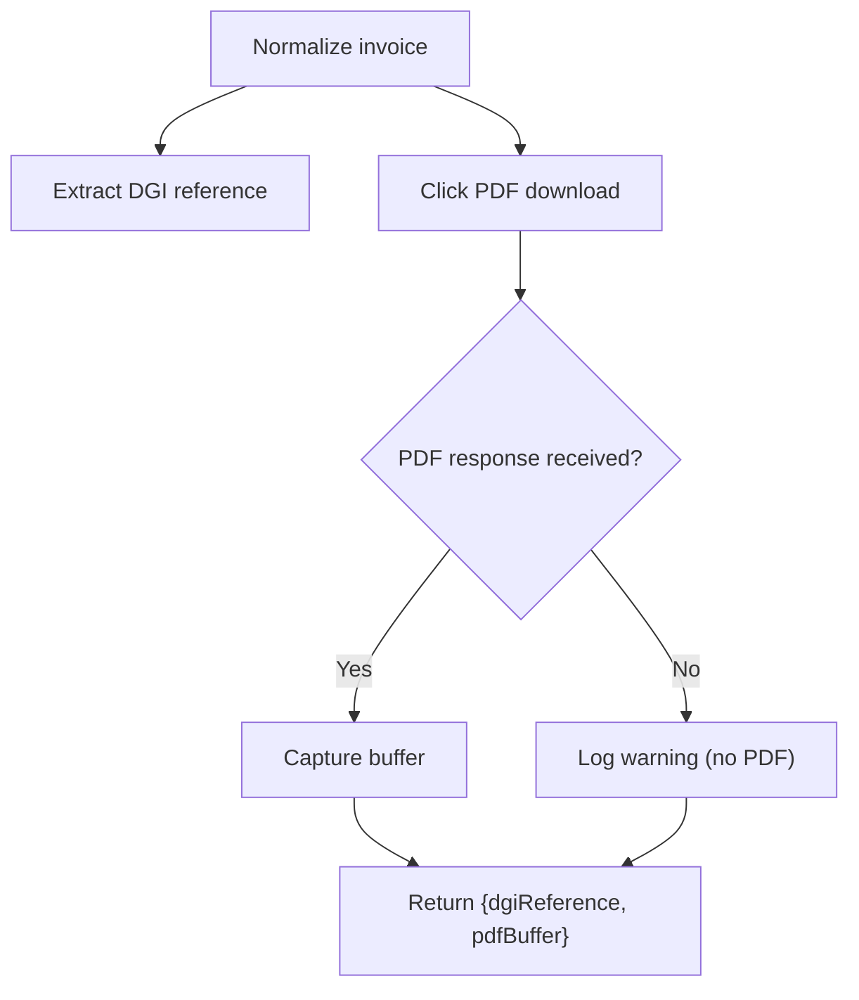
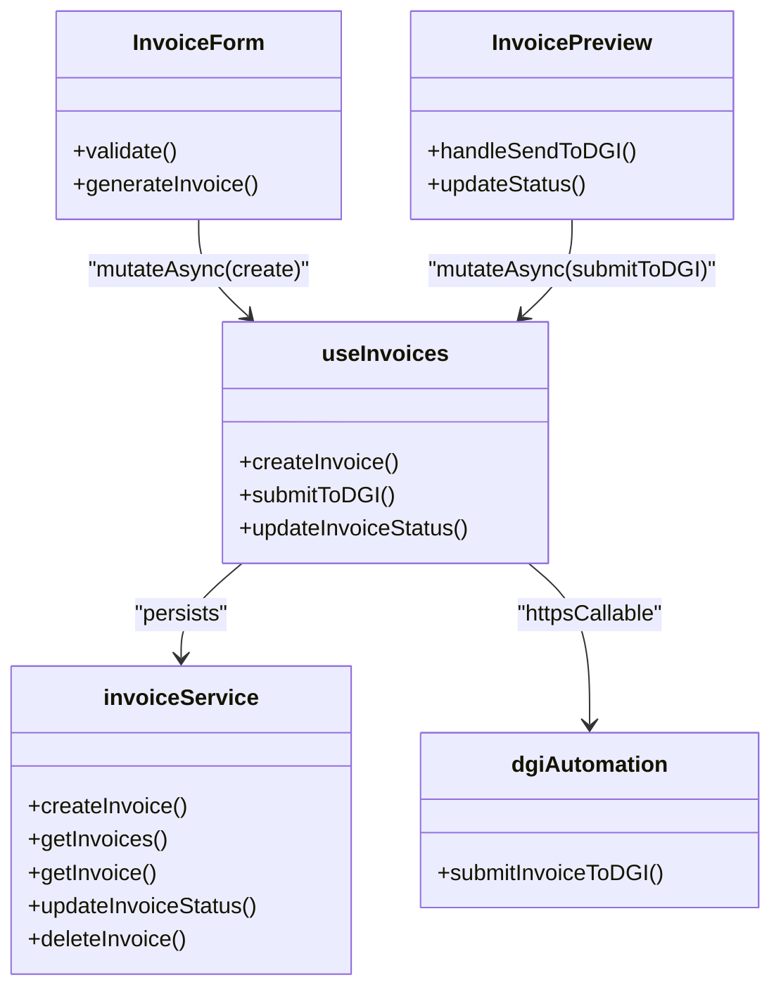
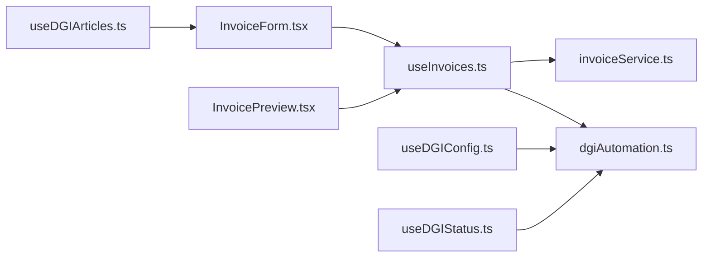

# Invoice Submission

<cite>
**Referenced Files in This Document**
- [dgiAutomation.ts](file://functions/src/dgiAutomation.ts)
- [invoiceService.ts](file://src/lib/invoiceService.ts)
- [InvoiceForm.tsx](file://src/components/InvoiceForm.tsx)
- [InvoicePreview.tsx](file://src/components/InvoicePreview.tsx)
- [NewInvoicePage.tsx](file://src/pages/NewInvoicePage.tsx)
- [InvoicesListPage.tsx](file://src/pages/InvoicesListPage.tsx)
- [useInvoices.ts](file://src/hooks/useInvoices.ts)
- [useDGIConfig.ts](file://src/hooks/useDGIConfig.ts)
- [useDGIStatus.ts](file://src/hooks/useDGIStatus.ts)
- [useDGIArticles.ts](file://src/hooks/useDGIArticles.ts)
- [invoice.ts](file://src/types/invoice.ts)
</cite>

## Table of Contents
1. [Introduction](#introduction)
2. [Project Structure](#project-structure)
3. [Core Components](#core-components)
4. [Architecture Overview](#architecture-overview)
5. [Detailed Component Analysis](#detailed-component-analysis)
6. [Dependency Analysis](#dependency-analysis)
7. [Performance Considerations](#performance-considerations)
8. [Troubleshooting Guide](#troubleshooting-guide)
9. [Conclusion](#conclusion)

## Introduction
This document explains the end-to-end invoice submission workflow to the DGI e-DEF platform. It covers invoice data preparation (client info, items, tax calculations), form automation (dynamic field population, validation, submission), reference extraction and PDF retrieval, integration with the service layer, and robust error handling. Practical examples illustrate creating invoices, automating forms, and confirming submission outcomes.

## Project Structure
The solution comprises:
- Frontend React application (user input, previews, status updates)
- Firebase integration (Firestore for persistence, Functions for cloud tasks)
- Puppeteer-based automation for DGI e-DEF (login, article checks, invoice creation, normalization, PDF capture)

**Diagram sources**
- [InvoiceForm.tsx:1-410](file://src/components/InvoiceForm.tsx#L1-L410)
- [InvoicePreview.tsx:1-347](file://src/components/InvoicePreview.tsx#L1-L347)
- [NewInvoicePage.tsx:1-45](file://src/pages/NewInvoicePage.tsx#L1-L45)
- [InvoicesListPage.tsx:1-174](file://src/pages/InvoicesListPage.tsx#L1-L174)
- [useInvoices.ts:1-90](file://src/hooks/useInvoices.ts#L1-L90)
- [useDGIConfig.ts:1-84](file://src/hooks/useDGIConfig.ts#L1-L84)
- [useDGIArticles.ts:1-107](file://src/hooks/useDGIArticles.ts#L1-L107)
- [useDGIStatus.ts:1-34](file://src/hooks/useDGIStatus.ts#L1-L34)
- [invoiceService.ts:1-58](file://src/lib/invoiceService.ts#L1-L58)
- [invoice.ts:1-39](file://src/types/invoice.ts#L1-L39)
- [dgiAutomation.ts:1-1430](file://functions/src/dgiAutomation.ts#L1-L1430)

**Section sources**
- [InvoiceForm.tsx:1-410](file://src/components/InvoiceForm.tsx#L1-L410)
- [InvoicePreview.tsx:1-347](file://src/components/InvoicePreview.tsx#L1-L347)
- [NewInvoicePage.tsx:1-45](file://src/pages/NewInvoicePage.tsx#L1-L45)
- [InvoicesListPage.tsx:1-174](file://src/pages/InvoicesListPage.tsx#L1-L174)
- [useInvoices.ts:1-90](file://src/hooks/useInvoices.ts#L1-L90)
- [useDGIConfig.ts:1-84](file://src/hooks/useDGIConfig.ts#L1-L84)
- [useDGIArticles.ts:1-107](file://src/hooks/useDGIArticles.ts#L1-L107)
- [useDGIStatus.ts:1-34](file://src/hooks/useDGIStatus.ts#L1-L34)
- [invoiceService.ts:1-58](file://src/lib/invoiceService.ts#L1-L58)
- [invoice.ts:1-39](file://src/types/invoice.ts#L1-L39)
- [dgiAutomation.ts:1-1430](file://functions/src/dgiAutomation.ts#L1-L1430)

## Core Components
- Invoice data model and tax computations
  - Defines item and invoice structures, constants, and helper functions for subtotal, TVA (16%), and total.
- Frontend form and preview
  - Collects client info, dates, and items; auto-calculates totals; supports quick-add from stored DGI articles.
- Service layer
  - Persists invoices to Firestore; exposes status updates and deletion.
- DGI automation
  - Authenticates, selects e-UF, validates articles, builds invoice, normalizes, extracts reference, captures PDF.

**Section sources**
- [invoice.ts:1-39](file://src/types/invoice.ts#L1-L39)
- [InvoiceForm.tsx:1-410](file://src/components/InvoiceForm.tsx#L1-L410)
- [InvoicePreview.tsx:1-347](file://src/components/InvoicePreview.tsx#L1-L347)
- [invoiceService.ts:1-58](file://src/lib/invoiceService.ts#L1-L58)
- [dgiAutomation.ts:1-1430](file://functions/src/dgiAutomation.ts#L1-L1430)

## Architecture Overview
The submission pipeline integrates frontend, backend services, and cloud functions:

**Diagram sources**
- [InvoiceForm.tsx:1-410](file://src/components/InvoiceForm.tsx#L1-L410)
- [InvoicePreview.tsx:1-347](file://src/components/InvoicePreview.tsx#L1-L347)
- [useInvoices.ts:60-90](file://src/hooks/useInvoices.ts#L60-L90)
- [invoiceService.ts:1-58](file://src/lib/invoiceService.ts#L1-L58)
- [dgiAutomation.ts:1404-1430](file://functions/src/dgiAutomation.ts#L1404-L1430)

## Detailed Component Analysis

### Invoice Data Preparation
- Client information
  - Name, optional email, address, issue date, due date, and notes are collected.
- Item details
  - Each item includes description, quantity, and unit price; quantities and prices are validated and normalized.
- Tax calculations
  - Subtotal, TVA (16%), and total computed locally for display and validation.

**Diagram sources**
- [InvoiceForm.tsx:122-130](file://src/components/InvoiceForm.tsx#L122-L130)
- [invoice.ts:28-38](file://src/types/invoice.ts#L28-L38)

**Section sources**
- [InvoiceForm.tsx:15-31](file://src/components/InvoiceForm.tsx#L15-L31)
- [InvoiceForm.tsx:122-130](file://src/components/InvoiceForm.tsx#L122-L130)
- [invoice.ts:28-38](file://src/types/invoice.ts#L28-L38)

### Form Automation and Validation
- Dynamic field population
  - Client info section opens and edits name; articles section adds items by description or quick-add by ID.
- Validation handling
  - Zod-based validation enforces required fields and numeric constraints; errors are surfaced to users.
- Submission workflow
  - On submit, the invoice is persisted to Firestore; later, the “Send to DGI” action triggers cloud function submission.

**Diagram sources**
- [InvoiceForm.tsx:67-78](file://src/components/InvoiceForm.tsx#L67-L78)
- [InvoiceForm.tsx:122-130](file://src/components/InvoiceForm.tsx#L122-L130)
- [useInvoices.ts:32-38](file://src/hooks/useInvoices.ts#L32-L38)
- [useInvoices.ts:60-90](file://src/hooks/useInvoices.ts#L60-L90)

**Section sources**
- [InvoiceForm.tsx:15-31](file://src/components/InvoiceForm.tsx#L15-L31)
- [InvoiceForm.tsx:67-78](file://src/components/InvoiceForm.tsx#L67-L78)
- [InvoiceForm.tsx:122-130](file://src/components/InvoiceForm.tsx#L122-L130)
- [useInvoices.ts:32-38](file://src/hooks/useInvoices.ts#L32-L38)
- [useInvoices.ts:60-90](file://src/hooks/useInvoices.ts#L60-L90)

### DGI e-DEF Submission Workflow
- Authentication and session reuse
  - Attempts to reuse saved session; falls back to login and saves cookies.
- e-UF selection
  - Reads selected e-UF from configuration and opens it.
- Article validation
  - Ensures all invoice items exist in DGI articles; aborts if missing.
- Invoice creation
  - Opens invoice builder, fills client info, adds items, sets quantities.
- Normalization and PDF capture
  - Normalizes invoice, extracts DGI reference, optionally captures PDF buffer.
- Results
  - Returns DGI reference and optional PDF URL for storage and display.

**Diagram sources**
- [dgiAutomation.ts:395-428](file://functions/src/dgiAutomation.ts#L395-L428)
- [dgiAutomation.ts:598-671](file://functions/src/dgiAutomation.ts#L598-L671)
- [dgiAutomation.ts:916-926](file://functions/src/dgiAutomation.ts#L916-L926)
- [dgiAutomation.ts:1201-1224](file://functions/src/dgiAutomation.ts#L1201-L1224)
- [dgiAutomation.ts:1334-1374](file://functions/src/dgiAutomation.ts#L1334-L1374)
- [dgiAutomation.ts:1376-1400](file://functions/src/dgiAutomation.ts#L1376-L1400)
- [dgiAutomation.ts:1404-1429](file://functions/src/dgiAutomation.ts#L1404-L1429)

**Section sources**
- [dgiAutomation.ts:395-428](file://functions/src/dgiAutomation.ts#L395-L428)
- [dgiAutomation.ts:598-671](file://functions/src/dgiAutomation.ts#L598-L671)
- [dgiAutomation.ts:916-926](file://functions/src/dgiAutomation.ts#L916-L926)
- [dgiAutomation.ts:1201-1224](file://functions/src/dgiAutomation.ts#L1201-L1224)
- [dgiAutomation.ts:1334-1374](file://functions/src/dgiAutomation.ts#L1334-L1374)
- [dgiAutomation.ts:1376-1400](file://functions/src/dgiAutomation.ts#L1376-L1400)
- [dgiAutomation.ts:1404-1429](file://functions/src/dgiAutomation.ts#L1404-L1429)

### Reference Extraction and PDF Retrieval
- Reference extraction
  - Searches for labels indicating DGI reference and parses visible text or body text to extract a reference.
- PDF capture
  - Intercepts PDF response from download action; returns buffer if captured; otherwise logs warning.
- UI presentation
  - Preview toggles between internal invoice and DGI PDF; displays reference and optional external link.

**Diagram sources**
- [dgiAutomation.ts:1334-1374](file://functions/src/dgiAutomation.ts#L1334-L1374)
- [dgiAutomation.ts:1376-1400](file://functions/src/dgiAutomation.ts#L1376-L1400)
- [InvoicePreview.tsx:120-162](file://src/components/InvoicePreview.tsx#L120-L162)

**Section sources**
- [dgiAutomation.ts:1334-1374](file://functions/src/dgiAutomation.ts#L1334-L1374)
- [dgiAutomation.ts:1376-1400](file://functions/src/dgiAutomation.ts#L1376-L1400)
- [InvoicePreview.tsx:120-162](file://src/components/InvoicePreview.tsx#L120-L162)

### Integration with Service Layer and Data Validation
- Local validation
  - Zod schemas validate client info, dates, and items before submission.
- Persistence
  - Invoices are created and updated in Firestore; status changes trigger cache invalidation.
- Cloud submission
  - Uses HTTPS callable to invoke DGI submission; on success, updates UI and invalidates queries.

**Diagram sources**
- [InvoiceForm.tsx:122-130](file://src/components/InvoiceForm.tsx#L122-L130)
- [InvoicePreview.tsx:59-77](file://src/components/InvoicePreview.tsx#L59-L77)
- [useInvoices.ts:32-38](file://src/hooks/useInvoices.ts#L32-L38)
- [useInvoices.ts:60-90](file://src/hooks/useInvoices.ts#L60-L90)
- [invoiceService.ts:19-57](file://src/lib/invoiceService.ts#L19-L57)
- [dgiAutomation.ts:1404-1429](file://functions/src/dgiAutomation.ts#L1404-L1429)

**Section sources**
- [InvoiceForm.tsx:15-31](file://src/components/InvoiceForm.tsx#L15-L31)
- [InvoiceForm.tsx:122-130](file://src/components/InvoiceForm.tsx#L122-L130)
- [InvoicePreview.tsx:59-77](file://src/components/InvoicePreview.tsx#L59-L77)
- [useInvoices.ts:32-38](file://src/hooks/useInvoices.ts#L32-L38)
- [useInvoices.ts:60-90](file://src/hooks/useInvoices.ts#L60-L90)
- [invoiceService.ts:19-57](file://src/lib/invoiceService.ts#L19-L57)
- [dgiAutomation.ts:1404-1429](file://functions/src/dgiAutomation.ts#L1404-L1429)

## Dependency Analysis
- Frontend depends on:
  - Zod for validation, React Hook Form for form state, TanStack Query for caching, Sonner for notifications.
- Backend depends on:
  - Puppeteer and Chromium for browser automation, Firestore for session and configuration storage.
- Cross-cutting concerns:
  - e-UF selection, article synchronization, and session lifecycle are coordinated via hooks and Firestore.

**Diagram sources**
- [InvoiceForm.tsx:1-410](file://src/components/InvoiceForm.tsx#L1-L410)
- [InvoicePreview.tsx:1-347](file://src/components/InvoicePreview.tsx#L1-L347)
- [useInvoices.ts:1-90](file://src/hooks/useInvoices.ts#L1-L90)
- [invoiceService.ts:1-58](file://src/lib/invoiceService.ts#L1-L58)
- [useDGIConfig.ts:1-84](file://src/hooks/useDGIConfig.ts#L1-L84)
- [useDGIArticles.ts:1-107](file://src/hooks/useDGIArticles.ts#L1-L107)
- [useDGIStatus.ts:1-34](file://src/hooks/useDGIStatus.ts#L1-L34)
- [dgiAutomation.ts:1-1430](file://functions/src/dgiAutomation.ts#L1-L1430)

**Section sources**
- [InvoiceForm.tsx:1-410](file://src/components/InvoiceForm.tsx#L1-L410)
- [InvoicePreview.tsx:1-347](file://src/components/InvoicePreview.tsx#L1-L347)
- [useInvoices.ts:1-90](file://src/hooks/useInvoices.ts#L1-L90)
- [invoiceService.ts:1-58](file://src/lib/invoiceService.ts#L1-L58)
- [useDGIConfig.ts:1-84](file://src/hooks/useDGIConfig.ts#L1-L84)
- [useDGIArticles.ts:1-107](file://src/hooks/useDGIArticles.ts#L1-L107)
- [useDGIStatus.ts:1-34](file://src/hooks/useDGIStatus.ts#L1-L34)
- [dgiAutomation.ts:1-1430](file://functions/src/dgiAutomation.ts#L1-L1430)

## Performance Considerations
- Browser startup cost
  - Launching Puppeteer and Chromium incurs overhead; reuse sessions when possible.
- Network and rendering waits
  - The automation waits for network idle and SPA rendering; tune timeouts for reliability vs. latency.
- Pagination and article scraping
  - Article lists are paginated; scraping across pages increases runtime; cache results in Firestore.
- Query invalidation
  - Use targeted invalidation to minimize re-fetches after mutations.

[No sources needed since this section provides general guidance]

## Troubleshooting Guide
Common issues and resolutions:
- Form validation errors
  - Ensure required fields are filled and numeric values are valid; errors are surfaced via form state.
- Missing articles in DGI
  - Add missing items under DGI Articles before submitting; automation checks article existence and aborts if missing.
- Network timeouts
  - Increase timeouts for slow networks; ensure stable connectivity to e-DEF.
- Submission failures
  - Review logs for login failures, missing e-UF, or article mismatches; clear session if expired.
- PDF not captured
  - Manual download using the extracted reference; UI indicates fallback messaging.

Operational tips:
- Confirm e-UF selection and session status before submission.
- Keep DGI articles synchronized with local inventory.
- Monitor cloud function logs for detailed failure reasons.

**Section sources**
- [InvoiceForm.tsx:15-31](file://src/components/InvoiceForm.tsx#L15-L31)
- [dgiAutomation.ts:916-926](file://functions/src/dgiAutomation.ts#L916-L926)
- [InvoicePreview.tsx:142-162](file://src/components/InvoicePreview.tsx#L142-L162)
- [useDGIStatus.ts:12-33](file://src/hooks/useDGIStatus.ts#L12-L33)
- [useDGIConfig.ts:21-51](file://src/hooks/useDGIConfig.ts#L21-L51)

## Conclusion
The invoice submission workflow integrates a robust frontend form with local validation, a Firestore-backed service layer, and a Puppeteer-driven DGI automation pipeline. It emphasizes correctness (article validation), resilience (session reuse, retries via manual actions), and transparency (reference extraction and PDF capture). By following the documented flows and troubleshooting steps, teams can reliably submit invoices to DGI e-DEF.