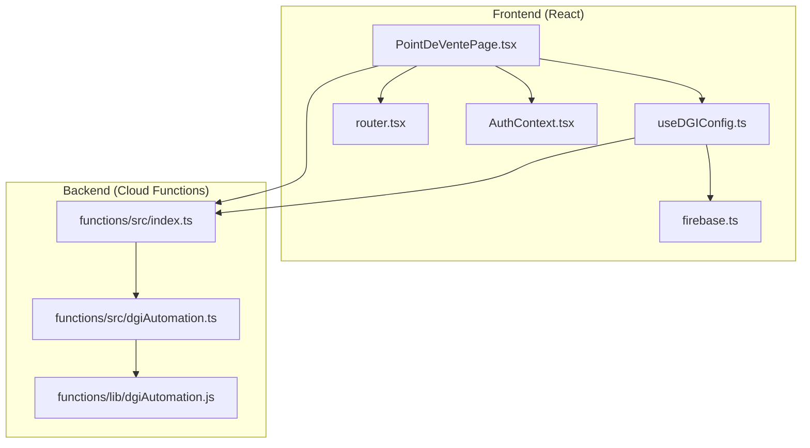
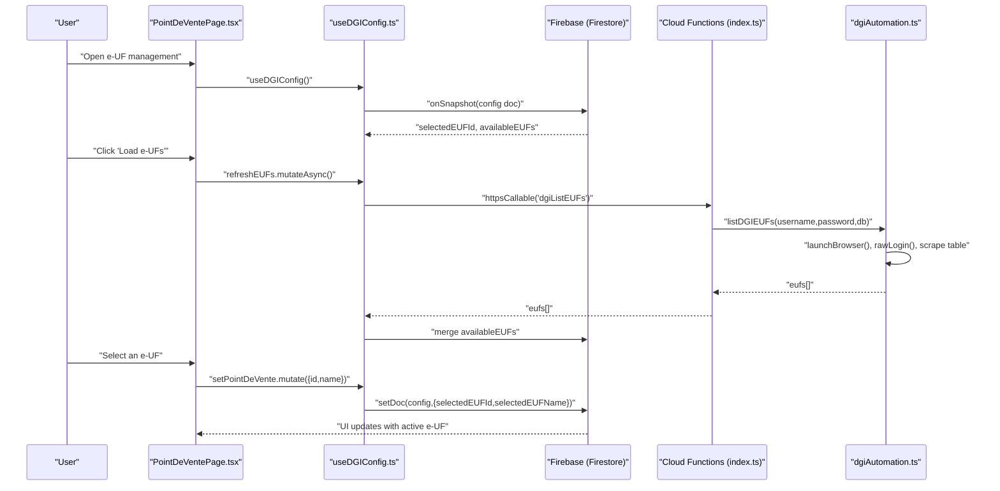
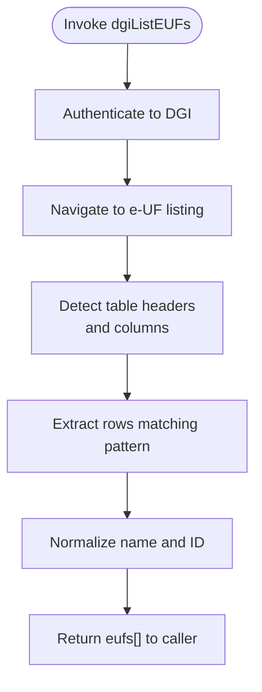
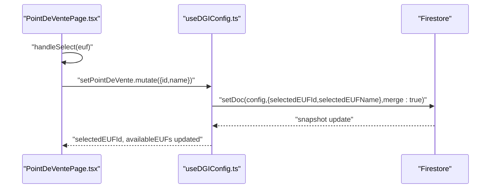
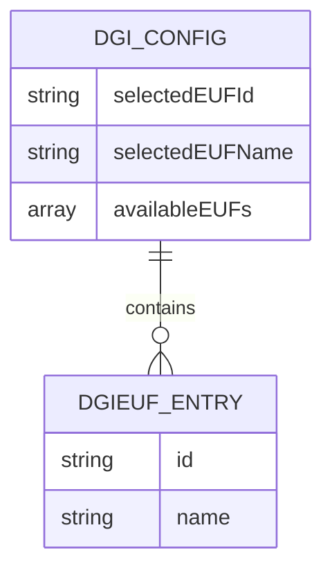
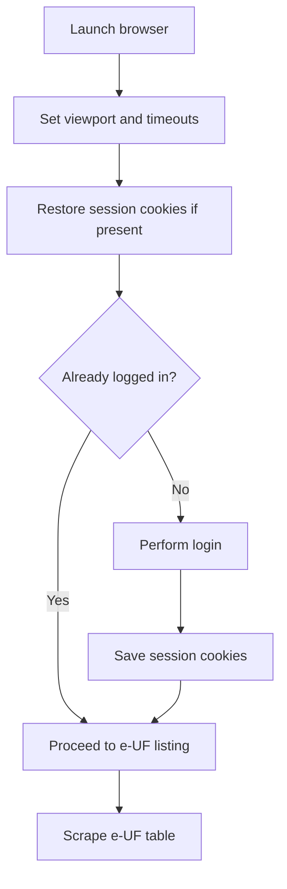
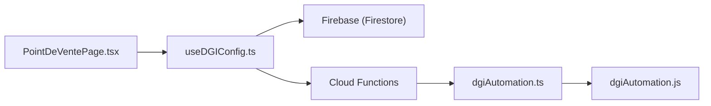

# e-UF Management

<cite>
**Referenced Files in This Document**
- [functions/src/index.ts](file://functions/src/index.ts)
- [functions/src/dgiAutomation.ts](file://functions/src/dgiAutomation.ts)
- [functions/lib/dgiAutomation.js](file://functions/lib/dgiAutomation.js)
- [src/hooks/useDGIConfig.ts](file://src/hooks/useDGIConfig.ts)
- [src/pages/PointDeVentePage.tsx](file://src/pages/PointDeVentePage.tsx)
- [src/lib/firebase.ts](file://src/lib/firebase.ts)
- [src/router.tsx](file://src/router.tsx)
- [src/contexts/AuthContext.tsx](file://src/contexts/AuthContext.tsx)
- [README.md](file://README.md)
</cite>

## Table of Contents
1. [Introduction](#introduction)
2. [Project Structure](#project-structure)
3. [Core Components](#core-components)
4. [Architecture Overview](#architecture-overview)
5. [Detailed Component Analysis](#detailed-component-analysis)
6. [Dependency Analysis](#dependency-analysis)
7. [Performance Considerations](#performance-considerations)
8. [Troubleshooting Guide](#troubleshooting-guide)
9. [Conclusion](#conclusion)
10. [Appendices](#appendices)

## Introduction
This document explains e-UF (Electronic Point of Sale) management within the DGI platform. It covers how e-UFs are discovered, listed, selected, persisted, and restored across sessions. It also documents the backend automation that scrapes e-UF data from the DGI portal, the frontend configuration and UI for managing e-UFs, and operational guidance for common issues such as lazy loading, navigation timeouts, and state synchronization.

## Project Structure
The e-UF management feature spans both client-side React components and Firebase Cloud Functions. The frontend exposes a dedicated page for e-UF management and integrates with Firestore for persistent configuration. The backend provides callable functions to log in to the DGI portal, scrape e-UF listings, and manage sessions.

**Diagram sources**
- [src/pages/PointDeVentePage.tsx:1-70](file://src/pages/PointDeVentePage.tsx#L1-L70)
- [src/hooks/useDGIConfig.ts:1-83](file://src/hooks/useDGIConfig.ts#L1-L83)
- [src/lib/firebase.ts](file://src/lib/firebase.ts)
- [src/router.tsx](file://src/router.tsx)
- [src/contexts/AuthContext.tsx](file://src/contexts/AuthContext.tsx)
- [functions/src/index.ts:42-105](file://functions/src/index.ts#L42-L105)
- [functions/src/dgiAutomation.ts:366-404](file://functions/src/dgiAutomation.ts#L366-L404)
- [functions/lib/dgiAutomation.js:31-325](file://functions/lib/dgiAutomation.js#L31-L325)

**Section sources**
- [src/pages/PointDeVentePage.tsx:1-70](file://src/pages/PointDeVentePage.tsx#L1-L70)
- [src/hooks/useDGIConfig.ts:1-83](file://src/hooks/useDGIConfig.ts#L1-L83)
- [functions/src/index.ts:42-105](file://functions/src/index.ts#L42-L105)
- [functions/src/dgiAutomation.ts:366-404](file://functions/src/dgiAutomation.ts#L366-L404)
- [functions/lib/dgiAutomation.js:31-325](file://functions/lib/dgiAutomation.js#L31-L325)

## Core Components
- Frontend e-UF configuration hook: Provides reactive access to selected e-UF ID/name and available e-UF list, with mutations to refresh, add manually, and set the active e-UF.
- Frontend e-UF management page: Renders the e-UF list, supports manual addition, and triggers selection persistence.
- Backend callable functions: Expose login/logout and e-UF listing via Firebase Callable Functions.
- Backend automation: Uses a headless browser to log in to the DGI portal, detect navigation states, and scrape e-UF entries from tables.

Key responsibilities:
- Listing e-UFs: Triggered by the frontend, executed by the backend automation, and returned to the frontend.
- Selection persistence: Writes selected e-UF ID and name into Firestore under a configuration document.
- Manual addition: Allows adding e-UFs not present in the automated listing.
- Session management: Saves/loads browser cookies to maintain authenticated state for scraping.

**Section sources**
- [src/hooks/useDGIConfig.ts:1-83](file://src/hooks/useDGIConfig.ts#L1-L83)
- [src/pages/PointDeVentePage.tsx:19-70](file://src/pages/PointDeVentePage.tsx#L19-L70)
- [functions/src/index.ts:42-105](file://functions/src/index.ts#L42-L105)
- [functions/src/dgiAutomation.ts:366-404](file://functions/src/dgiAutomation.ts#L366-L404)

## Architecture Overview
The e-UF management flow connects the UI to Firestore-backed configuration and Firebase Cloud Functions that drive browser automation against the DGI portal.

**Diagram sources**
- [src/pages/PointDeVentePage.tsx:29-68](file://src/pages/PointDeVentePage.tsx#L29-L68)
- [src/hooks/useDGIConfig.ts:21-83](file://src/hooks/useDGIConfig.ts#L21-L83)
- [functions/src/index.ts:93-105](file://functions/src/index.ts#L93-L105)
- [functions/src/dgiAutomation.ts:366-404](file://functions/src/dgiAutomation.ts#L366-L404)

## Detailed Component Analysis

### e-UF Listing and Discovery
- Frontend trigger: The e-UF listing is initiated by invoking a mutation that calls the backend callable function.
- Backend automation: The function logs in to the DGI portal, navigates to the e-UF listing page, and scrapes the table to extract e-UF IDs and names.
- Data normalization: The scraper identifies column indices dynamically and extracts the first non-empty visible name per row.
- Result delivery: The extracted e-UF entries are returned to the frontend and merged into the available list.

**Diagram sources**
- [functions/src/index.ts:93-105](file://functions/src/index.ts#L93-L105)
- [functions/src/dgiAutomation.ts:441-481](file://functions/src/dgiAutomation.ts#L441-L481)

**Section sources**
- [src/pages/PointDeVentePage.tsx:29-39](file://src/pages/PointDeVentePage.tsx#L29-L39)
- [src/hooks/useDGIConfig.ts:72-83](file://src/hooks/useDGIConfig.ts#L72-L83)
- [functions/src/index.ts:93-105](file://functions/src/index.ts#L93-L105)
- [functions/src/dgiAutomation.ts:441-481](file://functions/src/dgiAutomation.ts#L441-L481)

### e-UF Selection and Persistence
- Selection UI: The page renders available e-UFs and allows selecting one. On selection, a mutation persists the chosen e-UF ID and name to Firestore.
- Reactive state: The hook subscribes to the configuration document snapshot, exposing selectedEUFId and availableEUFs reactively.
- Manual addition: Users can add e-UFs manually; the hook prevents duplicates and merges into the available list.

**Diagram sources**
- [src/pages/PointDeVentePage.tsx:41-49](file://src/pages/PointDeVentePage.tsx#L41-L49)
- [src/hooks/useDGIConfig.ts:53-59](file://src/hooks/useDGIConfig.ts#L53-L59)
- [src/hooks/useDGIConfig.ts:29-48](file://src/hooks/useDGIConfig.ts#L29-L48)

**Section sources**
- [src/pages/PointDeVentePage.tsx:41-49](file://src/pages/PointDeVentePage.tsx#L41-L49)
- [src/hooks/useDGIConfig.ts:53-59](file://src/hooks/useDGIConfig.ts#L53-L59)
- [src/hooks/useDGIConfig.ts:29-48](file://src/hooks/useDGIConfig.ts#L29-L48)

### e-UF Configuration Model and Firestore Storage
The configuration model stores:
- selectedEUFId: Currently active e-UF identifier.
- selectedEUFName: Name associated with the active e-UF.
- availableEUFs: List of discovered and manually added e-UF entries.

Persistence:
- Snapshot subscription keeps the UI synchronized with Firestore.
- Mutations write partial updates to avoid overwriting unrelated fields.

**Diagram sources**
- [src/hooks/useDGIConfig.ts:7-17](file://src/hooks/useDGIConfig.ts#L7-L17)
- [src/hooks/useDGIConfig.ts:19](file://src/hooks/useDGIConfig.ts#L19)

**Section sources**
- [src/hooks/useDGIConfig.ts:7-17](file://src/hooks/useDGIConfig.ts#L7-L17)
- [src/hooks/useDGIConfig.ts:19](file://src/hooks/useDGIConfig.ts#L19)

### e-UF Opening Workflow and Dynamic Detection
- Browser automation: The backend launches a controlled browser, sets timeouts, and authenticates using saved cookies or login flow.
- Navigation detection: The automation checks for presence of a dashboard and absence of a password field to infer logged-in state.
- Dynamic waits: Default navigation and timeout settings are configured to accommodate SPA-like behavior and network variability.
- Session reuse: Cookies are saved after login and reused for subsequent operations to reduce repeated authentication overhead.

**Diagram sources**
- [functions/src/dgiAutomation.ts:366-404](file://functions/src/dgiAutomation.ts#L366-L404)
- [functions/lib/dgiAutomation.js:31-325](file://functions/lib/dgiAutomation.js#L31-L325)

**Section sources**
- [functions/src/dgiAutomation.ts:366-404](file://functions/src/dgiAutomation.ts#L366-L404)
- [functions/lib/dgiAutomation.js:31-325](file://functions/lib/dgiAutomation.js#L31-L325)

### e-UF Switching and Automatic Restoration
- Switching mechanism: Selecting a new e-UF updates the configuration document, which immediately reflects in the UI via snapshot listeners.
- Automatic restoration: Subsequent operations can read the stored selectedEUFId to preselect the previously active e-UF.
- Consistency: Manual additions and refreshed listings are merged into availableEUFs, ensuring continuity across sessions.

Practical example scenarios:
- Enumerate e-UFs: Call the listing function; observe the returned list in the UI.
- Validate selection: Ensure the selected e-UF exists in availableEUFs and that the snapshot updates the UI.
- Error handling for unavailable e-UFs: If an e-UF disappears from future listings, the UI remains usable by allowing manual re-addition or re-discovery.

**Section sources**
- [src/pages/PointDeVentePage.tsx:68-70](file://src/pages/PointDeVentePage.tsx#L68-L70)
- [src/hooks/useDGIConfig.ts:61-70](file://src/hooks/useDGIConfig.ts#L61-L70)
- [src/hooks/useDGIConfig.ts:29-48](file://src/hooks/useDGIConfig.ts#L29-L48)

## Dependency Analysis
The e-UF management feature depends on:
- Firebase Authentication and Firestore for configuration persistence.
- Firebase Cloud Functions for server-side automation.
- Puppeteer-based automation for DGI portal interactions.
- React Query for optimistic UI updates and mutation handling.

**Diagram sources**
- [src/pages/PointDeVentePage.tsx:19-70](file://src/pages/PointDeVentePage.tsx#L19-L70)
- [src/hooks/useDGIConfig.ts:1-83](file://src/hooks/useDGIConfig.ts#L1-L83)
- [functions/src/index.ts:42-105](file://functions/src/index.ts#L42-L105)
- [functions/src/dgiAutomation.ts:366-404](file://functions/src/dgiAutomation.ts#L366-L404)
- [functions/lib/dgiAutomation.js:31-325](file://functions/lib/dgiAutomation.js#L31-L325)

**Section sources**
- [src/pages/PointDeVentePage.tsx:19-70](file://src/pages/PointDeVentePage.tsx#L19-L70)
- [src/hooks/useDGIConfig.ts:1-83](file://src/hooks/useDGIConfig.ts#L1-L83)
- [functions/src/index.ts:42-105](file://functions/src/index.ts#L42-L105)
- [functions/src/dgiAutomation.ts:366-404](file://functions/src/dgiAutomation.ts#L366-L404)
- [functions/lib/dgiAutomation.js:31-325](file://functions/lib/dgiAutomation.js#L31-L325)

## Performance Considerations
- Timeout tuning: Default timeouts and navigation timeouts are set to balance responsiveness and reliability when interacting with the DGI portal.
- Lazy loading: The UI defers heavy operations until the user initiates listing or selection.
- Snapshot efficiency: Real-time listeners minimize redundant fetches by updating state incrementally.
- Session reuse: Reusing saved cookies avoids repeated authentication steps and reduces latency.

## Troubleshooting Guide
Common issues and resolutions:
- Lazy loading: Ensure the snapshot listener is mounted before expecting updates. Verify the configuration document exists and is readable.
- Navigation timeouts: Increase navigation and default timeouts in the automation if the DGI portal exhibits slow SPA transitions.
- State synchronization: Confirm that mutations merge fields rather than replacing the entire document to preserve unrelated settings.
- Unavailable e-UFs: If an e-UF disappears from listings, allow manual re-addition or refresh the list. Validate that the selected e-UF still exists in availableEUFs.

Operational checks:
- Verify callable function availability and permissions.
- Confirm Firestore rules permit reads/writes to the configuration document.
- Monitor automation logs for login success, cookie restoration, and table scraping outcomes.

**Section sources**
- [src/hooks/useDGIConfig.ts:29-48](file://src/hooks/useDGIConfig.ts#L29-L48)
- [functions/src/dgiAutomation.ts:366-404](file://functions/src/dgiAutomation.ts#L366-L404)
- [functions/lib/dgiAutomation.js:31-325](file://functions/lib/dgiAutomation.js#L31-L325)

## Conclusion
The e-UF management feature integrates a robust frontend configuration layer with secure backend automation to discover, list, select, and persist e-UFs. By leveraging Firestore snapshots and mutations, the system provides responsive state management and reliable restoration of the active e-UF across sessions. Proper timeout configuration and error handling ensure resilience against navigation variability and transient failures.

## Appendices
- Example paths for quick reference:
  - Listing e-UFs: [functions/src/index.ts:93-105](file://functions/src/index.ts#L93-L105)
  - Scraping e-UFs: [functions/src/dgiAutomation.ts:441-481](file://functions/src/dgiAutomation.ts#L441-L481)
  - Persisting selection: [src/hooks/useDGIConfig.ts:53-59](file://src/hooks/useDGIConfig.ts#L53-L59)
  - Manual addition: [src/hooks/useDGIConfig.ts:61-70](file://src/hooks/useDGIConfig.ts#L61-L70)
  - UI page: [src/pages/PointDeVentePage.tsx:19-70](file://src/pages/PointDeVentePage.tsx#L19-L70)