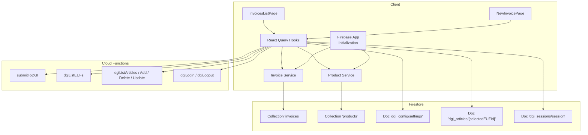
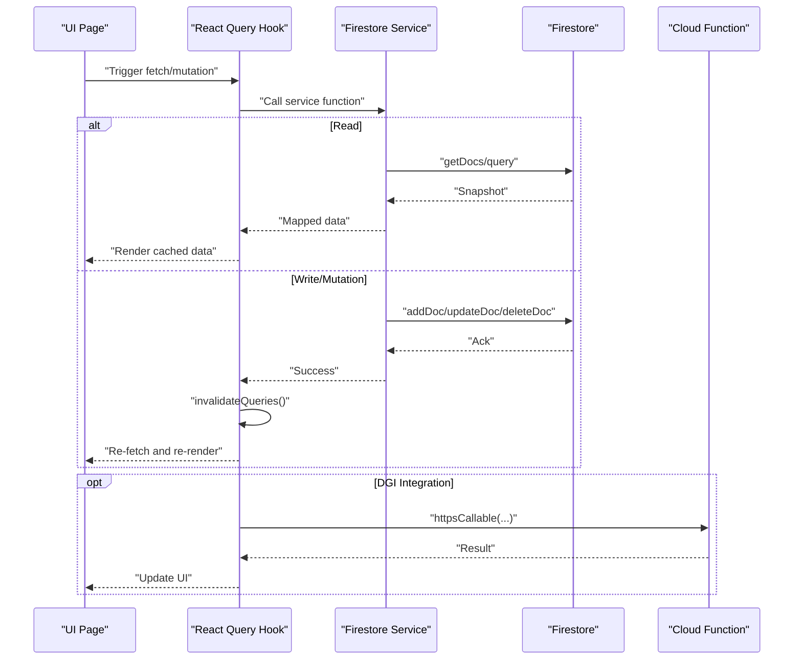
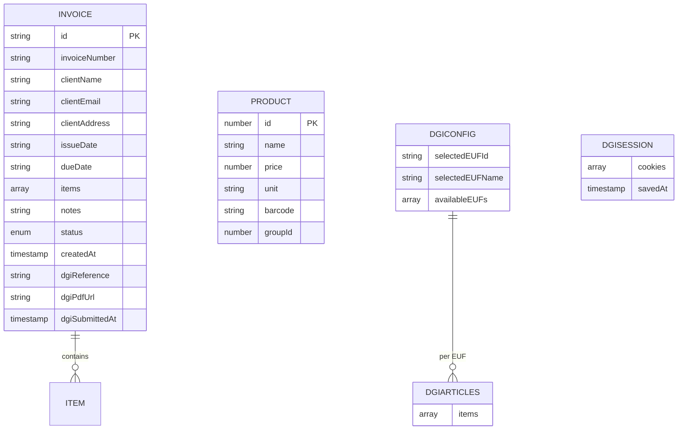
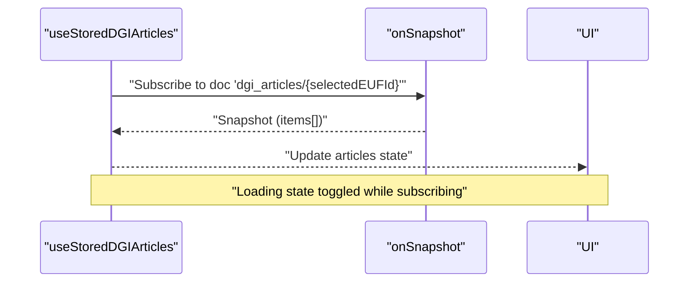
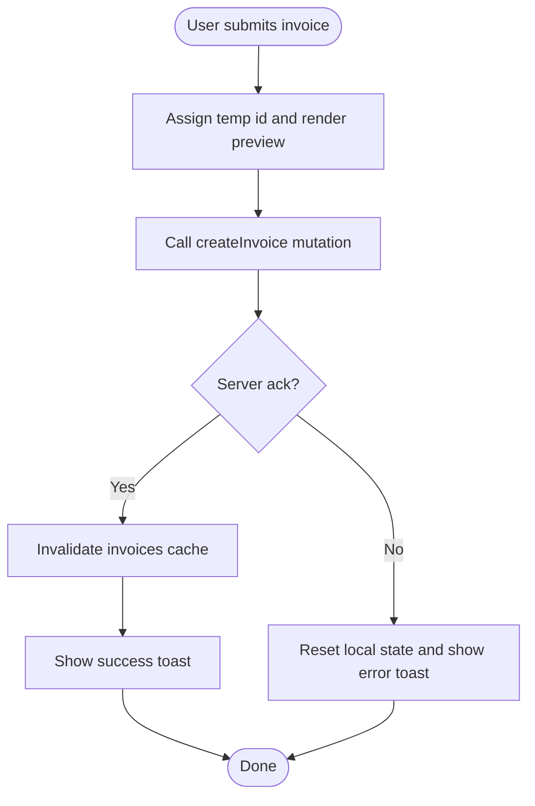
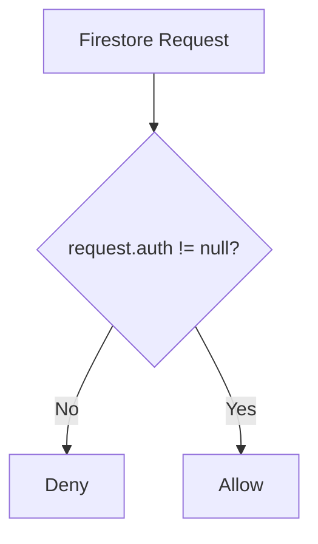
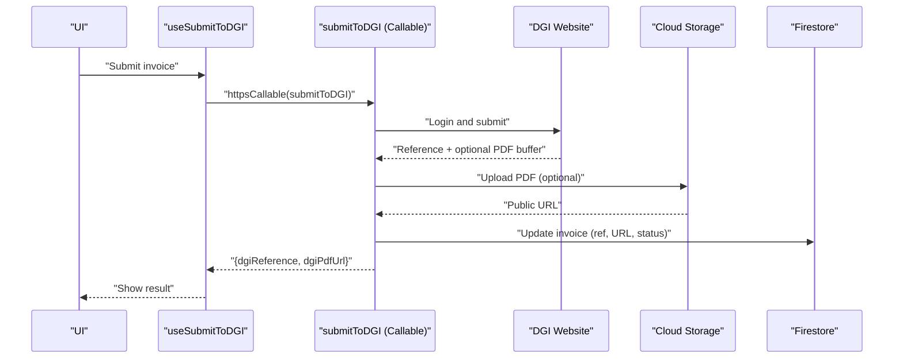
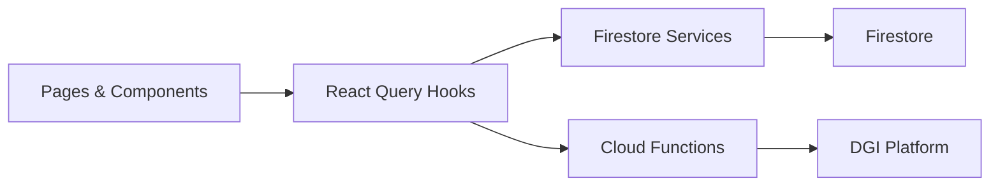

# Data Management

<cite>
**Referenced Files in This Document**
- [firebase.ts](file://src/lib/firebase.ts)
- [firestore.rules](file://firestore.rules)
- [firebase.json](file://firebase.json)
- [invoiceService.ts](file://src/lib/invoiceService.ts)
- [productService.ts](file://src/lib/productService.ts)
- [invoice.ts](file://src/types/invoice.ts)
- [useInvoices.ts](file://src/hooks/useInvoices.ts)
- [useProducts.ts](file://src/hooks/useProducts.ts)
- [NewInvoicePage.tsx](file://src/pages/NewInvoicePage.tsx)
- [InvoicesListPage.tsx](file://src/pages/InvoicesListPage.tsx)
- [useDGIArticles.ts](file://src/hooks/useDGIArticles.ts)
- [useDGIConfig.ts](file://src/hooks/useDGIConfig.ts)
- [useDGIStatus.ts](file://src/hooks/useDGIStatus.ts)
- [dgiAutomation.ts](file://functions/src/dgiAutomation.ts)
- [index.ts](file://functions/src/index.ts)
</cite>

## Table of Contents
1. [Introduction](#introduction)
2. [Project Structure](#project-structure)
3. [Core Components](#core-components)
4. [Architecture Overview](#architecture-overview)
5. [Detailed Component Analysis](#detailed-component-analysis)
6. [Dependency Analysis](#dependency-analysis)
7. [Performance Considerations](#performance-considerations)
8. [Troubleshooting Guide](#troubleshooting-guide)
9. [Conclusion](#conclusion)
10. [Appendices](#appendices)

## Introduction
This document describes ETSMEDF’s Firebase-based data architecture with a focus on Firestore schema design, real-time synchronization, caching, offline readiness, security rules, and integration patterns. It explains how invoices, products, and DGI-related data are modeled, fetched, and synchronized, and how Cloud Functions complement the client-side data layer for DGI automation. It also covers optimistic updates, error handling, batch/transaction patterns, migration/backups, and performance optimization for large datasets.

## Project Structure
The data management stack is split between the client and Cloud Functions:
- Client initialization and services: Firebase app initialization, Firestore service wrappers, React Query hooks, and UI pages.
- Security and deployment: Firestore rules and Firebase project configuration.
- Backend automation: Cloud Functions implementing DGI login, article management, and invoice submission.

**Diagram sources**
- [firebase.ts:1-23](file://src/lib/firebase.ts#L1-L23)
- [invoiceService.ts:1-58](file://src/lib/invoiceService.ts#L1-L58)
- [productService.ts:1-17](file://src/lib/productService.ts#L1-L17)
- [useInvoices.ts:1-90](file://src/hooks/useInvoices.ts#L1-L90)
- [useProducts.ts:1-19](file://src/hooks/useProducts.ts#L1-L19)
- [NewInvoicePage.tsx:1-45](file://src/pages/NewInvoicePage.tsx#L1-L45)
- [InvoicesListPage.tsx:1-174](file://src/pages/InvoicesListPage.tsx#L1-L174)
- [useDGIConfig.ts:19-58](file://src/hooks/useDGIConfig.ts#L19-L58)
- [useDGIArticles.ts:28-40](file://src/hooks/useDGIArticles.ts#L28-L40)
- [useDGIStatus.ts:16-28](file://src/hooks/useDGIStatus.ts#L16-L28)
- [index.ts:42-71](file://functions/src/index.ts#L42-L71)
- [index.ts:75-89](file://functions/src/index.ts#L75-L89)
- [index.ts:93-176](file://functions/src/index.ts#L93-L176)
- [index.ts:180-242](file://functions/src/index.ts#L180-L242)

**Section sources**
- [firebase.ts:1-23](file://src/lib/firebase.ts#L1-L23)
- [firebase.json:1-11](file://firebase.json#L1-L11)

## Core Components
- Firebase initialization and exports for Firestore and Authentication.
- Invoice service encapsulating CRUD operations against the “invoices” collection.
- Product service for product catalog retrieval.
- React Query hooks orchestrating caching, invalidation, and mutations.
- Types for invoices and calculations.
- DGI-related hooks for real-time configuration, article lists, and session status.
- Cloud Functions for DGI login/logout, EUF listing, article management, and invoice submission.

**Section sources**
- [firebase.ts:1-23](file://src/lib/firebase.ts#L1-L23)
- [invoiceService.ts:1-58](file://src/lib/invoiceService.ts#L1-L58)
- [productService.ts:1-17](file://src/lib/productService.ts#L1-L17)
- [useInvoices.ts:1-90](file://src/hooks/useInvoices.ts#L1-L90)
- [useProducts.ts:1-19](file://src/hooks/useProducts.ts#L1-L19)
- [invoice.ts:1-39](file://src/types/invoice.ts#L1-L39)
- [useDGIConfig.ts:19-58](file://src/hooks/useDGIConfig.ts#L19-L58)
- [useDGIArticles.ts:28-40](file://src/hooks/useDGIArticles.ts#L28-L40)
- [useDGIStatus.ts:16-28](file://src/hooks/useDGIStatus.ts#L16-L28)
- [index.ts:42-71](file://functions/src/index.ts#L42-L71)
- [index.ts:75-89](file://functions/src/index.ts#L75-L89)
- [index.ts:93-176](file://functions/src/index.ts#L93-L176)
- [index.ts:180-242](file://functions/src/index.ts#L180-L242)

## Architecture Overview
The system follows a reactive, client-driven architecture:
- Client uses React Query to cache and invalidate data.
- Real-time updates are achieved via onSnapshot listeners for DGI configuration, articles, and session documents.
- Cloud Functions expose HTTPS callable endpoints for DGI operations and invoice submission.
- Firestore rules enforce authentication-based access.

**Diagram sources**
- [useInvoices.ts:17-58](file://src/hooks/useInvoices.ts#L17-L58)
- [invoiceService.ts:19-57](file://src/lib/invoiceService.ts#L19-L57)
- [useDGIArticles.ts:50-86](file://src/hooks/useDGIArticles.ts#L50-L86)
- [index.ts:180-242](file://functions/src/index.ts#L180-L242)

## Detailed Component Analysis

### Firestore Schema Design and Collections
- invoices: Stores invoice documents with computed totals and DGI metadata.
- products: Stores product catalog entries.
- dgi_config/settings: Stores selected EUF and available EUFs list.
- dgi_articles/{selectedEUFId}: Stores article list snapshot per selected EUF.
- dgi_sessions/session: Stores DGI session cookies and timestamps.

**Diagram sources**
- [invoice.ts:1-39](file://src/types/invoice.ts#L1-L39)
- [productService.ts:4-11](file://src/lib/productService.ts#L4-L11)
- [useDGIConfig.ts:12-17](file://src/hooks/useDGIConfig.ts#L12-L17)
- [useDGIArticles.ts:8-12](file://src/hooks/useDGIArticles.ts#L8-L12)
- [useDGIStatus.ts:7-10](file://src/hooks/useDGIStatus.ts#L7-L10)

**Section sources**
- [invoiceService.ts:17-57](file://src/lib/invoiceService.ts#L17-L57)
- [productService.ts:13-16](file://src/lib/productService.ts#L13-L16)
- [useDGIConfig.ts:19-58](file://src/hooks/useDGIConfig.ts#L19-L58)
- [useDGIArticles.ts:28-40](file://src/hooks/useDGIArticles.ts#L28-L40)
- [useDGIStatus.ts:16-28](file://src/hooks/useDGIStatus.ts#L16-L28)

### Real-Time Synchronization with React Query
- useInvoices and useInvoice wrap queries with automatic caching and invalidation.
- useProducts caches product list with a short stale time.
- useStoredDGIArticles subscribes to a specific article document for live updates.
- useDGIConfig subscribes to configuration doc for real-time EUF selection and availability.
- useDGIStatus subscribes to session doc for connection state.

**Diagram sources**
- [useDGIArticles.ts:28-40](file://src/hooks/useDGIArticles.ts#L28-L40)
- [useDGIConfig.ts:29-48](file://src/hooks/useDGIConfig.ts#L29-L48)
- [useDGIStatus.ts:16-28](file://src/hooks/useDGIStatus.ts#L16-L28)

**Section sources**
- [useInvoices.ts:17-30](file://src/hooks/useInvoices.ts#L17-L30)
- [useProducts.ts:5-11](file://src/hooks/useProducts.ts#L5-L11)
- [useDGIArticles.ts:16-40](file://src/hooks/useDGIArticles.ts#L16-L40)
- [useDGIConfig.ts:21-51](file://src/hooks/useDGIConfig.ts#L21-L51)
- [useDGIStatus.ts:12-33](file://src/hooks/useDGIStatus.ts#L12-L33)

### Caching Strategies and Offline Functionality
- React Query manages caching and invalidation keys for invoices and products.
- Stale times are configured for product lists to balance freshness and performance.
- Firestore SDK supports offline persistence by default; enable it via SDK configuration if needed.
- For DGI session cookies stored in Firestore, offline reads rely on cached snapshots; mutations require connectivity.

Practical tips:
- Use queryKey-based invalidation to keep views consistent after writes.
- Consider setting a reasonable staleTime for frequently accessed static data (e.g., products).
- For offline-first UX, surface cached data immediately and reconcile changes when online.

**Section sources**
- [useProducts.ts:9](file://src/hooks/useProducts.ts#L9)
- [useInvoices.ts:36](file://src/hooks/useInvoices.ts#L36)
- [useDGIArticles.ts:59-62](file://src/hooks/useDGIArticles.ts#L59-L62)

### Optimistic Updates and Error Handling
- Optimistic UI pattern: set generated invoice ID locally after mutation starts, then show success; if backend fails, surface a user-friendly error.
- Error surfaces via toast notifications; loading and error states are handled in list and creation pages.
- Mutations invalidate relevant query keys to align cache with server state.

**Diagram sources**
- [NewInvoicePage.tsx:13-22](file://src/pages/NewInvoicePage.tsx#L13-L22)
- [useInvoices.ts:32-38](file://src/hooks/useInvoices.ts#L32-L38)

**Section sources**
- [NewInvoicePage.tsx:13-22](file://src/pages/NewInvoicePage.tsx#L13-L22)
- [InvoicesListPage.tsx:32-41](file://src/pages/InvoicesListPage.tsx#L32-L41)
- [useInvoices.ts:32-58](file://src/hooks/useInvoices.ts#L32-L58)

### Security Rules and Access Controls
- Current rules: require authentication for all reads/writes.
- Recommended enhancements for production:
  - Scope access by user UID.
  - Separate collections for tenant isolation.
  - Add field-level validation rules.
  - Restrict sensitive fields (e.g., DGI session cookies) to admin roles.

**Diagram sources**
- [firestore.rules:4-6](file://firestore.rules#L4-L6)

**Section sources**
- [firestore.rules:1-9](file://firestore.rules#L1-L9)
- [firebase.json:7-9](file://firebase.json#L7-L9)

### Integration Between Local State and Firestore
- React Query manages cache lifecycle; mutations trigger invalidations to synchronize UI with Firestore.
- Batch operations and transactions:
  - Use Firestore transactions for atomic reads-modifies-writes across documents.
  - Use writeBatch for multiple disjoint writes within a single operation.
- Example patterns:
  - Status change: invalidate both global and detail queries.
  - Deletion: invalidate global list; optionally remove from local cache if desired.

**Section sources**
- [useInvoices.ts:36](file://src/hooks/useInvoices.ts#L36)
- [useInvoices.ts:46](file://src/hooks/useInvoices.ts#L46)
- [useInvoices.ts:56](file://src/hooks/useInvoices.ts#L56)

### DGI Automation and Cloud Functions
- Functions implement DGI login/logout, EUF listing, article CRUD, and invoice submission.
- submitToDGI uploads PDF to Cloud Storage and updates invoice document with DGI metadata.
- Secrets are managed via Firebase Functions parameters.

**Diagram sources**
- [useInvoices.ts:60-89](file://src/hooks/useInvoices.ts#L60-L89)
- [index.ts:180-242](file://functions/src/index.ts#L180-L242)
- [dgiAutomation.ts:45-52](file://functions/src/dgiAutomation.ts#L45-L52)

**Section sources**
- [index.ts:42-71](file://functions/src/index.ts#L42-L71)
- [index.ts:75-89](file://functions/src/index.ts#L75-L89)
- [index.ts:93-176](file://functions/src/index.ts#L93-L176)
- [index.ts:180-242](file://functions/src/index.ts#L180-L242)
- [dgiAutomation.ts:45-52](file://functions/src/dgiAutomation.ts#L45-L52)

### Data Fetching Patterns
- Queries: useQuery with stable query keys for invoices and products.
- Details: useQuery with enabled flag to avoid unnecessary fetches.
- Mutations: useMutation with onSuccess to invalidate dependent queries.

**Section sources**
- [useInvoices.ts:17-30](file://src/hooks/useInvoices.ts#L17-L30)
- [useInvoices.ts:24-29](file://src/hooks/useInvoices.ts#L24-L29)
- [useProducts.ts:5-11](file://src/hooks/useProducts.ts#L5-L11)

### Transactions and Batch Operations
- Use transactions for:
  - Updating invoice status and related counters or logs atomically.
  - Cross-document consistency checks.
- Use writeBatch for:
  - Bulk inserts/updates of product catalogs.
  - Multi-collection writes that do not require atomicity across documents.

[No sources needed since this section provides general guidance]

### Migration and Backup Strategies
- Migrations:
  - Use Cloud Functions to transform documents on read or write.
  - Maintain a schema version field and migrate incrementally.
- Backups:
  - Enable Firestore Online Backups for point-in-time recovery.
  - Periodically export collections to BigQuery or Cloud Storage for analytics and archival.

[No sources needed since this section provides general guidance]

## Dependency Analysis
- Client depends on Firebase SDK and React Query for data access.
- Services depend on Firestore SDK for operations.
- Hooks orchestrate cache and side effects.
- Cloud Functions depend on Firebase Admin and external Puppeteer/Chromium for DGI automation.

**Diagram sources**
- [useInvoices.ts:1-90](file://src/hooks/useInvoices.ts#L1-L90)
- [invoiceService.ts:1-58](file://src/lib/invoiceService.ts#L1-L58)
- [index.ts:1-243](file://functions/src/index.ts#L1-L243)

**Section sources**
- [useInvoices.ts:1-90](file://src/hooks/useInvoices.ts#L1-L90)
- [invoiceService.ts:1-58](file://src/lib/invoiceService.ts#L1-L58)
- [index.ts:1-243](file://functions/src/index.ts#L1-L243)

## Performance Considerations
- Use orderBy and indexed fields for large invoice lists.
- Paginate queries or implement cursor-based pagination.
- Prefer denormalized totals (as in invoice types) to avoid per-render computations.
- Cache frequently accessed static data (products) with appropriate staleTime.
- Minimize real-time subscriptions to only necessary documents.

[No sources needed since this section provides general guidance]

## Troubleshooting Guide
- Firebase initialization and environment variables:
  - Verify environment variables for API keys and project identifiers.
- Authentication errors:
  - Ensure users are authenticated; Firestore rules deny unauthenticated access.
- Network and offline:
  - Confirm Firestore persistence is enabled if offline behavior is expected.
- DGI automation:
  - Check function logs for login failures, missing credentials, or network timeouts.
  - Validate EUF selection and session cookie restoration.

**Section sources**
- [firebase.ts:6-14](file://src/lib/firebase.ts#L6-L14)
- [firestore.rules:4-6](file://firestore.rules#L4-L6)
- [index.ts:31-38](file://functions/src/index.ts#L31-L38)

## Conclusion
ETSMEDF’s data architecture leverages Firestore for structured data, React Query for robust caching and real-time updates, and Cloud Functions for DGI automation. Security is enforced via authentication-based rules, and the system supports optimistic UI patterns with proper error handling. For production hardening, consider scoped access, field-level validation, and tenant isolation. Performance and reliability can be further improved with targeted indexing, batching, and backups.

## Appendices
- Practical examples:
  - Creating an invoice: [NewInvoicePage.tsx:13-22](file://src/pages/NewInvoicePage.tsx#L13-L22)
  - Listing invoices: [InvoicesListPage.tsx:28](file://src/pages/InvoicesListPage.tsx#L28)
  - Submitting to DGI: [useInvoices.ts:60-89](file://src/hooks/useInvoices.ts#L60-L89)
  - Live DGI articles: [useDGIArticles.ts:28-40](file://src/hooks/useDGIArticles.ts#L28-L40)
  - DGI session status: [useDGIStatus.ts:16-28](file://src/hooks/useDGIStatus.ts#L16-L28)