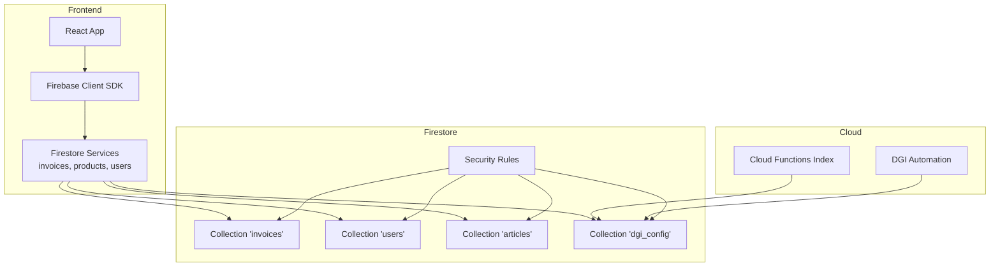
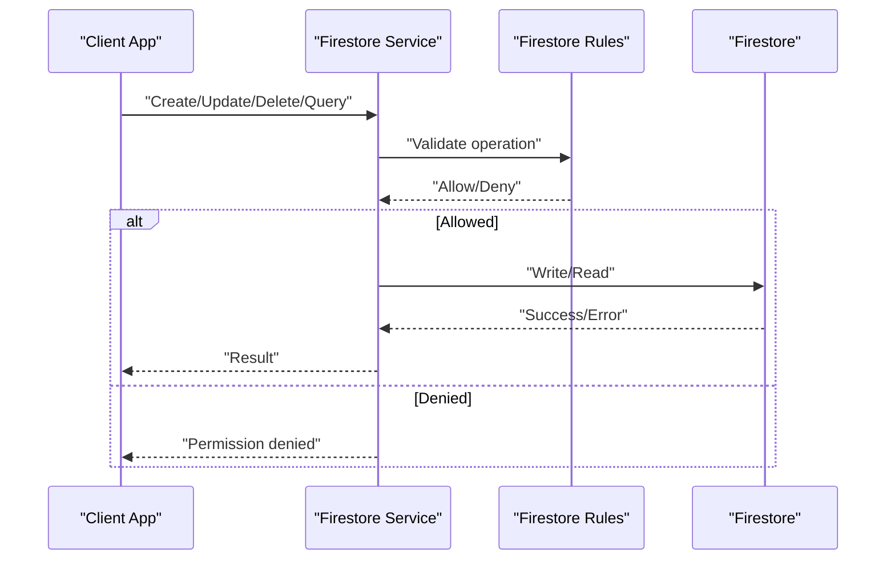
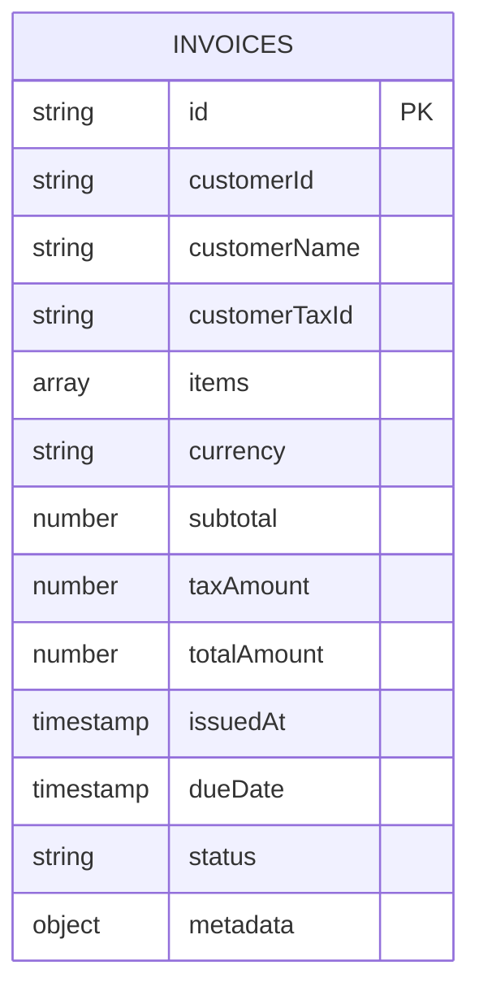
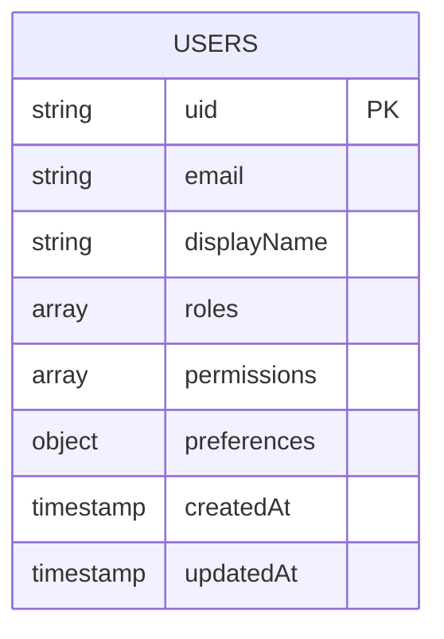
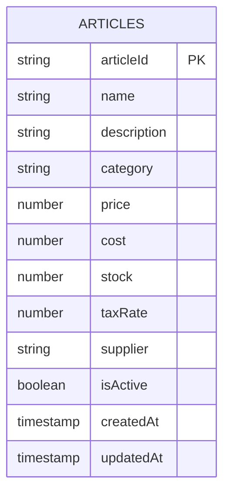
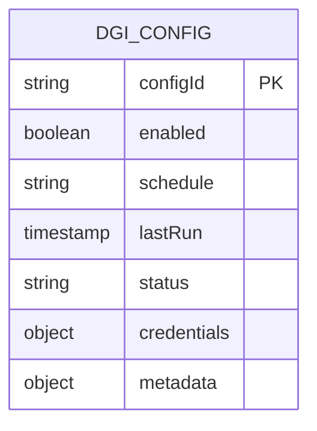
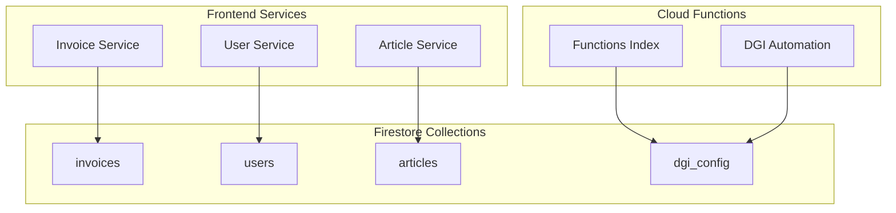

# Database Schema & Collections

<cite>
**Referenced Files in This Document**
- [firebase.ts](file://src/lib/firebase.ts)
- [invoice.ts](file://src/types/invoice.ts)
- [index.ts](file://functions/src/index.ts)
- [dgiAutomation.ts](file://functions/src/dgiAutomation.ts)
- [firestore.rules](file://firestore.rules)
- [firebase.json](file://firebase.json)
</cite>

## Table of Contents
1. [Introduction](#introduction)
2. [Project Structure](#project-structure)
3. [Core Components](#core-components)
4. [Architecture Overview](#architecture-overview)
5. [Detailed Component Analysis](#detailed-component-analysis)
6. [Dependency Analysis](#dependency-analysis)
7. [Performance Considerations](#performance-considerations)
8. [Troubleshooting Guide](#troubleshooting-guide)
9. [Conclusion](#conclusion)
10. [Appendices](#appendices)

## Introduction
This document provides comprehensive database schema documentation for ETSMEDF’s Firestore collections. It focuses on the structure of invoices, users, articles, and DGI configurations, detailing field definitions, data types, required versus optional fields, and validation rules. It also explains collection relationships, indexing strategies, query patterns, and schema evolution/migration approaches used in the application. Practical examples of document structures and constraints are included to guide development and maintenance while preserving backward compatibility.

## Project Structure
The database schema is primarily defined by:
- Firestore security rules that govern access and validation
- Frontend service integrations that construct and persist documents
- Cloud Functions that automate DGI-related tasks and maintain configuration documents
- Firebase project configuration that defines database location and build targets

**Diagram sources**
- [firebase.ts](file://src/lib/firebase.ts)
- [firestore.rules](file://firestore.rules)
- [firebase.json](file://firebase.json)

**Section sources**
- [firebase.ts](file://src/lib/firebase.ts)
- [firestore.rules](file://firestore.rules)
- [firebase.json](file://firebase.json)

## Core Components
This section outlines the primary Firestore collections and their roles in the application.

- Invoices Collection
  - Purpose: Stores invoice records generated by the application.
  - Typical fields: identifiers, customer info, items, totals, timestamps, status, and metadata.
  - Access pattern: CRUD operations via frontend services; queries by date range, status, and customer.

- Users Collection
  - Purpose: Stores user profiles and authentication-related attributes.
  - Typical fields: uid, email, displayName, roles, permissions, and preferences.
  - Access pattern: Read/write by authenticated users; admin queries for reporting.

- Articles Collection
  - Purpose: Stores product/article catalog entries.
  - Typical fields: articleId, name, description, price, category, stock, taxRate, and supplier.
  - Access pattern: Lookup by articleId; paginated lists; filters by category and availability.

- DGI Configurations Collection
  - Purpose: Stores DGI automation configuration and state.
  - Typical fields: configId, enabled, lastRun, schedule, credentials, and status.
  - Access pattern: Admin-only updates; periodic reads by Cloud Functions.

**Section sources**
- [invoice.ts](file://src/types/invoice.ts)
- [firebase.ts](file://src/lib/firebase.ts)
- [dgiAutomation.ts](file://functions/src/dgiAutomation.ts)

## Architecture Overview
The database architecture centers around Firestore collections accessed through:
- Frontend services that encapsulate CRUD and query logic
- Security rules enforcing field-level validation and access control
- Cloud Functions orchestrating DGI automation and maintaining configuration documents

**Diagram sources**
- [firestore.rules](file://firestore.rules)
- [firebase.ts](file://src/lib/firebase.ts)

## Detailed Component Analysis

### Invoices Collection
- Purpose: Persist invoice records with associated items and totals.
- Typical Fields and Types:
  - id: string (document ID)
  - customerId: string
  - customerName: string
  - customerTaxId: string
  - items: array of objects (articleId, quantity, unitPrice, total)
  - currency: string
  - subtotal: number
  - taxAmount: number
  - totalAmount: number
  - issuedAt: timestamp
  - dueDate: timestamp
  - status: enum-like string (draft, sent, paid, canceled)
  - metadata: object (creator, source, notes)
- Required vs Optional:
  - Required: customerId, customerName, items, currency, subtotal, taxAmount, totalAmount, issuedAt, dueDate, status
  - Optional: customerTaxId, metadata
- Validation Rules:
  - Non-negative amounts; positive quantities; valid date ordering (issuedAt ≤ dueDate); valid status values; items integrity checks
- Indexing Strategies:
  - Composite indexes for frequent queries: (status, issuedAt), (customerId, issuedAt), (customerTaxId, issuedAt)
- Query Patterns:
  - List invoices by status and date range
  - Retrieve invoices by customer identifier
  - Filter by total amount ranges
- Sample Document Structure:
  - id: "INV-2025-001"
  - customerId: "CUST-123"
  - customerName: "Example Customer"
  - customerTaxId: "TAX-456"
  - items: [{ articleId: "ART-001", quantity: 2, unitPrice: 100, total: 200 }, ...]
  - currency: "XOF"
  - subtotal: 200
  - taxAmount: 40
  - totalAmount: 240
  - issuedAt: "2025-01-15T10:00:00Z"
  - dueDate: "2025-02-15T10:00:00Z"
  - status: "sent"
  - metadata: { creator: "user@example.com", source: "web" }

**Diagram sources**
- [invoice.ts](file://src/types/invoice.ts)

**Section sources**
- [invoice.ts](file://src/types/invoice.ts)
- [firebase.ts](file://src/lib/firebase.ts)
- [firestore.rules](file://firestore.rules)

### Users Collection
- Purpose: Store user profiles and authentication-related attributes.
- Typical Fields and Types:
  - uid: string (document ID)
  - email: string
  - displayName: string
  - roles: array of strings
  - permissions: array of strings
  - preferences: object
  - createdAt: timestamp
  - updatedAt: timestamp
- Required vs Optional:
  - Required: uid, email
  - Optional: displayName, roles, permissions, preferences, updatedAt
- Validation Rules:
  - Unique email; valid role/permission enums; non-empty displayName acceptable
- Indexing Strategies:
  - Single-field index on email
  - Composite index on (roles, createdAt) for admin queries
- Query Patterns:
  - Fetch user by uid
  - List users by role
  - Paginate users with createdAt sorting
- Sample Document Structure:
  - uid: "UID-789"
  - email: "admin@example.com"
  - displayName: "Admin User"
  - roles: ["admin"]
  - permissions: ["read:invoices", "write:invoices"]
  - preferences: {}
  - createdAt: "2024-01-01T00:00:00Z"
  - updatedAt: "2025-01-01T00:00:00Z"

**Diagram sources**
- [firebase.ts](file://src/lib/firebase.ts)

**Section sources**
- [firebase.ts](file://src/lib/firebase.ts)
- [firestore.rules](file://firestore.rules)

### Articles Collection
- Purpose: Maintain product/article catalog entries.
- Typical Fields and Types:
  - articleId: string (document ID)
  - name: string
  - description: string
  - category: string
  - price: number
  - cost: number
  - stock: number
  - taxRate: number
  - supplier: string
  - isActive: boolean
  - createdAt: timestamp
  - updatedAt: timestamp
- Required vs Optional:
  - Required: articleId, name, price, taxRate
  - Optional: description, category, cost, stock, supplier, isActive
- Validation Rules:
  - Non-negative price, cost, stock, taxRate; valid category values; boolean flags
- Indexing Strategies:
  - Single-field indexes on category, supplier
  - Composite indexes on (category, price), (supplier, createdAt)
- Query Patterns:
  - Search by category
  - Filter by price range
  - Find active items
- Sample Document Structure:
  - articleId: "ART-001"
  - name: "Product Alpha"
  - description: "Description of Product Alpha"
  - category: "Electronics"
  - price: 1000
  - cost: 700
  - stock: 50
  - taxRate: 0.18
  - supplier: "SUP-001"
  - isActive: true
  - createdAt: "2024-01-01T00:00:00Z"
  - updatedAt: "2025-01-01T00:00:00Z"

**Diagram sources**
- [firebase.ts](file://src/lib/firebase.ts)

**Section sources**
- [firebase.ts](file://src/lib/firebase.ts)
- [firestore.rules](file://firestore.rules)

### DGI Configurations Collection
- Purpose: Store DGI automation configuration and operational state.
- Typical Fields and Types:
  - configId: string (document ID)
  - enabled: boolean
  - schedule: string
  - lastRun: timestamp
  - status: string
  - credentials: object
  - metadata: object
- Required vs Optional:
  - Required: configId, enabled, schedule
  - Optional: lastRun, status, credentials, metadata
- Validation Rules:
  - Boolean flag; valid cron-like schedule string; timestamp monotonicity
- Indexing Strategies:
  - Single-field index on enabled
  - Composite index on (enabled, lastRun) for scheduling
- Query Patterns:
  - Fetch enabled configs
  - Find stale configurations (lastRun older than threshold)
- Sample Document Structure:
  - configId: "DGI-CONFIG-001"
  - enabled: true
  - schedule: "0 0 * * *"
  - lastRun: "2025-01-15T00:00:00Z"
  - status: "success"
  - credentials: { apiKey: "[REDACTED]" }
  - metadata: { version: "1.0" }

**Diagram sources**
- [dgiAutomation.ts](file://functions/src/dgiAutomation.ts)

**Section sources**
- [dgiAutomation.ts](file://functions/src/dgiAutomation.ts)
- [firestore.rules](file://firestore.rules)

## Dependency Analysis
The following diagram illustrates how frontend services depend on Firestore collections and how Cloud Functions interact with DGI configuration documents.

**Diagram sources**
- [firebase.ts](file://src/lib/firebase.ts)
- [index.ts](file://functions/src/index.ts)
- [dgiAutomation.ts](file://functions/src/dgiAutomation.ts)

**Section sources**
- [firebase.ts](file://src/lib/firebase.ts)
- [index.ts](file://functions/src/index.ts)
- [dgiAutomation.ts](file://functions/src/dgiAutomation.ts)

## Performance Considerations
- Indexing
  - Create composite indexes for frequent filter/sort combinations to avoid “unindexed” query errors and reduce latency.
  - Monitor index usage and remove unused indexes to minimize write amplification.
- Reads vs Writes
  - Denormalize commonly accessed fields (e.g., customerName in invoices) to reduce joins and improve read performance.
  - Normalize shared entities (e.g., articles) to reduce duplication and maintain consistency.
- Query Patterns
  - Prefer equality filters on indexed fields; limit result sets with pagination.
  - Use orderBy alongside where filters to leverage composite indexes effectively.
- Data Modeling Trade-offs
  - Denormalization improves read speed but increases write complexity; ensure atomic updates or compensating logic.
  - Normalization reduces redundancy but may require multiple reads; cache frequently accessed documents.
- Migration Strategies
  - Add new fields as optional initially; backfill during off-hours.
  - Use batch writes for bulk migrations; monitor transaction conflicts.
  - Maintain backward compatibility by preserving old field names temporarily and mapping in services.

[No sources needed since this section provides general guidance]

## Troubleshooting Guide
- Permission Denied Errors
  - Verify Firestore rules allow the requested operation for the current user or service account.
  - Confirm document IDs and field names match schema expectations.
- Unindexed Query Errors
  - Add required composite indexes in project configuration and redeploy.
  - Review query filters and order-by clauses to align with existing indexes.
- Validation Failures
  - Ensure numeric fields are non-negative and timestamps are valid.
  - Confirm enums (e.g., status) use allowed values.
- DGI Automation Issues
  - Check DGI configuration document for enabled flag and valid schedule.
  - Inspect lastRun and status fields for recent activity.

**Section sources**
- [firestore.rules](file://firestore.rules)
- [firebase.ts](file://src/lib/firebase.ts)
- [dgiAutomation.ts](file://functions/src/dgiAutomation.ts)

## Conclusion
The ETSMEDF Firestore schema supports core business workflows through clearly defined collections and strict validation rules enforced by security rules. By combining targeted indexing, normalized and denormalized patterns, and disciplined migration practices, the system balances performance, consistency, and maintainability. Adhering to the recommended query patterns and validation constraints ensures reliable operation across clients and Cloud Functions.

[No sources needed since this section summarizes without analyzing specific files]

## Appendices

### Field Constraints Reference
- Invoices
  - Amounts: non-negative
  - Quantities: positive integers
  - Dates: issuedAt ≤ dueDate
  - Status: draft | sent | paid | canceled
- Users
  - Email: unique, non-empty
  - Roles/Permissions: predefined arrays
- Articles
  - Price/Cost/Stock/TaxRate: non-negative
  - IsActive: boolean
- DGI Configurations
  - Enabled: boolean
  - Schedule: valid cron-like string
  - LastRun: timestamp monotonic

**Section sources**
- [firestore.rules](file://firestore.rules)
- [invoice.ts](file://src/types/invoice.ts)
- [firebase.ts](file://src/lib/firebase.ts)
- [dgiAutomation.ts](file://functions/src/dgiAutomation.ts)