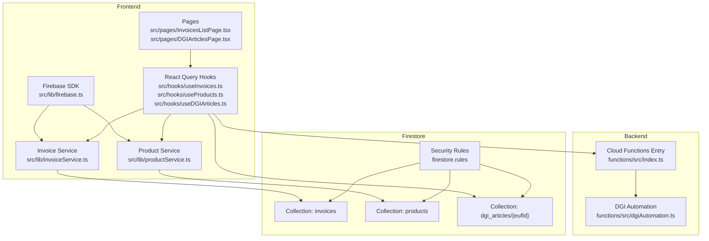
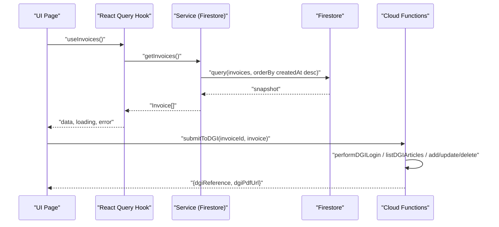
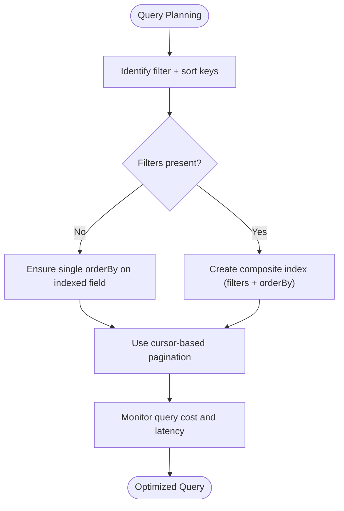
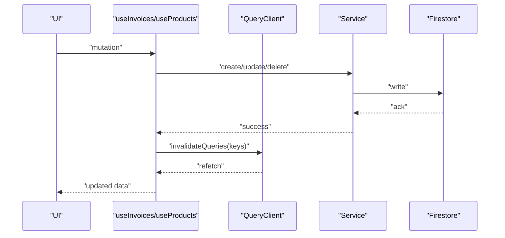
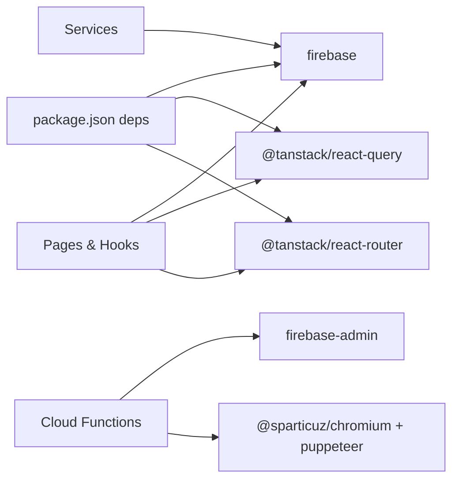

# Performance & Scaling

<cite>
**Referenced Files in This Document**
- [firebase.ts](file://src/lib/firebase.ts)
- [invoiceService.ts](file://src/lib/invoiceService.ts)
- [productService.ts](file://src/lib/productService.ts)
- [useInvoices.ts](file://src/hooks/useInvoices.ts)
- [useProducts.ts](file://src/hooks/useProducts.ts)
- [useDGIArticles.ts](file://src/hooks/useDGIArticles.ts)
- [DGIArticlesPage.tsx](file://src/pages/DGIArticlesPage.tsx)
- [InvoicesListPage.tsx](file://src/pages/InvoicesListPage.tsx)
- [invoice.ts](file://src/types/invoice.ts)
- [firestore.rules](file://firestore.rules)
- [index.ts](file://functions/src/index.ts)
- [dgiAutomation.ts](file://functions/src/dgiAutomation.ts)
- [package.json](file://package.json)
- [vite.config.ts](file://vite.config.ts)
</cite>

## Table of Contents
1. [Introduction](#introduction)
2. [Project Structure](#project-structure)
3. [Core Components](#core-components)
4. [Architecture Overview](#architecture-overview)
5. [Detailed Component Analysis](#detailed-component-analysis)
6. [Dependency Analysis](#dependency-analysis)
7. [Performance Considerations](#performance-considerations)
8. [Troubleshooting Guide](#troubleshooting-guide)
9. [Conclusion](#conclusion)
10. [Appendices](#appendices)

## Introduction
This document focuses on performance optimization for ETSMEDF’s data layer. It covers indexing strategies, query optimization, pagination patterns, caching and memory management, resource optimization for mobile/desktop, efficient queries and composite indexes, data aggregation patterns, performance monitoring and analytics integration, bottleneck identification, and scaling considerations for increased user loads and data volume. Practical examples are provided via file references and diagrams mapped to actual code.

## Project Structure
The data layer spans:
- Frontend SDK initialization and service hooks for Firestore and Cloud Functions
- React Query cache and invalidation patterns
- Firestore collections and security rules
- Cloud Functions orchestrating browser automation against DGI

**Diagram sources**
- [firebase.ts:1-23](file://src/lib/firebase.ts#L1-L23)
- [invoiceService.ts:1-58](file://src/lib/invoiceService.ts#L1-L58)
- [productService.ts:1-17](file://src/lib/productService.ts#L1-L17)
- [useInvoices.ts:1-90](file://src/hooks/useInvoices.ts#L1-L90)
- [useProducts.ts:1-19](file://src/hooks/useProducts.ts#L1-L19)
- [useDGIArticles.ts:1-107](file://src/hooks/useDGIArticles.ts#L1-L107)
- [InvoicesListPage.tsx:1-174](file://src/pages/InvoicesListPage.tsx#L1-L174)
- [DGIArticlesPage.tsx:1-445](file://src/pages/DGIArticlesPage.tsx#L1-L445)
- [index.ts:1-243](file://functions/src/index.ts#L1-L243)
- [dgiAutomation.ts:1-800](file://functions/src/dgiAutomation.ts#L1-L800)
- [firestore.rules:1-9](file://firestore.rules#L1-L9)

**Section sources**
- [firebase.ts:1-23](file://src/lib/firebase.ts#L1-L23)
- [useInvoices.ts:1-90](file://src/hooks/useInvoices.ts#L1-L90)
- [useProducts.ts:1-19](file://src/hooks/useProducts.ts#L1-L19)
- [useDGIArticles.ts:1-107](file://src/hooks/useDGIArticles.ts#L1-L107)
- [index.ts:1-243](file://functions/src/index.ts#L1-L243)
- [firestore.rules:1-9](file://firestore.rules#L1-L9)

## Core Components
- Firebase initialization and exports for Firestore and Analytics
- Invoice service with Firestore CRUD and ordering
- Product service fetching product lists
- React Query hooks managing cache keys, invalidation, and mutations
- Pages rendering lists and triggering operations
- Cloud Functions exposing HTTPS callable endpoints for DGI operations
- Firestore security rules enforcing authenticated reads/writes

Key performance-relevant observations:
- Queries currently fetch entire collections without filters or limits
- Timestamp conversion occurs in the client for display
- React Query caches data with configurable stale times
- DGI operations are long-running and offloaded to Cloud Functions

**Section sources**
- [firebase.ts:1-23](file://src/lib/firebase.ts#L1-L23)
- [invoiceService.ts:19-58](file://src/lib/invoiceService.ts#L19-L58)
- [productService.ts:13-17](file://src/lib/productService.ts#L13-L17)
- [useInvoices.ts:12-58](file://src/hooks/useInvoices.ts#L12-L58)
- [useProducts.ts:5-11](file://src/hooks/useProducts.ts#L5-L11)
- [DGIArticlesPage.tsx:20-57](file://src/pages/DGIArticlesPage.tsx#L20-L57)
- [InvoicesListPage.tsx:27-41](file://src/pages/InvoicesListPage.tsx#L27-L41)
- [index.ts:40-176](file://functions/src/index.ts#L40-L176)
- [firestore.rules:4-6](file://firestore.rules#L4-L6)

## Architecture Overview
High-level data flow:
- Frontend initializes Firebase and uses service hooks
- React Query manages caching and background synchronization
- Firestore serves documents and collections
- Cloud Functions perform heavy operations (browser automation) and return results to the client

**Diagram sources**
- [useInvoices.ts:17-22](file://src/hooks/useInvoices.ts#L17-L22)
- [invoiceService.ts:27-37](file://src/lib/invoiceService.ts#L27-L37)
- [index.ts:180-242](file://functions/src/index.ts#L180-L242)

## Detailed Component Analysis

### Firestore Collections and Security
- invoices: ordered by creation timestamp, supports updates and deletes
- products: static product catalog fetched once with a stale cache
- dgi_articles/{eufId}: live snapshot bound to selected e-UF

Recommendations:
- Add composite indexes for frequent queries (e.g., status + createdAt)
- Enforce field-level validation and smaller payloads where possible
- Consider sharding large collections by date or tenant

**Section sources**
- [invoiceService.ts:17-17](file://src/lib/invoiceService.ts#L17-L17)
- [useProducts.ts:9-10](file://src/hooks/useProducts.ts#L9-L10)
- [useDGIArticles.ts:28-37](file://src/hooks/useDGIArticles.ts#L28-L37)
- [firestore.rules:4-6](file://firestore.rules#L4-L6)

### Query Patterns and Indexing Strategies
Current patterns:
- Full collection read with server-side ordering by creation timestamp
- Live snapshots for DGI articles per e-UF
- Static product list with 5-minute stale cache

Optimization opportunities:
- Pagination: use cursor-based pagination with limit and orderBy
- Filtering: add where clauses for status, clientName, or date ranges
- Composite indexes: create compound indexes for status + createdAt, clientName + createdAt
- Denormalization: precompute totals and aggregates to reduce client-side computation

**Diagram sources**
- [invoiceService.ts:27-37](file://src/lib/invoiceService.ts#L27-L37)
- [useDGIArticles.ts:28-37](file://src/hooks/useDGIArticles.ts#L28-L37)

**Section sources**
- [invoiceService.ts:27-37](file://src/lib/invoiceService.ts#L27-L37)
- [useProducts.ts:9-10](file://src/hooks/useProducts.ts#L9-L10)
- [useDGIArticles.ts:28-37](file://src/hooks/useDGIArticles.ts#L28-L37)

### Caching and Memory Management
- React Query cache keys and invalidation on mutations
- Stale-time for products (5 minutes)
- Live snapshots for DGI articles

Recommendations:
- Use background refetch with appropriate intervals
- Implement optimistic updates for mutations
- Debounce rapid UI triggers to avoid excessive queries
- For large lists, consider virtualized rendering and incremental loading

**Diagram sources**
- [useInvoices.ts:32-58](file://src/hooks/useInvoices.ts#L32-L58)
- [useProducts.ts:5-11](file://src/hooks/useProducts.ts#L5-L11)

**Section sources**
- [useInvoices.ts:12-58](file://src/hooks/useInvoices.ts#L12-L58)
- [useProducts.ts:5-11](file://src/hooks/useProducts.ts#L5-L11)

### Data Aggregation and Computation
- Totals computed client-side from invoice items
- TVA rate defined centrally

Recommendations:
- Precompute and store derived fields (subtotal, TVA, total) on write
- Use Firestore arrayUnion/arrayRemove carefully; consider denormalized totals
- Batch writes for bulk updates

**Section sources**
- [invoice.ts:28-39](file://src/types/invoice.ts#L28-L39)

### Cloud Functions and Browser Automation
- Long-running tasks offloaded to Cloud Functions
- Chromium/Puppeteer used for DGI interactions
- Secrets management for credentials

Recommendations:
- Configure timeouts and memory appropriately
- Implement retries with exponential backoff for transient failures
- Use structured logging for observability and error correlation

**Section sources**
- [index.ts:22-28](file://functions/src/index.ts#L22-L28)
- [index.ts:40-176](file://functions/src/index.ts#L40-L176)
- [dgiAutomation.ts:79-94](file://functions/src/dgiAutomation.ts#L79-L94)

## Dependency Analysis
- Frontend depends on Firebase SDK and React Query
- Services depend on Firestore SDK
- Pages depend on hooks and types
- Cloud Functions depend on admin SDK and external browser automation libraries

**Diagram sources**
- [package.json:12-31](file://package.json#L12-L31)
- [firebase.ts:1-23](file://src/lib/firebase.ts#L1-L23)
- [useInvoices.ts:1-11](file://src/hooks/useInvoices.ts#L1-L11)
- [index.ts:1-17](file://functions/src/index.ts#L1-L17)
- [dgiAutomation.ts:1-5](file://functions/src/dgiAutomation.ts#L1-L5)

**Section sources**
- [package.json:12-31](file://package.json#L12-L31)
- [firebase.ts:1-23](file://src/lib/firebase.ts#L1-L23)
- [index.ts:1-17](file://functions/src/index.ts#L1-L17)

## Performance Considerations

### Query Optimization
- Replace full collection reads with filtered, paginated queries
- Use orderBy consistently with existing or new composite indexes
- Apply where clauses for status, clientName, and date ranges

### Pagination Patterns
- Cursor-based pagination with limit
- Maintain forward/backward navigation stability
- Use snapshot listeners for near-real-time updates alongside periodic sync

### Caching and Memory
- Tune staleTime and cacheTime for frequently changing vs. static data
- Use background refetch to keep cache fresh
- Avoid storing large intermediate arrays in state; compute on demand

### Resource Optimization (Mobile/Desktop)
- Lazy-load images and large lists
- Virtualize long lists
- Minimize re-renders with memoization and stable callbacks
- Optimize bundle size via Vite configuration

**Section sources**
- [useProducts.ts:9-10](file://src/hooks/useProducts.ts#L9-L10)
- [vite.config.ts:1-14](file://vite.config.ts#L1-14)

### Bandwidth and Network Conditions
- Compress payloads where feasible
- Defer non-critical data until needed
- Implement offline-first patterns with local persistence and sync queues

### Monitoring and Analytics
- Integrate Firebase Analytics for usage metrics
- Add structured logging in Cloud Functions
- Track query counts, latency, and error rates

**Section sources**
- [firebase.ts:20-22](file://src/lib/firebase.ts#L20-L22)
- [index.ts:40-176](file://functions/src/index.ts#L40-L176)

## Troubleshooting Guide

Common issues and mitigations:
- Slow initial load: implement pagination and lazy loading; adjust staleTime
- Frequent re-fetch loops: review queryKey uniqueness and invalidation triggers
- Large list rendering lag: switch to virtualization and incremental rendering
- Cloud Function timeouts: increase timeoutSeconds and optimize browser steps
- Authentication errors: verify Firestore rules and user auth state

Operational checks:
- Confirm Firestore rules permit authenticated access
- Validate Cloud Function secrets and regions
- Inspect logs for Puppeteer navigation failures and timeouts

**Section sources**
- [firestore.rules:4-6](file://firestore.rules#L4-L6)
- [index.ts:22-28](file://functions/src/index.ts#L22-L28)
- [dgiAutomation.ts:114-170](file://functions/src/dgiAutomation.ts#L114-L170)

## Conclusion
ETSMEDF’s data layer can achieve significant performance gains by adopting targeted indexing, pagination, and caching strategies, complemented by robust monitoring and scalable Cloud Functions. Prioritize query optimization, minimize payload sizes, and leverage React Query effectively to balance freshness and performance across mobile and desktop clients.

## Appendices

### Practical Examples (by file reference)
- Efficient invoice listing with ordering: [invoiceService.ts:27-37](file://src/lib/invoiceService.ts#L27-L37)
- Product list caching: [useProducts.ts:5-11](file://src/hooks/useProducts.ts#L5-L11)
- Live DGI articles per e-UF: [useDGIArticles.ts:28-37](file://src/hooks/useDGIArticles.ts#L28-L37)
- Mutation-driven cache invalidation: [useInvoices.ts:32-58](file://src/hooks/useInvoices.ts#L32-L58)
- DGI automation entry points: [index.ts:93-176](file://functions/src/index.ts#L93-L176)