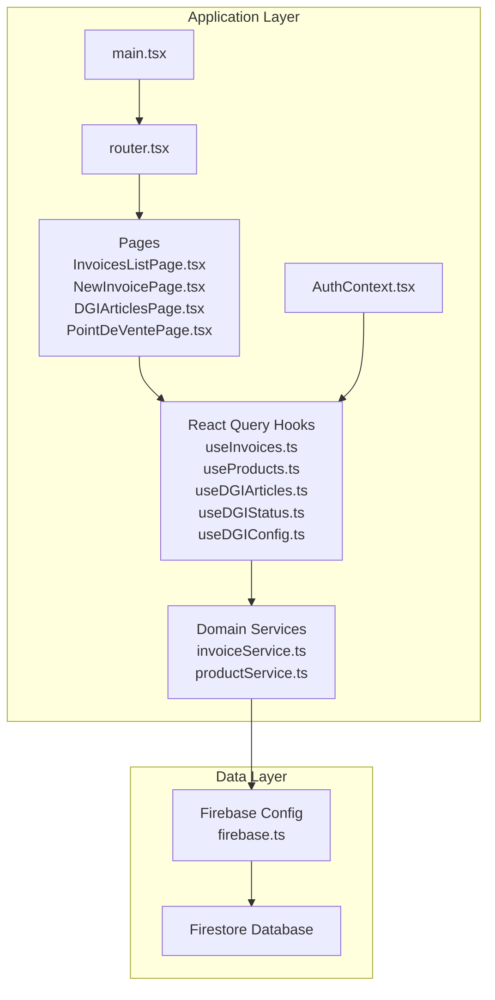
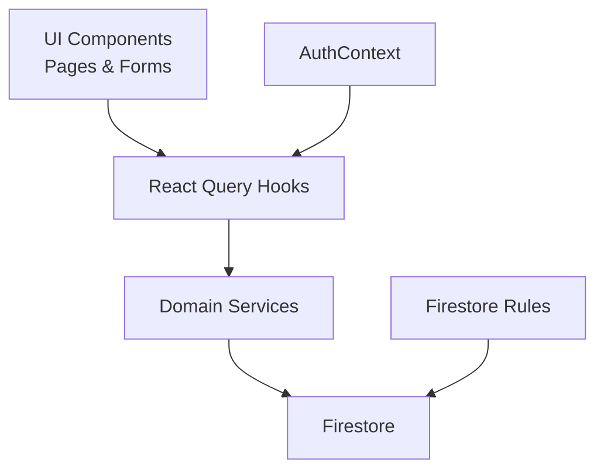
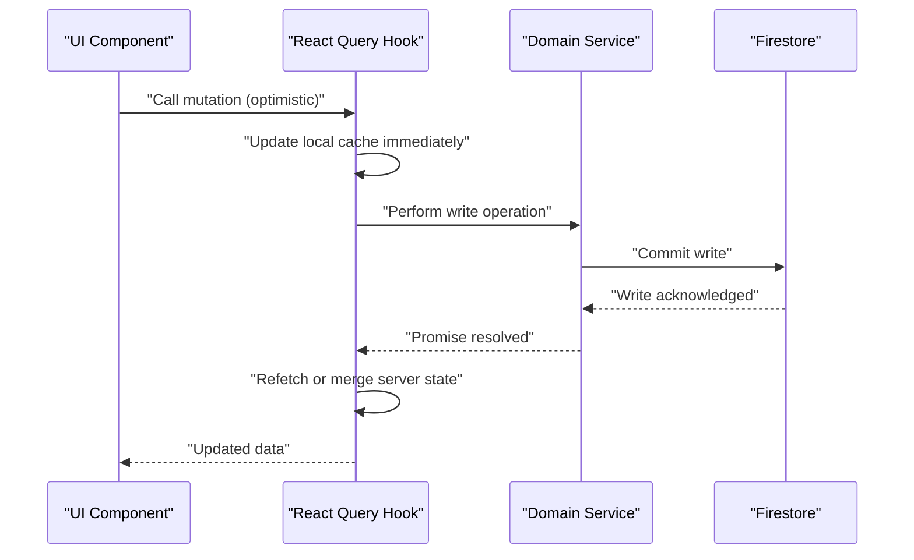
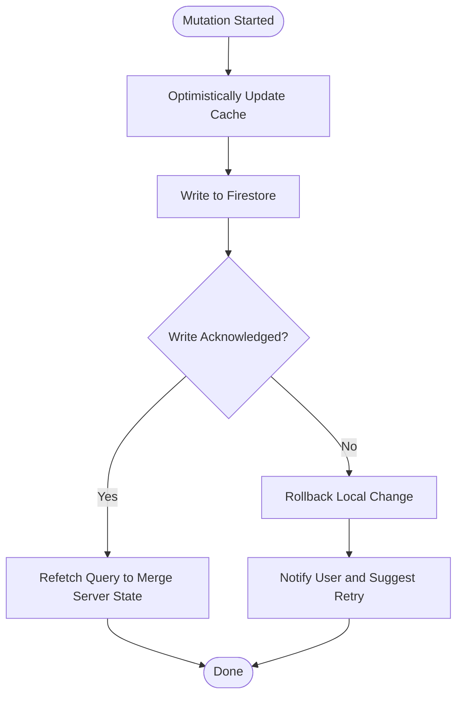
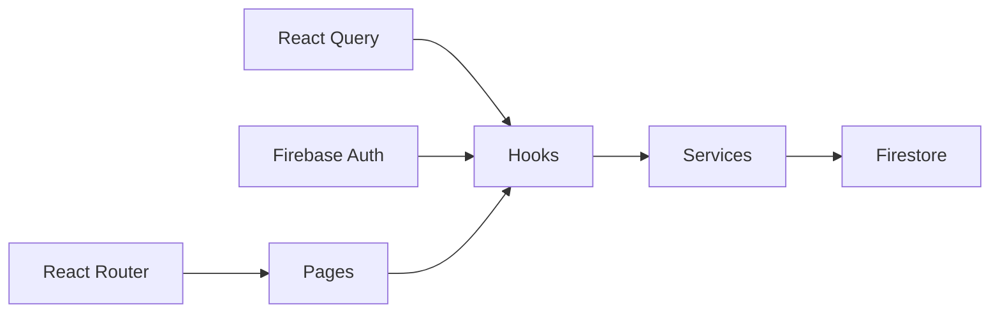

# Real-time Synchronization

<cite>
**Referenced Files in This Document**
- [firebase.ts](file://src/lib/firebase.ts)
- [invoiceService.ts](file://src/lib/invoiceService.ts)
- [productService.ts](file://src/lib/productService.ts)
- [useInvoices.ts](file://src/hooks/useInvoices.ts)
- [useProducts.ts](file://src/hooks/useProducts.ts)
- [useDGIArticles.ts](file://src/hooks/useDGIArticles.ts)
- [useDGIStatus.ts](file://src/hooks/useDGIStatus.ts)
- [useDGIConfig.ts](file://src/hooks/useDGIConfig.ts)
- [DGIArticlesPage.tsx](file://src/pages/DGIArticlesPage.tsx)
- [InvoicesListPage.tsx](file://src/pages/InvoicesListPage.tsx)
- [NewInvoicePage.tsx](file://src/pages/NewInvoicePage.tsx)
- [PointDeVentePage.tsx](file://src/pages/PointDeVentePage.tsx)
- [AuthContext.tsx](file://src/contexts/AuthContext.tsx)
- [router.tsx](file://src/router.tsx)
- [main.tsx](file://src/main.tsx)
- [package.json](file://package.json)
- [firestore.rules](file://firestore.rules)
</cite>

## Table of Contents
1. [Introduction](#introduction)
2. [Project Structure](#project-structure)
3. [Core Components](#core-components)
4. [Architecture Overview](#architecture-overview)
5. [Detailed Component Analysis](#detailed-component-analysis)
6. [Dependency Analysis](#dependency-analysis)
7. [Performance Considerations](#performance-considerations)
8. [Troubleshooting Guide](#troubleshooting-guide)
9. [Conclusion](#conclusion)

## Introduction
This document explains ETSMEDF's real-time data synchronization implementation, focusing on the integration between Firestore and React Query for automatic, reliable data updates across components. It covers subscription patterns, listener lifecycle management, optimistic updates, conflict resolution, offline persistence, cache invalidation strategies, error handling, and user feedback during operations.

## Project Structure
The real-time synchronization stack centers around:
- Firebase initialization and Firestore client configuration
- Domain-specific services for invoices and products
- React Query-based hooks that manage subscriptions and caching
- Page components that consume these hooks
- Authentication context for user-aware queries
- Application routing and provider setup

**Diagram sources**
- [firebase.ts](file://src/lib/firebase.ts)
- [invoiceService.ts](file://src/lib/invoiceService.ts)
- [productService.ts](file://src/lib/productService.ts)
- [useInvoices.ts](file://src/hooks/useInvoices.ts)
- [useProducts.ts](file://src/hooks/useProducts.ts)
- [useDGIArticles.ts](file://src/hooks/useDGIArticles.ts)
- [useDGIStatus.ts](file://src/hooks/useDGIStatus.ts)
- [useDGIConfig.ts](file://src/hooks/useDGIConfig.ts)
- [DGIArticlesPage.tsx](file://src/pages/DGIArticlesPage.tsx)
- [InvoicesListPage.tsx](file://src/pages/InvoicesListPage.tsx)
- [NewInvoicePage.tsx](file://src/pages/NewInvoicePage.tsx)
- [PointDeVentePage.tsx](file://src/pages/PointDeVentePage.tsx)
- [AuthContext.tsx](file://src/contexts/AuthContext.tsx)
- [router.tsx](file://src/router.tsx)
- [main.tsx](file://src/main.tsx)

**Section sources**
- [firebase.ts](file://src/lib/firebase.ts)
- [main.tsx](file://src/main.tsx)
- [router.tsx](file://src/router.tsx)

## Core Components
- Firebase configuration initializes the Firestore client and authentication state used by services and hooks.
- Domain services encapsulate Firestore operations for invoices and products, exposing typed CRUD and query methods.
- React Query hooks wrap service calls with caching, background refetching, and subscription-like behavior via query keys and infinite/pagination strategies.
- Page components subscribe to hook state and render lists, forms, and real-time updates.
- Authentication context ensures user-aware queries and protected routes.
- Firestore security rules define access control for real-time reads and writes.

Key responsibilities:
- Real-time subscriptions: Managed implicitly by React Query and Firestore listeners configured in hooks/services.
- Optimistic updates: Implemented at the UI level by mutating local cache before confirming server writes.
- Conflict resolution: Handled by Firestore write semantics and React Query cache updates.
- Offline persistence: Enabled by Firestore client configuration and React Query cache policies.
- Error handling: Centralized in hooks/services with user feedback via toast notifications.

**Section sources**
- [firebase.ts](file://src/lib/firebase.ts)
- [invoiceService.ts](file://src/lib/invoiceService.ts)
- [productService.ts](file://src/lib/productService.ts)
- [useInvoices.ts](file://src/hooks/useInvoices.ts)
- [useProducts.ts](file://src/hooks/useProducts.ts)
- [useDGIArticles.ts](file://src/hooks/useDGIArticles.ts)
- [useDGIStatus.ts](file://src/hooks/useDGIStatus.ts)
- [useDGIConfig.ts](file://src/hooks/useDGIConfig.ts)
- [AuthContext.tsx](file://src/contexts/AuthContext.tsx)
- [firestore.rules](file://firestore.rules)

## Architecture Overview
The system follows a layered architecture:
- UI Layer: Pages and components that render data and collect user actions.
- Hook Layer: React Query hooks that manage subscriptions, caching, and invalidation.
- Service Layer: Firestore-backed domain services with typed operations.
- Data Layer: Firestore database with security rules and offline persistence.

**Diagram sources**
- [DGIArticlesPage.tsx](file://src/pages/DGIArticlesPage.tsx)
- [InvoicesListPage.tsx](file://src/pages/InvoicesListPage.tsx)
- [NewInvoicePage.tsx](file://src/pages/NewInvoicePage.tsx)
- [PointDeVentePage.tsx](file://src/pages/PointDeVentePage.tsx)
- [useInvoices.ts](file://src/hooks/useInvoices.ts)
- [useProducts.ts](file://src/hooks/useProducts.ts)
- [useDGIArticles.ts](file://src/hooks/useDGIArticles.ts)
- [invoiceService.ts](file://src/lib/invoiceService.ts)
- [productService.ts](file://src/lib/productService.ts)
- [firebase.ts](file://src/lib/firebase.ts)
- [AuthContext.tsx](file://src/contexts/AuthContext.tsx)
- [firestore.rules](file://firestore.rules)

## Detailed Component Analysis

### Firebase Configuration and Offline Persistence
- Initializes Firestore client and authentication state.
- Enables offline persistence to keep the cache available when connectivity is lost.
- Provides typed Firestore instances for services and hooks.

Implementation highlights:
- Client initialization and persistence enablement.
- Auth state integration for user-aware queries.
- Exported client instance used by services.

**Section sources**
- [firebase.ts](file://src/lib/firebase.ts)

### Domain Services: Invoices and Products
- invoiceService.ts: Exposes typed functions for fetching, creating, updating, and deleting invoices with Firestore.
- productService.ts: Similar pattern for product data.

Key patterns:
- Query builders for collections and documents.
- Batch operations where appropriate.
- Error boundaries around Firestore operations.

Optimistic update support:
- Services return promises for write operations, enabling UI-level optimistic updates before awaiting server acknowledgment.

**Section sources**
- [invoiceService.ts](file://src/lib/invoiceService.ts)
- [productService.ts](file://src/lib/productService.ts)

### React Query Hooks: Subscription Patterns and Cache Management
- useInvoices.ts: Manages invoice lists with pagination/infinite queries, background refetching, and cache invalidation.
- useProducts.ts: Similar for product listings.
- useDGIArticles.ts: Real-time article data retrieval.
- useDGIStatus.ts and useDGIConfig.ts: Manage DGI-related configurations and statuses.

Subscription patterns:
- Query keys encode collection/document identifiers and filters to ensure proper cache separation.
- Background refetching keeps data fresh without blocking UI.
- Subscriptions are lifecycle-managed by React Query; unmounting cancels listeners automatically.

Cache invalidation strategies:
- Invalidate specific query keys after mutations.
- Refetch affected queries to reconcile with server state.
- Use mutation callbacks to trigger targeted invalidations.

Listener management and cleanup:
- React Query handles Firestore listener registration internally via hooks.
- Cleanup occurs on unmount or when query keys change.

**Section sources**
- [useInvoices.ts](file://src/hooks/useInvoices.ts)
- [useProducts.ts](file://src/hooks/useProducts.ts)
- [useDGIArticles.ts](file://src/hooks/useDGIArticles.ts)
- [useDGIStatus.ts](file://src/hooks/useDGIStatus.ts)
- [useDGIConfig.ts](file://src/hooks/useDGIConfig.ts)

### Page Components: Real-time Listeners and User Feedback
- InvoicesListPage.tsx: Renders invoice lists with real-time updates and action buttons.
- NewInvoicePage.tsx: Form-based creation with optimistic updates and immediate UI feedback.
- DGIArticlesPage.tsx and PointDeVentePage.tsx: Display real-time article and point-of-sale data.

Patterns:
- Subscribe to hook state and render loading/error states.
- Trigger mutations via service calls and handle user feedback (toasts).
- Respect authentication context for access-controlled views.

**Section sources**
- [InvoicesListPage.tsx](file://src/pages/InvoicesListPage.tsx)
- [NewInvoicePage.tsx](file://src/pages/NewInvoicePage.tsx)
- [DGIArticlesPage.tsx](file://src/pages/DGIArticlesPage.tsx)
- [PointDeVentePage.tsx](file://src/pages/PointDeVentePage.tsx)

### Authentication Context and Route Protection
- AuthContext.tsx: Provides authentication state and user info to hooks and pages.
- router.tsx: Protects routes requiring authentication.
- Ensures only authorized users can subscribe to protected data.

**Section sources**
- [AuthContext.tsx](file://src/contexts/AuthContext.tsx)
- [router.tsx](file://src/router.tsx)

### Sequence: Optimistic Update Flow

**Diagram sources**
- [useInvoices.ts](file://src/hooks/useInvoices.ts)
- [invoiceService.ts](file://src/lib/invoiceService.ts)
- [firebase.ts](file://src/lib/firebase.ts)

### Flowchart: Conflict Resolution and Cache Reconciliation

**Diagram sources**
- [useInvoices.ts](file://src/hooks/useInvoices.ts)
- [invoiceService.ts](file://src/lib/invoiceService.ts)

## Dependency Analysis
External dependencies relevant to real-time synchronization:
- Firestore client for database operations and offline persistence.
- React Query for caching, subscriptions, and background updates.
- React Router for route protection and navigation.
- Firebase Authentication for user-aware queries.

**Diagram sources**
- [useInvoices.ts](file://src/hooks/useInvoices.ts)
- [useProducts.ts](file://src/hooks/useProducts.ts)
- [useDGIArticles.ts](file://src/hooks/useDGIArticles.ts)
- [invoiceService.ts](file://src/lib/invoiceService.ts)
- [productService.ts](file://src/lib/productService.ts)
- [firebase.ts](file://src/lib/firebase.ts)
- [AuthContext.tsx](file://src/contexts/AuthContext.tsx)
- [router.tsx](file://src/router.tsx)
- [main.tsx](file://src/main.tsx)

**Section sources**
- [package.json](file://package.json)
- [firebase.ts](file://src/lib/firebase.ts)
- [useInvoices.ts](file://src/hooks/useInvoices.ts)
- [useProducts.ts](file://src/hooks/useProducts.ts)
- [useDGIArticles.ts](file://src/hooks/useDGIArticles.ts)
- [invoiceService.ts](file://src/lib/invoiceService.ts)
- [productService.ts](file://src/lib/productService.ts)
- [AuthContext.tsx](file://src/contexts/AuthContext.tsx)
- [router.tsx](file://src/router.tsx)
- [main.tsx](file://src/main.tsx)

## Performance Considerations
- Use pagination or infinite queries to limit initial payload sizes.
- Configure background refetch intervals to balance freshness and bandwidth.
- Invalidate only affected query keys after mutations to minimize unnecessary network requests.
- Enable Firestore offline persistence to reduce latency and improve resilience.
- Debounce rapid UI-triggered writes to avoid excessive network traffic.
- Prefer batch operations for bulk updates.
- Use efficient query keys to avoid cache fragmentation.

## Troubleshooting Guide
Common scenarios and remedies:
- Network interruptions:
  - Rely on Firestore offline persistence to maintain cache availability.
  - React Query will retry failed requests when connectivity resumes.
  - Display user-friendly messages indicating offline mode and retry suggestions.
- Listener leaks or stale data:
  - Ensure hooks are mounted only when needed and unmounted on route changes.
  - Invalidate or refetch queries after significant state changes.
- Conflicts and race conditions:
  - Use optimistic updates with rollback on failure.
  - Reconcile cache with server state post-write.
- Access denied errors:
  - Verify Firestore rules and user permissions.
  - Guard routes and disable unauthorized UI actions.

**Section sources**
- [firebase.ts](file://src/lib/firebase.ts)
- [useInvoices.ts](file://src/hooks/useInvoices.ts)
- [useProducts.ts](file://src/hooks/useProducts.ts)
- [useDGIArticles.ts](file://src/hooks/useDGIArticles.ts)
- [firestore.rules](file://firestore.rules)

## Conclusion
ETSMEDF’s real-time synchronization leverages Firestore and React Query to deliver responsive, resilient data updates. By combining offline persistence, subscription-based caching, optimistic UI updates, and disciplined cache invalidation, the system maintains consistency and usability across network variability. Robust error handling and user feedback ensure graceful degradation and clear communication during operations.