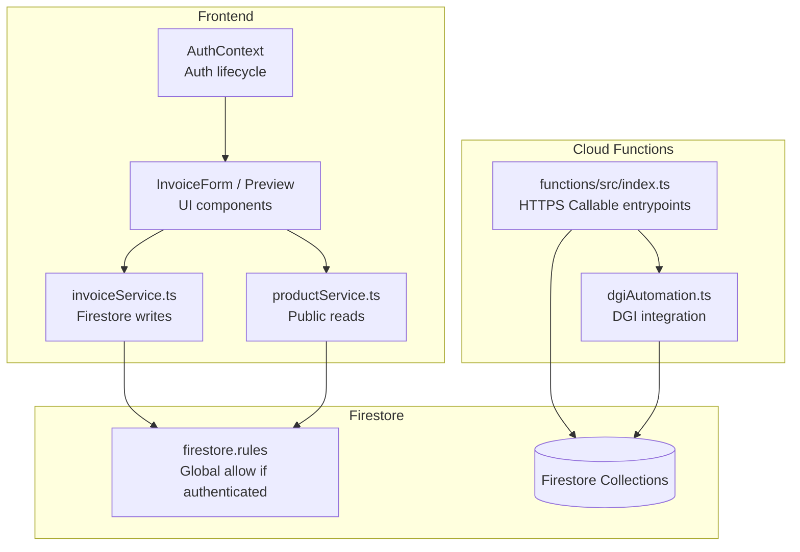
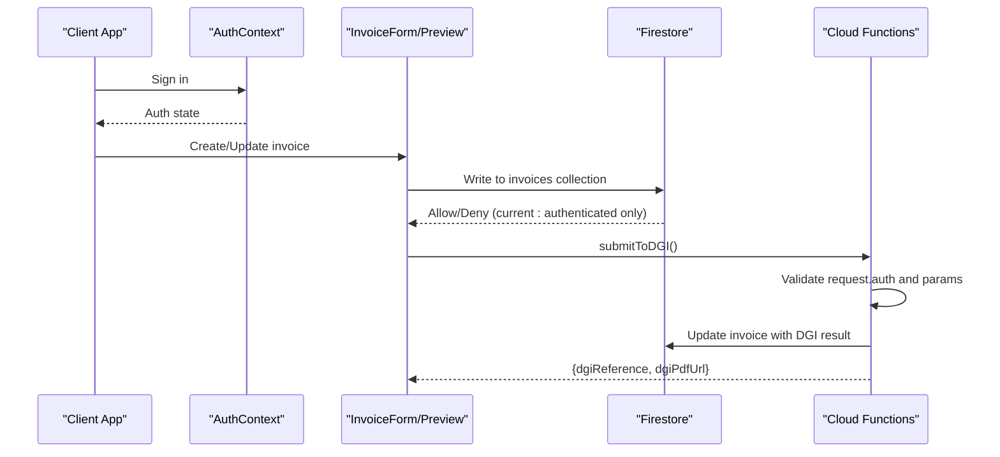
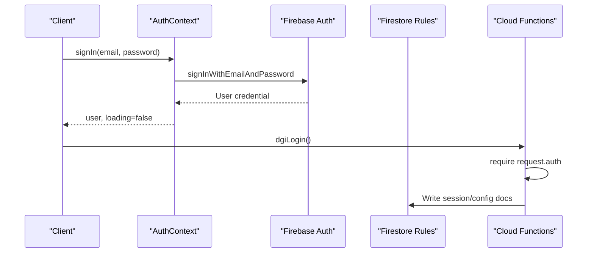
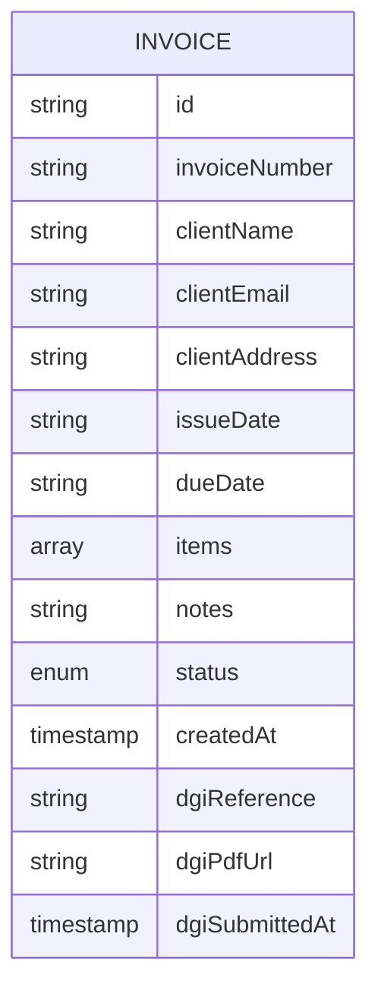
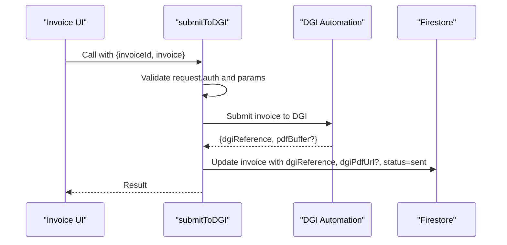
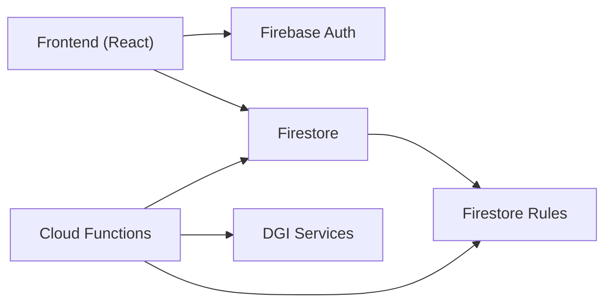

# Security Rules & Access Control

<cite>
**Referenced Files in This Document**
- [firestore.rules](file://firestore.rules)
- [firebase.json](file://firebase.json)
- [AuthContext.tsx](file://src/contexts/AuthContext.tsx)
- [firebase.ts](file://src/lib/firebase.ts)
- [invoiceService.ts](file://src/lib/invoiceService.ts)
- [productService.ts](file://src/lib/productService.ts)
- [invoice.ts](file://src/types/invoice.ts)
- [index.ts](file://functions/src/index.ts)
- [dgiAutomation.ts](file://functions/src/dgiAutomation.ts)
- [useInvoices.ts](file://src/hooks/useInvoices.ts)
- [useDGIArticles.ts](file://src/hooks/useDGIArticles.ts)
</cite>

## Table of Contents
1. [Introduction](#introduction)
2. [Project Structure](#project-structure)
3. [Core Components](#core-components)
4. [Architecture Overview](#architecture-overview)
5. [Detailed Component Analysis](#detailed-component-analysis)
6. [Dependency Analysis](#dependency-analysis)
7. [Performance Considerations](#performance-considerations)
8. [Troubleshooting Guide](#troubleshooting-guide)
9. [Conclusion](#conclusion)
10. [Appendices](#appendices)

## Introduction
This document provides comprehensive security rules and access control guidance for ETSMEDF's Firestore database. It explains the current security configuration, outlines recommended improvements for authentication, role-based access control (RBAC), and data validation, and documents practical patterns for protecting sensitive tax data. It also covers testing and debugging strategies, compliance considerations for tax data protection, and audit trail requirements.

## Project Structure
The security model spans three layers:
- Frontend authentication and routing protection
- Firestore security rules
- Cloud Functions enforcing backend policies and integrating with external systems

**Diagram sources**
- [AuthContext.tsx:26-55](file://src/contexts/AuthContext.tsx#L26-L55)
- [invoiceService.ts:19-57](file://src/lib/invoiceService.ts#L19-L57)
- [productService.ts:13-16](file://src/lib/productService.ts#L13-L16)
- [firestore.rules:1-9](file://firestore.rules#L1-L9)
- [index.ts:198-242](file://functions/src/index.ts#L198-L242)
- [dgiAutomation.ts:1360-1385](file://functions/src/dgiAutomation.ts#L1360-L1385)

**Section sources**
- [firebase.json:7-9](file://firebase.json#L7-L9)
- [AuthContext.tsx:26-55](file://src/contexts/AuthContext.tsx#L26-L55)
- [invoiceService.ts:19-57](file://src/lib/invoiceService.ts#L19-L57)
- [productService.ts:13-16](file://src/lib/productService.ts#L13-L16)
- [firestore.rules:1-9](file://firestore.rules#L1-L9)
- [index.ts:198-242](file://functions/src/index.ts#L198-L242)
- [dgiAutomation.ts:1360-1385](file://functions/src/dgiAutomation.ts#L1360-L1385)

## Core Components
- Authentication and session management are handled in the frontend using Firebase Authentication. The AuthContext manages sign-in/sign-out and integrates with DGI services via HTTPS Callable functions.
- Firestore currently allows read/write access to any authenticated user globally. This is a baseline but requires refinement for RBAC and data validation.
- Cloud Functions expose HTTPS Callable endpoints that enforce authentication and secret management, and orchestrate DGI interactions while writing results back to Firestore.

Key implementation references:
- Auth lifecycle and DGI integration: [AuthContext.tsx:26-55](file://src/contexts/AuthContext.tsx#L26-L55)
- Firestore rules: [firestore.rules:1-9](file://firestore.rules#L1-L9)
- Function entrypoints and DGI submission: [index.ts:198-242](file://functions/src/index.ts#L198-L242), [dgiAutomation.ts:1360-1385](file://functions/src/dgiAutomation.ts#L1360-L1385)

**Section sources**
- [AuthContext.tsx:26-55](file://src/contexts/AuthContext.tsx#L26-L55)
- [firestore.rules:1-9](file://firestore.rules#L1-L9)
- [index.ts:198-242](file://functions/src/index.ts#L198-L242)
- [dgiAutomation.ts:1360-1385](file://functions/src/dgiAutomation.ts#L1360-L1385)

## Architecture Overview
The current architecture grants broad access to authenticated users. Recommended enhancements include:
- Collection-level and document-level rules with explicit allow/deny patterns
- Field-level restrictions for sensitive tax data
- Conditional access based on user roles stored in claims or a dedicated user profile collection
- Validation rules for data integrity and completeness

**Diagram sources**
- [AuthContext.tsx:38-48](file://src/contexts/AuthContext.tsx#L38-L48)
- [invoiceService.ts:19-57](file://src/lib/invoiceService.ts#L19-L57)
- [index.ts:198-242](file://functions/src/index.ts#L198-L242)
- [dgiAutomation.ts:1360-1385](file://functions/src/dgiAutomation.ts#L1360-L1385)

## Detailed Component Analysis

### Current Firestore Security Rules
- Global rule: authenticated users can read/write any document.
- No role-based restrictions, field-level validations, or conditional access patterns are enforced.
- Immediate improvement: introduce collection/document-level rules with RBAC and data validation.

Recommended rule categories:
- Authentication gating: require request.auth != null
- Role-based access: restrict by user role (admin, accountant, viewer)
- Field-level restrictions: protect sensitive fields (e.g., dgiReference, dgiPdfUrl)
- Conditional access: allow updates only for specific statuses or ownership
- Validation: enforce required fields and data types

Example rule structure outline (descriptive):
- Collection "users": admins can manage profiles; self-service updates for own profile
- Collection "invoices": viewers can read; accountants can create/update/delete; admins full control
- Field-level: dgiReference and dgiPdfUrl writable only by trusted functions; status transitions validated
- Conditional: updates allowed only when status is "draft"; prevent deletion of submitted invoices

Note: Replace the global allow rule with granular rules tailored to collections and fields used by the application.

**Section sources**
- [firestore.rules:1-9](file://firestore.rules#L1-L9)

### Authentication and Authorization Flow
- Frontend authentication via Firebase Auth; AuthContext exposes sign-in/sign-out and subscribes to auth state changes.
- DGI login/logout functions are callable and require authentication.
- Recommendation: store user roles in custom claims or a dedicated "users" collection and enforce RBAC in Firestore rules.

**Diagram sources**
- [AuthContext.tsx:38-48](file://src/contexts/AuthContext.tsx#L38-L48)
- [index.ts:61-76](file://functions/src/index.ts#L61-L76)

**Section sources**
- [AuthContext.tsx:26-55](file://src/contexts/AuthContext.tsx#L26-L55)
- [index.ts:61-76](file://functions/src/index.ts#L61-L76)

### Data Model and Sensitive Fields
- Invoices include sensitive tax fields such as dgiReference, dgiPdfUrl, and dgiSubmittedAt.
- Recommendations:
  - Protect sensitive fields with field-level rules
  - Allow writes only by trusted functions
  - Enforce validation for required fields and formats
  - Restrict visibility to authorized roles

**Diagram sources**
- [invoice.ts:9-24](file://src/types/invoice.ts#L9-L24)

**Section sources**
- [invoice.ts:9-24](file://src/types/invoice.ts#L9-L24)

### Cloud Functions Security and Compliance
- Functions require authentication and read DGI credentials from secure environment variables.
- Submission flow updates invoices with DGI results and optional PDF URL.
- Recommendations:
  - Validate function parameters rigorously
  - Limit function scope to necessary operations
  - Add audit logs for sensitive actions
  - Ensure PDF uploads are public only when necessary

**Diagram sources**
- [useInvoices.ts:60-89](file://src/hooks/useInvoices.ts#L60-L89)
- [index.ts:198-242](file://functions/src/index.ts#L198-L242)
- [dgiAutomation.ts:1360-1385](file://functions/src/dgiAutomation.ts#L1360-L1385)

**Section sources**
- [index.ts:198-242](file://functions/src/index.ts#L198-L242)
- [dgiAutomation.ts:1360-1385](file://functions/src/dgiAutomation.ts#L1360-L1385)

### Practical Access Patterns by Role
- Admin:
  - Full access to invoices and user management
  - Can modify sensitive fields and statuses
- Accountant:
  - Create/update invoices; mark as sent
  - Manage articles via DGI functions
  - Read access to products/invoices
- Viewer:
  - Read-only access to invoices and products
  - Cannot modify or delete

Note: Implement these roles using either custom claims or a users collection referenced in Firestore rules.

**Section sources**
- [useDGIArticles.ts:65-106](file://src/hooks/useDGIArticles.ts#L65-L106)
- [index.ts:109-132](file://functions/src/index.ts#L109-L132)

### Data Validation Rules
- Required fields: invoiceNumber, clientName, issueDate, dueDate, items
- Status transitions: draft → sent → paid
- Numeric constraints: quantities and prices must be positive
- Email format validation for clientEmail
- Prevent modification of finalized invoices

**Section sources**
- [invoice.ts:28-38](file://src/types/invoice.ts#L28-L38)
- [invoiceService.ts:19-57](file://src/lib/invoiceService.ts#L19-L57)

## Dependency Analysis
- Frontend depends on Firebase Auth and Firestore; Firestore rules govern access.
- Cloud Functions depend on Firestore for configuration and results; they enforce additional business and security constraints.
- DGI integration relies on stored credentials and session persistence in Firestore.

**Diagram sources**
- [AuthContext.tsx:26-55](file://src/contexts/AuthContext.tsx#L26-L55)
- [firestore.rules:1-9](file://firestore.rules#L1-L9)
- [index.ts:198-242](file://functions/src/index.ts#L198-L242)

**Section sources**
- [AuthContext.tsx:26-55](file://src/contexts/AuthContext.tsx#L26-L55)
- [firestore.rules:1-9](file://firestore.rules#L1-L9)
- [index.ts:198-242](file://functions/src/index.ts#L198-L242)

## Performance Considerations
- Keep Firestore rules efficient; avoid expensive nested queries in rules.
- Use collection-level and document-level matches to minimize rule evaluation overhead.
- Batch writes carefully; consider transactional updates for related fields.
- Cache frequently accessed public data (e.g., products) in the frontend to reduce read pressure.

## Troubleshooting Guide
Common issues and resolutions:
- Rule denies despite authenticated user:
  - Verify request.auth exists and user is signed in
  - Check for conflicting wildcard rules
- Permission denied for DGI function:
  - Confirm function requires request.auth
  - Ensure DGI credentials are properly configured as secrets
- Unexpected data modifications:
  - Review field-level restrictions and conditional logic
  - Validate function parameter validation and Firestore writes
- Testing strategies:
  - Use Firestore Emulator with test accounts
  - Simulate role-based scenarios with custom claims
  - Log and audit critical operations in Cloud Functions

**Section sources**
- [index.ts:61-76](file://functions/src/index.ts#L61-L76)
- [index.ts:198-242](file://functions/src/index.ts#L198-L242)

## Conclusion
ETSMEDF currently grants broad access to authenticated users. To meet security and compliance requirements for tax data, implement granular Firestore rules with RBAC, field-level protections, and strict validation. Integrate Cloud Functions as trusted gatekeepers for sensitive operations, and establish robust auditing and testing practices.

## Appendices

### Compliance and Audit Trail Guidance
- Maintain audit logs for invoice submissions and status changes
- Limit access to sensitive fields (dgiReference, dgiPdfUrl) to trusted functions
- Enforce retention and deletion policies for tax documents
- Regularly review and test security rules against changing business requirements