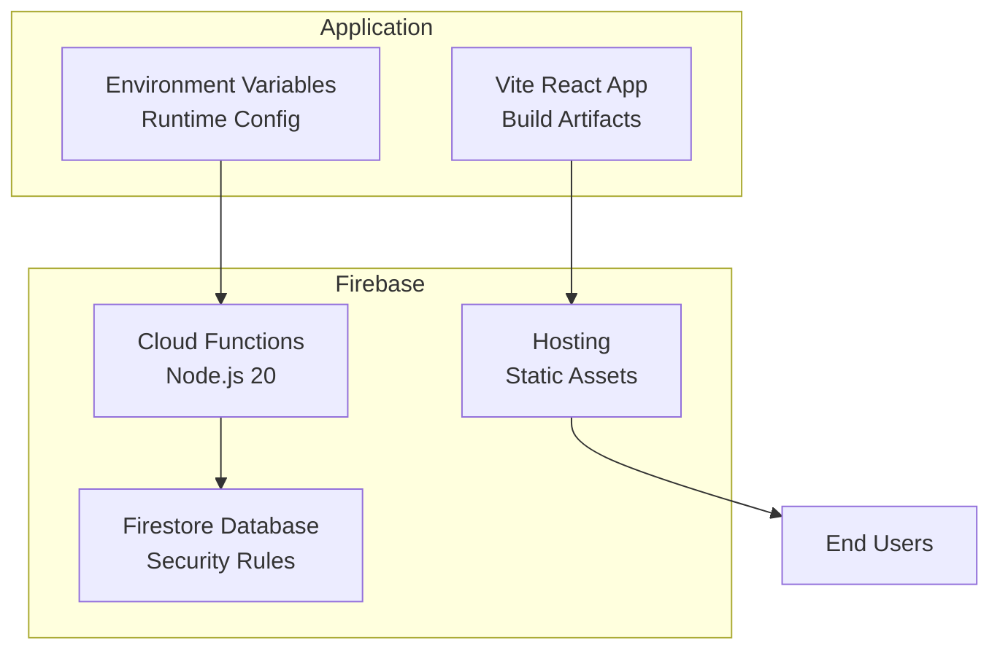
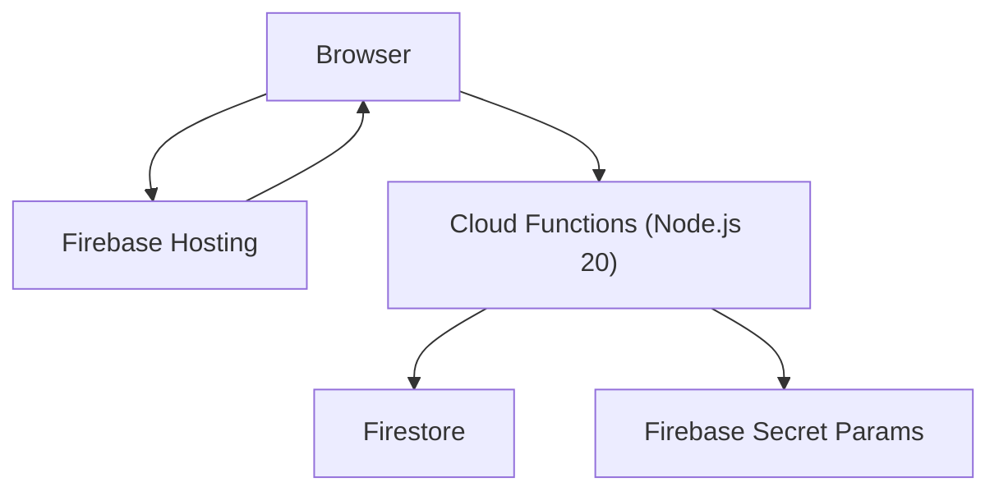
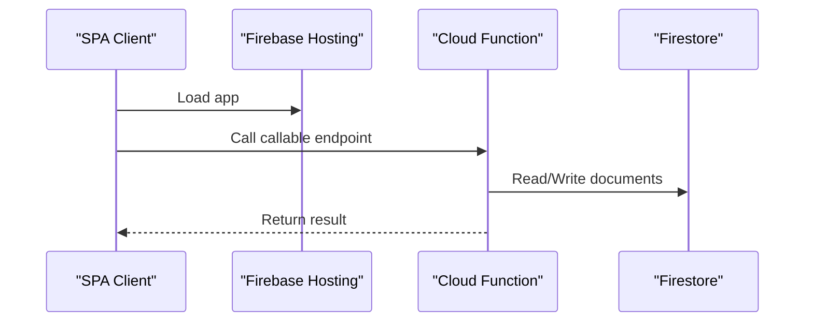
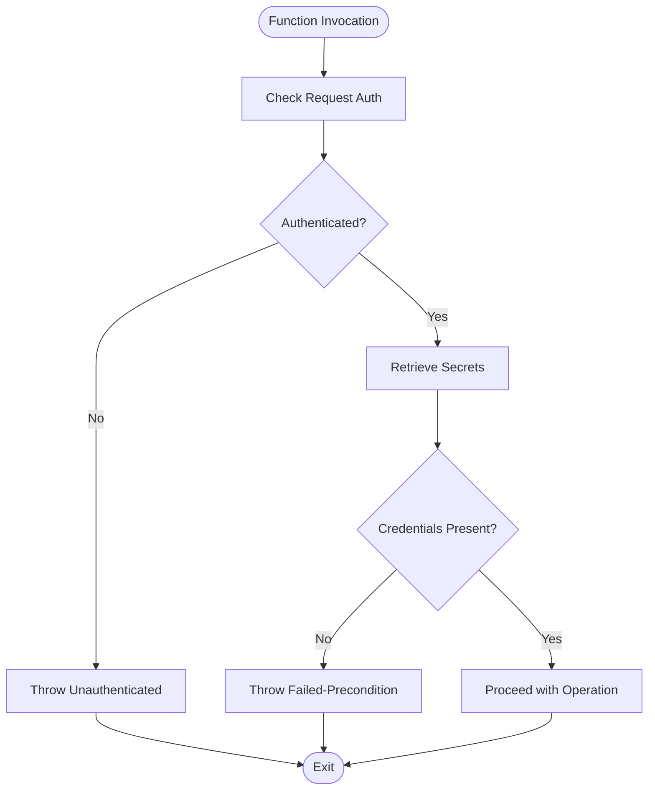
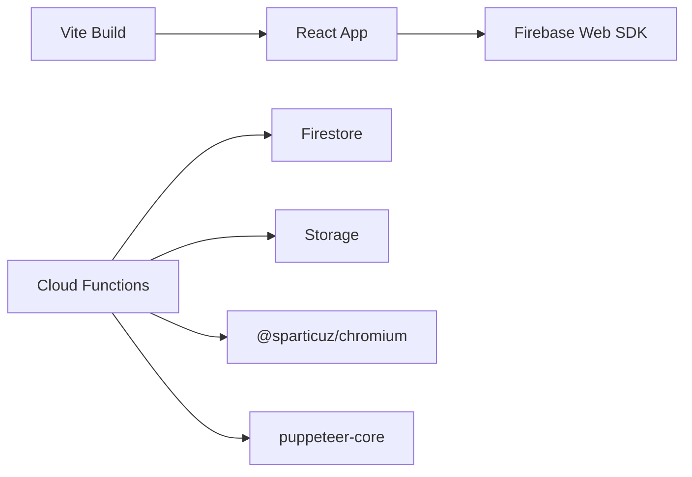

# Deployment and Operations

<cite>
**Referenced Files in This Document**
- [firebase.json](file://firebase.json)
- [firestore.rules](file://firestore.rules)
- [package.json](file://package.json)
- [vite.config.ts](file://vite.config.ts)
- [functions/package.json](file://functions/package.json)
- [functions/src/index.ts](file://functions/src/index.ts)
- [functions/src/dgiAutomation.ts](file://functions/src/dgiAutomation.ts)
- [src/lib/firebase.ts](file://src/lib/firebase.ts)
</cite>

## Table of Contents
1. [Introduction](#introduction)
2. [Project Structure](#project-structure)
3. [Core Components](#core-components)
4. [Architecture Overview](#architecture-overview)
5. [Detailed Component Analysis](#detailed-component-analysis)
6. [Dependency Analysis](#dependency-analysis)
7. [Performance Considerations](#performance-considerations)
8. [Troubleshooting Guide](#troubleshooting-guide)
9. [Conclusion](#conclusion)
10. [Appendices](#appendices)

## Introduction
This document provides comprehensive deployment and operations guidance for ETSMEDF in Firebase. It covers Firebase Hosting and Cloud Functions deployment, Firestore database configuration, environment variable management, secrets handling, CI/CD and automation strategies, monitoring, performance optimization, backups, and disaster recovery. Practical deployment commands, rollback procedures, and troubleshooting steps are included to support development, staging, and production environments.

## Project Structure
ETSMEDF is a Vite-based React single-page application integrated with Firebase. The frontend builds static assets deployed via Firebase Hosting. Cloud Functions (Node.js 20) implement serverless business logic and interact with Firestore and external systems. Firestore security rules enforce authentication-based access.

**Diagram sources**
- [firebase.json:1-11](file://firebase.json#L1-L11)
- [functions/package.json:1-34](file://functions/package.json#L1-L34)
- [firestore.rules:1-9](file://firestore.rules#L1-L9)
- [package.json:1-56](file://package.json#L1-L56)

**Section sources**
- [firebase.json:1-11](file://firebase.json#L1-L11)
- [functions/package.json:1-34](file://functions/package.json#L1-L34)
- [firestore.rules:1-9](file://firestore.rules#L1-L9)
- [package.json:1-56](file://package.json#L1-L56)

## Core Components
- Firebase Hosting: Static asset delivery for the React SPA.
- Cloud Functions: TypeScript/JavaScript functions deployed to Node.js 20 runtime with predeploy build hook.
- Firestore: Realtime document store protected by authentication-based rules.
- Environment Variables: Frontend variables injected at build-time; backend secrets managed via Firebase secret params.

Key configuration highlights:
- Functions source and runtime defined in Firebase configuration.
- Predeploy build step compiles TypeScript to JavaScript.
- Firestore rules restrict reads/writes to authenticated users.
- Frontend initializes Firebase SDK using Vite environment variables.

**Section sources**
- [firebase.json:1-11](file://firebase.json#L1-L11)
- [functions/package.json:1-34](file://functions/package.json#L1-L34)
- [firestore.rules:1-9](file://firestore.rules#L1-L9)
- [src/lib/firebase.ts:1-23](file://src/lib/firebase.ts#L1-L23)

## Architecture Overview
The system architecture integrates a modern frontend with Firebase-managed backend services. The SPA communicates with Cloud Functions via callable HTTPS endpoints, while Firestore stores application data. Authentication is enforced centrally, and secrets are managed securely.

**Diagram sources**
- [firebase.json:1-11](file://firebase.json#L1-L11)
- [functions/src/index.ts:1-30](file://functions/src/index.ts#L1-L30)
- [src/lib/firebase.ts:1-23](file://src/lib/firebase.ts#L1-L23)

## Detailed Component Analysis

### Firebase Hosting Setup
- Purpose: Serve the built React application as static assets.
- Build process: Vite builds the app; Firebase Hosting deploys the output directory.
- Local preview: Use the preview script to test locally before deploying.

Operational notes:
- Ensure the build completes successfully before deploying.
- Confirm the hosting source path aligns with the built output directory.

**Section sources**
- [package.json:1-56](file://package.json#L1-L56)
- [vite.config.ts:1-14](file://vite.config.ts#L1-L14)

### Cloud Functions Deployment
- Runtime: Node.js 20.
- Source: functions directory.
- Predeploy build: TypeScript compilation via tsc.
- Callable functions: Exposed via Firebase callable HTTPS endpoints.
- Region and timeouts: Configured per function category for performance and reliability.

**Diagram sources**
- [functions/src/index.ts:42-71](file://functions/src/index.ts#L42-L71)
- [functions/src/index.ts:180-242](file://functions/src/index.ts#L180-L242)

**Section sources**
- [firebase.json:1-11](file://firebase.json#L1-L11)
- [functions/package.json:1-34](file://functions/package.json#L1-L34)
- [functions/src/index.ts:1-30](file://functions/src/index.ts#L1-L30)

### Firestore Database Configuration
- Security rules: Allow read/write only when a user is authenticated.
- Data model: Documents under collections (e.g., invoices, session storage, configuration) accessed by functions and client-side queries.

Operational notes:
- Enforce authentication for all sensitive operations.
- Use Firestore transactions or batch writes for atomic updates where needed.

**Section sources**
- [firestore.rules:1-9](file://firestore.rules#L1-L9)
- [functions/src/dgiAutomation.ts:45-62](file://functions/src/dgiAutomation.ts#L45-L62)

### Environment Variable Management
- Frontend variables: Injected via Vite environment variables and consumed at runtime.
- Backend secrets: Managed via Firebase secret params and accessed in functions.

Best practices:
- Never commit secrets to version control.
- Use separate environment variables for development, staging, and production.
- Rotate secrets periodically and audit access.

**Section sources**
- [src/lib/firebase.ts:6-14](file://src/lib/firebase.ts#L6-L14)
- [functions/src/index.ts:19-26](file://functions/src/index.ts#L19-L26)

### Secrets Handling
- Secret definition: Username and password are declared as Firebase secret params.
- Access pattern: Retrieved at runtime and validated before use.
- Error handling: Throws explicit errors if secrets are missing.

**Diagram sources**
- [functions/src/index.ts:42-56](file://functions/src/index.ts#L42-L56)
- [functions/src/index.ts:31-38](file://functions/src/index.ts#L31-L38)

**Section sources**
- [functions/src/index.ts:19-26](file://functions/src/index.ts#L19-L26)
- [functions/src/index.ts:31-38](file://functions/src/index.ts#L31-L38)

### CI/CD Pipeline and Automation
Recommended strategy:
- Build and lint: Run frontend and functions builds; enforce linting.
- Test: Execute unit and integration tests (e.g., Playwright for E2E).
- Deploy: Deploy functions and hosting separately to enable rollback.
- Promote: Use Firebase aliases or manual approval gates for environment promotion.

Example command patterns:
- Build frontend: [package.json](file://package.json#L8)
- Build functions: [functions/package.json](file://functions/package.json#L11)
- Deploy functions only: [functions/package.json](file://functions/package.json#L15)
- Deploy hosting only: [firebase.json:1-11](file://firebase.json#L1-L11)

**Section sources**
- [package.json:6-10](file://package.json#L6-L10)
- [functions/package.json:10-16](file://functions/package.json#L10-L16)
- [firebase.json:1-11](file://firebase.json#L1-L11)

### Rollback Procedures
- Functions rollback: Redeploy a previous working revision or use Firebase’s revision history to revert.
- Hosting rollback: Re-deploy a known-good build or switch Hosting version if using aliases.
- Canary promotion: Gradually shift traffic to a new version using aliases or staged deployments.

Practical steps:
- Identify last known good revision.
- Re-run deployment targeting only the affected service.
- Monitor logs and metrics post-deployment.

**Section sources**
- [functions/package.json](file://functions/package.json#L15)
- [firebase.json:1-11](file://firebase.json#L1-L11)

### Monitoring and Observability
- Logs: Use Firebase Functions logger for structured info and error logs.
- Metrics: Track function invocations, durations, and error rates.
- Alerts: Configure alerts for high error rates or cold starts.
- Tracing: Correlate logs with request IDs for end-to-end visibility.

**Section sources**
- [functions/src/index.ts:44-55](file://functions/src/index.ts#L44-L55)
- [functions/src/index.ts:58-70](file://functions/src/index.ts#L58-L70)

### Backup and Disaster Recovery
- Firestore backups: Enable periodic snapshots or use automated export jobs.
- Secrets rotation: Update secret params and redeploy functions.
- Recovery plan: Maintain documented steps to restore services and data.

[No sources needed since this section provides general guidance]

### Operational Runbooks
- Health checks: Verify Hosting availability and function responsiveness.
- Capacity planning: Monitor function memory and timeout settings; adjust as needed.
- Security audits: Review Firestore rules and secret access policies.

[No sources needed since this section provides general guidance]

## Dependency Analysis
The application depends on Firebase services and third-party libraries for browser automation and PDF generation. Functions depend on Firestore and Storage for persistence and artifacts.

**Diagram sources**
- [package.json:12-31](file://package.json#L12-L31)
- [functions/package.json:17-22](file://functions/package.json#L17-L22)
- [functions/src/dgiAutomation.ts:1-11](file://functions/src/dgiAutomation.ts#L1-L11)

**Section sources**
- [package.json:12-31](file://package.json#L12-L31)
- [functions/package.json:17-22](file://functions/package.json#L17-L22)
- [functions/src/dgiAutomation.ts:1-11](file://functions/src/dgiAutomation.ts#L1-L11)

## Performance Considerations
- Function sizing and timeouts: Adjust memory and timeout settings per workload (invoices vs. article management).
- CDN and caching: Rely on Firebase Hosting cache headers; minimize unnecessary rebuilds.
- Browser automation: Use headless mode and optimized viewport; avoid excessive retries.
- Firestore queries: Use indexed fields and limit result sets; batch writes for bulk updates.

**Section sources**
- [functions/src/index.ts:22-29](file://functions/src/index.ts#L22-L29)
- [functions/src/dgiAutomation.ts:79-94](file://functions/src/dgiAutomation.ts#L79-L94)

## Troubleshooting Guide
Common issues and resolutions:
- Authentication failures: Ensure user is signed in before invoking callable functions.
- Missing secrets: Verify secret params are set in the Firebase console and redeploy functions.
- Build failures: Check TypeScript compilation and linting errors; confirm Node.js version compatibility.
- DGI login failures: Validate credentials and network accessibility; review logs for detailed errors.
- PDF upload failures: Non-blocking; verify Storage permissions and bucket configuration.

Diagnostic steps:
- Inspect function logs for structured messages and error traces.
- Validate environment variables and secret bindings.
- Confirm Firestore rules permit required operations.

**Section sources**
- [functions/src/index.ts:42-56](file://functions/src/index.ts#L42-L56)
- [functions/src/index.ts:180-208](file://functions/src/index.ts#L180-L208)
- [functions/src/dgiAutomation.ts:221-226](file://functions/src/dgiAutomation.ts#L221-L226)

## Conclusion
ETSMEDF leverages Firebase Hosting, Cloud Functions, and Firestore to deliver a secure, scalable invoicing solution. By following the deployment and operations practices outlined here—careful environment management, robust CI/CD, observability, and disaster recovery—you can maintain a reliable production environment and respond effectively to incidents.

[No sources needed since this section summarizes without analyzing specific files]

## Appendices

### Practical Deployment Commands
- Build frontend: [package.json](file://package.json#L8)
- Build functions: [functions/package.json](file://functions/package.json#L11)
- Deploy functions only: [functions/package.json](file://functions/package.json#L15)
- Deploy hosting only: [firebase.json:1-11](file://firebase.json#L1-L11)

**Section sources**
- [package.json](file://package.json#L8)
- [functions/package.json](file://functions/package.json#L11)
- [functions/package.json](file://functions/package.json#L15)
- [firebase.json:1-11](file://firebase.json#L1-L11)