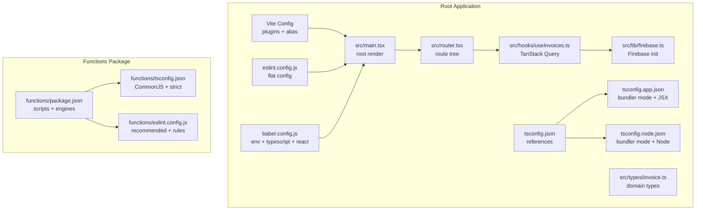
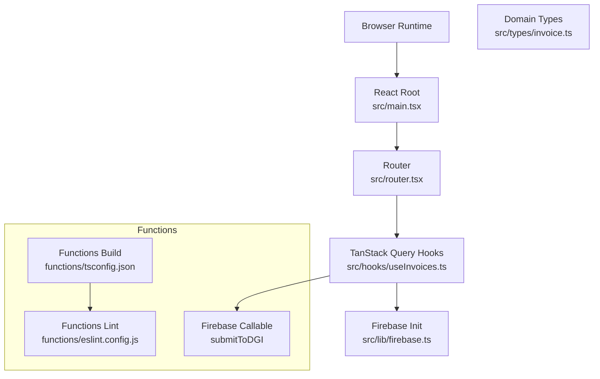
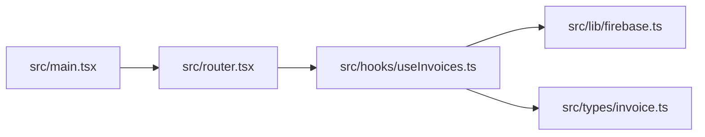

# Development Guidelines

<cite>
**Referenced Files in This Document**
- [package.json](file://package.json)
- [vite.config.ts](file://vite.config.ts)
- [tsconfig.json](file://tsconfig.json)
- [tsconfig.app.json](file://tsconfig.app.json)
- [tsconfig.node.json](file://tsconfig.node.json)
- [eslint.config.js](file://eslint.config.js)
- [babel.config.js](file://babel.config.js)
- [functions/package.json](file://functions/package.json)
- [functions/tsconfig.json](file://functions/tsconfig.json)
- [functions/eslint.config.js](file://functions/eslint.config.js)
- [src/main.tsx](file://src/main.tsx)
- [src/router.tsx](file://src/router.tsx)
- [src/lib/firebase.ts](file://src/lib/firebase.ts)
- [src/types/invoice.ts](file://src/types/invoice.ts)
- [src/hooks/useInvoices.ts](file://src/hooks/useInvoices.ts)
</cite>

## Table of Contents
1. [Introduction](#introduction)
2. [Project Structure](#project-structure)
3. [Core Components](#core-components)
4. [Architecture Overview](#architecture-overview)
5. [Detailed Component Analysis](#detailed-component-analysis)
6. [Dependency Analysis](#dependency-analysis)
7. [Performance Considerations](#performance-considerations)
8. [Troubleshooting Guide](#troubleshooting-guide)
9. [Conclusion](#conclusion)
10. [Appendices](#appendices)

## Introduction
This document defines development guidelines for the ETSMEDF project, covering TypeScript configuration, ESLint setup, Babel transpilation, Vite build and dev server, testing and code review standards, performance optimization, and deployment preparation. It also documents code organization patterns, naming conventions, and architectural decisions to maintain consistency across the full-stack application.

## Project Structure
The project follows a dual-package layout:
- Root application (React + Vite): TypeScript with modular tsconfig, ESLint flat config, Babel presets, and Vite plugin stack.
- Firebase Cloud Functions: Separate package with its own TypeScript and ESLint configurations.

Key conventions:
- Alias resolution via @ for src/ paths in both apps.
- Strict type checking and bundler-mode TypeScript compiler options.
- React Router v1 with TanStack Router Devtools in development.
- Firebase integration for auth, Firestore, and callable functions.

**Diagram sources**
- [vite.config.ts:1-14](file://vite.config.ts#L1-L14)
- [tsconfig.json:1-13](file://tsconfig.json#L1-L13)
- [tsconfig.app.json:1-29](file://tsconfig.app.json#L1-L29)
- [tsconfig.node.json:1-25](file://tsconfig.node.json#L1-L25)
- [eslint.config.js:1-23](file://eslint.config.js#L1-L23)
- [babel.config.js:1-8](file://babel.config.js#L1-L8)
- [src/main.tsx:1-22](file://src/main.tsx#L1-L22)
- [src/router.tsx:1-92](file://src/router.tsx#L1-L92)
- [src/types/invoice.ts:1-39](file://src/types/invoice.ts#L1-L39)
- [src/hooks/useInvoices.ts:1-90](file://src/hooks/useInvoices.ts#L1-L90)
- [src/lib/firebase.ts:1-23](file://src/lib/firebase.ts#L1-L23)
- [functions/package.json:1-34](file://functions/package.json#L1-L34)
- [functions/tsconfig.json:1-16](file://functions/tsconfig.json#L1-L16)
- [functions/eslint.config.js:1-25](file://functions/eslint.config.js#L1-L25)

**Section sources**
- [package.json:1-56](file://package.json#L1-L56)
- [vite.config.ts:1-14](file://vite.config.ts#L1-L14)
- [tsconfig.json:1-13](file://tsconfig.json#L1-L13)
- [tsconfig.app.json:1-29](file://tsconfig.app.json#L1-L29)
- [tsconfig.node.json:1-25](file://tsconfig.node.json#L1-L25)
- [eslint.config.js:1-23](file://eslint.config.js#L1-L23)
- [babel.config.js:1-8](file://babel.config.js#L1-L8)
- [functions/package.json:1-34](file://functions/package.json#L1-L34)
- [functions/tsconfig.json:1-16](file://functions/tsconfig.json#L1-L16)
- [functions/eslint.config.js:1-25](file://functions/eslint.config.js#L1-L25)

## Core Components
- TypeScript configuration
  - Root references two projects: app and node.
  - App project uses bundler mode, JSX React, and strict unused checks.
  - Node project aligns with Vite’s config for tooling.
- ESLint configuration
  - Flat config with recommended sets for JS, TypeScript, React Hooks, and React Refresh.
  - Browser globals enabled for the app.
- Babel configuration
  - Presets for env (node current), TypeScript, and React (automatic runtime).
- Vite configuration
  - React plugin, Tailwind Vite plugin, and alias @ -> src.

Practical implications:
- Use bundler module resolution for modern builds.
- Keep alias consistent across app and functions.
- Prefer TypeScript strictness and unused checks for reliability.

**Section sources**
- [tsconfig.json:1-13](file://tsconfig.json#L1-L13)
- [tsconfig.app.json:1-29](file://tsconfig.app.json#L1-L29)
- [tsconfig.node.json:1-25](file://tsconfig.node.json#L1-L25)
- [eslint.config.js:1-23](file://eslint.config.js#L1-L23)
- [babel.config.js:1-8](file://babel.config.js#L1-L8)
- [vite.config.ts:1-14](file://vite.config.ts#L1-L14)

## Architecture Overview
High-level runtime and build architecture:
- Frontend bootstraps React, Router, Query client, and Firebase.
- Routes are defined statically with protected routes and devtools in development.
- Hooks encapsulate TanStack Query queries and mutations, including a DGI submission flow via Firebase callable functions.
- Backend functions package compiles TypeScript, lints with ESLint, and deploys via Firebase CLI.

**Diagram sources**
- [src/main.tsx:1-22](file://src/main.tsx#L1-L22)
- [src/router.tsx:1-92](file://src/router.tsx#L1-L92)
- [src/hooks/useInvoices.ts:1-90](file://src/hooks/useInvoices.ts#L1-L90)
- [src/lib/firebase.ts:1-23](file://src/lib/firebase.ts#L1-L23)
- [src/types/invoice.ts:1-39](file://src/types/invoice.ts#L1-L39)
- [functions/tsconfig.json:1-16](file://functions/tsconfig.json#L1-L16)
- [functions/eslint.config.js:1-25](file://functions/eslint.config.js#L1-L25)

## Detailed Component Analysis

### TypeScript Configuration
- Modular setup
  - Root tsconfig.json references app and node projects.
  - App tsconfig enables bundler module resolution, JSX transform, and strict unused checks.
  - Node tsconfig aligns with Vite’s tooling needs.
- Type checking strategies
  - Unused locals/parameters and switch fallthrough checks enabled in both projects.
  - NoEmit is true in both projects to rely on Vite/TSC orchestration.
- Compilation settings
  - Target ES2023, DOM for app, esnext modules, and bundler mode for both.
  - Path aliases configured at root and per-project.

Best practices:
- Keep path aliases synchronized across projects.
- Use bundler module resolution for Vite and modern tooling.
- Leverage strictness flags to catch errors early.

**Section sources**
- [tsconfig.json:1-13](file://tsconfig.json#L1-L13)
- [tsconfig.app.json:1-29](file://tsconfig.app.json#L1-L29)
- [tsconfig.node.json:1-25](file://tsconfig.node.json#L1-L25)

### ESLint Configuration
- React and TypeScript awareness
  - Uses typescript-eslint recommended set and React Hooks recommended rules.
  - Integrates React Refresh rules for Vite.
- Scope and globals
  - Applies to TS/TSX files; browser globals enabled for the app.
- Functions package
  - Separate flat config with recommended TypeScript rules and custom warnings for any and unused vars.

Recommendations:
- Run lint before committing; fix or justify suppressions.
- Keep function package lint rules aligned with app for consistency.

**Section sources**
- [eslint.config.js:1-23](file://eslint.config.js#L1-L23)
- [functions/eslint.config.js:1-25](file://functions/eslint.config.js#L1-L25)

### Babel Configuration
- Presets
  - @babel/preset-env targeting Node current for functions compatibility.
  - @babel/preset-typescript for TS transforms.
  - @babel/preset-react with automatic runtime for React.
- Purpose
  - Ensures consistent transpilation across environments and packages.

Guidelines:
- Use Babel primarily for environments requiring polyfills or legacy transforms.
- For Vite-based app, rely on Vite’s React plugin and TypeScript loader; Babel is mainly used in functions.

**Section sources**
- [babel.config.js:1-8](file://babel.config.js#L1-L8)
- [functions/package.json:1-34](file://functions/package.json#L1-L34)

### Vite Configuration
- Plugins
  - React plugin for fast refresh and JSX transform.
  - Tailwind Vite plugin for CSS integration.
- Aliasing
  - Alias @ to src for clean imports.
- Scripts
  - Dev, build, lint, and preview commands orchestrated via package.json.

Notes:
- Development server hot reload enabled by React plugin.
- Tailwind integration supports JIT and theme customization.

**Section sources**
- [vite.config.ts:1-14](file://vite.config.ts#L1-L14)
- [package.json:1-56](file://package.json#L1-L56)

### Code Organization Patterns and Naming Conventions
- Feature-based grouping
  - Components under src/components (including UI primitives).
  - Pages under src/pages.
  - Shared logic under src/hooks, src/lib, and src/types.
- Contexts and providers
  - Auth provider wraps the app root.
- Route-driven pages
  - Static route tree with protected routes and devtools toggle in development.
- Domain modeling
  - Strongly typed invoice domain with helpers for calculations.

Naming conventions:
- Interfaces prefixed with uppercase (e.g., Invoice, InvoiceItem).
- Constants uppercase with underscores (e.g., TVA_RATE).
- Hooks prefixed with use..., returning either data or mutation objects.

**Section sources**
- [src/main.tsx:1-22](file://src/main.tsx#L1-L22)
- [src/router.tsx:1-92](file://src/router.tsx#L1-L92)
- [src/types/invoice.ts:1-39](file://src/types/invoice.ts#L1-L39)

### Architectural Decision-Making
- Routing
  - TanStack Router v1 with devtools in development; protected routes guard sensitive pages.
- State management
  - TanStack Query for caching, invalidation, and optimistic updates.
- Backend integration
  - Firebase for auth, Firestore, and callable functions for DGI submission.
- Environment separation
  - Firebase config loaded from environment variables.

Decision anchors:
- Choose TanStack Router for fine-grained routing and devtools.
- Use TanStack Query for predictable caching and mutation semantics.
- Keep callable functions minimal and strongly typed.

**Section sources**
- [src/router.tsx:1-92](file://src/router.tsx#L1-L92)
- [src/hooks/useInvoices.ts:1-90](file://src/hooks/useInvoices.ts#L1-L90)
- [src/lib/firebase.ts:1-23](file://src/lib/firebase.ts#L1-L23)

### Testing Strategies
- Unit tests
  - Recommended: Jest or Vitest with React Testing Library for component and hook tests.
  - Focus on pure functions (e.g., invoice calculations) and isolated hooks.
- Integration tests
  - Use Playwright for E2E scenarios across pages and flows.
- Snapshot and visual regression
  - Optional snapshot tests for static components; consider visual testing for UI-heavy pages.
- Test coverage
  - Enforce thresholds (e.g., 80%) for critical modules.

[No sources needed since this section provides general guidance]

### Code Review Standards
- Pull request checklist
  - Lint passes, build succeeds, tests added/updated, no console logs, accessibility reviewed.
- Review focus areas
  - Type safety, query key consistency, mutation invalidation, Firebase callable signatures, and environment variable usage.
- Naming and structure
  - Consistent use of hooks, interfaces, and alias imports.

[No sources needed since this section provides general guidance]

### Contribution Guidelines
- Branching
  - Feature branches per task; rebase main before opening PRs.
- Commit hygiene
  - Atomic commits with clear messages; reference issues.
- Pre-commit
  - Run lint and build locally; ensure functions package builds and lints.

[No sources needed since this section provides general guidance]

### Performance Optimization Techniques
- Bundle size
  - Analyze bundles with Vite’s built-in reporter or external tools; split code by route/page.
- Lazy loading
  - Dynamically import heavy pages or modals to reduce initial payload.
- Queries
  - Configure queryClient with appropriate stale times and background refetch policies.
- Assets
  - Optimize images and fonts; leverage Tailwind utilities instead of large icon libraries.
- Devtools
  - Keep devtools enabled only in development.

[No sources needed since this section provides general guidance]

### Bundle Analysis and Deployment Preparation
- Analysis
  - Use Vite’s build reporter and external tools to identify large dependencies.
- Deployment
  - Build app and functions separately; deploy functions via Firebase CLI.
  - Verify environment variables are present for production.

**Section sources**
- [package.json:1-56](file://package.json#L1-L56)
- [functions/package.json:1-34](file://functions/package.json#L1-L34)

## Dependency Analysis
- Internal dependencies
  - src/main.tsx depends on router, QueryClient, and AuthProvider.
  - src/router.tsx composes page components and protected routes.
  - src/hooks/useInvoices.ts orchestrates queries and mutations.
  - src/lib/firebase.ts initializes Firebase services.
- External dependencies
  - React, TanStack Router, TanStack Query, Firebase, Tailwind CSS, and related plugins.

**Diagram sources**
- [src/main.tsx:1-22](file://src/main.tsx#L1-L22)
- [src/router.tsx:1-92](file://src/router.tsx#L1-L92)
- [src/hooks/useInvoices.ts:1-90](file://src/hooks/useInvoices.ts#L1-L90)
- [src/lib/firebase.ts:1-23](file://src/lib/firebase.ts#L1-L23)
- [src/types/invoice.ts:1-39](file://src/types/invoice.ts#L1-L39)

**Section sources**
- [src/main.tsx:1-22](file://src/main.tsx#L1-L22)
- [src/router.tsx:1-92](file://src/router.tsx#L1-L92)
- [src/hooks/useInvoices.ts:1-90](file://src/hooks/useInvoices.ts#L1-L90)
- [src/lib/firebase.ts:1-23](file://src/lib/firebase.ts#L1-L23)
- [src/types/invoice.ts:1-39](file://src/types/invoice.ts#L1-L39)

## Performance Considerations
- Keep TypeScript strictness enabled to prevent subtle runtime issues.
- Prefer lazy-loaded routes and modals to reduce initial bundle size.
- Use TanStack Query’s cache policies to minimize redundant network requests.
- Avoid unnecessary re-renders by memoizing derived values and using stable query keys.

[No sources needed since this section provides general guidance]

## Troubleshooting Guide
- TypeScript diagnostics
  - Unused locals/parameters and switch fallthrough checks are enabled; address reported issues.
- ESLint failures
  - Fix or configure exceptions; ensure flat config applies to TS/TSX files.
- Vite dev server
  - Confirm alias @ resolves to src; ensure React plugin is active.
- Firebase callable mismatch
  - Validate callable argument and return types match the hook invocation.

**Section sources**
- [tsconfig.app.json:18-25](file://tsconfig.app.json#L18-L25)
- [tsconfig.node.json:17-21](file://tsconfig.node.json#L17-L21)
- [eslint.config.js:8-22](file://eslint.config.js#L8-L22)
- [vite.config.ts:6-13](file://vite.config.ts#L6-L13)
- [src/hooks/useInvoices.ts:60-89](file://src/hooks/useInvoices.ts#L60-L89)

## Conclusion
These guidelines establish a consistent, maintainable development workflow across the ETSMEDF frontend and backend. By adhering to the TypeScript, ESLint, Babel, and Vite configurations, following code organization and naming conventions, and applying the outlined testing, review, and performance practices, contributors can deliver reliable, scalable features efficiently.

[No sources needed since this section summarizes without analyzing specific files]

## Appendices

### Appendix A: Example Workflows
- Local development
  - Run dev server; ensure aliases and plugins are active.
- Building and previewing
  - Execute build script; preview production bundle.
- Linting
  - Run lint command; fix reported issues.
- Functions development
  - Build and serve functions via Firebase emulators; deploy selectively.

**Section sources**
- [package.json:6-11](file://package.json#L6-L11)
- [functions/package.json:10-16](file://functions/package.json#L10-L16)

### Appendix B: Domain Modeling Reference
- Invoice domain
  - Strongly typed items and totals calculation helpers.
- Hooks pattern
  - Centralized TanStack Query logic with invalidation and typed mutations.

**Section sources**
- [src/types/invoice.ts:1-39](file://src/types/invoice.ts#L1-L39)
- [src/hooks/useInvoices.ts:1-90](file://src/hooks/useInvoices.ts#L1-L90)