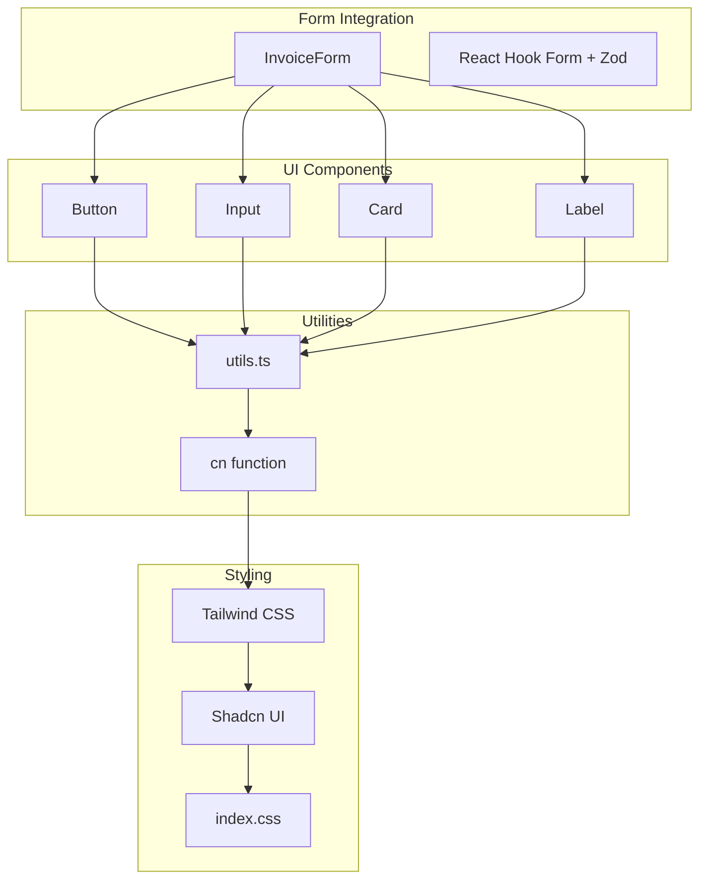
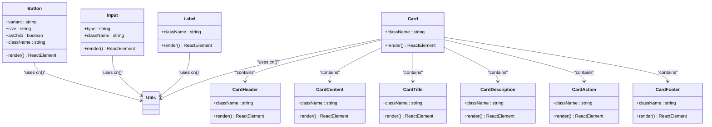
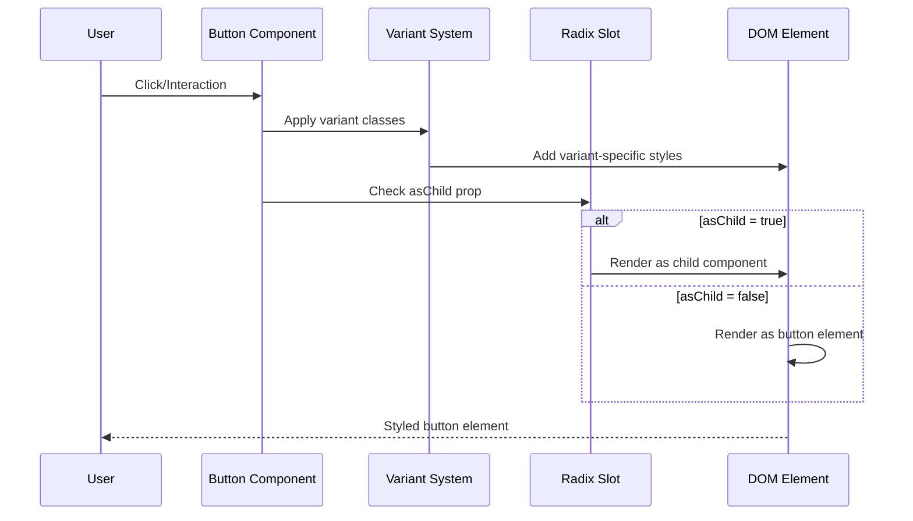
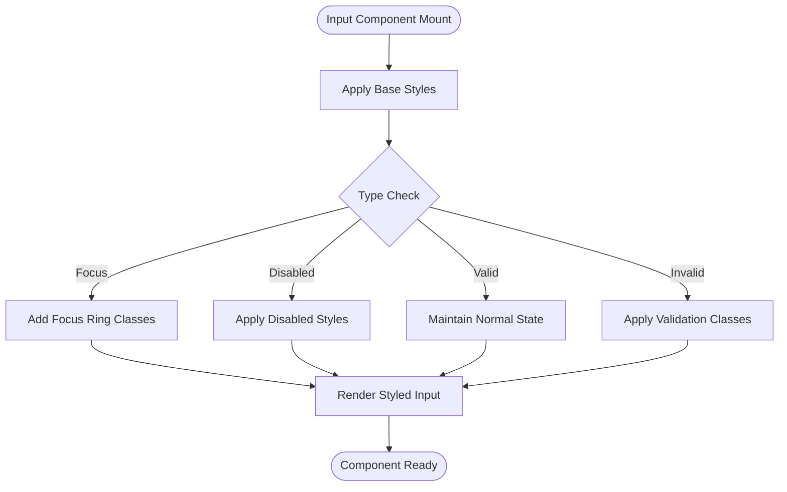
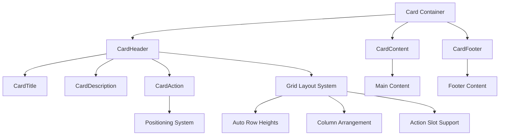
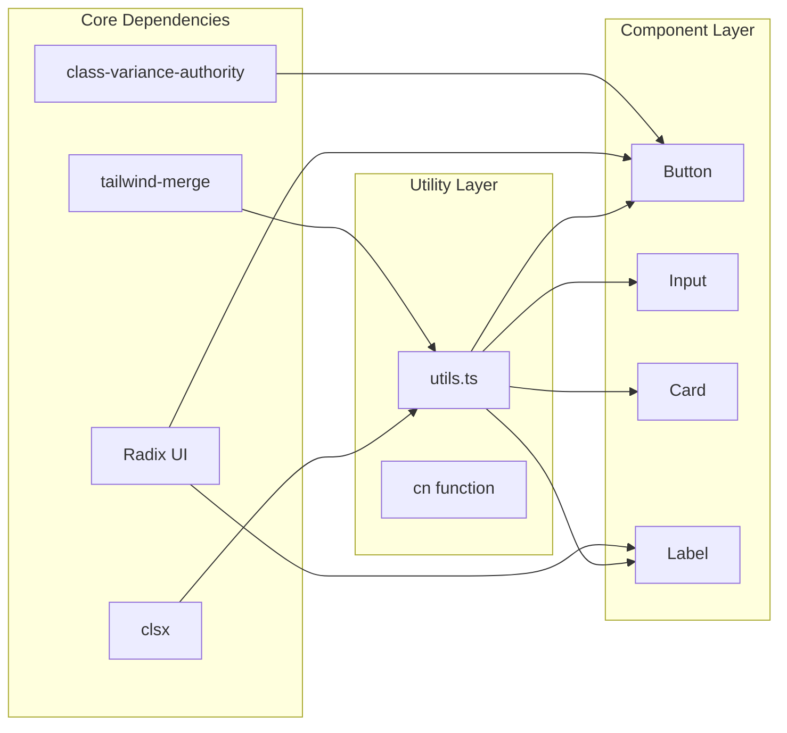
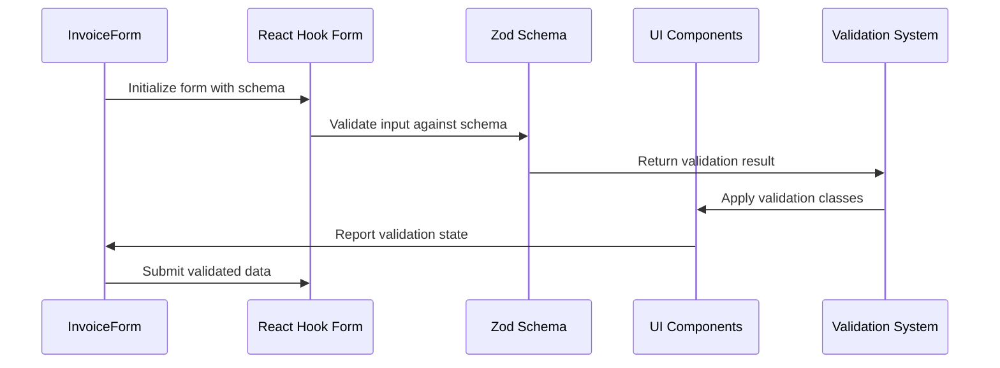

# Core UI Components

<cite>
**Referenced Files in This Document**
- [button.tsx](file://src/components/ui/button.tsx)
- [input.tsx](file://src/components/ui/input.tsx)
- [card.tsx](file://src/components/ui/card.tsx)
- [label.tsx](file://src/components/ui/label.tsx)
- [utils.ts](file://src/lib/utils.ts)
- [InvoiceForm.tsx](file://src/components/InvoiceForm.tsx)
- [components.json](file://components.json)
- [index.css](file://src/index.css)
- [package.json](file://package.json)
</cite>

## Table of Contents
1. [Introduction](#introduction)
2. [Project Structure](#project-structure)
3. [Core Components](#core-components)
4. [Architecture Overview](#architecture-overview)
5. [Detailed Component Analysis](#detailed-component-analysis)
6. [Dependency Analysis](#dependency-analysis)
7. [Performance Considerations](#performance-considerations)
8. [Accessibility and Keyboard Navigation](#accessibility-and-keyboard-navigation)
9. [Integration Patterns](#integration-patterns)
10. [Troubleshooting Guide](#troubleshooting-guide)
11. [Conclusion](#conclusion)

## Introduction
This document provides comprehensive documentation for ETSMEDF's core UI components: Button, Input, Card, and Label. These components are built on shadcn/ui primitives and leverage Tailwind CSS for styling. The documentation covers component architecture, props, variants, sizes, customization capabilities, integration patterns with form validation, accessibility features, and responsive design considerations.

## Project Structure
The UI components are organized under the `src/components/ui/` directory, following a modular structure that promotes reusability and maintainability. Each component is implemented as a standalone React functional component with TypeScript support.

**Diagram sources**
- [button.tsx:1-65](file://src/components/ui/button.tsx#L1-L65)
- [input.tsx:1-22](file://src/components/ui/input.tsx#L1-L22)
- [card.tsx:1-93](file://src/components/ui/card.tsx#L1-L93)
- [label.tsx:1-23](file://src/components/ui/label.tsx#L1-L23)
- [utils.ts:1-7](file://src/lib/utils.ts#L1-L7)
- [InvoiceForm.tsx:1-343](file://src/components/InvoiceForm.tsx#L1-L343)
- [index.css:1-124](file://src/index.css#L1-L124)

**Section sources**
- [components.json:1-24](file://components.json#L1-L24)
- [package.json:12-31](file://package.json#L12-L31)

## Core Components
This section documents the four primary UI components and their capabilities.

### Button Component
The Button component provides a versatile button element with multiple variants and sizes, built on shadcn/ui primitives.

**Props:**
- `className`: Additional CSS classes for customization
- `variant`: Visual appearance variant (default, destructive, outline, secondary, ghost, link)
- `size`: Physical size variant (default, xs, sm, lg, icon, icon-xs, icon-sm, icon-lg)
- `asChild`: Boolean flag to render as a child component using Radix UI's Slot primitive
- Standard HTML button attributes (`type`, `disabled`, `onClick`, etc.)

**Variants:**
- `default`: Primary action button with brand color
- `destructive`: Danger/stop action button
- `outline`: Border with transparent background
- `secondary`: Secondary action button
- `ghost`: Minimal visual impact
- `link`: Text-only link styling

**Sizes:**
- `default`: Standard button size
- `xs`: Extra small size
- `sm`: Small size
- `lg`: Large size
- `icon`: Icon-only button (various icon sizes)
- `icon-xs/sm/lg`: Proportional icon sizing

**Customization Options:**
- Inherits all Tailwind CSS classes through the `cn` utility
- Supports SVG icons with automatic sizing
- Focus states with ring effects
- Disabled state handling
- Accessible form validation integration

**Section sources**
- [button.tsx:7-39](file://src/components/ui/button.tsx#L7-L39)
- [button.tsx:41-62](file://src/components/ui/button.tsx#L41-L62)

### Input Component
The Input component provides a styled text input field with consistent focus states and validation feedback.

**Props:**
- `className`: Additional CSS classes for customization
- `type`: HTML input type (text, email, number, etc.)
- Standard HTML input attributes (`placeholder`, `value`, `onChange`, etc.)

**Styling Features:**
- Consistent height and padding across form controls
- Focus states with ring effects around input
- Disabled state handling with reduced opacity
- Placeholder text styling
- Selection highlighting with brand colors

**Validation Integration:**
- Built-in aria-invalid classes for form validation
- Automatic focus ring styling on validation errors
- Dark mode support for validation states

**Section sources**
- [input.tsx:5-19](file://src/components/ui/input.tsx#L5-L19)

### Card Component
The Card component provides a flexible container with multiple sub-components for structured content presentation.

**Main Component:**
- `Card`: Base container with rounded corners and shadow
- `CardHeader`: Header area with optional action slot
- `CardTitle`: Title text with appropriate typography
- `CardDescription`: Subtitle/description text
- `CardAction`: Action area for buttons or controls
- `CardContent`: Main content area
- `CardFooter`: Footer area with optional top border

**Layout Features:**
- Grid-based header layout with automatic column arrangement
- Responsive spacing and padding
- Border support with optional top/bottom borders
- Flexible content areas with consistent styling

**Section sources**
- [card.tsx:5-16](file://src/components/ui/card.tsx#L5-L16)
- [card.tsx:18-29](file://src/components/ui/card.tsx#L18-L29)
- [card.tsx:31-49](file://src/components/ui/card.tsx#L31-L49)
- [card.tsx:51-82](file://src/components/ui/card.tsx#L51-L82)

### Label Component
The Label component provides accessible labeling for form controls with proper focus and disabled state handling.

**Props:**
- `className`: Additional CSS classes for customization
- Standard HTML label attributes

**Features:**
- Group-based disabled state handling
- Peer-based disabled state for associated inputs
- Flex layout with gap alignment
- Select-none behavior for better UX
- Responsive typography

**Section sources**
- [label.tsx:6-20](file://src/components/ui/label.tsx#L6-L20)

## Architecture Overview
The UI components follow a consistent architecture pattern leveraging shadcn/ui primitives and Tailwind CSS utilities.

**Diagram sources**
- [button.tsx:1-65](file://src/components/ui/button.tsx#L1-L65)
- [input.tsx:1-22](file://src/components/ui/input.tsx#L1-L22)
- [card.tsx:1-93](file://src/components/ui/card.tsx#L1-L93)
- [label.tsx:1-23](file://src/components/ui/label.tsx#L1-L23)
- [utils.ts:4-6](file://src/lib/utils.ts#L4-L6)

## Detailed Component Analysis

### Button Component Implementation
The Button component uses class-variance-authority (cva) for variant-based styling and Radix UI's Slot primitive for composition flexibility.

**Key Implementation Details:**
- Uses cva for declarative variant styling
- Supports SVG icons with automatic sizing
- Focus-visible states with ring effects
- Disabled state handling with pointer-events-none
- aria-invalid integration for form validation

**Diagram sources**
- [button.tsx:7-39](file://src/components/ui/button.tsx#L7-L39)
- [button.tsx:51-61](file://src/components/ui/button.tsx#L51-L61)

**Section sources**
- [button.tsx:1-65](file://src/components/ui/button.tsx#L1-L65)

### Input Component Implementation
The Input component provides consistent styling across form inputs with integrated validation feedback.

**Diagram sources**
- [input.tsx:10-15](file://src/components/ui/input.tsx#L10-L15)

**Section sources**
- [input.tsx:1-22](file://src/components/ui/input.tsx#L1-L22)

### Card Component Composition
The Card component demonstrates advanced composition patterns with multiple sub-components and responsive layouts.

**Diagram sources**
- [card.tsx:18-29](file://src/components/ui/card.tsx#L18-L29)
- [card.tsx:51-62](file://src/components/ui/card.tsx#L51-L62)

**Section sources**
- [card.tsx:1-93](file://src/components/ui/card.tsx#L1-L93)

### Label Component Accessibility
The Label component integrates with form validation and accessibility standards.

**Section sources**
- [label.tsx:1-23](file://src/components/ui/label.tsx#L1-L23)

## Dependency Analysis
The UI components rely on several key dependencies for styling and functionality.

**Diagram sources**
- [button.tsx:2-3](file://src/components/ui/button.tsx#L2-L3)
- [label.tsx:2](file://src/components/ui/label.tsx#L2)
- [utils.ts:1-2](file://src/lib/utils.ts#L1-L2)

**Section sources**
- [package.json:19-31](file://package.json#L19-L31)
- [utils.ts:1-7](file://src/lib/utils.ts#L1-L7)

## Performance Considerations
The components are designed with performance in mind through several optimization strategies:

- **Minimal re-renders**: Components use memoization patterns and avoid unnecessary state updates
- **Efficient styling**: Tailwind CSS utility classes enable efficient styling without runtime computation
- **Variant optimization**: cva provides compile-time variant resolution
- **SVG optimization**: Icons are sized automatically to minimize layout shifts
- **Focus management**: Efficient focus-visible detection reduces unnecessary styling updates

## Accessibility and Keyboard Navigation
All components implement comprehensive accessibility features:

### Keyboard Navigation
- Full keyboard support for interactive elements
- Proper tab order and focus management
- Screen reader compatibility through semantic markup
- ARIA attributes for enhanced accessibility

### Screen Reader Compatibility
- Semantic HTML structure for each component
- Proper labeling for form controls
- Focus indicators for keyboard navigation
- Dynamic state announcements for form validation

### Accessibility Features
- Focus-visible rings for keyboard navigation
- High contrast color schemes
- Reduced motion preferences support
- Screen reader friendly labels and descriptions

**Section sources**
- [button.tsx:8](file://src/components/ui/button.tsx#L8)
- [input.tsx:11-13](file://src/components/ui/input.tsx#L11-L13)
- [label.tsx:14](file://src/components/ui/label.tsx#L14)

## Integration Patterns
The components integrate seamlessly with form validation systems and state management patterns.

### Form Validation Integration
The components work with React Hook Form and Zod for comprehensive form validation:

**Diagram sources**
- [InvoiceForm.tsx:58-76](file://src/components/InvoiceForm.tsx#L58-L76)
- [InvoiceForm.tsx:127-131](file://src/components/InvoiceForm.tsx#L127-L131)

### State Management Integration
- React Hook Form for form state management
- Zod for schema validation
- Local state for component-specific interactions
- Context providers for global state

**Section sources**
- [InvoiceForm.tsx:1-343](file://src/components/InvoiceForm.tsx#L1-L343)

## Troubleshooting Guide
Common issues and solutions when working with the UI components:

### Styling Issues
- **Problem**: Custom classes not applying
  - **Solution**: Ensure proper import order and use the `cn` utility function
- **Problem**: Variant classes overriding custom styles
  - **Solution**: Use Tailwind's !important modifier or adjust specificity

### Form Validation Problems
- **Problem**: Validation errors not displaying
  - **Solution**: Verify aria-invalid attributes are properly set
- **Problem**: Focus states not appearing
  - **Solution**: Check focus-visible ring configuration

### Accessibility Concerns
- **Problem**: Screen reader not announcing labels
  - **Solution**: Ensure proper htmlFor attributes and semantic markup
- **Problem**: Keyboard navigation issues
  - **Solution**: Verify tabindex and role attributes

**Section sources**
- [utils.ts:4-6](file://src/lib/utils.ts#L4-L6)
- [button.tsx:8](file://src/components/ui/button.tsx#L8)

## Conclusion
ETSMEDF's core UI components provide a robust foundation for building accessible, customizable, and performant user interfaces. The components leverage modern React patterns, shadcn/ui primitives, and Tailwind CSS to deliver consistent styling while maintaining flexibility for customization. Through comprehensive form validation integration, accessibility features, and responsive design considerations, these components support the development of professional-grade applications.

The modular architecture ensures maintainability and extensibility, while the consistent API design enables developers to quickly implement complex user interfaces with minimal boilerplate code. The integration with React Hook Form and Zod provides a solid foundation for form handling and validation, making it straightforward to build complex forms with proper error handling and user feedback.