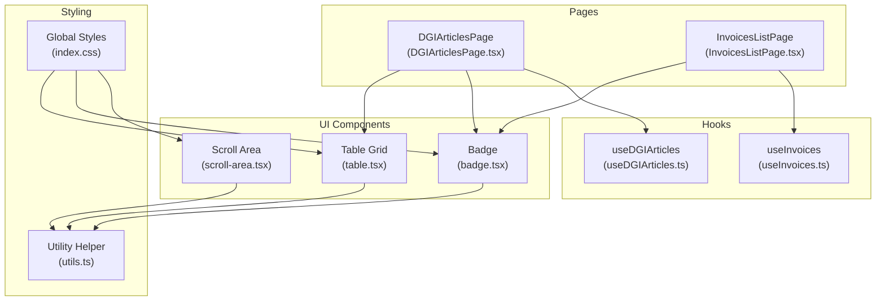
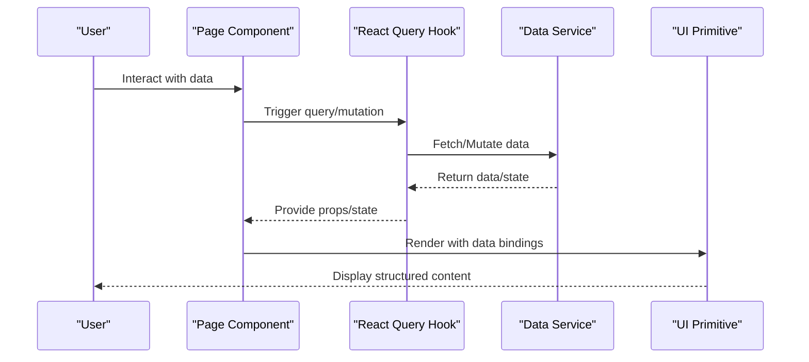
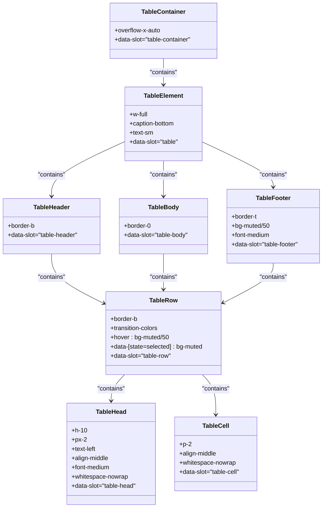
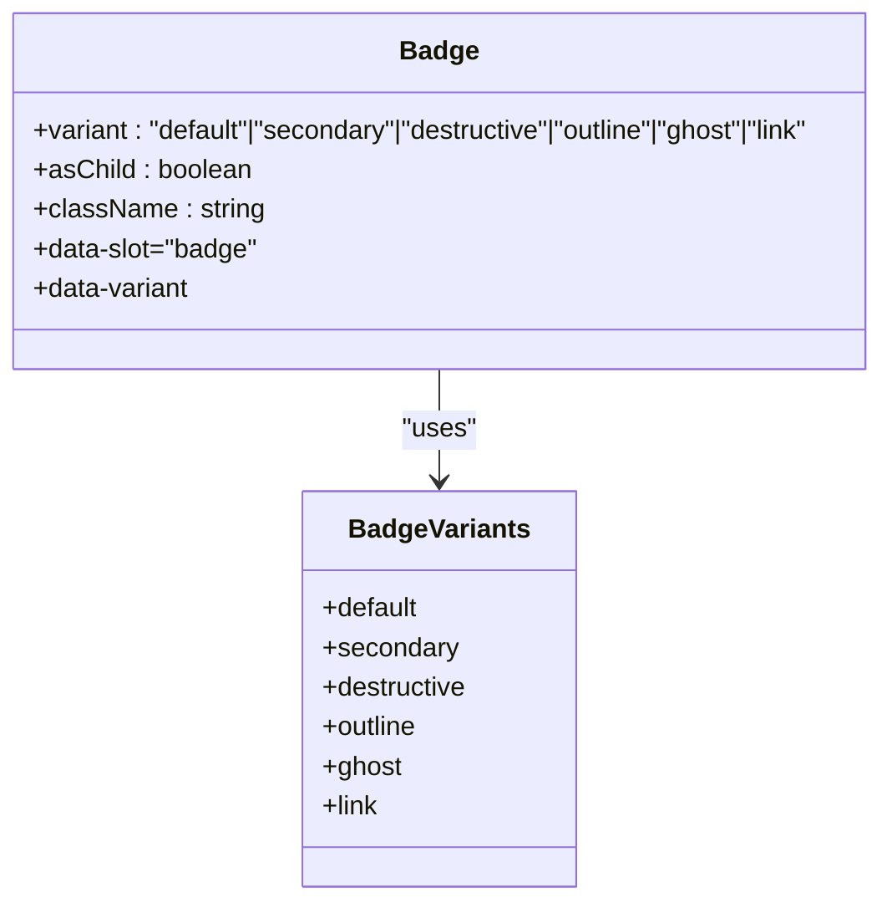
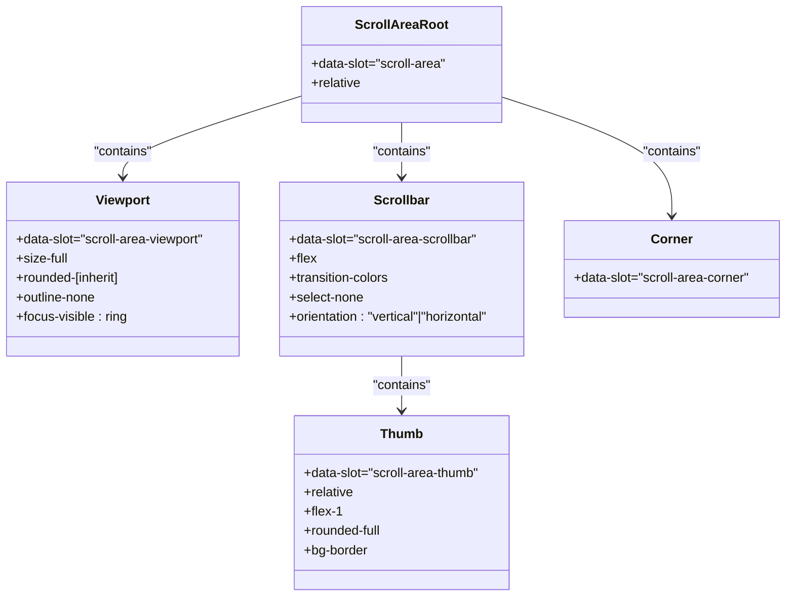
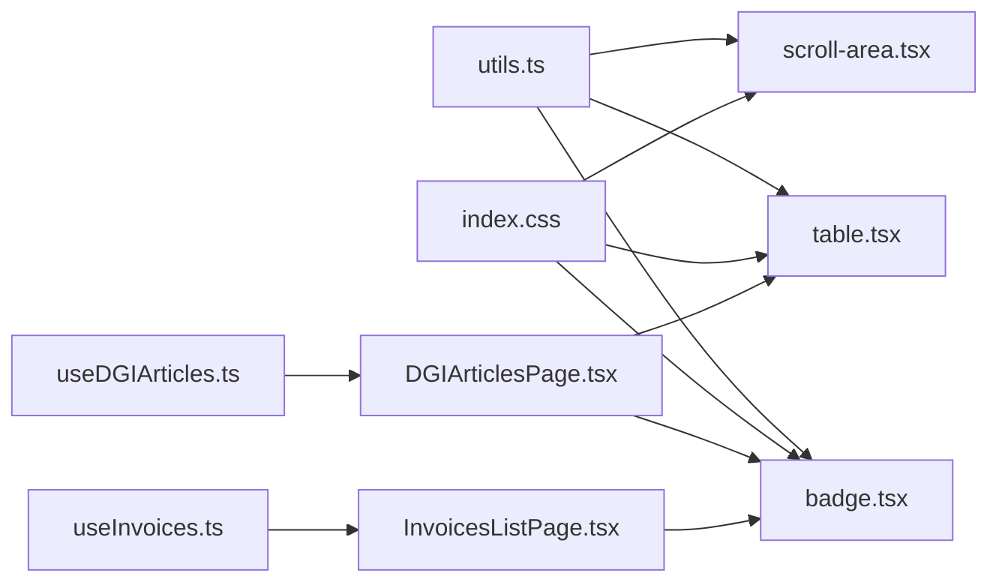

# Data Display Components

<cite>
**Referenced Files in This Document**
- [table.tsx](file://src/components/ui/table.tsx)
- [badge.tsx](file://src/components/ui/badge.tsx)
- [scroll-area.tsx](file://src/components/ui/scroll-area.tsx)
- [DGIArticlesPage.tsx](file://src/pages/DGIArticlesPage.tsx)
- [InvoicesListPage.tsx](file://src/pages/InvoicesListPage.tsx)
- [useDGIArticles.ts](file://src/hooks/useDGIArticles.ts)
- [useInvoices.ts](file://src/hooks/useInvoices.ts)
- [utils.ts](file://src/lib/utils.ts)
- [index.css](file://src/index.css)
</cite>

## Table of Contents
1. [Introduction](#introduction)
2. [Project Structure](#project-structure)
3. [Core Components](#core-components)
4. [Architecture Overview](#architecture-overview)
5. [Detailed Component Analysis](#detailed-component-analysis)
6. [Dependency Analysis](#dependency-analysis)
7. [Performance Considerations](#performance-considerations)
8. [Accessibility Features](#accessibility-features)
9. [Mobile Optimization Strategies](#mobile-optimization-strategies)
10. [Troubleshooting Guide](#troubleshooting-guide)
11. [Conclusion](#conclusion)

## Introduction
This document provides comprehensive documentation for ETSMEDF's data display UI components, focusing on Table grids, Badge indicators, and Scroll Area containers. It explains how these components are implemented, how they bind and present data, and how they integrate with the application's data fetching and state management systems. Practical examples demonstrate data presentation patterns, status visualization, and content organization strategies. The guide also covers performance considerations for large datasets, accessibility features, and mobile optimization approaches.

## Project Structure
The data display components are organized as reusable UI primitives located under `src/components/ui/`. They are consumed by page-level components that manage data fetching, state, and user interactions. The styling system leverages Tailwind CSS with shadcn/ui theme tokens defined in the global stylesheet.

**Diagram sources**
- [table.tsx:1-117](file://src/components/ui/table.tsx#L1-L117)
- [badge.tsx:1-49](file://src/components/ui/badge.tsx#L1-L49)
- [scroll-area.tsx:1-57](file://src/components/ui/scroll-area.tsx#L1-L57)
- [DGIArticlesPage.tsx:1-445](file://src/pages/DGIArticlesPage.tsx#L1-L445)
- [InvoicesListPage.tsx:1-174](file://src/pages/InvoicesListPage.tsx#L1-L174)
- [useDGIArticles.ts:1-107](file://src/hooks/useDGIArticles.ts#L1-L107)
- [useInvoices.ts:1-90](file://src/hooks/useInvoices.ts#L1-L90)
- [utils.ts:1-7](file://src/lib/utils.ts#L1-L7)
- [index.css:1-124](file://src/index.css#L1-L124)

**Section sources**
- [table.tsx:1-117](file://src/components/ui/table.tsx#L1-L117)
- [badge.tsx:1-49](file://src/components/ui/badge.tsx#L1-L49)
- [scroll-area.tsx:1-57](file://src/components/ui/scroll-area.tsx#L1-L57)
- [DGIArticlesPage.tsx:1-445](file://src/pages/DGIArticlesPage.tsx#L1-L445)
- [InvoicesListPage.tsx:1-174](file://src/pages/InvoicesListPage.tsx#L1-L174)
- [useDGIArticles.ts:1-107](file://src/hooks/useDGIArticles.ts#L1-L107)
- [useInvoices.ts:1-90](file://src/hooks/useInvoices.ts#L1-L90)
- [utils.ts:1-7](file://src/lib/utils.ts#L1-L7)
- [index.css:1-124](file://src/index.css#L1-L124)

## Core Components
This section documents the three primary data display components and their capabilities.

- Table Grid: Provides responsive table layout with container-level horizontal scrolling, header/body/footer/row/cell semantics, and hover/selection states. It integrates with Tailwind utility classes for consistent spacing and typography.
- Badge: Offers variant-based status and tag indicators with focus-visible ring, hover effects, and semantic variants (default, secondary, destructive, outline, ghost, link).
- Scroll Area: Implements custom scrollbar styling with vertical/horizontal orientation support, viewport focus rings, and corner element for seamless integration.

**Section sources**
- [table.tsx:7-116](file://src/components/ui/table.tsx#L7-L116)
- [badge.tsx:7-48](file://src/components/ui/badge.tsx#L7-L48)
- [scroll-area.tsx:6-56](file://src/components/ui/scroll-area.tsx#L6-L56)

## Architecture Overview
The data display architecture follows a layered pattern:
- UI Primitives: Reusable components (Table, Badge, Scroll Area) encapsulate styling and behavior.
- Pages: Presentational components orchestrate data binding, layout, and user interactions.
- Hooks: Manage data fetching, mutations, and caching via React Query.
- Styling: Centralized theme tokens and utility classes ensure consistent appearance.

**Diagram sources**
- [DGIArticlesPage.tsx:20-438](file://src/pages/DGIArticlesPage.tsx#L20-L438)
- [InvoicesListPage.tsx:27-164](file://src/pages/InvoicesListPage.tsx#L27-L164)
- [useDGIArticles.ts:50-106](file://src/hooks/useDGIArticles.ts#L50-L106)
- [useInvoices.ts:17-58](file://src/hooks/useInvoices.ts#L17-L58)
- [table.tsx:7-116](file://src/components/ui/table.tsx#L7-L116)
- [badge.tsx:29-46](file://src/components/ui/badge.tsx#L29-L46)
- [scroll-area.tsx:6-27](file://src/components/ui/scroll-area.tsx#L6-L27)

## Detailed Component Analysis

### Table Grid Component
The Table component provides a responsive, accessible foundation for displaying tabular data. It wraps the native `<table>` element in a horizontally scrollable container and applies semantic roles for header, body, footer, rows, and cells. Hover and selection states are supported through Tailwind classes.

Key characteristics:
- Container-level horizontal scrolling for small screens
- Semantic markup for screen readers and assistive technologies
- Hover and selection state classes for enhanced UX
- Responsive column layouts in consuming pages

Data binding patterns:
- Rows are generated from arrays of data objects (e.g., articles, invoices)
- Cells render formatted values (text, currency, dates)
- Interactive controls (buttons, inputs) are embedded within cells for inline editing

Sorting and pagination:
- Sorting is not implemented in the primitive; consumers can sort data before rendering
- Pagination is not implemented in the primitive; consumers can slice data or use virtualization libraries

Responsive design:
- Columns stack vertically on small screens while maintaining readability
- Horizontal scrolling allows access to wide tables on mobile devices

**Diagram sources**
- [table.tsx:7-116](file://src/components/ui/table.tsx#L7-L116)

**Section sources**
- [table.tsx:7-116](file://src/components/ui/table.tsx#L7-L116)
- [DGIArticlesPage.tsx:284-434](file://src/pages/DGIArticlesPage.tsx#L284-L434)
- [InvoicesListPage.tsx:104-161](file://src/pages/InvoicesListPage.tsx#L104-L161)

### Badge Component
The Badge component renders compact, labeled indicators with variant-driven styling. It supports focus-visible rings, hover effects, and semantic variants suitable for status, tagging, and notifications.

Badge variants:
- default: Primary emphasis
- secondary: Secondary emphasis
- destructive: Danger/error states
- outline: Subtle bordered variant
- ghost: Minimal background
- link: Underlined text variant

Usage patterns:
- Status badges for invoice states (draft, sent, paid)
- Tagging for article groups
- Notification badges for counts or alerts

**Diagram sources**
- [badge.tsx:7-48](file://src/components/ui/badge.tsx#L7-L48)

**Section sources**
- [badge.tsx:7-48](file://src/components/ui/badge.tsx#L7-L48)
- [InvoicesListPage.tsx:15-25](file://src/pages/InvoicesListPage.tsx#L15-L25)
- [DGIArticlesPage.tsx:332](file://src/pages/DGIArticlesPage.tsx#L332)

### Scroll Area Component
The Scroll Area component provides custom-styled scrollbars with vertical and horizontal orientations. It composes Radix UI primitives for robust accessibility and integrates focus-visible rings for keyboard navigation.

Custom scrollbar styling:
- Vertical scrollbar: thin width with inherited border radius
- Horizontal scrollbar: adjustable height with appropriate borders
- Thumb styling: subtle background with rounded corners

Viewport behavior:
- Focus ring styling for keyboard navigation
- Outline reset for clean focus styles
- Inherits container border-radius for seamless look

**Diagram sources**
- [scroll-area.tsx:6-56](file://src/components/ui/scroll-area.tsx#L6-L56)

**Section sources**
- [scroll-area.tsx:6-56](file://src/components/ui/scroll-area.tsx#L6-L56)

## Dependency Analysis
The components depend on shared utilities and styling:
- Utility helper: Merges Tailwind classes safely
- Global stylesheet: Defines theme tokens and base styles
- Consuming pages: Provide data and state to components

**Diagram sources**
- [utils.ts:4-6](file://src/lib/utils.ts#L4-L6)
- [index.css:1-124](file://src/index.css#L1-L124)
- [table.tsx:5](file://src/components/ui/table.tsx#L5)
- [badge.tsx:5](file://src/components/ui/badge.tsx#L5)
- [scroll-area.tsx:4](file://src/components/ui/scroll-area.tsx#L4)
- [DGIArticlesPage.tsx:10-17](file://src/pages/DGIArticlesPage.tsx#L10-L17)
- [InvoicesListPage.tsx:6](file://src/pages/InvoicesListPage.tsx#L6)
- [useDGIArticles.ts:16-40](file://src/hooks/useDGIArticles.ts#L16-L40)
- [useInvoices.ts:17-22](file://src/hooks/useInvoices.ts#L17-L22)

**Section sources**
- [utils.ts:4-6](file://src/lib/utils.ts#L4-L6)
- [index.css:1-124](file://src/index.css#L1-L124)
- [DGIArticlesPage.tsx:10-17](file://src/pages/DGIArticlesPage.tsx#L10-L17)
- [InvoicesListPage.tsx:6](file://src/pages/InvoicesListPage.tsx#L6)
- [useDGIArticles.ts:16-40](file://src/hooks/useDGIArticles.ts#L16-L40)
- [useInvoices.ts:17-22](file://src/hooks/useInvoices.ts#L17-L22)

## Performance Considerations
- Large datasets: Prefer virtualization libraries (e.g., react-window, @tanstack/react-table) for rendering thousands of rows efficiently.
- Data fetching: Use React Query's caching and background refetching to minimize redundant network requests.
- Rendering: Keep row components lightweight; avoid heavy computations inside render loops.
- Images and media: Defer offscreen images and use lazy loading to reduce initial load time.
- CSS: Leverage utility classes sparingly; consider extracting frequently used styles into dedicated components.

## Accessibility Features
- Semantic HTML: Table components use proper `<thead>/<tbody>/<tr>/<th>/<td>` elements for screen reader compatibility.
- Focus management: Scroll area viewport and badges include focus-visible rings for keyboard navigation.
- Color contrast: Theme tokens ensure sufficient contrast ratios for text and interactive elements.
- ARIA attributes: Components expose data-slot attributes for testing and accessibility tooling.

## Mobile Optimization Strategies
- Responsive layouts: Pages use CSS Grid and Flexbox to adapt column counts and spacing across breakpoints.
- Touch-friendly controls: Buttons and inputs maintain adequate size and spacing for touch interaction.
- Horizontal scrolling: Table container enables horizontal scrolling for narrow viewports.
- Typography scaling: Text sizes adjust appropriately for smaller screens while maintaining readability.

## Troubleshooting Guide
Common issues and resolutions:
- Table overflow: Ensure the table container has horizontal overflow enabled; verify responsive grid classes in consuming pages.
- Badge variant mismatches: Confirm variant prop matches available options; check for typos in variant names.
- Scrollbar visibility: Verify scrollbar styling classes and ensure parent container has sufficient height.
- Data binding errors: Validate data shapes passed to components; ensure arrays are not null or undefined.
- Styling conflicts: Use the utility helper to merge classes and avoid conflicting Tailwind directives.

**Section sources**
- [table.tsx:11](file://src/components/ui/table.tsx#L11)
- [badge.tsx:31-32](file://src/components/ui/badge.tsx#L31-L32)
- [scroll-area.tsx:17-25](file://src/components/ui/scroll-area.tsx#L17-L25)
- [DGIArticlesPage.tsx:302-426](file://src/pages/DGIArticlesPage.tsx#L302-L426)
- [InvoicesListPage.tsx:117-159](file://src/pages/InvoicesListPage.tsx#L117-L159)

## Conclusion
ETSMEDF's data display components provide a solid foundation for presenting structured information across the application. The Table grid offers responsive, accessible layouts; the Badge component delivers flexible status and tagging visuals; and the Scroll Area enhances content navigation with customizable scrollbars. By combining these primitives with React Query hooks and thoughtful page-level layouts, the application achieves efficient data presentation, strong accessibility, and excellent mobile responsiveness.