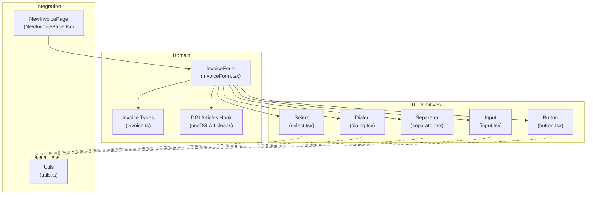
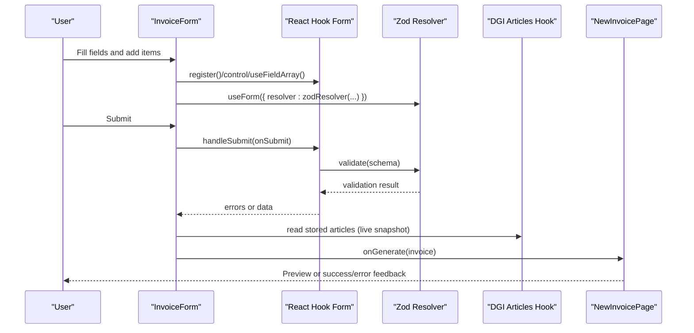
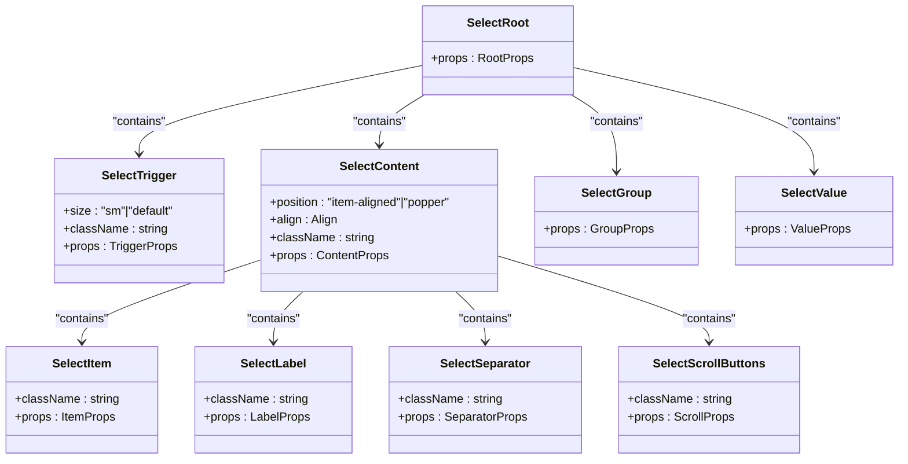
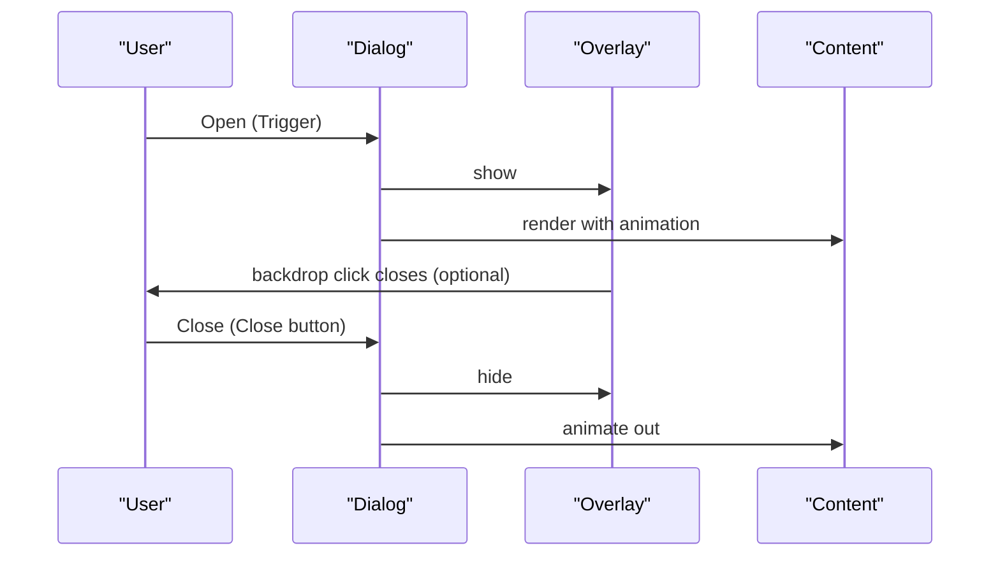
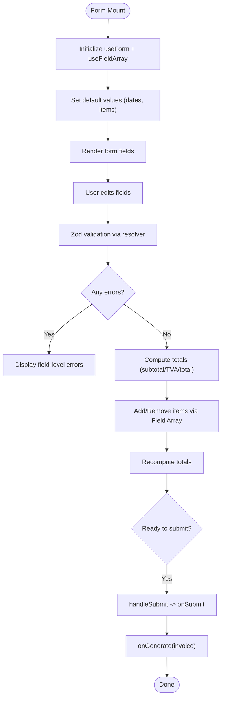
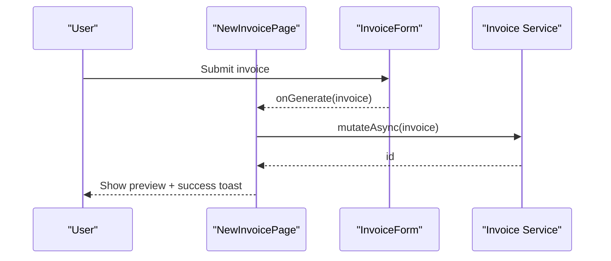
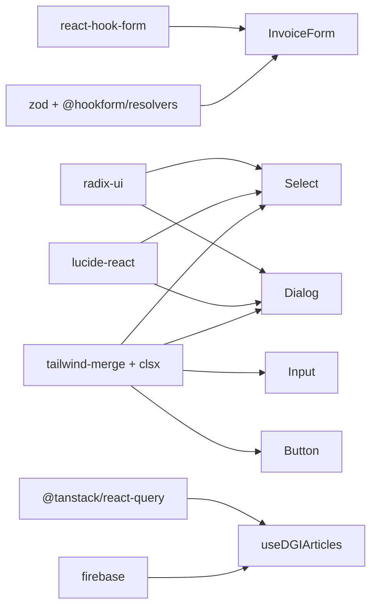

# Form Components

<cite>
**Referenced Files in This Document**
- [select.tsx](file://src/components/ui/select.tsx)
- [dialog.tsx](file://src/components/ui/dialog.tsx)
- [separator.tsx](file://src/components/ui/separator.tsx)
- [InvoiceForm.tsx](file://src/components/InvoiceForm.tsx)
- [NewInvoicePage.tsx](file://src/pages/NewInvoicePage.tsx)
- [utils.ts](file://src/lib/utils.ts)
- [invoice.ts](file://src/types/invoice.ts)
- [useDGIArticles.ts](file://src/hooks/useDGIArticles.ts)
- [input.tsx](file://src/components/ui/input.tsx)
- [button.tsx](file://src/components/ui/button.tsx)
- [package.json](file://package.json)
</cite>

## Table of Contents
1. [Introduction](#introduction)
2. [Project Structure](#project-structure)
3. [Core Components](#core-components)
4. [Architecture Overview](#architecture-overview)
5. [Detailed Component Analysis](#detailed-component-analysis)
6. [Dependency Analysis](#dependency-analysis)
7. [Performance Considerations](#performance-considerations)
8. [Accessibility and UX Compliance](#accessibility-and-ux-compliance)
9. [Troubleshooting Guide](#troubleshooting-guide)
10. [Conclusion](#conclusion)

## Introduction
This document explains ETSMEDF’s form-related UI components with a focus on Select dropdowns, Dialog modals, and Separator dividers. It details the form component architecture, state management patterns, and integration with React Hook Form for validation. It also covers Select options, filtering via datalists, and multi-select item arrays; Dialog modal behavior, backdrop handling, and focus management; and practical examples of building forms, validation workflows, and user interaction patterns. Accessibility, keyboard navigation, and mobile responsiveness are addressed throughout.

## Project Structure
The form ecosystem centers around reusable UI primitives and a domain-specific form component:
- UI primitives: Select, Dialog, Separator, Input, Button
- Domain form: InvoiceForm orchestrating React Hook Form, Zod validation, and dynamic item arrays
- Supporting utilities: shared cn() class merging, invoice math helpers, DGI article hooks
- Page integration: NewInvoicePage renders the form and previews generated invoices

**Diagram sources**
- [select.tsx](file://src/components/ui/select.tsx)
- [dialog.tsx](file://src/components/ui/dialog.tsx)
- [separator.tsx](file://src/components/ui/separator.tsx)
- [InvoiceForm.tsx](file://src/components/InvoiceForm.tsx)
- [NewInvoicePage.tsx](file://src/pages/NewInvoicePage.tsx)
- [utils.ts](file://src/lib/utils.ts)
- [invoice.ts](file://src/types/invoice.ts)
- [useDGIArticles.ts](file://src/hooks/useDGIArticles.ts)
- [input.tsx](file://src/components/ui/input.tsx)
- [button.tsx](file://src/components/ui/button.tsx)

**Section sources**
- [InvoiceForm.tsx](file://src/components/InvoiceForm.tsx)
- [NewInvoicePage.tsx](file://src/pages/NewInvoicePage.tsx)
- [package.json](file://package.json)

## Core Components
- Select: A composite component built on Radix UI primitives, exposing Root, Trigger, Content, Item, Label, Separator, Scroll buttons, Group, and Value. It supports size variants, alignment, positioning, and keyboard navigation.
- Dialog: A composite component with Root, Trigger, Portal, Close, Overlay, Content, Header/Footer, Title, and Description. It manages focus trapping, backdrop overlay, and animation states.
- Separator: A thin divider supporting horizontal and vertical orientations with proper ARIA semantics.

These components are composed into the InvoiceForm to create a structured, validated, and accessible invoice creation experience.

**Section sources**
- [select.tsx](file://src/components/ui/select.tsx)
- [dialog.tsx](file://src/components/ui/dialog.tsx)
- [separator.tsx](file://src/components/ui/separator.tsx)

## Architecture Overview
The form architecture integrates:
- Validation: Zod schemas bound to React Hook Form via @hookform/resolvers
- State: useForm/useFieldArray manage form state, errors, and dynamic item lists
- UI: Reusable primitives (Select, Dialog, Separator) styled with Tailwind and composed via cn()
- Data: Datalist-backed autocomplete for DGI articles, live updates via Firestore snapshots
- Preview: NewInvoicePage switches between form and preview after submission

**Diagram sources**
- [InvoiceForm.tsx](file://src/components/InvoiceForm.tsx)
- [NewInvoicePage.tsx](file://src/pages/NewInvoicePage.tsx)
- [useDGIArticles.ts](file://src/hooks/useDGIArticles.ts)
- [package.json](file://package.json)

## Detailed Component Analysis

### Select Dropdown Component
The Select component is a wrapper around Radix UI primitives, exposing:
- Root: container for the select
- Trigger: focusable trigger with size and invalid state styling
- Content: portal-bound dropdown with position and alignment options
- Item: selectable option with indicator and text
- Label: grouping label
- Separator: visual divider
- ScrollUp/ScrollDown buttons: for long lists
- Group: logical grouping
- Value: controlled value slot

Key behaviors:
- Size variants (sm/default) via data attributes
- Focus-visible ring and invalid-state styling via aria-invalid
- Keyboard navigation handled by Radix UI
- Positioning modes: item-aligned vs popper with directional translations
- Scroll buttons enable smooth navigation for long option sets

**Diagram sources**
- [select.tsx](file://src/components/ui/select.tsx)

Practical usage in the form:
- Autocomplete for item descriptions using a datalist of DGI articles
- Dynamic population of unit price when a matching article is selected
- Controlled updates via setValue with shouldValidate to keep validation in sync

Validation and filtering:
- The form uses a datalist to filter available article names while typing
- On description change, the hook attempts to match against stored DGI articles and auto-fill unit price

Multi-select note:
- The Select component exposes Item and Group primitives suitable for multi-select scenarios; however, the current form uses a single-select pattern for item descriptions and relies on the datalist for filtering.

**Section sources**
- [select.tsx](file://src/components/ui/select.tsx)
- [InvoiceForm.tsx](file://src/components/InvoiceForm.tsx)
- [useDGIArticles.ts](file://src/hooks/useDGIArticles.ts)

### Dialog Modal Component
The Dialog component provides:
- Root, Trigger, Portal, Close, Overlay, Content, Header/Footer, Title, Description
- Animated open/close transitions and backdrop overlay
- Optional close button and footer actions
- Focus management via Radix UI (focus trapping and restore focus)

Behavior highlights:
- Overlay fades in/out with backdrop blur effect
- Content centered with responsive max-width and padding
- Optional close button with screen-reader accessible label
- Footer supports action buttons and optional close button

**Diagram sources**
- [dialog.tsx](file://src/components/ui/dialog.tsx)

Focus management:
- Radix UI manages focus trapping inside the dialog when opened
- Closing restores focus to the trigger element

Backdrop handling:
- Overlay uses fixed positioning and z-index to capture clicks outside the content area

**Section sources**
- [dialog.tsx](file://src/components/ui/dialog.tsx)

### Separator Divider Component
The Separator component:
- Supports horizontal and vertical orientations
- Uses a thin border with appropriate dimension classes
- Decorative by default per Radix UI semantics

Usage:
- Used to visually separate sections in the form (e.g., between client info and items)

**Section sources**
- [separator.tsx](file://src/components/ui/separator.tsx)

### InvoiceForm: State Management and Validation
InvoiceForm composes React Hook Form with Zod for robust validation:
- Schema-driven validation for client info, dates, and items array
- useFieldArray for dynamic item rows with add/remove
- Watched values for real-time calculations (subtotal, TVA, total)
- Datalist-backed autocomplete for item descriptions with live DGI article updates

State management patterns:
- useForm: registers fields, controls validation, and exposes errors
- useFieldArray: manages item rows and indices
- setValue: controlled updates with shouldValidate to keep validation in sync
- watch: reactive reads of item quantities/prices for computed totals

Validation workflow:
- Zod schemas define required fields, numeric constraints, and array minimums
- Errors are rendered adjacent to fields with concise messages
- Submission triggers onGenerate callback with a fully constructed invoice object

**Diagram sources**
- [InvoiceForm.tsx](file://src/components/InvoiceForm.tsx)
- [invoice.ts](file://src/types/invoice.ts)
- [useDGIArticles.ts](file://src/hooks/useDGIArticles.ts)

**Section sources**
- [InvoiceForm.tsx](file://src/components/InvoiceForm.tsx)
- [invoice.ts](file://src/types/invoice.ts)
- [useDGIArticles.ts](file://src/hooks/useDGIArticles.ts)

### Integration Example: NewInvoicePage
NewInvoicePage integrates the form and preview:
- Renders InvoiceForm with onGenerate handler
- Stores generated invoice in state
- Persists invoice via a mutation hook and shows notifications
- Switches to preview mode after successful generation

**Diagram sources**
- [NewInvoicePage.tsx](file://src/pages/NewInvoicePage.tsx)
- [InvoiceForm.tsx](file://src/components/InvoiceForm.tsx)

**Section sources**
- [NewInvoicePage.tsx](file://src/pages/NewInvoicePage.tsx)

## Dependency Analysis
External libraries and their roles:
- react-hook-form: form state, validation, and field array management
- @hookform/resolvers + zod: schema-driven validation with Zod
- radix-ui: accessible base primitives for Select and Dialog
- lucide-react: icons for chevrons, close, plus, trash, etc.
- tailwind-merge + clsx: safe class merging for consistent styling
- @tanstack/react-query: live data fetching and mutations for DGI articles
- firebase: Firestore snapshots for live article lists and cloud functions for CRUD

**Diagram sources**
- [InvoiceForm.tsx](file://src/components/InvoiceForm.tsx)
- [select.tsx](file://src/components/ui/select.tsx)
- [dialog.tsx](file://src/components/ui/dialog.tsx)
- [input.tsx](file://src/components/ui/input.tsx)
- [button.tsx](file://src/components/ui/button.tsx)
- [useDGIArticles.ts](file://src/hooks/useDGIArticles.ts)
- [package.json](file://package.json)

**Section sources**
- [package.json](file://package.json)

## Performance Considerations
- Minimize re-renders by watching only necessary fields and computing totals from watched arrays
- Use setValue with shouldValidate selectively to avoid unnecessary validations
- Keep Select/Dialog content lightweight; leverage Radix UI portals to avoid layout thrash
- Debounce heavy operations if adding search/filter to Select options
- Memoize derived values (totals) to prevent recomputation on unrelated changes

## Accessibility and UX Compliance
Keyboard navigation:
- Select: Arrow keys, Home/End, Enter/Space navigate and select options; Escape closes without selecting
- Dialog: Tab cycles focus within the dialog; Escape closes the dialog and returns focus to trigger
- Inputs: Proper labeling via associated Label components and aria-invalid states for invalid fields

Screen reader support:
- DialogTitle and DialogDescription provide context
- sr-only span for close button ensures assistive tech announces “Close”
- aria-invalid on inputs communicates validation state

Mobile responsiveness:
- Responsive grid layouts adapt from single column on small screens to multi-column on larger screens
- Touch-friendly button sizes and spacing
- Dialog content adapts to viewport with centered positioning and max-width constraints

Best practices demonstrated:
- Focus-visible rings and clear focus styles
- Disabled states for buttons and inputs
- Semantic HTML and ARIA roles via Radix UI

**Section sources**
- [select.tsx](file://src/components/ui/select.tsx)
- [dialog.tsx](file://src/components/ui/dialog.tsx)
- [InvoiceForm.tsx](file://src/components/InvoiceForm.tsx)
- [input.tsx](file://src/components/ui/input.tsx)
- [button.tsx](file://src/components/ui/button.tsx)

## Troubleshooting Guide
Common issues and resolutions:
- Validation not updating after programmatic changes:
  - Use setValue with shouldValidate to re-run validation for the affected field
- Datalist not filtering options:
  - Ensure the datalist id matches the input list attribute and options are populated
- Dialog does not trap focus:
  - Verify DialogPortal wraps DialogContent and that no custom focus management conflicts with Radix UI
- Select options not visible:
  - Confirm Content is rendered via Portal and positioned correctly; check z-index and parent overflow
- Totals not recalculating:
  - Ensure watched items are normalized to numbers and totals are computed from watched values
- Live DGI article updates not reflected:
  - Confirm Firestore snapshot subscription is active and selected EUF ID is set

**Section sources**
- [InvoiceForm.tsx](file://src/components/InvoiceForm.tsx)
- [useDGIArticles.ts](file://src/hooks/useDGIArticles.ts)
- [dialog.tsx](file://src/components/ui/dialog.tsx)
- [select.tsx](file://src/components/ui/select.tsx)

## Conclusion
ETSMEDF’s form components combine accessible primitives (Select, Dialog, Separator) with a robust validation pipeline powered by React Hook Form and Zod. The InvoiceForm demonstrates effective state management, dynamic item arrays, live data integration, and thoughtful UX patterns. By leveraging Radix UI for accessibility and Tailwind for styling, the system remains maintainable, responsive, and inclusive across devices and assistive technologies.