# Frontend Components

<cite>
**Referenced Files in This Document**
- [button.tsx](file://src/components/ui/button.tsx)
- [input.tsx](file://src/components/ui/input.tsx)
- [card.tsx](file://src/components/ui/card.tsx)
- [dialog.tsx](file://src/components/ui/dialog.tsx)
- [table.tsx](file://src/components/ui/table.tsx)
- [badge.tsx](file://src/components/ui/badge.tsx)
- [label.tsx](file://src/components/ui/label.tsx)
- [select.tsx](file://src/components/ui/select.tsx)
- [separator.tsx](file://src/components/ui/separator.tsx)
- [scroll-area.tsx](file://src/components/ui/scroll-area.tsx)
- [sonner.tsx](file://src/components/ui/sonner.tsx)
- [components.json](file://components.json)
- [package.json](file://package.json)
- [utils.ts](file://src/lib/utils.ts)
- [index.css](file://src/index.css)
</cite>

## Table of Contents
1. [Introduction](#introduction)
2. [Project Structure](#project-structure)
3. [Core Components](#core-components)
4. [Architecture Overview](#architecture-overview)
5. [Detailed Component Analysis](#detailed-component-analysis)
6. [Dependency Analysis](#dependency-analysis)
7. [Performance Considerations](#performance-considerations)
8. [Accessibility and Cross-Browser Compatibility](#accessibility-and-cross-browser-compatibility)
9. [Theming and Design System](#theming-and-design-system)
10. [Integration Patterns](#integration-patterns)
11. [Customization Guidelines](#customization-guidelines)
12. [Troubleshooting Guide](#troubleshooting-guide)
13. [Conclusion](#conclusion)

## Introduction
This document describes ETSMEDF's UI component library built on shadcn/ui and Radix UI primitives. It explains the component architecture, design system implementation via Tailwind CSS and CSS variables, and customization options. Each major component—buttons, inputs, cards, dialogs, and tables—is documented with props, events, usage patterns, and composition examples. Additional topics include theming with next-themes, accessibility features, responsive design, animations, integration with React Hook Form, and guidelines for extending the component library.

## Project Structure
The UI components live under src/components/ui and are organized by atomic design principles: base elements (input, label), interactive controls (button, select), layout containers (card, scroll-area), overlays (dialog), data presentation (table), and feedback (sonner). Shared utilities and styling are centralized in src/lib/utils.ts and src/index.css. The project configuration for shadcn/ui is defined in components.json, while dependencies are managed in package.json.

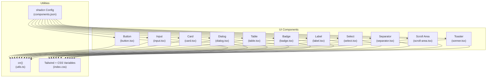

**Diagram sources**
- [button.tsx:1-65](file://src/components/ui/button.tsx#L1-L65)
- [input.tsx:1-22](file://src/components/ui/input.tsx#L1-L22)
- [card.tsx:1-93](file://src/components/ui/card.tsx#L1-L93)
- [dialog.tsx:1-159](file://src/components/ui/dialog.tsx#L1-L159)
- [table.tsx:1-117](file://src/components/ui/table.tsx#L1-L117)
- [badge.tsx:1-49](file://src/components/ui/badge.tsx#L1-L49)
- [label.tsx:1-23](file://src/components/ui/label.tsx#L1-L23)
- [select.tsx:1-191](file://src/components/ui/select.tsx#L1-L191)
- [separator.tsx:1-27](file://src/components/ui/separator.tsx#L1-L27)
- [scroll-area.tsx:1-57](file://src/components/ui/scroll-area.tsx#L1-L57)
- [sonner.tsx:1-39](file://src/components/ui/sonner.tsx#L1-L39)
- [utils.ts:1-7](file://src/lib/utils.ts#L1-L7)
- [index.css:1-124](file://src/index.css#L1-L124)
- [components.json:1-24](file://components.json#L1-L24)

**Section sources**
- [components.json:1-24](file://components.json#L1-L24)
- [package.json:1-56](file://package.json#L1-L56)
- [utils.ts:1-7](file://src/lib/utils.ts#L1-L7)
- [index.css:1-124](file://src/index.css#L1-L124)

## Core Components
This section documents the primary UI components and their capabilities.

- Button
  - Purpose: Action triggers with multiple variants and sizes.
  - Props: className, variant, size, asChild, plus native button attributes.
  - Variants: default, destructive, outline, secondary, ghost, link.
  - Sizes: default, xs, sm, lg, icon, icon-xs, icon-sm, icon-lg.
  - Accessibility: Focus-visible ring, aria-invalid integration, SVG pointer events.
  - Composition: Supports asChild to render any element; integrates with icons.

- Input
  - Purpose: Text field with consistent focus states and invalid state styling.
  - Props: className, type, plus native input attributes.
  - States: Focus ring, disabled, aria-invalid.
  - Responsive: Font sizing adapts across breakpoints.

- Card
  - Purpose: Content grouping with header, title, description, action, content, footer slots.
  - Slots: CardHeader, CardTitle, CardDescription, CardAction, CardContent, CardFooter.
  - Layout: Grid-based header layout with optional action column.

- Dialog
  - Purpose: Modal overlay with animated transitions and close controls.
  - Parts: Root, Trigger, Portal, Overlay, Content, Header, Footer, Title, Description, Close.
  - Animations: Fade and zoom transitions driven by open/closed state.
  - Accessibility: Focus trapping, close button with screen reader label.

- Table
  - Purpose: Scrollable data table with semantic markup and hover/selection states.
  - Parts: Table container, TableHeader, TableBody, TableFooter, TableRow, TableHead, TableCell, TableCaption.
  - Responsiveness: Horizontal scrolling container for small screens.

- Badge
  - Purpose: Label-like indicators with variants and optional child rendering.
  - Variants: default, secondary, destructive, outline, ghost, link.
  - Composition: asChild support to wrap links or other elements.

- Label
  - Purpose: Associated text for form controls with disabled and peer states.
  - Interaction: Integrates with form controls via peer selectors.

- Select
  - Purpose: Dropdown selector with scrollable viewport and item indicators.
  - Parts: Root, Group, Value, Trigger, Content, Label, Item, Separator, Scroll buttons.
  - Behavior: Positioning modes, alignment, and scroll behavior.

- Separator
  - Purpose: Visual divider with horizontal/vertical orientations.

- Scroll Area
  - Purpose: Container with custom scrollbar and viewport.
  - Parts: ScrollArea, ScrollBar with orientation support.

- Toaster (Sonner)
  - Purpose: Notification toast system integrated with next-themes.
  - Theming: Inherits CSS variables from theme; icons mapped per severity.

**Section sources**
- [button.tsx:1-65](file://src/components/ui/button.tsx#L1-L65)
- [input.tsx:1-22](file://src/components/ui/input.tsx#L1-L22)
- [card.tsx:1-93](file://src/components/ui/card.tsx#L1-L93)
- [dialog.tsx:1-159](file://src/components/ui/dialog.tsx#L1-L159)
- [table.tsx:1-117](file://src/components/ui/table.tsx#L1-L117)
- [badge.tsx:1-49](file://src/components/ui/badge.tsx#L1-L49)
- [label.tsx:1-23](file://src/components/ui/label.tsx#L1-L23)
- [select.tsx:1-191](file://src/components/ui/select.tsx#L1-L191)
- [separator.tsx:1-27](file://src/components/ui/separator.tsx#L1-L27)
- [scroll-area.tsx:1-57](file://src/components/ui/scroll-area.tsx#L1-L57)
- [sonner.tsx:1-39](file://src/components/ui/sonner.tsx#L1-L39)

## Architecture Overview
The component library follows a consistent pattern:
- Base utilities: cn() merges Tailwind classes safely.
- Design tokens: CSS variables define color and radius scales.
- Variants: class-variance-authority powers variant and size combinations.
- Primitives: Radix UI ensures accessibility and cross-browser stability.
- Theming: next-themes integrates with CSS variables for light/dark modes.
- Notifications: Sonner consumes theme variables and maps icons.

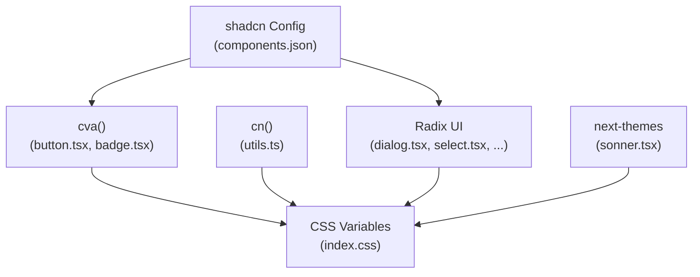

**Diagram sources**
- [utils.ts:1-7](file://src/lib/utils.ts#L1-L7)
- [index.css:1-124](file://src/index.css#L1-L124)
- [button.tsx:7-39](file://src/components/ui/button.tsx#L7-L39)
- [badge.tsx:7-27](file://src/components/ui/badge.tsx#L7-L27)
- [dialog.tsx:1-159](file://src/components/ui/dialog.tsx#L1-L159)
- [select.tsx:1-191](file://src/components/ui/select.tsx#L1-L191)
- [sonner.tsx:1-39](file://src/components/ui/sonner.tsx#L1-L39)
- [components.json:1-24](file://components.json#L1-L24)

## Detailed Component Analysis

### Button Component
- Implementation pattern: Uses cva for variants/sizes; supports asChild to render any element.
- Props: className, variant, size, asChild, plus button attributes.
- Events: Inherits all button events; focus-visible ring handled internally.
- Usage patterns:
  - Icon buttons: use icon variants and sizes.
  - Link-like actions: use link variant with anchor asChild.
  - Validation feedback: combine with aria-invalid for form states.

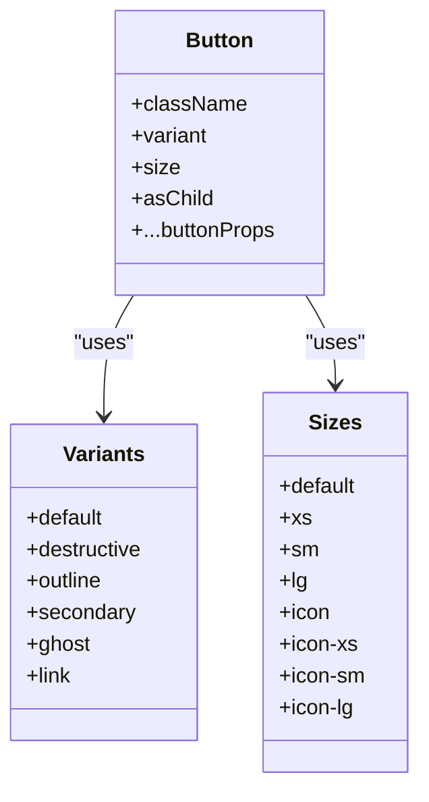

**Diagram sources**
- [button.tsx:7-39](file://src/components/ui/button.tsx#L7-L39)

**Section sources**
- [button.tsx:1-65](file://src/components/ui/button.tsx#L1-L65)

### Input Component
- Implementation pattern: Wraps native input with focus and invalid state styling.
- Props: className, type, plus input attributes.
- Accessibility: Focus ring, disabled state, aria-invalid integration.

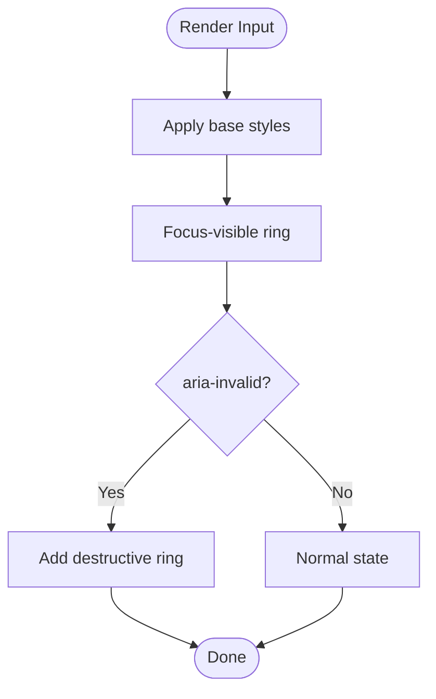

**Diagram sources**
- [input.tsx:5-19](file://src/components/ui/input.tsx#L5-L19)

**Section sources**
- [input.tsx:1-22](file://src/components/ui/input.tsx#L1-L22)

### Card Component Family
- Composition: Card with multiple sub-components for structured layouts.
- Slots: Header, Title, Description, Action, Content, Footer.
- Responsive: Header grid adapts to presence of action slot.

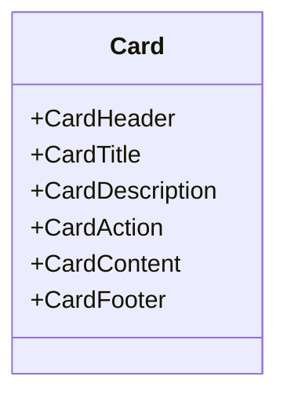

**Diagram sources**
- [card.tsx:5-92](file://src/components/ui/card.tsx#L5-L92)

**Section sources**
- [card.tsx:1-93](file://src/components/ui/card.tsx#L1-L93)

### Dialog Component Family
- Implementation pattern: Composed from Radix UI primitives with animations and overlay.
- Props: showCloseButton flag for content/footer; all parts accept className and primitive props.
- Accessibility: Close button with hidden label; portal rendering; overlay click-to-close.

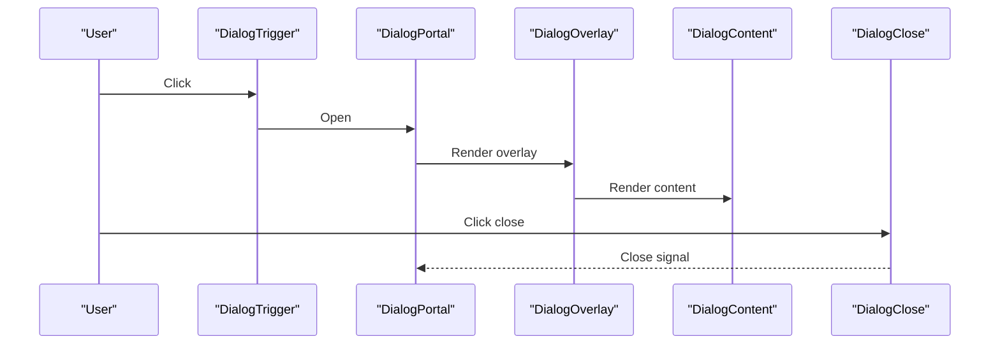

**Diagram sources**
- [dialog.tsx:10-82](file://src/components/ui/dialog.tsx#L10-L82)

**Section sources**
- [dialog.tsx:1-159](file://src/components/ui/dialog.tsx#L1-L159)

### Table Component Family
- Implementation pattern: Wrapper div enables horizontal scrolling; semantic table elements.
- States: Hover, selection, expanded rows via aria and data attributes.

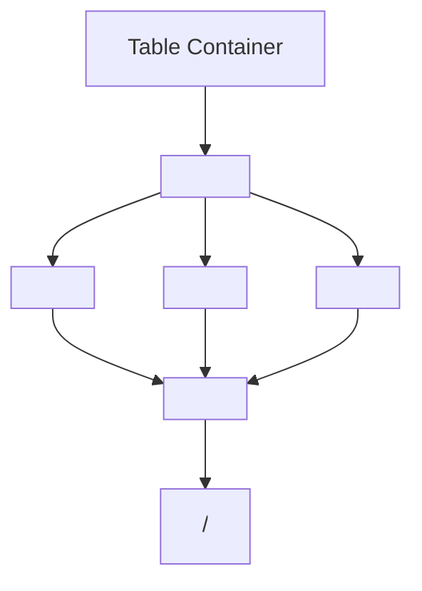

**Diagram sources**
- [table.tsx:7-105](file://src/components/ui/table.tsx#L7-L105)

**Section sources**
- [table.tsx:1-117](file://src/components/ui/table.tsx#L1-L117)

### Badge Component
- Implementation pattern: Similar to Button but for labels; supports asChild.
- Variants: default, secondary, destructive, outline, ghost, link.

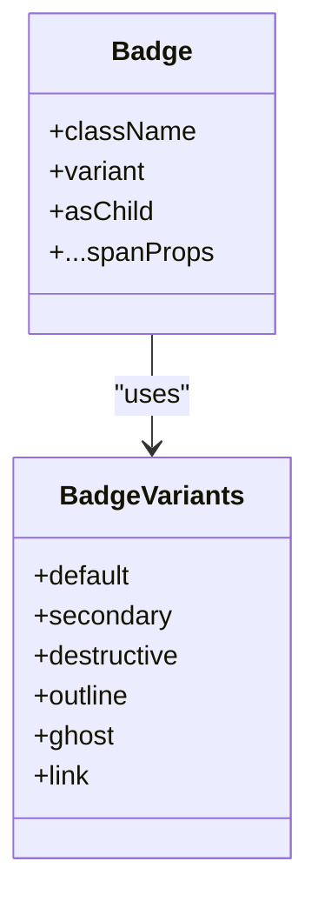

**Diagram sources**
- [badge.tsx:7-27](file://src/components/ui/badge.tsx#L7-L27)

**Section sources**
- [badge.tsx:1-49](file://src/components/ui/badge.tsx#L1-L49)

### Label Component
- Implementation pattern: Wraps Radix Label with group/disabled and peer states.
- Usage: Associates with form controls for improved UX.

**Section sources**
- [label.tsx:1-23](file://src/components/ui/label.tsx#L1-L23)

### Select Component Family
- Implementation pattern: Root + Trigger + Content + Items; supports groups and separators.
- Props: size for trigger height, position mode, alignment.
- Behavior: Scroll buttons, viewport sizing, item indicators.

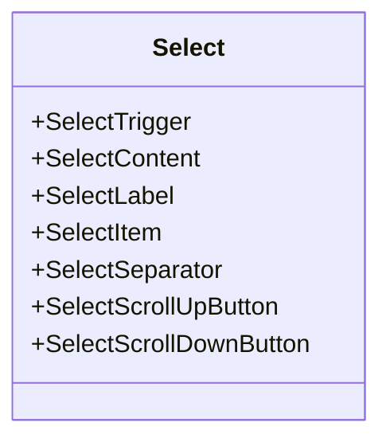

**Diagram sources**
- [select.tsx:9-190](file://src/components/ui/select.tsx#L9-L190)

**Section sources**
- [select.tsx:1-191](file://src/components/ui/select.tsx#L1-L191)

### Separator Component
- Implementation pattern: Thin divider with orientation control.

**Section sources**
- [separator.tsx:1-27](file://src/components/ui/separator.tsx#L1-L27)

### Scroll Area Component
- Implementation pattern: Root with viewport and scrollbar; corner element included.
- Props: orientation for scrollbar direction.

**Section sources**
- [scroll-area.tsx:1-57](file://src/components/ui/scroll-area.tsx#L1-L57)

### Toaster (Sonner) Component
- Implementation pattern: next-themes integration with CSS variable mapping; icon mapping per severity.
- Props: standard Sonner ToasterProps.

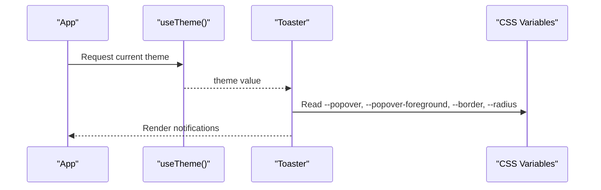

**Diagram sources**
- [sonner.tsx:11-36](file://src/components/ui/sonner.tsx#L11-L36)

**Section sources**
- [sonner.tsx:1-39](file://src/components/ui/sonner.tsx#L1-L39)

## Dependency Analysis
External libraries and their roles:
- class-variance-authority: Provides variant and size systems for components.
- radix-ui: Accessible UI primitives for dialogs, selects, scroll areas.
- lucide-react: Icons used across components (e.g., dialog close, select chevrons).
- next-themes: Theme provider enabling light/dark switching.
- sonner: Notification system integrated with theme.
- tailwind-merge and clsx: Safe class merging.
- @tailwindcss/vite and tailwindcss v4: Utility-first styling engine.

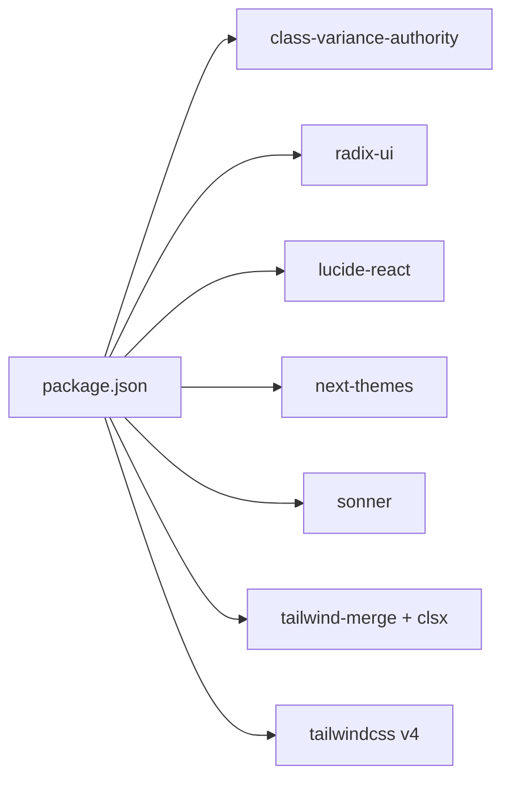

**Diagram sources**
- [package.json:12-31](file://package.json#L12-L31)

**Section sources**
- [package.json:1-56](file://package.json#L1-L56)

## Performance Considerations
- Prefer variant and size props over ad-hoc classes to leverage class merging and reduce runtime overhead.
- Use asChild where appropriate to avoid unnecessary DOM wrappers.
- Keep dialog and select content minimal; defer heavy computations to after mount or via lazy loading.
- Utilize CSS variables for theming to avoid expensive reflows during theme switches.
- Limit nested animations; rely on Radix UI transitions for smoothness.

## Accessibility and Cross-Browser Compatibility
- Accessibility:
  - Focus management: Components apply focus-visible rings and outline utilities.
  - ARIA integration: aria-invalid states propagate to focus rings and validation feedback.
  - Screen readers: Dialog close buttons include hidden labels; labels associate with controls.
  - Keyboard navigation: Radix UI primitives ensure robust keyboard handling.
- Cross-browser:
  - Radix UI provides consistent behavior across browsers.
  - CSS variables and Tailwind utilities are broadly supported; ensure polyfills if legacy browser targets require custom properties.

## Theming and Design System
- Design tokens:
  - CSS variables define color scales and radii; index.css maps Tailwind variables to CSS variables.
  - Light/dark roots set contrasting values for backgrounds, foregrounds, and borders.
- Integration:
  - next-themes manages theme switching; Sonner reads theme to style notifications.
  - shadcn config (components.json) sets style, icon library, and aliases for consistent imports.

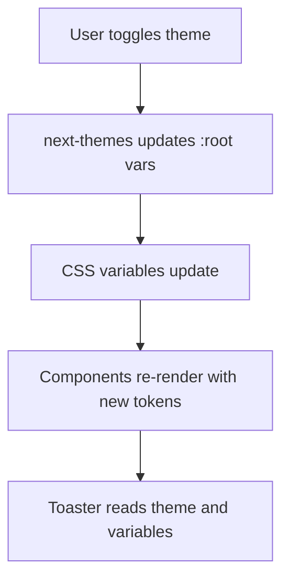

**Diagram sources**
- [index.css:48-115](file://src/index.css#L48-L115)
- [sonner.tsx:11-36](file://src/components/ui/sonner.tsx#L11-L36)
- [components.json:3-21](file://components.json#L3-L21)

**Section sources**
- [index.css:1-124](file://src/index.css#L1-L124)
- [sonner.tsx:1-39](file://src/components/ui/sonner.tsx#L1-L39)
- [components.json:1-24](file://components.json#L1-L24)

## Integration Patterns
- Form building:
  - Combine Input with Label for labeled fields; use aria-invalid for validation states.
  - Use Button variants for submit vs destructive actions.
  - Use Select for dropdowns; pair with form control libraries for validation.
- Composition:
  - CardHeader with CardTitle and CardAction for contextual actions.
  - DialogHeader with DialogTitle and DialogDescription for modal content.
  - Table with TableCaption for summaries and TableFooter for totals.
- Animation:
  - Leverage Radix UI transitions for Dialog and Select.
  - Use Tailwind utilities for simple transitions; animate.css is imported for additional effects.

## Customization Guidelines
- Extend variants:
  - Add new variants via cva in Button and Badge by following existing patterns.
- Customize sizes:
  - Define new sizes in cva configurations; ensure consistent padding and height.
- Theming overrides:
  - Adjust CSS variables in :root and .dark blocks to change global palette.
  - Override component-specific variables via data-slot attributes if needed.
- Adding new components:
  - Follow the existing folder structure and naming conventions.
  - Use cn() for class merging; integrate with CSS variables for theming.
  - Wrap with Radix UI primitives for accessibility; add data-slot attributes for testing.

## Troubleshooting Guide
- Styles not applying:
  - Verify Tailwind is configured and CSS variables are present in :root and .dark.
  - Ensure cn() is used to merge classes correctly.
- Dialog not closing:
  - Confirm DialogClose is rendered and accessible; check portal mounting.
- Select items not visible:
  - Ensure SelectContent is rendered inside a DialogPortal or page-level portal.
- Validation feedback missing:
  - Apply aria-invalid on inputs; confirm focus rings reflect the state.
- Notifications not themed:
  - Confirm next-themes is initialized and CSS variables are defined.

**Section sources**
- [utils.ts:1-7](file://src/lib/utils.ts#L1-L7)
- [dialog.tsx:50-82](file://src/components/ui/dialog.tsx#L50-L82)
- [select.tsx:53-88](file://src/components/ui/select.tsx#L53-L88)
- [input.tsx:5-19](file://src/components/ui/input.tsx#L5-L19)
- [sonner.tsx:11-36](file://src/components/ui/sonner.tsx#L11-L36)

## Conclusion
ETSMEDF’s UI library combines shadcn/ui design tokens with Radix UI primitives and Tailwind CSS to deliver accessible, themeable components. The system emphasizes composability, consistent variants and sizes, and seamless integration with forms and themes. By following the provided patterns and customization guidelines, teams can extend the library reliably while maintaining design consistency and cross-browser compatibility.