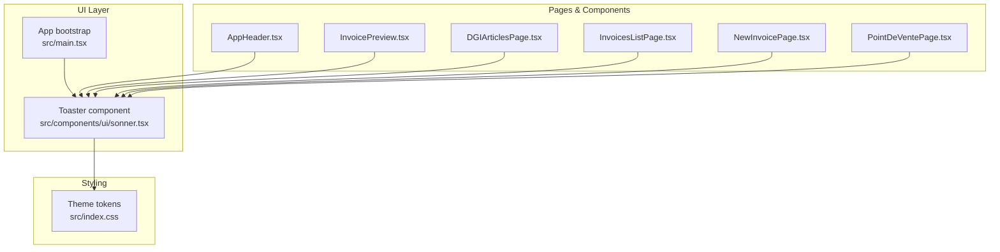
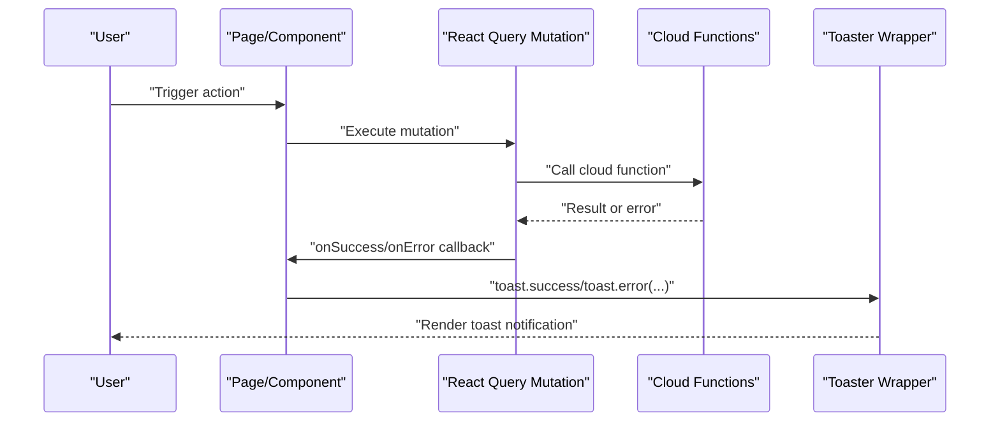
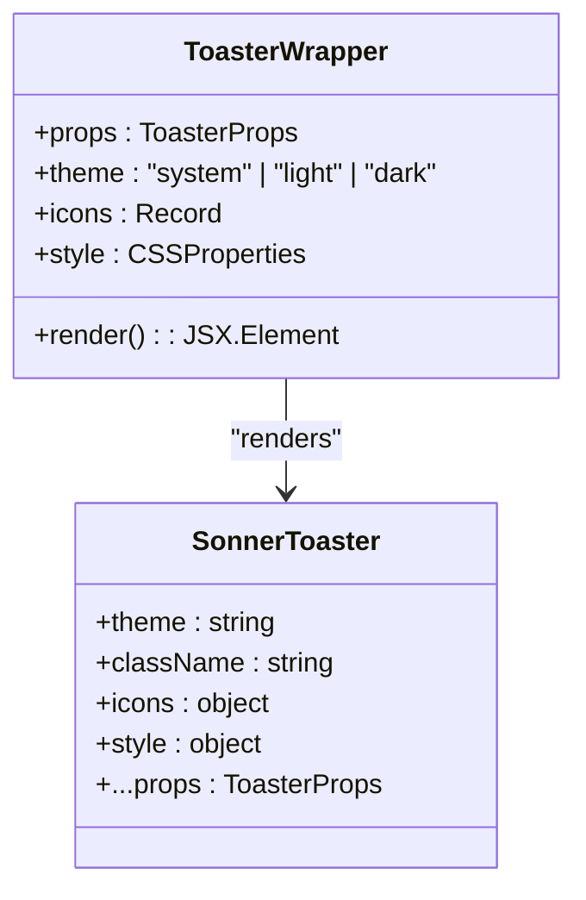
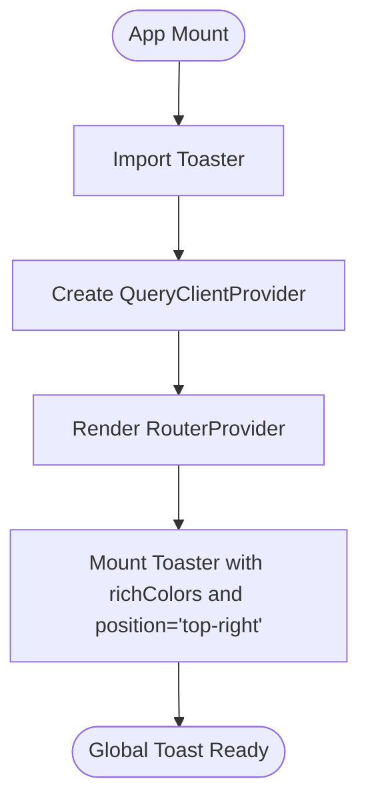
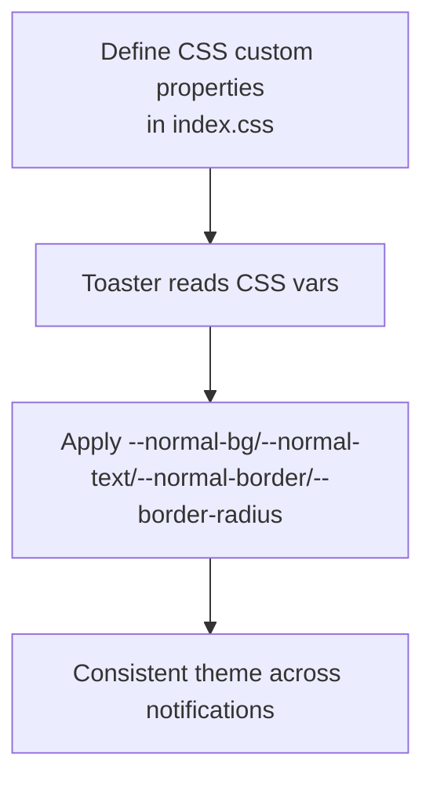
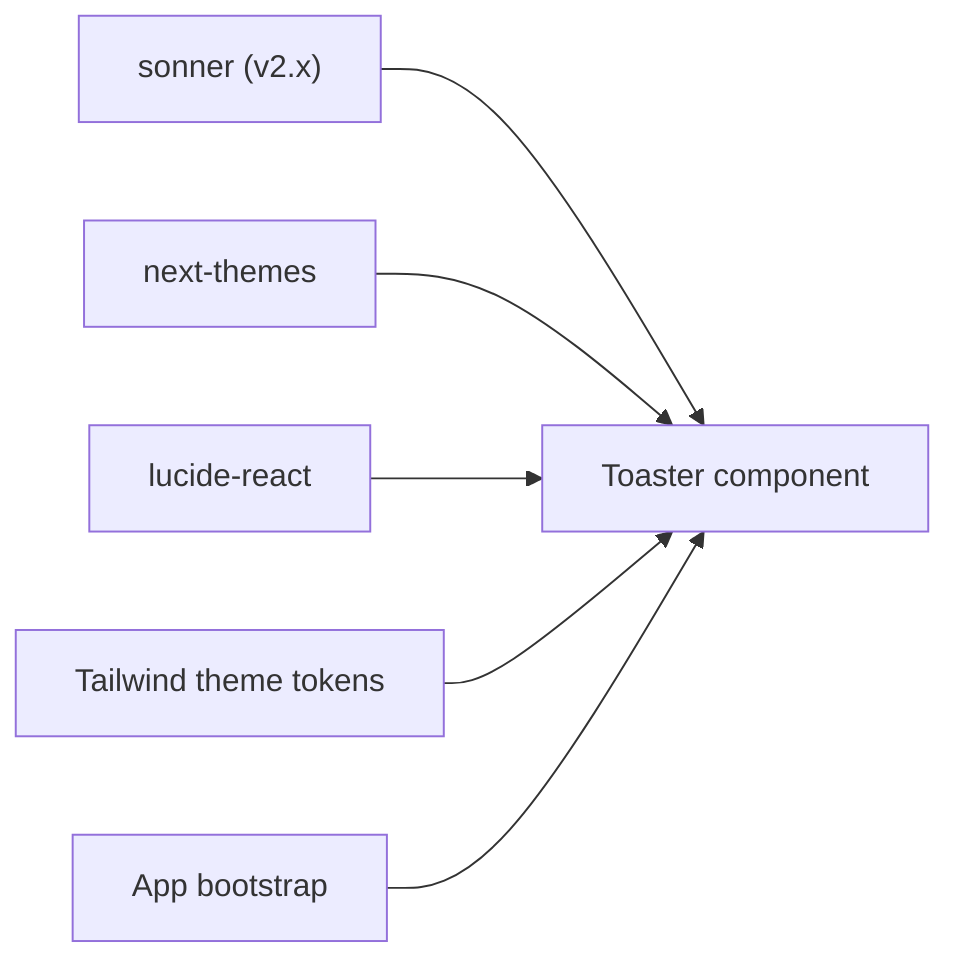

# Notification Components

<cite>
**Referenced Files in This Document**
- [sonner.tsx](file://src/components/ui/sonner.tsx)
- [main.tsx](file://src/main.tsx)
- [index.css](file://src/index.css)
- [AppHeader.tsx](file://src/components/AppHeader.tsx)
- [InvoicePreview.tsx](file://src/components/InvoicePreview.tsx)
- [DGIArticlesPage.tsx](file://src/pages/DGIArticlesPage.tsx)
- [InvoicesListPage.tsx](file://src/pages/InvoicesListPage.tsx)
- [NewInvoicePage.tsx](file://src/pages/NewInvoicePage.tsx)
- [PointDeVentePage.tsx](file://src/pages/PointDeVentePage.tsx)
- [useInvoices.ts](file://src/hooks/useInvoices.ts)
- [package.json](file://package.json)
</cite>

## Table of Contents
1. [Introduction](#introduction)
2. [Project Structure](#project-structure)
3. [Core Components](#core-components)
4. [Architecture Overview](#architecture-overview)
5. [Detailed Component Analysis](#detailed-component-analysis)
6. [Dependency Analysis](#dependency-analysis)
7. [Performance Considerations](#performance-considerations)
8. [Troubleshooting Guide](#troubleshooting-guide)
9. [Conclusion](#conclusion)
10. [Appendices](#appendices)

## Introduction
This document explains ETSMEDF’s notification system built on Sonner toasts. It covers positioning, timing, visual styling, notification types, stacking behavior, auto-dismiss, user interactions, integration patterns with forms and API responses, accessibility considerations, and customization options. The system is configured globally and leverages Lucide icons and Tailwind-based theme tokens for consistent visuals.

## Project Structure
The notification system spans a small set of focused files:
- Global Toaster wrapper that configures icons, theme, and styles
- Application bootstrap that mounts the Toaster with default position
- Theme tokens defined via CSS custom properties for consistent styling
- Page and component files that import and use toast APIs for user feedback

**Diagram sources**
- [sonner.tsx:1-39](file://src/components/ui/sonner.tsx#L1-L39)
- [main.tsx:1-22](file://src/main.tsx#L1-L22)
- [index.css:1-124](file://src/index.css#L1-L124)
- [AppHeader.tsx:1-40](file://src/components/AppHeader.tsx#L1-L40)
- [InvoicePreview.tsx:1-40](file://src/components/InvoicePreview.tsx#L1-L40)
- [DGIArticlesPage.tsx:1-40](file://src/pages/DGIArticlesPage.tsx#L1-L40)
- [InvoicesListPage.tsx:1-40](file://src/pages/InvoicesListPage.tsx#L1-L40)
- [NewInvoicePage.tsx:1-40](file://src/pages/NewInvoicePage.tsx#L1-L40)
- [PointDeVentePage.tsx:1-40](file://src/pages/PointDeVentePage.tsx#L1-L40)

**Section sources**
- [sonner.tsx:1-39](file://src/components/ui/sonner.tsx#L1-L39)
- [main.tsx:1-22](file://src/main.tsx#L1-L22)
- [index.css:1-124](file://src/index.css#L1-L124)

## Core Components
- Toaster wrapper: Provides themed icons, CSS variable-based styling, and passes through Sonner props.
- Application mount: Registers the Toaster with default position and rich colors.
- Theme tokens: Define CSS variables for background, text, border, and border radius used by the Toaster.

Key behaviors:
- Positioning: Top-right corner by default.
- Icons: Success, info, warning, error, and loading icons from Lucide.
- Styling: Uses Tailwind theme tokens via CSS custom properties for consistent look-and-feel.
- Stacking: Sonner manages stacking automatically; notifications appear in order of creation.

**Section sources**
- [sonner.tsx:11-36](file://src/components/ui/sonner.tsx#L11-L36)
- [main.tsx:17](file://src/main.tsx#L17)
- [index.css:47-46](file://src/index.css#L47-L46)

## Architecture Overview
The Toaster is a thin wrapper around Sonner that injects icons and theme-aware styles. It is mounted at the application root and is globally available to all pages and components. Pages import the toast API and trigger notifications after user actions or API outcomes.

**Diagram sources**
- [useInvoices.ts:60-89](file://src/hooks/useInvoices.ts#L60-L89)
- [main.tsx:17](file://src/main.tsx#L17)

## Detailed Component Analysis

### Toaster Wrapper
The Toaster component:
- Reads the current theme via next-themes
- Applies Lucide icons for each notification type
- Injects CSS variables mapped to Tailwind theme tokens
- Accepts all Sonner ToasterProps and forwards them

**Diagram sources**
- [sonner.tsx:11-36](file://src/components/ui/sonner.tsx#L11-L36)

**Section sources**
- [sonner.tsx:11-36](file://src/components/ui/sonner.tsx#L11-L36)

### Application Bootstrap
The Toaster is mounted in the app root with:
- richColors enabled
- position set to top-right
- Theme propagation from next-themes

**Diagram sources**
- [main.tsx:12-21](file://src/main.tsx#L12-L21)

**Section sources**
- [main.tsx:17](file://src/main.tsx#L17)

### Theme Tokens and Styling
Tailwind theme tokens are exposed as CSS custom properties and consumed by the Toaster:
- Background, foreground, border, and border radius are mapped from theme variables
- This ensures notifications match the current theme and design system

**Diagram sources**
- [index.css:47-46](file://src/index.css#L47-L46)
- [sonner.tsx:25-32](file://src/components/ui/sonner.tsx#L25-L32)

**Section sources**
- [index.css:47-46](file://src/index.css#L47-L46)
- [sonner.tsx:25-32](file://src/components/ui/sonner.tsx#L25-L32)

### Notification Types and Use Cases
- Success: Confirm long-running tasks or successful operations
- Error: Surface failures, missing data, or API errors
- Warning: Inform about potential issues or non-fatal conditions
- Info: Provide contextual information or tips
- Loading: Indicate asynchronous work in progress

These types are mapped to Lucide icons and styled via theme tokens for immediate visual recognition.

**Section sources**
- [sonner.tsx:18-24](file://src/components/ui/sonner.tsx#L18-L24)

### Stacking Behavior and Auto-dismiss
- Stacking: Notifications stack vertically; Sonner manages ordering automatically.
- Auto-dismiss: Default durations are handled by Sonner; custom durations can be passed per toast.
- Dismiss controls: Users can dismiss individual toasts; global pause-on-hover behavior is managed by Sonner.

[No sources needed since this section provides general guidance]

### User Interaction Patterns
Common patterns observed in the codebase:
- Form submissions: Trigger loading toast while submitting, show success or error based on outcome
- API responses: Display info for informational updates, success for completion, error for failures
- System alerts: Use warning for recoverable issues, error for critical failures

Integration points:
- Pages import the toast API and call toast methods after actions
- Hooks encapsulate mutations and invoke toast callbacks on success/error

**Section sources**
- [AppHeader.tsx:1-40](file://src/components/AppHeader.tsx#L1-L40)
- [InvoicePreview.tsx:1-40](file://src/components/InvoicePreview.tsx#L1-L40)
- [DGIArticlesPage.tsx:1-40](file://src/pages/DGIArticlesPage.tsx#L1-L40)
- [InvoicesListPage.tsx:1-40](file://src/pages/InvoicesListPage.tsx#L1-L40)
- [NewInvoicePage.tsx:1-40](file://src/pages/NewInvoicePage.tsx#L1-L40)
- [PointDeVentePage.tsx:1-40](file://src/pages/PointDeVentePage.tsx#L1-L40)
- [useInvoices.ts:60-89](file://src/hooks/useInvoices.ts#L60-L89)

### Practical Integration Examples
- Form submissions: Show a loading toast during submission; on success, replace with a success toast; on failure, show an error toast with a concise message.
- API responses: After a mutation completes, display a success toast; if the backend returns a specific error message, surface it in an error toast.
- System alerts: Use warning to inform about recoverable issues (e.g., missing articles); use error for unrecoverable failures.

Implementation pattern:
- Import toast from sonner in the component
- Call toast.loading(...) before starting async work
- On completion, call toast.success(...) or toast.error(...) with a clear message

**Section sources**
- [useInvoices.ts:60-89](file://src/hooks/useInvoices.ts#L60-L89)

### Accessibility Considerations
- Screen readers: Sonner integrates with native accessibility semantics; ensure messages are concise and descriptive.
- Keyboard navigation: Toasts are not focusable by default; rely on programmatic dismissal and avoid blocking focus.
- Focus management: After dismissing a toast, return focus to the most relevant element (e.g., the triggering button or form field).
- Contrast and readability: Rely on theme tokens for sufficient contrast; avoid overly bright colors.

[No sources needed since this section provides general guidance]

### Customization Options
- Colors: Controlled via theme tokens; adjust CSS variables in index.css to change background, text, and border colors.
- Animations: Sonner provides built-in transitions; customize via ToasterProps if needed.
- Positioning: Set via ToasterProps.position; currently configured to top-right in the app bootstrap.
- Icons: Replace Lucide icons in the Toaster wrapper with custom SVGs if desired.

**Section sources**
- [sonner.tsx:18-24](file://src/components/ui/sonner.tsx#L18-L24)
- [main.tsx:17](file://src/main.tsx#L17)
- [index.css:47-46](file://src/index.css#L47-L46)

## Dependency Analysis
The notification system depends on:
- Sonner for toast rendering and behavior
- next-themes for theme awareness
- Lucide React for icons
- Tailwind CSS for theme tokens

**Diagram sources**
- [package.json:28](file://package.json#L28)
- [sonner.tsx:1-9](file://src/components/ui/sonner.tsx#L1-L9)
- [main.tsx:5](file://src/main.tsx#L5)

**Section sources**
- [package.json:28](file://package.json#L28)
- [sonner.tsx:1-9](file://src/components/ui/sonner.tsx#L1-L9)
- [main.tsx:5](file://src/main.tsx#L5)

## Performance Considerations
- Keep toast messages concise to minimize DOM and layout work.
- Avoid excessive concurrent toasts; batch related updates when possible.
- Use theme tokens to reduce style recalculation overhead.
- Leverage Sonner defaults for durations to balance user attention and performance.

[No sources needed since this section provides general guidance]

## Troubleshooting Guide
- No toasts appear:
  - Verify Toaster is rendered in the app root.
  - Ensure Sonner is installed and imported correctly.
- Incorrect icons or styling:
  - Confirm Toaster wrapper is used and icons are properly imported.
  - Check that theme tokens are defined and applied.
- Positioning issues:
  - Adjust ToasterProps.position in the app bootstrap.
- Duration or stacking problems:
  - Review Sonner defaults and pass explicit durations or stacking options if needed.

**Section sources**
- [main.tsx:17](file://src/main.tsx#L17)
- [sonner.tsx:18-32](file://src/components/ui/sonner.tsx#L18-L32)

## Conclusion
ETSMEDF’s notification system leverages Sonner with a minimal wrapper to deliver themed, icon-rich toasts positioned at the top-right. The setup ensures consistent visuals via Tailwind theme tokens, supports all standard notification types, and integrates cleanly with page actions and API responses. By following the documented patterns and accessibility guidelines, teams can maintain reliable, user-friendly feedback across the application.

## Appendices
- Example toast usage locations:
  - App header actions
  - Invoice preview interactions
  - DGI article management
  - Invoices list operations
  - New invoice creation
  - Point-of-sale interactions

**Section sources**
- [AppHeader.tsx:1-40](file://src/components/AppHeader.tsx#L1-L40)
- [InvoicePreview.tsx:1-40](file://src/components/InvoicePreview.tsx#L1-L40)
- [DGIArticlesPage.tsx:1-40](file://src/pages/DGIArticlesPage.tsx#L1-L40)
- [InvoicesListPage.tsx:1-40](file://src/pages/InvoicesListPage.tsx#L1-L40)
- [NewInvoicePage.tsx:1-40](file://src/pages/NewInvoicePage.tsx#L1-L40)
- [PointDeVentePage.tsx:1-40](file://src/pages/PointDeVentePage.tsx#L1-L40)