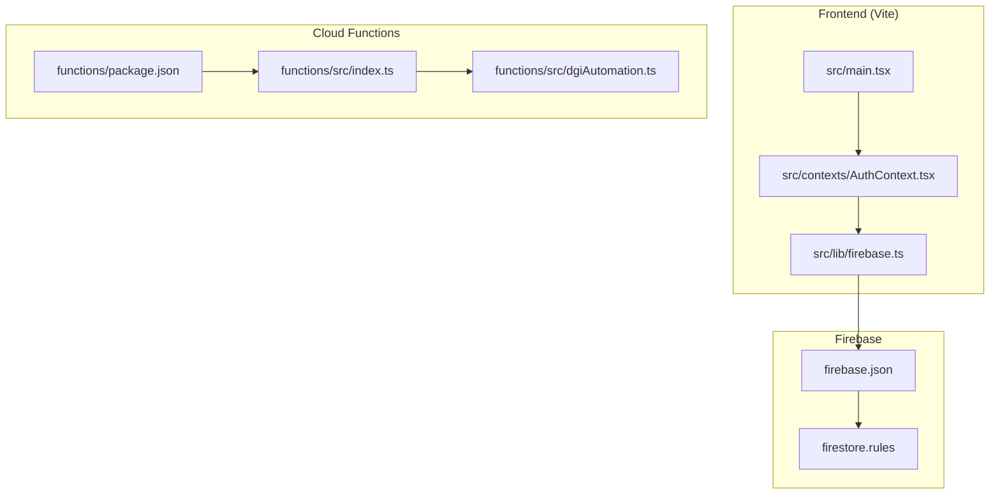
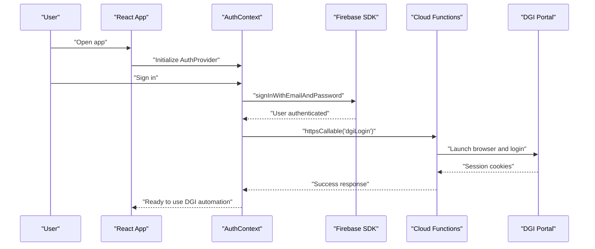

# Getting Started

<cite>
**Referenced Files in This Document**
- [README.md](file://README.md)
- [package.json](file://package.json)
- [vite.config.ts](file://vite.config.ts)
- [firebase.json](file://firebase.json)
- [functions/package.json](file://functions/package.json)
- [functions/src/index.ts](file://functions/src/index.ts)
- [functions/src/dgiAutomation.ts](file://functions/src/dgiAutomation.ts)
- [src/lib/firebase.ts](file://src/lib/firebase.ts)
- [src/contexts/AuthContext.tsx](file://src/contexts/AuthContext.tsx)
- [src/main.tsx](file://src/main.tsx)
- [firestore.rules](file://firestore.rules)
</cite>

## Table of Contents
1. [Introduction](#introduction)
2. [Project Structure](#project-structure)
3. [Prerequisites](#prerequisites)
4. [Step-by-Step Setup](#step-by-step-setup)
5. [Firebase Project Setup](#firebase-project-setup)
6. [Firestore Initialization](#firestore-initialization)
7. [Cloud Functions Deployment Preparation](#cloud-functions-deployment-preparation)
8. [Local Development Workflow](#local-development-workflow)
9. [Practical Examples](#practical-examples)
10. [Common Issues and Troubleshooting](#common-issues-and-troubleshooting)
11. [Architecture Overview](#architecture-overview)
12. [Conclusion](#conclusion)

## Introduction
This guide helps you set up the ETSMEDF development environment from scratch. It covers prerequisites, installation, environment configuration, local development server startup, Firebase project setup, Firestore initialization, and Cloud Functions deployment preparation. You will also learn how to run the development server, access the application locally, and troubleshoot common setup issues.

## Project Structure
ETSMEDF is a React + TypeScript + Vite frontend integrated with Firebase Authentication and Firestore, plus Firebase Cloud Functions written in TypeScript. The Cloud Functions use Puppeteer with a Chromium runtime to automate interactions with the DGI (Direction Générale des Impôts) portal.

**Diagram sources**
- [src/main.tsx:1-22](file://src/main.tsx#L1-L22)
- [src/lib/firebase.ts:1-23](file://src/lib/firebase.ts#L1-L23)
- [src/contexts/AuthContext.tsx:1-62](file://src/contexts/AuthContext.tsx#L1-L62)
- [firebase.json:1-11](file://firebase.json#L1-L11)
- [firestore.rules:1-9](file://firestore.rules#L1-L9)
- [functions/package.json:1-34](file://functions/package.json#L1-L34)
- [functions/src/index.ts:1-243](file://functions/src/index.ts#L1-L243)
- [functions/src/dgiAutomation.ts:1-800](file://functions/src/dgiAutomation.ts#L1-L800)

**Section sources**
- [README.md:1-74](file://README.md#L1-L74)
- [package.json:1-56](file://package.json#L1-L56)
- [vite.config.ts:1-14](file://vite.config.ts#L1-L14)
- [firebase.json:1-11](file://firebase.json#L1-L11)
- [functions/package.json:1-34](file://functions/package.json#L1-L34)
- [firestore.rules:1-9](file://firestore.rules#L1-L9)

## Prerequisites
- Node.js and npm: Required to install dependencies and run the Vite dev server and Firebase CLI.
- Firebase CLI: Required to initialize and deploy Firebase projects and Cloud Functions.
- Chrome or Chromium: Required by Puppeteer in Cloud Functions to automate browser actions.
- Git: Recommended for version control and cloning the repository.

Note: The Cloud Functions runtime requires Node.js 20 and rely on Puppeteer with a Chromium executable. The frontend runs in modern browsers.

**Section sources**
- [functions/package.json:6-8](file://functions/package.json#L6-L8)
- [functions/src/dgiAutomation.ts:1-11](file://functions/src/dgiAutomation.ts#L1-L11)
- [firebase.json:4-5](file://firebase.json#L4-L5)

## Step-by-Step Setup
Follow these steps to prepare your development environment:

1. Install Node.js and npm
   - Download and install Node.js LTS from the official website.
   - Verify installation: node --version and npm --version.

2. Install Firebase CLI globally
   - Run: npm install -g firebase-tools
   - Verify installation: firebase --version.

3. Clone or copy the repository to your machine
   - Navigate to your working directory and clone the repository.

4. Install frontend dependencies
   - From the repository root, run: npm ci
   - This installs all frontend packages defined in the root package.json.

5. Install Cloud Functions dependencies
   - Change directory to the functions folder: cd functions
   - Run: npm ci
   - Return to the repository root: cd ..

6. Configure environment variables
   - Create a .env file at the repository root with the required Firebase environment variables (see Environment Variables section).
   - Ensure the .env file is ignored by git (.gitignore is already present).

7. Build frontend (optional)
   - From the repository root, run: npm run build
   - This compiles TypeScript and bundles the frontend for production.

8. Start the local development server
   - From the repository root, run: npm run dev
   - The Vite dev server starts and serves the React app locally.

**Section sources**
- [package.json:6-11](file://package.json#L6-L11)
- [functions/package.json:10-16](file://functions/package.json#L10-L16)
- [vite.config.ts:1-14](file://vite.config.ts#L1-L14)

## Firebase Project Setup
Set up a Firebase project and configure it for this application:

1. Log in to Firebase CLI
   - firebase login

2. Initialize Firebase in the project
   - firebase init
   - Select Firestore and Functions when prompted.
   - Choose the Node.js runtime for Functions.
   - Allow overwriting firestore.rules if prompted.

3. Configure Firebase project settings
   - firebase use --add
   - Select your Firebase project ID and alias.

4. Deploy Firestore rules
   - firebase deploy --only firestore:rules

5. Deploy Cloud Functions
   - firebase deploy --only functions

6. Enable Firebase Authentication
   - firebase auth:enable email
   - This enables email/password sign-in for the app.

7. Configure Firebase SDK in the app
   - Ensure the frontend reads environment variables from import.meta.env.VITE_*.
   - These variables must match your Firebase project configuration.

**Section sources**
- [firebase.json:1-11](file://firebase.json#L1-L11)
- [firestore.rules:1-9](file://firestore.rules#L1-L9)
- [src/lib/firebase.ts:6-14](file://src/lib/firebase.ts#L6-L14)

## Firestore Initialization
Initialize Firestore with the provided security rules:

1. Review the default rules
   - The rules require authentication for read/write operations.

2. Deploy the rules
   - firebase deploy --only firestore:rules

3. Seed initial data (optional)
   - You can add initial documents for DGI sessions and configuration if needed.
   - Example paths used by the backend:
     - dgi_sessions/session
     - dgi_config/settings

4. Test connectivity
   - Start the development server and sign in through the app to verify Firestore access.

**Section sources**
- [firestore.rules:1-9](file://firestore.rules#L1-L9)
- [functions/src/dgiAutomation.ts:45-62](file://functions/src/dgiAutomation.ts#L45-L62)
- [functions/src/dgiAutomation.ts:66-75](file://functions/src/dgiAutomation.ts#L66-L75)

## Cloud Functions Deployment Preparation
Prepare Cloud Functions for local and remote deployment:

1. Build Cloud Functions
   - From the functions directory, run: npm run build
   - This compiles TypeScript to JavaScript.

2. Serve Functions locally (optional)
   - From the functions directory, run: npm run serve
   - This starts the Functions emulator and builds the project automatically.

3. Deploy Functions
   - From the repository root, run: firebase deploy --only functions
   - Predeploy script automatically builds the functions project.

4. Configure secrets
   - Set DGI_USERNAME and DGI_PASSWORD secrets in Firebase:
     - firebase functions:secrets:set DGI_USERNAME
     - firebase functions:secrets:set DGI_PASSWORD
   - Grant access to the service account:
     - firebase functions:secrets:access --add-service-account=PROJECT_ID@appspot.gserviceaccount.com

5. Verify Function triggers
   - Confirm the exported functions exist:
     - dgiLogin, dgiLogout
     - dgiListEUFs, dgiListArticles, dgiAddArticle, dgiDeleteArticle, dgiUpdateArticle
     - submitToDGI

**Section sources**
- [functions/package.json:10-16](file://functions/package.json#L10-L16)
- [functions/src/index.ts:17-38](file://functions/src/index.ts#L17-L38)
- [functions/src/index.ts:42-71](file://functions/src/index.ts#L42-L71)
- [functions/src/index.ts:75-89](file://functions/src/index.ts#L75-L89)
- [functions/src/index.ts:93-176](file://functions/src/index.ts#L93-L176)
- [functions/src/index.ts:180-242](file://functions/src/index.ts#L180-L242)

## Local Development Workflow
Run the development server and test the application locally:

1. Start the frontend
   - From the repository root, run: npm run dev
   - The Vite dev server starts on the default port (typically 5173).

2. Access the application
   - Open http://localhost:5173 in your browser.

3. Sign in
   - Use Firebase Authentication to sign in with an email/password account.
   - The AuthContext manages authentication state and calls Cloud Functions for DGI login/logout.

4. Use DGI automation
   - The app invokes Cloud Functions for DGI operations (list e-UFs, manage articles, submit invoices).
   - Ensure DGI credentials are set as Firebase secrets.

5. Preview production build (optional)
   - Run: npm run preview to test the built bundle locally.

**Section sources**
- [package.json:6-11](file://package.json#L6-L11)
- [src/main.tsx:1-22](file://src/main.tsx#L1-L22)
- [src/contexts/AuthContext.tsx:26-55](file://src/contexts/AuthContext.tsx#L26-L55)
- [src/lib/firebase.ts:1-23](file://src/lib/firebase.ts#L1-L23)

## Practical Examples
Below are practical examples for common tasks during development:

- Running the development server
  - Command: npm run dev
  - Expected outcome: Vite dev server starts and serves the React app.

- Building the project
  - Command: npm run build
  - Expected outcome: TypeScript compilation and Vite bundling complete.

- Serving Functions locally
  - Command: cd functions && npm run serve
  - Expected outcome: Functions emulator starts and builds the project.

- Deploying Functions
  - Command: firebase deploy --only functions
  - Expected outcome: Functions are deployed to your Firebase project.

- Setting DGI secrets
  - Commands:
    - firebase functions:secrets:set DGI_USERNAME
    - firebase functions:secrets:set DGI_PASSWORD
  - Expected outcome: Secrets stored securely and accessible to Functions.

- Accessing the app locally
  - Visit http://localhost:5173 and sign in to use the application.

**Section sources**
- [package.json:6-11](file://package.json#L6-L11)
- [functions/package.json:14-15](file://functions/package.json#L14-L15)
- [functions/src/index.ts:19-38](file://functions/src/index.ts#L19-L38)

## Common Issues and Troubleshooting
Address these common setup and runtime issues:

- Missing environment variables
  - Symptom: Frontend fails to initialize Firebase or functions calls fail.
  - Resolution: Ensure .env contains VITE_FIREBASE_* variables matching your Firebase project.

- Firebase CLI not installed or outdated
  - Symptom: firebase commands fail or show old version.
  - Resolution: Install or upgrade Firebase CLI globally.

- Node.js version mismatch
  - Symptom: Cloud Functions fail to start or build.
  - Resolution: Use Node.js 20.x as required by the Functions runtime.

- Puppeteer/Chromium errors in Functions
  - Symptom: Browser launch failures or timeouts.
  - Resolution: Ensure @sparticuz/chromium and puppeteer-core are installed; verify emulator supports headless mode.

- Firestore rules blocking access
  - Symptom: Read/write operations denied.
  - Resolution: Confirm rules allow authenticated access; deploy updated rules if needed.

- Functions emulator not building
  - Symptom: Emulator starts but code changes are not reflected.
  - Resolution: Run npm run build in the functions directory or use predeploy hook.

- Authentication state not persisting
  - Symptom: Users appear unauthenticated after refresh.
  - Resolution: Verify Firebase Auth is enabled and AuthContext is wrapping the app.

- PDF upload failures in submitToDGI
  - Symptom: Invoice submitted but PDF not stored.
  - Resolution: Check Cloud Storage permissions and bucket configuration.

**Section sources**
- [src/lib/firebase.ts:6-14](file://src/lib/firebase.ts#L6-L14)
- [functions/package.json:6-8](file://functions/package.json#L6-L8)
- [functions/src/dgiAutomation.ts:79-94](file://functions/src/dgiAutomation.ts#L79-L94)
- [firestore.rules:4-6](file://firestore.rules#L4-L6)
- [functions/src/index.ts:214-226](file://functions/src/index.ts#L214-L226)

## Architecture Overview
The development environment integrates a React frontend with Firebase Authentication and Firestore, and Cloud Functions that automate DGI interactions using Puppeteer and Chromium.

**Diagram sources**
- [src/main.tsx:1-22](file://src/main.tsx#L1-L22)
- [src/contexts/AuthContext.tsx:26-55](file://src/contexts/AuthContext.tsx#L26-L55)
- [src/lib/firebase.ts:1-23](file://src/lib/firebase.ts#L1-L23)
- [functions/src/index.ts:42-56](file://functions/src/index.ts#L42-L56)
- [functions/src/dgiAutomation.ts:347-364](file://functions/src/dgiAutomation.ts#L347-L364)

## Conclusion
You now have a complete understanding of how to set up the ETSMEDF development environment, configure Firebase, initialize Firestore, prepare Cloud Functions, and run the application locally. Use the troubleshooting section to resolve common issues, and refer to the architecture overview to understand how components interact during development and production.