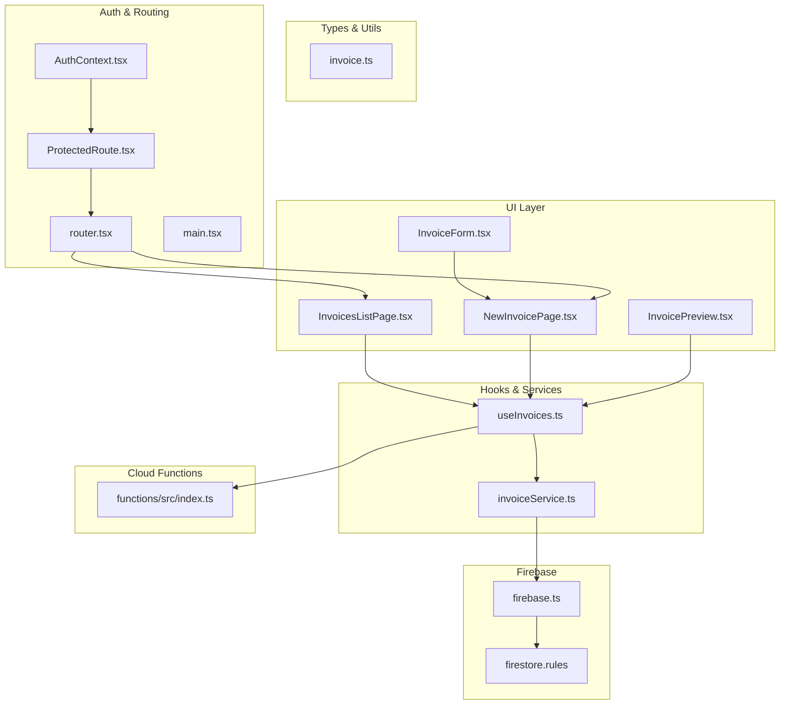
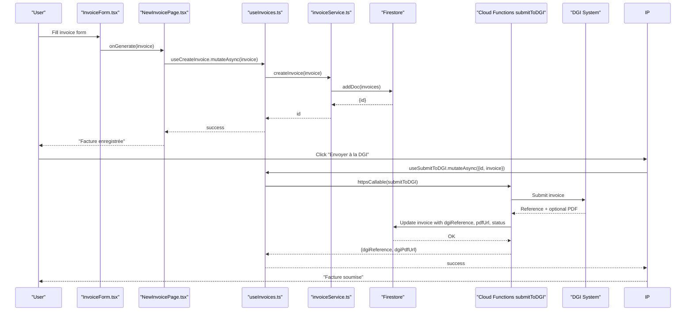
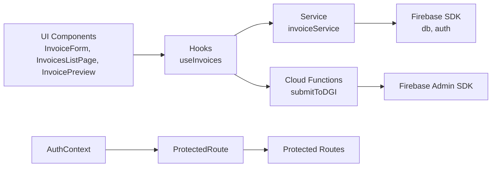

# Invoice CRUD Operations

<cite>
**Referenced Files in This Document**
- [useInvoices.ts](file://src/hooks/useInvoices.ts)
- [invoiceService.ts](file://src/lib/invoiceService.ts)
- [InvoicesListPage.tsx](file://src/pages/InvoicesListPage.tsx)
- [NewInvoicePage.tsx](file://src/pages/NewInvoicePage.tsx)
- [InvoiceForm.tsx](file://src/components/InvoiceForm.tsx)
- [InvoicePreview.tsx](file://src/components/InvoicePreview.tsx)
- [invoice.ts](file://src/types/invoice.ts)
- [firebase.ts](file://src/lib/firebase.ts)
- [AuthContext.tsx](file://src/contexts/AuthContext.tsx)
- [ProtectedRoute.tsx](file://src/components/ProtectedRoute.tsx)
- [router.tsx](file://src/router.tsx)
- [main.tsx](file://src/main.tsx)
- [index.ts](file://functions/src/index.ts)
- [firestore.rules](file://firestore.rules)
</cite>

## Table of Contents
1. [Introduction](#introduction)
2. [Project Structure](#project-structure)
3. [Core Components](#core-components)
4. [Architecture Overview](#architecture-overview)
5. [Detailed Component Analysis](#detailed-component-analysis)
6. [Dependency Analysis](#dependency-analysis)
7. [Performance Considerations](#performance-considerations)
8. [Troubleshooting Guide](#troubleshooting-guide)
9. [Conclusion](#conclusion)

## Introduction
This document provides comprehensive coverage of invoice CRUD operations in ETSMEDF, focusing on:
- Hook-based state management and caching with React Query
- Firestore-backed service layer with optimistic updates and invalidation strategies
- Real-time synchronization via query invalidation
- Filtering, sorting, and pagination patterns
- Optimistic UI updates and conflict resolution
- Offline-first considerations and retry strategies
- Practical examples for create, update, delete, and bulk operations
- Firebase Authentication integration for user-specific invoice access

## Project Structure
The invoice feature spans several layers:
- Types and utilities define the data model and calculations
- Service layer encapsulates Firestore interactions
- Hooks orchestrate React Query for caching and mutations
- Pages and components render lists, forms, and previews
- Authentication and routing protect routes and enforce access
- Cloud Functions integrate with DGI automation

**Diagram sources**
- [InvoicesListPage.tsx:1-174](file://src/pages/InvoicesListPage.tsx#L1-L174)
- [NewInvoicePage.tsx:1-45](file://src/pages/NewInvoicePage.tsx#L1-L45)
- [InvoiceForm.tsx:1-343](file://src/components/InvoiceForm.tsx#L1-L343)
- [InvoicePreview.tsx:1-347](file://src/components/InvoicePreview.tsx#L1-L347)
- [useInvoices.ts:1-90](file://src/hooks/useInvoices.ts#L1-L90)
- [invoiceService.ts:1-58](file://src/lib/invoiceService.ts#L1-L58)
- [invoice.ts:1-39](file://src/types/invoice.ts#L1-L39)
- [AuthContext.tsx:1-62](file://src/contexts/AuthContext.tsx#L1-L62)
- [ProtectedRoute.tsx:1-24](file://src/components/ProtectedRoute.tsx#L1-L24)
- [router.tsx:1-92](file://src/router.tsx#L1-L92)
- [main.tsx:1-22](file://src/main.tsx#L1-L22)
- [firebase.ts:1-23](file://src/lib/firebase.ts#L1-L23)
- [firestore.rules:1-9](file://firestore.rules#L1-L9)
- [index.ts:1-243](file://functions/src/index.ts#L1-L243)

**Section sources**
- [router.tsx:1-92](file://src/router.tsx#L1-L92)
- [main.tsx:1-22](file://src/main.tsx#L1-L22)

## Core Components
- useInvoices: Centralized hooks for fetching, creating, updating, deleting invoices, and submitting to DGI. Uses React Query keys for cache management and invalidation.
- invoiceService: Firestore abstraction for CRUD operations with timestamp normalization and typed returns.
- InvoicesListPage: Displays invoices with status badges, totals, and actions; integrates with delete mutation.
- NewInvoicePage + InvoiceForm: Generates invoices locally, then persists to Firestore via create mutation.
- InvoicePreview: Renders printable invoice, manages status transitions, and DGI submission flow.
- Types: Strongly typed invoice model and calculation helpers for subtotal, TVA, and total.
- Auth + Routing: Protects routes and ensures user presence for invoice access.

**Section sources**
- [useInvoices.ts:1-90](file://src/hooks/useInvoices.ts#L1-L90)
- [invoiceService.ts:1-58](file://src/lib/invoiceService.ts#L1-L58)
- [InvoicesListPage.tsx:1-174](file://src/pages/InvoicesListPage.tsx#L1-L174)
- [NewInvoicePage.tsx:1-45](file://src/pages/NewInvoicePage.tsx#L1-L45)
- [InvoiceForm.tsx:1-343](file://src/components/InvoiceForm.tsx#L1-L343)
- [InvoicePreview.tsx:1-347](file://src/components/InvoicePreview.tsx#L1-L347)
- [invoice.ts:1-39](file://src/types/invoice.ts#L1-L39)
- [AuthContext.tsx:1-62](file://src/contexts/AuthContext.tsx#L1-L62)
- [ProtectedRoute.tsx:1-24](file://src/components/ProtectedRoute.tsx#L1-L24)

## Architecture Overview
The system follows a layered architecture:
- UI layer renders views and collects user input
- Hooks coordinate data fetching and mutations with React Query
- Service layer abstracts Firestore operations
- Authentication and routing enforce access control
- Cloud Functions handle DGI integration and PDF uploads

**Diagram sources**
- [InvoiceForm.tsx:98-106](file://src/components/InvoiceForm.tsx#L98-L106)
- [NewInvoicePage.tsx:13-22](file://src/pages/NewInvoicePage.tsx#L13-L22)
- [useInvoices.ts:32-38](file://src/hooks/useInvoices.ts#L32-L38)
- [invoiceService.ts:19-25](file://src/lib/invoiceService.ts#L19-L25)
- [InvoicePreview.tsx:59-77](file://src/components/InvoicePreview.tsx#L59-L77)
- [index.ts:180-242](file://functions/src/index.ts#L180-L242)

## Detailed Component Analysis

### useInvoices Hook Implementation
The hook suite centralizes invoice state management and caching:
- Query keys: Shared cache keys for list and detail queries enable targeted invalidation.
- Queries:
  - useInvoices: Fetches all invoices ordered by creation timestamp descending.
  - useInvoice(id): Fetches a specific invoice with lazy enabling when id exists.
- Mutations:
  - useCreateInvoice: Creates invoice and invalidates list cache.
  - useUpdateInvoiceStatus: Updates status and invalidates both list and detail caches.
  - useDeleteInvoice: Deletes invoice and invalidates list cache.
  - useSubmitToDGI: Calls Cloud Function to submit to DGI and invalidates list cache.

Optimistic UI and conflict resolution:
- The hooks rely on React Query’s cache invalidation to reconcile server-side changes.
- No manual optimistic updates are implemented; invalidation ensures subsequent reads reflect server state.

Caching strategies:
- List cache keyed by ["invoices"] enables global invalidation upon create/update/delete.
- Detail cache keyed by ["invoices", id] allows targeted refresh after status changes.

Real-time synchronization:
- On successful mutations, cache keys are invalidated, prompting React Query to refetch data and synchronize UI.

**Section sources**
- [useInvoices.ts:12-90](file://src/hooks/useInvoices.ts#L12-L90)
- [invoiceService.ts:27-49](file://src/lib/invoiceService.ts#L27-L49)

### invoiceService Utility Functions
Firestore abstraction layer:
- createInvoice: Adds document with server timestamps and returns generated id.
- getInvoices: Orders by createdAt desc and normalizes Timestamp to ISO string.
- getInvoice: Retrieves single document and normalizes createdAt.
- updateInvoiceStatus: Updates status field.
- deleteInvoice: Removes document by id.

Error handling and retry mechanisms:
- Firestore SDK throws on failures; callers should wrap mutations with try/catch and surface user-friendly messages.
- No built-in retry logic in service functions; implement retries at the hook/mutation level if needed.

Offline functionality:
- Firestore SDK supports offline persistence; operations queue locally and sync when connectivity resumes.
- UI indicates loading and errors during network issues.

**Section sources**
- [invoiceService.ts:19-58](file://src/lib/invoiceService.ts#L19-L58)
- [firebase.ts:16-18](file://src/lib/firebase.ts#L16-L18)

### InvoicesListPage Component
Display and interaction:
- Renders a responsive grid with client name, invoice number, due date, total, and status badge.
- Provides quick actions: preview and delete.
- Handles loading, empty state, and error states with user feedback.

Filtering, sorting, and pagination:
- Sorting: Invoices are sorted by createdAt descending via Firestore query ordering.
- Filtering: Not implemented in this component; could be extended with query filters.
- Pagination: Not implemented; Firestore pagination would require cursor-based queries.

Bulk operations:
- Not implemented in this component; could add selection and batch actions.

**Section sources**
- [InvoicesListPage.tsx:27-174](file://src/pages/InvoicesListPage.tsx#L27-L174)
- [invoice.ts:28-38](file://src/types/invoice.ts#L28-L38)

### NewInvoicePage + InvoiceForm
Invoice generation:
- InvoiceForm generates a local invoice object with computed totals and sets status to draft.
- NewInvoicePage receives the generated invoice and persists it via useCreateInvoice.
- After successful creation, the page displays the generated invoice for review.

Validation and UX:
- Zod-based validation ensures required fields and numeric constraints.
- Dynamic pricing from DGI articles and live totals computation.

**Section sources**
- [InvoiceForm.tsx:51-106](file://src/components/InvoiceForm.tsx#L51-L106)
- [NewInvoicePage.tsx:9-22](file://src/pages/NewInvoicePage.tsx#L9-L22)
- [invoice.ts:28-38](file://src/types/invoice.ts#L28-L38)

### InvoicePreview Component
Status management:
- Allows changing status via a dropdown; triggers useUpdateInvoiceStatus mutation.
- Displays success/error notifications.

DGI submission:
- Calls useSubmitToDGI mutation to submit invoice to DGI via Cloud Function.
- Shows DGI reference and optional PDF viewer; handles missing PDF gracefully.

Print and download:
- Provides print and save-to-PDF actions for user convenience.

**Section sources**
- [InvoicePreview.tsx:38-77](file://src/components/InvoicePreview.tsx#L38-L77)
- [InvoicePreview.tsx:165-337](file://src/components/InvoicePreview.tsx#L165-L337)

### Authentication and Security
Authentication:
- AuthContext manages Firebase Auth state and exposes signIn/signOut.
- ProtectedRoute enforces authentication for protected routes.

Security constraints:
- Firestore rules permit read/write only when user is authenticated.
- Cloud Functions validate request.auth for all callable endpoints.

Integration:
- Hooks use Firebase Functions for DGI operations; functions enforce auth and manage DGI credentials.

**Section sources**
- [AuthContext.tsx:26-54](file://src/contexts/AuthContext.tsx#L26-L54)
- [ProtectedRoute.tsx:6-23](file://src/components/ProtectedRoute.tsx#L6-L23)
- [firestore.rules:4-6](file://firestore.rules#L4-L6)
- [index.ts:42-71](file://functions/src/index.ts#L42-L71)

## Dependency Analysis
Key dependencies and relationships:
- UI components depend on hooks for data and mutations.
- Hooks depend on service layer for Firestore operations.
- Service layer depends on Firebase SDK initialized in firebase.ts.
- Cloud Functions depend on Firebase Admin SDK and Firestore.
- Router and AuthContext protect UI routes.

**Diagram sources**
- [useInvoices.ts:1-90](file://src/hooks/useInvoices.ts#L1-L90)
- [invoiceService.ts:1-58](file://src/lib/invoiceService.ts#L1-L58)
- [firebase.ts:1-23](file://src/lib/firebase.ts#L1-L23)
- [index.ts:1-243](file://functions/src/index.ts#L1-L243)
- [AuthContext.tsx:1-62](file://src/contexts/AuthContext.tsx#L1-L62)
- [ProtectedRoute.tsx:1-24](file://src/components/ProtectedRoute.tsx#L1-L24)
- [router.tsx:1-92](file://src/router.tsx#L1-L92)

**Section sources**
- [router.tsx:36-54](file://src/router.tsx#L36-L54)
- [main.tsx:10-21](file://src/main.tsx#L10-L21)

## Performance Considerations
- Query keys and invalidation: Efficient cache management prevents unnecessary re-fetches while keeping UI synchronized.
- Sorting by createdAt desc: Ensures recent invoices appear first without additional client-side sorting cost.
- Pagination: Not implemented; consider cursor-based pagination for large datasets to reduce payload sizes.
- Offline persistence: Firestore offline support reduces latency and improves resilience; ensure UI reflects pending operations.
- Retry strategies: Implement retry logic at the mutation level for transient failures; exponential backoff recommended.
- Optimistic updates: Consider adding optimistic updates for immediate feedback, with rollback on failure and cache invalidation to reconcile.

[No sources needed since this section provides general guidance]

## Troubleshooting Guide
Common issues and resolutions:
- Authentication errors: Verify Firebase Auth initialization and ensure ProtectedRoute wraps protected routes.
- Firestore permission denied: Confirm Firestore rules allow authenticated access and that user is signed in.
- Network failures: UI surfaces loading and error states; implement retry logic in mutations.
- DGI submission failures: Cloud Function logs errors; ensure DGI credentials are configured and accessible.
- Cache inconsistencies: Rely on query invalidation; if stale data appears, trigger manual refetch or invalidate specific keys.

**Section sources**
- [firestore.rules:4-6](file://firestore.rules#L4-L6)
- [index.ts:31-38](file://functions/src/index.ts#L31-L38)
- [InvoicePreview.tsx:73-77](file://src/components/InvoicePreview.tsx#L73-L77)

## Conclusion
ETSMEDF implements a robust invoice CRUD system leveraging React Query for caching, Firestore for persistence, and Firebase Authentication for access control. The useInvoices hooks provide a clean separation of concerns, while the invoiceService encapsulates Firestore operations. The UI components deliver a responsive experience with status management, DGI integration, and print/download capabilities. Future enhancements could include filtering, pagination, optimistic updates, and retry mechanisms for improved reliability and user experience.