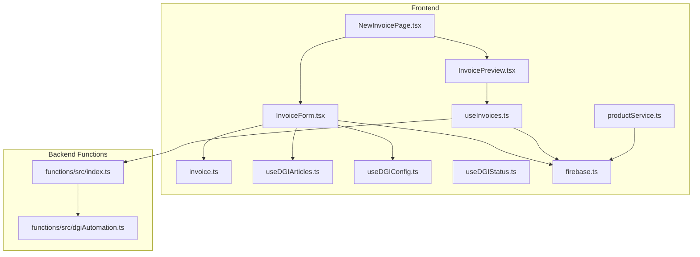
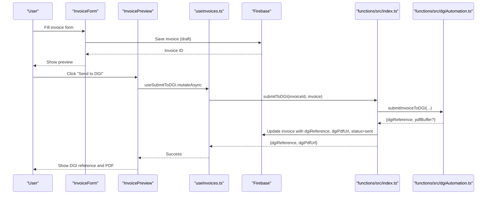
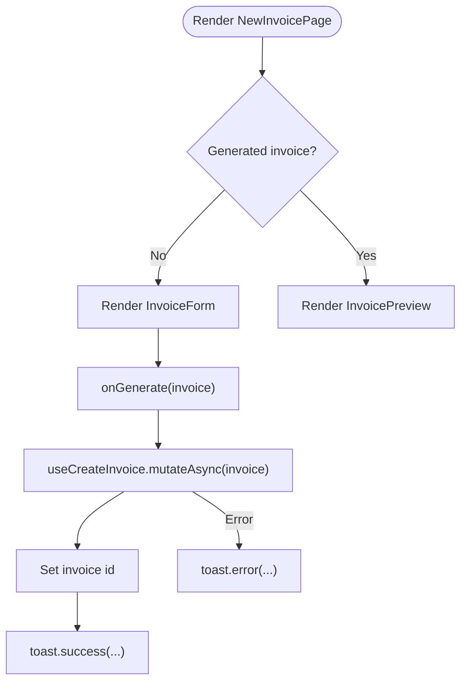
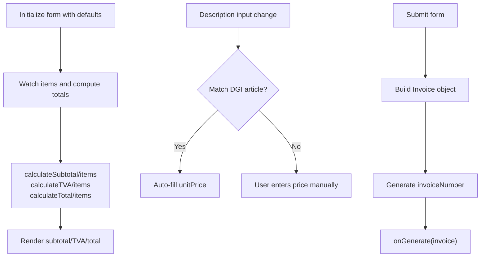
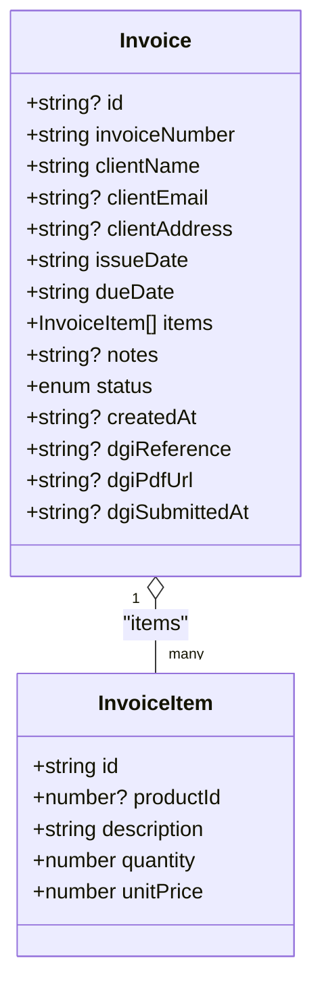
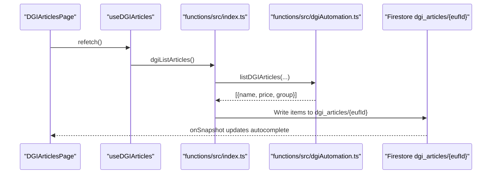
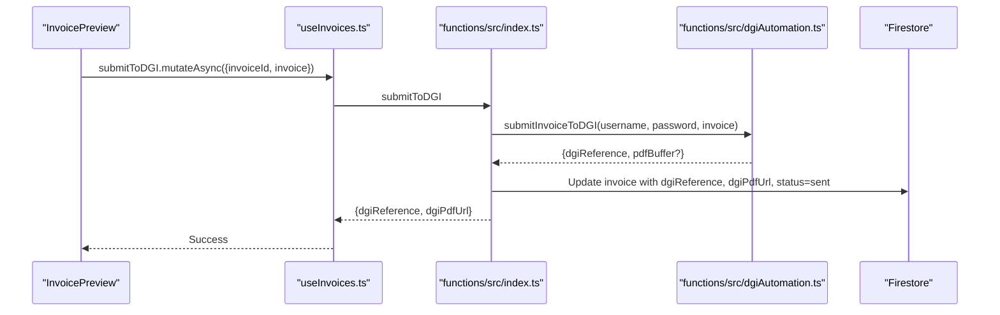
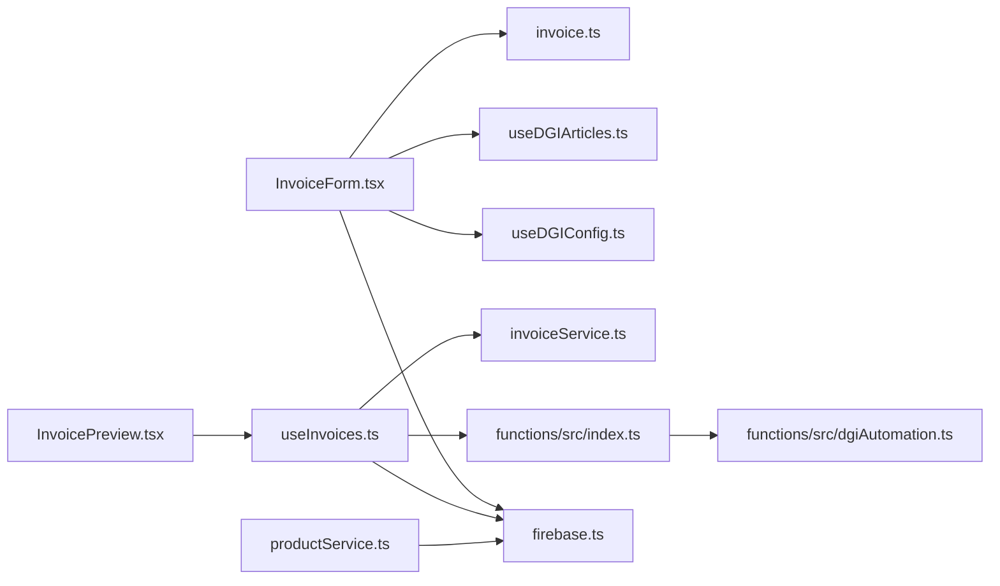

# Invoice Creation Workflow

<cite>
**Referenced Files in This Document**
- [NewInvoicePage.tsx](file://src/pages/NewInvoicePage.tsx)
- [InvoiceForm.tsx](file://src/components/InvoiceForm.tsx)
- [InvoicePreview.tsx](file://src/components/InvoicePreview.tsx)
- [invoice.ts](file://src/types/invoice.ts)
- [invoiceService.ts](file://src/lib/invoiceService.ts)
- [useInvoices.ts](file://src/hooks/useInvoices.ts)
- [useDGIArticles.ts](file://src/hooks/useDGIArticles.ts)
- [useDGIConfig.ts](file://src/hooks/useDGIConfig.ts)
- [useDGIStatus.ts](file://src/hooks/useDGIStatus.ts)
- [productService.ts](file://src/lib/productService.ts)
- [firebase.ts](file://src/lib/firebase.ts)
- [dgiAutomation.ts](file://functions/src/dgiAutomation.ts)
- [index.ts](file://functions/src/index.ts)
- [DGIArticlesPage.tsx](file://src/pages/DGIArticlesPage.tsx)
</cite>

## Table of Contents
1. [Introduction](#introduction)
2. [Project Structure](#project-structure)
3. [Core Components](#core-components)
4. [Architecture Overview](#architecture-overview)
5. [Detailed Component Analysis](#detailed-component-analysis)
6. [Dependency Analysis](#dependency-analysis)
7. [Performance Considerations](#performance-considerations)
8. [Troubleshooting Guide](#troubleshooting-guide)
9. [Conclusion](#conclusion)

## Introduction
This document explains the invoice creation workflow in ETSMEDF, focusing on how users create invoices from scratch, integrate with product catalogs, manage quantities and prices, apply taxes, and submit to the DGI (Direction Générale des Impôts) for electronic invoicing compliance. It documents the NewInvoicePage component, form validation, real-time calculations, and the underlying data model. It also covers integrations with product databases, DGI article catalogs, and the automated submission pipeline.

## Project Structure
The invoice workflow spans UI components, typed models, service layers, and Firebase cloud functions:
- UI Pages and Forms: NewInvoicePage orchestrates the flow; InvoiceForm collects invoice data; InvoicePreview renders previews and handles DGI submission.
- Types and Calculations: Strongly typed invoice and item models with built-in tax computations.
- Services and Hooks: Firestore-backed invoice CRUD and DGI-related hooks for article catalogs and submissions.
- Backend Functions: Cloud functions automate DGI login, article synchronization, and invoice submission.

**Diagram sources**
- [NewInvoicePage.tsx:1-45](file://src/pages/NewInvoicePage.tsx#L1-L45)
- [InvoiceForm.tsx:1-343](file://src/components/InvoiceForm.tsx#L1-L343)
- [InvoicePreview.tsx:1-347](file://src/components/InvoicePreview.tsx#L1-L347)
- [invoice.ts:1-39](file://src/types/invoice.ts#L1-L39)
- [useInvoices.ts:1-90](file://src/hooks/useInvoices.ts#L1-L90)
- [useDGIArticles.ts:1-107](file://src/hooks/useDGIArticles.ts#L1-L107)
- [useDGIConfig.ts:1-84](file://src/hooks/useDGIConfig.ts#L1-L84)
- [useDGIStatus.ts:1-34](file://src/hooks/useDGIStatus.ts#L1-L34)
- [productService.ts:1-17](file://src/lib/productService.ts#L1-L17)
- [firebase.ts:1-23](file://src/lib/firebase.ts#L1-L23)
- [index.ts:1-243](file://functions/src/index.ts#L1-L243)
- [dgiAutomation.ts:1-800](file://functions/src/dgiAutomation.ts#L1-L800)

**Section sources**
- [NewInvoicePage.tsx:1-45](file://src/pages/NewInvoicePage.tsx#L1-L45)
- [InvoiceForm.tsx:1-343](file://src/components/InvoiceForm.tsx#L1-L343)
- [InvoicePreview.tsx:1-347](file://src/components/InvoicePreview.tsx#L1-L347)
- [invoice.ts:1-39](file://src/types/invoice.ts#L1-L39)
- [useInvoices.ts:1-90](file://src/hooks/useInvoices.ts#L1-L90)
- [useDGIArticles.ts:1-107](file://src/hooks/useDGIArticles.ts#L1-L107)
- [useDGIConfig.ts:1-84](file://src/hooks/useDGIConfig.ts#L1-L84)
- [useDGIStatus.ts:1-34](file://src/hooks/useDGIStatus.ts#L1-L34)
- [productService.ts:1-17](file://src/lib/productService.ts#L1-L17)
- [firebase.ts:1-23](file://src/lib/firebase.ts#L1-L23)
- [index.ts:1-243](file://functions/src/index.ts#L1-L243)
- [dgiAutomation.ts:1-800](file://functions/src/dgiAutomation.ts#L1-L800)

## Core Components
- NewInvoicePage: Orchestrates the invoice creation lifecycle. It switches between the form and preview views and coordinates saving to Firestore.
- InvoiceForm: Collects client info, dates, items, and notes; validates inputs; computes totals; integrates with DGI article catalog for autocomplete.
- InvoicePreview: Renders the invoice, allows status updates, prints, saves PDF, and submits to DGI.
- Types: Defines Invoice and InvoiceItem interfaces, constants for tax rate, and calculation helpers.
- Services and Hooks: Firestore operations for invoices and DGI article management; React Query hooks for optimistic UI and mutations.

**Section sources**
- [NewInvoicePage.tsx:9-44](file://src/pages/NewInvoicePage.tsx#L9-L44)
- [InvoiceForm.tsx:51-342](file://src/components/InvoiceForm.tsx#L51-L342)
- [InvoicePreview.tsx:38-338](file://src/components/InvoicePreview.tsx#L38-L338)
- [invoice.ts:1-39](file://src/types/invoice.ts#L1-L39)
- [useInvoices.ts:32-89](file://src/hooks/useInvoices.ts#L32-L89)
- [useDGIArticles.ts:16-40](file://src/hooks/useDGIArticles.ts#L16-L40)

## Architecture Overview
The workflow follows a client-driven UI with backend automation:
- Frontend collects invoice data and persists it to Firestore.
- On preview, the user can submit to DGI via a callable function.
- The backend function logs into the DGI portal, opens the selected e-DEF/e-UF, navigates to invoice creation, and submits the invoice.
- The function optionally uploads the generated PDF to Firebase Storage and updates the invoice record with DGI metadata.

**Diagram sources**
- [InvoiceForm.tsx:98-106](file://src/components/InvoiceForm.tsx#L98-L106)
- [InvoicePreview.tsx:59-77](file://src/components/InvoicePreview.tsx#L59-L77)
- [useInvoices.ts:60-89](file://src/hooks/useInvoices.ts#L60-L89)
- [index.ts:180-242](file://functions/src/index.ts#L180-L242)
- [dgiAutomation.ts:1-800](file://functions/src/dgiAutomation.ts#L1-L800)

## Detailed Component Analysis

### NewInvoicePage Component
Responsibilities:
- Manages the state between form and preview views.
- Handles invoice submission to Firestore via a mutation hook.
- Displays success/error notifications.

Key behaviors:
- Stores generated invoice in local state to render preview.
- Calls useCreateInvoice.mutateAsync to persist invoice.
- Updates the stored invoice with the returned Firestore document ID.
- Uses toast notifications for success and failure messages.

**Diagram sources**
- [NewInvoicePage.tsx:9-44](file://src/pages/NewInvoicePage.tsx#L9-L44)

**Section sources**
- [NewInvoicePage.tsx:9-44](file://src/pages/NewInvoicePage.tsx#L9-L44)

### InvoiceForm Component
Responsibilities:
- Validates client info, dates, and items using Zod.
- Manages dynamic item rows with react-hook-form Field Array.
- Computes real-time subtotal, VAT, and total.
- Integrates with DGI article catalog for autocomplete and pricing.

Validation rules:
- Client name is required.
- Email is optional but must be valid if provided.
- Issue date and due date are required.
- Items array must not be empty; each item requires description, quantity ≥ 1, unit price ≥ 0.

Real-time calculations:
- Subtotal = sum(quantity × unitPrice) per item.
- VAT = subtotal × 0.16 (Group B).
- Total = subtotal + VAT.

DGI integration:
- Loads DGI article list from Firestore for autocomplete.
- On description change, auto-fills unit price if a matching article exists.

UI patterns:
- Responsive grid layout for items.
- Inline line totals computed from quantity and unit price.
- Add/remove item rows with validation feedback.

**Diagram sources**
- [InvoiceForm.tsx:58-106](file://src/components/InvoiceForm.tsx#L58-L106)
- [invoice.ts:28-38](file://src/types/invoice.ts#L28-L38)
- [useDGIArticles.ts:16-40](file://src/hooks/useDGIArticles.ts#L16-L40)

**Section sources**
- [InvoiceForm.tsx:15-31](file://src/components/InvoiceForm.tsx#L15-L31)
- [InvoiceForm.tsx:58-106](file://src/components/InvoiceForm.tsx#L58-L106)
- [InvoiceForm.tsx:187-321](file://src/components/InvoiceForm.tsx#L187-L321)
- [invoice.ts:26-38](file://src/types/invoice.ts#L26-L38)
- [useDGIArticles.ts:16-40](file://src/hooks/useDGIArticles.ts#L16-L40)

### Invoice Data Model
Fields:
- Invoice: id?, invoiceNumber, clientName, clientEmail?, clientAddress?, issueDate, dueDate, items: InvoiceItem[], notes?, status: "draft"|"sent"|"paid", createdAt?, dgiReference?, dgiPdfUrl?, dgiSubmittedAt?
- InvoiceItem: id, productId?, description, quantity, unitPrice

Business rules:
- Status transitions: draft → sent → paid.
- Tax rate is 16% (Group B).
- Validation enforced by Zod schema in the form.

**Diagram sources**
- [invoice.ts:1-24](file://src/types/invoice.ts#L1-L24)

**Section sources**
- [invoice.ts:1-24](file://src/types/invoice.ts#L1-L24)

### DGI Article Catalog Integration
Two pathways:
- Live catalog from Firestore: useStoredDGIArticles listens to a document under dgi_articles/{selectedEUFId} and returns articles for autocomplete.
- Cloud function sync: useDGIArticles calls dgiListArticles to fetch articles from DGI and store them in Firestore for offline use.

Selection and configuration:
- useDGIConfig manages selectedEUFId and available e-UFs.
- DGIArticlesPage provides UI to refresh, add, update, and delete articles.

**Diagram sources**
- [DGIArticlesPage.tsx:50-57](file://src/pages/DGIArticlesPage.tsx#L50-L57)
- [useDGIArticles.ts:50-62](file://src/hooks/useDGIArticles.ts#L50-L62)
- [index.ts:93-107](file://functions/src/index.ts#L93-L107)
- [dgiAutomation.ts:762-791](file://functions/src/dgiAutomation.ts#L762-L791)
- [useDGIArticles.ts:16-40](file://src/hooks/useDGIArticles.ts#L16-L40)

**Section sources**
- [useDGIArticles.ts:16-40](file://src/hooks/useDGIArticles.ts#L16-L40)
- [useDGIArticles.ts:50-106](file://src/hooks/useDGIArticles.ts#L50-L106)
- [useDGIConfig.ts:21-51](file://src/hooks/useDGIConfig.ts#L21-L51)
- [DGIArticlesPage.tsx:20-138](file://src/pages/DGIArticlesPage.tsx#L20-L138)

### Product Catalog Integration
- ProductService provides a simple products collection with fields: id, name, price, unit, barcode, groupId.
- While the invoice form does not directly bind to this collection, it can be used to prefill items or cross-reference pricing in future enhancements.

**Section sources**
- [productService.ts:1-17](file://src/lib/productService.ts#L1-L17)

### Invoice Submission to DGI
- InvoicePreview triggers useSubmitToDGI, which calls the submitToDGI callable function.
- The function authenticates against DGI, navigates to the e-DEF/e-UF, creates and submits the invoice, optionally uploads the PDF, and updates the invoice record with DGI metadata.

**Diagram sources**
- [InvoicePreview.tsx:59-77](file://src/components/InvoicePreview.tsx#L59-L77)
- [useInvoices.ts:60-89](file://src/hooks/useInvoices.ts#L60-L89)
- [index.ts:180-242](file://functions/src/index.ts#L180-L242)
- [dgiAutomation.ts:1-800](file://functions/src/dgiAutomation.ts#L1-L800)

**Section sources**
- [InvoicePreview.tsx:59-77](file://src/components/InvoicePreview.tsx#L59-L77)
- [useInvoices.ts:60-89](file://src/hooks/useInvoices.ts#L60-L89)
- [index.ts:180-242](file://functions/src/index.ts#L180-L242)
- [dgiAutomation.ts:1-800](file://functions/src/dgiAutomation.ts#L1-L800)

## Dependency Analysis
- UI depends on typed models and hooks for validation and persistence.
- InvoiceForm depends on react-hook-form and Zod for validation and on DGI article hooks for autocomplete.
- InvoicePreview depends on useInvoices hooks for status updates and DGI submission.
- useInvoices wraps Firestore operations and exposes React Query mutations.
- Backend functions depend on Puppeteer and Chromium to automate DGI interactions.

**Diagram sources**
- [InvoiceForm.tsx:1-13](file://src/components/InvoiceForm.tsx#L1-L13)
- [InvoicePreview.tsx:1-17](file://src/components/InvoicePreview.tsx#L1-L17)
- [useInvoices.ts:1-10](file://src/hooks/useInvoices.ts#L1-L10)
- [invoiceService.ts:1-17](file://src/lib/invoiceService.ts#L1-L17)
- [index.ts:1-15](file://functions/src/index.ts#L1-L15)
- [dgiAutomation.ts:1-11](file://functions/src/dgiAutomation.ts#L1-L11)
- [firebase.ts:1-23](file://src/lib/firebase.ts#L1-L23)
- [productService.ts:1-17](file://src/lib/productService.ts#L1-L17)

**Section sources**
- [InvoiceForm.tsx:1-13](file://src/components/InvoiceForm.tsx#L1-L13)
- [InvoicePreview.tsx:1-17](file://src/components/InvoicePreview.tsx#L1-L17)
- [useInvoices.ts:1-10](file://src/hooks/useInvoices.ts#L1-L10)
- [invoiceService.ts:1-17](file://src/lib/invoiceService.ts#L1-L17)
- [index.ts:1-15](file://functions/src/index.ts#L1-L15)
- [dgiAutomation.ts:1-11](file://functions/src/dgiAutomation.ts#L1-L11)
- [firebase.ts:1-23](file://src/lib/firebase.ts#L1-L23)
- [productService.ts:1-17](file://src/lib/productService.ts#L1-L17)

## Performance Considerations
- Real-time calculations: Totals are recomputed on each item change; keep the items array reasonable in length to avoid heavy recomputation.
- Autocomplete: DGI article list is fetched once and cached in Firestore; subsequent loads are fast via onSnapshot.
- DGI submission: Browser automation is slow; avoid frequent submissions and batch operations when possible.
- Network retries: React Query hooks are configured to avoid retries for DGI article fetching to prevent long-running operations.

## Troubleshooting Guide
Common issues and resolutions:
- Missing EUF selection: DGI article operations require a selected e-UF; ensure one is chosen in the DGI configuration.
- DGI login failures: Credentials must be set in Firebase secrets; verify DGI credentials and network accessibility.
- Empty or invalid item lists: Ensure at least one item exists with valid quantity and price.
- PDF capture: If automatic PDF capture fails, download manually from the DGI portal using the returned reference.
- Firebase connectivity: Errors indicate missing or misconfigured Firebase environment variables.

**Section sources**
- [useDGIConfig.ts:21-51](file://src/hooks/useDGIConfig.ts#L21-L51)
- [index.ts:31-38](file://functions/src/index.ts#L31-L38)
- [InvoiceForm.tsx:15-31](file://src/components/InvoiceForm.tsx#L15-L31)
- [InvoicePreview.tsx:59-77](file://src/components/InvoicePreview.tsx#L59-L77)
- [firebase.ts:6-14](file://src/lib/firebase.ts#L6-L14)

## Conclusion
The ETSMEDF invoice creation workflow combines a robust front-end form with strong validation, real-time calculations, and seamless DGI integration. Users can efficiently create invoices, leverage DGI article catalogs for pricing, preview and print invoices, and submit them electronically while maintaining compliance with DGI requirements. The architecture balances user experience with backend automation, ensuring reliable and auditable invoice processing.