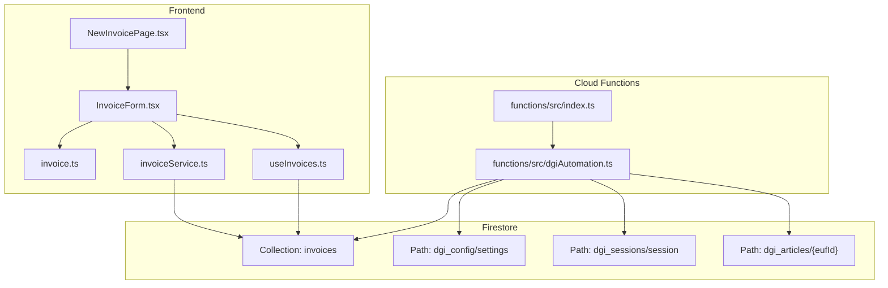
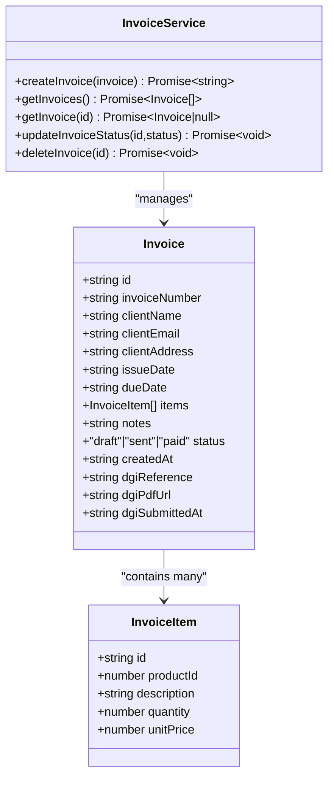
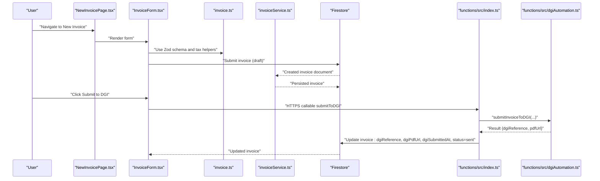
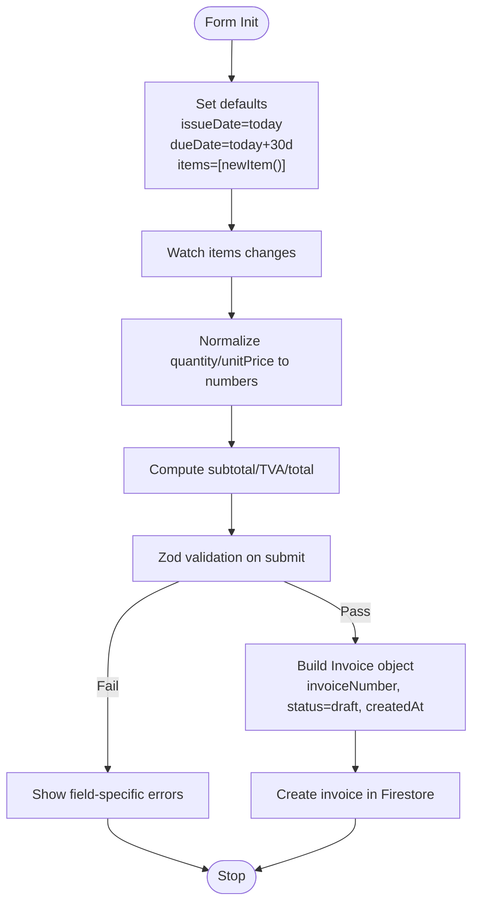
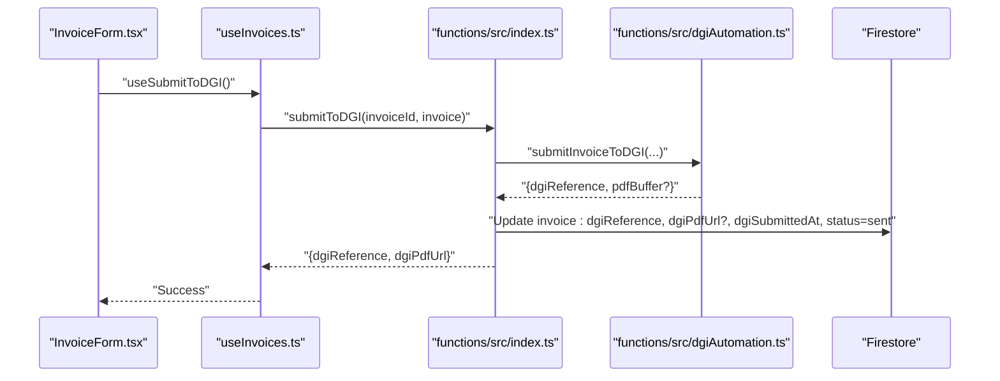
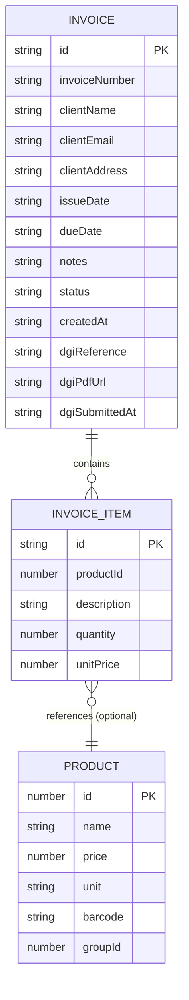
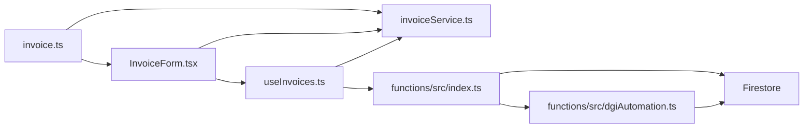

# Invoice Data Model and Types

<cite>
**Referenced Files in This Document**
- [invoice.ts](file://src/types/invoice.ts)
- [InvoiceForm.tsx](file://src/components/InvoiceForm.tsx)
- [invoiceService.ts](file://src/lib/invoiceService.ts)
- [useInvoices.ts](file://src/hooks/useInvoices.ts)
- [NewInvoicePage.tsx](file://src/pages/NewInvoicePage.tsx)
- [index.ts](file://functions/src/index.ts)
- [dgiAutomation.ts](file://functions/src/dgiAutomation.ts)
- [productService.ts](file://src/lib/productService.ts)
- [firestore.rules](file://firestore.rules)
</cite>

## Table of Contents
1. [Introduction](#introduction)
2. [Project Structure](#project-structure)
3. [Core Components](#core-components)
4. [Architecture Overview](#architecture-overview)
5. [Detailed Component Analysis](#detailed-component-analysis)
6. [Dependency Analysis](#dependency-analysis)
7. [Performance Considerations](#performance-considerations)
8. [Troubleshooting Guide](#troubleshooting-guide)
9. [Conclusion](#conclusion)

## Introduction
This document provides comprehensive data model documentation for the invoice system in ETSMEDF. It defines TypeScript interfaces for invoice entities, documents the complete invoice structure including client information, itemized products, tax calculations, and status fields, and explains relationships with related entities such as clients, products, and DGI submissions. It also covers field constraints, business rules, Firestore schema mapping, indexing strategies, validation patterns, transformation logic, and DGI compliance requirements including audit trails and data lifecycle management.

## Project Structure
The invoice system spans the client-side React application and Cloud Functions backend:
- Frontend types and forms define invoice data structures and validation.
- Firestore stores invoices and related DGI configuration data.
- Cloud Functions automate DGI interactions and manage invoice submissions.

**Diagram sources**
- [InvoiceForm.tsx:1-343](file://src/components/InvoiceForm.tsx#L1-L343)
- [invoice.ts:1-39](file://src/types/invoice.ts#L1-L39)
- [invoiceService.ts:1-58](file://src/lib/invoiceService.ts#L1-L58)
- [useInvoices.ts:1-90](file://src/hooks/useInvoices.ts#L1-L90)
- [NewInvoicePage.tsx:1-45](file://src/pages/NewInvoicePage.tsx#L1-L45)
- [index.ts:1-243](file://functions/src/index.ts#L1-L243)
- [dgiAutomation.ts:1-1386](file://functions/src/dgiAutomation.ts#L1-L1386)

**Section sources**
- [invoice.ts:1-39](file://src/types/invoice.ts#L1-L39)
- [InvoiceForm.tsx:1-343](file://src/components/InvoiceForm.tsx#L1-L343)
- [invoiceService.ts:1-58](file://src/lib/invoiceService.ts#L1-L58)
- [useInvoices.ts:1-90](file://src/hooks/useInvoices.ts#L1-L90)
- [NewInvoicePage.tsx:1-45](file://src/pages/NewInvoicePage.tsx#L1-L45)
- [index.ts:1-243](file://functions/src/index.ts#L1-L243)
- [dgiAutomation.ts:1-1386](file://functions/src/dgiAutomation.ts#L1-L1386)

## Core Components
This section defines the primary data structures and their roles in the invoice system.

- InvoiceItem: Represents a single product line in an invoice.
- Invoice: Represents a complete invoice with client info, dates, items, totals, and DGI submission metadata.
- Tax calculation utilities: Subtotal, TVA (16%), and total computation.

**Diagram sources**
- [invoice.ts:1-39](file://src/types/invoice.ts#L1-L39)
- [invoiceService.ts:19-57](file://src/lib/invoiceService.ts#L19-L57)

**Section sources**
- [invoice.ts:1-39](file://src/types/invoice.ts#L1-L39)
- [invoiceService.ts:19-57](file://src/lib/invoiceService.ts#L19-L57)

## Architecture Overview
The invoice lifecycle spans creation, local validation, persistence, and optional DGI submission.

**Diagram sources**
- [NewInvoicePage.tsx:9-44](file://src/pages/NewInvoicePage.tsx#L9-L44)
- [InvoiceForm.tsx:98-106](file://src/components/InvoiceForm.tsx#L98-L106)
- [invoice.ts:28-38](file://src/types/invoice.ts#L28-L38)
- [invoiceService.ts:19-57](file://src/lib/invoiceService.ts#L19-L57)
- [index.ts:180-242](file://functions/src/index.ts#L180-L242)
- [dgiAutomation.ts:1360-1385](file://functions/src/dgiAutomation.ts#L1360-L1385)

## Detailed Component Analysis

### Invoice Data Model
- Fields and types:
  - id: string (auto-generated by Firestore)
  - invoiceNumber: string (auto-generated by client)
  - clientName: string (required)
  - clientEmail: string (optional, validated as email)
  - clientAddress: string (optional)
  - issueDate: string (ISO date)
  - dueDate: string (ISO date)
  - items: InvoiceItem[] (required, min 1)
  - notes: string (optional)
  - status: "draft" | "sent" | "paid"
  - createdAt: string (server timestamp)
  - dgiReference: string (filled after DGI submission)
  - dgiPdfUrl: string (public URL to PDF)
  - dgiSubmittedAt: string (server timestamp)

- Validation rules:
  - Client name required.
  - Email optional but must be valid if provided.
  - Issue and due dates required.
  - Items array required and non-empty.
  - Item description required, quantity ≥ 1, unitPrice ≥ 0.

- Business rules:
  - Status transitions: draft → sent → paid.
  - TVA rate is 16% (Group B).
  - Subtotal = sum(quantity × unitPrice) per item.
  - TVA = subtotal × 0.16.
  - Total = subtotal + TVA.

- Field constraints:
  - invoiceNumber: generated client-side (INV-YYYYMM-XXXX).
  - productId in InvoiceItem is optional; when present, can be mapped to Product entity.

**Section sources**
- [invoice.ts:1-39](file://src/types/invoice.ts#L1-L39)
- [InvoiceForm.tsx:15-31](file://src/components/InvoiceForm.tsx#L15-L31)

### Client-Side Form and Validation
- Zod schema enforces required fields and numeric constraints.
- Auto-generates invoiceNumber and sets initial status to "draft".
- Computes subtotal, TVA, and total in real-time.
- Integrates with stored DGI articles for autocomplete.

**Diagram sources**
- [InvoiceForm.tsx:51-106](file://src/components/InvoiceForm.tsx#L51-L106)
- [invoice.ts:28-38](file://src/types/invoice.ts#L28-L38)

**Section sources**
- [InvoiceForm.tsx:51-106](file://src/components/InvoiceForm.tsx#L51-L106)
- [invoice.ts:28-38](file://src/types/invoice.ts#L28-L38)

### Firestore Schema Mapping
- Collection: invoices
- Document fields align with Invoice interface.
- Indexing strategy recommendations:
  - Compound index on (status, createdAt) DESC for paginated queries.
  - Index on (invoiceNumber) for lookup.
  - Index on (dgiReference) for DGI reconciliation.
- Security rules permit read/write only when authenticated.

**Section sources**
- [invoiceService.ts:17-37](file://src/lib/invoiceService.ts#L17-L37)
- [firestore.rules:1-9](file://firestore.rules#L1-L9)

### DGI Submission Workflow
- Frontend triggers HTTPS callable submitToDGI.
- Backend validates presence of invoiceId and items.
- Performs browser automation against DGI, ensuring required articles exist.
- On success, uploads PDF to Cloud Storage and updates invoice with dgiReference, dgiPdfUrl, dgiSubmittedAt, and status="sent".

**Diagram sources**
- [useInvoices.ts:60-89](file://src/hooks/useInvoices.ts#L60-L89)
- [index.ts:180-242](file://functions/src/index.ts#L180-L242)
- [dgiAutomation.ts:1360-1385](file://functions/src/dgiAutomation.ts#L1360-L1385)

**Section sources**
- [useInvoices.ts:60-89](file://src/hooks/useInvoices.ts#L60-L89)
- [index.ts:180-242](file://functions/src/index.ts#L180-L242)
- [dgiAutomation.ts:1360-1385](file://functions/src/dgiAutomation.ts#L1360-L1385)

### Related Entities and Relationships
- Products: Stored in a separate products collection with fields id, name, price, unit, barcode, groupId. Optional productId linkage in InvoiceItem enables cross-referencing.
- DGI Articles: Retrieved and cached per e-UF (establishment unit fiscal) under dgi_articles/{eufId}.
- DGI Configuration: Selected e-UF and available e-UFs maintained under dgi_config/settings.
- DGI Sessions: Browser cookies persisted under dgi_sessions/session for automation reuse.

**Diagram sources**
- [invoice.ts:1-24](file://src/types/invoice.ts#L1-L24)
- [productService.ts:4-11](file://src/lib/productService.ts#L4-L11)

**Section sources**
- [invoice.ts:1-24](file://src/types/invoice.ts#L1-L24)
- [productService.ts:4-11](file://src/lib/productService.ts#L4-L11)
- [dgiAutomation.ts:1095-1117](file://functions/src/dgiAutomation.ts#L1095-L1117)

### Validation Patterns and Transformation Logic
- Frontend validation:
  - Zod schemas enforce required fields and numeric bounds.
  - Real-time computed totals update on item changes.
- Backend transformation:
  - InvoiceService normalizes Timestamp fields to ISO strings for consistent serialization.
  - DGI submission transforms Invoice to DgiInvoiceInput by extracting client and item fields.

**Section sources**
- [InvoiceForm.tsx:15-31](file://src/components/InvoiceForm.tsx#L15-L31)
- [invoiceService.ts:27-48](file://src/lib/invoiceService.ts#L27-L48)
- [useInvoices.ts:65-82](file://src/hooks/useInvoices.ts#L65-L82)

### Data Lifecycle Management and Audit Trail (DGI Compliance)
- Creation: Draft invoice stored with createdAt timestamp.
- Submission: On successful DGI submission, dgiReference, dgiPdfUrl, dgiSubmittedAt are populated, and status transitions to "sent". PDF uploaded to Cloud Storage and made publicly accessible.
- Updates: Status can be updated to "paid" via dedicated mutation hook.
- Audit trail: All timestamps and status changes are persisted; PDF evidence retained for compliance verification.

**Section sources**
- [index.ts:228-233](file://functions/src/index.ts#L228-L233)
- [invoiceService.ts:51-53](file://src/lib/invoiceService.ts#L51-L53)
- [useInvoices.ts:40-49](file://src/hooks/useInvoices.ts#L40-L49)

## Dependency Analysis
- Frontend depends on invoice.ts for types and calculations, InvoiceForm.tsx for validation, invoiceService.ts for persistence, and useInvoices.ts for React Query integration.
- Backend depends on dgiAutomation.ts for browser automation and Firestore/Storage for persistence.
- Firestore security rules restrict access to authenticated users.

**Diagram sources**
- [invoice.ts:1-39](file://src/types/invoice.ts#L1-L39)
- [InvoiceForm.tsx:12-13](file://src/components/InvoiceForm.tsx#L12-L13)
- [invoiceService.ts:14-15](file://src/lib/invoiceService.ts#L14-L15)
- [useInvoices.ts:1-11](file://src/hooks/useInvoices.ts#L1-L11)
- [index.ts:1-15](file://functions/src/index.ts#L1-L15)
- [dgiAutomation.ts:1-11](file://functions/src/dgiAutomation.ts#L1-L11)

**Section sources**
- [invoice.ts:1-39](file://src/types/invoice.ts#L1-L39)
- [InvoiceForm.tsx:12-13](file://src/components/InvoiceForm.tsx#L12-L13)
- [invoiceService.ts:14-15](file://src/lib/invoiceService.ts#L14-L15)
- [useInvoices.ts:1-11](file://src/hooks/useInvoices.ts#L1-L11)
- [index.ts:1-15](file://functions/src/index.ts#L1-L15)
- [dgiAutomation.ts:1-11](file://functions/src/dgiAutomation.ts#L1-L11)

## Performance Considerations
- Use compound indexes on (status, createdAt) DESC for efficient listing and pagination.
- Cache DGI articles per e-UF to minimize repeated scraping.
- Avoid unnecessary re-computation of totals by normalizing numeric inputs before calculation.
- Batch Firestore writes when adding multiple invoice items.

## Troubleshooting Guide
- Authentication failures: Ensure user is signed in; Firestore rules require authentication.
- DGI login failures: Verify DGI credentials secret configuration and network accessibility.
- Missing PDF after submission: PDF upload is non-blocking; check storage bucket permissions and logs.
- Validation errors: Confirm Zod schema constraints (required fields, numeric ranges) and item presence.

**Section sources**
- [firestore.rules:4-6](file://firestore.rules#L4-L6)
- [index.ts:31-38](file://functions/src/index.ts#L31-L38)
- [index.ts:210-226](file://functions/src/index.ts#L210-L226)

## Conclusion
The ETSMEDF invoice system combines robust TypeScript typing, client-side validation, and Firestore-backed persistence with automated DGI submission via Cloud Functions. The data model supports full lifecycle management, compliance-ready audit trails, and extensibility for product references and DGI article catalogs.