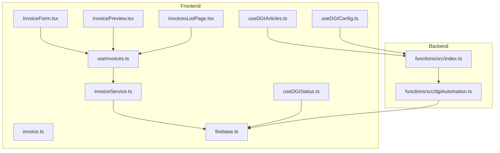
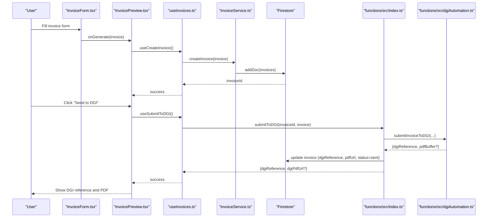
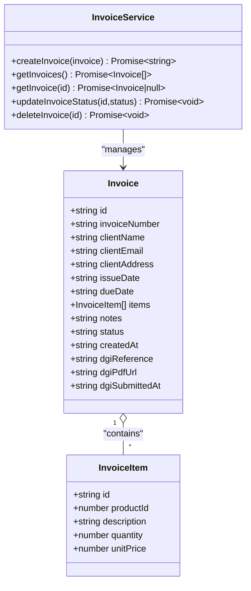
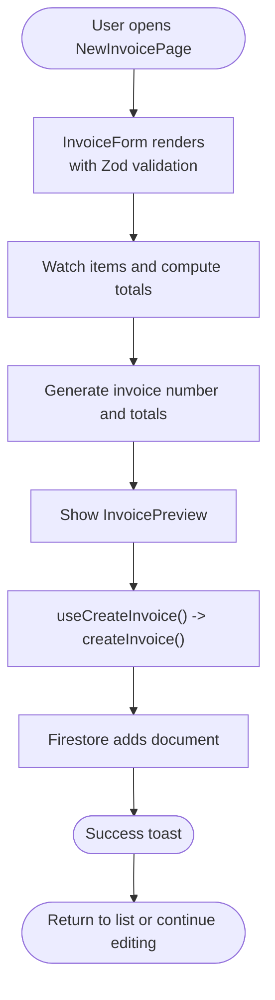
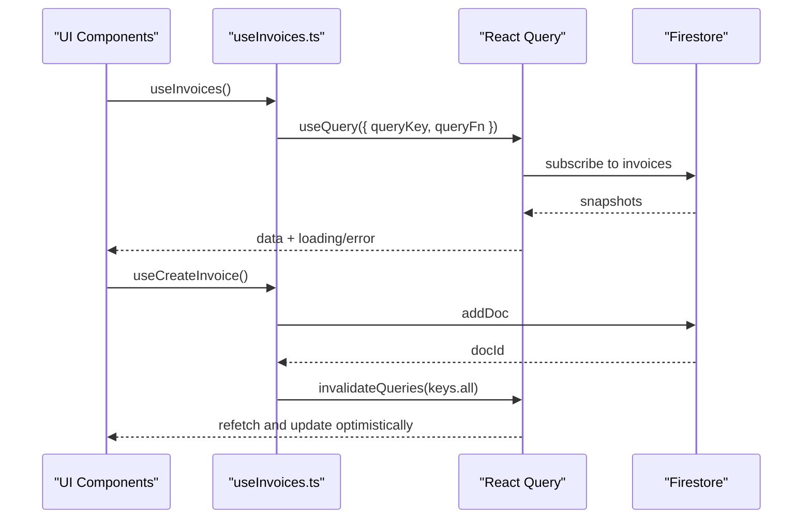
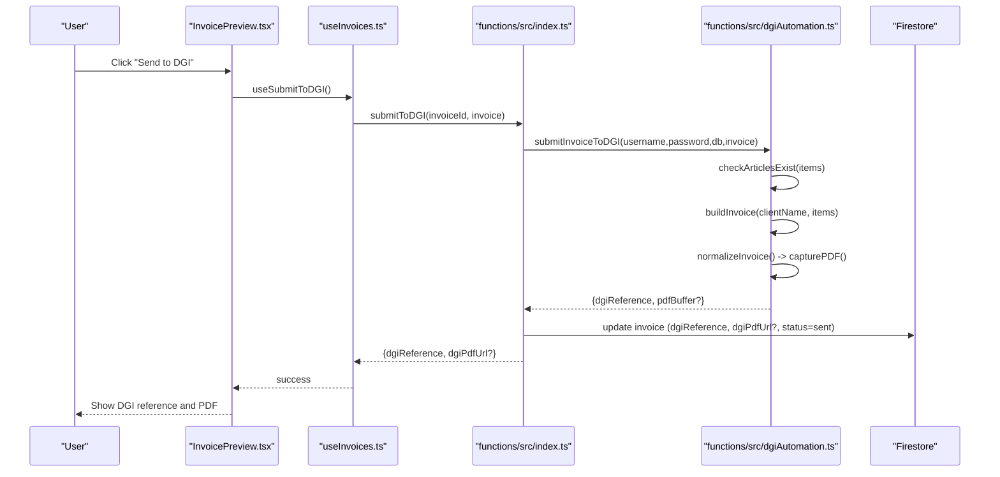
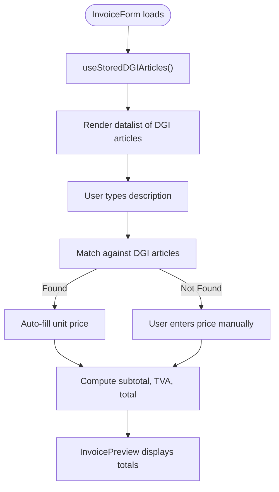
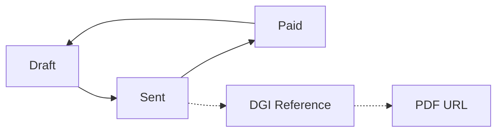
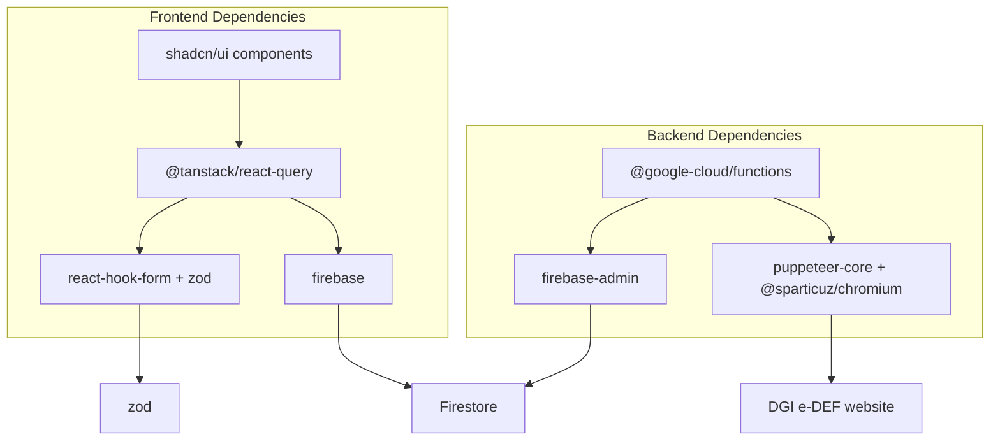

# Invoice Management System

<cite>
**Referenced Files in This Document**
- [invoice.ts](file://src/types/invoice.ts)
- [useInvoices.ts](file://src/hooks/useInvoices.ts)
- [invoiceService.ts](file://src/lib/invoiceService.ts)
- [InvoiceForm.tsx](file://src/components/InvoiceForm.tsx)
- [NewInvoicePage.tsx](file://src/pages/NewInvoicePage.tsx)
- [InvoicesListPage.tsx](file://src/pages/InvoicesListPage.tsx)
- [InvoicePreview.tsx](file://src/components/InvoicePreview.tsx)
- [dgiAutomation.ts](file://functions/src/dgiAutomation.ts)
- [index.ts](file://functions/src/index.ts)
- [useDGIArticles.ts](file://src/hooks/useDGIArticles.ts)
- [useDGIConfig.ts](file://src/hooks/useDGIConfig.ts)
- [useDGIStatus.ts](file://src/hooks/useDGIStatus.ts)
- [firebase.ts](file://src/lib/firebase.ts)
- [package.json](file://package.json)
</cite>

## Table of Contents
1. [Introduction](#introduction)
2. [Project Structure](#project-structure)
3. [Core Components](#core-components)
4. [Architecture Overview](#architecture-overview)
5. [Detailed Component Analysis](#detailed-component-analysis)
6. [Dependency Analysis](#dependency-analysis)
7. [Performance Considerations](#performance-considerations)
8. [Troubleshooting Guide](#troubleshooting-guide)
9. [Conclusion](#conclusion)

## Introduction
This document describes the ETSMEDF invoice management system, covering the complete lifecycle from creation to submission to the DGI e-DEF platform. It explains the data model, validation rules, tax calculation logic, client and product catalog integration, Firestore synchronization, and the automated DGI submission workflow. Practical examples demonstrate invoice creation forms, validation patterns, and status monitoring. The document also outlines DGI compliance requirements and the relationship between invoice data and platform-specific fields and formatting standards.

## Project Structure
The system is organized into a React frontend and a Firebase Cloud Functions backend:
- Frontend (React + TypeScript):
  - Types and validation: invoice data model and tax calculations
  - Hooks for Firestore and Cloud Functions interactions
  - UI components for invoice creation, preview, and listing
  - Authentication and Firestore initialization
- Backend (Cloud Functions + Puppeteer):
  - DGI automation for login, article management, and invoice normalization
  - HTTPS callable functions exposing DGI operations to the frontend
  - Firestore-backed configuration and session persistence

**Diagram sources**
- [InvoiceForm.tsx:1-343](file://src/components/InvoiceForm.tsx#L1-L343)
- [InvoicePreview.tsx:1-347](file://src/components/InvoicePreview.tsx#L1-L347)
- [InvoicesListPage.tsx:1-174](file://src/pages/InvoicesListPage.tsx#L1-L174)
- [useInvoices.ts:1-90](file://src/hooks/useInvoices.ts#L1-L90)
- [useDGIArticles.ts:1-107](file://src/hooks/useDGIArticles.ts#L1-L107)
- [useDGIConfig.ts:1-84](file://src/hooks/useDGIConfig.ts#L1-L84)
- [useDGIStatus.ts:1-34](file://src/hooks/useDGIStatus.ts#L1-L34)
- [invoiceService.ts:1-58](file://src/lib/invoiceService.ts#L1-L58)
- [invoice.ts:1-39](file://src/types/invoice.ts#L1-L39)
- [firebase.ts:1-23](file://src/lib/firebase.ts#L1-L23)
- [index.ts:1-243](file://functions/src/index.ts#L1-L243)
- [dgiAutomation.ts:1-1325](file://functions/src/dgiAutomation.ts#L1-L1325)

**Section sources**
- [package.json:1-56](file://package.json#L1-L56)
- [firebase.ts:1-23](file://src/lib/firebase.ts#L1-L23)

## Core Components
This section documents the data model, validation rules, tax computation, and CRUD hooks.

- Invoice data model
  - Fields include identifiers, client information, dates, line items, notes, status, and DGI metadata (reference, PDF URL, submission timestamp).
  - Status values are constrained to draft, sent, and paid.
  - Items include description, quantity, and unit price.

- Validation rules
  - Client name is required.
  - Email is optional but must be valid if provided.
  - Issue and due dates are required.
  - Items array must not be empty; each item requires description, quantity ≥ 1, and unit price ≥ 0.
  - Autocomplete integration suggests DGI article prices when a matching description is selected.

- Tax calculation logic
  - Subtotal equals the sum of quantity × unit price per item.
  - TVA (16%) computed as subtotal × 0.16.
  - Total equals subtotal + TVA.

- CRUD operations
  - Create, list, fetch, update status, and delete invoices stored in Firestore.
  - Optimistic UI updates invalidate queries to reflect changes immediately.

- DGI integration
  - Submit to DGI via HTTPS callable function.
  - On success, Firestore invoice is updated with DGI reference, PDF URL, submission timestamp, and status set to sent.
  - Live synchronization keeps UI in sync with Firestore.

**Section sources**
- [invoice.ts:1-39](file://src/types/invoice.ts#L1-L39)
- [InvoiceForm.tsx:15-31](file://src/components/InvoiceForm.tsx#L15-L31)
- [InvoiceForm.tsx:39-49](file://src/components/InvoiceForm.tsx#L39-L49)
- [invoiceService.ts:19-57](file://src/lib/invoiceService.ts#L19-L57)
- [useInvoices.ts:17-89](file://src/hooks/useInvoices.ts#L17-L89)
- [InvoicePreview.tsx:38-77](file://src/components/InvoicePreview.tsx#L38-L77)

## Architecture Overview
The system follows a reactive architecture:
- Frontend uses React Query for caching, invalidation, and optimistic updates.
- Firestore provides real-time synchronization via onSnapshot and query listeners.
- Cloud Functions expose DGI operations as HTTPS callable functions.
- Puppeteer automates DGI web interactions for login, article management, and invoice normalization.

**Diagram sources**
- [InvoiceForm.tsx:98-106](file://src/components/InvoiceForm.tsx#L98-L106)
- [InvoicePreview.tsx:59-77](file://src/components/InvoicePreview.tsx#L59-L77)
- [useInvoices.ts:32-89](file://src/hooks/useInvoices.ts#L32-L89)
- [invoiceService.ts:19-25](file://src/lib/invoiceService.ts#L19-L25)
- [index.ts:180-242](file://functions/src/index.ts#L180-L242)
- [dgiAutomation.ts:1299-1324](file://functions/src/dgiAutomation.ts#L1299-L1324)

## Detailed Component Analysis

### Invoice Data Model and Validation
The invoice model defines the shape of invoice records and supporting computations. Validation ensures data integrity at the UI level and prevents invalid submissions.

**Diagram sources**
- [invoice.ts:1-24](file://src/types/invoice.ts#L1-L24)
- [invoiceService.ts:19-57](file://src/lib/invoiceService.ts#L19-L57)

**Section sources**
- [invoice.ts:1-39](file://src/types/invoice.ts#L1-L39)
- [InvoiceForm.tsx:15-31](file://src/components/InvoiceForm.tsx#L15-L31)

### Invoice Creation Workflow
The creation workflow combines form validation, local calculations, and Firestore persistence.

**Diagram sources**
- [NewInvoicePage.tsx:9-22](file://src/pages/NewInvoicePage.tsx#L9-L22)
- [InvoiceForm.tsx:51-106](file://src/components/InvoiceForm.tsx#L51-L106)
- [invoiceService.ts:19-25](file://src/lib/invoiceService.ts#L19-L25)

**Section sources**
- [NewInvoicePage.tsx:1-45](file://src/pages/NewInvoicePage.tsx#L1-L45)
- [InvoiceForm.tsx:1-343](file://src/components/InvoiceForm.tsx#L1-L343)
- [invoiceService.ts:1-58](file://src/lib/invoiceService.ts#L1-L58)

### Real-Time Firestore Synchronization and Optimistic Updates
The system uses React Query with query keys and optimistic updates to keep the UI synchronized with Firestore.

**Diagram sources**
- [useInvoices.ts:17-38](file://src/hooks/useInvoices.ts#L17-L38)
- [invoiceService.ts:27-37](file://src/lib/invoiceService.ts#L27-L37)

**Section sources**
- [useInvoices.ts:1-90](file://src/hooks/useInvoices.ts#L1-L90)
- [invoiceService.ts:1-58](file://src/lib/invoiceService.ts#L1-L58)

### DGI Submission Workflow
The DGI submission process validates prerequisites, logs into DGI, checks article availability, builds the invoice, normalizes it, captures the PDF, and updates Firestore.

**Diagram sources**
- [InvoicePreview.tsx:59-77](file://src/components/InvoicePreview.tsx#L59-L77)
- [useInvoices.ts:60-89](file://src/hooks/useInvoices.ts#L60-L89)
- [index.ts:180-242](file://functions/src/index.ts#L180-L242)
- [dgiAutomation.ts:855-882](file://functions/src/dgiAutomation.ts#L855-L882)
- [dgiAutomation.ts:1096-1225](file://functions/src/dgiAutomation.ts#L1096-L1225)
- [dgiAutomation.ts:1229-1295](file://functions/src/dgiAutomation.ts#L1229-L1295)

**Section sources**
- [InvoicePreview.tsx:1-347](file://src/components/InvoicePreview.tsx#L1-L347)
- [useInvoices.ts:60-89](file://src/hooks/useInvoices.ts#L60-L89)
- [index.ts:180-242](file://functions/src/index.ts#L180-L242)
- [dgiAutomation.ts:1-1325](file://functions/src/dgiAutomation.ts#L1-L1325)

### Client Information Management and Item Catalog Integration
- Client information is captured in the form with optional email and address fields.
- The item catalog integrates with DGI articles for autocomplete and pricing suggestions.
- Local item normalization converts quantities and prices to numbers for accurate totals.

**Diagram sources**
- [InvoiceForm.tsx:53-96](file://src/components/InvoiceForm.tsx#L53-L96)
- [useDGIArticles.ts:16-40](file://src/hooks/useDGIArticles.ts#L16-L40)
- [invoice.ts:28-38](file://src/types/invoice.ts#L28-L38)

**Section sources**
- [InvoiceForm.tsx:1-343](file://src/components/InvoiceForm.tsx#L1-L343)
- [useDGIArticles.ts:1-107](file://src/hooks/useDGIArticles.ts#L1-L107)
- [invoice.ts:1-39](file://src/types/invoice.ts#L1-L39)

### Status Tracking and Monitoring
- Status badges and labels provide localized display for draft, sent, and paid states.
- The invoice preview allows changing status and shows DGI submission state.
- DGI session status is tracked via Firestore snapshot of the session document.

**Diagram sources**
- [InvoicesListPage.tsx:15-25](file://src/pages/InvoicesListPage.tsx#L15-L25)
- [InvoicePreview.tsx:26-36](file://src/components/InvoicePreview.tsx#L26-L36)
- [useDGIStatus.ts:12-33](file://src/hooks/useDGIStatus.ts#L12-L33)

**Section sources**
- [InvoicesListPage.tsx:1-174](file://src/pages/InvoicesListPage.tsx#L1-L174)
- [InvoicePreview.tsx:1-347](file://src/components/InvoicePreview.tsx#L1-L347)
- [useDGIStatus.ts:1-34](file://src/hooks/useDGIStatus.ts#L1-L34)

## Dependency Analysis
The frontend depends on React, React Query, React Hook Form, Zod, and Firebase. The backend depends on Puppeteer, Chromium runtime, and Firebase Admin SDK. The DGI automation module orchestrates browser interactions and Firestore updates.

**Diagram sources**
- [package.json:12-31](file://package.json#L12-L31)
- [index.ts:1-26](file://functions/src/index.ts#L1-L26)
- [dgiAutomation.ts:1-11](file://functions/src/dgiAutomation.ts#L1-L11)

**Section sources**
- [package.json:1-56](file://package.json#L1-L56)
- [index.ts:1-243](file://functions/src/index.ts#L1-L243)
- [dgiAutomation.ts:1-1325](file://functions/src/dgiAutomation.ts#L1-L1325)

## Performance Considerations
- Use React Query’s query keys and cache invalidation to minimize redundant Firestore reads.
- Keep form validation lightweight with Zod resolvers and avoid unnecessary re-renders by watching only required fields.
- Defer PDF capture to the backend to prevent blocking the UI; display a loading indicator while submitting to DGI.
- Use Firestore indexes on frequently queried fields (e.g., createdAt) to optimize list queries.
- Limit Puppeteer sessions to necessary operations and reuse authenticated sessions via Firestore-stored cookies.

## Troubleshooting Guide
Common issues and resolutions:
- DGI login failures
  - Verify DGI credentials are configured as Firebase secrets.
  - Check network connectivity and DGI site accessibility.
  - Review logs for explicit error messages indicating missing fields or incorrect credentials.

- Missing articles in DGI
  - Ensure all invoice items exist in the DGI article catalog for the selected e-UF.
  - Add missing articles via the article management functions before submission.

- PDF capture failures
  - Some DGI pages may require manual download; the system logs when PDF capture fails.
  - Confirm the invoice was successfully normalized and that the PDF URL is available.

- Firestore permission denied
  - Verify Firestore rules permit read/write access for authenticated users.
  - Ensure the Firebase configuration matches the deployed environment.

- Session expiration
  - The system saves browser cookies to Firestore; if login fails, clear the session and re-authenticate.

**Section sources**
- [index.ts:31-38](file://functions/src/index.ts#L31-L38)
- [dgiAutomation.ts:855-882](file://functions/src/dgiAutomation.ts#L855-L882)
- [dgiAutomation.ts:1271-1295](file://functions/src/dgiAutomation.ts#L1271-L1295)
- [useDGIStatus.ts:12-33](file://src/hooks/useDGIStatus.ts#L12-L33)

## Conclusion
ETSMEDF provides a robust, real-time invoice management solution integrated with the DGI e-DEF platform. The system enforces strict validation, computes taxes accurately, and automates DGI submissions while maintaining live synchronization with Firestore. By leveraging React Query, Zod, and Puppeteer, it balances user experience with compliance requirements, ensuring invoices meet DGI standards and remain trackable through reference numbers and PDFs.