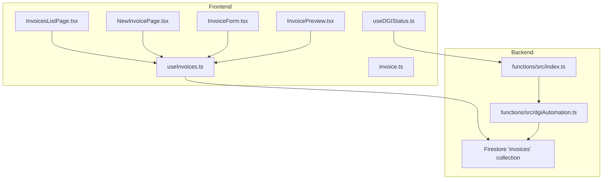
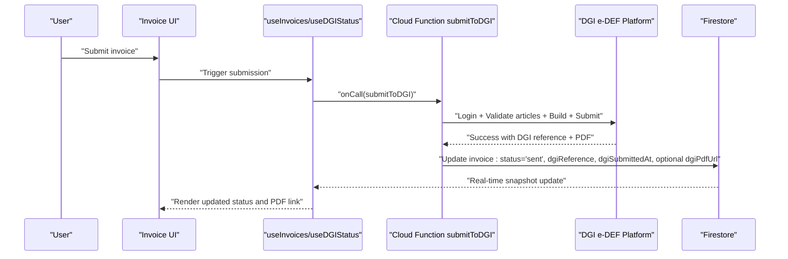
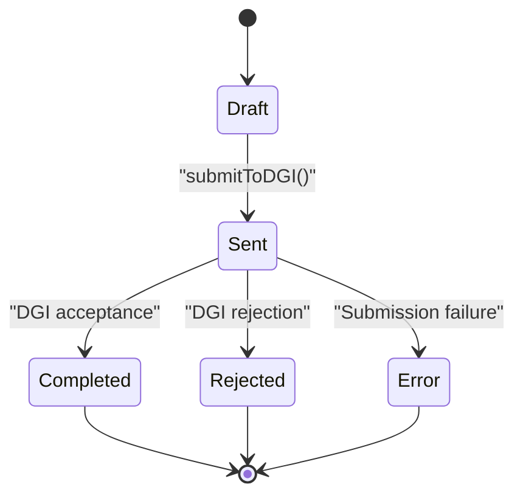
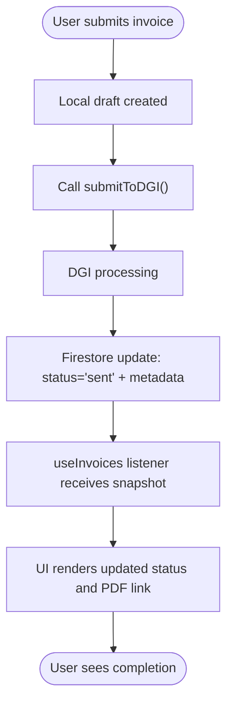
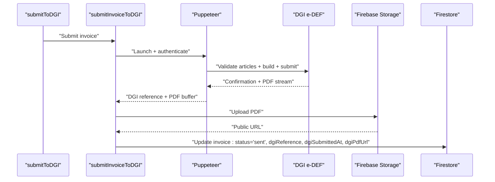
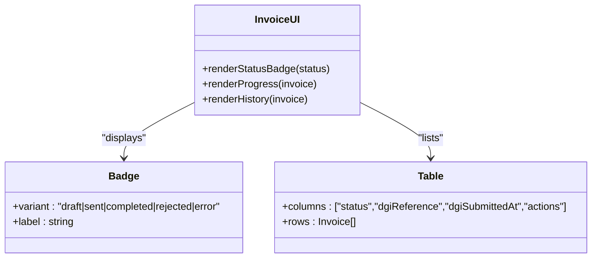
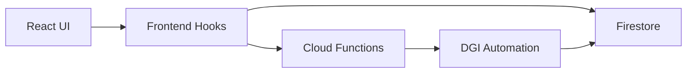

# Invoice Status Tracking and Monitoring

<cite>
**Referenced Files in This Document**
- [index.ts](file://functions/src/index.ts)
- [dgiAutomation.ts](file://functions/src/dgiAutomation.ts)
- [invoice.ts](file://src/types/invoice.ts)
- [useDGIStatus.ts](file://src/hooks/useDGIStatus.ts)
- [useInvoices.ts](file://src/hooks/useInvoices.ts)
- [invoiceService.ts](file://src/lib/invoiceService.ts)
- [InvoicesListPage.tsx](file://src/pages/InvoicesListPage.tsx)
- [NewInvoicePage.tsx](file://src/pages/NewInvoicePage.tsx)
- [InvoiceForm.tsx](file://src/components/InvoiceForm.tsx)
- [InvoicePreview.tsx](file://src/components/InvoicePreview.tsx)
- [badge.tsx](file://src/components/ui/badge.tsx)
- [table.tsx](file://src/components/ui/table.tsx)
</cite>

## Table of Contents
1. [Introduction](#introduction)
2. [Project Structure](#project-structure)
3. [Core Components](#core-components)
4. [Architecture Overview](#architecture-overview)
5. [Detailed Component Analysis](#detailed-component-analysis)
6. [Dependency Analysis](#dependency-analysis)
7. [Performance Considerations](#performance-considerations)
8. [Troubleshooting Guide](#troubleshooting-guide)
9. [Conclusion](#conclusion)

## Introduction
This document explains the invoice status tracking and monitoring system in ETSMEDF, focusing on the end-to-end lifecycle from draft creation through DGI submission and completion. It documents status field definitions, state transitions, business logic governing status changes, real-time updates from DGI platform responses, and local state synchronization. It also covers user interface components for status display, progress tracking, status history, monitoring patterns, notifications, resolution workflows, DGI e-DEF integration, and recovery procedures.

## Project Structure
The system spans a React frontend and a Cloud Functions backend:
- Frontend (React + TypeScript):
  - Types define invoice status fields and related metadata
  - Hooks manage DGI session and invoice state
  - Pages and components render status displays and collect user actions
- Backend (Cloud Functions + Puppeteer automation):
  - Exposed callable functions orchestrate DGI login, article validation, invoice submission, and PDF capture
  - Firestore stores invoices and synchronizes status updates

**Diagram sources**
- [index.ts:42-242](file://functions/src/index.ts#L42-L242)
- [dgiAutomation.ts:1404-1429](file://functions/src/dgiAutomation.ts#L1404-L1429)
- [invoice.ts](file://src/types/invoice.ts)
- [useInvoices.ts](file://src/hooks/useInvoices.ts)
- [useDGIStatus.ts](file://src/hooks/useDGIStatus.ts)
- [InvoicesListPage.tsx](file://src/pages/InvoicesListPage.tsx)
- [NewInvoicePage.tsx](file://src/pages/NewInvoicePage.tsx)
- [InvoiceForm.tsx](file://src/components/InvoiceForm.tsx)
- [InvoicePreview.tsx](file://src/components/InvoicePreview.tsx)

**Section sources**
- [index.ts:42-242](file://functions/src/index.ts#L42-L242)
- [dgiAutomation.ts:1404-1429](file://functions/src/dgiAutomation.ts#L1404-L1429)
- [invoice.ts](file://src/types/invoice.ts)

## Core Components
- Status fields and lifecycle:
  - Draft creation: initial state stored locally before submission
  - Submission to DGI: triggers backend automation and sets "sent"
  - Post-submission: status synchronized via Firestore listeners and DGI responses
- Backend orchestration:
  - Callable functions handle DGI login/logout, article validation, invoice submission, and PDF capture/upload
  - Firestore updates persist status, DGI reference, and timestamps
- Frontend hooks:
  - useInvoices manages invoice lists and real-time status synchronization
  - useDGIStatus manages DGI session state and login/logout flows
- UI components:
  - Badge and table components visually represent status and present status history
  - List and form pages render status indicators and action controls

**Section sources**
- [index.ts:42-242](file://functions/src/index.ts#L42-L242)
- [dgiAutomation.ts:1404-1429](file://functions/src/dgiAutomation.ts#L1404-L1429)
- [useInvoices.ts](file://src/hooks/useInvoices.ts)
- [useDGIStatus.ts](file://src/hooks/useDGIStatus.ts)
- [badge.tsx](file://src/components/ui/badge.tsx)
- [table.tsx](file://src/components/ui/table.tsx)

## Architecture Overview
The system integrates a React frontend with Firestore for real-time state and Cloud Functions for DGI automation. The DGI submission flow captures a PDF receipt and persists it alongside the invoice record.

**Diagram sources**
- [index.ts:188-242](file://functions/src/index.ts#L188-L242)
- [dgiAutomation.ts:1404-1429](file://functions/src/dgiAutomation.ts#L1404-L1429)
- [useInvoices.ts](file://src/hooks/useInvoices.ts)

## Detailed Component Analysis

### Status Field Definitions and Lifecycle
- Fields commonly tracked:
  - status: current lifecycle stage (e.g., draft, sent)
  - dgiReference: DGI reference number after successful submission
  - dgiSubmittedAt: server timestamp of submission
  - dgiPdfUrl: public URL to the captured PDF receipt
- Lifecycle stages:
  - Draft: local preparation before submission
  - Sent: submitted to DGI, awaiting processing
  - Completed/Rejected/Error: determined by DGI response and subsequent synchronization

**Diagram sources**
- [index.ts:228-233](file://functions/src/index.ts#L228-L233)
- [dgiAutomation.ts:1404-1429](file://functions/src/dgiAutomation.ts#L1404-L1429)

**Section sources**
- [index.ts:228-233](file://functions/src/index.ts#L228-L233)
- [invoice.ts](file://src/types/invoice.ts)

### Real-Time Status Updates and Local Synchronization
- Real-time synchronization:
  - useInvoices subscribes to Firestore invoice collections and updates local state reactively
  - UI components re-render based on live snapshots
- Local state management:
  - Draft invoices are created locally until submission
  - After submission, the backend writes "sent" and associated metadata to Firestore
  - UI reflects the updated status immediately

**Diagram sources**
- [index.ts:188-242](file://functions/src/index.ts#L188-L242)
- [useInvoices.ts](file://src/hooks/useInvoices.ts)

**Section sources**
- [useInvoices.ts](file://src/hooks/useInvoices.ts)
- [index.ts:228-233](file://functions/src/index.ts#L228-L233)

### DGI Integration and Automatic Status Updates
- Login/logout:
  - DGI credentials are retrieved and used to authenticate sessions
  - Sessions are saved and reused to avoid repeated logins
- Article validation and invoice building:
  - Articles are validated against DGI e-DEF before submission
  - The invoice is constructed and normalized
- PDF capture and upload:
  - A PDF receipt is captured upon successful submission
  - The PDF is uploaded to Firebase Storage and made publicly accessible
- Status update:
  - On success, the invoice document is updated with DGI reference, timestamp, and status

**Diagram sources**
- [index.ts:188-242](file://functions/src/index.ts#L188-L242)
- [dgiAutomation.ts:1404-1429](file://functions/src/dgiAutomation.ts#L1404-L1429)

**Section sources**
- [index.ts:42-71](file://functions/src/index.ts#L42-L71)
- [index.ts:188-242](file://functions/src/index.ts#L188-L242)
- [dgiAutomation.ts:1404-1429](file://functions/src/dgiAutomation.ts#L1404-L1429)

### User Interface Components for Status Display
- Status badges:
  - Visual indicators show current status (e.g., draft, sent, completed)
- Progress tracking:
  - Invoice list pages display status columns and recent activity
- Status history:
  - Table components present chronological status changes and metadata (reference, timestamps)
- Forms and previews:
  - Invoice forms and previews reflect current status and enable actions (submit, retry)

**Diagram sources**
- [badge.tsx](file://src/components/ui/badge.tsx)
- [table.tsx](file://src/components/ui/table.tsx)
- [InvoicesListPage.tsx](file://src/pages/InvoicesListPage.tsx)
- [NewInvoicePage.tsx](file://src/pages/NewInvoicePage.tsx)

**Section sources**
- [badge.tsx](file://src/components/ui/badge.tsx)
- [table.tsx](file://src/components/ui/table.tsx)
- [InvoicesListPage.tsx](file://src/pages/InvoicesListPage.tsx)
- [NewInvoicePage.tsx](file://src/pages/NewInvoicePage.tsx)
- [InvoiceForm.tsx](file://src/components/InvoiceForm.tsx)
- [InvoicePreview.tsx](file://src/components/InvoicePreview.tsx)

### Status Monitoring Patterns and Notification Systems
- Monitoring patterns:
  - Subscribe to Firestore invoice collections to receive real-time updates
  - Poll or listen for DGI-specific events if exposed by backend
- Notifications:
  - Toasts or banners can surface submission outcomes and errors
  - Status badges and table rows highlight critical states (rejected, error)
- Status history:
  - Maintain a compact history of status transitions and timestamps for auditability

**Section sources**
- [useInvoices.ts](file://src/hooks/useInvoices.ts)
- [InvoicesListPage.tsx](file://src/pages/InvoicesListPage.tsx)

### Status Resolution Workflows
- Successful submission:
  - Transition to "sent" with DGI reference and optional PDF URL
- Rejection or error:
  - Display actionable messages and allow corrections
  - Enable resubmission after fixes
- Manual intervention:
  - Allow users to trigger DGI login/logout and re-run validations
  - Provide retry mechanisms for transient failures

**Section sources**
- [index.ts:188-242](file://functions/src/index.ts#L188-L242)
- [useDGIStatus.ts](file://src/hooks/useDGIStatus.ts)

## Dependency Analysis
The frontend depends on Firestore for real-time state and on Cloud Functions for DGI operations. The backend orchestrates DGI interactions and persists state.

**Diagram sources**
- [useInvoices.ts](file://src/hooks/useInvoices.ts)
- [index.ts:188-242](file://functions/src/index.ts#L188-L242)
- [dgiAutomation.ts:1404-1429](file://functions/src/dgiAutomation.ts#L1404-L1429)

**Section sources**
- [useInvoices.ts](file://src/hooks/useInvoices.ts)
- [index.ts:188-242](file://functions/src/index.ts#L188-L242)
- [dgiAutomation.ts:1404-1429](file://functions/src/dgiAutomation.ts#L1404-L1429)

## Performance Considerations
- Minimize redundant submissions by validating locally before invoking backend functions
- Cache DGI session cookies to reduce repeated authentication overhead
- Debounce real-time listeners to avoid excessive re-renders during bulk updates
- Compress and lazily load PDF previews to improve UI responsiveness

## Troubleshooting Guide
- Authentication failures:
  - Verify DGI credentials and session persistence
  - Trigger logout/login cycle to refresh session
- Submission errors:
  - Inspect DGI error messages returned by the backend
  - Validate required invoice items and article availability
- PDF capture issues:
  - Confirm browser automation permissions and network connectivity
  - Retry submission if PDF was not captured initially
- Status desynchronization:
  - Refresh Firestore listeners and confirm latest snapshots
  - Manually trigger a status refresh if needed

**Section sources**
- [index.ts:42-71](file://functions/src/index.ts#L42-L71)
- [index.ts:188-242](file://functions/src/index.ts#L188-L242)
- [dgiAutomation.ts:1151-1172](file://functions/src/dgiAutomation.ts#L1151-L1172)

## Conclusion
ETSMEDF implements a robust invoice status tracking system combining real-time Firestore synchronization with automated DGI e-DEF submissions. Clear status fields, well-defined lifecycle transitions, and comprehensive UI components enable effective monitoring and resolution. The backend ensures reliable DGI integration with PDF capture and persistent metadata, while the frontend delivers responsive status displays and actionable workflows.