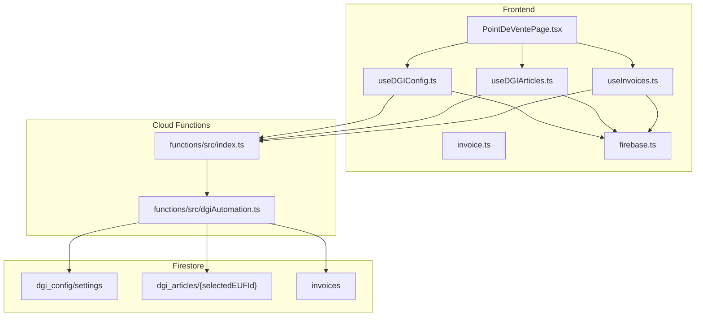
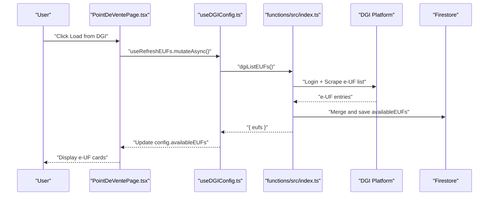
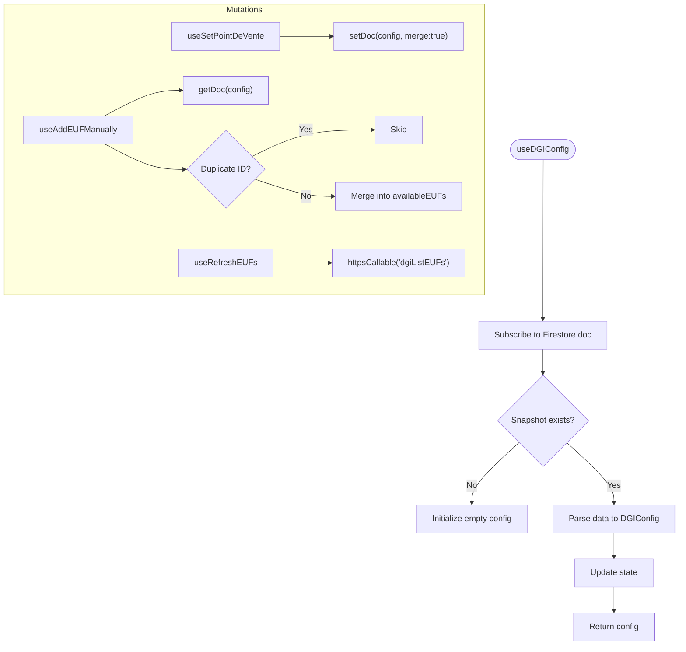
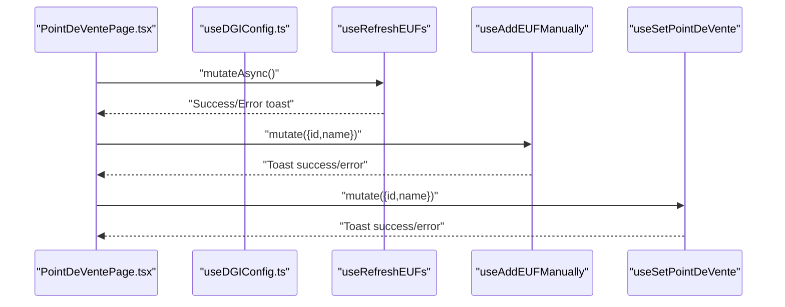
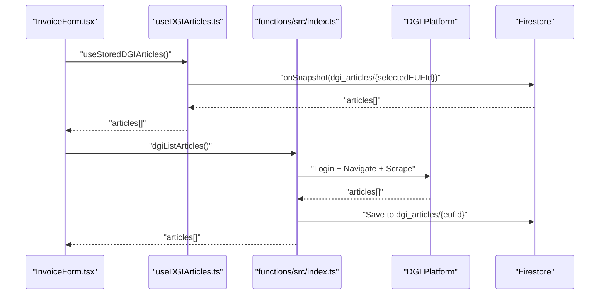
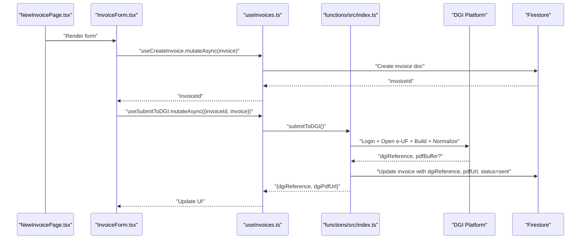
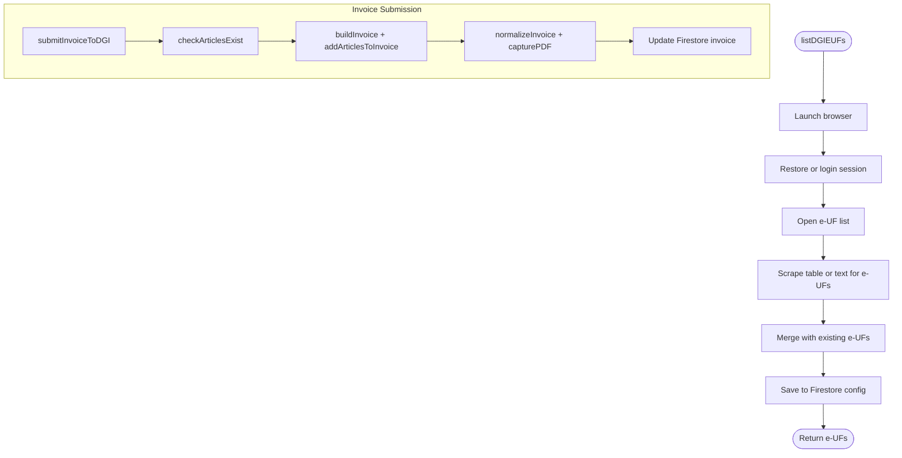
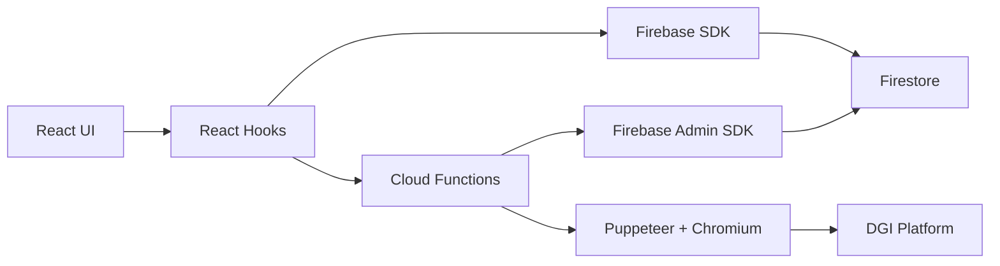

# Point-of-Sale Management

<cite>
**Referenced Files in This Document**
- [useDGIConfig.ts](file://src/hooks/useDGIConfig.ts)
- [PointDeVentePage.tsx](file://src/pages/PointDeVentePage.tsx)
- [dgiAutomation.ts](file://functions/src/dgiAutomation.ts)
- [index.ts](file://functions/src/index.ts)
- [firebase.ts](file://src/lib/firebase.ts)
- [invoice.ts](file://src/types/invoice.ts)
- [useDGIArticles.ts](file://src/hooks/useDGIArticles.ts)
- [invoiceService.ts](file://src/lib/invoiceService.ts)
- [NewInvoicePage.tsx](file://src/pages/NewInvoicePage.tsx)
- [InvoiceForm.tsx](file://src/components/InvoiceForm.tsx)
- [useInvoices.ts](file://src/hooks/useInvoices.ts)
</cite>

## Table of Contents
1. [Introduction](#introduction)
2. [Project Structure](#project-structure)
3. [Core Components](#core-components)
4. [Architecture Overview](#architecture-overview)
5. [Detailed Component Analysis](#detailed-component-analysis)
6. [Dependency Analysis](#dependency-analysis)
7. [Performance Considerations](#performance-considerations)
8. [Troubleshooting Guide](#troubleshooting-guide)
9. [Conclusion](#conclusion)
10. [Appendices](#appendices)

## Introduction
This document explains how ETSMEDF’s e-UF (Electronic Point of Sale) system manages multiple sales points within the DGI framework. It covers:
- Creating, selecting, and maintaining point-of-sale configurations
- Integrating with the DGI platform for point registration and synchronization
- Using the useDGIConfig hook for configuration management, including data fetching, caching, and real-time updates
- Practical examples of point configuration forms, validation rules, and operational workflows
- The relationship between points of sale and invoice generation, tax reporting, and compliance obligations
- Common point management issues and configuration troubleshooting

## Project Structure
The system is split between a React frontend and Firebase Cloud Functions backend:
- Frontend hooks and pages manage point-of-sale selection and invoice workflows
- Cloud Functions automate DGI interactions (login, e-UF listing, article management, invoice submission)
- Firestore stores configuration, articles, and invoices

**Diagram sources**
- [PointDeVentePage.tsx:19-281](file://src/pages/PointDeVentePage.tsx#L19-L281)
- [useDGIConfig.ts:21-84](file://src/hooks/useDGIConfig.ts#L21-L84)
- [useDGIArticles.ts:16-107](file://src/hooks/useDGIArticles.ts#L16-L107)
- [useInvoices.ts:17-90](file://src/hooks/useInvoices.ts#L17-L90)
- [index.ts:75-89](file://functions/src/index.ts#L75-L89)
- [dgiAutomation.ts:536-594](file://functions/src/dgiAutomation.ts#L536-L594)

**Section sources**
- [PointDeVentePage.tsx:19-281](file://src/pages/PointDeVentePage.tsx#L19-L281)
- [useDGIConfig.ts:21-84](file://src/hooks/useDGIConfig.ts#L21-L84)
- [useDGIArticles.ts:16-107](file://src/hooks/useDGIArticles.ts#L16-L107)
- [useInvoices.ts:17-90](file://src/hooks/useInvoices.ts#L17-L90)
- [index.ts:75-89](file://functions/src/index.ts#L75-L89)
- [dgiAutomation.ts:536-594](file://functions/src/dgiAutomation.ts#L536-L594)

## Core Components
- useDGIConfig: Real-time configuration for the active e-DEF, with mutations to select and add e-UFs manually, and a function to refresh e-UFs from DGI
- PointDeVentePage: UI for loading e-UFs from DGI, manual addition, and selecting the active point
- useDGIArticles: Live articles list per e-UF and CRUD operations against DGI
- useInvoices + invoiceService: Local invoice lifecycle and submission to DGI via Cloud Functions
- dgiAutomation: Browser automation for DGI login, e-UF listing, article management, and invoice submission
- index.ts: Exposes Cloud Functions for DGI operations and invoice submission

**Section sources**
- [useDGIConfig.ts:21-84](file://src/hooks/useDGIConfig.ts#L21-L84)
- [PointDeVentePage.tsx:19-281](file://src/pages/PointDeVentePage.tsx#L19-L281)
- [useDGIArticles.ts:16-107](file://src/hooks/useDGIArticles.ts#L16-L107)
- [useInvoices.ts:17-90](file://src/hooks/useInvoices.ts#L17-L90)
- [dgiAutomation.ts:536-594](file://functions/src/dgiAutomation.ts#L536-L594)
- [index.ts:75-89](file://functions/src/index.ts#L75-L89)

## Architecture Overview
The system integrates a React frontend with Firebase Cloud Functions to automate DGI operations. The configuration document in Firestore holds the selected e-DEF and available e-UFs. Cloud Functions use a headless browser to log in to DGI, scrape e-UF lists, manage articles, and submit invoices. PDFs are optionally stored in Firebase Storage and linked back to invoices.

**Diagram sources**
- [PointDeVentePage.tsx:29-39](file://src/pages/PointDeVentePage.tsx#L29-L39)
- [useDGIConfig.ts:72-83](file://src/hooks/useDGIConfig.ts#L72-L83)
- [index.ts:75-89](file://functions/src/index.ts#L75-L89)
- [dgiAutomation.ts:536-594](file://functions/src/dgiAutomation.ts#L536-L594)

## Detailed Component Analysis

### useDGIConfig: Point-of-Sale Configuration Hook
- Real-time subscription to Firestore configuration document
- Mutations:
  - Select active e-DEF
  - Add e-DEF manually
  - Refresh e-UF list from DGI via Cloud Function
- Data model:
  - selectedEUFId, selectedEUFName, availableEUFs, loading

**Diagram sources**
- [useDGIConfig.ts:21-84](file://src/hooks/useDGIConfig.ts#L21-L84)

**Section sources**
- [useDGIConfig.ts:21-84](file://src/hooks/useDGIConfig.ts#L21-L84)

### PointDeVentePage: Point-of-Sale Management UI
- Loads e-UFs from DGI or adds manually
- Displays active e-DEF and warnings when none is selected
- Cards show e-DEF name and ID, with selection action
- Toast notifications guide the user through operations

**Diagram sources**
- [PointDeVentePage.tsx:29-66](file://src/pages/PointDeVentePage.tsx#L29-L66)
- [useDGIConfig.ts:53-83](file://src/hooks/useDGIConfig.ts#L53-L83)

**Section sources**
- [PointDeVentePage.tsx:19-281](file://src/pages/PointDeVentePage.tsx#L19-L281)

### useDGIArticles: Article Management
- Live articles per e-UF via Firestore snapshot
- Cloud Function CRUD operations against DGI
- Query invalidation on success to keep UI in sync

**Diagram sources**
- [useDGIArticles.ts:16-107](file://src/hooks/useDGIArticles.ts#L16-L107)
- [InvoiceForm.tsx:53-54](file://src/components/InvoiceForm.tsx#L53-L54)
- [index.ts:93-107](file://functions/src/index.ts#L93-L107)
- [dgiAutomation.ts:1028-1056](file://functions/src/dgiAutomation.ts#L1028-L1056)

**Section sources**
- [useDGIArticles.ts:16-107](file://src/hooks/useDGIArticles.ts#L16-L107)
- [InvoiceForm.tsx:53-54](file://src/components/InvoiceForm.tsx#L53-L54)
- [index.ts:93-107](file://functions/src/index.ts#L93-L107)
- [dgiAutomation.ts:1028-1056](file://functions/src/dgiAutomation.ts#L1028-L1056)

### useInvoices + Invoice Workflow
- Local invoice lifecycle (create, list, update status, delete)
- Submission to DGI via Cloud Function submitToDGI
- Updates Firestore with DGI reference and optional PDF URL

**Diagram sources**
- [NewInvoicePage.tsx:9-44](file://src/pages/NewInvoicePage.tsx#L9-L44)
- [InvoiceForm.tsx:98-106](file://src/components/InvoiceForm.tsx#L98-L106)
- [useInvoices.ts:60-89](file://src/hooks/useInvoices.ts#L60-L89)
- [index.ts:180-242](file://functions/src/index.ts#L180-L242)
- [dgiAutomation.ts:1299-1325](file://functions/src/dgiAutomation.ts#L1299-L1325)

**Section sources**
- [NewInvoicePage.tsx:9-44](file://src/pages/NewInvoicePage.tsx#L9-L44)
- [InvoiceForm.tsx:98-106](file://src/components/InvoiceForm.tsx#L98-L106)
- [useInvoices.ts:60-89](file://src/hooks/useInvoices.ts#L60-L89)
- [index.ts:180-242](file://functions/src/index.ts#L180-L242)
- [dgiAutomation.ts:1299-1325](file://functions/src/dgiAutomation.ts#L1299-L1325)

### DGI Automation: Login, e-UF List, Articles, Invoices
- Browser automation with Chromium and Puppeteer
- Session persistence in Firestore
- Scraping e-UFs and articles, and invoice normalization
- PDF capture and optional upload to Firebase Storage

**Diagram sources**
- [dgiAutomation.ts:536-594](file://functions/src/dgiAutomation.ts#L536-L594)
- [dgiAutomation.ts:855-882](file://functions/src/dgiAutomation.ts#L855-L882)
- [dgiAutomation.ts:1096-1225](file://functions/src/dgiAutomation.ts#L1096-L1225)
- [dgiAutomation.ts:1229-1295](file://functions/src/dgiAutomation.ts#L1229-L1295)

**Section sources**
- [dgiAutomation.ts:536-594](file://functions/src/dgiAutomation.ts#L536-L594)
- [dgiAutomation.ts:855-882](file://functions/src/dgiAutomation.ts#L855-L882)
- [dgiAutomation.ts:1096-1225](file://functions/src/dgiAutomation.ts#L1096-L1225)
- [dgiAutomation.ts:1229-1295](file://functions/src/dgiAutomation.ts#L1229-L1295)

## Dependency Analysis
- Frontend depends on Firebase SDK for Firestore/Auth and TanStack Query for caching
- Cloud Functions depend on Firebase Admin SDK and Puppeteer for browser automation
- Firestore documents:
  - dgi_config/settings: selectedEUFId, selectedEUFName, availableEUFs
  - dgi_articles/{selectedEUFId}: items[]
  - invoices: invoice records with optional DGI metadata

**Diagram sources**
- [firebase.ts:6-23](file://src/lib/firebase.ts#L6-L23)
- [index.ts:17-38](file://functions/src/index.ts#L17-L38)
- [dgiAutomation.ts:1-11](file://functions/src/dgiAutomation.ts#L1-L11)

**Section sources**
- [firebase.ts:6-23](file://src/lib/firebase.ts#L6-L23)
- [index.ts:17-38](file://functions/src/index.ts#L17-L38)
- [dgiAutomation.ts:1-11](file://functions/src/dgiAutomation.ts#L1-L11)

## Performance Considerations
- Real-time updates: Firestore onSnapshot keeps UI in sync with minimal latency
- Caching: TanStack Query caches Cloud Function results; invalidate on success to refresh
- Browser automation: Headless Chromium runs in constrained memory; timeouts and retries are configured in Cloud Functions
- Network efficiency: Batch operations (e.g., merging e-UF lists) reduce redundant writes

[No sources needed since this section provides general guidance]

## Troubleshooting Guide
Common issues and resolutions:
- No active e-DEF selected
  - Symptom: UI warns “Aucun point de vente sélectionné”
  - Resolution: Use “Charger depuis DGI” or “Ajouter manuellement” to select an e-DEF
- DGI login failures
  - Symptom: Errors when logging in or listing e-UFs
  - Resolution: Verify DGI credentials secret configuration and network accessibility
- Missing articles when submitting invoices
  - Symptom: Error indicating missing articles
  - Resolution: Ensure all items exist in DGI under the active e-DEF; add via article management if needed
- PDF capture failures
  - Symptom: No PDF URL attached to submitted invoice
  - Resolution: Retry submission; PDF capture depends on DGI UI availability

**Section sources**
- [PointDeVentePage.tsx:162-170](file://src/pages/PointDeVentePage.tsx#L162-L170)
- [index.ts:31-38](file://functions/src/index.ts#L31-L38)
- [dgiAutomation.ts:855-882](file://functions/src/dgiAutomation.ts#L855-L882)
- [index.ts:210-233](file://functions/src/index.ts#L210-L233)

## Conclusion
ETSMEDF’s e-UF system provides a robust, automated workflow for managing multiple points of sale within the DGI framework. The useDGIConfig hook centralizes configuration state and integrates seamlessly with Cloud Functions that handle DGI login, e-UF synchronization, article management, and invoice submission. By combining Firestore snapshots, TanStack Query caching, and browser automation, the system delivers real-time updates and reliable compliance with DGI requirements.

[No sources needed since this section summarizes without analyzing specific files]

## Appendices

### Practical Workflows and Validation Rules

- Point Creation and Selection
  - Load e-UFs from DGI or add manually with validation for non-empty ID
  - Select active e-DEF to enable invoice operations

- Article Management
  - List articles per e-DEF and synchronize with Firestore
  - Add/update/delete articles on DGI; invalidate cache to refresh UI

- Invoice Generation and Submission
  - Validate client info, dates, and items
  - Ensure all items exist in DGI before submission
  - Submit to DGI; update Firestore with DGI reference and optional PDF URL

**Section sources**
- [PointDeVentePage.tsx:51-66](file://src/pages/PointDeVentePage.tsx#L51-L66)
- [InvoiceForm.tsx:15-31](file://src/components/InvoiceForm.tsx#L15-L31)
- [dgiAutomation.ts:855-882](file://functions/src/dgiAutomation.ts#L855-L882)
- [index.ts:180-242](file://functions/src/index.ts#L180-L242)

### Compliance and Tax Reporting
- Tax rate: Group B at 16% is applied to invoice totals
- Invoice metadata includes DGI reference and optional PDF URL for audit trails

**Section sources**
- [invoice.ts:26-39](file://src/types/invoice.ts#L26-L39)
- [index.ts:228-233](file://functions/src/index.ts#L228-L233)