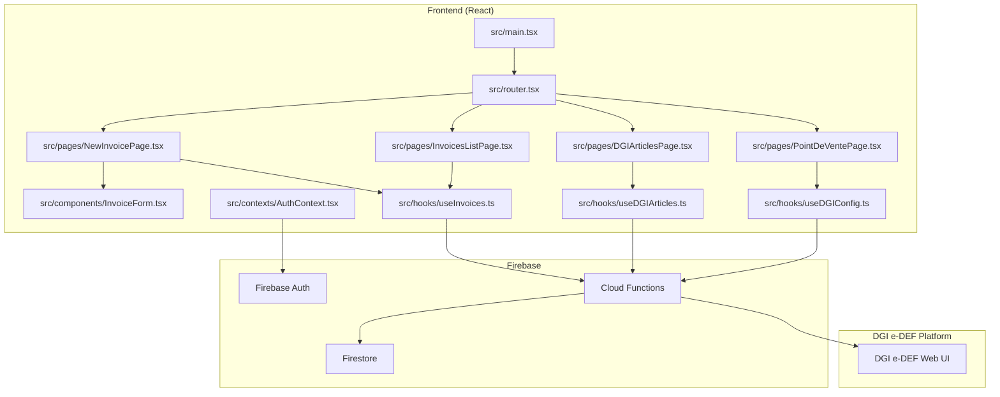
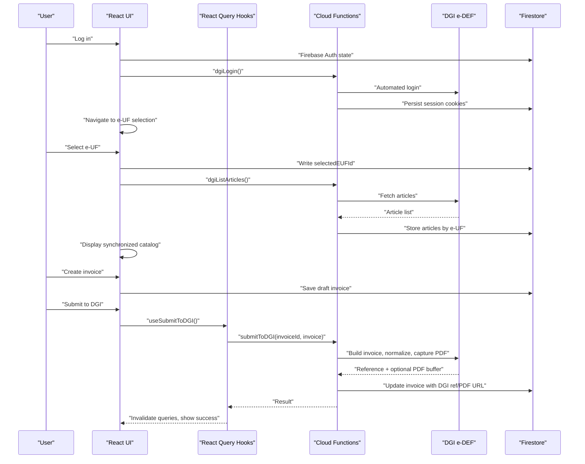
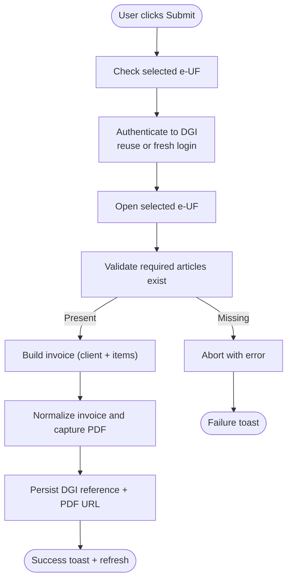
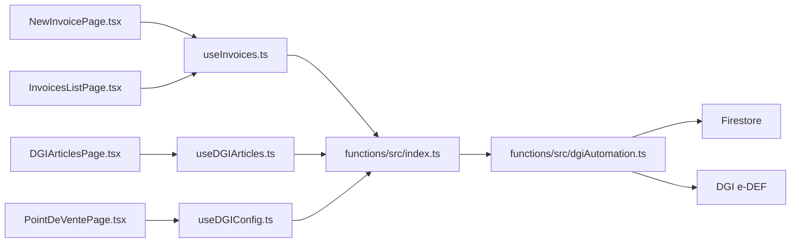

# Key Features and Capabilities

<cite>
**Referenced Files in This Document**
- [README.md](file://README.md)
- [src/main.tsx](file://src/main.tsx)
- [src/router.tsx](file://src/router.tsx)
- [functions/src/index.ts](file://functions/src/index.ts)
- [functions/src/dgiAutomation.ts](file://functions/src/dgiAutomation.ts)
- [src/pages/NewInvoicePage.tsx](file://src/pages/NewInvoicePage.tsx)
- [src/pages/InvoicesListPage.tsx](file://src/pages/InvoicesListPage.tsx)
- [src/pages/DGIArticlesPage.tsx](file://src/pages/DGIArticlesPage.tsx)
- [src/pages/PointDeVentePage.tsx](file://src/pages/PointDeVentePage.tsx)
- [src/components/InvoiceForm.tsx](file://src/components/InvoiceForm.tsx)
- [src/contexts/AuthContext.tsx](file://src/contexts/AuthContext.tsx)
- [src/hooks/useInvoices.ts](file://src/hooks/useInvoices.ts)
- [src/hooks/useDGIArticles.ts](file://src/hooks/useDGIArticles.ts)
- [src/hooks/useDGIConfig.ts](file://src/hooks/useDGIConfig.ts)
</cite>

## Table of Contents
1. [Introduction](#introduction)
2. [Project Structure](#project-structure)
3. [Core Components](#core-components)
4. [Architecture Overview](#architecture-overview)
5. [Detailed Component Analysis](#detailed-component-analysis)
6. [Dependency Analysis](#dependency-analysis)
7. [Performance Considerations](#performance-considerations)
8. [Troubleshooting Guide](#troubleshooting-guide)
9. [Conclusion](#conclusion)

## Introduction
This document presents the ETSMEDF DGI invoice management system’s key features and capabilities. It covers invoice creation and management, the DGI e-DEF automated submission workflow, point-of-sale (e-UF) management, article catalog synchronization, and user authentication. For each feature, we explain functionality, user interface elements, business value, integration capabilities with external systems, automated workflows, real-time processing, and data synchronization. Typical user workflows and feature interactions are included to guide both technical and non-technical users.

## Project Structure
The system is a React + TypeScript + Vite frontend integrated with Firebase Authentication and Cloud Functions, backed by Firestore for persistent configuration and article catalogs. Cloud Functions orchestrate browser automation against the DGI e-DEF platform to manage e-UFs, synchronize article catalogs, and submit invoices.

**Diagram sources**
- [src/main.tsx:1-22](file://src/main.tsx#L1-L22)
- [src/router.tsx:1-92](file://src/router.tsx#L1-L92)
- [src/pages/NewInvoicePage.tsx:1-45](file://src/pages/NewInvoicePage.tsx#L1-L45)
- [src/pages/InvoicesListPage.tsx:1-174](file://src/pages/InvoicesListPage.tsx#L1-L174)
- [src/pages/DGIArticlesPage.tsx:1-445](file://src/pages/DGIArticlesPage.tsx#L1-L445)
- [src/pages/PointDeVentePage.tsx:1-281](file://src/pages/PointDeVentePage.tsx#L1-L281)
- [src/components/InvoiceForm.tsx:1-343](file://src/components/InvoiceForm.tsx#L1-L343)
- [src/contexts/AuthContext.tsx:1-62](file://src/contexts/AuthContext.tsx#L1-L62)
- [src/hooks/useInvoices.ts:1-90](file://src/hooks/useInvoices.ts#L1-L90)
- [src/hooks/useDGIArticles.ts:1-107](file://src/hooks/useDGIArticles.ts#L1-L107)
- [src/hooks/useDGIConfig.ts:1-84](file://src/hooks/useDGIConfig.ts#L1-L84)

**Section sources**
- [README.md:1-74](file://README.md#L1-L74)
- [src/main.tsx:1-22](file://src/main.tsx#L1-L22)
- [src/router.tsx:1-92](file://src/router.tsx#L1-L92)

## Core Components
- Authentication and Authorization
  - Firebase Authentication powers user login/logout.
  - Background DGI login/logout via Cloud Functions to maintain session state.
  - Protected routes ensure only authenticated users can access invoice and DGI management pages.

- Invoice Creation and Management
  - Form-driven invoice builder with client info, dates, items, and totals.
  - Local draft storage in Firestore until submission.
  - List view with status badges, preview, and deletion.

- DGI e-DEF Automated Submission Workflow
  - Browser automation to log in, select an e-UF, validate article presence, build invoice, normalize, capture PDF, and persist references.

- Point-of-Sale (e-UF) Management
  - Discover and select active e-UF from DGI.
  - Manual addition of e-DEF identifiers.
  - Live configuration stored in Firestore.

- Article Catalog Synchronization
  - Fetch articles from DGI and store in Firestore under a collection keyed by selected e-UF.
  - Real-time updates via Firestore listeners.
  - CRUD operations against DGI platform through Cloud Functions.

- Integration and Automation
  - Cloud Functions expose HTTPS callable endpoints for DGI operations.
  - Frontend uses React Query to call functions and manage optimistic updates.
  - Real-time synchronization via Firestore snapshots.

**Section sources**
- [src/contexts/AuthContext.tsx:1-62](file://src/contexts/AuthContext.tsx#L1-L62)
- [src/pages/NewInvoicePage.tsx:1-45](file://src/pages/NewInvoicePage.tsx#L1-L45)
- [src/pages/InvoicesListPage.tsx:1-174](file://src/pages/InvoicesListPage.tsx#L1-L174)
- [src/components/InvoiceForm.tsx:1-343](file://src/components/InvoiceForm.tsx#L1-L343)
- [src/pages/PointDeVentePage.tsx:1-281](file://src/pages/PointDeVentePage.tsx#L1-L281)
- [src/pages/DGIArticlesPage.tsx:1-445](file://src/pages/DGIArticlesPage.tsx#L1-L445)
- [src/hooks/useInvoices.ts:1-90](file://src/hooks/useInvoices.ts#L1-L90)
- [src/hooks/useDGIArticles.ts:1-107](file://src/hooks/useDGIArticles.ts#L1-L107)
- [src/hooks/useDGIConfig.ts:1-84](file://src/hooks/useDGIConfig.ts#L1-L84)
- [functions/src/index.ts:1-243](file://functions/src/index.ts#L1-L243)
- [functions/src/dgiAutomation.ts:1-1386](file://functions/src/dgiAutomation.ts#L1-L1386)

## Architecture Overview
The system integrates a React SPA with Firebase for identity and persistence, and Cloud Functions for browser automation against DGI. The Cloud Functions manage sessions, e-UF selection, article synchronization, and invoice submission.

**Diagram sources**
- [src/contexts/AuthContext.tsx:1-62](file://src/contexts/AuthContext.tsx#L1-L62)
- [src/hooks/useDGIConfig.ts:1-84](file://src/hooks/useDGIConfig.ts#L1-L84)
- [src/hooks/useDGIArticles.ts:1-107](file://src/hooks/useDGIArticles.ts#L1-L107)
- [src/hooks/useInvoices.ts:1-90](file://src/hooks/useInvoices.ts#L1-L90)
- [functions/src/index.ts:178-242](file://functions/src/index.ts#L178-L242)
- [functions/src/dgiAutomation.ts:1360-1386](file://functions/src/dgiAutomation.ts#L1360-L1386)

## Detailed Component Analysis

### Feature: Invoice Creation and Management
- Functionality
  - Build invoices with client info, issue/due dates, notes, and line items.
  - Auto-fill unit prices from synchronized DGI article catalog.
  - Calculate subtotals, VAT, and totals in real time.
  - Save drafts to Firestore; preview and manage statuses; delete when needed.

- User Interface Elements
  - Client info card, dates card, items grid with add/remove controls, totals summary, and notes area.
  - Navigation breadcrumbs and action buttons (generate, preview, delete).
  - Status badges indicating draft/sent/paid.

- Business Value
  - Streamlines invoice creation with pre-filled pricing.
  - Reduces manual errors by validating inputs and computing totals.
  - Enables audit-ready lifecycle tracking with status updates.

- Real-Time Processing and Data Synchronization
  - Local state computed from watched form fields.
  - Firestore-backed persistence for drafts and updates.
  - Optimistic UI updates with React Query invalidation.

- Example Workflows
  - Create a new invoice: fill client info, add items, optionally auto-fill from DGI catalog, review totals, save draft.
  - Manage invoices: browse list, preview details, change status, delete when necessary.

**Section sources**
- [src/components/InvoiceForm.tsx:1-343](file://src/components/InvoiceForm.tsx#L1-L343)
- [src/pages/NewInvoicePage.tsx:1-45](file://src/pages/NewInvoicePage.tsx#L1-L45)
- [src/pages/InvoicesListPage.tsx:1-174](file://src/pages/InvoicesListPage.tsx#L1-L174)
- [src/hooks/useInvoices.ts:1-90](file://src/hooks/useInvoices.ts#L1-L90)

### Feature: DGI e-DEF Automated Submission Workflow
- Functionality
  - Authenticate against DGI using a saved session or fresh login.
  - Select the active e-UF from configuration.
  - Validate required articles exist in DGI catalog.
  - Build invoice: add client info, articles, quantities.
  - Normalize invoice and capture PDF.
  - Upload PDF to Firebase Storage and record DGI reference and timestamp in Firestore.

- User Interface Elements
  - Submit action invokes a mutation that calls the Cloud Function.
  - Toast notifications indicate progress and outcomes.
  - On success, the invoice list is refreshed.

- Business Value
  - Automates end-to-end invoice submission to DGI.
  - Captures evidence (PDF) and reference for compliance.
  - Minimizes manual steps and reduces processing time.

- Integration and Automation
  - Uses a headless browser to mimic user interactions on DGI.
  - Robust DOM parsing strategies to handle various page layouts.
  - Session persistence to avoid repeated logins.

- Example Workflow
  - Ensure an e-UF is selected.
  - Create or finalize a draft invoice.
  - Click submit; the system validates articles, builds the invoice, captures PDF, and persists results.

**Diagram sources**
- [functions/src/dgiAutomation.ts:1360-1386](file://functions/src/dgiAutomation.ts#L1360-L1386)
- [functions/src/dgiAutomation.ts:897-926](file://functions/src/dgiAutomation.ts#L897-L926)
- [functions/src/index.ts:178-242](file://functions/src/index.ts#L178-L242)

**Section sources**
- [functions/src/dgiAutomation.ts:1-1386](file://functions/src/dgiAutomation.ts#L1-L1386)
- [functions/src/index.ts:178-242](file://functions/src/index.ts#L178-L242)
- [src/hooks/useInvoices.ts:60-89](file://src/hooks/useInvoices.ts#L60-L89)

### Feature: Point-of-Sale (e-UF) Management
- Functionality
  - Discover e-DEFs from DGI and populate available list.
  - Allow manual addition of e-DEF identifiers.
  - Select an active e-UF; this selection drives article synchronization and invoice submissions.

- User Interface Elements
  - Cards representing e-DEFs with selection actions.
  - Banner indicating active selection.
  - Load/refresh actions with progress indicators.
  - Manual add form with validation.

- Business Value
  - Centralizes e-UF selection for consistent article and invoice operations.
  - Supports both automatic discovery and manual override.

- Integration and Automation
  - Calls Cloud Function to list e-UFs from DGI.
  - Persists selection to Firestore for cross-session availability.

- Example Workflow
  - Load e-UFs from DGI; choose one; verify active selection; proceed to article sync and invoice creation.

**Section sources**
- [src/pages/PointDeVentePage.tsx:1-281](file://src/pages/PointDeVentePage.tsx#L1-L281)
- [src/hooks/useDGIConfig.ts:1-84](file://src/hooks/useDGIConfig.ts#L1-L84)
- [functions/src/index.ts:75-89](file://functions/src/index.ts#L75-L89)

### Feature: Article Catalog Synchronization
- Functionality
  - Fetch articles from DGI for the active e-UF and store in Firestore.
  - Provide a real-time catalog view with add/edit/delete operations.
  - CRUD operations against DGI platform executed via Cloud Functions.

- User Interface Elements
  - Grid/table of articles with editable fields.
  - Add form with designation, price, and group.
  - Action buttons per row (edit, delete, confirm).
  - Loading states and error messaging.

- Business Value
  - Ensures invoice items match DGI records.
  - Provides centralized, searchable catalog per e-UF.
  - Enables batch updates and maintenance.

- Integration and Automation
  - Scrapes DGI pages robustly across multiple layout variants.
  - Stores structured data keyed by e-UF for fast retrieval.
  - Uses Firestore snapshots for live updates.

- Example Workflow
  - Load articles from DGI; review and edit as needed; add or remove items; confirm changes are reflected in DGI.

**Section sources**
- [src/pages/DGIArticlesPage.tsx:1-445](file://src/pages/DGIArticlesPage.tsx#L1-L445)
- [src/hooks/useDGIArticles.ts:1-107](file://src/hooks/useDGIArticles.ts#L1-L107)
- [functions/src/dgiAutomation.ts:1072-1153](file://functions/src/dgiAutomation.ts#L1072-L1153)
- [functions/src/index.ts:93-176](file://functions/src/index.ts#L93-L176)

### Feature: User Authentication
- Functionality
  - Firebase Authentication for user sign-in/sign-out.
  - Automatic background DGI login/logout via Cloud Functions upon app events.
  - Protected routes prevent unauthorized access to sensitive areas.

- User Interface Elements
  - Login page routed behind authentication guards.
  - Auth context exposes sign-in/sign-out to the app.

- Business Value
  - Secures access to invoice and DGI management features.
  - Simplifies session management across DGI and Firebase.

- Integration and Automation
  - Auth state changes trigger background DGI session updates.
  - Non-blocking calls ensure UI responsiveness.

- Example Workflow
  - Sign in; app triggers background DGI login; navigate to protected pages; sign out to trigger background DGI logout.

**Section sources**
- [src/contexts/AuthContext.tsx:1-62](file://src/contexts/AuthContext.tsx#L1-L62)
- [src/router.tsx:20-34](file://src/router.tsx#L20-L34)
- [functions/src/index.ts:42-71](file://functions/src/index.ts#L42-L71)

## Dependency Analysis
- Frontend dependencies
  - React Router for routing and ProtectedRoute wrapper.
  - React Query for server state management and mutations.
  - Firebase SDK for Auth and Firestore.
  - UI primitives from shared components.

- Backend dependencies
  - Firebase Admin for Firestore writes and session storage.
  - Puppeteer with Chromium runtime for browser automation.
  - Environment secrets for DGI credentials.

- Coupling and Cohesion
  - UI components are cohesive around single responsibilities (e.g., invoice creation, article management).
  - Hooks encapsulate Cloud Function calls and caching strategies.
  - Cloud Functions are cohesive around DGI operations (login, e-UF, articles, submission).

**Diagram sources**
- [src/pages/NewInvoicePage.tsx:1-45](file://src/pages/NewInvoicePage.tsx#L1-L45)
- [src/pages/InvoicesListPage.tsx:1-174](file://src/pages/InvoicesListPage.tsx#L1-L174)
- [src/pages/DGIArticlesPage.tsx:1-445](file://src/pages/DGIArticlesPage.tsx#L1-L445)
- [src/pages/PointDeVentePage.tsx:1-281](file://src/pages/PointDeVentePage.tsx#L1-L281)
- [src/hooks/useInvoices.ts:1-90](file://src/hooks/useInvoices.ts#L1-L90)
- [src/hooks/useDGIArticles.ts:1-107](file://src/hooks/useDGIArticles.ts#L1-L107)
- [src/hooks/useDGIConfig.ts:1-84](file://src/hooks/useDGIConfig.ts#L1-L84)
- [functions/src/index.ts:1-243](file://functions/src/index.ts#L1-L243)
- [functions/src/dgiAutomation.ts:1-1386](file://functions/src/dgiAutomation.ts#L1-L1386)

**Section sources**
- [src/router.tsx:1-92](file://src/router.tsx#L1-L92)
- [functions/src/index.ts:1-243](file://functions/src/index.ts#L1-L243)
- [functions/src/dgiAutomation.ts:1-1386](file://functions/src/dgiAutomation.ts#L1-L1386)

## Performance Considerations
- Browser automation overhead
  - Headless browser launches and navigation introduce latency; batching operations and reusing sessions helps.
- Network and scraping resilience
  - Multiple DOM parsing strategies improve reliability across DGI UI variations.
- Real-time updates
  - Firestore snapshots provide near real-time UI updates; minimize unnecessary writes to reduce contention.
- Function timeouts
  - Cloud Functions are configured with appropriate timeouts for e-UF listing and article operations.

[No sources needed since this section provides general guidance]

## Troubleshooting Guide
- DGI login failures
  - Verify DGI credentials are set as secrets and accessible to Cloud Functions.
  - Check network connectivity and DGI platform availability.

- Missing articles during submission
  - Ensure the active e-UF is selected and the article catalog is synchronized.
  - Confirm required items exist in DGI before submitting.

- Session expiration
  - Background DGI logout clears stored session cookies; sign in again to refresh.

- Function errors
  - Inspect toast messages and Cloud Function logs for detailed error traces.
  - Validate Firestore permissions and function configuration.

**Section sources**
- [functions/src/index.ts:31-38](file://functions/src/index.ts#L31-L38)
- [functions/src/dgiAutomation.ts:897-926](file://functions/src/dgiAutomation.ts#L897-L926)
- [src/contexts/AuthContext.tsx:20-24](file://src/contexts/AuthContext.tsx#L20-L24)

## Conclusion
ETSMEDF delivers a comprehensive, automated solution for DGI invoice management. Its features span secure authentication, intuitive invoice creation, robust e-DEF selection, synchronized article catalogs, and end-to-end invoice submission with PDF capture. The architecture balances real-time responsiveness with resilient browser automation, enabling efficient, compliant financial workflows tailored to the DGI ecosystem.