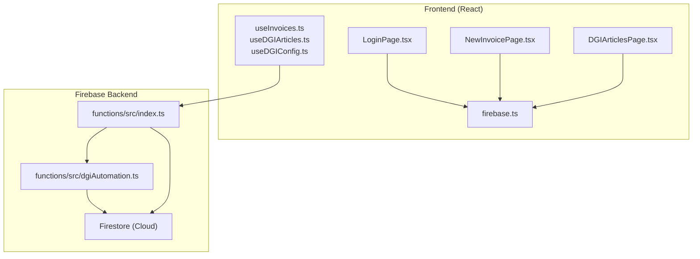
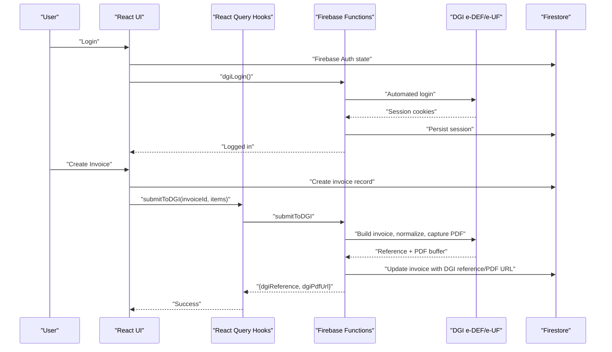
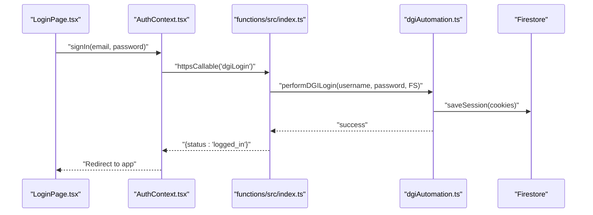
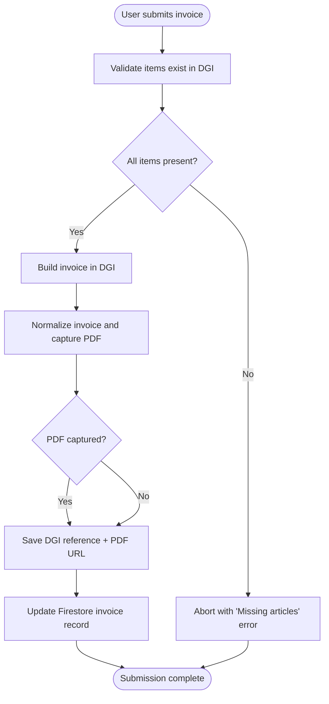
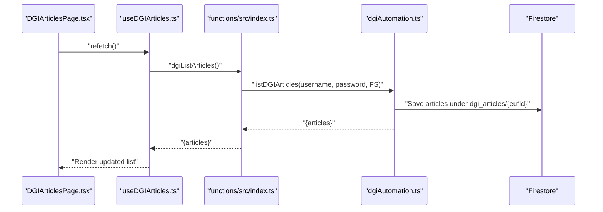
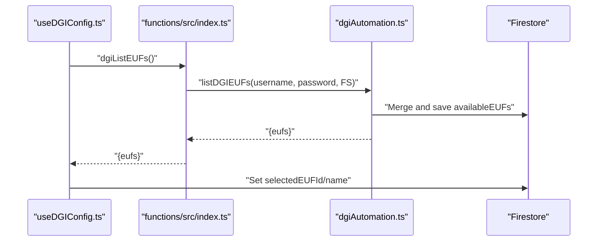
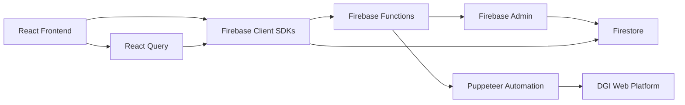

# Project Overview

<cite>
**Referenced Files in This Document**
- [README.md](file://README.md)
- [package.json](file://package.json)
- [firebase.json](file://firebase.json)
- [src/lib/firebase.ts](file://src/lib/firebase.ts)
- [src/contexts/AuthContext.tsx](file://src/contexts/AuthContext.tsx)
- [src/pages/LoginPage.tsx](file://src/pages/LoginPage.tsx)
- [src/pages/NewInvoicePage.tsx](file://src/pages/NewInvoicePage.tsx)
- [src/pages/DGIArticlesPage.tsx](file://src/pages/DGIArticlesPage.tsx)
- [src/hooks/useInvoices.ts](file://src/hooks/useInvoices.ts)
- [src/hooks/useDGIArticles.ts](file://src/hooks/useDGIArticles.ts)
- [src/hooks/useDGIConfig.ts](file://src/hooks/useDGIConfig.ts)
- [src/lib/invoiceService.ts](file://src/lib/invoiceService.ts)
- [src/types/invoice.ts](file://src/types/invoice.ts)
- [functions/src/index.ts](file://functions/src/index.ts)
- [functions/src/dgiAutomation.ts](file://functions/src/dgiAutomation.ts)
</cite>

## Table of Contents
1. [Introduction](#introduction)
2. [Project Structure](#project-structure)
3. [Core Components](#core-components)
4. [Architecture Overview](#architecture-overview)
5. [Detailed Component Analysis](#detailed-component-analysis)
6. [Dependency Analysis](#dependency-analysis)
7. [Performance Considerations](#performance-considerations)
8. [Troubleshooting Guide](#troubleshooting-guide)
9. [Conclusion](#conclusion)

## Introduction
ETSMEDF is an automated e-DEF platform integration tailored for the Democratic Republic of Congo’s tax authority (DGI). It streamlines invoice management by connecting a modern React frontend with Firebase backend services and Puppeteer-based browser automation to interact with the DGI e-DEF and e-UF systems. The platform enables businesses to manage products, create invoices, and submit them to DGI with minimal manual effort while complying with Congolese tax reporting requirements.

Key goals:
- Automate DGI e-DEF submissions from a secure, authenticated web application
- Provide a user-friendly interface for invoice generation and product catalog maintenance
- Enforce regulatory compliance by ensuring required articles exist and capturing standardized references and PDFs
- Offer a scalable, serverless backend leveraging Firebase Functions and Firestore

## Project Structure
The project follows a clear separation of concerns:
- Frontend (React + TypeScript + Vite): UI, routing, state management, and Firebase integration
- Backend (Firebase Functions + Firestore): Cloud functions orchestrating DGI automation and data persistence
- Automation engine: Puppeteer-driven browser automation for DGI e-DEF/e-UF interactions

**Diagram sources**
- [src/pages/LoginPage.tsx:1-140](file://src/pages/LoginPage.tsx#L1-L140)
- [src/pages/NewInvoicePage.tsx:1-45](file://src/pages/NewInvoicePage.tsx#L1-L45)
- [src/pages/DGIArticlesPage.tsx:1-445](file://src/pages/DGIArticlesPage.tsx#L1-L445)
- [src/hooks/useInvoices.ts:1-90](file://src/hooks/useInvoices.ts#L1-L90)
- [src/hooks/useDGIArticles.ts:1-107](file://src/hooks/useDGIArticles.ts#L1-L107)
- [src/hooks/useDGIConfig.ts:1-84](file://src/hooks/useDGIConfig.ts#L1-L84)
- [src/lib/firebase.ts:1-23](file://src/lib/firebase.ts#L1-L23)
- [functions/src/index.ts:1-243](file://functions/src/index.ts#L1-L243)
- [functions/src/dgiAutomation.ts:1-1278](file://functions/src/dgiAutomation.ts#L1-L1278)

**Section sources**
- [README.md:1-74](file://README.md#L1-L74)
- [package.json:1-56](file://package.json#L1-L56)
- [firebase.json:1-11](file://firebase.json#L1-L11)

## Core Components
- Authentication and session lifecycle with Firebase Auth and DGI session management
- Invoice lifecycle: creation, preview, and submission to DGI with automatic PDF capture
- Product catalog management synchronized with DGI e-DEF articles
- Point de Vente (e-UF) selection and synchronization with DGI
- Regulatory compliance: TVA grouping (Groupe B), article existence checks, and standardized reference capture

**Section sources**
- [src/contexts/AuthContext.tsx:1-62](file://src/contexts/AuthContext.tsx#L1-L62)
- [src/pages/LoginPage.tsx:1-140](file://src/pages/LoginPage.tsx#L1-L140)
- [src/pages/NewInvoicePage.tsx:1-45](file://src/pages/NewInvoicePage.tsx#L1-L45)
- [src/pages/DGIArticlesPage.tsx:1-445](file://src/pages/DGIArticlesPage.tsx#L1-L445)
- [src/hooks/useInvoices.ts:1-90](file://src/hooks/useInvoices.ts#L1-L90)
- [src/hooks/useDGIArticles.ts:1-107](file://src/hooks/useDGIArticles.ts#L1-L107)
- [src/hooks/useDGIConfig.ts:1-84](file://src/hooks/useDGIConfig.ts#L1-L84)
- [src/lib/invoiceService.ts:1-58](file://src/lib/invoiceService.ts#L1-L58)
- [src/types/invoice.ts:1-39](file://src/types/invoice.ts#L1-L39)
- [functions/src/index.ts:1-243](file://functions/src/index.ts#L1-L243)
- [functions/src/dgiAutomation.ts:1-1278](file://functions/src/dgiAutomation.ts#L1-L1278)

## Architecture Overview
The system integrates three pillars:
- Frontend: React SPA with Firebase client SDKs for authentication, Firestore queries, and callable functions
- Backend: Firebase Functions exposing HTTPS endpoints for DGI login/logout, e-UF discovery, article CRUD, and invoice submission
- Automation: Puppeteer running in a controlled Chromium environment to automate DGI web interactions, persist sessions, and capture PDFs

**Diagram sources**
- [src/contexts/AuthContext.tsx:20-24](file://src/contexts/AuthContext.tsx#L20-L24)
- [src/hooks/useInvoices.ts:60-89](file://src/hooks/useInvoices.ts#L60-L89)
- [functions/src/index.ts:180-242](file://functions/src/index.ts#L180-L242)
- [functions/src/dgiAutomation.ts:1229-1269](file://functions/src/dgiAutomation.ts#L1229-L1269)

## Detailed Component Analysis

### Authentication and DGI Session Lifecycle
- Firebase Auth manages user identity; on login, the app triggers a background DGI login via Firebase Functions
- Sessions are persisted in Firestore and reused to avoid repeated logins
- On logout, the app logs out from both Firebase and DGI

**Diagram sources**
- [src/pages/LoginPage.tsx:32-40](file://src/pages/LoginPage.tsx#L32-L40)
- [src/contexts/AuthContext.tsx:38-47](file://src/contexts/AuthContext.tsx#L38-L47)
- [functions/src/index.ts:42-56](file://functions/src/index.ts#L42-L56)
- [functions/src/dgiAutomation.ts:347-364](file://functions/src/dgiAutomation.ts#L347-L364)

**Section sources**
- [src/contexts/AuthContext.tsx:1-62](file://src/contexts/AuthContext.tsx#L1-L62)
- [src/pages/LoginPage.tsx:1-140](file://src/pages/LoginPage.tsx#L1-L140)
- [functions/src/index.ts:19-38](file://functions/src/index.ts#L19-L38)
- [functions/src/dgiAutomation.ts:45-62](file://functions/src/dgiAutomation.ts#L45-L62)

### Invoice Management Workflow
- Users create invoices in the UI; the system stores them in Firestore
- Submission to DGI validates article presence, builds the invoice, normalizes it, captures the PDF, and persists the DGI reference
- The invoice record is updated with submission metadata and optional PDF URL

**Diagram sources**
- [src/hooks/useInvoices.ts:60-89](file://src/hooks/useInvoices.ts#L60-L89)
- [functions/src/index.ts:180-242](file://functions/src/index.ts#L180-L242)
- [functions/src/dgiAutomation.ts:855-882](file://functions/src/dgiAutomation.ts#L855-L882)
- [functions/src/dgiAutomation.ts:1229-1269](file://functions/src/dgiAutomation.ts#L1229-L1269)

**Section sources**
- [src/pages/NewInvoicePage.tsx:1-45](file://src/pages/NewInvoicePage.tsx#L1-L45)
- [src/hooks/useInvoices.ts:1-90](file://src/hooks/useInvoices.ts#L1-L90)
- [src/lib/invoiceService.ts:1-58](file://src/lib/invoiceService.ts#L1-L58)
- [src/types/invoice.ts:1-39](file://src/types/invoice.ts#L1-L39)
- [functions/src/index.ts:180-242](file://functions/src/index.ts#L180-L242)
- [functions/src/dgiAutomation.ts:855-882](file://functions/src/dgiAutomation.ts#L855-L882)

### DGI Article Catalog Management
- Articles are synchronized from DGI to Firestore per selected e-UF
- Supports listing, adding, updating, and deleting articles via Puppeteer automation
- Live updates are reflected in the UI using Firestore snapshots

**Diagram sources**
- [src/pages/DGIArticlesPage.tsx:20-57](file://src/pages/DGIArticlesPage.tsx#L20-L57)
- [src/hooks/useDGIArticles.ts:50-62](file://src/hooks/useDGIArticles.ts#L50-L62)
- [functions/src/index.ts:93-107](file://functions/src/index.ts#L93-L107)
- [functions/src/dgiAutomation.ts:1028-1056](file://functions/src/dgiAutomation.ts#L1028-L1056)

**Section sources**
- [src/pages/DGIArticlesPage.tsx:1-445](file://src/pages/DGIArticlesPage.tsx#L1-L445)
- [src/hooks/useDGIArticles.ts:1-107](file://src/hooks/useDGIArticles.ts#L1-L107)
- [functions/src/index.ts:93-176](file://functions/src/index.ts#L93-L176)
- [functions/src/dgiAutomation.ts:1028-1092](file://functions/src/dgiAutomation.ts#L1028-L1092)

### Point de Vente (e-UF) Selection and Synchronization
- The application lists available e-UFs from DGI and allows selecting one
- Selected e-UF is persisted in Firestore and used to scope article catalogs and invoice submissions

**Diagram sources**
- [src/hooks/useDGIConfig.ts:72-83](file://src/hooks/useDGIConfig.ts#L72-L83)
- [functions/src/index.ts:75-89](file://functions/src/index.ts#L75-L89)
- [functions/src/dgiAutomation.ts:536-594](file://functions/src/dgiAutomation.ts#L536-L594)

**Section sources**
- [src/hooks/useDGIConfig.ts:1-84](file://src/hooks/useDGIConfig.ts#L1-L84)
- [functions/src/index.ts:75-89](file://functions/src/index.ts#L75-L89)
- [functions/src/dgiAutomation.ts:536-594](file://functions/src/dgiAutomation.ts#L536-L594)

## Dependency Analysis
High-level dependencies:
- Frontend depends on Firebase client SDKs and React Query for state management
- Backend depends on Firebase Admin and Puppeteer for automation
- Firestore serves as shared state for user sessions, e-UFs, articles, and invoices

**Diagram sources**
- [package.json:12-31](file://package.json#L12-L31)
- [functions/src/index.ts:1-16](file://functions/src/index.ts#L1-L16)
- [functions/src/dgiAutomation.ts:1-5](file://functions/src/dgiAutomation.ts#L1-L5)
- [src/lib/firebase.ts:1-23](file://src/lib/firebase.ts#L1-L23)

**Section sources**
- [package.json:1-56](file://package.json#L1-L56)
- [firebase.json:1-11](file://firebase.json#L1-L11)
- [src/lib/firebase.ts:1-23](file://src/lib/firebase.ts#L1-L23)
- [functions/src/index.ts:1-16](file://functions/src/index.ts#L1-L16)
- [functions/src/dgiAutomation.ts:1-5](file://functions/src/dgiAutomation.ts#L1-L5)

## Performance Considerations
- Headless browser automation introduces latency; timeouts and retries are configured in the automation module
- Firestore writes for invoices and articles are optimized with targeted collections and snapshots
- PDF capture is asynchronous and non-blocking; failures are logged but do not prevent invoice updates
- Network idle waits and explicit sleeps balance reliability against responsiveness

[No sources needed since this section provides general guidance]

## Troubleshooting Guide
Common issues and resolutions:
- DGI login failures: Verify credentials and network accessibility; check logs for “login form not found” or “invalid credentials”
- Missing articles during submission: Ensure all items exist in DGI before submitting; use the article management page to synchronize
- Session expiration: The system attempts to reuse saved sessions; if invalid, a fresh login is triggered
- PDF capture failures: Non-fatal; the invoice can still be marked as submitted; retry submission if needed

Operational tips:
- Use the refresh action in the article management page to reload DGI listings
- Confirm the selected e-UF is correct before submitting invoices
- Monitor function logs for Puppeteer navigation and click failures

**Section sources**
- [functions/src/dgiAutomation.ts:229-314](file://functions/src/dgiAutomation.ts#L229-L314)
- [functions/src/dgiAutomation.ts:855-882](file://functions/src/dgiAutomation.ts#L855-L882)
- [src/pages/DGIArticlesPage.tsx:50-57](file://src/pages/DGIArticlesPage.tsx#L50-L57)

## Conclusion
ETSMEDF delivers a robust, serverless solution for automating DGI e-DEF and e-UF interactions in the Democratic Republic of Congo. By combining a modern React frontend with Firebase backend and Puppeteer automation, it simplifies invoice management, enforces regulatory compliance, and reduces manual overhead for businesses. The modular architecture supports extensibility and maintainability while ensuring secure, auditable operations.