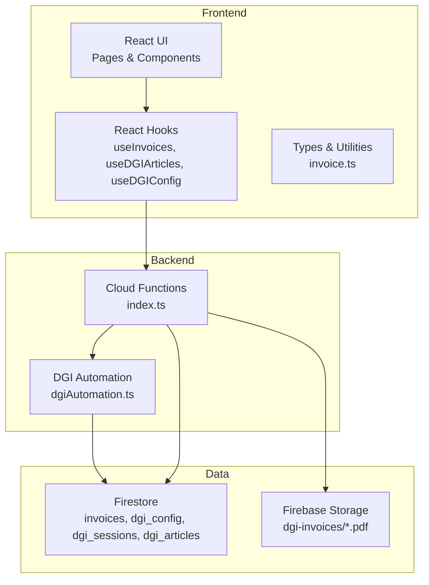
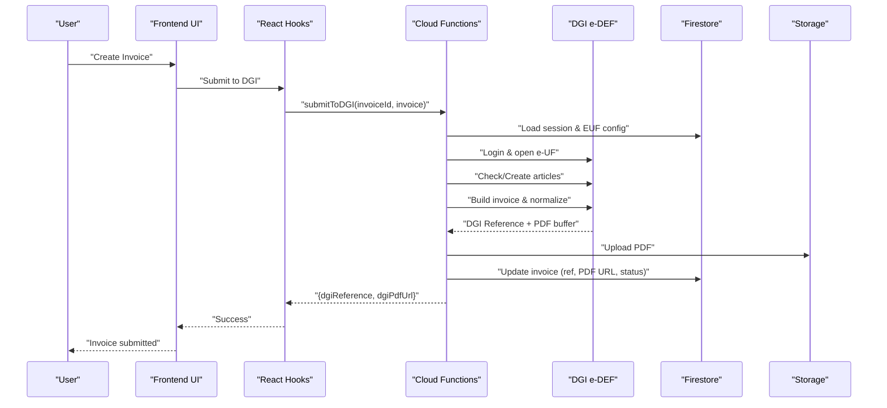
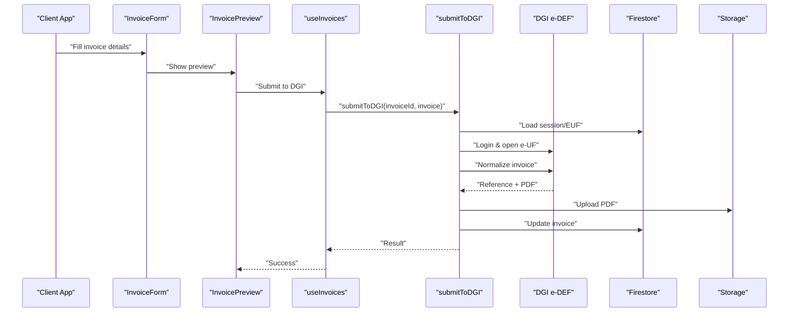
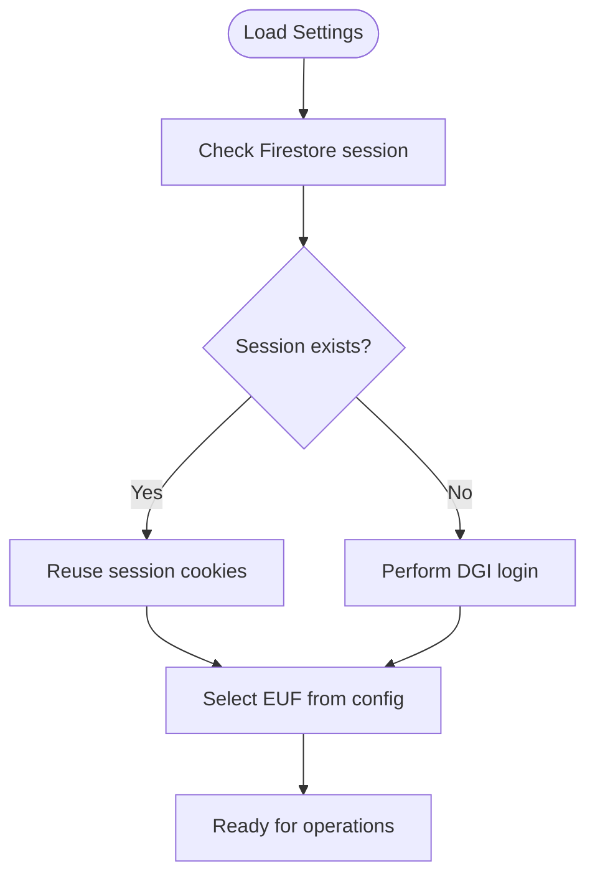
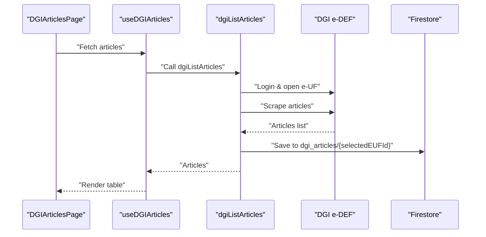
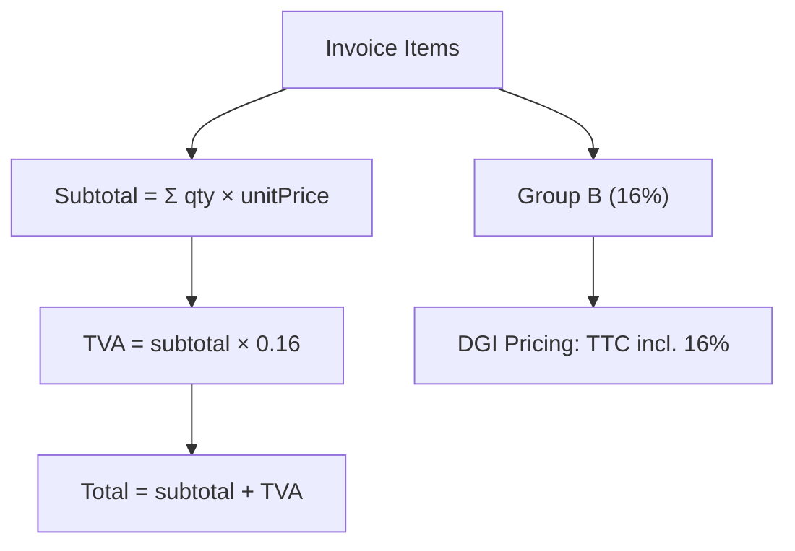

# System Purpose and Benefits

<cite>
**Referenced Files in This Document**
- [README.md](file://README.md)
- [package.json](file://package.json)
- [functions/src/index.ts](file://functions/src/index.ts)
- [functions/src/dgiAutomation.ts](file://functions/src/dgiAutomation.ts)
- [src/hooks/useDGIStatus.ts](file://src/hooks/useDGIStatus.ts)
- [src/hooks/useDGIConfig.ts](file://src/hooks/useDGIConfig.ts)
- [src/hooks/useDGIArticles.ts](file://src/hooks/useDGIArticles.ts)
- [src/hooks/useInvoices.ts](file://src/hooks/useInvoices.ts)
- [src/types/invoice.ts](file://src/types/invoice.ts)
- [src/pages/DGIArticlesPage.tsx](file://src/pages/DGIArticlesPage.tsx)
- [src/pages/NewInvoicePage.tsx](file://src/pages/NewInvoicePage.tsx)
- [src/components/InvoiceForm.tsx](file://src/components/InvoiceForm.tsx)
- [CLAUDE.md](file://CLAUDE.md)
</cite>

## Table of Contents
1. [Introduction](#introduction)
2. [Project Structure](#project-structure)
3. [Core Components](#core-components)
4. [Architecture Overview](#architecture-overview)
5. [Detailed Component Analysis](#detailed-component-analysis)
6. [Dependency Analysis](#dependency-analysis)
7. [Performance Considerations](#performance-considerations)
8. [Troubleshooting Guide](#troubleshooting-guide)
9. [Conclusion](#conclusion)

## Introduction
ETSMEDF is a DRC-focused electronic tax filing solution designed to automate invoice management and streamline submissions to the Direction Générale des Impôts (DGI) via the e-DEF platform. Its primary objective is to eliminate manual tax filing tasks by integrating a web automation layer with the DGI e-DEF portal, enabling businesses, accountants, and tax professionals to generate, manage, and submit invoices electronically while maintaining compliance with Congolese tax authority requirements.

Key benefits include:
- Reduced manual workload: Automated invoice creation, article synchronization, and submission processes minimize repetitive tasks.
- Compliance assurance: Built-in tax calculations (16% VAT for Group B), article validation, and standardized submission flows align with DGI regulations.
- Real-time status tracking: Live session monitoring and invoice submission updates provide visibility into DGI connection and filing outcomes.
- Streamlined tax reporting: Centralized invoice lifecycle management from generation to DGI submission and archival.

Target users:
- Businesses operating under DGI’s e-DEF system
- Accountants and tax professionals managing multiple clients
- Administrators overseeing point-of-sale configurations and article catalogs

Practical examples of time savings and efficiency improvements:
- Bulk article synchronization from DGI to local storage reduces manual catalog maintenance and speeds up invoice preparation.
- One-click submission to DGI eliminates multi-step manual workflows, reducing human error and processing time.
- Automated VAT computation and totals ensure accurate reporting without recalculations.
- PDF capture and cloud storage integration enables instant retrieval of official receipts.

Regulatory compliance aspects:
- Uses DGI Group B taxation (16% VAT) consistently across frontend and backend.
- Validates required articles before invoice normalization to prevent submission failures.
- Maintains audit-ready records with DGI reference codes and PDF attachments.

## Project Structure
The system follows a modern full-stack architecture:
- Frontend (React + TypeScript): Manages user interactions, invoice forms, article catalogs, and DGI session status.
- Backend (Cloud Functions): Orchestrates secure DGI logins, article management, and invoice submissions using browser automation.
- Data Layer (Firestore): Stores invoices, DGI sessions, article catalogs, and configuration for e-UF selection.



**Diagram sources**
- [functions/src/index.ts:1-243](file://functions/src/index.ts#L1-L243)
- [functions/src/dgiAutomation.ts:1-1287](file://functions/src/dgiAutomation.ts#L1-L1287)
- [src/hooks/useInvoices.ts:1-90](file://src/hooks/useInvoices.ts#L1-L90)
- [src/hooks/useDGIArticles.ts:1-107](file://src/hooks/useDGIArticles.ts#L1-L107)
- [src/hooks/useDGIConfig.ts:1-84](file://src/hooks/useDGIConfig.ts#L1-L84)
- [src/types/invoice.ts:1-39](file://src/types/invoice.ts#L1-L39)

**Section sources**
- [README.md:1-74](file://README.md#L1-L74)
- [package.json:1-56](file://package.json#L1-L56)

## Core Components
- Invoice lifecycle management: Creation, validation, and status updates for invoices stored in Firestore.
- DGI session management: Persistent login sessions, EUF selection, and status monitoring.
- Article catalog synchronization: Fetch, add, update, and delete articles on DGI, with local caching.
- Submission pipeline: Automated invoice normalization and PDF capture for DGI filing.

**Section sources**
- [src/hooks/useInvoices.ts:1-90](file://src/hooks/useInvoices.ts#L1-L90)
- [src/hooks/useDGIStatus.ts:1-34](file://src/hooks/useDGIStatus.ts#L1-L34)
- [src/hooks/useDGIConfig.ts:1-84](file://src/hooks/useDGIConfig.ts#L1-L84)
- [src/hooks/useDGIArticles.ts:1-107](file://src/hooks/useDGIArticles.ts#L1-L107)
- [src/types/invoice.ts:1-39](file://src/types/invoice.ts#L1-L39)

## Architecture Overview
The system integrates frontend UI with Cloud Functions that drive browser automation against the DGI e-DEF platform. It leverages Firestore for state persistence and Firebase Storage for PDF archival.



**Diagram sources**
- [functions/src/index.ts:180-242](file://functions/src/index.ts#L180-L242)
- [functions/src/dgiAutomation.ts:1261-1287](file://functions/src/dgiAutomation.ts#L1261-L1287)
- [src/hooks/useInvoices.ts:60-89](file://src/hooks/useInvoices.ts#L60-L89)

## Detailed Component Analysis

### Invoice Management Workflow
End-to-end flow from invoice creation to DGI submission and PDF archival.



**Diagram sources**
- [src/pages/NewInvoicePage.tsx:1-45](file://src/pages/NewInvoicePage.tsx#L1-L45)
- [src/components/InvoiceForm.tsx:1-343](file://src/components/InvoiceForm.tsx#L1-L343)
- [src/hooks/useInvoices.ts:60-89](file://src/hooks/useInvoices.ts#L60-L89)
- [functions/src/index.ts:180-242](file://functions/src/index.ts#L180-L242)
- [functions/src/dgiAutomation.ts:1261-1287](file://functions/src/dgiAutomation.ts#L1261-L1287)

**Section sources**
- [src/pages/NewInvoicePage.tsx:1-45](file://src/pages/NewInvoicePage.tsx#L1-L45)
- [src/components/InvoiceForm.tsx:1-343](file://src/components/InvoiceForm.tsx#L1-L343)
- [src/hooks/useInvoices.ts:1-90](file://src/hooks/useInvoices.ts#L1-L90)

### DGI Session and EUF Management
Real-time session status and EUF selection enable seamless navigation to the correct e-DEF environment.



**Diagram sources**
- [src/hooks/useDGIStatus.ts:1-34](file://src/hooks/useDGIStatus.ts#L1-L34)
- [src/hooks/useDGIConfig.ts:1-84](file://src/hooks/useDGIConfig.ts#L1-L84)
- [functions/src/dgiAutomation.ts:42-62](file://functions/src/dgiAutomation.ts#L42-L62)

**Section sources**
- [src/hooks/useDGIStatus.ts:1-34](file://src/hooks/useDGIStatus.ts#L1-L34)
- [src/hooks/useDGIConfig.ts:1-84](file://src/hooks/useDGIConfig.ts#L1-L84)

### Article Catalog Synchronization
Synchronizes DGI articles locally for fast invoice building and ensures required items exist before normalization.



**Diagram sources**
- [src/pages/DGIArticlesPage.tsx:1-445](file://src/pages/DGIArticlesPage.tsx#L1-L445)
- [src/hooks/useDGIArticles.ts:50-63](file://src/hooks/useDGIArticles.ts#L50-L63)
- [functions/src/index.ts:93-107](file://functions/src/index.ts#L93-L107)
- [functions/src/dgiAutomation.ts:764-791](file://functions/src/dgiAutomation.ts#L764-L791)

**Section sources**
- [src/pages/DGIArticlesPage.tsx:1-445](file://src/pages/DGIArticlesPage.tsx#L1-L445)
- [src/hooks/useDGIArticles.ts:1-107](file://src/hooks/useDGIArticles.ts#L1-L107)
- [functions/src/index.ts:93-107](file://functions/src/index.ts#L93-L107)

### Tax Calculation and Compliance
Consistent tax handling ensures compliance with DGI Group B VAT rates and accurate invoice totals.



**Diagram sources**
- [src/types/invoice.ts:28-39](file://src/types/invoice.ts#L28-L39)
- [CLAUDE.md:191-207](file://CLAUDE.md#L191-L207)

**Section sources**
- [src/types/invoice.ts:1-39](file://src/types/invoice.ts#L1-L39)
- [CLAUDE.md:191-207](file://CLAUDE.md#L191-L207)

## Dependency Analysis
The system relies on a cohesive set of libraries and services:
- Frontend: React, React Hook Form, TanStack Query, TailwindCSS, Sonner for notifications, Firebase SDK for auth/data/storage.
- Backend: Puppeteer-core with Chromium runtime, Firebase Admin SDK, and Firebase Functions v2.
- Data: Firestore collections for invoices, session, configuration, and article catalogs; Storage for PDFs.

```mermaid
graph LR
FE["Frontend (React)"] --> RHQ["@tanstack/react-query"]
FE --> RHF["react-hook-form"]
FE --> FB["firebase"]
FE --> UI["ui components"]
BE["Cloud Functions"] --> PAC["puppeteer-core"]
BE --> CHROMIUM["@sparticuz/chromium"]
BE --> ADMIN["firebase-admin"]
BE --> FUNCS["firebase-functions"]
FE < --> FS["Firestore"]
BE < --> FS
BE < --> STORE["Storage"]
```

**Diagram sources**
- [package.json:12-32](file://package.json#L12-L32)
- [functions/src/index.ts:1-27](file://functions/src/index.ts#L1-L27)

**Section sources**
- [package.json:1-56](file://package.json#L1-L56)
- [functions/src/index.ts:1-27](file://functions/src/index.ts#L1-L27)

## Performance Considerations
- Browser automation timeouts and retries are configured to balance reliability and speed; adjust as needed for network conditions.
- PDF capture is asynchronous and bounded to avoid long waits; ensure Storage permissions are configured.
- Firestore queries leverage onSnapshot for real-time updates, minimizing redundant fetches.
- Article synchronization is cached per e-UF to reduce repeated DGI calls.

## Troubleshooting Guide
Common issues and resolutions:
- DGI login failures: Verify credentials in Secret Manager and ensure the DGI website is reachable. Check session persistence and re-authenticate if needed.
- Missing articles during submission: Confirm articles exist in DGI or add them before normalization; the system validates items before submission.
- PDF capture failures: Inspect response interception and ensure the “Download PDF” action triggers a PDF response.
- Session not restored: Clear saved session cookies and re-run login; ensure Firestore session document exists.

Operational checks:
- Use the DGI status hook to monitor session connectivity and last saved timestamp.
- Validate EUF selection and refresh the list if necessary.
- Review Cloud Function logs for detailed error messages and stack traces.

**Section sources**
- [src/hooks/useDGIStatus.ts:1-34](file://src/hooks/useDGIStatus.ts#L1-L34)
- [src/hooks/useDGIConfig.ts:72-84](file://src/hooks/useDGIConfig.ts#L72-L84)
- [functions/src/index.ts:31-38](file://functions/src/index.ts#L31-L38)
- [functions/src/dgiAutomation.ts:1233-1257](file://functions/src/dgiAutomation.ts#L1233-L1257)

## Conclusion
ETSMEDF delivers a robust, compliant, and efficient solution for DGI e-DEF invoice management in the Democratic Republic of Congo. By automating login, article validation, invoice normalization, and PDF capture, it significantly reduces manual effort, improves accuracy, and accelerates tax reporting cycles. The system’s modular architecture, real-time status monitoring, and adherence to DGI Group B tax standards make it suitable for businesses, accountants, and tax professionals seeking reliable electronic filing capabilities aligned with Congolese tax authority processes.