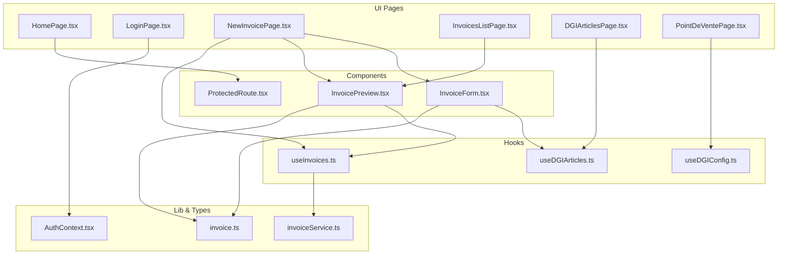
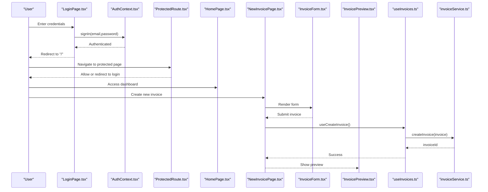
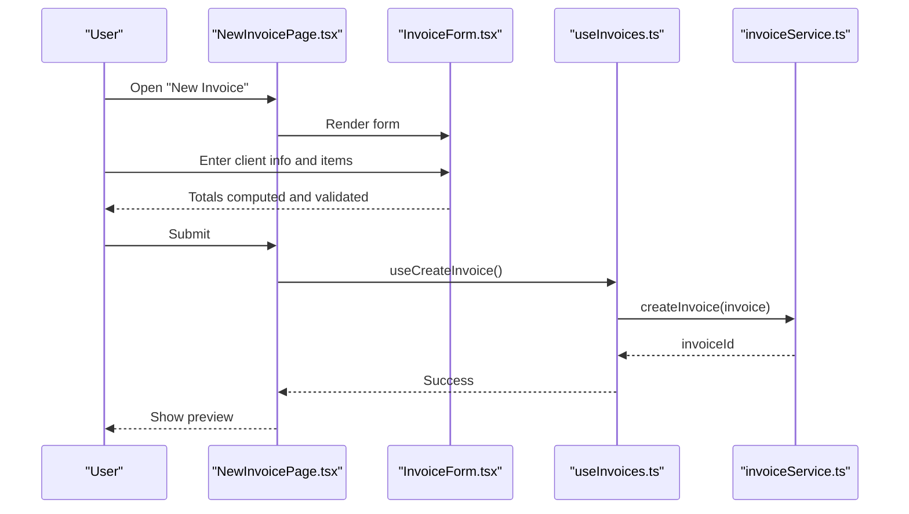
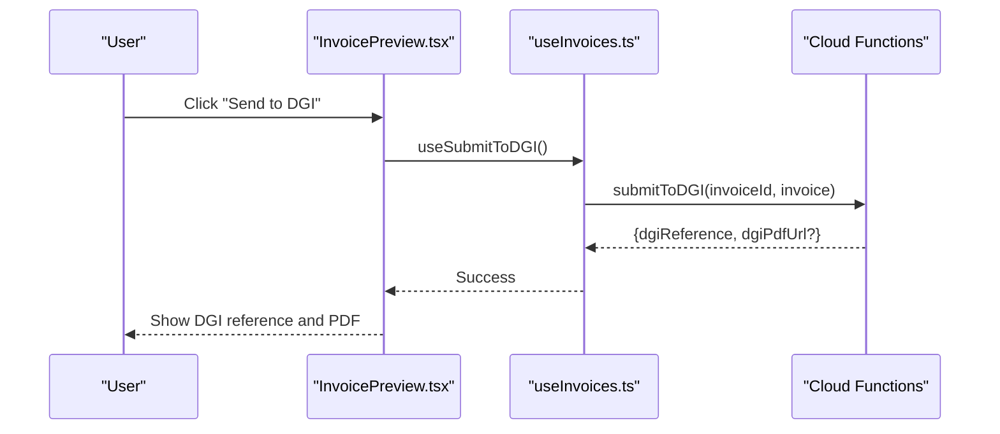
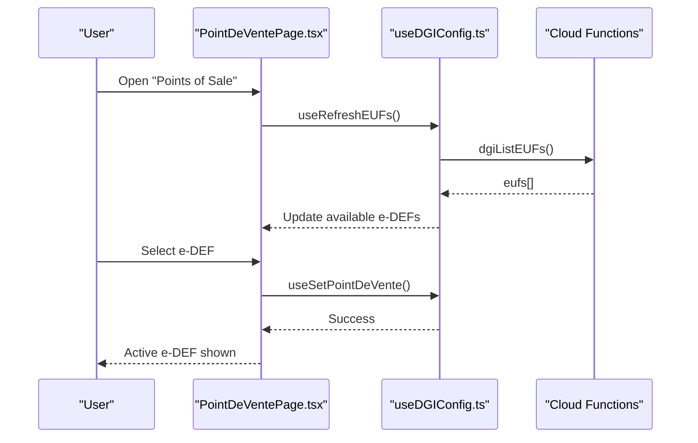
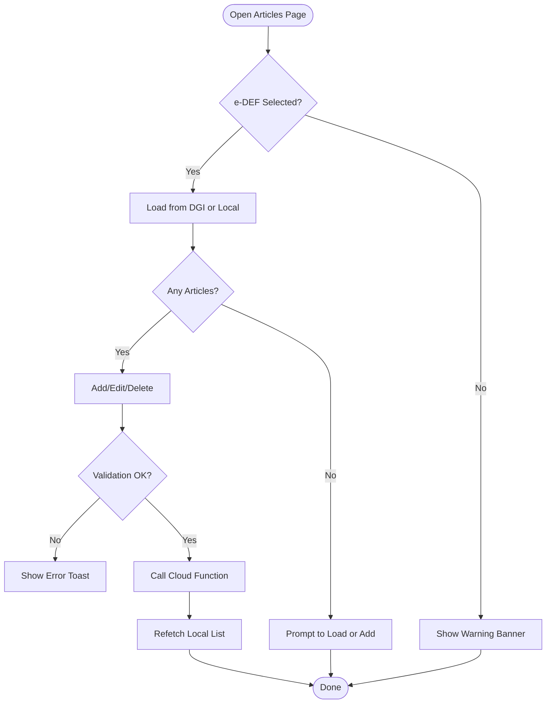
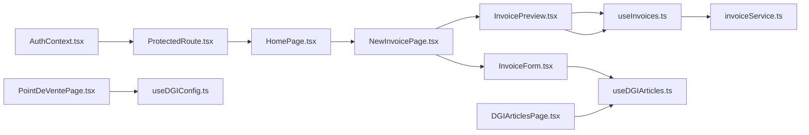

# Target Users and Use Cases

<cite>
**Referenced Files in This Document**
- [AuthContext.tsx](file://src/contexts/AuthContext.tsx)
- [ProtectedRoute.tsx](file://src/components/ProtectedRoute.tsx)
- [LoginPage.tsx](file://src/pages/LoginPage.tsx)
- [HomePage.tsx](file://src/pages/HomePage.tsx)
- [NewInvoicePage.tsx](file://src/pages/NewInvoicePage.tsx)
- [InvoiceForm.tsx](file://src/components/InvoiceForm.tsx)
- [InvoicePreview.tsx](file://src/components/InvoicePreview.tsx)
- [InvoicesListPage.tsx](file://src/pages/InvoicesListPage.tsx)
- [DGIArticlesPage.tsx](file://src/pages/DGIArticlesPage.tsx)
- [PointDeVentePage.tsx](file://src/pages/PointDeVentePage.tsx)
- [useInvoices.ts](file://src/hooks/useInvoices.ts)
- [useDGIArticles.ts](file://src/hooks/useDGIArticles.ts)
- [useDGIConfig.ts](file://src/hooks/useDGIConfig.ts)
- [invoiceService.ts](file://src/lib/invoiceService.ts)
- [invoice.ts](file://src/types/invoice.ts)
</cite>

## Table of Contents
1. [Introduction](#introduction)
2. [Project Structure](#project-structure)
3. [Core Components](#core-components)
4. [Architecture Overview](#architecture-overview)
5. [Detailed Component Analysis](#detailed-component-analysis)
6. [Dependency Analysis](#dependency-analysis)
7. [Performance Considerations](#performance-considerations)
8. [Troubleshooting Guide](#troubleshooting-guide)
9. [Conclusion](#conclusion)
10. [Appendices](#appendices)

## Introduction
This document describes the target users and use cases for ETSMEDF, focusing on how different personas interact with the system. It covers user roles, permissions, responsibilities, and typical workflows for invoice creation, DGI submission, point-of-sale management, and system administration. It also outlines onboarding and training considerations and how the user interface adapts to varying skill levels.

## Project Structure
The application is a React SPA with Firebase for authentication and data persistence, and Cloud Functions for integrations with the DGI platform. Key areas relevant to user personas:
- Authentication and routing protection
- Invoice lifecycle (creation, preview, status updates, DGI submission)
- DGI article catalog management
- Point-of-sale (e-DEF) selection and configuration
- Data types and calculations for invoices

**Diagram sources**
- [HomePage.tsx:1-91](file://src/pages/HomePage.tsx#L1-L91)
- [LoginPage.tsx:1-140](file://src/pages/LoginPage.tsx#L1-L140)
- [NewInvoicePage.tsx:1-45](file://src/pages/NewInvoicePage.tsx#L1-L45)
- [InvoiceForm.tsx:1-343](file://src/components/InvoiceForm.tsx#L1-L343)
- [InvoicePreview.tsx:1-347](file://src/components/InvoicePreview.tsx#L1-L347)
- [InvoicesListPage.tsx:1-174](file://src/pages/InvoicesListPage.tsx#L1-L174)
- [DGIArticlesPage.tsx:1-445](file://src/pages/DGIArticlesPage.tsx#L1-L445)
- [PointDeVentePage.tsx:1-281](file://src/pages/PointDeVentePage.tsx#L1-L281)
- [useInvoices.ts:1-90](file://src/hooks/useInvoices.ts#L1-L90)
- [useDGIArticles.ts:1-107](file://src/hooks/useDGIArticles.ts#L1-L107)
- [useDGIConfig.ts:1-84](file://src/hooks/useDGIConfig.ts#L1-L84)
- [AuthContext.tsx:1-62](file://src/contexts/AuthContext.tsx#L1-L62)
- [invoiceService.ts:1-58](file://src/lib/invoiceService.ts#L1-L58)
- [invoice.ts:1-39](file://src/types/invoice.ts#L1-L39)

**Section sources**
- [HomePage.tsx:1-91](file://src/pages/HomePage.tsx#L1-L91)
- [LoginPage.tsx:1-140](file://src/pages/LoginPage.tsx#L1-L140)
- [AuthContext.tsx:1-62](file://src/contexts/AuthContext.tsx#L1-L62)
- [ProtectedRoute.tsx:1-24](file://src/components/ProtectedRoute.tsx#L1-L24)

## Core Components
- Authentication and session lifecycle: handles sign-in/sign-out and integrates with DGI login/logout.
- Protected routes: ensures only authenticated users can access protected pages.
- Invoice creation and preview: form validation, totals computation, and DGI submission.
- DGI article catalog: CRUD operations against DGI via Cloud Functions, synchronized locally.
- Point-of-sale configuration: selection and management of e-DEF (DGI point of sale).
- Data persistence: invoices stored in Firestore with typed models and helpers.

**Section sources**
- [AuthContext.tsx:1-62](file://src/contexts/AuthContext.tsx#L1-L62)
- [ProtectedRoute.tsx:1-24](file://src/components/ProtectedRoute.tsx#L1-L24)
- [NewInvoicePage.tsx:1-45](file://src/pages/NewInvoicePage.tsx#L1-L45)
- [InvoiceForm.tsx:1-343](file://src/components/InvoiceForm.tsx#L1-L343)
- [InvoicePreview.tsx:1-347](file://src/components/InvoicePreview.tsx#L1-L347)
- [DGIArticlesPage.tsx:1-445](file://src/pages/DGIArticlesPage.tsx#L1-L445)
- [PointDeVentePage.tsx:1-281](file://src/pages/PointDeVentePage.tsx#L1-L281)
- [useInvoices.ts:1-90](file://src/hooks/useInvoices.ts#L1-L90)
- [useDGIArticles.ts:1-107](file://src/hooks/useDGIArticles.ts#L1-L107)
- [useDGIConfig.ts:1-84](file://src/hooks/useDGIConfig.ts#L1-L84)
- [invoiceService.ts:1-58](file://src/lib/invoiceService.ts#L1-L58)
- [invoice.ts:1-39](file://src/types/invoice.ts#L1-L39)

## Architecture Overview
The system separates concerns across UI, hooks, services, and Firebase/Firestore. Authentication is centralized; protected routes gate access. Invoice operations use typed models and helpers for totals and statuses. DGI integrations are executed via Cloud Functions and mirrored locally in Firestore for offline-friendly UX.

**Diagram sources**
- [LoginPage.tsx:1-140](file://src/pages/LoginPage.tsx#L1-L140)
- [AuthContext.tsx:1-62](file://src/contexts/AuthContext.tsx#L1-L62)
- [ProtectedRoute.tsx:1-24](file://src/components/ProtectedRoute.tsx#L1-L24)
- [HomePage.tsx:1-91](file://src/pages/HomePage.tsx#L1-L91)
- [NewInvoicePage.tsx:1-45](file://src/pages/NewInvoicePage.tsx#L1-L45)
- [InvoiceForm.tsx:1-343](file://src/components/InvoiceForm.tsx#L1-L343)
- [InvoicePreview.tsx:1-347](file://src/components/InvoicePreview.tsx#L1-L347)
- [useInvoices.ts:1-90](file://src/hooks/useInvoices.ts#L1-L90)
- [invoiceService.ts:1-58](file://src/lib/invoiceService.ts#L1-L58)

## Detailed Component Analysis

### User Personas and Roles
- Business Owner
  - Permissions: Full access to invoicing, viewing reports, managing products, and configuring points of sale.
  - Responsibilities: Oversee daily operations, approve submissions, monitor cash flow, and maintain compliance.
  - Typical workflows: Create invoices, review submitted DGI references, manage product catalog, and configure e-DEF.
- Accountant
  - Permissions: View and manage invoices, track statuses, export reports, and assist with DGI submissions.
  - Responsibilities: Ensure accuracy of financial records, reconcile payments, and prepare tax documents.
  - Typical workflows: Review invoice previews, update statuses, and coordinate DGI submissions.
- Tax Professional
  - Permissions: Limited to viewing and validating submitted invoices, ensuring regulatory compliance.
  - Responsibilities: Verify correct tax groups and rates, validate e-DEF usage, and advise on filing procedures.
  - Typical workflows: Validate DGI submissions, cross-check totals and tax amounts, and provide guidance.
- Administrator
  - Permissions: Manage DGI configurations, maintain article catalogs, and oversee system access.
  - Responsibilities: Configure e-DEFs, add/update/delete DGI articles, and ensure system stability.
  - Typical workflows: Load DGI articles, add/remove/edit entries, and manage point-of-sale settings.

Note: The current codebase does not implement explicit role-based access control (RBAC). All authenticated users share the same capabilities exposed by the UI. Administrators can perform DGI catalog and e-DEF management tasks; others primarily use invoicing features.

**Section sources**
- [AuthContext.tsx:1-62](file://src/contexts/AuthContext.tsx#L1-L62)
- [ProtectedRoute.tsx:1-24](file://src/components/ProtectedRoute.tsx#L1-L24)
- [DGIArticlesPage.tsx:1-445](file://src/pages/DGIArticlesPage.tsx#L1-L445)
- [PointDeVentePage.tsx:1-281](file://src/pages/PointDeVentePage.tsx#L1-L281)
- [useDGIArticles.ts:1-107](file://src/hooks/useDGIArticles.ts#L1-L107)
- [useDGIConfig.ts:1-84](file://src/hooks/useDGIConfig.ts#L1-L84)

### Use Case Scenarios

#### Invoice Creation
- Steps:
  - Navigate to the invoice creation page.
  - Fill client details, dates, and items.
  - Use DGI article autocomplete for quick itemization.
  - Review totals and save as draft.
  - Print or download PDF for distribution.
- UI adaptations:
  - Clear field labels and inline validation messages.
  - Autocomplete for DGI items reduces typing errors.
  - Real-time totals computation aids verification.

**Diagram sources**
- [NewInvoicePage.tsx:1-45](file://src/pages/NewInvoicePage.tsx#L1-L45)
- [InvoiceForm.tsx:1-343](file://src/components/InvoiceForm.tsx#L1-L343)
- [useInvoices.ts:1-90](file://src/hooks/useInvoices.ts#L1-L90)
- [invoiceService.ts:1-58](file://src/lib/invoiceService.ts#L1-L58)

**Section sources**
- [NewInvoicePage.tsx:1-45](file://src/pages/NewInvoicePage.tsx#L1-L45)
- [InvoiceForm.tsx:1-343](file://src/components/InvoiceForm.tsx#L1-L343)
- [invoice.ts:1-39](file://src/types/invoice.ts#L1-L39)

#### DGI Submission
- Steps:
  - Generate an invoice and save it.
  - From the preview, choose “Send to DGI.”
  - System invokes Cloud Function to submit invoice metadata to DGI.
  - Capture and display DGI reference; optionally open PDF.
- UI adaptations:
  - Conditional actions based on submission state.
  - Clear feedback messages and loading indicators.
  - Option to switch between app invoice and DGI PDF.

**Diagram sources**
- [InvoicePreview.tsx:1-347](file://src/components/InvoicePreview.tsx#L1-L347)
- [useInvoices.ts:60-90](file://src/hooks/useInvoices.ts#L60-L90)

**Section sources**
- [InvoicePreview.tsx:1-347](file://src/components/InvoicePreview.tsx#L1-L347)
- [useInvoices.ts:60-90](file://src/hooks/useInvoices.ts#L60-L90)

#### Point-of-Sale Management
- Steps:
  - Load e-DEFs from DGI or add manually.
  - Select an active e-DEF to enable invoicing and article synchronization.
  - Manage visibility and selection state across sessions.
- UI adaptations:
  - Loading states and empty states guide users during discovery.
  - Clear active selection indicators and warnings when none is selected.

**Diagram sources**
- [PointDeVentePage.tsx:1-281](file://src/pages/PointDeVentePage.tsx#L1-L281)
- [useDGIConfig.ts:1-84](file://src/hooks/useDGIConfig.ts#L1-L84)

**Section sources**
- [PointDeVentePage.tsx:1-281](file://src/pages/PointDeVentePage.tsx#L1-L281)
- [useDGIConfig.ts:1-84](file://src/hooks/useDGIConfig.ts#L1-L84)

#### System Administration (DGI Article Catalog)
- Steps:
  - Load articles from DGI into Firestore for the selected e-DEF.
  - Add, edit, or delete articles with validation and feedback.
  - Use bulk refresh or manual entry when needed.
- UI adaptations:
  - Busy states per row and global loading states.
  - Confirmation prompts for destructive actions.
  - Inline validation and error messaging.

**Diagram sources**
- [DGIArticlesPage.tsx:1-445](file://src/pages/DGIArticlesPage.tsx#L1-L445)
- [useDGIArticles.ts:1-107](file://src/hooks/useDGIArticles.ts#L1-L107)
- [useDGIConfig.ts:1-84](file://src/hooks/useDGIConfig.ts#L1-L84)

**Section sources**
- [DGIArticlesPage.tsx:1-445](file://src/pages/DGIArticlesPage.tsx#L1-L445)
- [useDGIArticles.ts:1-107](file://src/hooks/useDGIArticles.ts#L1-L107)
- [useDGIConfig.ts:1-84](file://src/hooks/useDGIConfig.ts#L1-L84)

### User Interface Adaptations by Skill Level
- Beginners:
  - Clear labels, inline validation, and autocomplete reduce cognitive load.
  - One-click actions (print, PDF) and guided workflows minimize steps.
- Intermediate:
  - Real-time totals and status updates support quick verification.
  - Tabbed views (app invoice vs. DGI PDF) streamline review.
- Advanced:
  - Bulk operations (refresh articles), manual e-DEF entry, and precise controls for edits/deletes.

[No sources needed since this section synthesizes UI observations without quoting specific code]

### Onboarding and Training Requirements
- Initial Setup:
  - Authenticate with provided credentials.
  - Configure at least one e-DEF to enable invoicing and article sync.
- Training Modules:
  - Invoice creation walkthrough with DGI autocomplete.
  - DGI submission process and interpreting returned reference.
  - Managing the article catalog and point-of-sale settings.
- Support Materials:
  - Quick reference for statuses and actions.
  - Troubleshooting tips for common issues (e.g., missing e-DEF, submission failures).

[No sources needed since this section provides general guidance]

## Dependency Analysis
The following diagram highlights key dependencies among components involved in user workflows.

**Diagram sources**
- [AuthContext.tsx:1-62](file://src/contexts/AuthContext.tsx#L1-L62)
- [ProtectedRoute.tsx:1-24](file://src/components/ProtectedRoute.tsx#L1-L24)
- [HomePage.tsx:1-91](file://src/pages/HomePage.tsx#L1-L91)
- [NewInvoicePage.tsx:1-45](file://src/pages/NewInvoicePage.tsx#L1-L45)
- [InvoiceForm.tsx:1-343](file://src/components/InvoiceForm.tsx#L1-L343)
- [InvoicePreview.tsx:1-347](file://src/components/InvoicePreview.tsx#L1-L347)
- [useInvoices.ts:1-90](file://src/hooks/useInvoices.ts#L1-L90)
- [invoiceService.ts:1-58](file://src/lib/invoiceService.ts#L1-L58)
- [useDGIArticles.ts:1-107](file://src/hooks/useDGIArticles.ts#L1-L107)
- [useDGIConfig.ts:1-84](file://src/hooks/useDGIConfig.ts#L1-L84)
- [DGIArticlesPage.tsx:1-445](file://src/pages/DGIArticlesPage.tsx#L1-L445)
- [PointDeVentePage.tsx:1-281](file://src/pages/PointDeVentePage.tsx#L1-L281)

**Section sources**
- [useInvoices.ts:1-90](file://src/hooks/useInvoices.ts#L1-L90)
- [useDGIArticles.ts:1-107](file://src/hooks/useDGIArticles.ts#L1-L107)
- [useDGIConfig.ts:1-84](file://src/hooks/useDGIConfig.ts#L1-L84)

## Performance Considerations
- Offline-friendly reads: Firestore listeners for DGI articles and e-DEF configuration improve responsiveness.
- Debounced or batched operations: Use of query invalidation after mutations avoids redundant network calls.
- Loading states: Spinner and disabled states prevent duplicate submissions and improve perceived performance.
- Client-side computations: Totals calculated in the browser reduce server load.

[No sources needed since this section provides general guidance]

## Troubleshooting Guide
- Authentication Issues:
  - Incorrect credentials or rate limits trigger user-friendly messages.
  - Sign-in attempts are fire-and-forget for DGI login to avoid blocking UX.
- DGI Submission Failures:
  - Error messages surfaced via toast notifications with actionable hints.
  - Reference capture may require manual retrieval if PDF is unavailable.
- Missing e-DEF:
  - Clear warnings prompt users to select or add an e-DEF before proceeding.
- Article Catalog Problems:
  - Validation errors for invalid prices or missing names.
  - Busy states per row prevent concurrent conflicting edits.

**Section sources**
- [LoginPage.tsx:121-140](file://src/pages/LoginPage.tsx#L121-L140)
- [AuthContext.tsx:20-48](file://src/contexts/AuthContext.tsx#L20-L48)
- [InvoicePreview.tsx:59-77](file://src/components/InvoicePreview.tsx#L59-L77)
- [PointDeVentePage.tsx:162-170](file://src/pages/PointDeVentePage.tsx#L162-L170)
- [DGIArticlesPage.tsx:59-79](file://src/pages/DGIArticlesPage.tsx#L59-L79)
- [DGIArticlesPage.tsx:92-115](file://src/pages/DGIArticlesPage.tsx#L92-L115)

## Conclusion
ETSMEDF provides a streamlined, user-focused workflow for invoice management integrated with DGI. While the current implementation does not enforce RBAC, the UI exposes the necessary capabilities for business owners, accountants, tax professionals, and administrators to fulfill their roles. Clear onboarding, robust error handling, and UI adaptations support users across skill levels.

[No sources needed since this section summarizes without analyzing specific files]

## Appendices

### Common Tasks and Workflows by Role
- Business Owner
  - Create invoices quickly using DGI autocomplete.
  - Monitor statuses and review DGI submissions.
  - Manage e-DEFs and maintain article catalog.
- Accountant
  - Validate invoice totals and tax amounts.
  - Update statuses and coordinate with clients.
  - Export or print invoices for record keeping.
- Tax Professional
  - Confirm correct tax grouping and rates.
  - Verify e-DEF alignment and submission references.
  - Advise on filing procedures and compliance.
- Administrator
  - Load DGI articles and manage local cache.
  - Add or remove e-DEFs and resolve sync issues.
  - Maintain system access and configurations.

[No sources needed since this section provides general guidance]