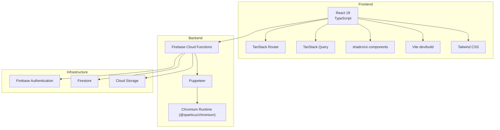
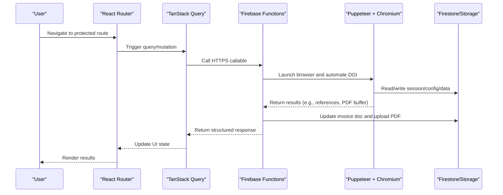
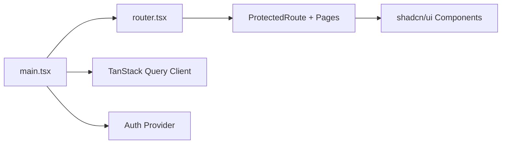
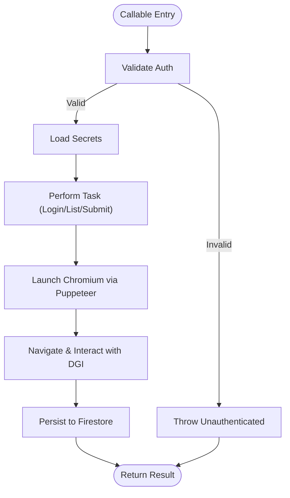
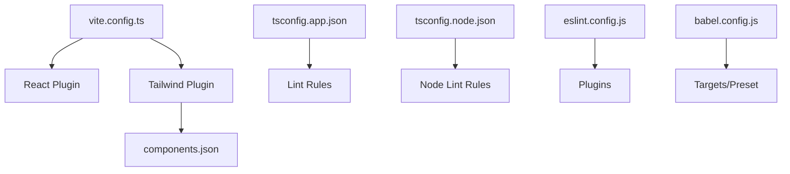
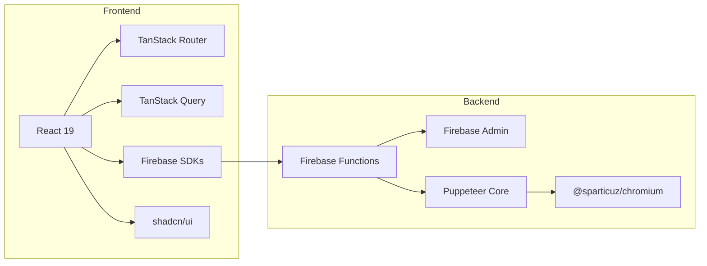

# Technology Stack Overview

<cite>
**Referenced Files in This Document**
- [package.json](file://package.json)
- [vite.config.ts](file://vite.config.ts)
- [tsconfig.json](file://tsconfig.json)
- [tsconfig.app.json](file://tsconfig.app.json)
- [tsconfig.node.json](file://tsconfig.node.json)
- [eslint.config.js](file://eslint.config.js)
- [babel.config.js](file://babel.config.js)
- [components.json](file://components.json)
- [firebase.json](file://firebase.json)
- [src/main.tsx](file://src/main.tsx)
- [src/router.tsx](file://src/router.tsx)
- [src/lib/firebase.ts](file://src/lib/firebase.ts)
- [functions/package.json](file://functions/package.json)
- [functions/src/index.ts](file://functions/src/index.ts)
- [functions/src/dgiAutomation.ts](file://functions/src/dgiAutomation.ts)
</cite>

## Table of Contents
1. [Introduction](#introduction)
2. [Project Structure](#project-structure)
3. [Core Components](#core-components)
4. [Architecture Overview](#architecture-overview)
5. [Detailed Component Analysis](#detailed-component-analysis)
6. [Dependency Analysis](#dependency-analysis)
7. [Performance Considerations](#performance-considerations)
8. [Troubleshooting Guide](#troubleshooting-guide)
9. [Conclusion](#conclusion)

## Introduction
This document presents the ETSMEDF technology stack and architecture. It covers the modern full-stack solution built with a React 19 frontend, TypeScript, TanStack Router, TanStack Query, and shadcn/ui components, paired with Firebase Cloud Functions, Puppeteer, and Chromium runtime for browser automation. Development tooling includes Vite, ESLint, and Babel. The document explains versioning, licensing considerations, technology selection rationale, integration patterns between frontend and backend, deployment architecture, and strategic comparisons with alternatives.

## Project Structure
The repository follows a dual-package structure:
- Frontend application under the repository root with Vite, TypeScript, and React 19.
- Backend Cloud Functions under the functions/ directory, compiled with TypeScript and deployed via Firebase.

Key configuration files establish toolchains and build processes:
- Root package.json defines frontend dependencies and scripts.
- functions/package.json defines backend dependencies and Node.js runtime.
- Vite config integrates React and Tailwind.
- TypeScript configurations split app and node environments.
- Firebase configuration ties functions deployment and predeploy steps.

**Diagram sources**
- [package.json:12-32](file://package.json#L12-L32)
- [functions/package.json:17-22](file://functions/package.json#L17-L22)
- [vite.config.ts:1-14](file://vite.config.ts#L1-L14)
- [firebase.json:1-11](file://firebase.json#L1-L11)

**Section sources**
- [package.json:1-56](file://package.json#L1-L56)
- [functions/package.json:1-34](file://functions/package.json#L1-L34)
- [vite.config.ts:1-14](file://vite.config.ts#L1-L14)
- [tsconfig.json:1-13](file://tsconfig.json#L1-L13)
- [tsconfig.app.json:1-29](file://tsconfig.app.json#L1-L29)
- [tsconfig.node.json:1-25](file://tsconfig.node.json#L1-L25)
- [firebase.json:1-11](file://firebase.json#L1-L11)

## Core Components
- Frontend framework and routing:
  - React 19 with JSX runtime and strict mode.
  - TanStack Router for declarative routing with devtools support.
  - TanStack Query for server state caching, background updates, and optimistic UI.
- UI system:
  - shadcn/ui with TSX support, configured via components.json, Tailwind CSS v4, and Lucide icons.
- Build and tooling:
  - Vite for fast dev server and optimized builds.
  - TypeScript for type safety across frontend and backend.
  - ESLint with TypeScript and React-specific plugins.
  - Babel for transpilation presets.
- Backend automation:
  - Firebase Cloud Functions for serverless APIs.
  - Puppeteer with @sparticuz/chromium for headless browser automation.
- Infrastructure:
  - Firebase Authentication, Firestore, and Cloud Storage integrated via SDKs.

Version highlights:
- React 19, TanStack Router 1.x, TanStack Query 5.x, shadcn/ui TSX, Tailwind CSS 4.x.
- Firebase Admin SDK and Firebase Functions v2.
- Puppeteer Core 24.x and Chromium runtime 133.x.

Licensing considerations:
- Dependencies are distributed under permissive open-source licenses compatible with commercial use.
- Firebase services are governed by Google Cloud terms; ensure compliance with regional regulations and data handling policies.

Technology selection rationale:
- React 19 and TanStack Router deliver modern, efficient routing with minimal boilerplate.
- TanStack Query simplifies data fetching, caching, and synchronization.
- shadcn/ui provides composable, accessible UI primitives with consistent theming.
- Vite offers fast builds and HMR for developer productivity.
- Firebase Cloud Functions enable scalable, secure serverless APIs with tight auth integration.
- Puppeteer + Chromium enables robust browser automation for DGI interactions.

**Section sources**
- [package.json:12-32](file://package.json#L12-L32)
- [package.json:33-54](file://package.json#L33-L54)
- [functions/package.json:17-22](file://functions/package.json#L17-L22)
- [functions/package.json:23-32](file://functions/package.json#L23-L32)
- [components.json:1-24](file://components.json#L1-L24)
- [vite.config.ts:1-14](file://vite.config.ts#L1-L14)
- [tsconfig.app.json:1-29](file://tsconfig.app.json#L1-L29)
- [tsconfig.node.json:1-25](file://tsconfig.node.json#L1-L25)
- [eslint.config.js:1-23](file://eslint.config.js#L1-L23)
- [babel.config.js:1-8](file://babel.config.js#L1-L8)

## Architecture Overview
The frontend initializes the router, query client, and authentication provider, then renders protected routes. User actions trigger TanStack Query mutations and queries, which call Firebase Cloud Functions via HTTPS callable triggers. Functions orchestrate Puppeteer-driven browser sessions against the DGI portal, persisting state to Firestore and optionally uploading PDFs to Cloud Storage.

**Diagram sources**
- [src/main.tsx:1-22](file://src/main.tsx#L1-L22)
- [src/router.tsx:1-92](file://src/router.tsx#L1-L92)
- [functions/src/index.ts:180-242](file://functions/src/index.ts#L180-L242)
- [functions/src/dgiAutomation.ts:79-94](file://functions/src/dgiAutomation.ts#L79-L94)

**Section sources**
- [src/main.tsx:1-22](file://src/main.tsx#L1-L22)
- [src/router.tsx:1-92](file://src/router.tsx#L1-L92)
- [src/lib/firebase.ts:1-23](file://src/lib/firebase.ts#L1-L23)
- [functions/src/index.ts:1-243](file://functions/src/index.ts#L1-L243)
- [functions/src/dgiAutomation.ts:1-800](file://functions/src/dgiAutomation.ts#L1-L800)

## Detailed Component Analysis

### Frontend: React 19, TanStack Router, TanStack Query, shadcn/ui
- Application bootstrap wires the router provider, query client provider, theme provider, and toast notifications.
- Router defines nested protected routes and devtools in development.
- shadcn/ui components integrate with Tailwind CSS and are configured via components.json.

**Diagram sources**
- [src/main.tsx:1-22](file://src/main.tsx#L1-L22)
- [src/router.tsx:1-92](file://src/router.tsx#L1-L92)
- [components.json:1-24](file://components.json#L1-L24)

**Section sources**
- [src/main.tsx:1-22](file://src/main.tsx#L1-L22)
- [src/router.tsx:1-92](file://src/router.tsx#L1-L92)
- [components.json:1-24](file://components.json#L1-L24)

### Backend: Firebase Cloud Functions, Puppeteer, Chromium
- Functions expose HTTPS callable endpoints for DGI login/logout, e-UF listing, article CRUD, and invoice submission.
- Credentials are managed via Firebase secrets; timeouts and memory are tuned per workload.
- Automation uses Puppeteer with a hardened Chromium runtime to emulate a real browser, scrape lists, and perform form interactions.

**Diagram sources**
- [functions/src/index.ts:42-71](file://functions/src/index.ts#L42-L71)
- [functions/src/index.ts:93-176](file://functions/src/index.ts#L93-L176)
- [functions/src/index.ts:180-242](file://functions/src/index.ts#L180-L242)
- [functions/src/dgiAutomation.ts:79-94](file://functions/src/dgiAutomation.ts#L79-L94)

**Section sources**
- [functions/src/index.ts:1-243](file://functions/src/index.ts#L1-L243)
- [functions/src/dgiAutomation.ts:1-800](file://functions/src/dgiAutomation.ts#L1-L800)

### Build Tooling and Configuration
- Vite config enables React plugin and Tailwind integration with path aliases.
- TypeScript configurations separate bundler-mode app and node configs with strict linting.
- ESLint and Babel presets ensure consistent linting and transpilation across environments.

**Diagram sources**
- [vite.config.ts:1-14](file://vite.config.ts#L1-L14)
- [components.json:1-24](file://components.json#L1-L24)
- [tsconfig.app.json:1-29](file://tsconfig.app.json#L1-L29)
- [tsconfig.node.json:1-25](file://tsconfig.node.json#L1-L25)
- [eslint.config.js:1-23](file://eslint.config.js#L1-L23)
- [babel.config.js:1-8](file://babel.config.js#L1-L8)

**Section sources**
- [vite.config.ts:1-14](file://vite.config.ts#L1-L14)
- [tsconfig.json:1-13](file://tsconfig.json#L1-L13)
- [tsconfig.app.json:1-29](file://tsconfig.app.json#L1-L29)
- [tsconfig.node.json:1-25](file://tsconfig.node.json#L1-L25)
- [eslint.config.js:1-23](file://eslint.config.js#L1-L23)
- [babel.config.js:1-8](file://babel.config.js#L1-L8)

## Dependency Analysis
- Frontend depends on React 19, TanStack Router, TanStack Query, Firebase SDKs, and shadcn/ui components.
- Backend depends on Firebase Admin and Functions SDKs, Puppeteer Core, and Chromium runtime.
- Both sides share TypeScript and linting tooling for consistency.

**Diagram sources**
- [package.json:12-32](file://package.json#L12-L32)
- [functions/package.json:17-22](file://functions/package.json#L17-L22)

**Section sources**
- [package.json:12-32](file://package.json#L12-L32)
- [functions/package.json:17-22](file://functions/package.json#L17-L22)

## Performance Considerations
- Frontend:
  - TanStack Query’s background refetch and cache invalidation reduce redundant network calls.
  - Vite’s bundler mode and tree-shaking minimize bundle size.
  - Tailwind CSS v4 improves build performance and reduces CSS payload.
- Backend:
  - Function memory and timeout settings are tuned per workload (e.g., article management vs. invoice submission).
  - Chromium runtime is launched on-demand and closed after tasks to conserve resources.
  - PDF uploads are optional and non-blocking to avoid slowing down critical paths.

[No sources needed since this section provides general guidance]

## Troubleshooting Guide
- Authentication failures:
  - Ensure Firebase environment variables are set and accessible to the frontend.
  - Verify callable functions require authentication and return appropriate errors.
- Puppeteer/Chromium issues:
  - Confirm executable path resolution and Chromium args are valid.
  - Monitor network idle waits and page readiness checks.
- Firestore/Storage errors:
  - Validate document paths and permissions.
  - Check PDF upload metadata and public ACLs.

**Section sources**
- [src/lib/firebase.ts:6-14](file://src/lib/firebase.ts#L6-L14)
- [functions/src/index.ts:42-71](file://functions/src/index.ts#L42-L71)
- [functions/src/dgiAutomation.ts:79-94](file://functions/src/dgiAutomation.ts#L79-L94)

## Conclusion
ETSMEDF leverages a cohesive modern stack: React 19 with TanStack Router and Query for a responsive UI, shadcn/ui for accessible components, and Vite for rapid development. On the backend, Firebase Cloud Functions provide secure, scalable APIs, powered by Puppeteer and Chromium to automate DGI interactions. TypeScript, ESLint, and Babel ensure code quality and portability across environments. The architecture balances developer productivity, maintainability, and operational reliability while integrating tightly with Firebase infrastructure.