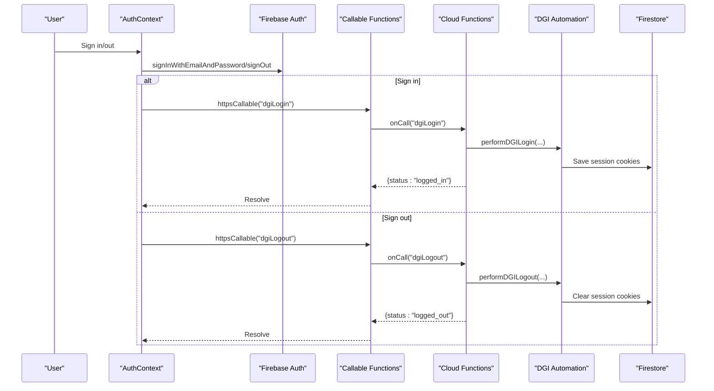
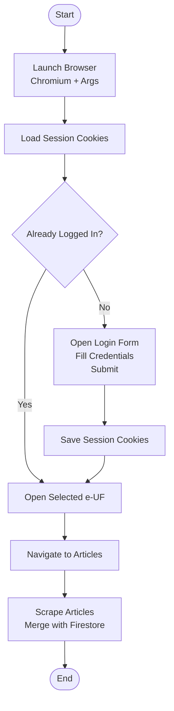
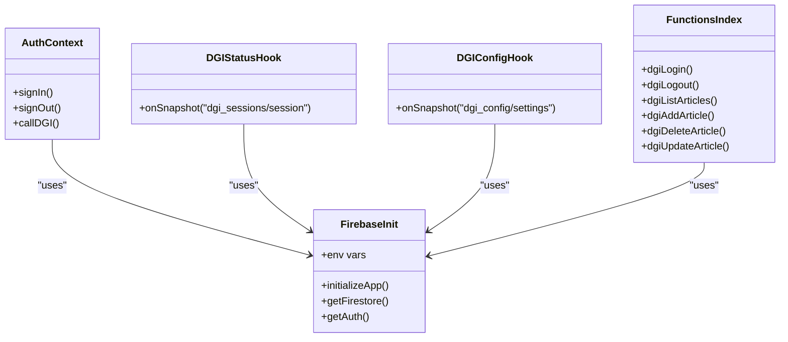
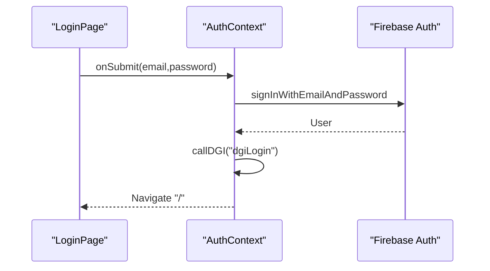
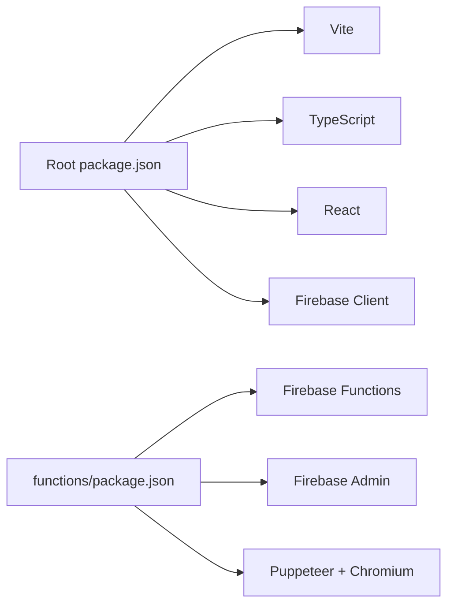

# Troubleshooting and FAQ

<cite>
**Referenced Files in This Document**
- [firebase.ts](file://src/lib/firebase.ts)
- [index.ts](file://functions/src/index.ts)
- [dgiAutomation.ts](file://functions/src/dgiAutomation.ts)
- [AuthContext.tsx](file://src/contexts/AuthContext.tsx)
- [useDGIArticles.ts](file://src/hooks/useDGIArticles.ts)
- [useDGIStatus.ts](file://src/hooks/useDGIStatus.ts)
- [useDGIConfig.ts](file://src/hooks/useDGIConfig.ts)
- [LoginPage.tsx](file://src/pages/LoginPage.tsx)
- [vite.config.ts](file://vite.config.ts)
- [package.json](file://package.json)
- [firestore.rules](file://firestore.rules)
- [tsconfig.json](file://tsconfig.json)
- [tsconfig.app.json](file://tsconfig.app.json)
- [tsconfig.node.json](file://tsconfig.node.json)
- [functions/tsconfig.json](file://functions/tsconfig.json)
</cite>

## Table of Contents
1. [Introduction](#introduction)
2. [Project Structure](#project-structure)
3. [Core Components](#core-components)
4. [Architecture Overview](#architecture-overview)
5. [Detailed Component Analysis](#detailed-component-analysis)
6. [Dependency Analysis](#dependency-analysis)
7. [Performance Considerations](#performance-considerations)
8. [Troubleshooting Guide](#troubleshooting-guide)
9. [Conclusion](#conclusion)
10. [Appendices](#appendices)

## Introduction
This document provides comprehensive troubleshooting and Frequently Asked Questions for ETSMEDF. It focuses on:
- DGI automation issues: browser timeouts, session management, and platform connectivity
- Firebase integration issues: authentication failures, real-time sync, and security rule conflicts
- Frontend debugging: TypeScript compilation, Vite build, and component rendering
- Performance and stability: bottlenecks, memory leaks, and browser compatibility
- Logging, error handling, and monitoring strategies
- Step-by-step guides for critical failures and integration breakdowns
- System limitations, supported environments, and compliance considerations

## Project Structure
ETSMEDF is a dual-environment application:
- Frontend (React + Vite) using Firebase for auth, Firestore, and callable functions
- Cloud Functions (TypeScript) using Puppeteer/Chromium to automate DGI web interactions

```mermaid
graph TB
subgraph "Frontend"
FE_App["React App<br/>Vite Build"]
FE_Firestore["Firestore (Realtime)"]
FE_Auth["Firebase Auth"]
FE_Functions["Callable Functions"]
end
subgraph "Cloud Functions"
CF_Index["Functions Entry"]
CF_DGI["DGI Automation<br/>Puppeteer + Chromium"]
CF_DB["Firestore (Admin SDK)"]
end
FE_Auth --> FE_Functions
FE_Functions --> CF_Index
CF_Index --> CF_DGI
CF_DGI --> CF_DB
FE_Firestore <- --> CF_DB
```

**Diagram sources**
- [vite.config.ts:1-14](file://vite.config.ts#L1-L14)
- [firebase.ts:1-23](file://src/lib/firebase.ts#L1-L23)
- [index.ts:1-243](file://functions/src/index.ts#L1-L243)
- [dgiAutomation.ts:1-1287](file://functions/src/dgiAutomation.ts#L1-L1287)

**Section sources**
- [vite.config.ts:1-14](file://vite.config.ts#L1-L14)
- [firebase.ts:1-23](file://src/lib/firebase.ts#L1-L23)
- [index.ts:1-243](file://functions/src/index.ts#L1-L243)
- [dgiAutomation.ts:1-1287](file://functions/src/dgiAutomation.ts#L1-L1287)

## Core Components
- Firebase initialization and environment configuration
- Auth provider and login page with error mapping
- DGI session status hook and EUF configuration
- DGI articles hooks for CRUD via callable functions
- Cloud functions orchestrating DGI automation and Firestore updates
- DGI automation engine managing browser sessions, navigation, and scraping

**Section sources**
- [firebase.ts:1-23](file://src/lib/firebase.ts#L1-L23)
- [AuthContext.tsx:1-62](file://src/contexts/AuthContext.tsx#L1-L62)
- [LoginPage.tsx:1-140](file://src/pages/LoginPage.tsx#L1-L140)
- [useDGIStatus.ts:1-34](file://src/hooks/useDGIStatus.ts#L1-L34)
- [useDGIConfig.ts:1-84](file://src/hooks/useDGIConfig.ts#L1-L84)
- [useDGIArticles.ts:1-107](file://src/hooks/useDGIArticles.ts#L1-L107)
- [index.ts:1-243](file://functions/src/index.ts#L1-L243)
- [dgiAutomation.ts:1-1287](file://functions/src/dgiAutomation.ts#L1-L1287)

## Architecture Overview
End-to-end flow for DGI login/logout and article management:



**Diagram sources**
- [AuthContext.tsx:20-48](file://src/contexts/AuthContext.tsx#L20-L48)
- [index.ts:42-71](file://functions/src/index.ts#L42-L71)
- [dgiAutomation.ts:347-391](file://functions/src/dgiAutomation.ts#L347-L391)

## Detailed Component Analysis

### DGI Automation Engine
Key behaviors:
- Launches a headless Chromium via Puppeteer with Chromium args optimized for server environments
- Implements robust login detection and fallback strategies
- Manages persistent sessions stored in Firestore
- Scrapes e-UF lists and articles with resilient DOM parsing
- Uses network idle waits and explicit delays to handle SPA rendering

Common failure points:
- Site changes breaking text-based selectors
- Network timeouts during navigation or scraping
- Session expiration and cookie restoration
- Platform accessibility and rate limiting



**Diagram sources**
- [dgiAutomation.ts:79-94](file://functions/src/dgiAutomation.ts#L79-L94)
- [dgiAutomation.ts:45-62](file://functions/src/dgiAutomation.ts#L45-L62)
- [dgiAutomation.ts:395-428](file://functions/src/dgiAutomation.ts#L395-L428)
- [dgiAutomation.ts:536-594](file://functions/src/dgiAutomation.ts#L536-L594)

**Section sources**
- [dgiAutomation.ts:79-94](file://functions/src/dgiAutomation.ts#L79-L94)
- [dgiAutomation.ts:178-314](file://functions/src/dgiAutomation.ts#L178-L314)
- [dgiAutomation.ts:395-428](file://functions/src/dgiAutomation.ts#L395-L428)
- [dgiAutomation.ts:536-594](file://functions/src/dgiAutomation.ts#L536-L594)

### Firebase Integration
- Environment variables injected via Vite and consumed by Firebase SDK
- Real-time listeners for DGI session and EUF configuration
- Callable functions exposed for login/logout and article operations
- Firestore rules enforce authenticated reads/writes



**Diagram sources**
- [firebase.ts:1-23](file://src/lib/firebase.ts#L1-L23)
- [AuthContext.tsx:26-54](file://src/contexts/AuthContext.tsx#L26-L54)
- [useDGIStatus.ts:12-30](file://src/hooks/useDGIStatus.ts#L12-L30)
- [useDGIConfig.ts:21-48](file://src/hooks/useDGIConfig.ts#L21-L48)
- [index.ts:42-176](file://functions/src/index.ts#L42-L176)

**Section sources**
- [firebase.ts:1-23](file://src/lib/firebase.ts#L1-L23)
- [AuthContext.tsx:1-62](file://src/contexts/AuthContext.tsx#L1-L62)
- [useDGIStatus.ts:1-34](file://src/hooks/useDGIStatus.ts#L1-L34)
- [useDGIConfig.ts:1-84](file://src/hooks/useDGIConfig.ts#L1-L84)
- [index.ts:1-243](file://functions/src/index.ts#L1-L243)

### Frontend Hooks and Pages
- Real-time article list bound to Firestore under the selected e-UF
- Mutation hooks trigger callable functions and invalidate queries
- Login page validates inputs and maps Firebase errors to user-friendly messages



**Diagram sources**
- [LoginPage.tsx:20-40](file://src/pages/LoginPage.tsx#L20-L40)
- [AuthContext.tsx:38-47](file://src/contexts/AuthContext.tsx#L38-L47)

**Section sources**
- [useDGIArticles.ts:16-40](file://src/hooks/useDGIArticles.ts#L16-L40)
- [useDGIArticles.ts:50-107](file://src/hooks/useDGIArticles.ts#L50-L107)
- [LoginPage.tsx:1-140](file://src/pages/LoginPage.tsx#L1-L140)

## Dependency Analysis
- Frontend depends on React, TanStack Router/Query, and Firebase client SDK
- Cloud Functions depend on Puppeteer, Chromium, and Firebase Admin SDK
- Build and lint configurations are split across root and functions directories



**Diagram sources**
- [package.json:1-56](file://package.json#L1-L56)
- [functions/tsconfig.json:1-16](file://functions/tsconfig.json#L1-L16)

**Section sources**
- [package.json:1-56](file://package.json#L1-L56)
- [tsconfig.json:1-13](file://tsconfig.json#L1-L13)
- [tsconfig.app.json](file://tsconfig.app.json)
- [tsconfig.node.json](file://tsconfig.node.json)
- [functions/tsconfig.json:1-16](file://functions/tsconfig.json#L1-L16)

## Performance Considerations
- Browser timeouts and network idle waits are tuned for reliability; adjust cautiously to avoid flakiness
- Session reuse reduces repeated logins; ensure cookie sanitation avoids invalid values
- Firestore writes for article merges should be batched where possible
- Real-time listeners are efficient but monitor for excessive churn in large datasets
- Chromium memory usage can be high; consider scaling resources for concurrent runs

[No sources needed since this section provides general guidance]

## Troubleshooting Guide

### DGI Automation: Browser Timeout Errors
Symptoms
- Navigation or click actions fail with timeouts
- Page never reaches expected state

Checklist
- Verify DGI_URL accessibility from Cloud Functions runtime
- Confirm Chromium args and viewport settings are compatible with DGI’s SPA
- Increase default timeouts incrementally and add targeted waits around network idle
- Inspect logs for “login form not found” or “SPA render timeout”

Remediation
- Adjust default timeouts and navigation timeouts in browser launch and page actions
- Add explicit waits for specific DOM texts or network idle periods
- Validate selectors used in clickText and findByText against current DGI markup

**Section sources**
- [dgiAutomation.ts:79-94](file://functions/src/dgiAutomation.ts#L79-L94)
- [dgiAutomation.ts:114-170](file://functions/src/dgiAutomation.ts#L114-L170)
- [dgiAutomation.ts:652-671](file://functions/src/dgiAutomation.ts#L652-L671)

### DGI Automation: Session Management Issues
Symptoms
- Repeated logins despite saved session
- Session cleared unexpectedly

Checklist
- Confirm Firestore session document exists and contains cookies
- Ensure cookie sanitization removes undefined values
- Verify timezone and ISO date strings are handled consistently
- Check for concurrent access modifying the session document

Remediation
- Validate session restore logic and re-login fallback
- Add retry logic for transient Firestore errors
- Ensure logout clears session atomically

**Section sources**
- [dgiAutomation.ts:45-62](file://functions/src/dgiAutomation.ts#L45-L62)
- [dgiAutomation.ts:395-428](file://functions/src/dgiAutomation.ts#L395-L428)
- [dgiAutomation.ts:366-391](file://functions/src/dgiAutomation.ts#L366-L391)

### DGI Automation: Platform Connectivity Problems
Symptoms
- Login fails with “formulaire de connexion introuvable”
- Site not reachable or redirects unexpectedly

Checklist
- Validate DGI_URL and regional availability
- Confirm certificate and SSL handling flags are appropriate
- Review logs for “post-login state” previews and error text

Remediation
- Update selectors and navigation strategies to match DGI UI changes
- Add fallback navigation to known login URLs
- Monitor for rate limits or CAPTCHA challenges

**Section sources**
- [dgiAutomation.ts:6-11](file://functions/src/dgiAutomation.ts#L6-L11)
- [dgiAutomation.ts:229-314](file://functions/src/dgiAutomation.ts#L229-L314)

### Firebase Authentication Failures
Symptoms
- Login page shows generic error despite valid credentials
- Too many requests or invalid credentials

Checklist
- Map Firebase error codes to user-friendly messages
- Confirm environment variables are set and loaded by Vite
- Verify Firebase Auth is initialized before use

Remediation
- Use the provided error mapping in the login page
- Ensure .env files are present and variables are prefixed for Vite
- Confirm service account keys for Admin SDK in Cloud Functions

**Section sources**
- [LoginPage.tsx:121-140](file://src/pages/LoginPage.tsx#L121-L140)
- [firebase.ts:6-14](file://src/lib/firebase.ts#L6-L14)
- [AuthContext.tsx:38-47](file://src/contexts/AuthContext.tsx#L38-L47)

### Real-Time Sync Problems
Symptoms
- DGI status or EUF list does not update
- Empty or stale data in UI

Checklist
- Confirm Firestore rules allow authenticated reads
- Verify onSnapshot subscriptions are active and not throwing
- Check for network errors or permission denials

Remediation
- Ensure Firestore rules permit read/write for authenticated users
- Add error callbacks to onSnapshot to reset loading states
- Validate document paths for session and config docs

**Section sources**
- [firestore.rules:1-9](file://firestore.rules#L1-L9)
- [useDGIStatus.ts:15-29](file://src/hooks/useDGIStatus.ts#L15-L29)
- [useDGIConfig.ts:29-48](file://src/hooks/useDGIConfig.ts#L29-L48)

### Security Rule Conflicts
Symptoms
- Writes to dgi_sessions or dgi_config blocked
- Unauthorized access errors

Checklist
- Review Firestore rules enforcing auth
- Confirm callable functions run with proper auth context

Remediation
- Align Firestore rules with intended access patterns
- Use separate collections for sensitive data if needed

**Section sources**
- [firestore.rules:4-6](file://firestore.rules#L4-L6)
- [index.ts:75-89](file://functions/src/index.ts#L75-L89)

### TypeScript Compilation Errors
Symptoms
- Build fails locally or in CI
- Type errors in hooks or components

Checklist
- Run root build script to compile both app and functions
- Ensure tsconfig references are correct
- Check for path aliases and module resolution

Remediation
- Fix type mismatches reported by tsc
- Align compiler options between app and functions configs
- Verify path aliases in tsconfig.json

**Section sources**
- [package.json:8](file://package.json#L8)
- [tsconfig.json:1-13](file://tsconfig.json#L1-L13)
- [tsconfig.app.json](file://tsconfig.app.json)
- [tsconfig.node.json](file://tsconfig.node.json)
- [functions/tsconfig.json:1-16](file://functions/tsconfig.json#L1-L16)

### Vite Build Issues
Symptoms
- Alias resolution errors
- Plugin configuration conflicts

Checklist
- Confirm Vite plugin order and Tailwind integration
- Validate alias path for @ pointing to src

Remediation
- Keep plugin order as React first, then Tailwind
- Ensure alias resolves correctly in IDE and terminal

**Section sources**
- [vite.config.ts:1-14](file://vite.config.ts#L1-L14)
- [package.json:1-56](file://package.json#L1-L56)

### Component Rendering Problems
Symptoms
- Articles list not updating after mutations
- UI flickers or shows stale data

Checklist
- Verify query keys and cache invalidation
- Confirm enabled flags and staleTime settings
- Ensure mutations call invalidateQueries appropriately

Remediation
- Use correct queryKey and invalidate on success
- Enable queries only when needed to avoid unnecessary fetches

**Section sources**
- [useDGIArticles.ts:50-107](file://src/hooks/useDGIArticles.ts#L50-L107)

### Performance Bottlenecks and Memory Leaks
Symptoms
- Slow article loads, high memory usage
- UI lag during navigation

Checklist
- Limit concurrent DGI operations
- Use pagination or lazy loading for large article sets
- Monitor Chromium process memory and lifecycle

Remediation
- Reduce default timeouts and network idle waits where safe
- Close browser instances promptly after use
- Consider caching and debouncing rapid UI triggers

**Section sources**
- [dgiAutomation.ts:354-364](file://functions/src/dgiAutomation.ts#L354-L364)
- [dgiAutomation.ts:591-594](file://functions/src/dgiAutomation.ts#L591-L594)

### Browser Compatibility Issues
Symptoms
- Features not working in older browsers
- Polyfills missing

Checklist
- Confirm supported browsers and features
- Add polyfills if necessary for legacy environments

**Section sources**
- [package.json:25-31](file://package.json#L25-L31)

### Logging, Error Handling, and Monitoring
- Cloud Functions use structured logging for all major steps
- Frontend maps Firebase errors to user-friendly messages
- Firestore listeners include error callbacks to reset state

Recommendations
- Centralize error reporting and alerting for Cloud Functions
- Add metrics for DGI operation durations and failure rates
- Instrument frontend for user-visible error boundaries

**Section sources**
- [index.ts:42-71](file://functions/src/index.ts#L42-L71)
- [dgiAutomation.ts:114-170](file://functions/src/dgiAutomation.ts#L114-L170)
- [LoginPage.tsx:121-140](file://src/pages/LoginPage.tsx#L121-L140)
- [useDGIStatus.ts:15-29](file://src/hooks/useDGIStatus.ts#L15-L29)

### Step-by-Step: Critical System Failures
Scenario: DGI login fails and session is lost
1. Verify environment variables for DGI credentials are set in Cloud Functions
2. Check callable function auth context and error logs
3. Confirm session document exists and cookies are valid
4. Attempt manual login via callable function
5. If successful, resume normal operations; otherwise escalate to DGI platform checks

**Section sources**
- [index.ts:31-38](file://functions/src/index.ts#L31-L38)
- [index.ts:42-56](file://functions/src/index.ts#L42-L56)
- [dgiAutomation.ts:45-62](file://functions/src/dgiAutomation.ts#L45-L62)

### Step-by-Step: Data Corruption Scenarios
Scenario: Articles list becomes inconsistent
1. Invalidate and refetch article query
2. Compare local cache with Firestore snapshot
3. Re-run article sync via callable function
4. Monitor for duplicate entries and reconcile manually if needed

**Section sources**
- [useDGIArticles.ts:50-107](file://src/hooks/useDGIArticles.ts#L50-L107)
- [dgiAutomation.ts:764-791](file://functions/src/dgiAutomation.ts#L764-L791)

### Step-by-Step: Integration Breakdowns
Scenario: Callable functions return internal errors
1. Check callable function logs for thrown HttpsError messages
2. Validate request.auth presence and payload correctness
3. Confirm Firestore rules allow read/write for authenticated users
4. Retry operation after resolving underlying cause

**Section sources**
- [index.ts:93-107](file://functions/src/index.ts#L93-L107)
- [index.ts:109-176](file://functions/src/index.ts#L109-L176)
- [firestore.rules:4-6](file://firestore.rules#L4-L6)

### Frequently Asked Questions

Q: What browsers are supported?
A: The frontend targets modern browsers compatible with React 19 and Vite. Ensure your environment supports ES2020+ features and fetch APIs.

Q: How do I configure Firebase environment variables?
A: Set VITE_FIREBASE_* variables in your .env file. They are consumed by the Firebase initialization module.

Q: Why am I getting “Aucun point de vente sélectionné”?
A: Select an e-UF in the configuration UI before attempting DGI operations.

Q: How are DGI credentials managed?
A: Stored as Firebase secrets in Cloud Functions. Ensure they are properly configured in the deployment environment.

Q: What are the Firestore rules?
A: Authenticated users can read and write all documents. Adjust rules if you need stricter access control.

Q: How do I enable analytics?
A: Analytics is initialized conditionally if supported by the environment.

**Section sources**
- [firebase.ts:6-22](file://src/lib/firebase.ts#L6-L22)
- [useDGIConfig.ts:21-48](file://src/hooks/useDGIConfig.ts#L21-L48)
- [index.ts:19-26](file://functions/src/index.ts#L19-L26)
- [firestore.rules:4-6](file://firestore.rules#L4-L6)

## Conclusion
This guide consolidates actionable steps to diagnose and resolve common ETSMEDF issues across DGI automation, Firebase integration, and frontend tooling. By following the structured troubleshooting workflows, leveraging built-in logging, and aligning configurations with the provided references, most problems can be resolved efficiently.

[No sources needed since this section summarizes without analyzing specific files]

## Appendices

### Appendix A: Environment Variables Reference
- VITE_FIREBASE_API_KEY
- VITE_FIREBASE_AUTH_DOMAIN
- VITE_FIREBASE_PROJECT_ID
- VITE_FIREBASE_STORAGE_BUCKET
- VITE_FIREBASE_MESSAGING_SENDER_ID
- VITE_FIREBASE_APP_ID
- VITE_FIREBASE_MEASUREMENT_ID

**Section sources**
- [firebase.ts:6-14](file://src/lib/firebase.ts#L6-L14)

### Appendix B: Callable Functions Inventory
- dgiLogin
- dgiLogout
- dgiListEUFs
- dgiListArticles
- dgiAddArticle
- dgiDeleteArticle
- dgiUpdateArticle
- submitToDGI

**Section sources**
- [index.ts:42-176](file://functions/src/index.ts#L42-L176)